<!-- page_number: true -->
<!-- paginate: true -->

# 1. 開発環境をセットアップしよう

今日の開発を進めていくにあたって、最低限必要な環境を準備しよう。

---

# 設定するもの

1. テキストエディタ（Visual Studio Code）
2. バージョン管理ツール（Git / Github)

---

# テキストエディタ

## なぜ必要なの？
テキストの編集を快適に行えることで、開発が効率よくなります。
開発に必要な便利機能を追加できるものもあります。

- コードの補完、フォーマット、装飾
- プログラム実行やバージョン管理などへのアクセス　など

---

## 何を使うの？
（今回は）Visual Studio Code
※略称で、vscodeと呼ばれます。

---

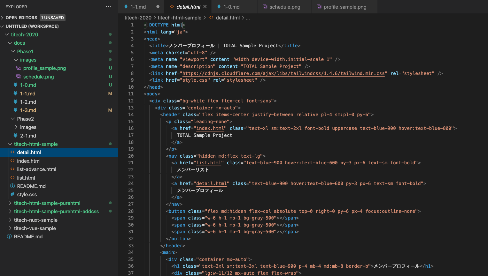

---

## セットアップしよう

以下のURLからダウンロードして、
特に設定変更はせずにインストールしましょう。
https://code.visualstudio.com/

---

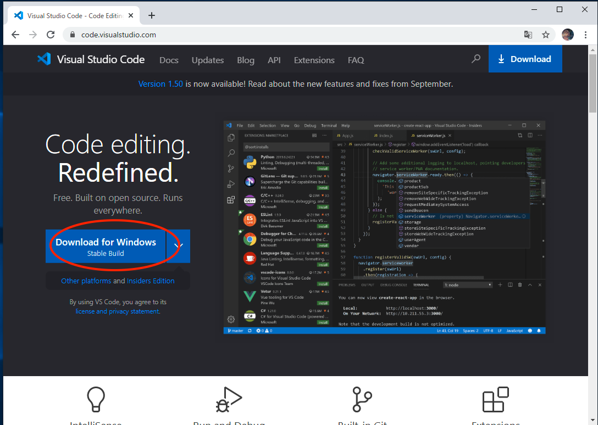
ここからダウンロードしてください。

---

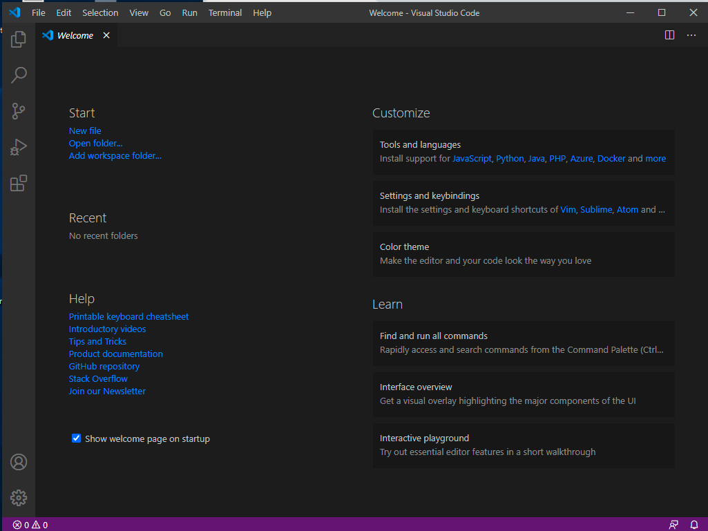
この画面が表示されれば、完了です。

---

## 以下のプラグインをインストールしよう
- Marp for VS Code
- etc

---

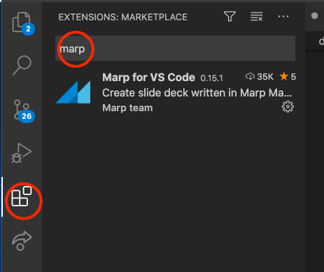

---

# バージョン管理ツール

## なぜ必要なの？
開発中のコードのバージョン管理をすることで、
特定の開発タイミングの状態に戻る／進むといったことが容易になったり、
他の開発者との共同編集がやりやすくなります。

---


出典：[GitとSubversionの構造的な違い - Ricksoft Blog](https://www.ricksoft.jp/blog/archives/9483/)

---

## 何を使うの？何ができるの？)
- git（バージョン管理システム）
- github（リポジトリのホスティング ＆ 様々な開発支援機能）

---

## セットアップしよう
以下のURLからダウンロードして、
特に設定変更はせずにインストールしましょう。
https://git-scm.com/downloads

---

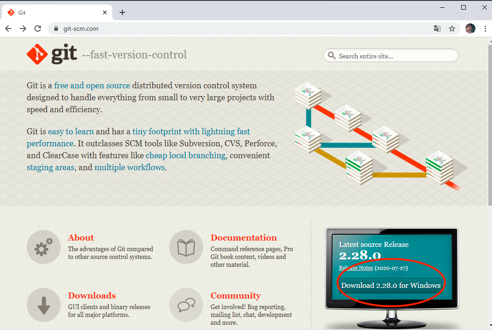

---

## はじめてのクローン
本日からの講義で利用するコード一式を、
クローン（リモートリポジトリをローカルリポジトリに複製）してみよう。

1. GitHubのアカウント（無料）をあらかじめ作っておきましょう
    - https://github.com/
1. ファイルエクスプローラーからクローンした一式を置きたいディレクトリで、右クリックしてメニューを開く。
1. 「Git Bash Here」を選択して、Git Bash（Git操作するためのコマンド入力画面）を立ち上げる。
1. コマンド` git clone https://github.com/GuildWorks/titech-2020.git `を実行する
1. ログインを要求されたら、あらかじめつくっておいたアカウントのID/Passwordを入力する

---

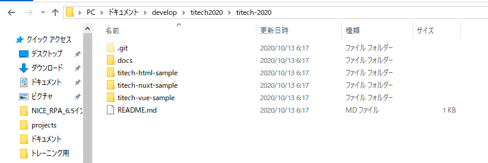
こんなファイル一式が配置されているはず。

---

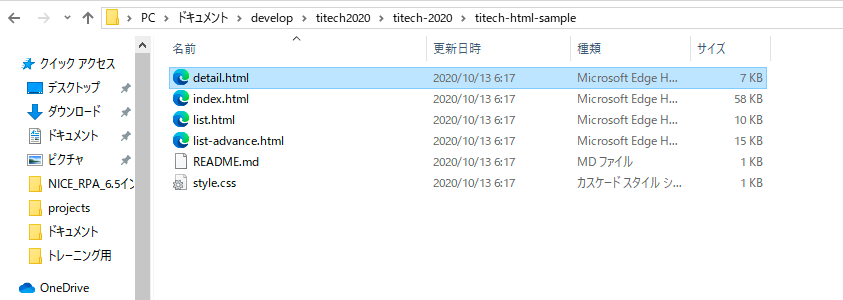
titech-html-sampleフォルダの配下を見ると、HTMLファイルがある。

---

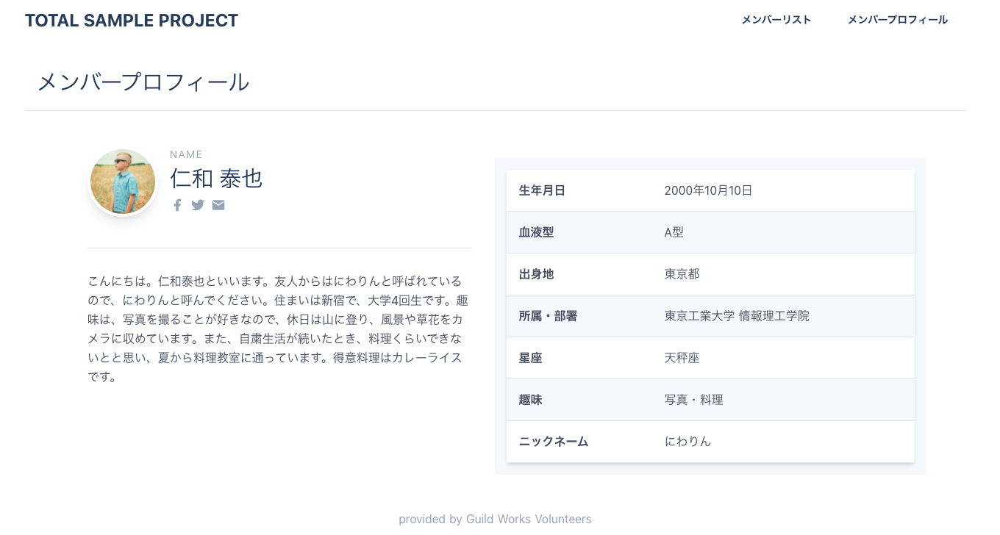
detail.htmlを開くと、今日の最終形が確認できます。

---

## vscodeで開いてみよう

1. vscodeの上部メニューの「File」を選択
1. 「Open Folder...」を選択
1. クローンしてきたフォルダを選択する

---

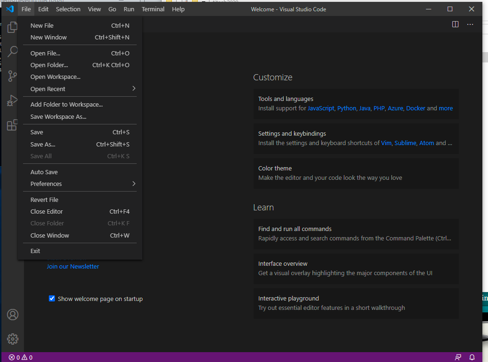

---


---

# Node.js / npm

## なぜ必要なの？
Node.jsとはネットワークアプリケーションを
構築するために設計されたJavaScript環境です。

第二回以降でアプリケーションの実行やパッケージ管理に
必要になってきます。

---

## セットアップしよう

以下からダウンロードして、特に設定を変えずにインストールしましょう。
https://nodejs.org/en/download/

---

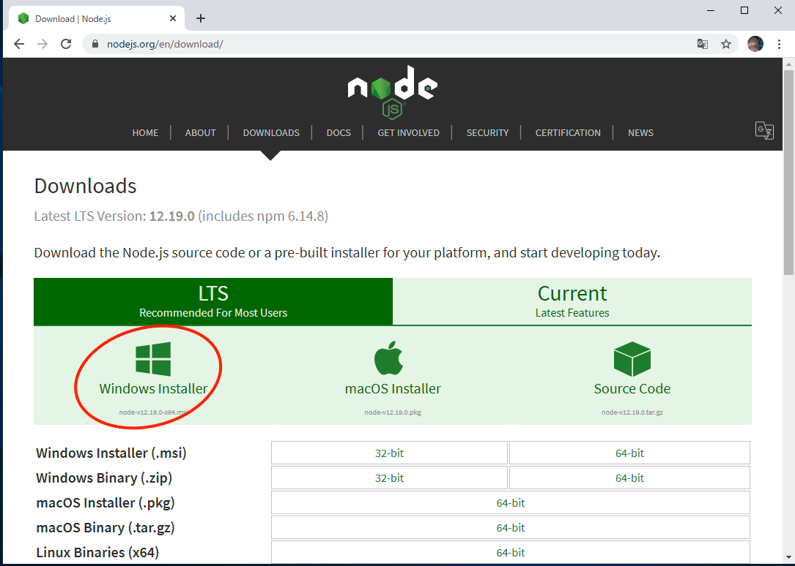

---

先ほどのgit bashの画面から以下のコマンドをうってみましょう。
```
node --version
```
バージョンが返ってきたら正常にインストールできています。
```
v12.19.0
```

---

## サンプルプロジェクトを動かしてみましょう
titech-nuxt-sampleのフォルダでgitbashを開いて、
以下のコマンドを実行してみましょう。

```
npm install
```
※完了まで時間がかかります。

```
npm run dev
```
---

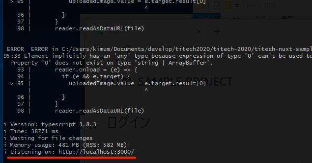

---

以下のURLにアクセスしましょう。
http://localhost:3000/

---

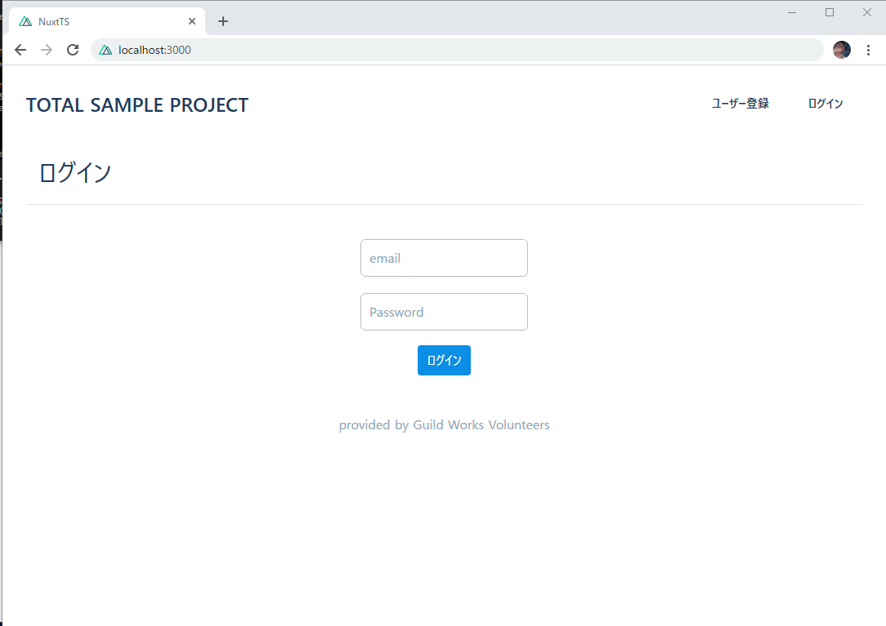

---


# 開発環境のセットアップ、おわり

質問はありますか。