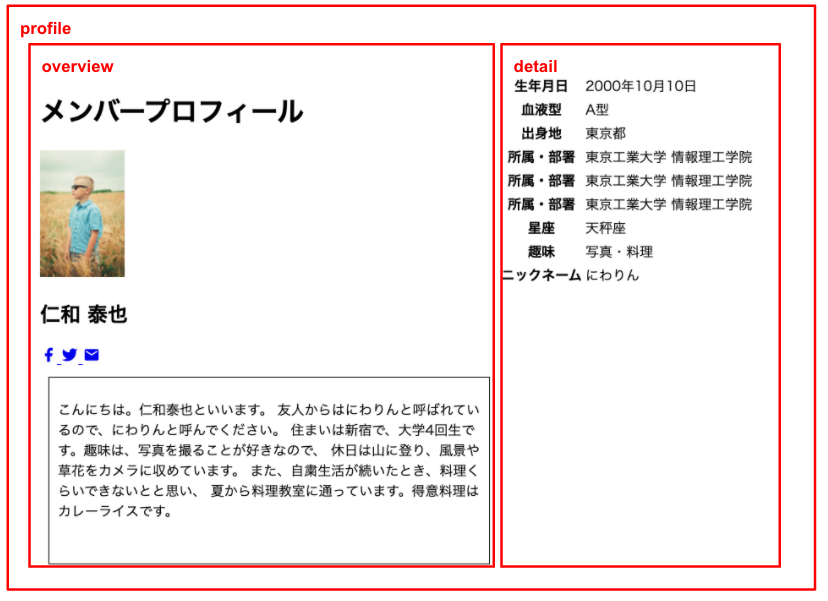

<!-- page_number: true -->
<!-- paginate: true -->

# Decorate your screen with CSS

---


---

## What is CSS?

Cascading Style Sheets

A language that defines HTML styles.
Styles can be defined step by step for the structure of HTML.

---

## How do you write it?

There are three ways.
- Embed directly in the element
- Embed in page header
- Read what is defined in another file (recommended)

---

## Embed directly in the element
```
<header style="background-color: red;">
```

## Embed in page header
```
<head>
    ~ Omitted ~
    <style type="text/css">
        main {
            background-color: blue;
        }
    </style>
</head>
```

---

## Cut out to another file
Create a file called style.css in the same location as HTML.
Define reading in HTML.
```
    <head>
        ~ Omitted ~
        <link rel="stylesheet" href="style" .css ">
        ~ Omitted ~
    </head>
```

Let's define a style in the CSS file.

```
footer {
    background-color: yellow;
}
```

---

## How to specify the style
```
header {
    background-color: red;
    color: white;
}
main {
    background-color: blue;
}
```
- Specify a property (designable style name) and a set of values ​​for the selector (style application target)
- Separate each set of properties and values ​​with a semicolon

---

## How to write a selector
```
#greeding {
    font-size: 20px;
}
.icon {
    color: gray;
}
header, footer {
    background-color: lightgray;
}
p {
    background-color: lightblue;
}
.description p {
    color: # 800000;
}
```

---

- In addition to tags, attributes can be specified by adding id and class to HTML.
    - The same value of id must not be duplicated on the screen. In CSS, specify by prefixing with "#".
    - You may specify the same value for class more than once on the screen. In CSS, specify by prefixing with ".".
- Can be separated by a space and specified by the element structure
- Multiple elements can be specified by separating them with commas.

---

## Decorate the characters
There are properties to decorate the text, such as:
```
.description p {
    color: # 800000;
    font-size: 14px;
    font-weight: bold;
    font-family: "Meiryo UI", "Hiragino Maru Gothic ProN";
}
```
The above is just an example, and there are many, so
Search for a reference to see what you can do.

---

## Format blocks
There are properties to format block-level elements as follows:
```
.description {
    border: 1px solid black;
    margin: 10px;
    padding: 10px;
    width: 500px;
    height: 200px;
}
```

---

## Lay out blocks
Let's lay out the blocks.

---



---
```
<main>
    <div id="profile">
        <div id="overview">
            <h1>
                Member profile
            </h1>
            ~ Omitted ~
            <div class="description">
                ~ Omitted
            </div>
        </div>

        <div id="detail">
            <table>
                ~ Omitted ~
            </table>
        </div>
    </div>
</main>
```
Use the div tag to separate the main tag into blocks.
Make a hierarchy in which overview and detail are lined up in profile.

---

```
#profile {
    display: flex;
}
```

- display: A property that specifies the display format of the element
    - flex: Flexible arrangement of boxes in the element.

The screen is laid out with blocks arranged in layers or arranged side by side.
Let's firmly acquire this idea.

You can also specify other details, such as grid, float, position, etc.
There are other layout techniques, but
I will omit it here. If you are interested, check it out.

---

## Use CSS framework

So far you've learned the basics of writing CSS.
At the development site, instead of transcribing the CSS from scratch,
I often use a CSS framework.

A standard set of designs is pre-coded and
By writing HTML according to the rules of the CSS framework,
The design will be applied without permission.

Let's decorate the screen with the CSS framework.

---

## Types of CSS frameworks

- Bootstrap
    - https://getbootstrap.jp/
- Bulma
    - https://bulma.io/
- Tailwind
    - https://tailwindcss.com/

This time I will use Tail Wind.
A lightweight and easy-to-customize CSS framework
It is becoming more and more popular.

---

## As the first stage

Adopted by many CSS frameworks
I will introduce two general concepts as a way of designing.

- Responsive web design
- Grit layout

---

## Responsive web design

By dynamically switching the CSS to be applied according to the screen width,
The idea is to support display on devices with various screen widths.


Source: [[Introduction] What is Responsive Web Design? A detailed explanation of the outline and how to make it](https://www.kagoya.jp/howto/webhomepage/responsive/)

---

## Grid layout

The idea is to divide the screen into columns such as 12 and 16 and lay it out.
It is possible to change the number of columns used for each element depending on the screen width, so
It goes well with responsive web design.

---


Source: [Grid layout and broken lit layout](https://web.landgarage.co.jp/2018/05/25/gurittotobrorkon/)

---

## Preparation

```
<head>
    ~ Omitted ~
    <link href="https://unpkg.com/tailwindcss@^1.0/dist/tailwind.min.css" rel="stylesheet">
    <link rel="stylesheet" href="style.css">
<head>
```

Let's declare the loading of tailwind css in the head.

---

## How to write

As with many CSS frameworks,
By attaching a fixed class to the element,
Predefined css is applied.

---

## Let's specify the design of the screen outline

```
<body>
    <div class="bg-white flex flex-col font-sans text-gray-600">
        <div class="container mx-auto">
            ~ Omitted ~
        </div>
    </div>
</div>
```

- bg-{color}: Specify the background color
- font-{family name}: Specify the font family
- text-{color}-{darkness}: specify the color of the text
- flex: Specifies that it is a flex box
- flex-{direction}: Specify in which direction to place the content in flexbox
- container: Make the maximum width nice by enclosing the entire content
- m {location}-{quantity}: Specify the margin. Centering by specifying auto

---

## Apply a design to the header

```
<header class="flex items-center justify-between relative pl-4 sm: pl-0 py-6">
    <p class="leading-none">
        <a href="#" class="text-xl sm: text-2xl font-bold text-blue-900 hover: text-blue-800">
            SAMPLE PROJECT
        </a>
    </p>
    <nav>
        <a href="list.html" class="text-blue-900 hover: text-blue-600 py-3 px-6 text-sm font-bold">
            member list
        </a>
        <a href="detail.html" class="text-blue-900 hover: text-blue-600 py-3 px-6 text-sm font-bold">
            Member profile
        </a>
    </nav>
</header>
```

---
- flex: Specifies that it is a flex box
- justify-{How to align}: Specify how to align when arranging in flex box
    -(How to move in the direction of arrangement)
- item-{How to gather}: Specify how to gather when arranging in the flex box
    -(How to align perpendicular to the direction of arrangement)
- p {location}-{quantity}: specify padding
- leading-{height}: Specify the row height
- sm/md/lg/xl: Specify screen size conditions to apply the design
- text-{size}: Specify the size of the text
- text-{color}-{darkness}: specify the text color
- hover/focus: Specify the condition of the state of the element to which the design is applied
- font-{Weight}: Specifying the weight (thickness) of the font

---

## Responsive navigation

```
<nav class="hidden md: flex text-lg">
    ~ Omitted ~
</nav>
<button class="flex md: hidden flex-col absolute top-0 right-0 py-6 px-4">
    <span class="w-6 h-1 mb-1 bg-gray-500"> </span>
    <span class="w-6 h-1 mb-1 bg-gray-500"> </span>
    <span class="w-6 h-1 mb-1 bg-gray-500"> </span>
</button>
```

- hidden: hide the box
- absolute: Place by specifying the absolute position

---
## Let's lay out the main part
```
<h1>
    Member profile
</h1>
<div class="lg: w-11/12 mx-auto flex flex-wrap">
    <div class="p-4 lg: px-8 lg: w-1/2 w-full">
        
        ~ Omitted ~
    </div>
    <div class="p-4 bg-gray-100 mt-8 lg: w-1/2 w-full">
        <table>
        ~ Omitted
        </table>
    </div>
</div>
```
w-{Size}: Width specification. You can also specify the ratio to the parent element such as 1/2
flex-{wrapping method}: Specifies the movement when the element in the flex box protrudes

---

## Let's put a design on the headline
```
<h1 class="text-2xl sm: text-3xl text-blue-900 p-4 mb-4 md: mb-8 border-b"> Member profile </h1>
~ Omitted ~
<h2 class="text-blue-900 text-2xl sm: text-3xl title-font font-medium mb-1"> Yasuya Niwa </h2>
```
border-{Alignment}: Specify the display of the border

---
## Let's lay out the image/name part

```
<div class="flex items-start">
    <div>
        
    </div>
    <div>
        <h2 class="text-blue-900 text-2xl sm: text-3xl title-font font-medium mb-1">
            Yasuya Niwa
        </h2>
        ~ Omitted ~
    </div>
</div>
```

---
## Let's cut the image coolly
```
<div class="shadow-lg h-20 w-20 sm: h-24 sm: w-24 border-white rounded-full overflow-hidden border-4 mr-4">
    
</div>
```
- shadow-{Shadow size}: Specify the shadow
- rouded-{size}: Specify the roundness of the corners
- overflow-{method}: Specify what to do if the contents of the box exceed the size of the box

---

## Let's lay out the icon
```
<div class="flex mb-4">
    <a href="#" class="ml-2 text-gray-500">
    <svg ~ Omitted ~ class="w-5 h-5">
        <path ~ omitted ~> </path>
    </svg>
    <a href="#" class="ml-2 text-gray-500">
    <svg ~ Omitted ~ class="w-5 h-5">
        <path ~ omitted ~> </path>
    </svg>
    </a>
    <a href="#" class="ml-2 text-gray-500">
    <svg ~ Omitted ~ class="w-5 h-5">
        <path ~ omitted ~> </path>
    </svg>
    </a>
</div>
```
---

## Let's design for self-introduction
```
<hr class="my-4 sm: my-8" />
<p class="leading-relaxed">
    Text
</p>
```
hr tag: A tag that draws a horizontal line

---

## Apply the design to the table

```
<div class="p-4 bg-gray-100 mt-8 lg: w-1/2 w-full">
    <div class="shadow-md rounded overflow-y-auto">
        <table class="w-full text-md bg-white">
            <tbody>
                <tr class="border-b bg-gray-100">
                    <th class="p-4 whitespace-no-wrap text-left"> date of birth </th>
                    <td class="p-4"> October 10, 2000 </td>
                </tr>
                ~ Omitted ~
            </tbody>
        </table>
    </div>
</div>
```
- whitespace-{Rule}: Specify how to handle line breaks

---

## Let's design the footer

```
<footer class="p-4">
<p class="text-gray-500 font-xs text-center mt-5">
    provided by GuildWorks Inc.
    </p>
</footer>
```

---
## Finally

I learned how to write CSS and Tailwind.
A lot of properties came out,
I think you can now imagine what you can do.

From now on, while looking at the reference
Let's make a page.