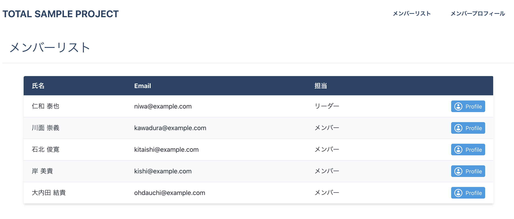
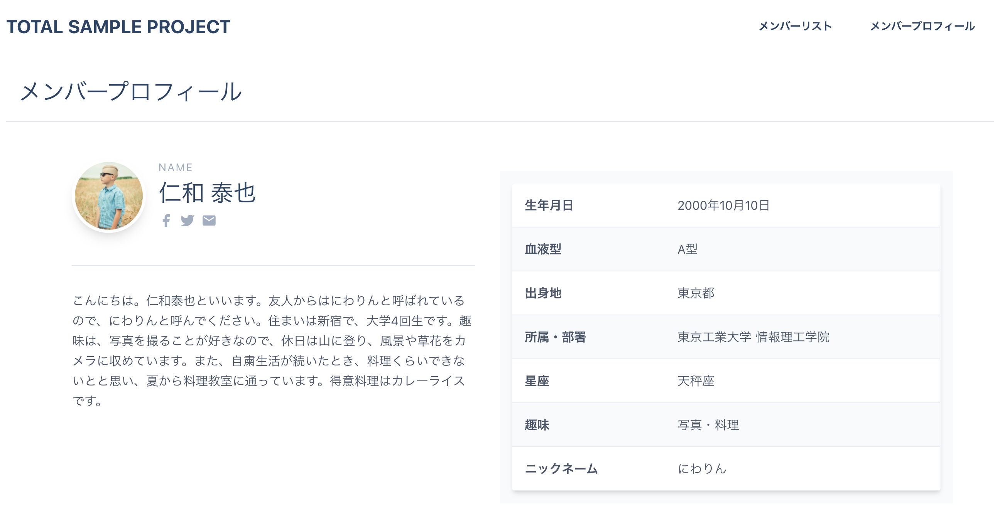
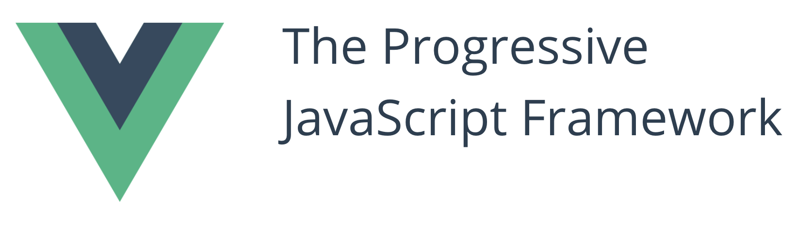
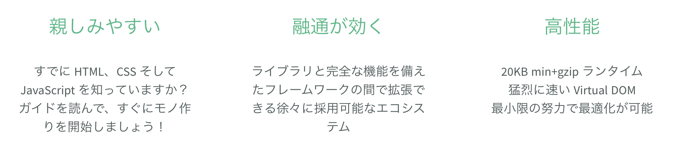
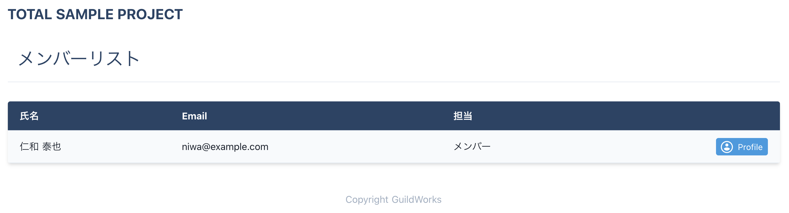
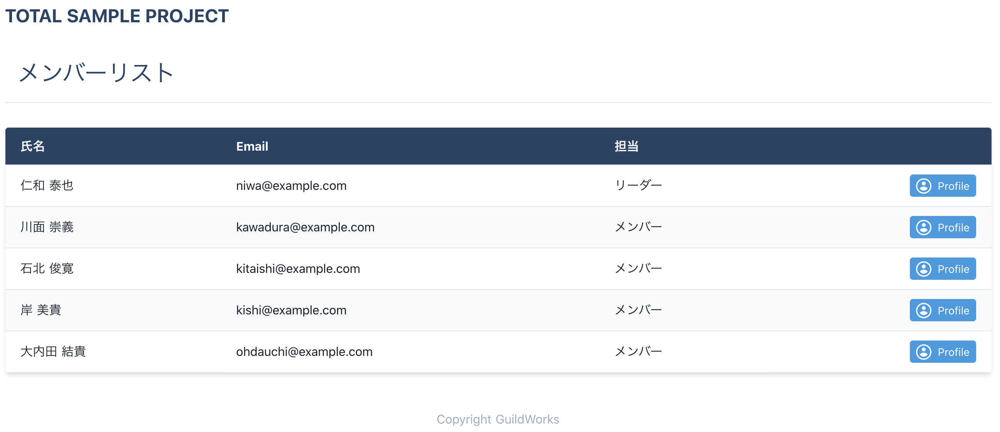
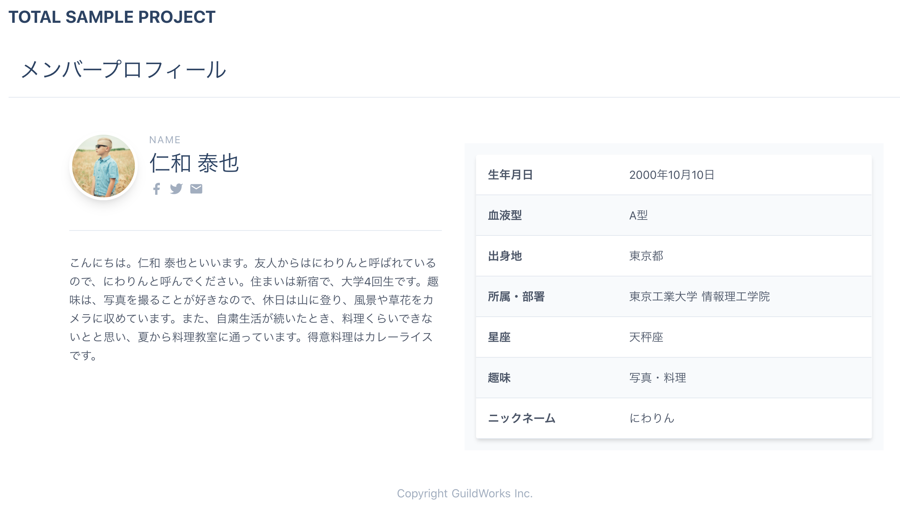

# Part 2: Let's Create a Screen with Movement with JavaScript (Vue.js)

**Titech 2020/10/31**
　
　
　
　
　
　
　　　　　　　　　　　　　　　　　　　　　　　　**Junichiro Ueno**


---

<!--
_color: white
_footer: 'Photo by https://pixabay.com/images/id-975513/'
-->

# Part 2: Let's Create a Screen with Movement with JavaScript (Vue.js)

**Titech 2020/10/31**
　
　
　
　
　
　
　　　　　　　　　　　　　　　　　　　　　　　　**Junichiro Ueno**


---

### :jack_o_lantern: Retrospective :jack_o_lantern:

:white_check_mark: After completing the basics of HTML, CSS, and JavaScript
The next step is to experience web application development in earnest.

If you didn't attend last time and are new to the event, please drop the latest code from Github first.

[https://github.com/GuildWorks/titech-2020](https://github.com/GuildWorks/titech-2020)

**参考**
[Previous reference (building environment)](https://github.com/GuildWorks/titech-2020/blob/master/docs/Phase1/1-1.md)

---

:white_check_mark: Previously, we used HTML, CSS, and JavaScript to create
Member list and member details are ~~ completed. ~~ **Not done. **

I won't go into the details of HTML and CSS in this article, but
I'll explain what you need to do as I write the code one by one.
If you have any questions, please ask.

:imp: **If no one asks questions, there's a chance we'll dump them on you.**:dart:

---

#### :jack_o_lantern: Member List :jack_o_lantern:


---

#### :jack_o_lantern: Member Details :jack_o_lantern:


---

### :jack_o_lantern: Get the latest data! :jack_o_lantern:

:white_check_mark: Navigate to the titech-2020 folder where you want to save the file and Let's execute the following command with `git bash` or `Terminal`.

```
git pull
```

:white_check_mark: The latest data was obtained.
If you can find this document under `docs/Phase2`, it's a success.

---

### :jack_o_lantern: What is Vue.js? :jack_o_lantern:



:jp:： [https://jp.vuejs.org/](https://jp.vuejs.org/index.html)
:us:： [https://vuejs.org/](https://jp.vuejs.org/index.html)

---

### :jack_o_lantern: Running the Development Environment :jack_o_lantern:

:white_check_mark: Last time, we'll even get to the point where we can already `npm run dev` in building the environment.
This time we will always run this command.

:scroll: Go to the `titech-2020/titech-nuxt-tutorial` folder and click
Let's execute the following command with `git bash` or `Terminal`.

```
npm install
```

When you're done.

```
npm run dev
```

---

#### :jack_o_lantern: Top page :jack_o_lantern:


---

### :jack_o_lantern: Confirmation :jack_o_lantern:

Once you've done so, let's check the contents.

:white_check_mark: **Checking the source code**

Let's open the following file in Visual Studio Code.
:scroll: `titech-2020/titech-nuxt-tutorial/pages/index.vue`

---

```
<template>
  <div
    class="flex flex-col-reverse sm:flex-row jusitfy-between items-center py-12"
  >
    <div
      class="sm:w-2/5 flex flex-col items-center sm:items-start text-center sm:text-left"
    >
      <h1
        class="text-6xl text-blue-900 font-bold leading-none tracking-wide mb-2"
      >
        Programming Boot Camp #2
      </h1>
      <h2
        class="text-4xl text-blue-500 text-secondary tracking-widest mb-6"
      >
        Vue.js/Nuxt.js
      </h2>
      <p class="text-gray-600 leading-relaxed mb-6">
        <a href="https://vuejs.org/index.html" class="text-blue-900">Vue.js</a>
        と
        <a href="https://ja.nuxtjs.org/" class="text-blue-900">Nuxt.js</a>
      </p>
    </div>
    <div class="mb-16 sm:mb-0 mt-8 sm:mt-0 sm:w-3/5 sm:pl-12">
      <SvgImage />
    </div>
  </div>
</template>
<script lang="ts">
import { defineComponent } from 'nuxt-composition-api'
import SvgImage from '@/components/svg-image.vue'
export default defineComponent({
  components: {
    SvgImage,
  },
})
</script>
<style></style>
```

---

### :jack_o_lantern: 説明 :jack_o_lantern:

:white_check_mark: The `Vue` allows you to write code in three different areas.

- It's easy to write in one file and understand:question::question::question:

:white_check_mark: The contents of the `.vue` file are a collection of what we learned last time.

- Doesn't it seem to make sense to you?:question::question::question:

:white_check_mark: Let's take a look at each area.

---

### :jack_o_lantern: template :jack_o_lantern:

```
<template>
  ...
</template>
```

:white_check_mark: This is the area for writing the `HTML` we learned last time.

You can write the `HTML` in `<template>` to `</template>`.

:white_check_mark: The `Vue` allows you to write not only `HTML` but also `code`.

:white_check_mark: And how to write.

---

```
<template>
  <div>
    ...
  </div>
</template>
```

:warning: The outermost tag in the `<template>` must be a single tag.

```
<template>
  <div>...</div>
  <div>...</div>
</template>
```

:x: This will result in an error.:cry:

---

### :jack_o_lantern: script :jack_o_lantern:

```
<script lang="ts">
  ...
</script>
```

:white_check_mark: This is the area where we learned to write JavaScript last time.

`lang="ts"`

:bulb: It actually specifies a language called ["TypeScript"](https://www.typescriptlang.org/).
　 "TypeScript" is a mainstream programming language that is an alternative to "JavaScript.

**Simply put, it's "type definable JavaScript".**

---

```
<script  lang="ts">
import { defineComponent } from 'nuxt-composition-api'
import SvgImage from '@/components/svg-image.vue'
export default defineComponent({
  components: {
    SvgImage,
  },
})
</script>
```

```import { defineComponent } from 'nuxt-composition-api'```

:beginner: This is a spell.
First of all, let's remember that the `defineComponent` is available.

---

```import SvgImage from '@/components/svg-image.vue'```

:beginner: Similarly, this is a declaration for using `svg-image.vue`.

The above specification enables you to use files containing `svg(Scalable Vector Graphics)`.

:bulb: Components are used to divert parts, etc.

---

```
export default defineComponent({
  components: {
    SvgImage,
  },
})
```

By specifying what you want to use in the `components`, you can set the
Available in the `<template>`.

**use case**
```
<div class="mb-16 sm:mb-0 mt-8 sm:mt-0 sm:w-3/5 sm:pl-12">
  <SvgImage />
</div>
```

---

The following sections are loaded and displayed.


---

### :jack_o_lantern: style :jack_o_lantern:
```
<style>
  ...
</style>
```

:white_check_mark: This is the area where you write the CSS you learned last time.

I learned last time [Tailwind](https://tailwindcss.com/) is useful, so I may not use it much.

This is where we'll look at this later in the exercise.

---

### :jack_o_lantern: Exercises :jack_o_lantern:

:white_check_mark: You may have gotten the gist of it, but I don't think you're quite sure yet.
　
　
　
　
　
　
:muscle: Let's actually proceed.

---

### :jack_o_lantern: Creating a list page :jack_o_lantern:

:scroll: `titech-nuxt-tutorial/pages/list.vue`

```
<template>

</template>
<script lang="ts">

</script>
<style>

</style>
```

:innocent: There's nothing inside yet.
:pencil2: Let's add the code.

---

:white_check_mark: Before we do that, let's take another look at the finished image.


---

```
<template>
  <div>
    <h1 class="text-2xl sm:text-3xl text-blue-900 p-4 mb-4 md:mb-8 border-b">メンバーリスト</h1>
  </div>
</template>
```

:white_check_mark: Let's add the above from `<template>` to `</template>`.

:white_check_mark: If the `npm run dev` is running, it should automatically reflect the saved code.

:bulb: View [http://localhost:3000/list](http://localhost:3000/list) in your browser.

:white_check_mark: The next one will be more at once.
　 For now, let's just copy and paste.

---

```
<template>
  <div>
    <h1 class="text-2xl sm:text-3xl text-blue-900 p-4 mb-4 md:mb-8 border-b">メンバーリスト</h1>
    <div class="list-table shadow-md sm:rounded overflow-y-auto">
      <table class="w-full text-md bg-white">
        <thead>
          <tr class="border-b bg-blue-900 text-white">
            <th class="text-left p-3 px-5">氏名</th>
            <th class="text-left p-3 px-5">Email</th>
            <th class="text-left p-3 px-5">担当</th>
            <th></th>
          </tr>
        </thead>
        <tbody class="text-gray-900">
          <tr
            class="border-b bg-gray-100"
          >
            <td class="py-3 px-5 whitespace-no-wrap sm:whitespace-normal">
              仁和 泰也
            </td>
            <td class="py-3 px-5 whitespace-no-wrap sm:whitespace-normal">
              niwa@example.com
            </td>
            <td class="py-3 px-5 whitespace-no-wrap sm:whitespace-normal">
              メンバー
            </td>
            <td class="py-3 px-5">
              <div class="flex justify-end items-center">
                <a
                  :href="'/user/0001'"
                  class="text-sm bg-blue-500 hover:bg-blue-700 text-white py-1 px-2 rounded focus:outline-none focus:shadow-outline flex items-center"
                >
                  <span
                    class="rounded-full w-5 h-5 bg-white p-0 border-px border-white inline-flex items-center justify-center text-blue-500 mr-2"
                  >
                    <svg
                      fill="currentColor"
                      class="w-5 h-5"
                      xmlns="http://www.w3.org/2000/svg"
                      viewBox="0 0 24 24"
                    >
                      <path d="M0 0h24v24H0z" fill="none" />
                      <path
                        d="M12 2C6.48 2 2 6.48 2 12s4.48 10 10 10 10-4.48 10-10S17.52 2 12 2zm0 3c1.66 0 3 1.34 3 3s-1.34 3-3 3-3-1.34-3-3 1.34-3 3-3zm0 14.2c-2.5 0-4.71-1.28-6-3.22.03-1.99 4-3.08 6-3.08 1.99 0 5.97 1.09 6 3.08-1.29 1.94-3.5 3.22-6 3.22z"
                      />
                    </svg>
                  </span>
                  Profile
                </a>
              </div>
            </td>
          </tr>
        </tbody>
      </table>
    </div>
  </div>
</template>
```

---



:bulb: Would you have gotten a screen like this?

:white_check_mark: You've shown one person on the member list.

:beginner: This is where it starts to feel like a real programming thing, but
But first, here's a quick foundation.

---

### :jack_o_lantern: Programming Basics :jack_o_lantern:

:warning: More on types and variables in #3.

**What is Type**

**Primitive type**
`string` is a string
`number` is a number
`boolean` is a boolean

**References**
[TypeScriptの型入門](https://qiita.com/uhyo/items/e2fdef2d3236b9bfe74a)

---

### :jack_o_lantern: Variable :jack_o_lantern:

```
const label: string = "MemberList" // OK
const label: string = 3            // NG

const num: number = 3              // OK
const num: number = "3"            // NG

const bool: boolean = true         // OK
const bool: boolean = "false"      // NG
```

:white_check_mark: Incorrect type is an error.

---

```
const label: string = "MemberList"
label = "Change" // NG

let label2: string = "MemberList"
label2 = "Change" // OK
```

:white_check_mark: Use `const` if it is immutable and `let` if it is variable.

---

### :jack_o_lantern: 配列 :jack_o_lantern:

```
const name: string[] = ["上野", "今橋", "京極"]
name.push("金")                               // 配列の最後に`金`を追加する

console.log(name)                            // ["上野", "今橋", "京極", "金"]
console.log(name[1])                         // "今橋"
```

If you have more than one piece of data, use an array.

:warning: Note that the array starts from `0`.

**supplement**
`shift()` removes the head, `pop()` removes the tail

---

For now, that's it for the basics:dash:
　
　
　
:white_check_mark: Is there anything that is not clear to you?:question::question::question:
　
　
　
　
　
:muscle: So let's get back to it.

---

### :jack_o_lantern: ダミーデータの用意 :jack_o_lantern:

:scroll: `titech-nuxt-template/mock/userlist.json`

```
{
  "userlistData": [
    {
      "id": "0001",
      "name": "仁和 泰也",
      ...
    },
  ]
}
```

This is a file called `json` that defines the dummy data.

---

### :jack_o_lantern: Importing dummy data :jack_o_lantern:

:scroll: `titech-nuxt-tutorial/pages/list.vue`

:white_check_mark: First, let's copy and paste.
　 Then, let's see what's inside.

---

```
<script lang="ts">
import { defineComponent, reactive } from 'nuxt-composition-api'
import userlistJson from '@/mock/userlist.json'
type UserList = {
  id: string
  name: string
  email: string
  role: string
  iconUrl: string
  profile: {
    title: string
    detail: string
  }[]
}
export default defineComponent({
  setup(_) {
    const userList = reactive<UserList[]>(userlistJson.userlistData)
    return {
      userList,
    }
  },
})
</script>
```

---

```
import userlistJson from '@/mock/userlist.json'
```

:white_check_mark: The name of `userlistJson` is defined as the dummy data mentioned above.

:memo: I said `import` is a declaration to use the file.
You should give it a name when you use it.
In this case, we named the file `userlistJson`.

---

```
type UserList = {
  id: string
  name: string
  email: string
  role: string
  iconUrl: string
  profile: {
    title: string
    detail: string
  }[]
}
```

:white_check_mark: It's called a type alias, but
It's a useful way to define types.

:bulb: If the type is different, you'll notice the error.

---

```
export default defineComponent({
  setup(_) {
    const userList = reactive<UserList[]>(userlistJson.userlistData)
    return {
      userList,
    }
  },
})
```

:interrobang: There are more unfamiliar ones again.

The `setup(_)` is what is executed when this page is called.
It returns `return` if you want to use it in `<template>`.

---

```
const userList = reactive<UserList[]>(userlistJson.userlistData)
```

:scroll: In the file `titech-nuxt-tutorial/mock/userlist.json`, you can find
Get the dummy data with `userlistJson.userlistData`.

---

```
{
  "userlistData": [
    ...
  ]
}
```

:white_check_mark: Get the `userlistData` in a file with the name specified in the `import`.

:white_check_mark: An error is avoided by specifying the array of `UserList` which is defined by the type alias.

:white_check_mark: Set the dummy data to `return` so that it can be used in `<template>`.

---

:white_check_mark: Now that we have the dummy data, let's display it in the member list.

```
<tr
  v-for="(user, index) in userList"
  :key="index"
  class="border-b bg-gray-100"
>
```

:white_check_mark: Add the above to `tr` on line 17.

:bulb: If you view it in your browser, you'll see a lot of `仁和`.
Still, it's a success for once.

---

### :jack_o_lantern: for statement :jack_o_lantern:

```
v-for="(user, index) in userList" :key="index"
```

:white_check_mark: In `Vue.js`, you can run a loop in `template`.

:white_check_mark: userList`This is the one set to `return` in the `<script>`.
It contains an array of dummy data.

:white_check_mark: Here, we want to get the data one by one from the array, so we use `for`.

---

:white_check_mark: `(user, index)` Now one of the arrays is stored in `user`.

:white_check_mark: `index` contains the index (counter).

---

:question: The only thing that comes up in a loop is `仁和`
　 This is because we are not using the data we have acquired.

```
<td class="py-3 px-5 whitespace-no-wrap sm:whitespace-normal">
  仁和 泰也
</td>
```

The name is specified as a fixed value, so it doesn't matter how many times you loop over it, it's always the same name!:sweat:

---

:white_check_mark: Make changes to make your data available.

```
<td class="py-3 px-5 whitespace-no-wrap sm:whitespace-normal">
  {{ user.name }}
</td>
```

That's it.
:white_check_mark: You can use variables in `<template>` by enclosing them in `{{ }}` and raising them.

:white_check_mark: Because the variable `user` contains one data each, you can get the name of a user with `user.name`.

:bulb: When you view it in your browser, it's just the name that has changed to dummy data.

---

:white_check_mark: Let's change the other data as well.

```
<td class="py-3 px-5 whitespace-no-wrap sm:whitespace-normal">
  {{ user.email }}
</td>
<td class="py-3 px-5 whitespace-no-wrap sm:whitespace-normal">
  <template v-if="user.role === 'admin'">リーダー</template>
  <template v-else>メンバー</template>
</td>
```

:white_check_mark: The `Email` and `in-charge` have also been changed.

:interrobang: If you look closely, there's another unfamiliar `v-if` and `v-else`.

:white_check_mark: This is also available in `Vue`.

---

### :jack_o_lantern: if statement :jack_o_lantern:

```
<template v-if="user.role === 'admin'">リーダー</template>
<template v-else>メンバー</template>
```

:white_check_mark: If the condition of `v-if` is `true`, it is executed.
:white_check_mark: If the condition is `false`, `else` is executed.

:eyes: Dummy data is `admin` only for `仁和` and `member` for the others.

Therefore, only `仁和` becomes a leader since the contents of `user.role` are checked for `admin`.
(`===` will be `true` if the value is the same, or `false` if the value is different.)

---

:bulb: When you click on the Profile button, you'll see
You want to be taken to that person's details page.

:white_check_mark: Let's make some changes there too.
(We don't have a detailed page yet.)

```
:href="'/user/' + user.id"
```

:man_with_gua_pi_mao: `仁和`
http://localhost:3000/user/0001
:man_with_turban: `川面`
http://localhost:3000/user/0002

---

:white_check_mark: Also adjust the look and feel at the end of the list.

```
<style>
tbody tr:nth-child(odd) {
  @apply bg-white;
}
</style>
```

:white_check_mark: Added CSS in `style`.
When a line is `odd` (odd number), the color of the line is set to white.

---

### :jack_o_lantern: Complete the list :jack_o_lantern:



---

### :jack_o_lantern: One more thing :jack_o_lantern:

:bulb: Let's give it one more try.

:question: It's not so easy to use that you have to click on a button to go to a detailed page.

:white_check_mark: Let's change it so that you can click anywhere in a row to transition.

:white_check_mark: Let's also make it easier to understand when the cursor is on a line.

---

```
  setup(_) {
    const userList = reactive<UserList[]>(userlistJson.userlistData)
    const userLink = (userId: string): void => {
      window.location.href = '/user/' + userId
    }
    return {
      userList,
      userLink
    }
  },
```

:white_check_mark: Let's change the `setup`.

---

```
<tr
  v-for="(user, index) in userList"
  :key="index"
  class="border-b bg-gray-100"
  @click="userLink(user.id)"
>
```

:white_check_mark: I'll also add a line in the `tr` tag with `v-for`.

---

:bulb: In addition, you'll learn something new.

```
const userLink = (userId: string): void => {
  window.location.href = '/user/' + userId
}
```

```
@click="userLink(user.id)"
```

:white_check_mark: Adds a function to be executed when clicked by `@click`.
:white_check_mark: Function `userLink` is called with the target `user.id` as an argument
:white_check_mark: `userLink` function creates a URL as if the user clicked the profile button.

---

### :jack_o_lantern: function :jack_o_lantern:

```
const userLink = (userId: string): void => {
  window.location.href = '/user/' + userId
}
```

:stuck_out_tongue: To be precise, it's called an arrow function. (Since `->` and `=>` are arrow-like.)

`(userId: string)` part is the list of arguments.
`: void` part defines the type of the return value.
`{ }` is what you want to execute.

:white_check_mark: If `userId` is `"0001"`, we go to `/user/0001`.

---

:white_check_mark: Let's also add one more thing to make it easier to understand when the cursor is above the line.

```
<tr
  v-for="(user, index) in userList"
  :key="index"
  class="border-b bg-gray-100 hover:bg-orange-100 cursor-pointer"
  @click="userLink(user.id)"
>
```

```
hover:bg-orange-100 cursor-pointer
```
:white_check_mark: Let's add these two things to the list.

---

A little improvement can change the usability quite a bit.:thumbsup:

It's fun to think about things and create something good!:heart:
　
　
　
　
:white_check_mark: That's the end of the list, now let's move on to the details:sparkles:

---

### :cookie: Create a detail page :ghost:

:scroll: `titech-nuxt-tutorial/pages/user/_id.vue`

```
<template>

</template>
<script lang="ts">

</script>
<style>

</style>
```

:innocent: Also, there is nothing inside.

---

:bulb: If you look closely, the file name is a little strange.

`_id.vue`

Isn't it `detail.vue` because it's detailed?

In fact, by setting `_id.vue`, you will be able to support a variable url, such as `/0001`.

:bulb: View [http://localhost:3000/0001](http://localhost:3000/0001) in your browser.

:white_check_mark: I'm sure the screen will show up, albeit empty.

:pencil2: Now let's add the code.

---

:white_check_mark: Before we do that, let's take another look at the finished image.


---

```
<template>
  <div class="container mx-auto">
    <h1 class="text-2xl sm:text-3xl text-blue-900 p-4 mb-4 md:mb-8 border-b">
      メンバープロフィール
    </h1>
  </div>
</template>
```

:white_check_mark: You've displayed the headline of your member profile.

:warning: It's the same headline on this list.

:bangbang: When you realize that, it's an opportunity for commonality.:bangbang:

:bulb: Speaking of which, you mentioned the components.:chocolate_bar::chocolate_bar::chocolate_bar:

---

#### :cookie: Creating Components :ghost:

:scroll: `titech-nuxt-template/components/page-heading.vue`

```
<template>
  <h1 class="text-2xl sm:text-3xl text-blue-900 p-4 mb-4 md:mb-8 border-b">
    <slot></slot>
  </h1>
</template>
```

:bulb: `<h1>` The same content is already in the content as the part of

:white_check_mark: There's a code called `<slot></slot>` for the first time.
This will be explained together with the call.

---

:scroll: `titech-nuxt-tutorial/pages/user/_id.vue`

```
<script lang="ts">
import { defineComponent, reactive, SetupContext } from 'nuxt-composition-api'
import PageHeading from '@/components/page-heading.vue'

export default defineComponent({
  components: {
    PageHeading,
  },
})
</script>
```

```
import PageHeading from '@/components/page-heading.vue'
```

:white_check_mark: Here's the definition.


---

```
components: {
  PageHeading,
},
```

:white_check_mark: This is where the components used are registered.

```
<template>
  <div class="container mx-auto">
    <PageHeading>メンバープロフィール</PageHeading>
  </div>
</template>
```

:white_check_mark: Change the contents of `template` from an `h1` tag to a `PageHeading` tag.

---

:bulb: component, you can now use the `PageHeading` tag.

```
<PageHeading>メンバープロフィール</PageHeading>
```

```
<h1 class="text-2xl sm:text-3xl text-blue-900 p-4 mb-4 md:mb-8 border-b">
  <slot></slot>
</h1>
```

:white_check_mark: The `slot` part is replaced by the `メンバープロフィール` between the `PageHeading` tags.

---

:white_check_mark: For the list, you can set up a `メンバーリスト` for them.

:scroll: `titech-nuxt-tutorial/pages/list.vue`
　
　
　
:doughnut: We'll skip it here, but if you make the same changes, the commonality is complete

---

:white_check_mark: We'll continue on.

:scroll: `titech-nuxt-tutorial/pages/user/_id.vue`

:black_joker: Replace all of the `script` with one.

---

```
<script lang="ts">
import { defineComponent, reactive, SetupContext } from 'nuxt-composition-api'
import PageHeading from '@/components/page-heading.vue'
import ProfileNameIcon from '@/components/profile-name-icon.vue'
import ProfileTable from '@/components/profile-table.vue'
import userlistJson from '@/mock/userlist.json'

type UserList = {
  id: string
  name: string
  email: string
  role: string
  iconUrl: string
  profile: {
    title: string
    detail: string
  }[]
}

export default defineComponent({
  components: {
    PageHeading,
    ProfileTable,
    ProfileNameIcon,
  },
  setup(_, { root }: SetupContext) {
    const userList = reactive<UserList[]>(userlistJson.userlistData)
    const userData = (): UserList => {
      if (
        userList.filter((user) => user.id === root.$route.params.id).length > 0
      )
        return userList.filter((user) => user.id === root.$route.params.id)[0]
      else
        return {
          id: '',
          name: '',
          email: '',
          role: '',
          iconUrl: '',
          profile: [
            {
              title: '',
              detail: '',
            },
          ],
        }
    }
    return {
      userData,
    }
  }
})
</script>
```

---

:white_check_mark: Is this what you're not used to seeing?

```
const userData = (): UserList => {
  if (
    userList.filter((user) => user.id === root.$route.params.id).length > 0
  )
    return userList.filter((user) => user.id === root.$route.params.id)[0]
  else
    return {
      id: '',
      ...
    }
}
```

:bulb: The `if` is basically the same as in `templete`.

---

```
if (
  userList.filter((user) => user.id === root.$route.params.id).length > 0
)
```

:white_check_mark: The `filter` extracts a specific condition from an array of dummy data.

:pushpin: Checking that `user.id` and `root.$route.params.id` are the same.

:o: [http://localhost:3000/user/0001](http://localhost:3000/user/0001)
:x: [http://localhost:3000/user/0009](http://localhost:3000/user/0009)

`0001` is `true` because it exists and `0009` is `false` because it does not exist.

---

#### :cookie: Tips :ghost:

:question: When you write logic, what's inside?:question::question::question:

:white_check_mark: You can check it by logging it.

```
console.log()
```

For example
```
console.log(userList.filter((user) => user.id === root.$route.params.id).length > 0)
```

:bulb: Let's view it in your browser.

---

:white_check_mark: If you're in Chrome, go to the Developer Tools.

When you view the following url, `console` will be marked as `true` or `false`.

:o: [http://localhost:3000/user/0001](http://localhost:3000/user/0001)は`true`
:x: [http://localhost:3000/user/0009](http://localhost:3000/user/0009)は`false`

:bug: It allows you to develop with real data instead of just thinking in your head.

:gift: If you're wondering what's in it, give it a try.
　
　
:back: Back to the explanation.

---

```
<template>
  <div class="container mx-auto">
    <PageHeading>メンバープロフィール</PageHeading>
    <div class="lg:w-11/12 mx-auto flex flex-wrap">
      <div class="p-4 lg:px-8 lg:w-1/2 w-full">
        <ProfileNameIcon
          :icon-url="userData().iconUrl"
          :user-name="userData().name"
          :email="userData().email"
        />
        <hr class="my-4 sm:my-8">
        <p class="leading-relaxed">{{ userData().comment }}</p>
      </div>
      <ProfileTable
        class="mt-8 lg:w-1/2 w-full"
        :profile="userData().profile"
      />
    </div>
  </div>
</template>
```

---

:scroll: `titech-nuxt-tutorial/pages/user/_id.vue`

:black_joker: Replace `template` at once.

# :runner::running::runner::running::runner::running::runner::running::runner::running::runner::running::runner::running::runner:

# :clock12::clock1::clock2::clock3::clock4::clock5::clock6::clock7::clock8::clock9::clock10::clock11::clock12::clock1::clock2:

# :sushi::sushi::sushi::sushi::sushi::sushi::sushi::sushi::sushi::sushi::sushi::sushi::sushi::sushi::sushi:

# :jack_o_lantern::ghost::jack_o_lantern::ghost::jack_o_lantern::ghost::jack_o_lantern::ghost::jack_o_lantern::ghost::jack_o_lantern::ghost::jack_o_lantern::ghost::jack_o_lantern:
---



:white_check_mark: As for the movement, it's complete.

---

:eyes: Let's look at what might be the point.

:scroll: `titech-nuxt-tutorial/pages/user/_id.vue`

```
<ProfileNameIcon
  :icon-url="userData().iconUrl"
  :user-name="userData().name"
  :email="userData().email"
/>
```

The `ProfileNameIcon` tag associates the following three parameters.
　`:icon-url`
　`:user-name`
　`:email`

---

:scroll: `titech-nuxt-tutorial/components/profile-name-icon.vue`

```
<script lang="ts">
import { defineComponent } from 'nuxt-composition-api'
export default defineComponent({
  props: {
    iconUrl: { type: String },
    userName: { type: String },
    email: { type: String },
  },
  setup(props) {
    return {
      props,
    }
  }
})
</script>
```

---

:lollipop: Receives a parameter with `props`.

:ice_cream: Return` is specified as an argument of `setup`.

:candy: The usage is the same as the variable `{{ props.userName }}`.

---

### :cookie: summary :ghost:

:white_check_mark: Listings and details are the basis of many websites.

:point_up: Next time, if you can register and log in around membership and login, you'll be able to cover most of it.

:shaved_ice: Thank you for your long hours today.:bow:
　
　
　
:tada: I look forward to being part of something that will change the world! :tada:
