**Programming Boot Camp #3**

# 第3回： ユーザー登録、ユーザー認証、データベース連携(Firebase編)

**東京工業大学 2020/11/14**
　
　
　
　
　
　　　　　　　　　　　　　　　　　　　　　　　　**Ryo Imahashi**


---
## 目次
- 前回までのふりかえり
- 今回やることの確認
- Firebaseってなに？
- Firebaseを使う準備をしよう
- ユーザー登録をしよう
- ユーザー認証をしよう
- データベース連携をしよう

---
## 前回までのふりかえり
- 第1回では、HTML、CSS、Javascriptの基礎を学びました。
  - [参考: 第1回資料](https://github.com/GuildWorks/titech-2020/blob/master/docs/Phase1)
- 第2回では、Vue.js(Nuxt.js)の基礎を学びました。
  - [参考: 第2回資料](https://github.com/GuildWorks/titech-2020/blob/master/docs/Phase2)


---
#### 開発環境を整えよう
- 今回が初参加の方は、ご自身のPCで開発をするための環境構築をしましょう。ギルドワークスのメンバーがサポートしますので、声を掛けてください。
  - [参考: 環境構築の資料](https://github.com/GuildWorks/titech-2020/blob/master/docs/Phase1/1-1.md)
- 環境構築ができている方は、[GitHub上のリモートリポジトリ](https://github.com/GuildWorks/titech-2020)から最新のコードを落としてきてください。
  - `titech-2020`ディレクトリでGitBash(Terminal)を開いて、以下のコマンドを実行しましょう。
    ```
    git pull
    ```
  
---
#### 前回作ったアプリの確認
- ふりかえりのため、前回作ったアプリを動かして確認しましょう。
  - GitBash(Terminal)で以下のコマンドを実行しましょう。
    ```
    # から始まる行はコメントなので、実行されません

    # 現在位置がtitech-2020ディレクトリの場合、移動する
    cd titech-nuxt-day2-answer

    # 必要なモジュールをインストール
    npm install

    # アプリを起動
    npm run dev
    ```
  - その後、http://localhost:3000/ にアクセスしましょう。
---
#### トップ画面
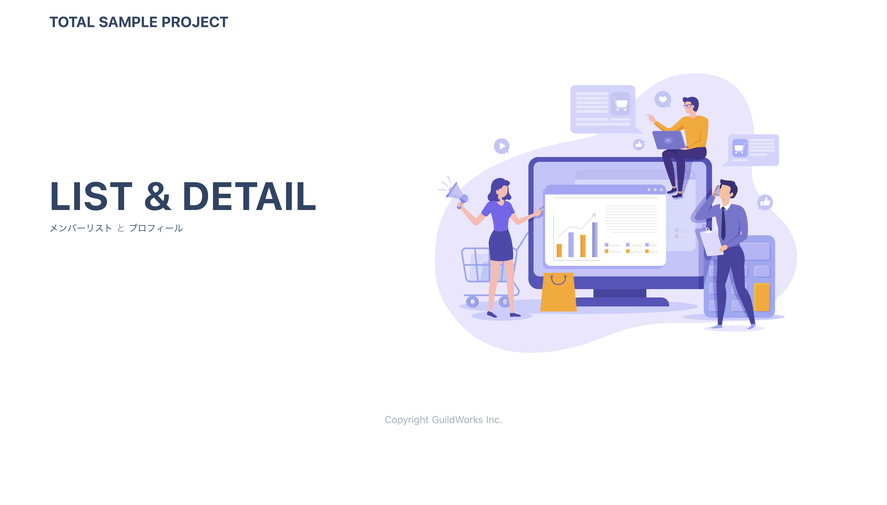
http://localhost:3000/

---
#### メンバー一覧
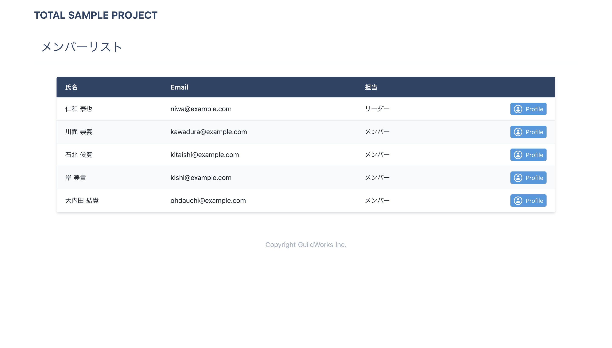
http://localhost:3000/list

---

#### メンバー詳細
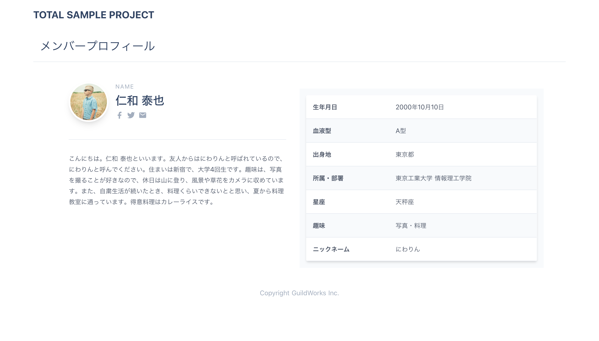
http://localhost:3000/user/0001

---
#### 気になるところ
- 表示内容が変わりません。
  - 表示しているデータは実際に登録したものではなく、[サンプルデータ](https://github.com/GuildWorks/titech-2020/blob/master/titech-nuxt-day2-answer/mock/userlist.json)です。
    - ユーザーの追加ができません。
    - プロフィールの更新ができません。
- ログインをしなくても、誰でもデータを見ることができてしまいます。

---
## 今回やることの確認
開発する機能や画面は、以下の通りです。
- ユーザー登録
- ログイン
- ログイン状態による画面の表示制御
- ログアウト
- プロフィール編集
- あなたのプロフィール
- メンバーリスト(実際に登録したデータを表示)
- メンバープロフィール(実際に登録したデータを表示)

---
#### ユーザー登録
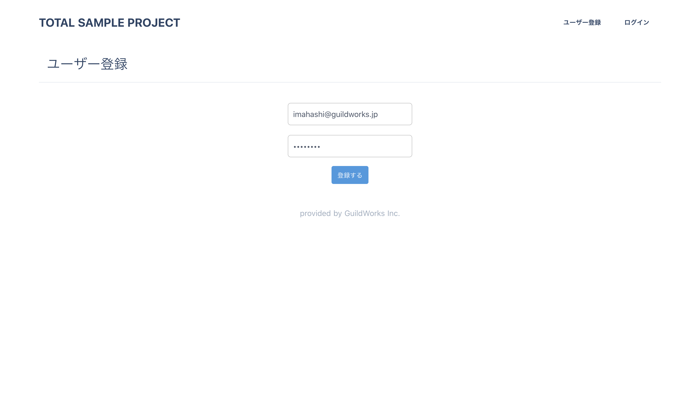

---
#### ログイン
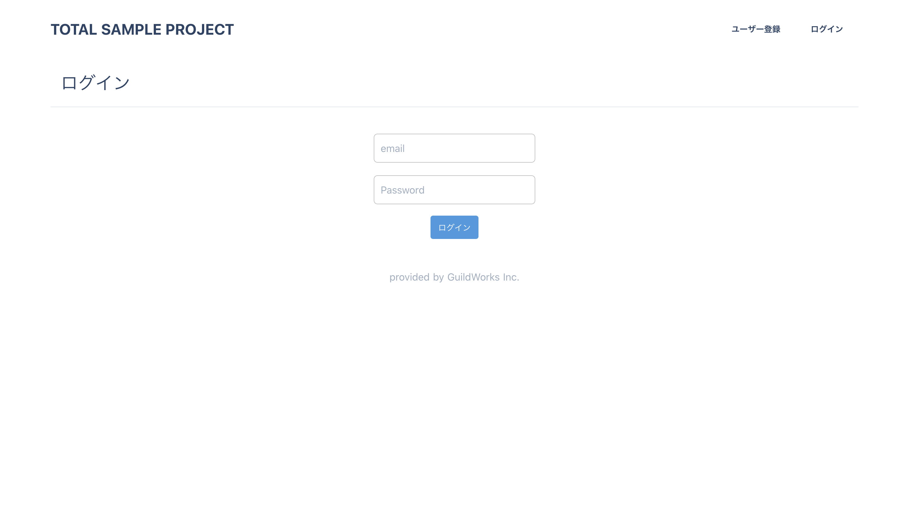

---
#### ログイン状態による画面の表示制御、ログアウト
ログインしている時


ログインしていない時


---
#### プロフィール編集


---
#### あなたのプロフィール
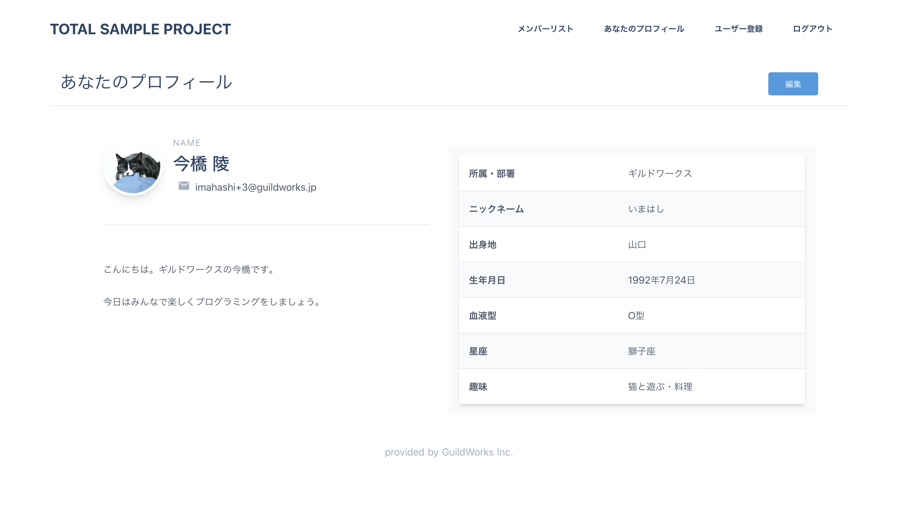

---
#### メンバーリスト(実際に登録したデータを表示)
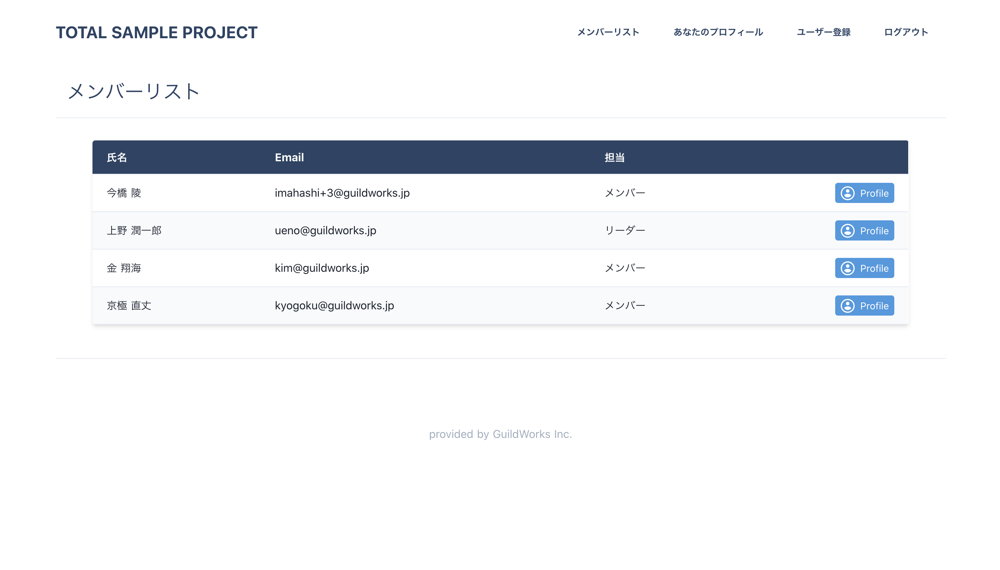

---
#### メンバープロフィール(実際に登録したデータを表示)
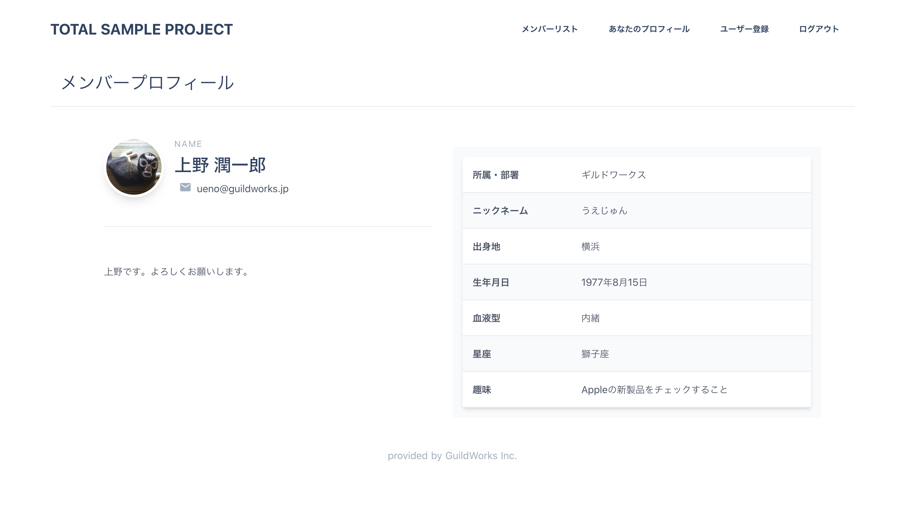

---
- 今回修正していくアプリの現在の状態を確認しておきましょう。
  - 先ほど使ったGitBash(Terminal)で、[Ctrl]+[C]キーを押して、アプリを停止しておきましょう。
  - 以下のコマンドを実行しましょう。
    ```
    pwd  # 現在位置の確認
    cd ..   # 一階層上がる
    pwd  # もう一度、現在位置の確認
    cd titech-nuxt-firebase-tutorial  # 今回修正していくアプリのディレクトリに移動
    npm install  # 必要なモジュールをインストール
    npm run dev  # アプリを起動
    ```
  - その後、http://localhost:3000/ にアクセスしましょう。
    - 各画面や機能の雛形を追加してあるのが分かると思います。
---


- 今回開発する機能に必要な、アプリケーションのバックエンド処理を使えるようにしましょう。
  - 第1回、第2回で作ったのはフロントエンド(アプリケーション)です。ブラウザ側で動作します。
  - バックエンド(アプリケーション)は、インターネットの先で動いて、必要なデータを返してくれます。サーバーサイド(アプリケーション)ともいいます。
  - フロントエンド-バックエンドという対比や、クライアントサイド、サーバーサイドという対比で語られることが多いです。
- このブートキャンプでは、バックエンドを1から開発することはせず、代わりにFirebaseというサービスを利用します。

---
## Firebaseってなに？
- Firebase は Google が提供しているモバイルおよび Web アプリケーションのバックエンドサービスです。Firebase を使うことで、開発者はアプリケーションの開発に専念でき、バックエンドで動くサービスを作成する必要も管理する必要もありません。
- サーバーやデプロイが不要で、簡単にバックエンド処理を利用できるようになります。
- 支払い情報の登録不要で利用できる無料プランがありますので、それを使っていきましょう。

---
## Firebaseを使う準備をしよう
- 以下のリンクにアクセスしましょう。
  - https://console.firebase.google.com/?hl=ja&pli=1
- Googleアカウントのログインを求められた場合、
  - 既にGoogleアカウントを持っている人は、ログインをしましょう。
  - Googleアカウントを持っていない人は、左下の「アカウントを作成」リンクをクリックして、アカウントを作成しましょう。
  
  

---
- こんな画面が表示されたらOKです。
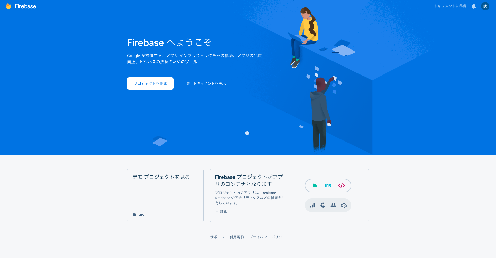
- 「プロジェクトを作成」をクリックしましょう。


---
- プロジェクトに名前をつけて、「続行」をクリックしましょう。
  - 名前は何でもOKです。
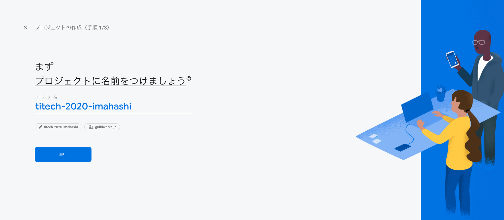

---
- Googleアナリティクスを無効にして、「プロジェクトを作成」をクリックしましょう。
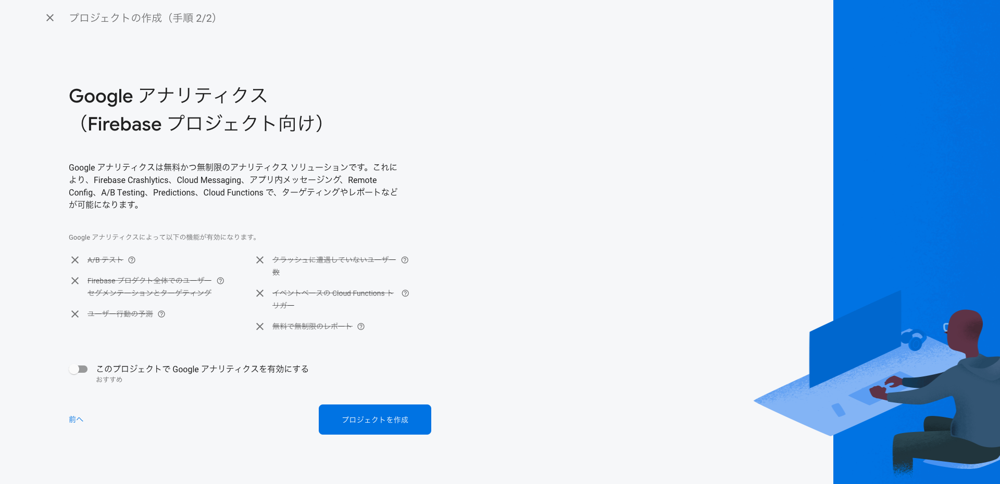
- 
---
- プロジェクトが作成できたら、「続行」をクリックしましょう。
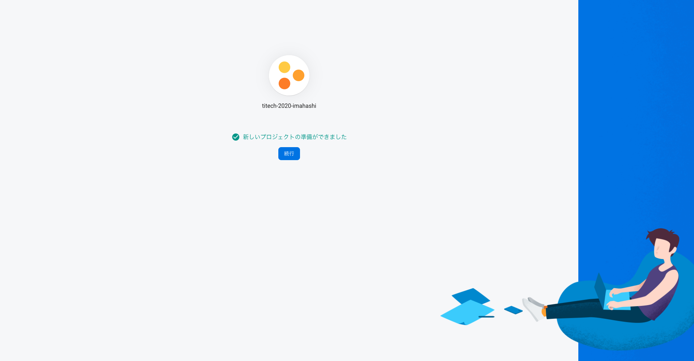

---
- これが作成されたプロジェクトの画面です。このプロジェクトを使って開発を進めていきます。
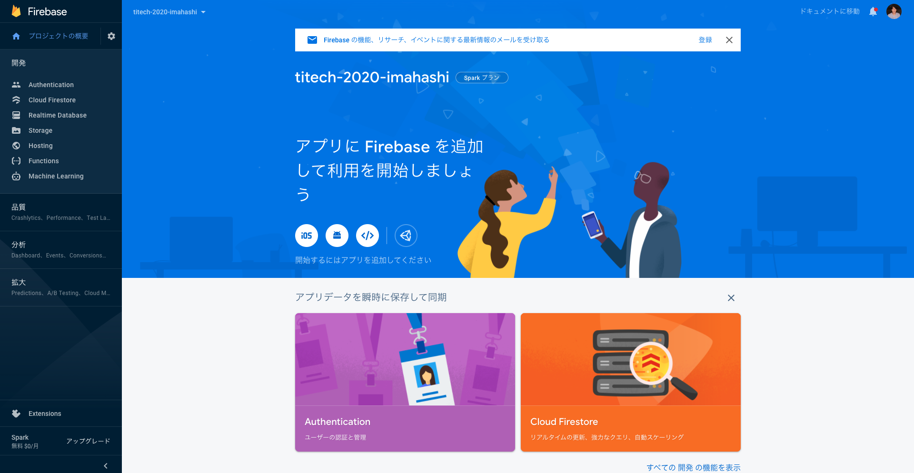

---
#### 今回開発するアプリでFirebaseの初期設定をしよう
- 画面左上の歯車アイコンをクリックして、「プロジェクトを設定」を選択しましょう。
  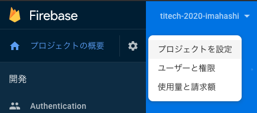

---
- 画面下部マイアプリ欄の 「</>」アイコンをクリックして、プロジェクトにWebアプリを作成しましょう。
  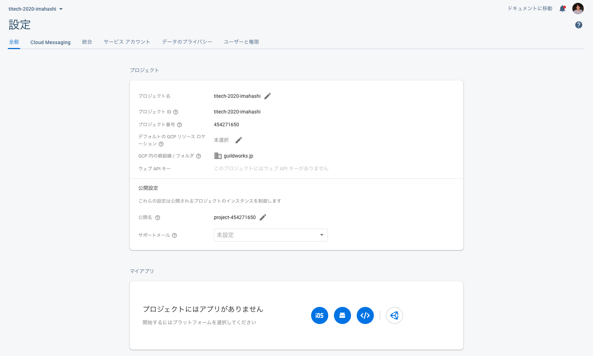

---
- アプリのニックネームを入力して、「アプリを登録」をクリックしましょう。
  - ニックネームは何でもOKです。
  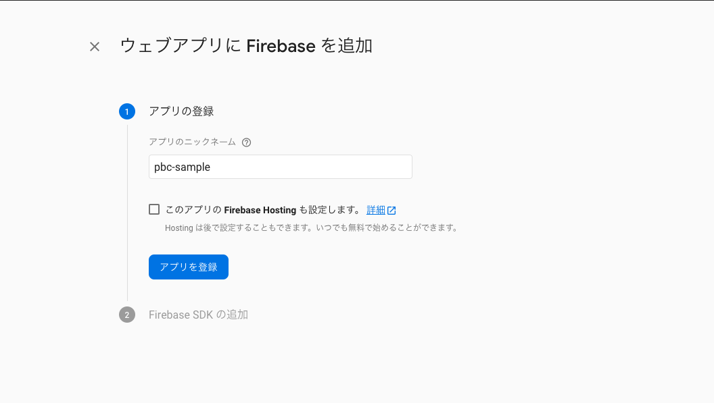

---
- 選択中の箇所(apiKeyからappIdまでの行)をコピーしましょう。
  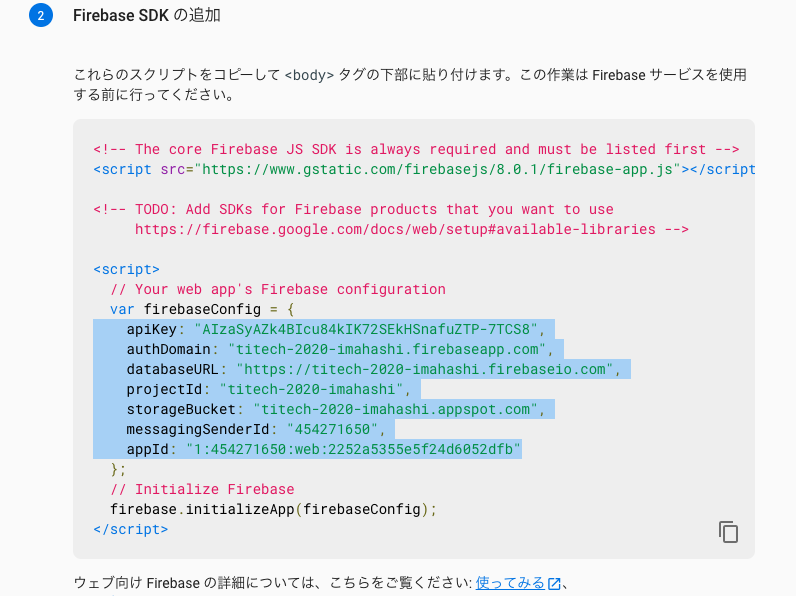

---
- Visual Studio Codeを開いて、コピーした設定を`/titech-nuxt-firebase-tutorial/plugins/firebase.ts`に貼り付けましょう。
  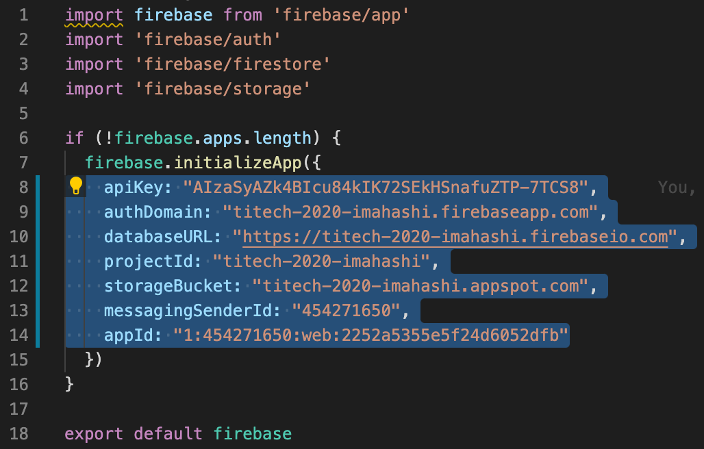
- これで、Firebaseの初期設定は完了です。

---
## ユーザー登録機能を作ろう
- Firebase Authenticationを使います。
  - 認証機能を提供してくれるサービスです。
  - 様々な方法での認証をサポートしています。
    - メールアドレスとパスワード
    - Googleアカウント
    - Facebookアカウント
    - Twitterアカウント
    など

---
#### Firebase側の設定
- 左側のメニューで「Authentication」を選んで、「始める」をクリックしましょう。
    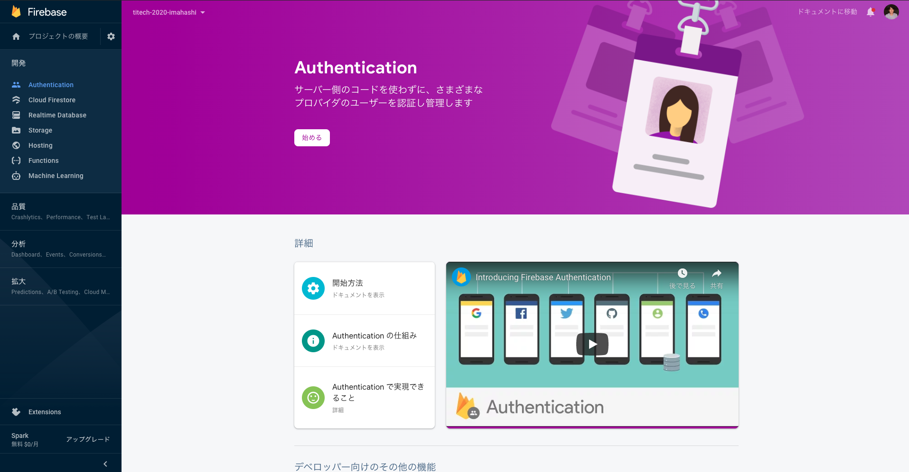

---
- 今回は、メールアドレスとパスワードによる認証を使うため、「メール/パスワード」をクリックしましょう。
  

---
- 1つ目のスライダーをクリックして有効化し、「保存」をクリックしましょう。
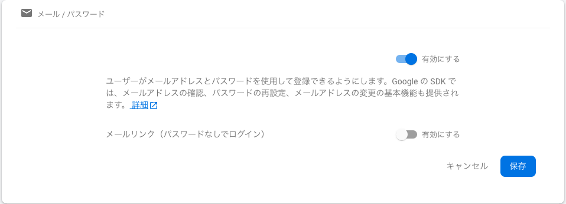
- これで、メールアドレスとパスワードによる認証機能が使えるようになります。
---
#### プログラムの編集
- `/pages/signup.vue` を開きましょう。これが、ユーザー登録画面のファイルです。
- 「登録する」ボタンを押した時に実行される `submit()` 関数の中身が空になっています。
  ```
      function submit() {
        // TODO
      }
  ```
  - この関数内で、Firebase Authenticationが提供している、メールアドレスとパスワードによるユーザー登録処理を呼び出すことで、ユーザー登録を行えるようにします。
--- 
- `/pages/signup.vue`内でFirebaseを扱えるようにするために、firebaseをインポートしましょう。
  ```
  <script lang="ts">
  import { defineComponent, reactive } from 'nuxt-composition-api'
  import PageHeading from '@/components/page-heading.vue'
  import firebase from '@/plugins/firebase.ts' // この行を追加
  ```


---
- 以下のリンクを開いてください。
  https://firebase.google.com/docs/auth/web/password-auth#create_a_password-based_account
  - メールアドレスとパスワードによるユーザー登録処理を呼び出すためのコードが記載されています。
- コードブロック右上の「Copy code sample」アイコンをクリックして、コピーしてください。
  


---
- コピーしたコードを、`submit()`関数内に貼り付けてください。
  ```
      const state = reactive({
        email: '',
        password: ''
      })
      function submit() {
        firebase.auth().createUserWithEmailAndPassword(email, password).catch(function(error) {
          // Handle Errors here.
          var errorCode = error.code;
          var errorMessage = error.message;
          // ...
        });
      }
  ```
  - 参考: コードを貼り付けてインデントが崩れた時は、複数の行を選択して[Tab]を押すと、選択した全ての行に対してインデントを追加できます。[Shift] + [Tab]でインデント削除もできます。

---
- そのままだと動かないので、`createUserWithEmailAndPassword()`の引数`email`を`state.email`に、`password`を`state.password`に変更します。
  ```
      const state = reactive({
        email: '',
        password: ''
      })
      function submit() {
        firebase.auth().createUserWithEmailAndPassword(state.email, state.password).catch(function(error) {
          // Handle Errors here.
          var errorCode = error.code;
          var errorMessage = error.message;
          // ...
        });
      }
  ```
- 画面に入力した`email`、`password`が、`createUserWithEmailAndPassword()`に渡され、それらを含めたユーザー登録処理のリクエストが実行されるようになります。
---
- ユーザー登録完了後は、プロフィール編集画面に遷移するようにしておきましょう。
  ```
      const state = reactive({
        email: '',
        password: ''
      })
      function submit() {
        firebase.auth().createUserWithEmailAndPassword(state.email, state.password)
        .then(() => (location.href = '/profile/edit')) // 改行してこの行を追加
        .catch(function(error) {
          // Handle Errors here.
          var errorCode = error.code;
          var errorMessage = error.message;
          // ...
        });
      }
  ```

---
- 画面を操作して実際にユーザーを登録してみましょう。
  -  メールアドレスとパスワードを入力し、登録するボタンを押してみてください。
    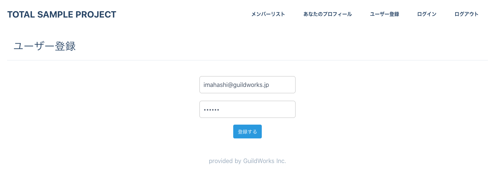

---
- Firebase Authenticationで、ユーザーが登録されたことが確認できます。
    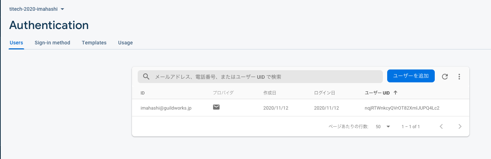


---
- ブラウザで開発者ツールを開きましょう(Chromeの場合、右クリックをして「検証」を選択)。
- 上部のタブからNetworkタブ選択してください。
  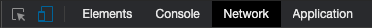
- この状態で、先程と同じメールアドレスを使って再度ユーザー登録をしてみましょう。
---
- `EMAIL_EXISTS`というメッセージのエラーが起きています。
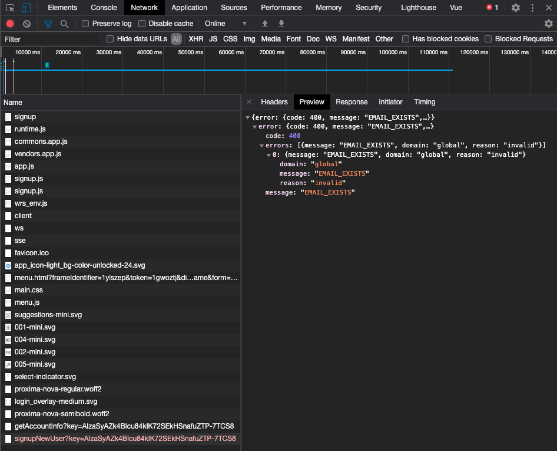
  - 同じメールアドレスで複数のユーザーは登録できないように、Firebase Authenticationのデフォルト設定で制限されているためです。

---
- エラーが起きた場合、それが分かるようにしましょう。`catch()`の中を以下のように修正してください。
  ```
          .catch(function(error) {
            // Handle Errors here.
            alert('ユーザー登録が失敗しました。errorCode: ' + error.code + ', errorMessage:' + error.message)
          });
  ```
- エラーが出ると、以下のようなポップアップが出るようになります。再度同じメールアドレスでユーザー登録をしてみてください。
  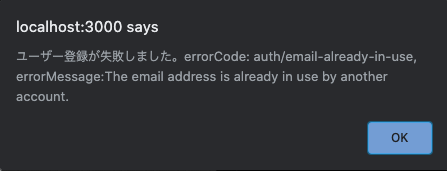

---
## ユーザー認証(ログイン)機能を作ろう
- ここでも、Firebase Authenticationを使います。
- `/pages/signin.vue` を開きましょう。これが、ログイン画面のファイルです。
- 「ログイン」ボタンを押した時に実行される `submit()` 関数の中身が空になっています。
  ```
      function submit() {
        // TODO
      }
  ```
  - この関数内で、メールアドレスとパスワードによるログイン処理を呼び出すことで、ログインできるようにします。
--- 
- `/pages/signin.vue`内でFirebaseを扱えるようにするために、firebaseをインポートしましょう。
  ```
  <script lang="ts">
  import { defineComponent, reactive } from 'nuxt-composition-api'
  import PageHeading from '@/components/page-heading.vue'
  import firebase from '@/plugins/firebase.ts' // この行を追加
  ```

---
- 以下のリンクを開いてください。
  https://firebase.google.com/docs/auth/web/password-auth#sign_in_a_user_with_an_email_address_and_password
  - メールアドレスとパスワードによるログイン処理を呼び出すためのコードが記載されています。
- コードブロック右上の「Copy code sample」アイコンをクリックして、コピーしてください。
  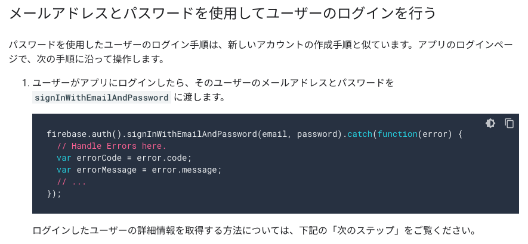


---
- コピーしたコードを、`submit()`関数内に貼り付けてください。
  ```
      const state = reactive({
        email: '',
        password: ''
      })
      function submit() {
        firebase.auth().signInWithEmailAndPassword(email, password).catch(function(error) {
          // Handle Errors here.
          var errorCode = error.code;
          var errorMessage = error.message;
          // ...
        });
      }
  ```

---
- コードを以下のように変更しましょう。
  ```
      const state = reactive({
        email: '',
        password: ''
      })
      function submit() {
        firebase.auth().signInWithEmailAndPassword(state.email, state.password)
        .then(() => (location.href = '/users')) // ログイン完了後にユーザーリスト画面へ遷移させる
        .catch(function(error) {
          // Handle Errors here.
          alert('ログインが失敗しました。errorCode: ' + error.code + ', errorMessage:' + error.message)
        });
      }
  ```
  - `signInWithEmailAndPassword()`の引数`email`を`state.email`に、`password`を`state.password`に変更しています。
  - ログイン成功時に`/users`(ユーザー一覧)へ遷移させています。
  - ログイン失敗時のアラートを追加しています。
---
- 画面を操作して実際にログインしてみましょう。
  -  メールアドレスとパスワードを入力し、ログインボタンを押してみてください。
    - 先程作成したユーザーのメールアドレスとパスワードに一致していれば、ユーザー一覧画面へ遷移します。
    - 先程作成したユーザーとメールアドレスが異なっていれば、`auth/user-not-found`エラーが起きます。
    - 先程作成したユーザーとメールアドレスが一致し、パスワードが異なっていれば、`auth/wrong-password`エラーが起きます。

---
#### ログイン状態による画面の表示制御
- ログイン状態に応じて、各画面を表示させるかどうかを制御していきましょう。
- ログイン状態の判定には、Nuxt.jsのmiddlewareという仕組みを使います。
  https://ja.nuxtjs.org/docs/2.x/directory-structure/middleware/
  - middlewareには、画面が描画される前に実行したい処理を記載します。

---
- `/middleware/Auth.js`を開きましょう。
  - まだ何の処理も書かれていません。
  ```
  export default function () {
  
  }
  ```

---
- `/middleware/Auth.js`を以下のように変更しましょう。
```
import firebase from '@/plugins/firebase.ts'
export const skipAuthPaths = ['/signin', '/signup']

export default function ({ redirect, route, store }) {
  firebase.auth().onAuthStateChanged(function (user) {
    if (user) {
      // User is signed in.
      store.commit('signedIn', true);
    } else {
      // No user is signed in.
      store.commit('signedIn', false);
      if (!skipAuthPaths.includes(route.path)) {
        redirect('/signin')
      }
    }
  })
}
```
---
- `firebase.auth().onAuthStateChanged()`で現在ログインしているユーザーを取得し、ユーザーが取得できたかどうか(=ログインしているかどうか)で、その後の処理を分岐させています。
  https://firebase.google.com/docs/auth/web/manage-users#get_the_currently_signed-in_user
- `store.commit()`で、アプリケーションの状態を管理するためのstoreという入れ物にログイン状態を保存します。
  - storeはこの後で実装します。
- ログインしていない状態で認証が必要な画面を表示しようとした場合、`redirect('/signin')`でログイン画面に遷移させます。

---
- `/store/index.ts`を開いて、以下のように変更しましょう。
  ```
  interface State {
    signedIn: boolean
  }
    
  export const state = () : State => ({
    signedIn: false
  })

  export const mutations = {
    signedIn(state: State, signedIn: boolean) {
      state.signedIn = signedIn
    }
  }
  ```
  - `/middleware/Auth.js`に記載した`store.commit('signedIn', true)`でログイン状態を保存できるようになります。

---

- 作成した`/middleware/Auth.js`がデフォルトレイアウトの描画前に実行されるように、`/layouts/default.vue`に1行追記しましょう。
```
<script lang='ts'>
import { defineComponent } from 'nuxt-composition-api'
export default defineComponent({
  middleware: ['Auth'], // この行を追加し、Auth.jsを読み込む
  setup(_, { root: { $store } }) {
  }
})
</script>
```

---
- ブラウザをシークレットウインドウで開きましょう。
  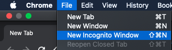
  - そのままでは先程ログインしたことをブラウザが記憶してしまっているため、これによってログイン前の状態で画面を開き直します。

---
- シークレットウインドウで以下を確認しましょう。
  - http://localhost:3000 (トップ)にアクセスすると、ログイン画面にリダイレクトされること。
  - メンバーリスト、あなたのプロフィールに遷移しようとしても、ログイン画面にリダイレクトされること。
  - ログインをすると、トップやメンバーリスト、あなたのプロフィールに遷移できるようになること。

---
#### メニューの表示制御
- `/layouts/default.vue`を開きましょう。
- Nuxt.jsの仕組みにより、このファイルに記載した内容がデフォルトのレイアウトとして各ページに反映されます。
  https://ja.nuxtjs.org/docs/2.x/concepts/views/#default-layout

---
- ログイン状態に応じて、表示するメニューを変えましょう。
- `setup()`を以下のように修正しましょう。
  ```
    setup(_, { root: { $store } }) {
      const isSignedIn = (): boolean => {
        return $store.state.signedIn
      }    
      return {
        isSignedIn
      }
    }
  ```
  - ログイン状態を`isSignedIn`から判定できるようになります。
- 次のページのコードを参考に、`<template>`内の`<a>`タグに`v-if`でログイン状態を判定する分岐を追加しましょう

---
```
          <a
            v-if="isSignedIn()"
            href="/users"
            class="text-blue-900 hover:text-blue-600 py-3 px-6 text-sm font-bold"
          >
            メンバーリスト
          </a>
          <a
            v-if="isSignedIn()"
            href="/profile"
            class="text-blue-900 hover:text-blue-600 py-3 px-6 text-sm font-bold"
          >
            あなたのプロフィール
          </a>
          <a
            href="/signup"
            class="text-blue-900 hover:text-blue-600 py-3 px-6 text-sm font-bold"
          >
            ユーザー登録
          </a>
          <a
            v-if="!isSignedIn()"
            href="/signin"
            class="text-blue-900 hover:text-blue-600 py-3 px-6 text-sm font-bold"
          >
            ログイン
          </a>
          <a
            v-if="isSignedIn()"
            href="#"
            class="text-blue-900 hover:text-blue-600 py-3 px-6 text-sm font-bold"
          >
            ログアウト
          </a>
```
---
#### ログアウト
- `/layouts/default.vue`の`<script>`内を次のページのように変更しましょう。変更内容は以下の通りです。
  - firebaseをimportしています。
  - `setup()`内に`signOut`を追加し、それをreturnして`template`から呼び出せるようにしています。
  - `firebase.auth().signOut()`では、ログアウト処理が実行されます。
    https://firebase.google.com/docs/auth/web/password-auth#next_steps

---
```
import { defineComponent } from 'nuxt-composition-api'
import firebase from '@/plugins/firebase.ts'
export default defineComponent({
  middleware: ['Auth'],
  setup(_, { root: { $store } }) {
    const isSignedIn = (): boolean => {
      return $store.state.signedIn
    }    
    const signOut = (): void => {
      firebase.auth().signOut()
    }
    return {
      isSignedIn,
      signOut
    }
  }
})
```

---
- ログアウトの`<a>`タグに`@click="signOut"`を追加しましょう。
  ```
            <a
              v-if="isSignedIn()"
              href="#"
              @click="signOut"
              class="text-blue-900 hover:text-blue-600 py-3 px-6 text-sm font-bold"
            >
              ログアウト
            </a>
  ```
  - ログアウトをクリックすると、ログアウト処理が実行されるようになります。

---
- メニューの表示が以下のように変わることを確認しましょう。
  - ログインしている時
    
  - ログアウトした時
    

---
## データベース連携をしよう
- Cloud Firestoreを使います。
  https://firebase.google.com/docs/firestore
  - データを保存するデータベースと、データを扱うための基本操作を提供してくれます。
  - データは階層型の構造で格納されます。

---
- データの格納イメージ
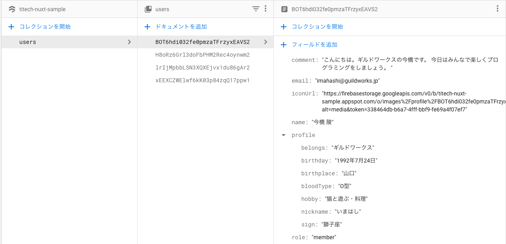

---
#### Firebase側の設定
- 左側のメニューで「Cloud Firestore」を選んで、「データベースの作成」をクリックしましょう。
    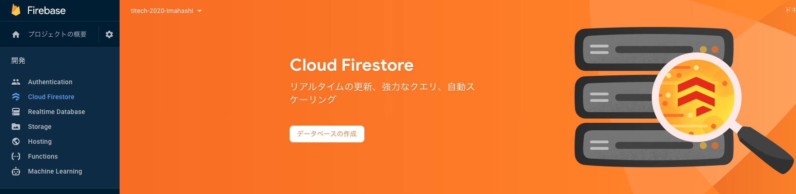

---
- 「テストモードで開始する」を選んで「次へ」をクリック。
  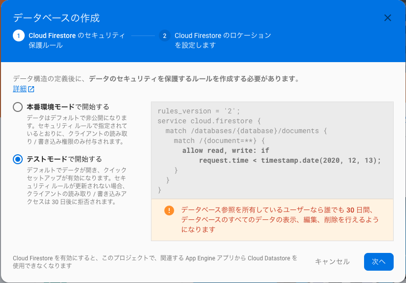

---
- 「asia-northeast1」(東京)を選んで「有効にする」をクリック。
  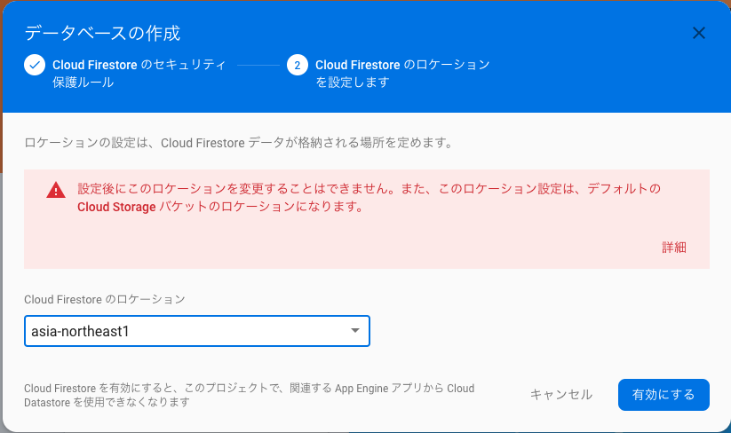
  https://firebase.google.com/docs/firestore/locations#location-r

---
- データベースの準備ができました。
  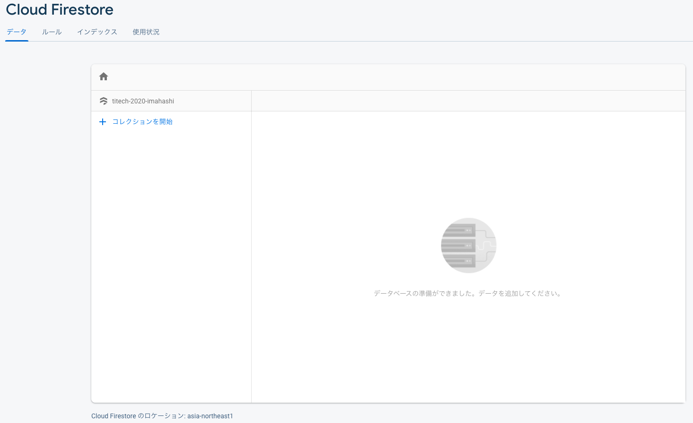

---
#### プロフィール編集(アイコン画像は除く)
- 自分のプロフィールを登録するため、プロフィール編集機能を作りましょう。
- http://localhost:3000/profile/edit を表示してください。
- `/pages/profile/edit.vue` を開きましょう。これが、プロフィール編集画面のファイルです。

---
- 最初に、firebaseをimportしておきましょう。
  ```
  import firebase from '@/plugins/firebase.ts'
  ```
- 次は、プロフィール登録のために必要となる自分のユーザーIDを取得していきます。
---
- `// TODO: ユーザーID、メールアドレス取得`というコメントを削除して、そこに以下のコードを貼り付けましょう。
  ```
      firebase.auth().onAuthStateChanged(function (user) {
        if (user) {
          // User is signed in.
          userData.id = user.uid
          userData.email = user.email
          getUserData(user)
        } else {
          // No user is signed in.
        }
      })
  ```
  - `/middleware/Auth.js`で使ったのと同じ`onAuthStateChanged()`を使ってユーザーID、メールアドレスを取得し、必要な箇所にセットしています。

---
- `setProfile`を次のように変更してください。
  ```
      const setProfile = (): void => {
        const data = {
          name: userData.name,
          email: userData.email,
          role: userData.role,
          iconUrl: userData.iconUrl,
          comment: userData.comment,
          profile: userData.profile,
        }
        firebase
          .firestore()
          .collection('users') // usersコレクションの、
          .doc(userData.id) // <ユーザーID>というドキュメントに、
          .set(data) // dataをセットする
          .then(() => {
            window.location.href = '/profile' // 完了後、プロフィール画面へ遷移
          })
      }
  ```
---
- 実際にプロフィールを入力して、「登録」ボタンを押してみましょう。
  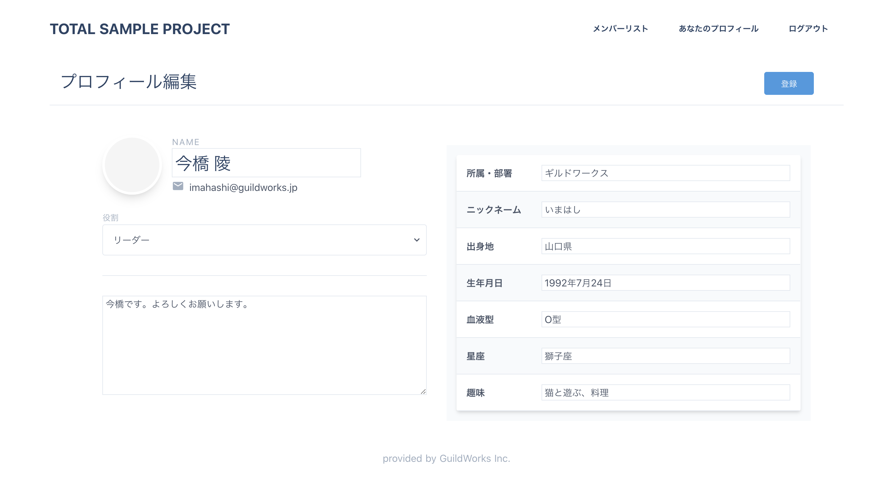

---
- Cloud Firestoreにデータが登録されたことを確認しましょう。 
  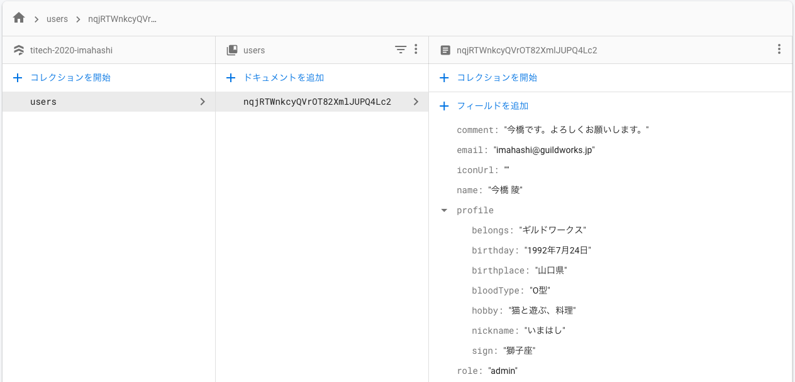

---
- 登録したデータをプロフィール編集画面に表示しましょう。
  - `getUserData`を次のように変更してください。

---
```
    const getUserData = (user) => {
      firebase
        .firestore()
        .collection('users') // usersコレクションから、
        .doc(user.uid) // 指定したuidのドキュメントを
        .get() // 取得する
        .then((doc) => {
          if (doc.exists) {
            userData.name = doc.data().name
            userData.role = doc.data().role
            userData.iconUrl = doc.data().iconUrl
            userData.profile = doc.data().profile
            userData.comment = doc.data().comment
          }
        })
        .catch((err) => {
          console.log('Error getting user document', err);
        })
    }
```
---
- プロフィール編集画面を表示すると、登録済みのデータが表示されるようになっています。
  

---
#### あなたのプロフィール画面へのデータ表示
- 同様に、あなたのプロフィール画面(http://localhost:3000/profile)でも登録済みのデータが表示されるようにしましょう。
- あなたのプロフィール画面のファイルは、`/pages/profile/index.vue` です。
- プロフィール編集画面でやったことを参考に、ご自身でコードを修正してみてください。

---
- 答えはこちら。
  https://github.com/GuildWorks/titech-2020/blob/master/titech-nuxt-firebase-day3-answer/pages/profile/index.vue

---
#### メンバーリスト(実際に登録したデータを表示)
- メンバーリスト画面(http://localhost:3000/users)でも登録済みのデータが表示されるようにしましょう。
- メンバーリスト画面のpageファイルは、`/pages/users/index.vue`ですが、今回はその中で読み込まれている`/components/list-table.vue`を編集していきます。

---
- firebaseをimportしてください。
  ```
  import firebase from '@/plugins/firebase.ts'
  ```
- `setup()`を次のように変更してください。

---
```
  setup(_) {
    const userList = reactive<User[]>([])
    firebase
      .firestore()
      .collection('users') // usersコレクションから、
      .get() // 全てのドキュメントを取得する
      .then(function (querySnapshot) {
        querySnapshot.forEach(function (doc) { // 取得したドキュメントの配列のそれぞれの要素で、
          userList.push({ // 各フィールドの値を取り出して、userList配列にオブジェクトとして追加していく
            id: doc.id,
            name: doc.data().name,
            email: doc.data().email,
            role: doc.data().role,
            iconUrl: doc.data().iconUrl,
            comment: doc.data().comment,
            profile: doc.data().profile,
          })
        })
      })    
    const userLink = (userId: string): void => {
      window.location.href = '/users/' + userId
    }
    return {
      userList,
      userLink,
    }
  },
```

---
- 登録したユーザーが表示されることを確認しましょう。
  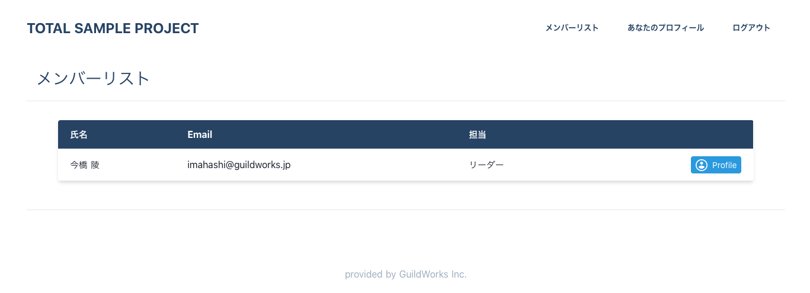

---
- ユーザーを追加して、複数ユーザーがいる場合の表示を確認しましょう。
  - ログアウトをして、別のメールアドレスでユーザー登録をしてください。
    - メールアドレスの存在チェックはしていませんので、適当なメールアドレスでもユーザー登録は可能です。
    - しかし、今後アプリを修正してメール送信機能をつけた場合にメールが送信されてしまうので、可能であれば自分のメールアドレスを使うことが望ましいです。

---
参考
- Gmailのエイリアス機能を使うと、1つのメールアドレスで複数のメールアドレスが使えて便利です。
  - `imahashi@gmail.com` のアカウントを持っている場合、 `imahashi+2@gmail.com`、`imahashi+third@gmail.com`といったように、`@`の前に`+`と好きな英数字を追加すれば、同じメールアドレスにメールが届きます。

---
- 追加したユーザーも表示されることが確認できました。
  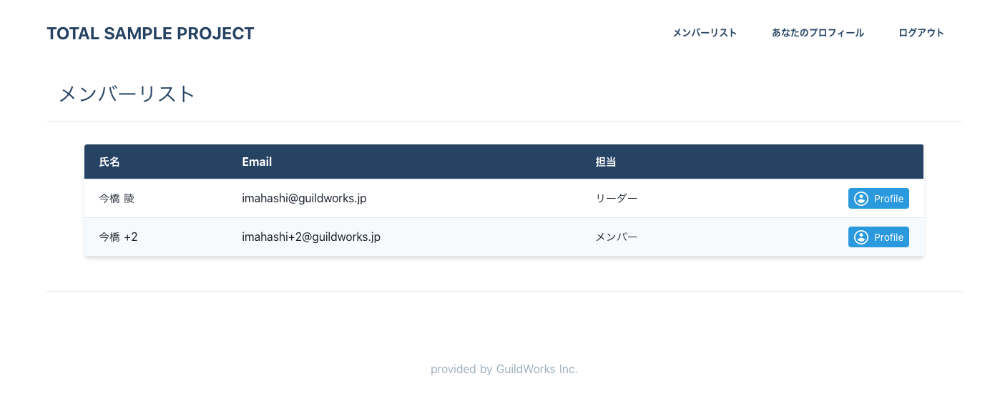

---
#### メンバープロフィール(実際に登録したデータを表示)
- メンバープロフィール画面でも登録済みのデータが表示されるようにしましょう。
  - パス(http://localhost:3000/users/_id)の`_id`部分にユーザーIDが必要なので、ユーザーリスト画面から遷移して表示してください。
- メンバープロフィール画面のファイルは、`/pages/users/_id.vue` です。

---
- firebaseをimportしてください。
  ```
  import firebase from '@/plugins/firebase.ts'
  ```
- `setup()`を次のように変更してください。

---
```
  setup(_, { root }: SetupContext) {
    const userData = reactive<User>({
      id: '',
      name: '',
      email: '',
      role: '',
      iconUrl: '',
      comment: '',
      profile: {
        belongs: '',
        nickname: '',
        birthplace: '',
        birthday: '',
        bloodType: '',
        sign: '',
        hobby: '',
      },
    })
    firebase
      .firestore()
      .collection('users')
      .doc(root.$route.params.id) // URLからIDを取得して、そのIDのドキュメントを取得する
      .get()
      .then((doc) => {
        if (doc.exists) {
          userData.id = root.$route.params.id
          userData.name = doc.data().name
          userData.email = doc.data().email
          userData.role = doc.data().role
          userData.iconUrl = doc.data().iconUrl
          userData.profile = doc.data().profile
          userData.comment = doc.data().comment
        }
      })
      .catch((err) => {
        console.log('Error getting document', err)
      })
    return {
      userData,
    }
  },
```

---
- メンバープロフィールが表示されることが確認できます。
  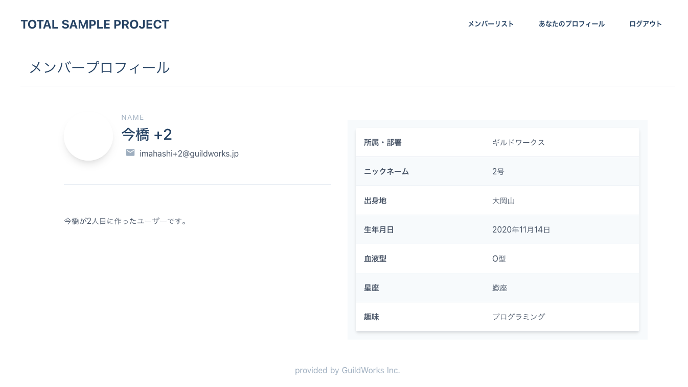

---
## おまけ
- プロフィール編集画面で写真をアップロードできるようにしましょう。
- Cloud Storage for Firebaseを使います。
  https://firebase.google.com/docs/storage
  - 写真や動画などのファイルを保存してくれるサービスです。
- `/pages/profile/edit.vue`を開いてください。

---
- 既に、ドラッグアンドドロップで画像をアプリに取得させることはできるようになっています。
- `setIcon`を次のように変更しましょう。

---
```
    const setIcon = (file: File): void => {
      const storageRef = firebase.storage().ref() 
      // プロフィール画像アップロード先への参照を取得
      const fileRef = storageRef.child(
        'images/profile/' + userData.id + '/' + file.name
      )
      // プロフィール画像をストレージにアップロード
      fileRef.put(file).then(function (snapshot) {
        // ユーザーデータのURLを更新する
        snapshot.ref.getDownloadURL().then((url) => {
          userData.iconUrl = url
        })
      })
    }
```

---  
- 画像をドラッグアンドドロップした後に「登録」ボタンを押すと、アイコンが設定されます。
  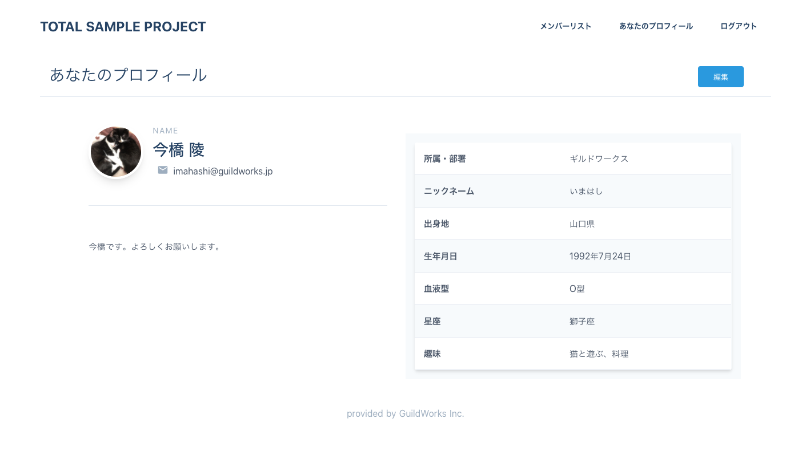

---  
- Cloud Storageを開くと、画像が保存されていることが確認できます。
  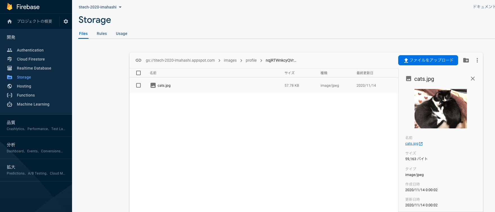

---
## まとめ
:white_check_mark: 今回は、Firebaseを使ってユーザー登録、ログイン、データの登録・読み取り・更新などができるようになりました。

:white_check_mark: アプリの完成形は、`titech-nuxt-firebase-day3-answer`ディレクトリに入っています。分からなかったところがある場合は、こちらを確認してください。

:white_check_mark: 第1回から第3回までの内容を理解すれば、今回のようなシンプルなアプリの開発はできるようになります。

:white_check_mark: 興味がある人は、今回作ったアプリを自由にカスタマイズしたり、自分で新しくアプリを作ったりしてみましょう！


---
# 以上です！
# お疲れさまでした！