**Programming Boot Camp #4**

# 第 4 回： チーム開発に必要なこと

**東京工業大学 2020/11/28**
　
　
　
　
　
　　　　　　　　　　　　　　　　　　　　　　**Naotake Kyogoku**

----

## 前回までのふりかえり
- 第1回では、HTML、CSS、Javascriptの基礎を学びました。
  - [参考: 第 1 回資料](https://github.com/GuildWorks/titech-2020/blob/master/docs/Phase1)
- 第2回では、Vue.js(Nuxt.js)の基礎を学びました。
  - [参考: 第 2 回資料](https://github.com/GuildWorks/titech-2020/blob/master/docs/Phase2)
- 第3回では、Firebase を使ったユーザ登録から認証を学びました。
  - [参考: 第 3 回資料](https://github.com/GuildWorks/titech-2020/blob/master/docs/Phase3)

----

### 今日やること

:black_square_button: チーム開発に必要なこと：開発編

* Git の一通りのコマンドを学ぶ
* GitHub の Pull & Request を使い、コードレビューを学ぶ
* コードのコンフリクトが発生した時の対処法を学ぶ

:black_square_button: チーム開発に必要なこと：コミュニケーション編

* 普段行うコミュニケーション
* 定期的に行うコミュニケーション

----

<!-- _class: lead -->

# <!-- fit --> それでは早速行ってみよう

----

### :black_square_button: チーム開発に必要なこと：開発編

* Git の一通りのコマンドを学ぶ
* GitHub の Pull & Request を使い、コードレビューを学ぶ
* コードのコンフリクトが発生した時の対処法を学ぶ

----

### まずは Git のおさらい

※第 1 回講義資料より

> 開発中のコードのバージョン管理をすることで、
> 特定の開発タイミングの状態に戻る／進むといったことが
> 容易になったり、他の開発者との共同編集がやりやすくなります

----

※第 1 回講義資料より


出典：[GitとSubversionの構造的な違い - Ricksoft Blog](https://www.ricksoft.jp/blog/archives/9483/)

----

<!-- _class: lead -->

### <!-- fit --> Git の一通りのコマンドを学ぶ :sunglasses:


----

### まずはじめに...

Git には様々な **コマンド** が用意されています。
これからそのコマンドを少し学んでいくのですが...

その前に。

Git を学ぶにあたり大事な考え方を説明しますね :point_up:

----

### 複数人で開発するときの Git...

複数人で開発をしていると、どうしてもそれぞれのペースで
ファイルに変更が加えられてしまうため
自分が最初にみえいた時と実は違う状態になっていた
なんてことになる可能性が十分あります。

そして、それは他の人目線でも同じことが言えます。

----

### そこで...

Git では **ブランチ（枝）** と呼ばれるものを使って
複数人で開発するときのいろいろな面倒ごとを解消しています。

このブランチが何かというと...

まずみなさんが本講義を受ける時に初めて叩いたコマンドがこれでした。

```bash
git clone https://github.com/GuildWorks/titech-2020.git
```

----

このコマンドが裏で何をやっているかというと... :eyes:

* `git` で Git のコマンドであることを示します
* 次に Git の `clone` コマンドを実行します
* この `clone` は、その後に続く「リモートリポジトリ」の内容をもとに「ローカルリポジトリ」を作るコマンドになります
* この時、リモートリポジトリから **どのブランチ** の状態を持ってくるかが重要になってきます
* 最初に叩いたコマンドではブランチ名を省略していますが、この場合は、対象となるリモートリポジトリに設定されているデフォルトブランチ（今回なら `master` ブランチ）の状態を持ってきます

----

* もし、特定のブランチの状態を指定してリモートリポジトリの内容を持ってきたい場合はこんな感じになります

```bash
git clone -b feature/phase4 https://github.com/GuildWorks/titech-2020.git
```

* また、「ローカルリポジトリ」を作成する際に、「リモートリポジトリ」とは異なる名前で持って期待場合はこんな感じになります。

```bash
git clone https://github.com/GuildWorks/titech-2020.git titech-2020-day4
```

この場合、`clone` してきた後のディレクトリ名は `titech-2020-day4` になります。


----

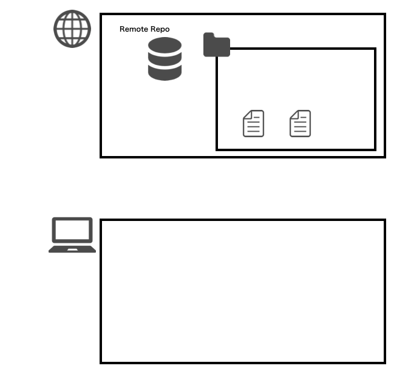

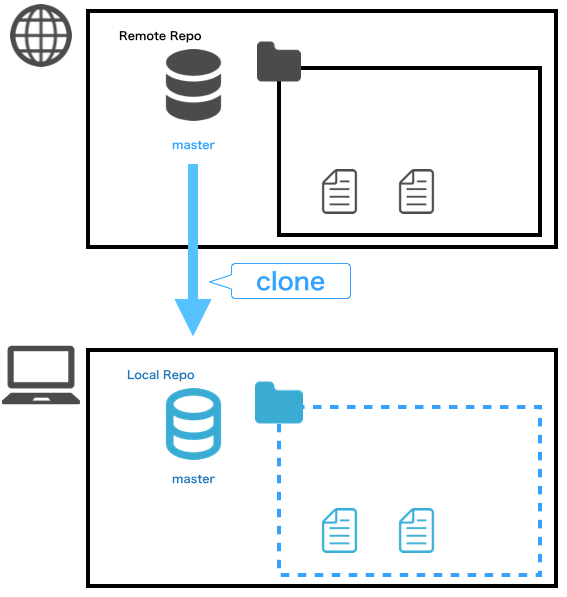

----

### このように...

Git を扱う上では **ブランチ** を意識することはとても重要になります :innocent:

これから先もブランチという言葉や考え方がたくさん出てくるのでしっかり頭に入れておきましょう！

----

それでは、さっそく Git のコマンドを学んで行きたいと思いますが

その前にまずは事前準備を全員一緒に済ませてしまいます。

やることは 3 つです。

1. :black_square_button: #1 ~ #3 で利用していた `titech-2020` ディレクトリを最新化
2. :black_square_button: 今回のワークショップで扱う GitHub のページに皆さんの GitHub アカウントを招待します
3. :black_square_button: 今回のワークショップで扱うリポジトリを新たに `clone` します

----

#### 1. #1 ~ #3 で利用していた `titech-2020` ディレクトリを最新化

まずは今までよく使っていた `titech-2020` の「ローカルリポジトリ」を最新化します。

必要なコマンドは #2 や #3 の最初に叩いていたコマンドです。
そう、`git pull` です。

ですので `titech-2020` のディレクトリで GitBash(Terminal) を開いたら、コマンドを実行します。

```bash
git pull
```

----

#### 2. 今回のワークショップで扱う GitHub のページに皆さんの GitHub アカウントを招待します

https://github.com/GuildWorks/titech-2020/issues/33

こちらのページにアクセスし、適当なコメントを書いてください！
書けた方から順番に招待メールをお送りしますので、そちらをご確認ください。


:sunglasses: 講師は[ココ](https://github.com/orgs/titech-2020-day4/teams/titech-2020/members)から招待していく！

----

招待が成功するとこんなメールが届くはずです。

無事に届いたらメール本文にある `Join @titech-2020-day4` のリンクを押下。

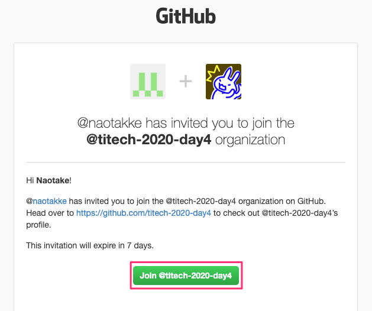

----

すると GitHub のページに遷移しこんな画面が表示されるはずです。

正しく画面が表示されたら `Join titech-2020-day4` のボタンを押下。

これで無事に招待が完了します。

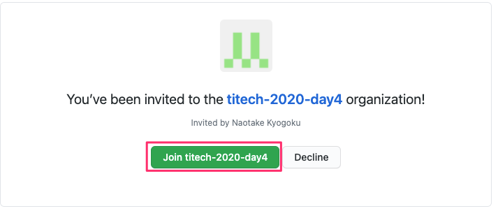

ここまでで上手くいっていない人ー :raising_hand: ？

----

#### 3. 今回のワークショップで扱うリポジトリを新たに `clone` します

:warning: このコマンドを実行するのは、今まで利用していた titech-2020 の
一つ上の階層で実行してください！

```bash
# このコマンドを叩いた末尾が titech-2020 であることを確認
pwd

# 一つ上の階層に移動
cd ../

# ワークショップ用のリポジトリを clone
git clone https://github.com/titech-2020-day4/workshop.git titech-2020-day4

# clone したディレクトリへ移動
cd titech-2020-day4
```

----

実行できましたかね？
まだの人ーー 🙋‍♀️ ？

1. :white_check_mark: ~~#1 ~ #3 で利用していた `titech-2020` ディレクトリを最新化~~
2. :white_check_mark: ~~今回のワークショップで扱う GitHub のページに皆さんの GitHub アカウントを招待します~~
3. :white_check_mark: ~~今回のワークショップで扱うリポジトリを新たに `clone` します~~

これで準備は整いました！

----

早速、今 `clone` したリポジトリのブランチが本当に `master` ブランチなのか確かめてみましょう👀

先程 clone してきた `titech-2020-day4` の直下で `git branch` コマンドを実行してみましょう

----

すると、今のブランチ名の横に `*` が付いていると思います。
GitBash や Terminal を使っていれば、文字色も変わっているはず :smile:

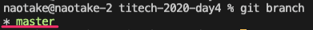


このコマンドは、現在「ローカルリポジトリ」にどういったブランチが存在し、現在はどのブランチを向いているのかを確認するコマンドになります。

----

<!-- _class: lead -->

# <!-- fit --> ほんの少しは **ブランチ** というものが身近になりましたかね :heart:

----

では、今度は新しいブランチを作成してみましょう。
新しいブランチを作成するイメージは、文字通り枝分かれするイメージとなります。

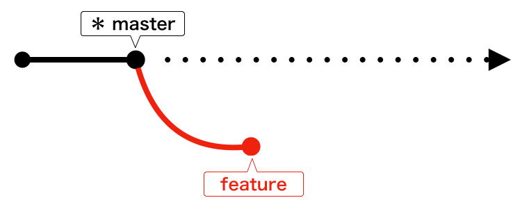

これは `master` ブランチから `feature` ブランチが枝分かれするイメージです。

----

では早速ブランチを作成してみましょう。
コマンドはこちら。

```bash
git branch feature/{your-name}
```

`{your-name}` の部分はご自身の苗字を当てはめてください。
例えば私なら `feature/kyogoku` となるので

```bash
git branch feature/kyogoku
```


----

特に何もおこなかったと思います。
本当にブランチが作成されたか見てみましょう。

...何のコマンドを使えば良いかわかりますよね :kiss:？

そうです！
先ほども叩いた `git branch` コマンドになります。

----

```bash
git branch
```

すると、最初に `git branch` を叩いた時にあった `master` ブランチの他に、先ほど作成した `feature/{your-name}` ブランチが存在しているはずです！

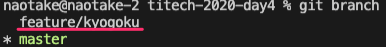

----

これで新しいブランチが「ローカルリポジトリ」に作成されたことになります。
ただ `*` のマークは相変わらず `master` ブランチに付いていますよね？
なので、このまま何かファイルを編集すると `master` ブランチに対して作業することになってしまいます。

----

そこで、作成したブランチに移動してみましょう。
実行するのは `git checkout` コマンドになります。

```bash
git checkout feature/{your-name}
```

このように `checkout` の後に移動したいブランチ名を指定します。

私の場合はこんな感じですね。

```bash
git checkout feature/kyogoku
```

----

このコマンドを叩くと
```git
Switched to branch 'feature/{your-name}'
```

というメッセージが表示されたはずです！
されていない人ー 🙋‍♀️ ？

----

では本当にブランチを移動したのか確認してみましょう。

...何のコマンドを使えば良いかわかりますよね :kiss::kiss:？

そうです！
三度登場！ `git branch` コマンドになります。

----

```bash
git branch
```

実行すると `*` の位置が変わっていますよね？
先ほどまでは `master` ブランチに `*` が付いていたはずですが
今叩いてみると `feature/{your-name}` ブランチに `*` がついているはずです。

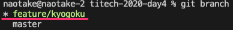

これで無事に作業ブランチが `feature/{your-name}` ブランチに移動しました。

----

ここまで学んだコマンドを軽くおさらいしてみましょう。

コマンド|用途|
:-|:-|
`clone`|リモートリポジトリからローカルリポジトリを作成|
`branch`|ブランチを作成|
`checkout`|ブランチを移動|

----

では、次はファイルを編集して、その内容を「リモートリポジトリ」へ追加していきましょう！

流れとしてはこんな感じになります。

1. :black_square_button: 先程 `clone` したディレクトリを VS Code に追加
2. :black_square_button: 作業ディレクトリでファイルの追加を行う
3. :black_square_button: 変更内容を「ローカルリポジトリ」へ反映
4. :black_square_button: 「ローカルリポジトリ」の内容を「リモートリポジトリ」へ反映

----

#### 1. 先程 `clone` したディレクトリを VS Code に追加

まず事前準備として、先程 `clone` してきたディレクトリを VS Code に追加し、VS Code 上で編集できるようにします。

----

まず VS Code の左パネルの `GITHUB (WORKSPACE)` もしくは `UNTITLED (WORKSPACE)` となっているところが表示されていることを確認。

そして、その領域に先程 `clone` してきたディレクトリを Drag & Drop します。

ディレクトリの名前はみなさん `titech-2020-day4` のはず！

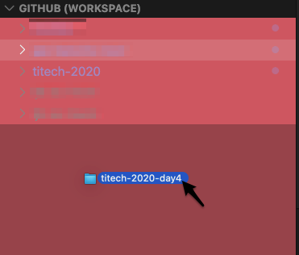

----

Drag & Drop が成功すると、こんな確認ダイアログが表示されるはずなので一番上の `Add Folder to Workspace` をクリック。

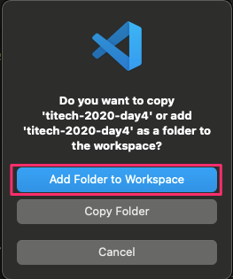

----

すると VS Code 左パネルの `GITHUB (WORKSPACE)` のところに `titech-2020-day4` が増えているはずです！

増えていないひとー 🙋‍♀️ ？

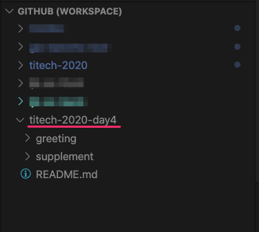

では、実際にファイルを追加していきます！

----

1. :white_check_mark: ~~先程 `clone` したディレクトリを VS Code に追加~~
2. :black_square_button: 作業ディレクトリでファイルの追加を行う
3. :black_square_button: 変更内容を「ローカルリポジトリ」へ反映
4. :black_square_button: 「ローカルリポジトリ」の内容を「リモートリポジトリ」へ反映

----

#### 2. 作業ディレクトリでファイルの追加を行う

VS Code で下記のディレクトリを選択してください。

```bash
titech-2020-day4/greeting
```

そして、右クリックのメニューから `New File` を選択して新規ファイルを作成します。

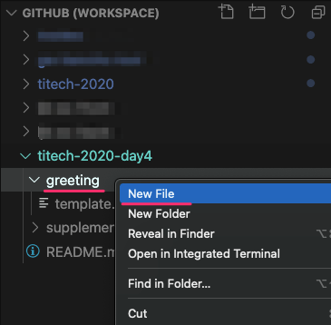

----

ファイルの名前は同じ並びにあるファイルに倣って `{your-name}.txt` にしましょう。
ファイルが作成できたら中身にご自身の自己紹介文を追記していってみましょう。

* 名前 (Name)：
* 誕生日 (Birthday)：
* 出身地 (Birthplace)：
* 学部 (Faculty)：
* 趣味 (Hobbies)：
* ニックネーム (Nicknames)：

:notebook: 同じ並びにある `template.txt` の中身をコピーしても OK :information_desk_person:

----

自己紹介文の追記は終わりましたか？

1. :white_check_mark: ~~先程 `clone` したディレクトリを VS Code に追加~~
2. :white_check_mark: ~~作業ディレクトリでファイルの追加を行う~~
3. :black_square_button: 変更内容を「ローカルリポジトリ」へ反映
4. :black_square_button: 「ローカルリポジトリ」の内容を「リモートリポジトリ」へ反映

----

#### 3. 変更内容を「ローカルリポジトリ」へ反映

では、まず変更されたファイルを Git が認識しているかを確認しましょう。

そこで登場するのが `git status` コマンドです。

このコマンドは現在のブランチ上で、変更されたファイルを確認するコマンドになります。

----

```bash
git status
```

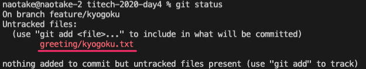


実行すると先ほど追記したファイルのパスが表示されているはずです。
この時、そのファイルパスの文字色が赤字であることを覚えておいてください!!

----

では、変更されたファイルを Git が認識していることを確認できましたので、その内容を「ローカルリポジトリ」へ反映していきましょう。

...と、言ってもローカルリポジトリへの反映は 2 段階になります。

1. ステージングエリアに変更内容を反映
2. ステージングエリアの内容をローカルリポジトリへ反映

順番にみていきましょー :eyes:

----

##### 1. ステージングエリアに変更内容を反映

**ステージングエリア**

聞き慣れない言葉が出てきましたね 💧

安心してください。順に説明していきますね！

----

実はローカルリポジトリの中には

* 「作業エリア」
* 「ステージングエリア」

の 2 つ領域が存在しています。

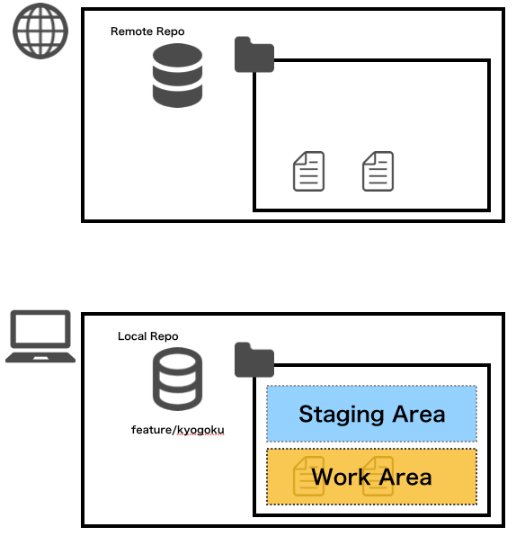

----

この 2 つのエリアはそれぞれ下記の役割を持っています。

* 作業エリア
  * 実際にみなさんが作業を行っている部分
  * ファイルの追加やディレクトリの追加、など
* ステージングエリア
  * ローカルリポジトリへ反映する変更内容を覚えておくための部分

----

で、いま皆さんが変更を加えた内容は「作業エリア」にしか反映されていない状態です。

なので、「ステージングエリア」へ反映していきます。

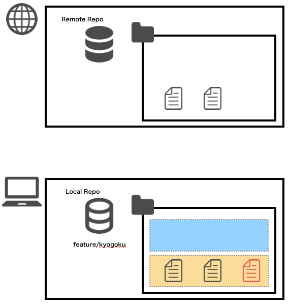

----

そこで登場するのが `git add` コマンドになります。

これは「作業エリア」で作業した内容を「ステージングエリア」へ反映するためのコマンドになります。

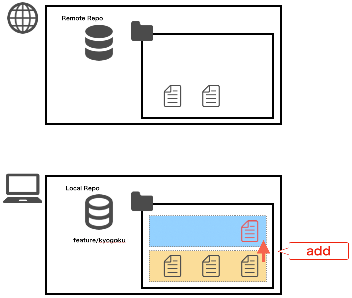

----

その際、`git add` に続けて「ステージングエリア」に反映したいファイルのパスを指定することで、そのファイルだけを「ステージングエリア」へ反映することができます。

... でも、そのファイルをイチイチ手打ちするのは手間ですよね？

そこで便利なのが先ほどの `git status` コマンドになります。

----

`git status` コマンドを実行して表示されるファイルが、現在変更されているファイルのパスになるので、それをそのままコピーしておきます。


そして、そのパスを `git add` の後ろに貼り付けます。
（実行しても何も表示されないはず）

```bash
git add greeting/{your-name}.txt
```

----

実行できましたかー？
では、本当に「ステージングエリア」に反映できたかどうかを確認してみましょう。

どのコマンドを叩くか... わかりますよね :smile:

そうです！ `git status` コマンドです！

----

`git status` コマンドは、現在のブランチ上で、変更されたファイルを確認するコマンドになります。

```bash
git status
```

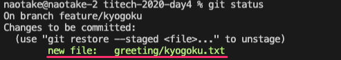

実行すると `git add` する前と表示されるファイルのパスは同じだと思いますが、変わった部分がありますよね？

...そうです！色です！

----

`git add` する前はファイルパスの色が赤 :heart: だったはずです。
しかし `git add` した後だとファイルパスの色が緑 :green_heart: になっていますよね。

これはそのファイルが正しくステージングエリアに反映されたことを表しています。

では、ステージングエリアに正しく反映されたことを確認できたので、いよいよローカルリポジトリへ反映していきましょう。

----

##### 2. ステージングエリアの内容をローカルリポジトリへ反映

無事にステージングエリアへ変更内容を反映できましたので、いよいよローカルリポジトリへ変更内容を反映していきましょう。

ローカルリポジトリへ反映するのは `git commit` コマンドになります。

----

`git commit` はステージングエリアに反映されている内容（ステージされている内容）を、ローカルリポジトリへ反映するコマンドになります。
そのため `git commit` では特にファイルを個別に指定することは不要です。

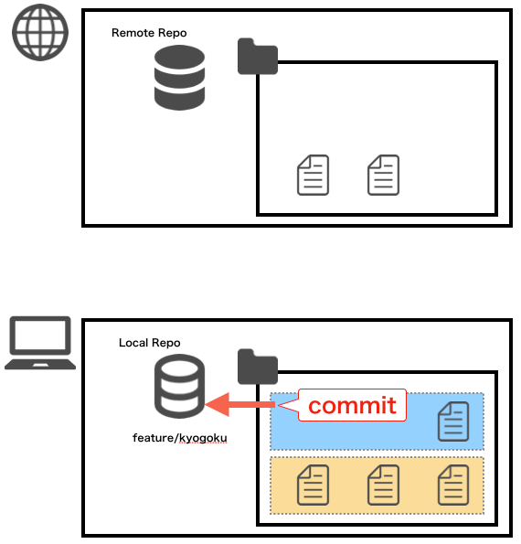

----

ただし `git commit` を実行する際には「ローカルリポジトリへ反映する内容（What）」や、「反映理由（Why）」を**コミットメッセージ**として登録する必要があります。

※一般的に、what はコミット内容を見れば把握できるため、コミットメッセージには why を記入する場合が多いです
※まぁ、今いまはそこまで意識しなくても大丈夫です :ok_hand:

----

これらを踏まえて実行するコマンドとしてはこんな形になります。

```bash
git commit --message "{your-name}の自己紹介文を追加"

# -m でもイケます
git commit -m "{your-name}の自己紹介文を追加"
```

`--message` はコミットメッセージを指定する `git commit` コマンドの **オプション** となります。

----

ちょっと脱線... :railway_car:

`--message` のように、Git のコマンド群には様々なオプションが用意されているので、細かい説明はここでは割愛します。
詳しくは各コマンドの最後に `--help` or `-h` と入力すると、そのコマンドのオプションを一覧で見ることができます。

```bash
git branch --help
git checkout --help
```

----

:warning: ここでちょっと注意 :warning:

help の内容が膨大な場合、ターミナルのカーソル位置の表示が `:` になっていて `Enter` や `Backspace` を押しても画面が終わらないと思います。

そんな時は慌てず `q` （キュー）のコマンドを 1 回叩いてください。
すると、画面を抜けられるはずです。

※これは `vi` というエディタの参照モードで開いている、という状態なのですが、詳しくは割愛します。

----

脱線しましたが... :railway_car:

元に戻って `git commit` を叩いてみましょう。

```bash
git commit --message "{your-name}の自己紹介文を追加"

# -m でもイケます
git commit -m "{your-name}の自己紹介文を追加"
```

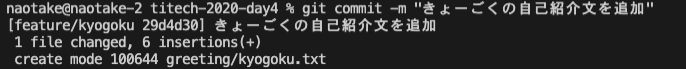

----

では `git commit` が成功したかどうかを確認していきます。
そうです！ `git status` コマンドです。

`git status` コマンドを叩くと...

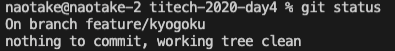

あれあれ。
編集していたはずのファイルが表示されなくなりましたね😱

安心してください。正しい挙動です。
（逆に表示されている方はいますか🙋‍♀️？）

----

では、編集したファイルはどこに行ったのでしょうか？

答えは、ローカルリポジトリへ反映されたのです。

では、ローカルリポジトリへ反映されたかどうかを確認してみましょう。

そこで登場するのが `git log` コマンドです。

----

このコマンドは現在のブランチのコミットの履歴（ログ）を見ることができるコマンドになります。

```bash
git log
```
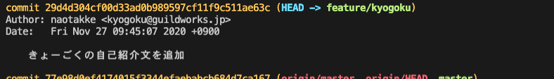

----

実際に叩いてみると、コミットの履歴が新しいもの順に上から下に表示されているはずです。

その一番上のコミットメッセージにはおそらく皆さんが先ほど叩いた `git commit` 時のメッセージが表示されているはずです。

（ `git log` も vi の参照モードで表示されているので、表示を終えたい時は落ち着いて `q` （キュー）を一回入力してください）

----

さぁ、もうすぐゴールです。

ここまででローカルリポジトリへの反映まで完了しました。
最後はリモートリポジトリへの反映を行っていきましょう。

1. :white_check_mark: ~~先程 `clone` したディレクトリを VS Code に追加~~
2. :white_check_mark: ~~作業ディレクトリでファイルの追加を行う~~
3. :white_check_mark: ~~変更内容を「ローカルリポジトリ」へ反映~~
4. :black_square_button: 「ローカルリポジトリ」の内容を「リモートリポジトリ」へ反映

----

#### 4. 「ローカルリポジトリ」の内容を「リモートリポジトリ」へ反映

ローカルリポジトリの内容をリモートリポジトリへ反映するのは `git push` コマンドとなります。

このコマンドを実行することで、ローカルリポジトリへ反映されているけど、リモートリポジトリへまだ反映されていない内容をすべて反映してくれます。

----

```bash
git push origin feature/{your-name}
```

この `origin` というのは、リモートリポジトリのことを指しています。
そして、その後ろに続くのが `push` したいブランチの名前です。

なので、このコマンドは

「リモートリポジトリに対してまだ反映されていない `feature/{your-name}` ブランチの内容を push する」

という命令になります。

----

```bash
git push origin feature/{your-name}
```
「リモートリポジトリに対してまだ反映されていない `feature/{your-name}` ブランチの内容を push する」

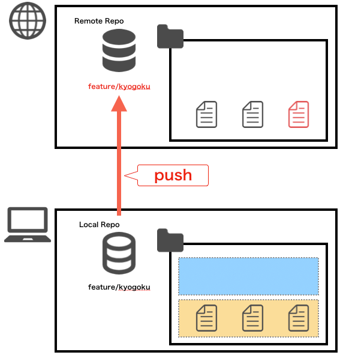

----

... どうですか？

無事に `push` できましたか？
エラーが出たぞーという方 🙋‍♀️ ？

----

おつかれさまでした。

これで、皆さんのパソコン上で編集を行った内容が、リモートリポジトリへ反映されました 🎉🎉🎉

0. :white_check_mark: ~~先程 `clone` したディレクトリを VS Code に追加~~
1. :white_check_mark: ~~作業ディレクトリでファイルの追加を行う~~
2. :white_check_mark: ~~変更内容を「ローカルリポジトリ」へ反映~~
3. :white_check_mark: ~~「ローカルリポジトリ」の内容を「リモートリポジトリ」へ反映~~

では、その内容を GitHub から見てみましょう。

----

ワークショップ用リポジトリの GitHub ページへアクセス。
https://github.com/titech-2020-day4/workshop

この画面の右下あたりに当たる「master」と書いてある部分をクリック。

----

すると `Switch branches/tags` というプルダウンが表示されるはずです。
そこに `Find or create a branch...` というテキストボックスがあると思いますので、そこに皆さんが先ほど `push` したブランチの名前を入力してみましょう。

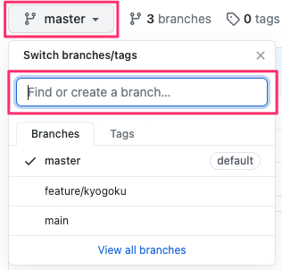

きっとみなさんの `{your-name}` を入力すると出てくるはず！

自分のブランチが無いぞーという方はいますか😭？

----

<!-- _class: lead -->

### これで無事にリモートブランチへ
### 反映されていることが確認できました！！

:innocent: おつかれさまでした :innocent:

----

先程叩いたコマンドをおさらいしましょう。

コマンド|用途|
:-|:-|
`branch`|ローカルリポジトリにブランチを作成|
`checkout`|ブランチの切り替え|
`add`|作業エリアで追加・編集したファイルをステージングエリアに反映|
`commit`|ステージングエリアの内容をローカルリポジトリに反映|
`log`|現在のブランチのコミット履歴を確認|
`push`|ローカルリポジトリの内容をリモートリポジトリに反映|

----

こんな感じで、複数人が同時に開発をする場合には
これまでの流れを辿ることで、他の人の作業に影響を与えることなく、もくもくと作業を進められる訳ですね😎

----

### ちょっと待てよ... :neutral_face:

でも、他の人の作業を自分の作業エリアにも取り込みたい、そんなケースありますよね？
みんながバラバラで作業することはできても、バラバラのままでは 1 つのアプリケーションを作り上げることはできません。

----

### そこで登場 GitHub !!

そこで、皆さんが変更を行った内容を 1 箇所に集約していきます。

ここでは GitHub の **Pull & Request** という機能を使って、皆さんがそれぞれ作成した自己紹介のファイルを 1 つのブランチにマージしていきます。


----

まずは先程開いたワークショップ用リポジトリ の GitHub ページを開きます。
次に、画面上段にある `Pull & Request` を選択。

そして、右の方にある `New pull request` というボタンをクリックして、皆さんの Pull & Request を作成していきます。

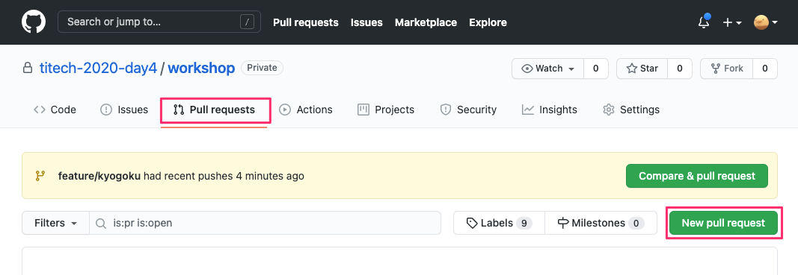

----

すると Comparing changes というページが表示されたと思いますので、まずは **base** と **compare** を入力していきます。

これは、皆さんが `push` した `feature/{your-name}` ブランチの内容を `master` ブランチにマージしていく時に指定するものです。
これにより、枝と枝がくっついて皆さんの変更内容が一つになるイメージです。

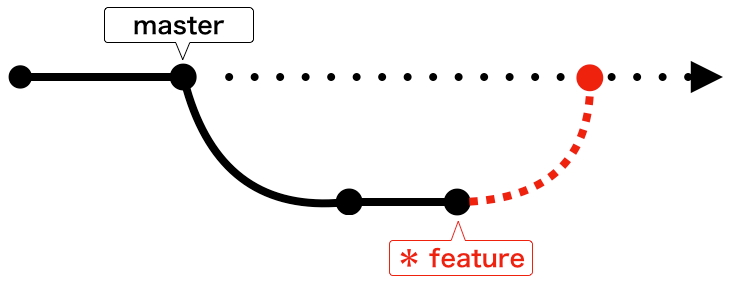

----

下記の通り設定できたら **Create pull request** ボタンを押してください。

1. base (マージ先)
  `master`
2. compare (マージ元)
  `feature/{your-name}`

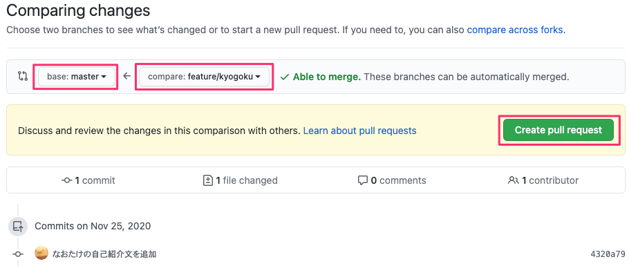

----

すると **Open a pull request** というページが表示されたと思いますので、残りの Pull & Request に必要な内容を設定していきましょう。

3. タイトル
  先程 `push` した内容がセットされているはずなのでこのまま
4. 説明
  今回の Pull & Request の概要を記入
  何を対応したかか？なぜ対応したか？
  懸念事項、申し送り事項など
5. Review
  **naotakke**
6. Assignee
  **assign yourself** をクリック

----

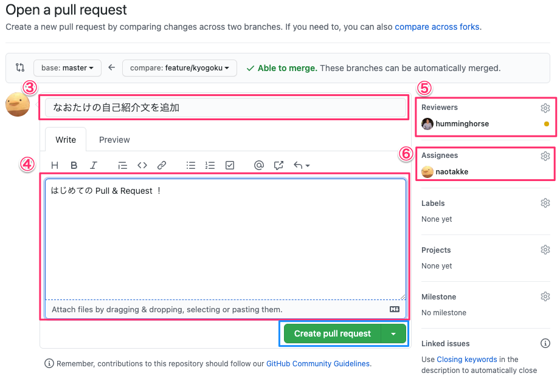

----

設定が完了したら **Create pull request** ボタンを PUSH!!

無事に Pull & Request の画面が表示されれば完了です！
うまくいっていない人ー 🙋‍♀️ ？

----

私の方で Pull & Request の内容を確認して問題なければ承認します！！
承認された方はご自身で Pull & Request をマージしてみてください。

画面下にある **Merge pull request** ボタン、 **Confirm merge** ボタンを順に押して、Pull & Request をマージします！

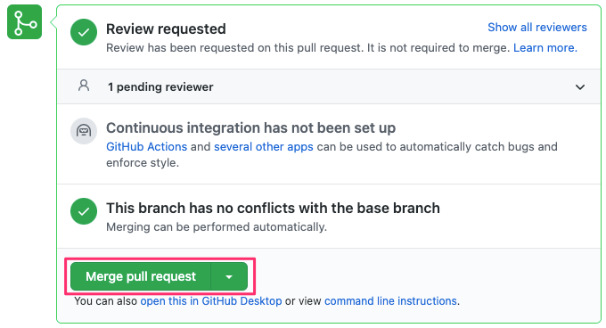

----

マージが済んだら皆さんが作成したブランチは不要になりますので、先ほどの merge ボタンの下にある `Delete branch` ボタンを教えて、不要になったブランチを削除しておきましょう！

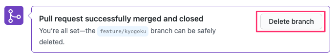

----

最後にマージした全員分の自己紹介文を、みなさんのローカルリポジトリへ取り込んでみましょう。

手順としてはこんな感じです。

1. 現在のブランチ状態を確認
2. 現在のブランチを `master` に移動
3. 最新の `master` ブランチの内容を取り込みます

----

それぞれの手順はもうバッチリですよね😎？

1. 現在のブランチ状態を確認
  `git status` で、意図しない差分ファイルが存在しないことを確認
  `git branch` で、現在のブランチが `feature/{your-name}` であることを確認
2. 現在のブランチを `master` に移動
  `git checkout master` で、現在のブランチを `master` に移動
  `git branch` で、現在のブランチが `master` に変わったことを確認
3. 最新の `master` ブランチの内容を取り込みます
  `git pull` で、最新の状態を取り込む

----

上記が終わったら `titech-2020-day4/greeting` ディレクトリの中を VS Code で見てみましょう！
きっと皆さん以外にも、今日参加している全員の自己紹介文のファイルがあるはずです :raised_hands:

----

<!-- _class: lead -->

## お疲れ様でした！

Next... コンフリクトの解消 :scream:

----

### コンフリクト解消の前に...

ここで、先ほど最後に実行した `git pull` コマンドについてちょっと補足。

`git pull` コマンドが内部的にどういう動作をしているかというと...

----

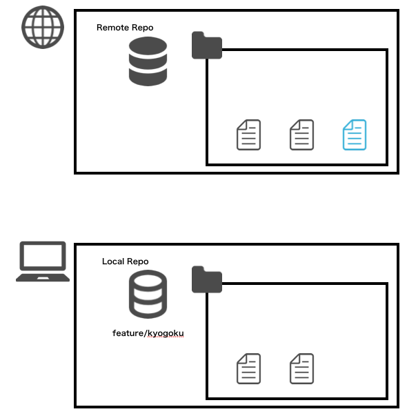
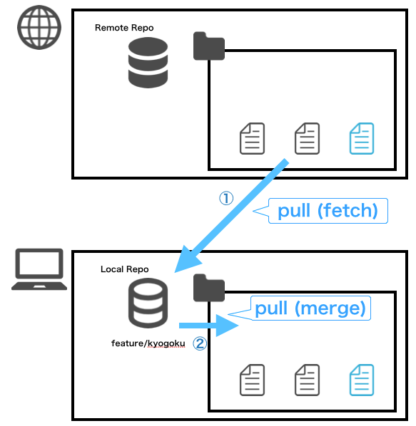

----

こんな感じで、一度のコマンドで「リモートリポジトリ」の内容を「作業エリア」に持ってきています。

で、実はこのコマンドは下記 2 つのコマンドを 1 回で行っているのと同じことになります。

`git fetch`
`git merge`

----

ここを深く話すとさらに混乱するかもしれませんので、省略して説明すると... :sweat_smile:

`git fetch` で、**リモートリポジトリ**の最新内容を、ローカルリポジトリに取り込む
`git merge` で、**ローカルリポジトリ**の最新内容を、作業エリアに取り込む

ということを行ってくれています。
便利ですね〜🤤

----

でも、なんで 1 回のコマンドで済むのに、わざわざ `fetch` や `merge` コマンドがあるのでしょうか？
それは、これから説明する編集したファイルの内容が、他の人とバッティングした時に役に立ってくるからです。
この「編集したファイルの内容が他の人とバッティングした」というのを、我々の業界では「**コンフリクトした**」と言います。

なので、次ページ以降は「コンフリクト」という言葉で表現させていただきますね :wink:

----

それでは、ここからは実際にファイルをコンフリクトさせ、それを解消していく流れを追っていきましょう。
これが最後の Git の章になりますので、もう一踏ん張りファイト :muscle:

:musical_note: :curly_loop: :musical_note:

ここからは 2 人 1 組で行っていただきますので、前後左右の方とペアを決めてください。
（座席はそのままで構いません）
（もしどうしても 1 人になりそう、という方がいらっしゃったら、GW のメンバ or 私がペアになるのでお声がけください）

----

ペアでやることはこんな感じです（多いです）。
（仮にペアを A さん / B さんとします）

1. A さんが新しいブランチを作成し、ペアのそれぞれの作業エリアに持ってくる
2. A さんが自分の自己紹介文の末尾に「好きな映画や本」を追記
3. 追記した内容をリモートリポジトリに反映
4. B さんが A さんの自己紹介文の末尾に「ステキな内容ですね！」と追記
5. B さんが #4 の内容をリモートリポジトリに反映
6. **すると、無事にコンフリクトが発生します** :fire::fire::fire:

----

7. B さんはコンフリクトを解消し、再度追記した内容をリモートリポジトリに反映
8. A さんは最新の内容をリモートリポジトリから取得
9. A さんは自分の自己紹介文の末尾を確認し、「好きな映画や本」と B さんが書いた感想文が両方含まれていることを確認

ここまでできたら、A さん / B さんを交代して、#2 から再度実施します
時間の都合で割愛するかもしれません🙇‍♀️

----

では、早速順番にやっていきましょう！！

A さん：💚
B さん：💛

----

#### 1. A さんが新しいブランチを作成し、ペアのそれぞれの作業エリアに持ってくる

💚 ： `master` ブランチから新たなブランチを作成します
`feature/{A-name}-step2` という名前のブランチ（A-name は A さんの名前）
💚 ： ブランチを作成したら `git checkout` でブランチを切り替えます
💚 ：そして、まだ何も内容を変えずに `git push` コマンドを実行
💚💛 ：GitHub から先ほど追加したブランチが存在していることを確認

----

💛 ：下記手順で新しく作成したブランチに切り替えます
（この間に A さんは次シートの内容を実施しておきましょう）
1. `git pull`
2. `git branch feature/{A-name}-step2 origin/feature/{A-name}-step2`
3. `git checkout feature/{A-name}-step2`

💚💛 ：最後に `git branch` で現在のブランチが `feature/{A-name}-step2` であることを確認

----

#### 2. A さんが自分の自己紹介文の末尾に「好きな映画や本」を追記

💚 ：最初のワークで作成したご自身の自己紹介文ファイルの末尾に、「好きな映画や本」を追記

#### 3. 追記した内容をリモートリポジトリに反映

💚 ：では追記した内容をリモートリポジトリに反映していきましょう
`git add`
`git commit`

----

:rotating_light: ここでいったん STOP :rotating_light:
💛 B さんが下記コマンドまでをすべて実施し終えていることを確認。

```bash
# 💛 B さんが実施
git checkout feature/{A-name}-step2
```

問題なければ 💚 A さんは `git push` で追記した自己紹介文をリモートリポジトリへ反映します。

```bash
# 💚 A さんが実施
git push origin feature/{A-name}-step2
```

----

4. B さんが A さんの自己紹介文の末尾に「ステキな内容ですね！」と追記

💛 ：A さんの自己紹介文を確認し、末尾に「好きな映画や本」が **追記されていないこと** を確認
💛 ：A さんの自己紹介文を確認し、末尾に「ステキな内容ですね！」と追記

----

5. 追記した内容をリモートリポジトリに反映

💛 ：では追記した内容をリモートリポジトリに反映していきましょう

* `git add`
* `git commit`
* `git push`

きっとここで何かしらのエラーメッセージが表示されているはずですので、次にいきます...

----

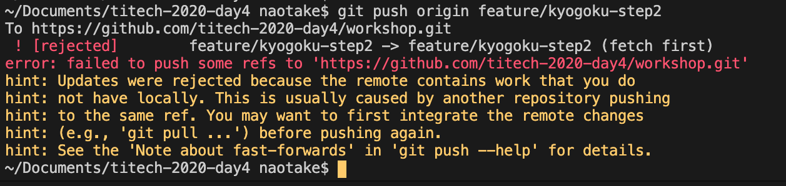

このようなエラーメッセージが表示されていれば正しい状態です。

これは、リモートリポジトリ側の `feature/{A-name}-step2` ブランチの状態が変更されたので、最新内容を `git pull` で取得してね。

というメッセージとなります。

----

ではそれにしたがって `git pull` を叩いてみましょう。

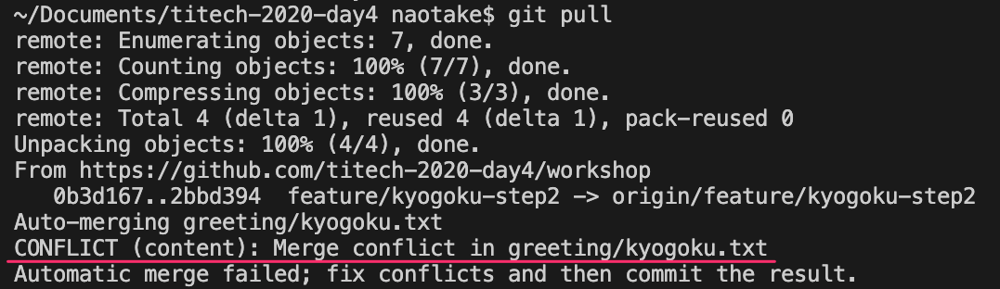

### 6. すると、無事にコンフリクトが発生します

----

では、このコンフリクトを解消していきましょう。

現在の状態としては A さんと B さんとで同じファイルを編集したことで、編集内容の競合が起きたのです。

Git は編集された 2 つの内容に対して、どちらが正しい修正内容なのかはわからないため、B さんの変更内容を修正するよう促しています。

----

7. B さんはコンフリクトを解消し、再度追記した内容をリモートリポジトリに反映

💛 ：では、さっそくコンフリクトを解消していきましょう。
（このあと A さん / B さんの役割を交代するので、A さんは前の画面を見ておいてください）

----

💛 ：`git status` を実行してみてください。

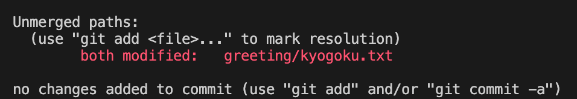

すると A さんの自己紹介文ファイルに対して `both` と記載があるはずです。
これは文字通り、リモートリポジトリと作業エリアの両方で編集があったことを表しています。

----

💛 ：実際のそのファイルを開いてみてください。

`<<<<<<<` や `>>>>>>>` といった記号が含まれていると思います。
これは、それぞれが「リモートリポジトリ側」「作業エリア側」の修正内容を `=======` を区切りとして表現しています。


----

この内容を見ながらコンフリクトを解消していきます。
解消の方法としてはざっくり 3 パターンあります。

1. 作業エリア側の内容を **正** として、リモートリポジトリ側の修正内容を削除する
2. その逆
3. リモートリポジトリ側、作業エリア側、両方の修正内容を**残す**

今回は #3 のパターンを使って、コンフリクトを解消していきます。

----

💛 ：コンフリクトしたファイルの `<<<<<<<` や `>>>>>>>` の文字があると思いますが、その上に
`Accept Current Change | Accept Incoming Change | Accept Both Changes | Compare Changes`
の表記があるはずです。

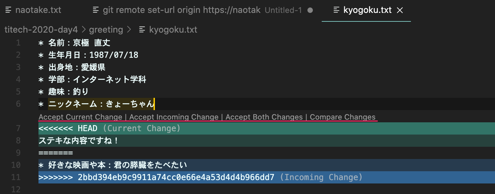

----

これはそれぞれ先ほどの #1 ~ 3 を表しています。

1. 作業エリア側の内容を **正** として、リモートリポジトリ側の修正内容を削除する
  → `Accept Current Change`
2. その逆
  → `Accept Incoming Change`
3. リモートリポジトリ側、作業エリア側、両方の修正内容を**残す**
  → `Accept Both Changes`

💛 ：なので、今回は #3 の `Accept Both Changes` を選択してください。

----

すると、先ほどあった `<<<<<<<` や `>>>>>>>` といった文字は消えているはずです。
これでコンフリクトを解消した、という状態になります。

💛 ：では、リモートリポジトリへ反映していきましょう。

* `git add`
* `git commit`
* `git push`

----

8. A さんは最新の内容をリモートリポジトリから取得

💚 ：リモートリポジトリから最新の内容を取得しましょう

* `git pull`

もし `Please specify which branch you want to merge with.` のようなメッセージが表示されたら下記のコマンドを実行した後、再度 `git pull` を叩いてください。

```bash
git branch --set-upstream-to=origin/feature/{A-name}-step2 feature/{A-name}-step2
```

----

9. A さんは自分の自己紹介文の末尾を確認し、「好きな映画や本」と B さんが書いた感想文が両方含まれていることを確認

💚 ：自分の自己紹介文のファイルを開き、末尾に自分が記入した「好きな映画や本」、それと B さんが書いた感想文が両方含まれていることを確認

これで無事にお互いのファイルを編集した内容を取り込むことができました。

----

では、A さん / B さんを交代して再度コンフリクト発生から解消までをやってみましょう。
#1 はすでに対応済みのため、#2 の手順からおこないます。

1. ~~A さんが新しいブランチを作成し、ペアのそれぞれの作業エリアに持ってくる~~
2. A さんが自分の自己紹介文の末尾に「好きな映画や本」を追記
3. 追記した内容をリモートリポジトリに反映
4. B さんが A さんの自己紹介文の末尾に「ステキな内容ですね！」と追記
5. 追記した内容をリモートリポジトリに反映
6. **すると、無事にコンフリクトが発生します** :fire::fire::fire: 

----

7. B さんはコンフリクトを解消し、再度追記した内容をリモートリポジトリに反映
8. A さんは最新の内容をリモートリポジトリから取得
9. A さんは自分の自己紹介文の末尾を確認し、「好きな映画や本」と B さんが書いた感想文が両方含まれていることを確認

----

<!-- _class: lead -->

### おつかれさまでした！！
### これで Git / GitHub の章は終わりです！！

----

今回学んだことをおさらいしますね。

### :ballot_box_with_check: チーム開発に必要なこと：開発編

* Git の一通りのコマンドを学ぶ
* GitHub の Pull & Request を使い、コードレビューを学ぶ
* コードのコンフリクトが発生した時の対処法を学ぶ

----

##### :beginner: 最後の最後に Tips

気づいてらっしゃった方がいるかもしれませんが
実は「現在のブランチ」は VS Code の左下に表示されていました。
基本はここをみて OK です 😅

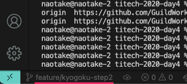

----

<!-- _class: lead -->

# <!-- fit --> それでは、後半戦（まだ前半だけかよ）行ってみましょう！

----

### :black_square_button: チーム開発に必要なこと：コミュニケーション編

* 普段行うコミュニケーション
* 定期的に行うコミュニケーション

----

複数人で開発を進める上で重要になってくるのがコミュニケーションです。
「そんなの当たり前やん」と思うかもしれませんが、これが意外と大変です。

みんなそれぞれバックグラウンドが異なります。
価値観も異なります。

でも、何かの目的を達成するために集まってできたのがチームです！

:two_men_holding_hands: :two_women_holding_hands: :two_men_holding_hands: :two_women_holding_hands: :two_men_holding_hands: :two_women_holding_hands: :two_men_holding_hands: :two_women_holding_hands: :two_men_holding_hands: :two_women_holding_hands: :two_men_holding_hands: :two_women_holding_hands: :two_men_holding_hands: :two_women_holding_hands: :two_men_holding_hands: :two_women_holding_hands: :two_men_holding_hands: :two_women_holding_hands: :two_men_holding_hands: :two_women_holding_hands: :two_men_holding_hands: :two_women_holding_hands: :two_men_holding_hands:

----

みんなそれぞれの考え方・価値観を変えることはできません。
それよりは、相手のことを受け入れた上で日々の開発を進めることが重要になってきます。

そこで大事になって来るのがコミュニケーションです。

ここでは、「**普段行うコミュニケーション**」と
「**定期的に行うコミュニケーション**」に分けて話していきます。

抽象的な話だけだとイメージが少ないかもしれませんので、普段の私を例にしながら話してみますね :wink:

----

<!-- _class: lead -->

まずは...
# <!-- fit --> 「普段行うコミュニケーション」

----

まず最初は **Slack** です！


エンジニアの業界では、割とこんなご時世になる前から Slack を使ったコミュニケーションは行われていました。
（もちろん、対面でのコミュニケーションが全く無い、と言うわけではありません）

----

といっても **Slack** の話なんてあまり興味無いですよね？
（ネット見たら分かるやん！という心の声が聞こえてきます）

ここでは、私が普段どんなふうに Slack を使っているかをご紹介します。

----

### チャンネルの専用化

新しい Slack のワークスペースを作成すると `#general` と `#random` のチャンネルが出来上がります。

本当に 1 人か 2 人くらいであれば、まぁいいかもしれませんが
`#general` チャンネルだけですべての会話を話していると、そのチャンネルの内容がごちゃごちゃしてきて

* あの時の会話どこで話していたっけ... 🤔
* ○○○ について確認したいのに、いま別の話題で盛り上がっているから書きづらいな...

といった問題が出てきます 😥

----

そこで、必要な話題毎にチャンネルを分け、チャンネルを専用化します。
たとえばこんな感じですね。

`#dev-all` : 開発全般に関するやりとり
`#dev-vue` : Vue.js に関するやりとり
`#dev-design` : デザインに関するやりとり
`#ざつだん` : 普段の雑談 （ `#randome` でも可）
`#general` : みんなに周知したいこと

こうすることで、それぞれの話題に関するやりとりがまとまるので、その話題に関するやりとりをしやすいし、あとで探しやすくもなりますね。

----

ただ、気心しれた仲間だけであれば `#ざつだん` チャンネルを使って、みんなが書き込みをして盛り上がるかもしれません。
しかし、あまり相手のことを知らないような状況だと、中々 `#ざつだん` チャンネルに書き込みづらかったりします。

:pensive: :disappointed: :frowning: :pensive: :disappointed: :frowning: :pensive: :disappointed: :frowning: :pensive: :disappointed: :frowning: :pensive: :disappointed: :frowning: :pensive: :disappointed: :frowning: :pensive: :disappointed: :frowning: :pensive: :disappointed:

----

そこでもう少しハードルを下げたもの、かつチームのメンバがどういうことを考えているんだろう？今どういう気持ちなんだろう？というのをフラットに会話するきっかけになるのが

`#poem-{your-name}` チャンネルです

これは、いわば独り言チャンネルです :man:
ここにはその人が感じた・思ったことをなんでも書いて OK  👌
（チーム内に閉じた Twitter みたいな感覚かな :bird:）

----

# <!-- fit --> 例えば私の `#poem-kyogoku` だと...

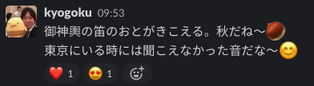
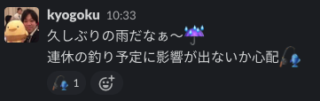
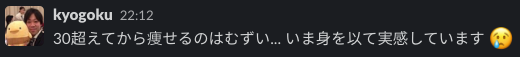
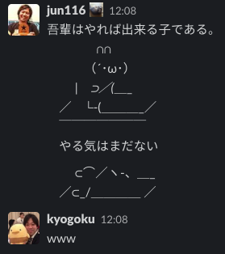

----

みたいな、本当になんでも構いません :dog:

そして、このチャンネルには基本的にその人が発信するチャンネルではありますが、チーム全員が参加しています :mouse: :hamster: :rabbit: :wolf: :bear: :frog:

こうすることで誰かの独り言が会話のきっかけになればよいのです :v:

----

こんな感じで Slack 一つ取っても使い方次第でコミュニケーションの幅を広げることが可能です！

そして、コミュニケーションの幅を広げ、相手のことを知る。
何が好きで、何が得意か。
どういった思考を持っているのか。

こういったことを知るところから、チームは少しずつ走り出します！

:house: :runner: :running: :running: :dash: :dash: :dash:

----

そのほかにも普段行うコミュニケーションとして
Zoom の話などもあるのですが、時間の都合で割愛します :bow:

ご興味がある方は休み時間にでも！！


----

<!-- _class: lead -->

続いて...
# <!-- fit --> 「定期的に行うコミュニケーション」

----

複数人のチームを組んで物事を進めていく時、相手の人となりや、相手がよろこぶ事・嫌がる事を知っておくことはコミュニケーションを円滑に進める上でとても重要です。

ここでは、お互いを知るためのフレームワークとして
ドラッガー風エクササイズを紹介します。

:dancers: :curly_loop: :triangular_flag_on_post: :dancers: :curly_loop: :triangular_flag_on_post: :dancers: :curly_loop: :triangular_flag_on_post: :dancers: :curly_loop: :triangular_flag_on_post: :dancers: :curly_loop: :triangular_flag_on_post: :dancers: :curly_loop: :triangular_flag_on_post: :dancers: :curly_loop: :triangular_flag_on_post: :dancers: :curly_loop:

----

### :dancers: ドラッガー風エクササイズ :dancers: 

各人がそれぞれ下記について回答します。

1. 得意なこと
2. 貢献できること
3. 大切に思う価値
4. 地雷
5. 期待されていると思うこと

質問の内容は厳密にコレじゃないとダメ！ということはありません。
それぞれのシチュエーションにおいてやりやすい内容で全然 OK :ok_woman:

----

例えばこんな感じ :eyes:

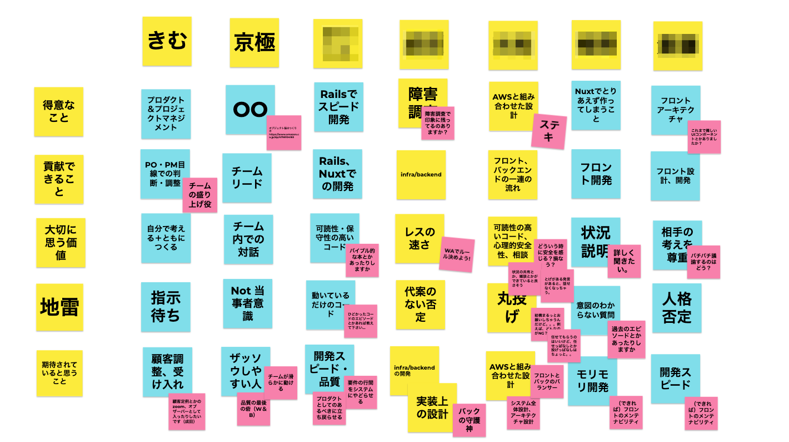

----

各人がそれぞれの質問に答え、順番に発表していきます。
聞いているメンバは「それってどういうこと？」や「もっと詳しく教えて！」といった時には、追加の質問を貼り付け、それをもとに後から深堀りします :honey_pot:

もちろん、これを行ったからといって、チームの雰囲気がよくなる、というものではありません。
しかし、メンバがどういう人なんだろう？ということを理解することの初めのキッカケにはなると思います。

もし、今後合宿等でやってみたい！というチームがありましたら、是非お声がけくださいー :raising_hand:

----

<!-- _class: lead -->

もう一つ。
# <!-- fit --> 「定期的に行うコミュニケーション」

##### :raised_hands: 今度は実際にやってみましょう :raised_hands:

----

チーム活動をある程度の期間進めていると
「やってみてよかった」「こんな気づきがあった」「こんなことやってみたい」
といったことを思う瞬間があると思います。

これを自分 1 人で完結させず、チームに共有することで
チームの成長を促していく、という活動が大事です！

ここではチームの内省力を高めるためのフレームワークとして
**YWT** を紹介して、実際にやってみましょう！

----

### YWT（ワイダブリューティー）

これは

Y：やったこと
W：わかったこと
T：つぎにやること

というのをみんなで出し合ってまとめていくフレームワークです。
（日本で生まれたフレームワークだそうです）

----

### YWT（ワイダブリューティー）

実践したことからの学びや経験、気づきをふりかえり
試行錯誤しながら進んでいく際に、やりっぱなしにせず立ち止まって考えるのにとても有用なふりかえり手法です。

参考：https://codezine.jp/article/detail/11118?p=3

----

まず **[ Y ]** では、これまでに「やったこと」という自分の経験をふりかえります。

一定期間（数週間や数ヶ月）の中で、こんなことやった、あんなことやった、など「取り組んだこと」について付箋に書き出していきます。
1 枚の付箋に 1 つの「やったこと」を書き出します。

----

「やったこと」の書き出しが終わったら、1 人ずつ自分の内容を手短に説明します。

一通り自分の内容を説明し終えたら、次の人に交代します。
これを全員で一周します。

----

次に **[ W ]** では、先ほどの「やったこと」からの学びや気付き、発見したこと考えていきます。

学びの中には、「よくなった」や「効果があった」など、ポジティブなことだけでなく
「よくなかった」や「ｘｘｘが悪くなった」など、ネガティブな学びも振り返っていきます。
それをまた同じように 1 枚の付箋に 1 枚の「わかったこと」として書き出します。

----

「わかったこと」の書き出しが終わったら、先ほどと同じように自分の内容を手短に説明します。

一通り自分の内容を説明し終えたら、次の人に交代します。
これも全員で一周します。

他の人の「わかったこと」に対して、共感や自分の新たな発見があればそれも付箋に書いておきます。
元々の「わかったこと」の付箋の近くに貼っておくと関係性がわかってより Good 👍 

----

最後に **[ T ]** として、「わかったこと」からの学びや気づきを生かして、「次にやること（やってみたいこと）」を考えます。

「わかったこと」でお伝えした通り、ポジティブな学び・ネガティブな学びの両方の観点があったと思います。
なので、ここでは

* ポジティブな学び：継続するためにはどうするのが良いか？
* ネガティブな学び：改善するためにはどうするのが良いか？

といった感じで考えてみると良いかもしれませんね。

----

これも 1 枚の付箋に 1 枚の「次にやること」を書き出します。
同じく自分の内容を説明して交代して、を全員で一周します。

最後に出揃った「次にやること」を確認し、チームとしてそれを「やれるか？」を確認して終了です。

----

まとめるとこんな感じですね。

* **Y [やったこと]**：自分が実践した・取り組んだことを振り返る
* **W [わかったこと]**：そこから学んだ経験を考える
* **T [次にやること]**：その経験を踏まえて、継続・改善するためにやることを考える

これを今回みなさんとやってみたいと思います💪

----

といっても、ここまで説明した内容をこの人数で 100% 全力で取り組むと時間が足りないので
コンパクトバージョンでやってみたいと思います！

* Y [やったこと]：自分が実践した・取り組んだことを振り返る
  :watch: 考える & :pencil2: 書いてみる：5min
* W [わかったこと]：そこから学んだ経験を考える
  :watch: 考える & :pencil2: 書いてみる：5min
* T [次にやること]：その経験を踏まえて、継続・改善するためにやることを考える
  :watch: 考える & :pencil2: 書いてみる：5min

----

とはいえ、テーマがないと振り返ろうとにも振り返れないと思いますので、今回は

#### <!-- fit --> Learning Phase #1 〜 #4 までの内容に対する YWT

でやってみたいと思います！

----

#### <!-- fit --> Learning Phase #1 〜 #4 までの内容に対する YWT

##### グランドルール

* 時間厳守 :hourglass_flowing_sand: :hourglass:
* 他の方の発言や意見を否定 / 遮らない :police_car: :dash:
* 講師の悪口は :no_good: :no_good:
  * もちろん、講義内容に対する FB は大歓迎 :heart:
  * よかった、分かり辛かった、もっと説明してほしかった、など

----

で、この YWT を **Miro** というサービスを使ってやってみましょう！


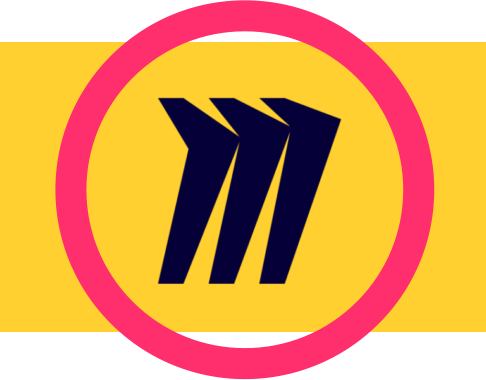

----

Miro はオンラインホワイトボードと呼ばれるサービスで
オンライン上で、ホワイトボードを使ったワークショップを実施することができます。

せっかくの機会なのでみなさんにも Miro を使っていただければと思いまして、今回は Miro を選定しました。

----

「百聞は一見にしかず」

まずは下記 URL から Miro のページにアクセスしてみましょう。

https://miro.com/app/board/o9J_ldDAzpY=/

おそらくアクセスするとパスワードを求められると思いますので下記を入力してください。

```none
2Efwt4nENbxquV
```

画面が開けない人ー🙋‍♀️ ？

----

Miro の使い方を説明するとこれまた時間が足りなくなるので、最低限のことだけ説明しますね。

#### 付箋を新しくはって記入


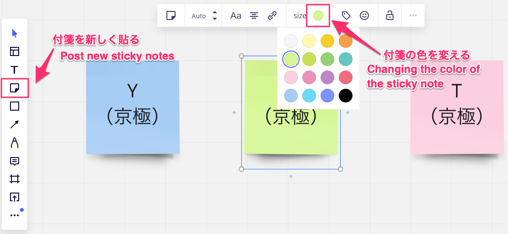

----

付箋の色はあとで分かりやすくするために下記色で統一しましょう

**Y**：青色 :blue_heart:
**W**：緑色 :green_heart:
**T**：桃色 :sparkling_heart:

また、記入した末尾に自分の苗字を括弧書きで記入します。

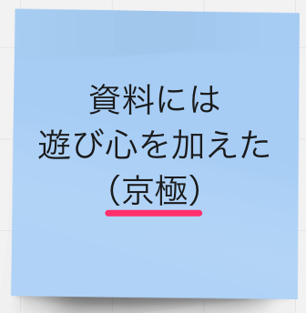

----

では早速やっていきましょう！

#### <!-- fit --> Learning Phase #1 〜 #4 までの内容に対する YWT

* Y [やったこと]：自分が実践した・取り組んだことを振り返る
  :watch: 考える & :pencil2: 書いてみる：5min
* W [わかったこと]：そこから学んだ経験を考える
  :watch: 考える & :pencil2: 書いてみる：5min
* T [次にやること]：その経験を踏まえて、継続・改善するためにやることを考える
  :watch: 考える & :pencil2: 書いてみる：5min

----

First... 

#### <!-- fit --> Learning Phase #1 〜 #4 までの内容に対する YWT

* **Y [やったこと]：自分が実践した・取り組んだことを振り返る**
  **:watch: 考える & :pencil2: 書いてみる：5min**
* W [わかったこと]：そこから学んだ経験を考える
  :watch: 考える & :pencil2: 書いてみる：5min
* T [次にやること]：その経験を踏まえて、継続・改善するためにやることを考える
  :watch: 考える & :pencil2: 書いてみる：5min

----

<!-- _class: lead -->

#### 時間を 5min 取りますので
#### 各自 **Y [やったこと]** のエリアに付箋で書いていきましょう！

:hourglass_flowing_sand: :curly_loop: :curly_loop: :curly_loop: :curly_loop: :curly_loop::hourglass:

----

<!-- _class: lead -->

# <!-- fit --> そこまでー！

----

Next...

#### <!-- fit --> Learning Phase #1 〜 #4 までの内容に対する YWT

* Y [やったこと]：自分が実践した・取り組んだことを振り返る
  :watch: 考える & :pencil2: 書いてみる：5min
* **W [わかったこと]：そこから学んだ経験を考える**
  **:watch: 考える & :pencil2: 書いてみる：5min**
* T [次にやること]：その経験を踏まえて、継続・改善するためにやることを考える
  :watch: 考える & :pencil2: 書いてみる：5min


----

<!-- _class: lead -->

#### 時間を 5min 取りますので
#### 各自 **W [わかったこと]** のエリアに付箋で書いていきましょう！

:clock11: :curly_loop: :curly_loop: :curly_loop: :curly_loop: :curly_loop: :clock1:

----

<!-- _class: lead -->

# <!-- fit --> そこまでー！

----

Last...

#### <!-- fit --> Learning Phase #1 〜 #4 までの内容に対する YWT

* Y [やったこと]：自分が実践した・取り組んだことを振り返る
  :watch: 考える & :pencil2: 書いてみる：5min
* W [わかったこと]：そこから学んだ経験を考える
  :watch: 考える & :pencil2: 書いてみる：5min
* **T [次にやること]：その経験を踏まえて、継続・改善するためにやることを考える**
  **:watch: 考える & :pencil2: 書いてみる：5min**

----

<!-- _class: lead -->

#### 時間を 5min 取りますので
#### <!-- fit --> 最後に **T [次にやること]** のエリアに付箋を書いていきましょう！

:watch: :curly_loop: :curly_loop: :curly_loop: :curly_loop: :curly_loop: :watch:

----

<!-- _class: lead -->

# <!-- fit --> 終了ー:bell:！

----

<!-- _class: lead -->

#### せっかくなので発表したい方いらっしゃいませんかー🙋‍♀️ ？

#### ... 先に「ありがとうございます！」と言っておきます！笑

----

<!-- _class: lead -->

#### これにて YWT を使ったワークショップは終了です！
### お疲れさまでした！
（後ほど、本日の Dropbox へ今日の YWT の全体ページのキャプチャを保存しておきますね :camera:）

----

今日紹介した YWT は個人単位やチーム単位での内省を促すフレームワークの一つとして紹介しました。

もちろん、こういった振り返りを行うためのフレームワークは他にもあります。
実際に試してみて、個人やチームに合う・やりやすい方法で行うのが良いと思います！

----

そして、もう 1 つ重要なことは、こういった振り返りを通した内省を、チームとして**定期的**に行うことです。

個人の成長はもちろん大事ですが、そこにチームとしての成長が加わることで、例えば 3 人のチームのパワーが 1+1+1=3 ではなく、4 にも 5 にもなると思います！

時間はかかりますが、必要な時間だと思ってチームで取り組んでみていただければと思います :blush:

こちらも、もし今後合宿等でやってみたい！というチームがありましたら、是非お声がけくださいー:raising_hand:

----

<!-- _class: lead -->

#### 以上で
### 『チーム開発に必要なこと：コミュニケーション編』
#### は終了です！

----

### :ballot_box_with_check: チーム開発に必要なこと：コミュニケーション編

* 普段行うコミュニケーション
  * 普段から Slack を使うためのノウハウ
* 定期的に行うコミュニケーション
  * ドラッガー風エクササイズを通してお互いを知る
  * YWT を通して内省・振り返りを行う

----

### 終わりに...

ここまで話してきた内容はあくまでチームビルディングのほんの一部です。

**チーム** を **チーム** とするための活動には色々あります。
今回紹介した手法を使うことで、多少なりとも効果は見込めるでしょう。

しかし、メンバにはそれぞれのバックボーンや価値観を持っています。
そんな様々なメンバが集まったチームでは、時として衝突したり、思い通りに行かないこともきっとあります。

----

そうした時、メンバ（相手）の考えや行動を変えようとするのではなく
「チームにとって何が重要なのか」
「チームとして何ができるのか」
を **"チーム"** が理解し、考え、行動することが重要です。

そのためにまずは「相手を知り、相手を受け入れる」ことが大切だと私は思っています。

そうした時に、今日説明したお話が少しでもキッカケになれば幸いです。

----

もちろん、今日の話を踏まえて、もっと踏み込んだ話をしたい・聞きたい方がいらっしゃいましたら
メール :envelope: なり、zoom :tv: なり、合宿の時にでも熱く語りましょう!!

:beer: :smile::beer: :smile::beer: :smile::beer: :smile::beer: :smile::beer: :smile::beer: :smile::beer: :smile::beer: :smile::beer: :smile::beer: :smile::beer: :smile::beer:

----

## 今日のおさらい

#### :ballot_box_with_check: チーム開発に必要なこと：開発編

* Git の一通りのコマンドを学ぶ
* GitHub の Pull & Request を使い、コードレビューを学ぶ
* コードのコンフリクトが発生した時の対処法を学ぶ

#### :ballot_box_with_check: チーム開発に必要なこと：コミュニケーション編

* 普段行うコミュニケーション
* 定期的に行うコミュニケーション

----

<!-- _class: lead -->

# <!-- fit --> Enjoy Team, more Teamwork!!

### Thanks :kissing_heart:
