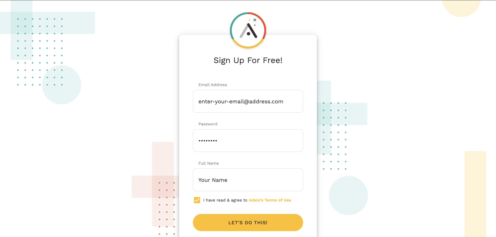
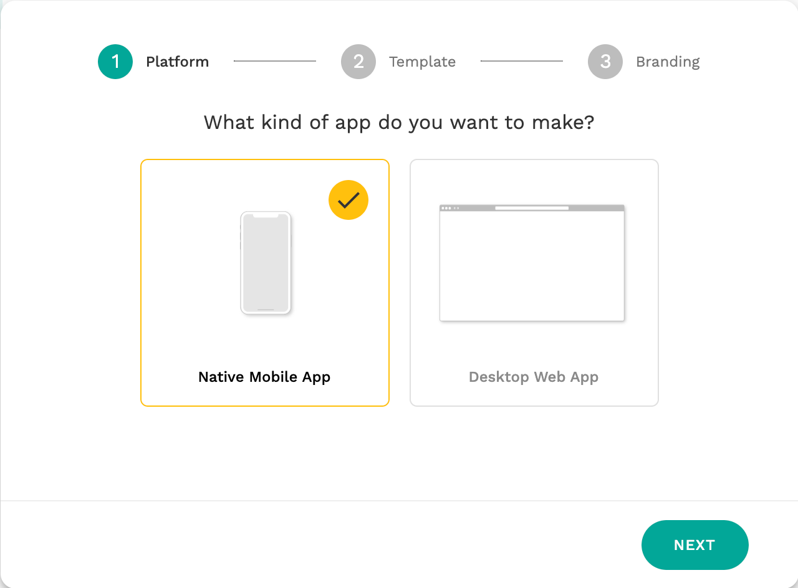
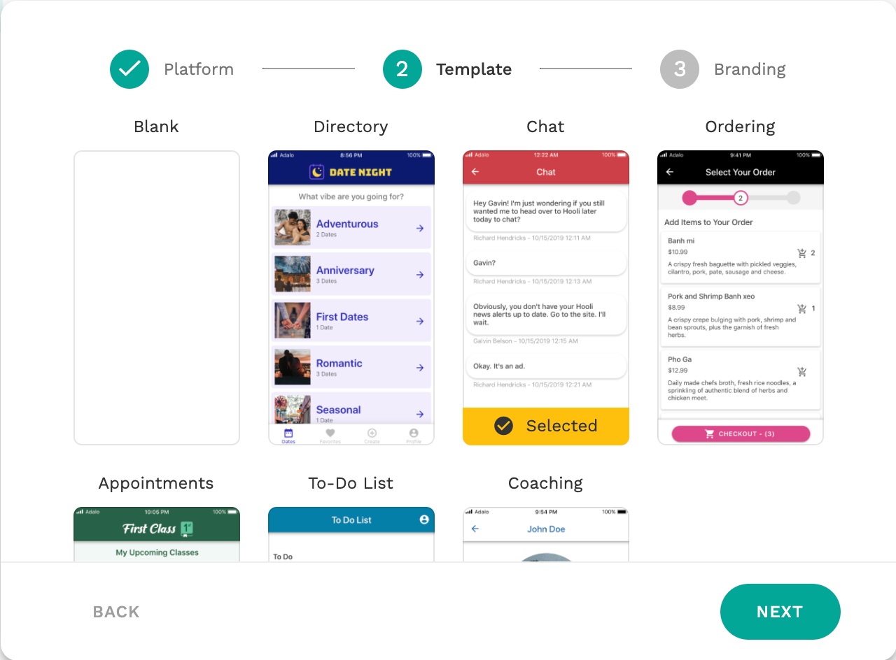
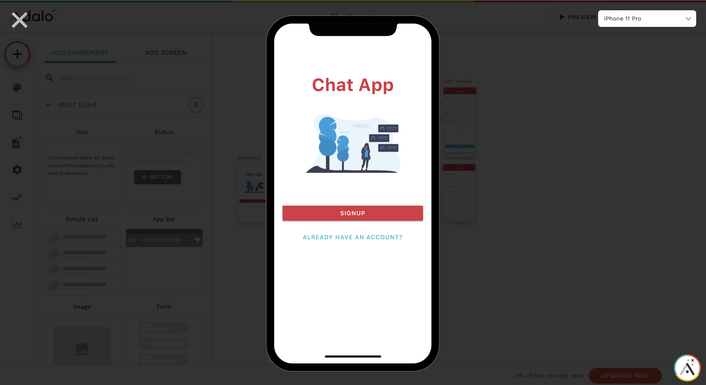
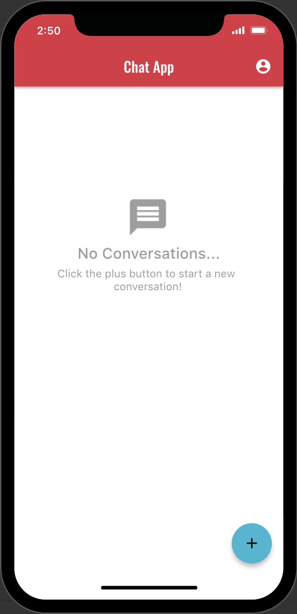
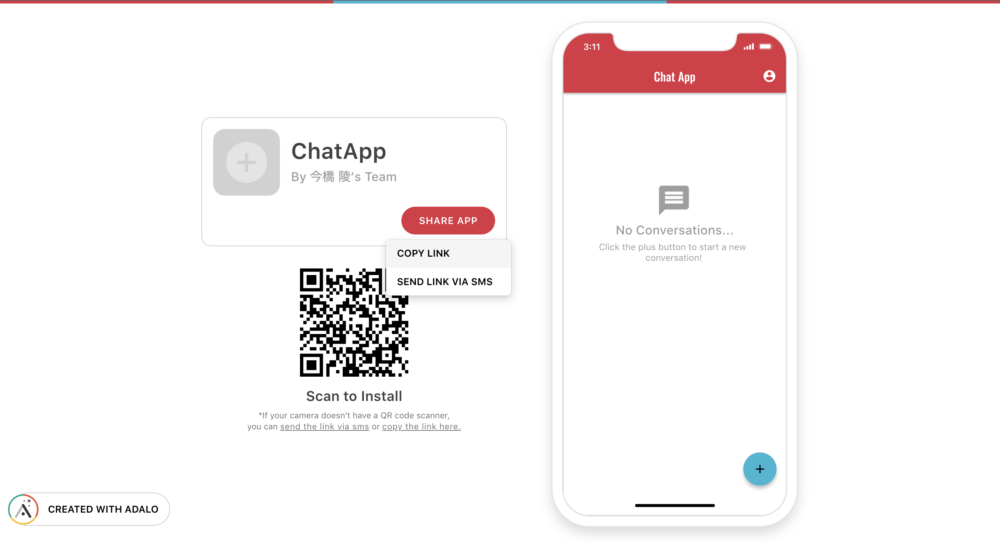
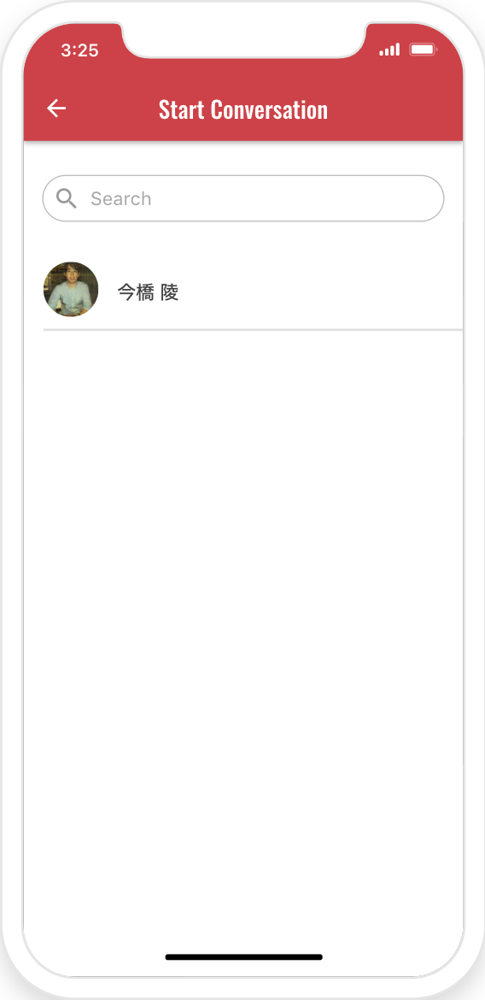
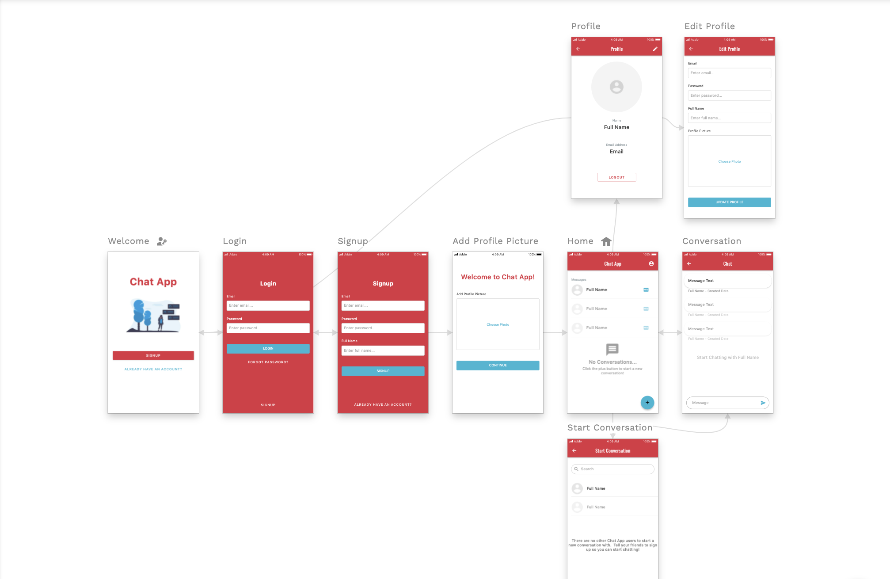
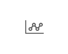
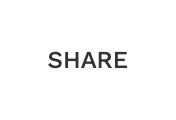

**Programming Boot Camp**

# Adaloの基本

**東京工業大学 2021/10/23**
　
　
　
　
　
　　　　　　　　　　　　　　　　　　　　　　　　**Ryo Imahashi**

---
## 目次
  - Adaloとは
  - Adaloに登録しよう
  - テンプレートアプリを作って操作してみよう
  - Adaloの開発ツールの概要説明
  - アプリを作ってみよう
  - 演習
  - 次回に向けて

---
## Adaloとは
- [Adalo](https://www.adalo.com/)は、アメリカ発のノーコードツールです。プログラミング不要でアプリを開発することができます。
- 用意されているパーツから使用したいものを選び、それを画面にドラッグ＆ドロップしていくことで、アプリを作ることが可能です。
- ブラウザで表示するWebアプリだけでなく、AndroidやiOS向けのスマートフォンアプリも開発できます。開発したアプリのGooglePlayやAppStoreでの公開も可能です。

---
#### Adaloで作られたアプリの例
- Union: https://union-jp.site/
  - 大学生が開発した、大学生・大学院生・大学教員・大学職員限定のSNS
  - 2021年に1,000万円の資金調達を実施している
    - https://prtimes.jp/main/html/rd/p/000000001.000076669.html
- その他にも、 #MadeInAdalo でたくさん紹介されています
  - https://www.adalo.com/made-in-adalo
---
## Adaloに登録しよう
- AdaloのSignUp画面にアクセスしてください
  - https://app.adalo.com/signup

---
- 無料で登録できます
- ご自身のEメールアドレス、パスワード、フルネームを入力してください
- 利用規約への同意のチェックを入れてください
- LET'S DO THIS! ボタンを押して、次の画面に進んでください

---

#### 参考: [無料プラン](https://www.adalo.com/pricing)の制限
<!--  -->
- 外部アプリケーションとの連携ができない
  - ただし、14日間はトライアル利用が可能
- ドメインを変更できない(Adaloのドメインになる)
- ロゴの変更ができない(Adaloのロゴが表示される)
- GooglePlayやAppStoreへの申請ができない
- 1つのアプリで登録できるデータベースのレコード数の上限が50件

※ 実際にサービスを運用していく際は、有料プランへの移行を検討してください

---
#### プラットフォームの選択
- Native Mobile AppとDesktop Web Appが選べます
- 今回は、Native Mobile Appを選択しましょう

---
#### テンプレートの選択
- 完成されたアプリがテンプレートとして提供されています
- 今回は、Chatを選択しましょう

---
#### ブランディング

- App Name、Primary Color、Secondary Colorを自由に入力してください
  - Primary Colorは、アプリで最も使われるベースになる色です
  - Secondary Colorは、目立たせたい時に使う色です。重要なボタンなどに使われます。

<!-- - ADVANCED OPTIONSは変更せず、そのままで大丈夫です -->
---
- このようなAdaloの管理画面が表示されたらOKです
- 今後はこの管理画面を使って、アプリを開発していきます

---
## テンプレートアプリを操作してみよう
- まずはAdaloで作ったアプリがどのように動作するかを確認するために、先ほど選択したChatアプリを操作してみましょう
- 画面右上のPreviewボタンをクリックしてください

---
- プレビュー画面が起動します
- 一緒にChatアプリを操作してみましょう

---
- Signupしましょう
  - EmailとPasswordはメモしておいてください(後で使います)

---
- まだ会話が行われていないため、リストが空の状態です
- 画面右下の + ボタンを押してみましょう

---
- 作成したばかりのアプリで他のユーザーがいないため、Chatができないようです。。

---
- 作ったアプリを他の人にシェアして会話してみましょう
- Previewモードを左上の×ボタンで閉じて、メニューにあるSHAREをクリックしてください

---
- SHARE APPボタンをクリックして、COPY LINKを選択してください
- コピーしたリンクを、参加者全員が見られるところ(Slack?Zoom?)に投稿しましょう

---
- 他の人の投稿したリンクをクリックしてその人のアプリにSignupし、メッセージを送りましょう
  - ユーザーのリストにアプリの作成者(と他の登録者)が表示されると思います

---
- (みんなのアプリにメッセージが送られたであろう頃に、)
自分のアプリのPreview画面をもう一度表示してください
  - メッセージが届いているはずなので、クリックして表示してみましょう

---
- メッセージが受信できました :tada:

---
- 今回試したChat以外にも、いくつかのテンプレートが提供されています。
- 自分たちが作りたいアプリに近いものがあれば、そのテンプレートを流用して開発スピードをアップさせられるかもしれません。時間がある時に、他のテンプレートも試してみましょう。

---
## Adaloでのアプリ開発の概要説明
次に、Adaloでのアプリ開発の概要を説明していきます。

---
### 3つの基本コンセプト
- 基本となる以下3つのコンセプトについて紹介します
  - Components
  - Actions
  - Database

--- 
#### Components
- ユーザーインターフェース(アプリの画面)の構成要素。+で追加できる。

---
#### Actions
- 特定のコンポーネントをクリックした時に何を行うかを指定するために使われる。
TODO: 説明追加と画像

---
#### Database
- 入力されたデータをここに保存したり、ここから保存されたデータを取り出して表示したりする。
TODO: 説明追加と画像

---
### Adaloの機能説明
次に、Adaloの管理画面で利用できる機能を紹介していきます

TODO: 一つ一つ実際に操作してもらうようにする

---
#### Canvas
- 画面を作る作業領域
- スクロール、拡大、縮小ができる

---

#### Left Toolbar
<!--  -->

- Add Panel
    - コンポーネントと画面を選択してアプリに追加できる

- Branding
    - 色を変えられる

- Screens
    - 画面とそれを構成するコンポーネント

---
- Database
    - データベース

- Settings
    - アプリの名前を変えたり、アプリのアイコンをセットしたりできる
    - アプリの複製や削除ができる

- Publish
    - 作ったアプリを公開できる(プレビュー以外は有料)

---
- Analytics
    - Google Analyticsを設定して利用状況をトラッキングできる

---
#### Top Bar
- App Switcher

  - アプリの名前が表示されている
  - アプリを切り替えられる
  - 新しいアプリを追加できる
- Preview

    - アプリを実行して試すことができる
---
- Share

  - アプリをシェアして使ってもらうことができる。相手はAdaloのアカウントを持っていなくてもOK。
- Account Menu

  - Settings
  - Help&Documentation
  - Sign Out

---
#### ComponentとScreen

TODO: 色々ある中でもよく使うCompomentを紹介
TODO: 説明追加と画像

---
#### Blanding
- 色やフォントを自由に変えられる
TODO: 説明追加と画像
---
#### Screens
- 画面の構成要素を見て、変更できる
- Home, Welcomeの設定ができる
TODO: 説明追加と画像

---
#### Database
- Collection
    - 同じ属性(プロパティ)を持ったデータの集まり
    - プロパティ
- Relation
TODO: 説明追加と画像
---
#### 開発に役立つTipsを覚えよう
- 間違って編集してしまった時は、`Command + Z ` で戻れる
- Adaloの開発ツールでは、日本語の直接入力がうまくいかないことがあります。日本語のテキスト入力はコピー＆ペーストで行ってください。
TODO: 他にもあるはず
---
## アプリを作ってみよう
次に、新しくアプリを作ってみましょう
TODO: ペットの健康管理アプリのUIを作っておけると良さそう(データベースに触れずに作るのは難しいので、1テーブルへの登録と表示くらいはやる？)

---
#### テンプレート: Blank でのアプリ作成
TODO

---
#### 画面の見た目を変えてみよう
TODO

---
#### 画面を追加してみよう
TODO

---
#### 画面遷移をさせてみよう
TODO

---
## 演習
TODO

--- 
#### 演習の回答

TODO

---
## まとめ
:white_check_mark: 

---
## 次回に向けて

TODO

---
# 以上です！
# お疲れさまでした！
---
## 参考
- [Adalo Resourcesメモ](https://www.notion.so/Adalo-Resources-3b58f37ac0894b038c30d6b0d8274370)
- https://hashikake.jp/articles/adalo-no-code-app-creation-platform-ep01
- https://www.no-code.tv/course/nocode135
