**Programming Boot Camp**

# Adaloでのアプリ開発と外部連携

**東京工業大学 2023/11/3**
　
　
　
　
　
　　　　　　　　　　　　　　　　　　　　　　　　**Ryo Imahashi**

---
## 目次
  - Adaloとは
  - Adaloに登録しよう
  - テンプレートアプリを操作してみよう
  - Adaloでのアプリ開発の概要説明
  - アプリを作ってみよう
  - 演習
  - まとめ

---
## Adaloとは
- [Adalo](https://www.adalo.com/)は、アメリカ発のノーコードツールです。プログラミング不要でアプリを開発することができます。
- 用意されているパーツから使用したいものを選び、それを画面にドラッグ＆ドロップしていくことで、アプリを作ることが可能です。
- ブラウザで表示するWebアプリだけでなく、AndroidやiOS向けのスマートフォンアプリも開発できます。開発したアプリのGooglePlayやAppStoreでの公開も可能です。
- シンプルで分かりやすいので、ノーコード開発を初めて学ぶためのツールに適しています。

--- 
#### 注意点
- 一つのアプリを複数人で同時編集するのが難しく、Development Phaseでのチーム開発に利用するのはあまりおすすめできません
  - ただし、画面の開発を担当するのが1人だけで、それ以外のメンバーは全員APIの開発を担当するという分担であれば、問題なく使えます

---
#### Adaloで作られたアプリの例
- Union: https://union-jp.site/
  - 大学生が開発した、大学生・大学院生・大学教員・大学職員限定のSNS
  - 2021年に1,000万円の資金調達を実施している
    - https://prtimes.jp/main/html/rd/p/000000001.000076669.html
- その他にも、 #MadeInAdalo でたくさん紹介されています
  - https://www.adalo.com/made-in-adalo
---
## Adaloに登録しよう
- AdaloのSignUp画面にアクセスしてください
  - https://app.adalo.com/signup

---
- 無料で登録できます
- ご自身のEメールアドレス、パスワード、フルネームを入力してください
- 利用規約への同意のチェックを入れてください
- LET'S DO THIS! ボタンを押して、次の画面に進んでください

---

#### 参考: [無料プラン](https://www.adalo.com/pricing)の制限
<!--  -->
- 外部アプリケーションとの連携ができない
  - ただし、14日間はトライアル利用が可能
<!-- - ドメインを変更できない(Adaloのドメインになる)
- ロゴの変更ができない(Adaloのロゴが表示される)
- GooglePlayやAppStoreへの申請ができない -->
- 1アプリで登録できるデータベースのレコード数の上限が200件
- 月間アクション(ボタンクリック時等に行われる処理)回数の上限が1000回

:white_check_mark: 実際にサービスを運用していく際は、有料プランへの移行を検討してください

---
- 利用目的を聞かれるので、 For teaching or taking a class を選択して、Go Build Apps! ボタンを押してください

---
#### プラットフォームの選択
- Responsive AppとMobile Onlyが選べます
- PCとMobileの両方に対応できる、Responsive Appを選択しましょう

---
#### テンプレートの選択
- 完成されたアプリがテンプレートとして提供されています
- 今回は、Chatを選択しましょう

<!-- - ADVANCED OPTIONSは変更せず、そのままで大丈夫です -->

---
#### ブランディング

- App Name、Primary Color、Secondary Colorを自由に入力してください
  - Primary Colorは、アプリで最も使われるベースになる色です
  - Secondary Colorは、目立たせたい時に使う色です。重要なボタンなどに使われます。

---
- このようなAdaloの管理画面が表示されたらOKです
- 今後はこの管理画面を使って、アプリを開発していきます

---
## テンプレートアプリを操作してみよう
- まずはAdaloで作ったアプリがどのように動作するかを確認するために、先ほど選択したChatアプリを操作してみましょう
- 画面右上のPreviewボタンをクリックしてください

---
- プレビュー画面が起動します
- 一緒にChatアプリを操作してみましょう

---
- Signupしましょう
  - EmailとPasswordはメモしておいてください(後で使います)

---
- まだ会話が行われていないため、リストが空の状態です
- 画面右上の NEW CHAT ボタンを押してみましょう

---
- サンプルユーザーのリストが表示されます
- Will Wを選んでクリックしてください
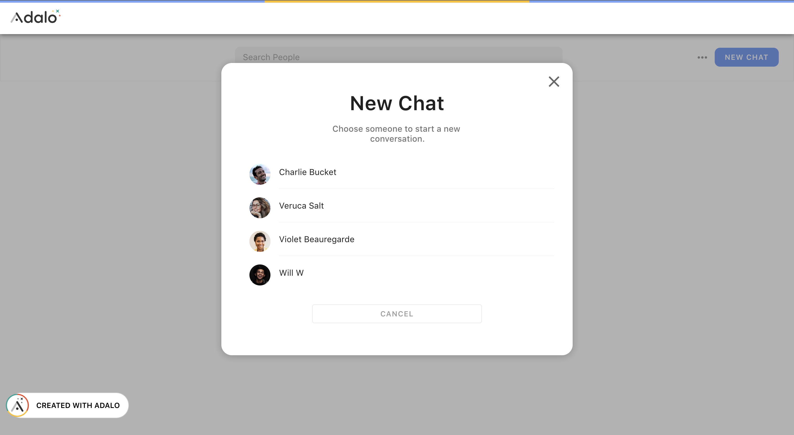

---
- メッセージを送信できます

---
他にも以下のような機能がありますので、試してみましょう。
- プロフィール写真の更新
- パスワードの変更
- ログアウト
- ログイン
  - 以下のように入力すると、サンプルユーザーの Will W としてログインができます
    - Email: will@email.com
    - Password: 123

---
- 今回試したChat以外にも、いくつかのテンプレートが提供されています。
- 自分たちが作りたいアプリに近いものがあれば、そのテンプレートを流用して開発スピードをアップさせられるかもしれません。時間がある時に、他のテンプレートも試してみましょう。

---
## Adaloでのアプリ開発の概要説明
次に、Adaloでのアプリ開発の概要を説明していきます。

---
### 3つの基本コンセプト
- 基本となる以下3つのコンセプトについて紹介します
  - Components
  - Database
  - Actions

--- 
#### Components
- ユーザーインターフェースを作るために画面上に配置される要素。
- 例:
  - リスト
  - ボタン
  - テキスト
  - 画像

---
#### Database
- 整理されたデータの集合。
- データの登録、読込(表示)、更新、削除が行われる。
- 例: Chatアプリの場合

<!--  -->

---
#### Actions
- 特定のコンポーネントをクリックした時に何を行うかを指定するために使われる。
<!-- - コンポーネントとそこで表示するデータベース内のデータを紐付けたり、ユーザー体験をカスタマイズする。 -->
- 例:
  - 別の画面に遷移させる
  - データベースのデータを登録、更新、削除する

---
### Adaloの機能説明
次に、Adaloの管理画面で利用できる機能を紹介していきます
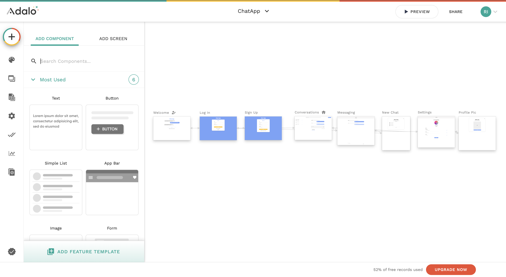

---
#### Canvas
- 画面を作る作業領域
- 要素を選択したり、ドラッグアンドドロップで動かしたりできる

<!-- - スクロール、拡大、縮小ができる -->
<!--  -->

---

#### Left Toolbar
左側のツールバーの各機能を紹介します。

---
######  Add Panel
- コンポーネントや画面を選択してアプリに追加できる
- 機能のテンプレートを追加することも可能

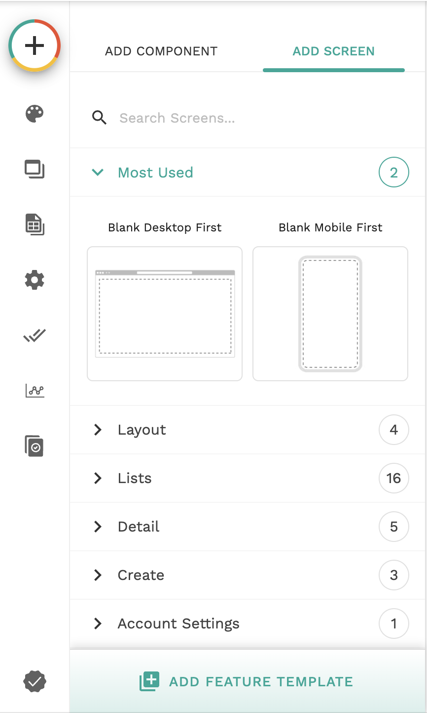
<!-- 画面とコンポーネントの追加を実演する -->
---
######  Branding
- 色やフォントを変えられる

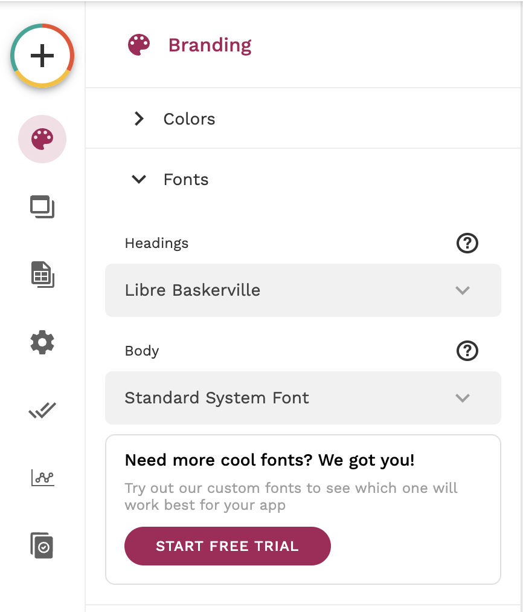
<!-- 色とフォントの変更を実演する -->

---
######  Screens
- 画面の一覧や、その画面の構成を表示できる
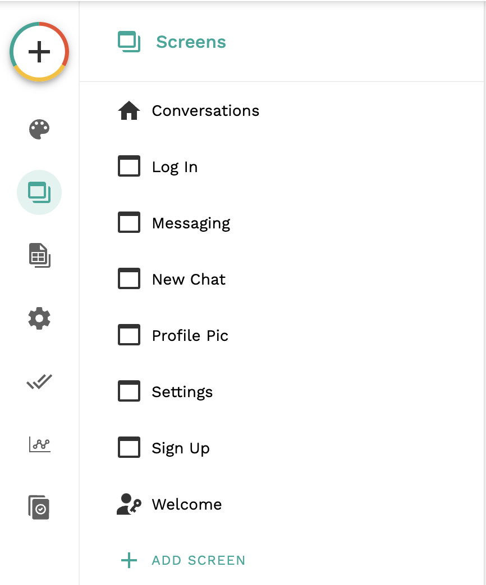

---
######  Database
- データベースの構成や保存されているデータを表示できる
- Collection: 同じ属性(プロパティ)を持ったデータの集まり
 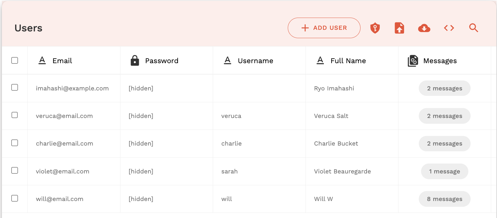

---
######  Settings 
- アプリの名前やアイコンを設定できる
- キャンバスに関する表示設定ができる
- アプリへのアクセス権限の設定ができる
- アプリの複製や削除ができる
- 位置情報機能を使うためのAPIキーの設定ができる

---
###### Publish
- 作ったアプリを公開できる(有料プランのみ)

---
######  Analytics
- 利用状況を分析したレポートを見ることができる

---
######  Version History
- バージョン履歴を作成したり、アプリをバージョン履歴作成時と同じ状態に戻すことができる(有料プランのみ)

---
#### Top Bar
上部のツールバーの各機能を紹介します。

---
###### App Switcher
- 開いているアプリの名前が表示される
- アプリを切り替えられる
- 新しいアプリを追加できる

---
######  Preview, Share
- アプリを実行して試すことができる

---
###### Account Menu
- 各種設定ができる
- ヘルプやドキュメントを開ける
- Adaloのエキスパートを探せる
- ログアウトできる
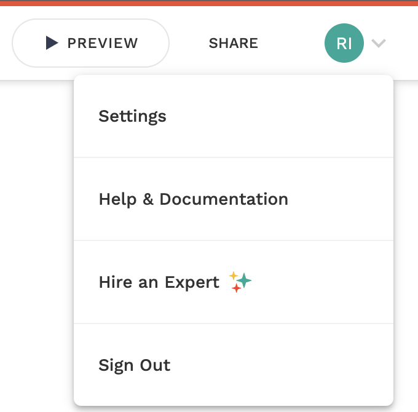

---
#### 開発に役立つTipsを覚えておこう
- 間違って編集してしまった時は、Windowsなら`Ctrl + Z`、Macなら `Command + Z ` で元に戻せます
- Adaloの開発ツールでは、日本語の直接入力がうまくいかないことがあります。日本語のテキスト入力はコピー＆ペーストで行ってください。

---
## アプリを作ってみよう
次に、新しくアプリを作ってみましょう。

<!-- 
データベースにはあまり触れずに作るには？
  - 静的サイトとして作る？
  - データベースは作成済みのテンプレートをクローンしてもらう？ -->

- 今回のレクチャーでは、データベースを使わない静的な(いつどのユーザーがアクセスしても表示される内容が変わらない)画面を作成します。
- 次回のレクチャーで、データベースを使った動的な(ユーザー毎に表示される内容が変わる)画面に仕上げていきます。
<!-- 例: https://kt-life.net/seitekisite-doutekisite/# -->

---
#### 作りたいアプリのUI
ペットの健康管理アプリを作ってみましょう。
まずはUIを確認していきます。

<!--  -->
<!--  -->

---
###### 会員登録画面
- 以下の項目を入力して会員登録できる
  - Email
  - Password
  - Full Name
- 会員登録済の人向けに、ログイン画面へのリンクがある

---
###### ログイン画面
- 以下の項目を入力してログインできる
  - Email
  - Password
- パスワードを忘れた人向けのリンクがある
- 会員登録画面へのリンクがある

---
###### ペット登録画面
- 名前を入力できる
- 写真を選択できる
- 誕生日を入力できる
- 登録ボタンで確定し、ペット一覧画面に遷移できる

---
###### ペット一覧画面
- 登録したペットが一覧で表示できる
- ペットをクリックすると、そのペットのペット詳細画面に遷移できる
- 右下のアイコンを押すと、ペット登録画面に遷移できる

---
###### ペット詳細画面
- 体重記録画面へのリンクがある
(Link2は演習用)
- 誕生日が表示される
- 最新の体重が表示される

---
###### 体重記録画面
- 体重の遷移を示すグラフが表示される
- 現在の体重を入力できる
- ボタンを押して体重を追加できる

<!-- ---
###### 活動記録画面
- 
 -->

---
#### アプリ作成
それでは、実際にアプリを作っていきます。

- CREATE NEW APPを選択してください

---
- Native Mobile Appを選択してください

---
- テンプレート: Blankを選択してください

---
- App Name、Colorを自由に決めてください
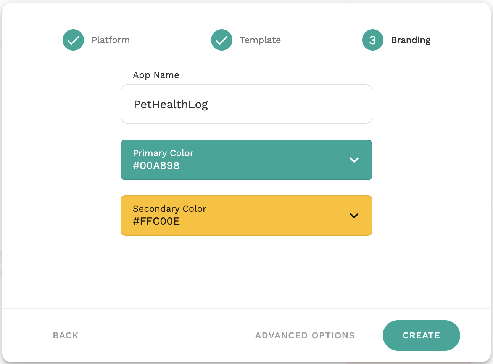

---
- アプリができました

---
###### 会員登録画面、ログイン画面

:white_check_mark: 会員登録画面、ログイン画面はデフォルトで生成されるようになっています。

---
プレビュー機能で動作を確認してみましょう。

- 会員登録画面
  - 会員登録をすると、Home画面に遷移します
  - Home画面右上のアイコンからログアウトしましょう

---
- ログイン画面
  - 先程会員登録したのと同じEmail、Passwordでログインすると、Home画面に遷移します

---
会員登録画面、ログイン画面はそのままで問題ないことがわかりました。
その他の4画面を作成していきましょう。

---
###### ペット登録画面
- 名前を入力できる
- 写真を選択できる
- 誕生日を入力できる
- 登録ボタンで確定し、ペット一覧画面に遷移できる

こちらの画面を作りましょう

---
- ADD SCREENからApp Barを選択します

---
- Screen Nameを入力します

---
Screenが追加されました。

この上に必要なコンポーネントを追加していきます。

---
- ADD COMPONENTからTextを選択します

---
- 画面上に配置します
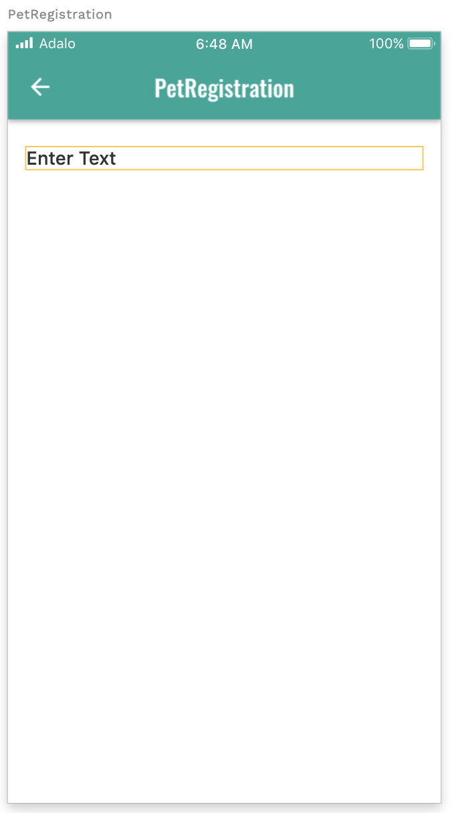

---
- Textの値をNameに変えます

---
- 同様に、ImageとBirthdayというTextも追加します。
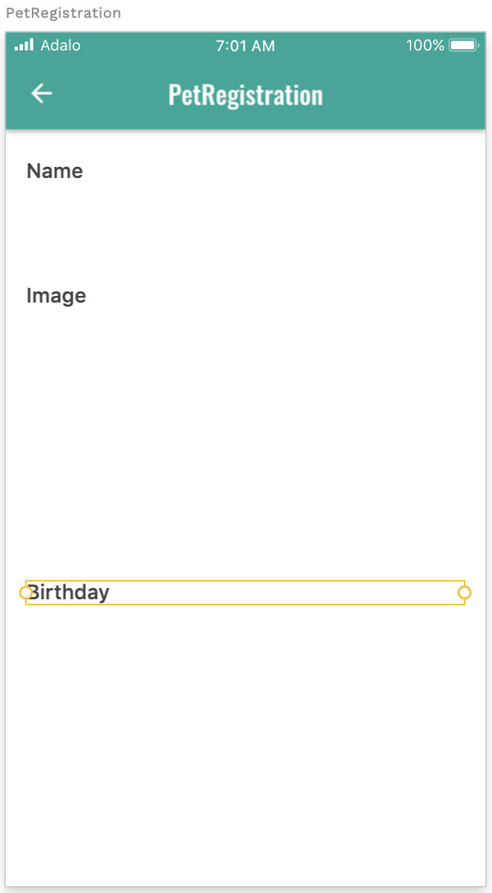

---
- ADD COMPONENTからText Inputを選択します

---
- 画面上に配置し、Placeholderの値をEnter Nameに変更します

---
- ADD COMPONENTからImage Pickerを選択します
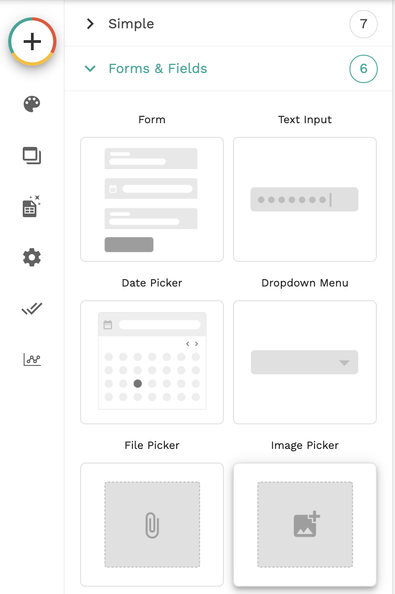

---
- 画面上に配置します

---
- ADD COMPONENTからDate Pickerを選択します

---
- 画面上に配置し、StyleをDate Pickerに変更します

---
- ADD COMPONENTからButtonを選択します

---
- 画面上に配置します
- Textの値をRegisterに変更します
- Button ColorをSecondaryに変更します
- Icon & Text ColorをDefault Background(White)に変更します

---
ペット登録画面の見た目を確認してみましょう。
- まだ導線がなく、画面遷移をして表示することができないので、ログイン後の遷移先であるHome Screenに設定します
- Screensからペット登録画面を選び、Screen Navigation TypeをHome Screenに変更しましょう

---
- プレビュー機能でログインをすると、ペット登録画面が表示できます。
- 名前の入力、画像の選択、誕生日の選択ができます。
- まだRegisterボタンを押しても何も起きません

これで、ペット登録画面のUIは完成です。

---
###### ペット一覧画面
- 登録したペットが一覧で表示できる
- ペットをクリックすると、そのペットのペット詳細画面に遷移できる
- 右下のアイコンを押すと、ペット登録画面に遷移できる

次は、こちらの画面を作りましょう

---
- ADD SCREENからApp Barを選択して、Screen Nameを入力してください

---
- ADD COMPONENTからImageを選択してください

---
- 画面上に配置してください
- Image Source -> Uploadから、ペットの写真をアップロードしてください

---
- ADD COMPONENTからTextを選択してください
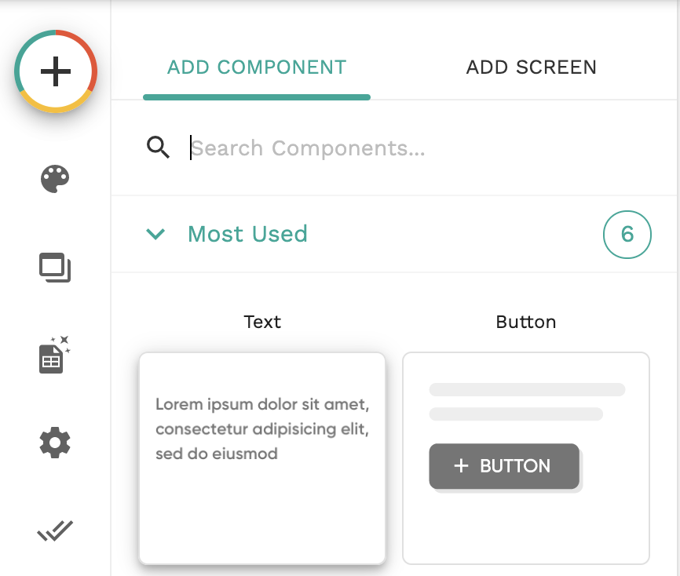

---
- Textにペットの名前を入力し、文字色をWhiteに変更しましょう
- 選んだ写真によっては白い文字が見えづらくなりますので、次は文字を見やすくします
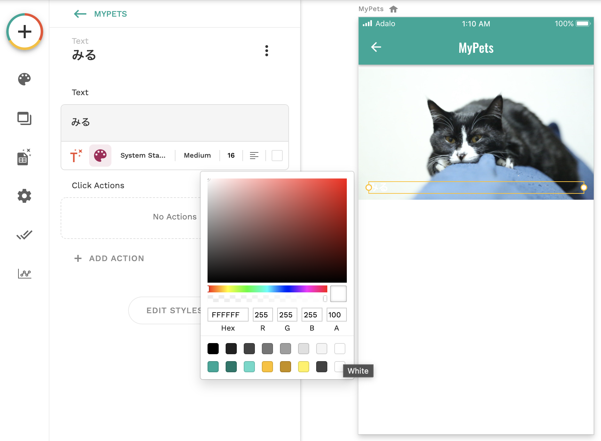

---
- ADD COMPONENTからRectagleを選択してください
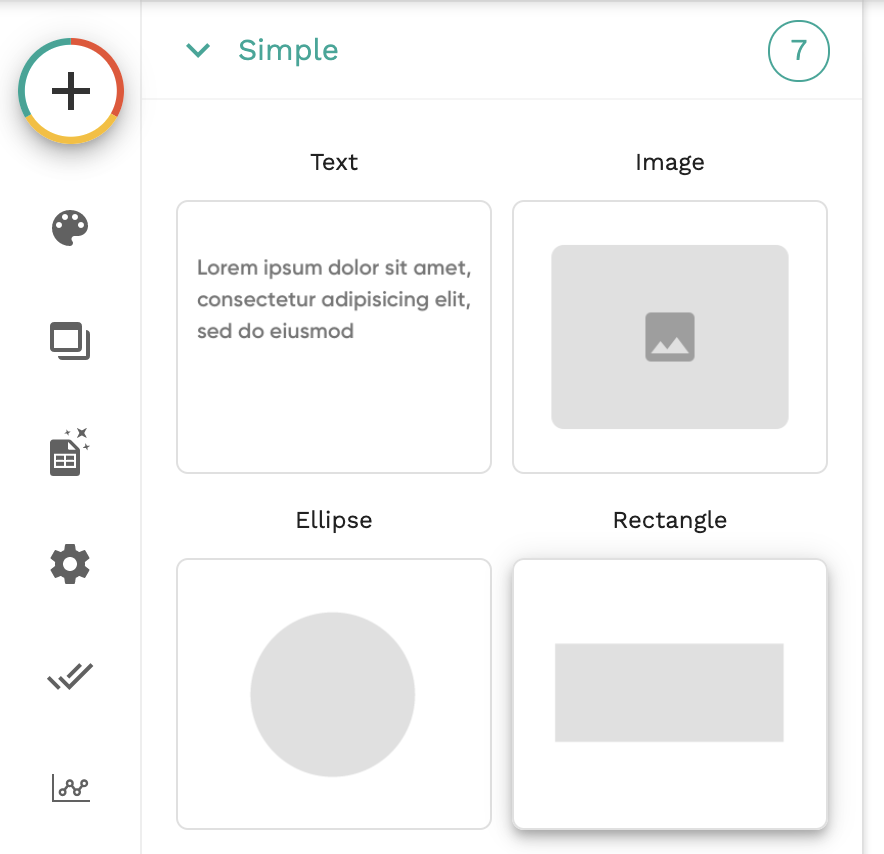

---
- ペットの名前の上に重ねて配置してください
- Backgroundの色でBlackを選択した後、RGBAのAの値を10に変更してください
  - RGBAは色を表す形式のひとつで、色をRed、Green、Blueの三原色のそれぞれの強度と、透明度(Alpha)の組み合わせで表現します

---
- Screensからペット一覧画面を選択し、Componentsの並び順でRectangleがTextよりも上になっていることを確認してください
  - 上にあるものが手前に表示されるため、今はRectangleがTextを隠してしまっています
<!--  -->
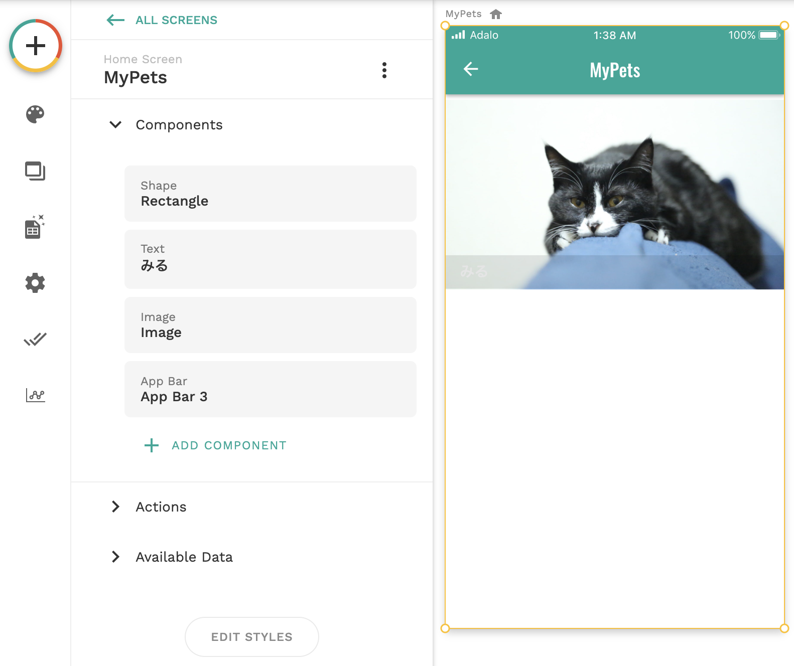

---
- 順番を入れ替えて、Textを一番上に、Rectangleを2番目にしましょう
  -  Textが手前に表示され、Rectangleのおかげで白い文字が見やすくなりました

---
次に、ペットをもう一匹表示しましょう
- 追加した3つのコンポーネント(Image, Rectangle, Text)をCanvas上で選択し、MAKE GROUPをクリックします
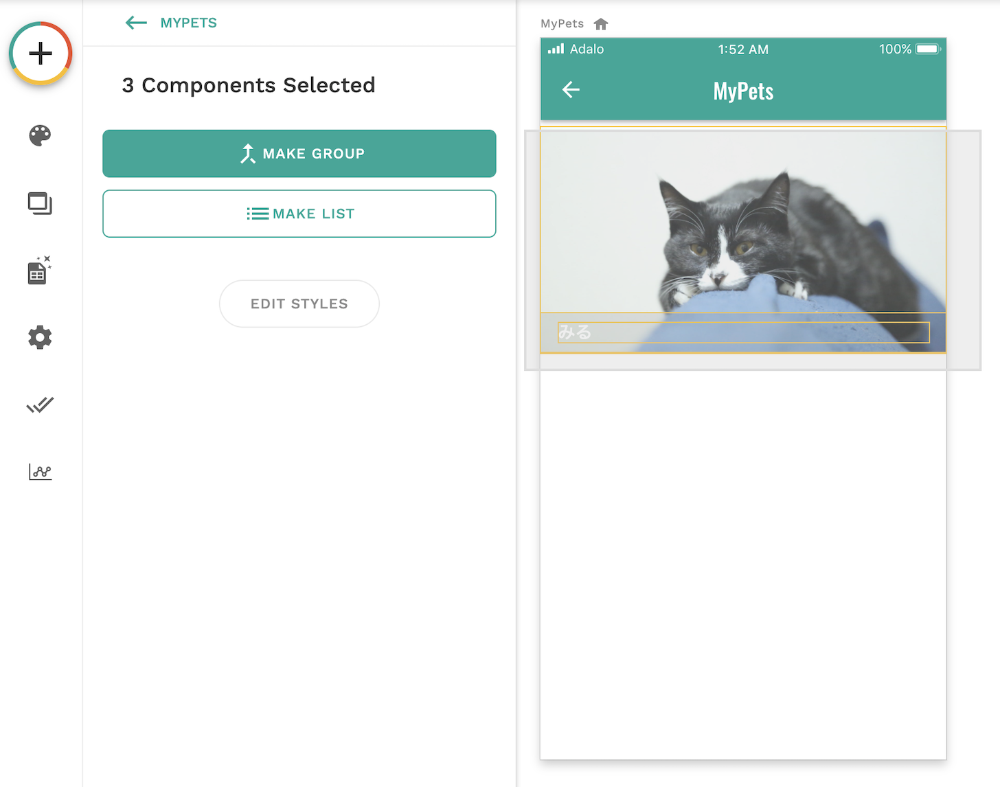

---
- 作成したGroupを選択した状態でコピー&ペースト(Windowsなら`Ctrl + C`と`Ctrl + V`、Macなら`Command + C`と`Command + V`)をして、複製されたGroupを下に配置します

---
- 2つ目のImage、Textを別のペットのものに変更しましょう
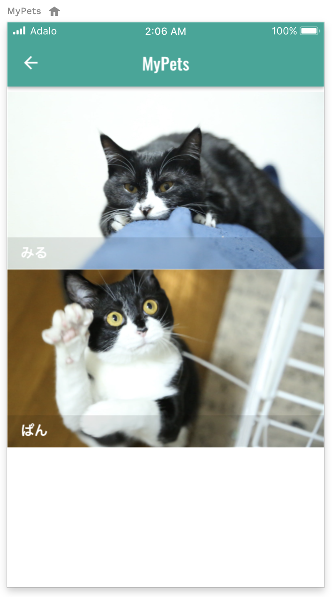

---
次に、ペット登録画面への導線を追加します
- ADD COMPONENTからAction Buttonを選択してください

---
- 画面右下に配置してください
- Icon and Text ColorをDefault Background(White)に変更してください

---
- ADD ACTION -> Link -> [ペット登録画面名] を選択してください

---
ペット登録画面からペット一覧画面への導線も追加しておきましょう
- ペット登録画面のRegisterボタンを選択してください
- ADD ACTION -> Link -> [ペット一覧画面名] を選択してください
※ 導線を追加しただけなので、まだペットの登録はできません(データの登録は次回のレクチャーでやります)
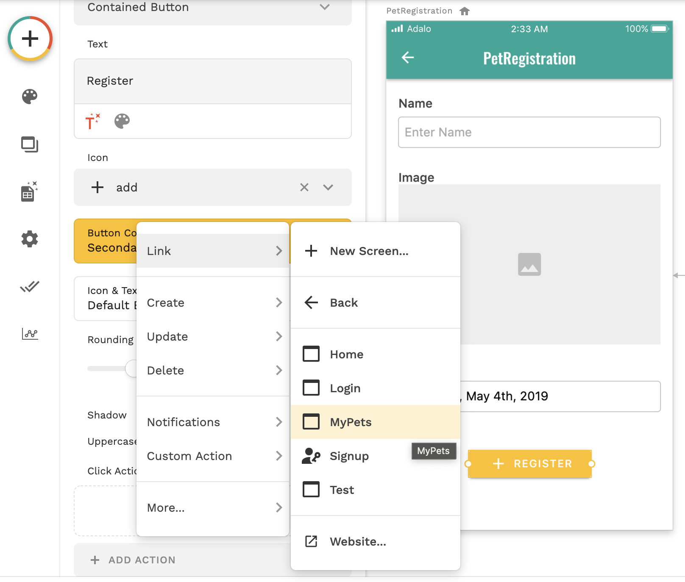

---
- SignUp画面のSIGNUPボタンとLogin画面のLOGINボタンの遷移先も、Homeからペット一覧画面に変更しておきましょう
<!--  -->
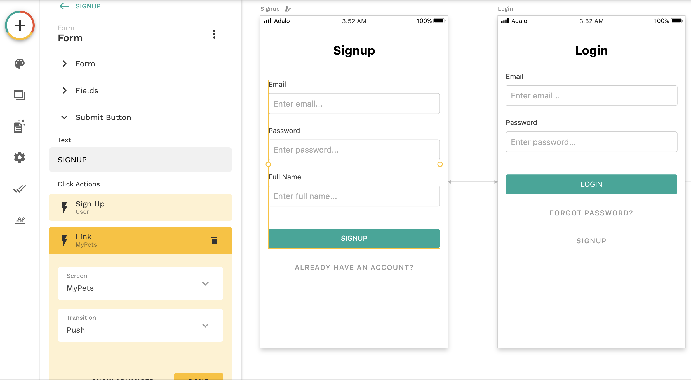

---
- デフォルトで作成されていたHome画面は不要になったので、削除しましょう

---
ペット一覧画面の見た目を確認してみましょう。
- ペット登録画面のプレビューをした時と同様に、ペット一覧画面のScreen Navigation TypeをHome Screenに変更してください
- プレビュー機能でログインをすると、ペット一覧画面が表示できます。

これで、ペット一覧画面のUIは完成です。

---
###### ペット詳細画面
- 体重記録画面へのリンクがある
(Link2は演習用)
- 誕生日が表示される
- 最新の体重が表示される

次は、こちらの画面を作りましょう

---
- ADD SCREENからInfo with Linksを選択して、Screen Nameを入力してください
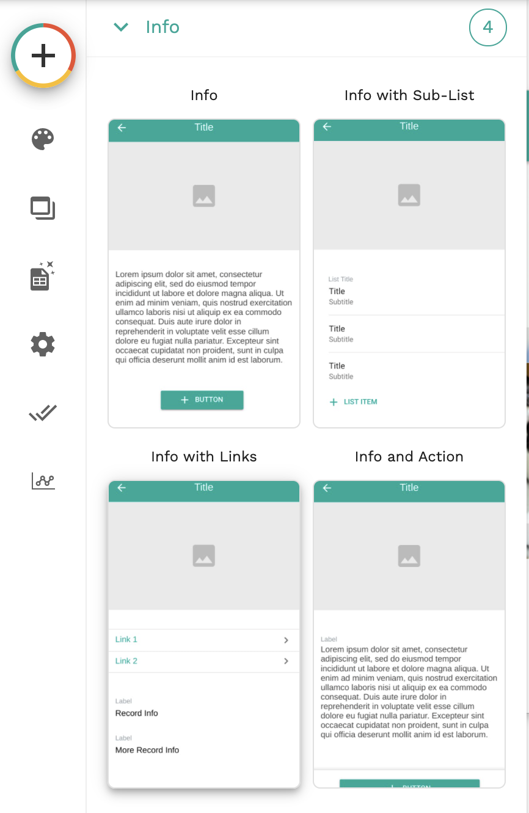

---
- Image Sourceでペット一覧画面で使用した写真をUploadしてください

---
- TextをBirthdayというラベルとその値、Latest Weightというラベルとその値に書き換えましょう
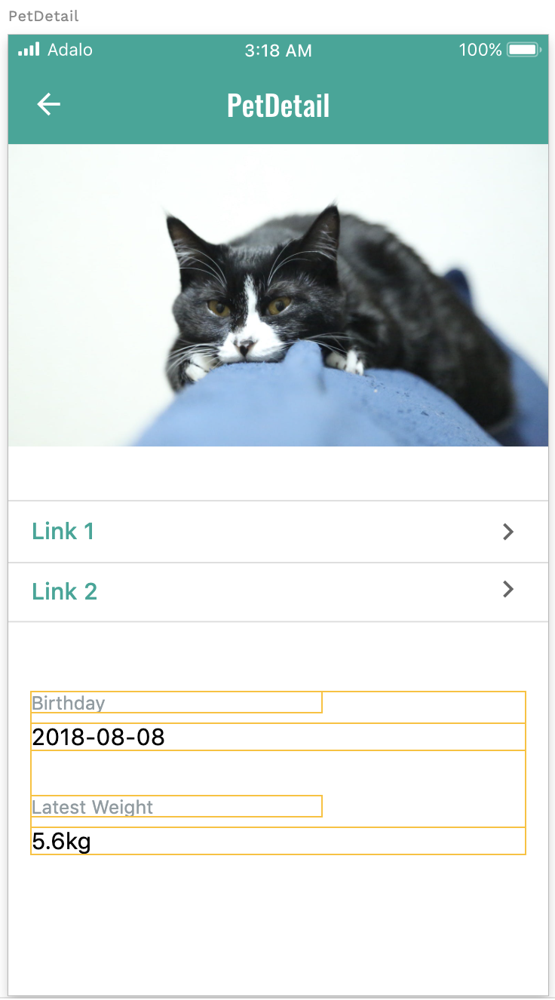

---
- Link 1というTextをWeihgt Logに変更しましょう
- Link 2はそのまま残しておきます
(最後の演習時間で作成した画面への導線として使ってください)

---
ペット一覧画面からペット詳細画面に遷移できるようにしましょう
- ペット一覧画面の1匹目のペットに関するコンポーネントをまとめたGroupを選択し、ADD ACTION -> Link -> PetDetail とクリックしてください
  <!-- - この設定を2匹目のペットに関するコンポーネントをまとめたGroupにも設定しても良いです。ただし、ペット詳細画面はどちらのペットをクリックして遷移しても、同じ表示になります。 -->
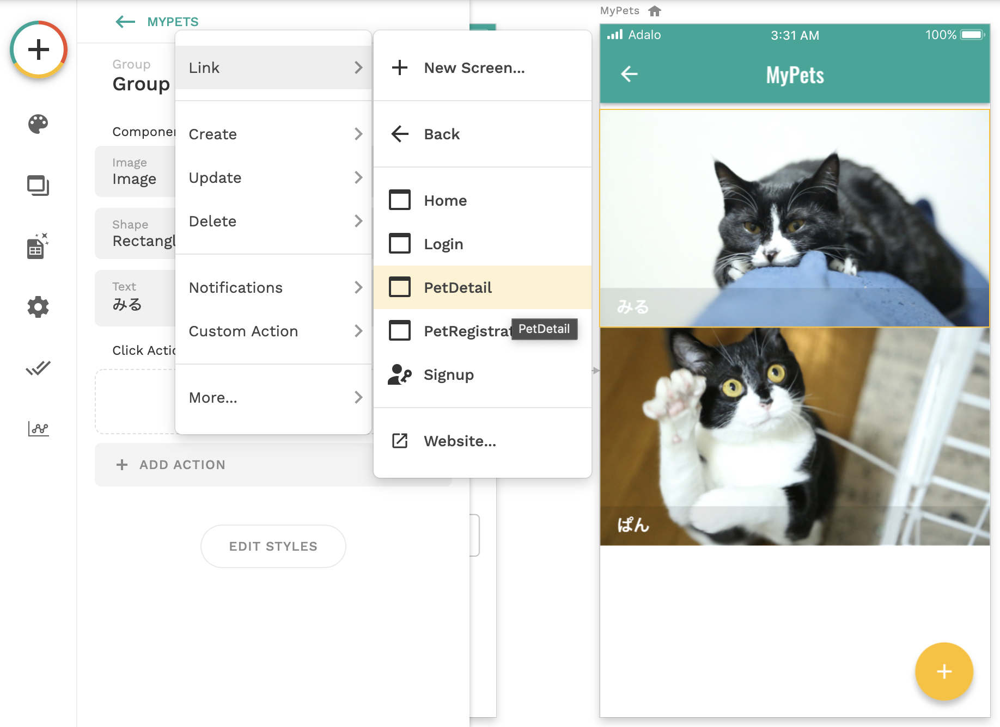

---
- プレビュー画面で表示を確認しておきましょう

ペット詳細画面のUIはこれでOKです。

---
###### 体重記録画面
- 体重の遷移を示すグラフが表示される
- 現在の体重を入力できる
- ボタンを押して体重を追加できる

最後に、こちらの画面を作りましょう

<!-- Chartコンポーネントは次回に回すので却下 -->
---
- ADD SCREENからApp Barを選択して、Screen Nameを入力してください

<!-- ---
- ADD COMPONENTから、EXPLORE MARKETPLACEを選択してください
 -->
<!--  -->
<!-- ---
- Chart KitをINSTALLしてください
 -->
<!-- ---
- ADD COMPONENTのInstalled欄にChartのコンポーネントが追加されました
- Line Chartを選んで、画面上に配置してください
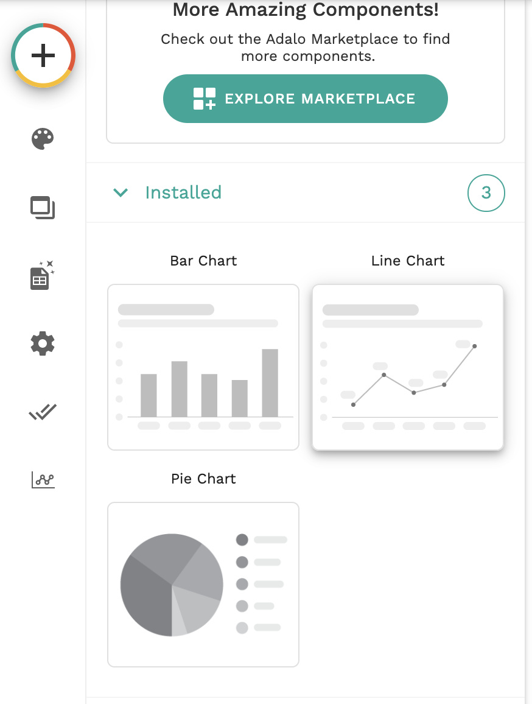 -->

---
- Chartの作成にはデータベースの準備が必要なので、これは次回のレクチャーで説明します
- 今回は、Chartの画像を貼り付けましょう
  - 画像は私からみなさんにSlackで共有します
  (右の画像のスクリーンショットを撮影してそれを使ってもOKです)

---
- ADD COMPONENTからImageを追加して、Chartの画像をアップロードしてください
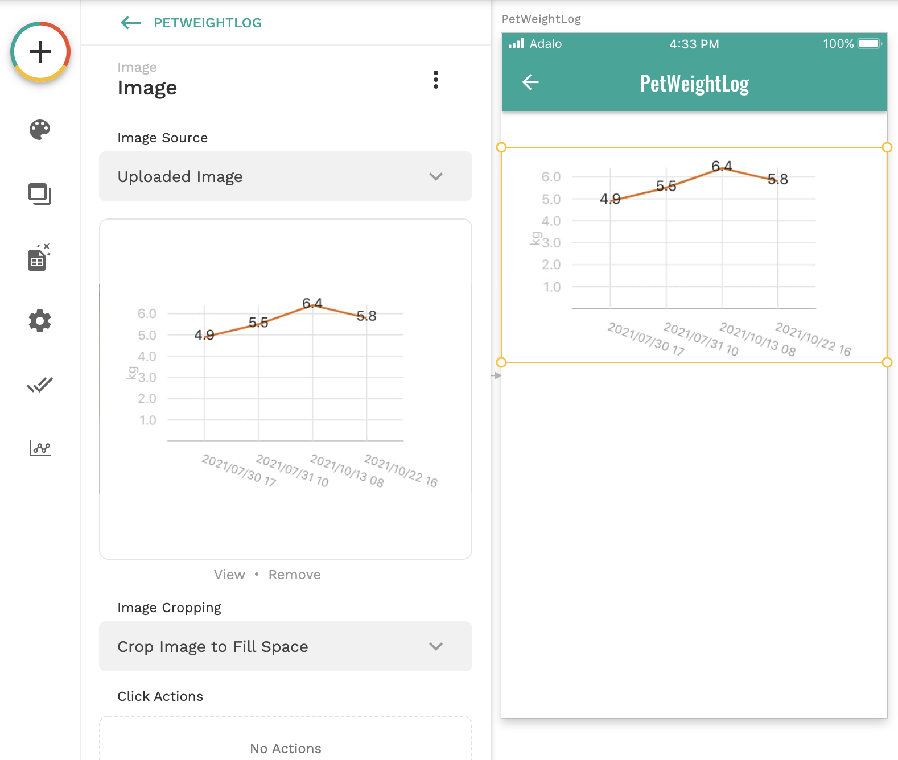

---
- ADD COMPONENTから、Text Inputを追加してください
- TypeをNumberに変更してください
- PlaceholderをEnter current weightに変更してください

---
- ADD COMPONENTからTextを追加してください
- 値をWeight(kg)に変更してください
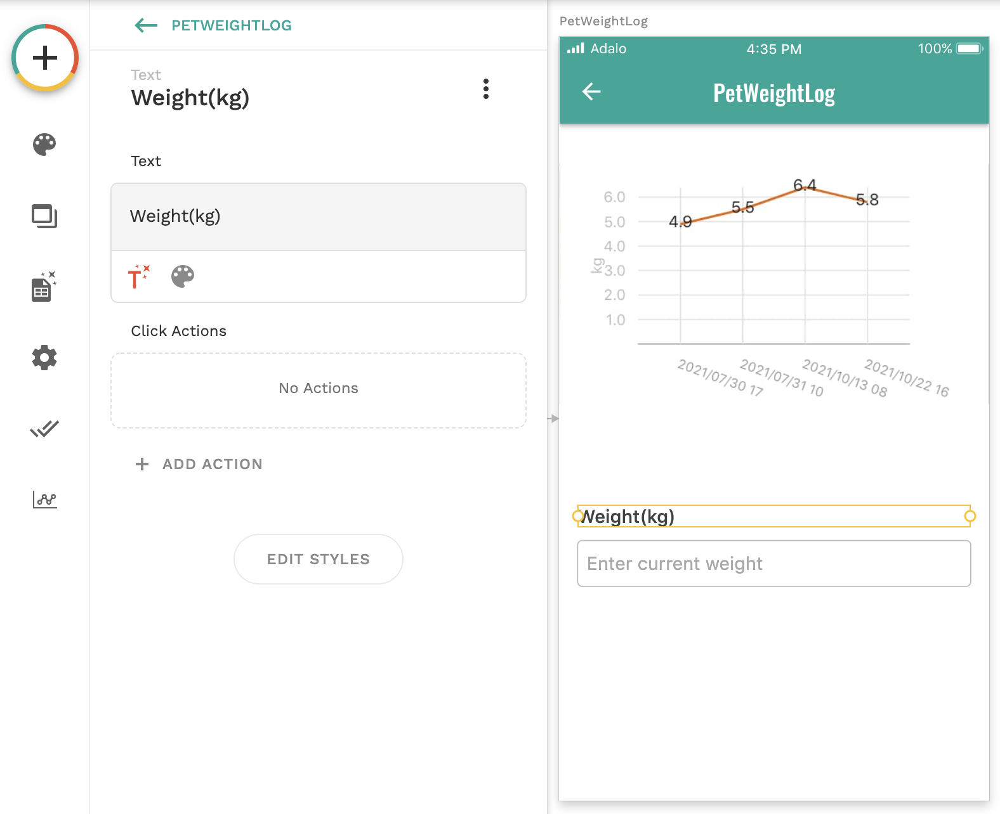

---
- ADD COMPONENTからButtonを追加してください
- TextをAddに変更してください
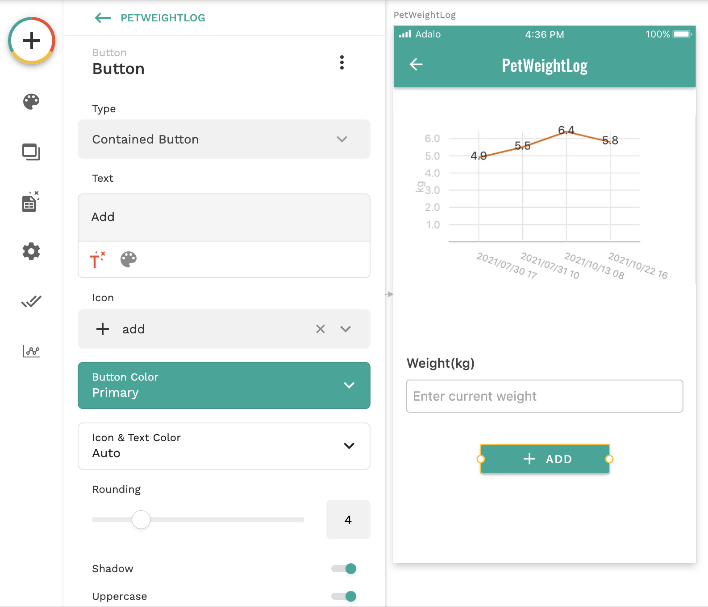

---
ペット詳細画面から体重記録画面への導線を設定しましょう
- ペット詳細画面のText:'Weight Log'を含むGroupに対して、Click Actionで体重記録画面へのLinkを設定します
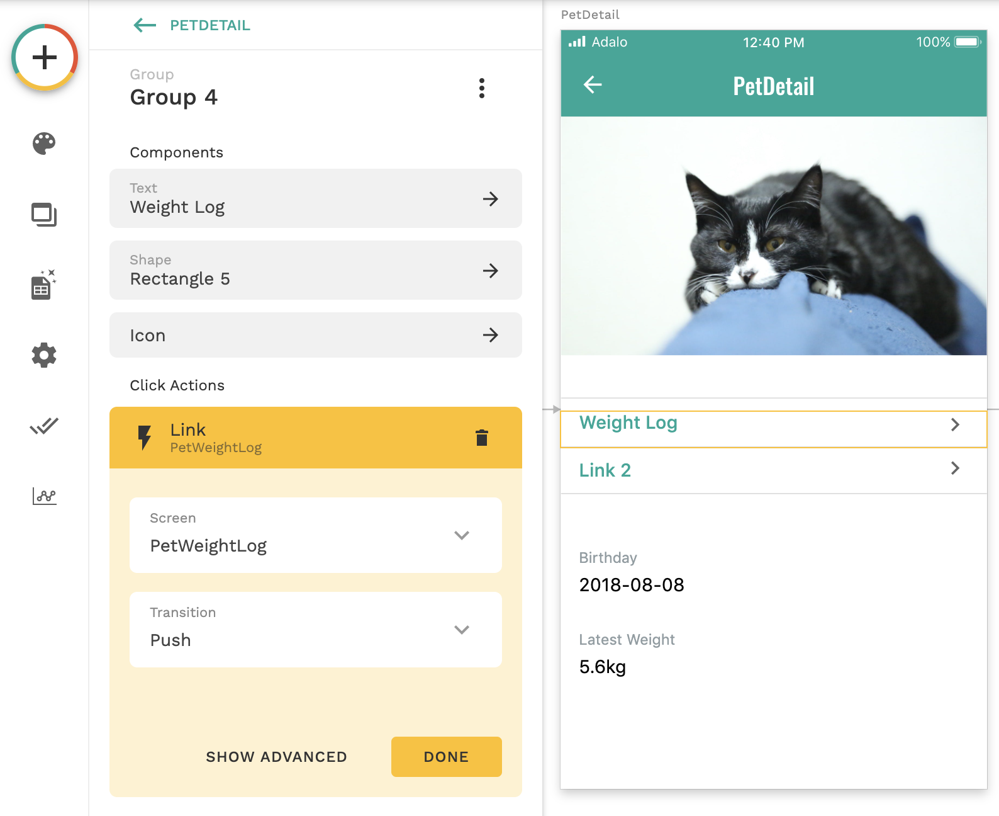

---
- プレビュー画面で表示を確認しておきましょう

体重記録画面のUIはこれでOKです。

---
アプリのUIを一通り作成することができました :tada:

---
#### クローン用URL
- 以下のURLからアプリをクローンできますので、答え合わせに使ってください
https://previewer.adalo.com/014fd9d1-80c6-4325-899a-d943e778c865

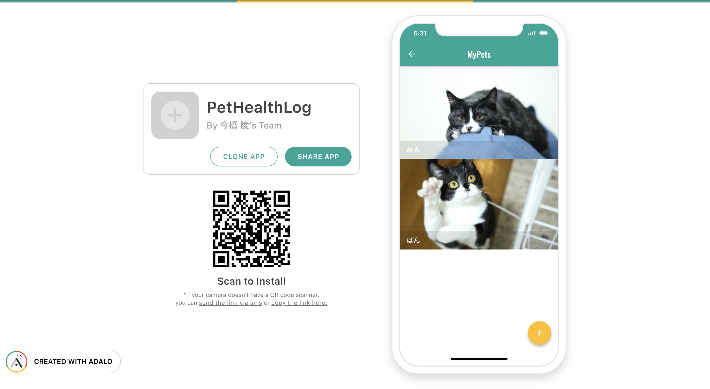

---
## 演習
- ペット詳細画面のLink 2の遷移先となる画面を自由に作成してみてください
- あるいは、好きなアプリを新しく作成してもOKです

できたらSlackでURLを共有して、みなさんに見てもらいましょう

---
#### 演習における注意事項
- 名前に「List」とつくComponentやScreenは、次回のレクチャーでお伝えするデータベースとの紐付けが必要なので、使うのが難しいかもしれません。
  - 自分で解決できなければ、今日はそれ以外のもので代用することをお勧めします。
- NoCodeツールでは、簡単にアプリを作れる反面、複雑なUIや機能を実現できない場合があります
  - 行き詰まった時は、どうすれば自分がやりたいことをシンプルなUI、機能で実現できるか考えてみてください
    - 例: 1画面に多くのコンポーネントを含めず、画面を分ける 等

---
#### 演習結果の発表
(時間があれば)

演習で作った画面を紹介してみませんか？

---
## まとめ
- 今回のレクチャーでは、Adaloについて紹介し、ペットの健康管理アプリを題材にアプリのUIを作成しました。
  - データベースを必要としない、シンプルなコンポーネントだけを使っています。
- 次回のレクチャーでは、引き続きAdaloを使って、今回作ったUIに合わせたデータベースを構築し、アプリからデータを操作できるようにしていきましょう。 
  - データベースを使うことで様々な機能が実現できますし、UIを簡単に作ることも可能になります。お楽しみに！

---
# 以上です！
# お疲れさまでした！

