**Programming Boot Camp**

# Database Design and Data Manipulation with Adalo

**Tokyo Institute of Technology 2021/11/6**
　
　
　
　
　
　　　　　　　　　　　　　　　　　　　　　　　　**Ryo Imahashi**

<!-- <!-- ---
## Reference
- https://nocodo.net/media/media-4553/
- https://note.com/shinya_matsui/n/n05335098aaeb
- [Pet Health Care Application Development Log](https://www.notion.so/72d6bec451574cadb3d333a1ebc9355c) --> -->

---
## Table of Contents
  - Review of the previous session and check the goal of this session
  - Let's learn about database
  - Database design
  - Database operations
  - Let's improve the sample application.
  - Exercises
  - Summary

---
## Reflection on the previous lecture and confirmation of the goal of this session
- In the previous lecture, we introduced Adalo, a no-code tool, and created the UI of an application based on a pet health management application.
  - In the lecture, we used a simple component that does not require a database. (Some of you may have used a database in the exercises).
- In this lecture, we will continue to use Adalo to design a database that matches the UI we created in the previous session, so that we can manipulate the data from the app. 
- After that, we will introduce the features of Adalo while improving a sample app, and finally, we will have a team app development exercise and presentation.

---
## Introduction to Database
First, let's check what kind of database we will be working with.

---
#### Database(Review of previous lesson)
- A set of organized data.
- Data is registered, read(displayed), updated, and deleted.
- Example: Chat application

<!--  --> !


---
- Databases are often compared to "spreadsheet-like" software.
- A database can be used to create (CREATE), read (READ), update (UPDATE), and delete (DELETE) data. These operations are collectively called CRUD.


---
#### Basics of Adalo's database
 You can access Adalo's database from this icon.
There are three components of the Adalo database
- Collection
- Property
- Record

---
###### What is a Collection?
A collection of data that has the same attribute (Property)
 

---
- Collection is used to divide and organize the various data handled in a database into different types of data. (An analogous term is table.)
- In many cases, a Collection is a group of data that a user can register, update, or delete in a single operation. <!-- (A collection is often said to be something that can be expressed as a noun.
- By default, Users is prepared as a Collection, and the rest can be added according to the application to be developed.

It is very difficult to decide what kind of collection to add. It is very difficult to decide what kind of collection to add, so practice and get used to it. (If you have any problems, we recommend you to consult with our mentors.)

---
###### What is Record?
- A record is a unit of storage for information in a collection.
  - One row in the image is one Record.
- In the example of Users Collection, the information of one user is registered as one Record.


---
- Record can be basically registered from the form on the screen of the application, but it is also possible to register from the form shown in the image on the right by pressing the "+Add xxxx" button on the upper right while displaying Record.
- You can also search for Records in the Collection, and upload (import) and download CSV files.


---
###### What is Property?
- Property is each and every item that makes up a Record.
- The Users Collection consists of properties such as email, password, user name, and name.
- The value of Property can be empty.


---
To define what kind of data the Property is, select the Type when adding the Property.
- Text
- Number
- True/False
- Date/Time
- Date/Time
- Image
- File
- Relationship


---
What is Relationship?
- Instead of storing a large number of properties for a single Record, we can set a special property to relate multiple Collections, called Relationship. This allows you to divide a Collection into manageable pieces.

---
- For example, a message sent by a user in the Chat app is stored in the Messages Collection, which is separate from the Users Collection, and these two collections are related by Relationship.
  - The Users side has a Relationship called Messages, and the Messages side has a Relationship called Sender (with Users).


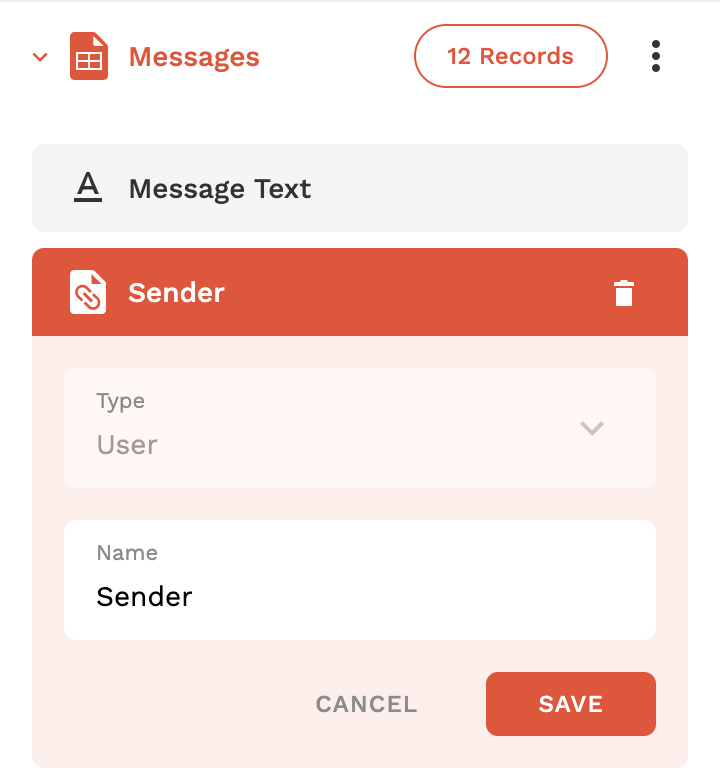

---
Types of Relationship
- In Adalo's Relationship, you can choose one of two types, one-to-many or many-to-many, depending on the number of Records associated with the Collection. 

---
One-to-many Relationship
- This means that one Record has a relationship with multiple Records in different collections. 
- Depending on whether the Collection you are trying to set the Relationship to is one or many, two choices will appear.


---
Example of a one-to-many Relationship
- In the Chat application, one user sends multiple messages, but the sender of the message is one user, so the Relationship in the Users Collection and Messages Collection is one-to-many.

 

<!-- For example, if there is only one organizer for an event, then the Relationship between the organizer and the event is one-to-many. -->
<!-- For example, one user organizes multiple events, or there is one organizer for multiple events, both of which represent true one-to-many Relationships. -->

---
Many-to-many Relationships
- This means that one Record in both Collections is tied to multiple Records in the other Collection.


---
An example of a many-to-many Relationship
- In a Chat application, one user can have multiple conversations (to keep track of who and what messages were exchanged), and one conversation can have multiple members (users), so the relationship between the Users Collection and the Conversations Collection is many-to-many. Relationship is many-to-many.

!

---
## Database design
While looking at the UI of the sample app created in the previous lecture, think about the data that needs to be saved and design the database.


---
#### URL for cloning the app created in the previous lecture
- Please clone the app from the following URL. We will use it to proceed with the lecture from here.
https://previewer.adalo.com/014fd9d1-80c6-4325-899a-d943e778c865

---
#### Let's design the database.
Let's design the database by looking at the UI of the sample application. The steps are described in the next page.


---
###### Database Design Steps
1. While looking at the UI, make a list of the data that will need to be saved. Write them down in a text editor (e.g. Notepad application).
2. Think about what kind of collections the listed data can be classified into, and create the necessary collections for the Adalo database.
3. Add the data you listed in step 1 as a Property to the appropriate Collection. Make sure to select the appropriate Type.
4. For a collection that is related to another collection, set the Relationship Property.

---
In the next slide and onwards, there will be explanations, but we recommend that you try your hand at it before looking at the answers.

There is no absolute right answer. When in doubt, follow your instincts.

---
###### Explanation
While looking at the UI, I made a list of the data that needs to be saved, and it looked like this
````
- User's Email
- User's Password
- User's FullName
- Pet's Name
- Pet's Photo
- Pet's Birth Date
- Pet's weight
- Date and time the pet's weight was registered
````

- If anyone can name any other data, please let me know!

---
Thinking about what Collections the listed data can be classified into, we will classify them into these three categories.
```
- Users
- Pets
- PetWeightLogs
```

- Many of you may have prepared two collections, one for users and one for pets.
- Some people may not have prepared a collection for pet weight records. (It is not wrong to include the pet's weight and its registration date in the pet's Collection. We will explain it later.)
- Have any of you prepared other Collection classifications?
<!-- In extreme cases, you can do it with 1Collection -->.

---
Additional information on Collection classification
- When the relationship "if A is determined, then B is determined" is true, A is often a Collection and B is a Property of that Collection.
  - If a user is determined, the user's email, password, and FullName will each be set to one.
  - If a pet is determined, the pet's name, photo, and birthday are each set to one.
- When the relationship "there are multiple B's for A" is true, A and B are often split into separate collections.
  - For a (single) pet, there can be multiple pet weights and their registration dates.


---
- Register the Collection into the Adalo database.
- Users is created by default.


---
Next, I appended the data listed in 1 as a Property under the appropriate Collection, and the result was as follows. In () is the Type to select.
```
- Users
  - Email(Text)
  - Password(*Password)
  - FullName(Text)
- Pets
  - Name(Text)
  - Image(Image)
  - Birthday(Date)
- PetWeightLogs
  - WeightKg(Number)
  - RegisteredTime(Date&Time)
```
Password is a special Type that is set to Password by default.
<!-- This will be an encrypted version of Text. -->

---
- In Adalo, add the properties.
- The Users Collection is already set by default and contains all the necessary items.
- We don't need Username, but since we can't delete it, we'll leave it as is.


---
- The Pets Collection Property will look like this.


---
- The Property of the PetWeightLogs Collection will look like this.
- The Name Property, which is set by default when you add a Collection, is not necessary, so delete it.
  - You can remove it by dragging and dropping it so that the order is not at the top of the collection.

<!-- The name property is not needed. [](images/2021-11-03-15-36-02.png) --> !


---
Finally, for collections that are related to other collections, set the Relationship Property.

- Select the Users Collection to add a one-to-many Relationship with the Pet Collection.


---
- If you check the Pets Collection, you will see that a Relationship with the Users Collection has been automatically added because the Relationship setting was made on the Users Collection side.
  - Since the Users Collection is 1, the "s" at the end is omitted and the Property name is User.


---
- Add a Relationship to the Pets Collection with the PetWeightLogs Collection.
  - Select the Pets Collection to add a one-to-many Relationship with the PetWeightLogs Collection.


---
If you check the PetWeightLogs Collection, you will see that a Relationship with the Pets Collection has been automatically added because the Relationship setting was made on the Pets Collection side.
  - Since the Pets Collection side is 1, the "s" at the end is omitted, and the Property name is Pet.


---
Reference: What happens if you include the weight of the pet and its registration date in the Pets Collection?

The record will be registered as follows, but in this case, you will have a little trouble.


---
The trouble
- Because multiple Records with different pet weights and their registration dates are registered for one pet, the pet's information (Name, Image, Birthday) is registered in duplicate.
  - In order to change the information of one pet, we have to update all the duplicated records, which makes the process more complicated.
- Adalo has a convenient function to automatically generate a form to register a record in a single collection, but since the collection is not divided by the unit to register data, it cannot be used.

---
That's it for the database design.

It is recommended that you set up Adalo's database in the same state as the document to avoid confusion in the later work.

---
## Database operations
Let's use the database we designed so that we can perform CRUD operations on the data in the sample application.

---
#### Creating Data
First, let's make it possible to actually register a record of a pet in the already created pet registration screen.


---
- Select the REGISTER button on the pet registration screen and click ADD ANOTHER ACTION
- Select Create > Pet


---
Enter the following and DONE.
- For Name, select Input in Other Components.
- For Birthday, select Date Picker of Other Components.
- For Image, select Image Picker of Other Components.
- For User, select Logged In User.
- Leave PetWeightLogs as Empty (not required for pet registration).
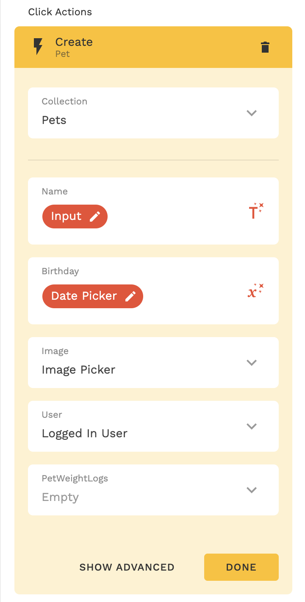

---
Let's try to register a pet with the Preview function.
When the record is registered in the Pets Collection, it is OK.


---
Next, let's make it possible to register the current weight in the pet weight management screen.


---
- Select the ADD button on the pet weight management screen and click ADD ACTION.
- Select Create > PetWeightLog
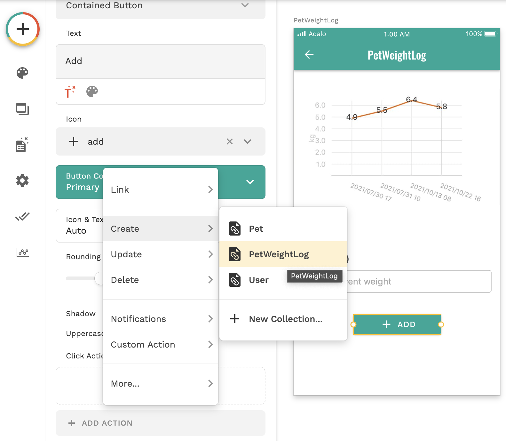

---
Enter the following and DONE.
- For WeightKg, select Input of Other Components.
- For WeightRegisteredTime, select Date&Time > Current Time.
- Pet is Nothing Available, so leave it as Empty for now.
  (Later, we will set it so that the weight of the selected pet can be registered)


---
#### Displaying Data (READ)
First, we will make sure that the actual registered pets are displayed in the created pets list screen.


---
- Select the two components that display the pet's image and name, and click MAKE LIST


---
- Select Pets in What is this a list of?
- Select Logged In User > Pets in Filter


---
- Click on the first Group, which is the component that makes up the List you created.
- Edit the Image component and the Pet Name component in the Group respectively.
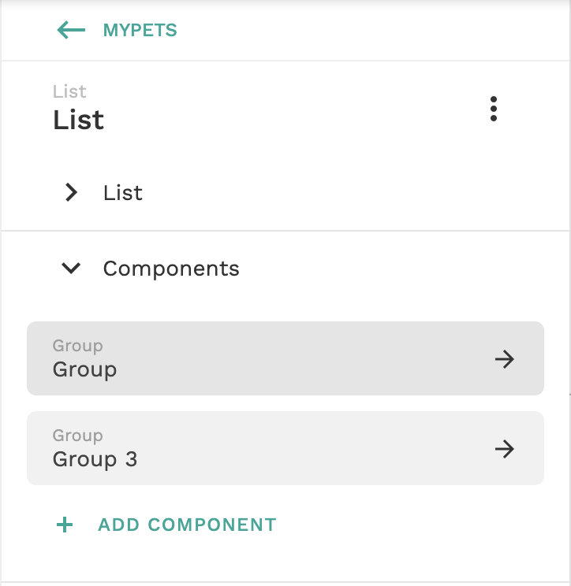


---
Edit the Image component
- In Image Source, select Database > Current Pet's > Image
- If there's no image... and select Don`t show anything
  - Alternatively, you can select Show a place holder image and set your favorite [pet's silhouette image](https://www.silhouette-ac.com/category.html?ct=3&sw=%E5%8B%95%E7%89%A9)


<!--  --> !

---
Edit the pet name component
- Under Add Magic Text, select Current Pet's > Name

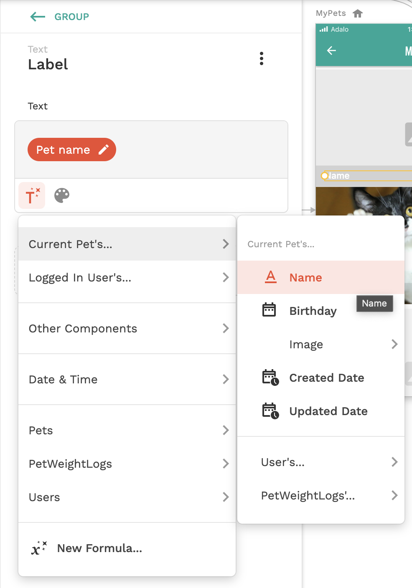


---
- When you check the Preview function, you will see the Record registered in the database as the first pet.


---
- Let's delete the second Group (the second pet that was displayed as fixed) in the component that makes up the List of pets, since it is not needed!

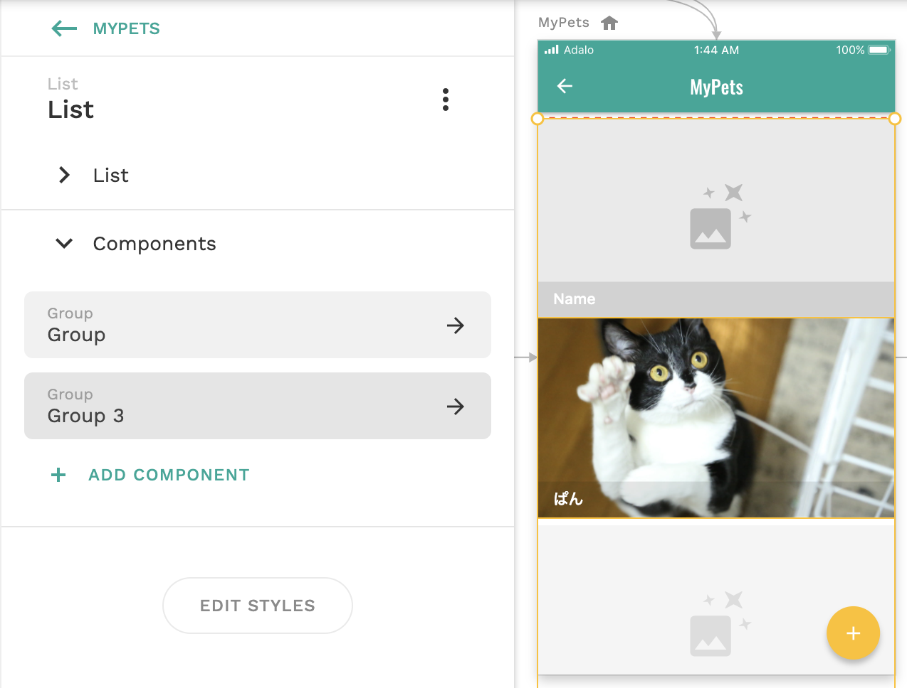 

---
- When you check the Preview function, only the pets you have registered in the database are now displayed.
  - If you register additional pets, multiple pets will be displayed.

 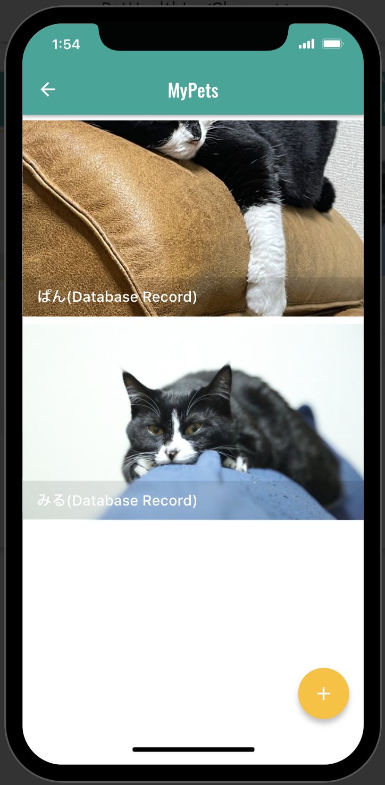

---
Make sure that when you click on a pet in the pet list, you can go to the detail screen of that pet.
- The Current Pet is automatically set in the Send This Data to PetDetail Screen of the Link set in the Group component of the pet.

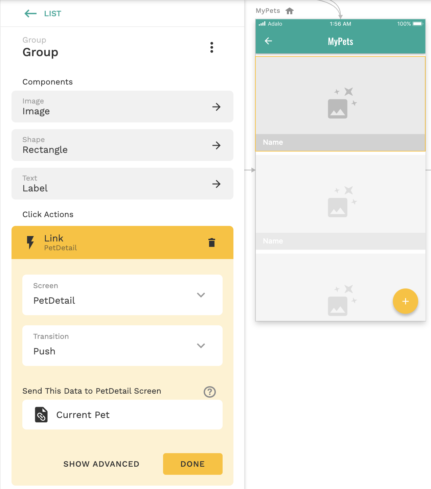

---
- Since Current Pet was set in Send This Data to PetDetail Screen of Link from Pet List Screen, Current Pet is set as Linked Data in Available Data of Pet Detail Screen.
  - As a result, the pet selected in the Pet List screen (Current Pet) can be handled in the Pet Detail screen.


---
Next, we will make sure that the pet selected in the Pet List screen is displayed in the Pet Detail screen.


---
Click on the Image component and select
- Image Source and select Database > Current Pet's > Image.
- If there's no image... and select Don`t show anything
  - Alternatively, you can select Show a place holder image and set your favorite [pet's silhouette image](https://www.silhouette-ac.com/category.html?ct=3&sw=%E5%8B%95%E7%89%A9)
  


---
Click on the Birthday Value component and select
- Select Current Pet's > Birthday in Text
- Select No Formatting in Date Format

Click on the 

---
- Click on the Latest Weight Value component and MAKE LIST to make a list.

To display the most recent one, make the component a List.
(The settings on the next page will narrow down the list to the most recent one.)


---
- Select PetWeightLogs in What is this a list of?
- Select Current Pet > PetWeightLogs in Filter
- In Sorting, select WeightRegisteredTime - Newest to Oldest
- Set Maximum number of items to 1

This will narrow down the list to only the most recent one.
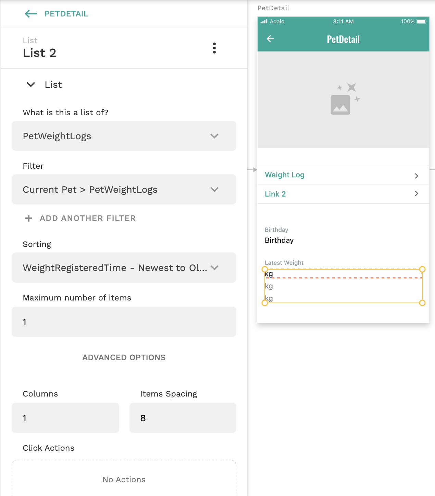

---
- Click on the Latest Weight Value component, add Current PetWeightLog's > WeightKg to the Text, and then add "kg" to the end.

[bg right h:630 [bg right h:630px](images/2021-11-05-18-13-36.png)

---
Make sure that the selected pets can be passed on when moving from the Pet Detail screen to the Pet Weight Management screen.
- Select the component with the link Weight Log, and the Current Pet is automatically set in the Send This Data to PetDetail Screen of the Link.


---
The remaining work of creating data (CREATE)

Allow the weight of the selected pet in the Pet Weight Management screen to be registered in the database.
- Select the ADD button, and set Current Pet to the Pet that was once left as Empty in the Create action.


---
Display the name of the selected pet in the header of the Pet Details screen and the Pet Weight Management screen. On each screen, select the
- Select the App Bar component at the top of the screen and add Current Pet's > Name to the Title Text.
- Add the string "'s" after it.


---
In the Preview function, check the following
- That you can move to the detail screen of the selected Pette from the Pette List screen.
- It is possible to move to the weight management screen of the selected pet from the pet detail screen.
- When the weight of a pet is registered, the record is registered in the PetWeightLogs Collection of the database.
- The latest weight is displayed on the pet detail screen.


---
Next, we will display the weight of the pets registered in the past as a graph in the pet weight management screen.
- First, delete the graph that was pasted as an image


---
- Select EXPLORE MARKETPLACE from ADD COMPONENT
- INSTALL Chart Kit

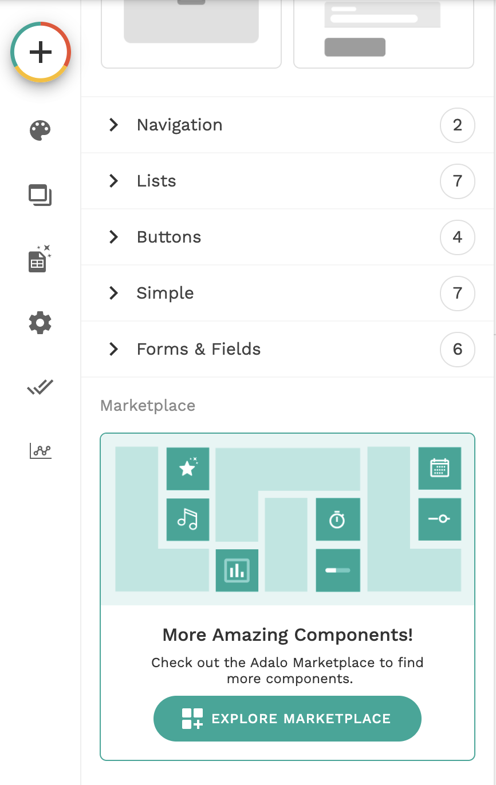 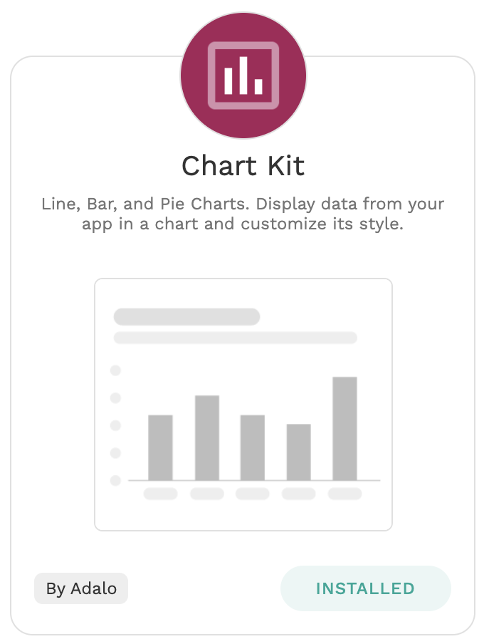 !

---
- Add Line Chart to the screen


---
Set up a Line Chart.
- Select PetWeightLogs in What is this a chart of?
- Select Current Pet > PetWeightLogs in Filter
- In Custom Filter, set WeightRegisteredTime Is after 30 days ago and specify the display period.
- In Sorting, select WeightRegisteredTime - Oldest to Newest

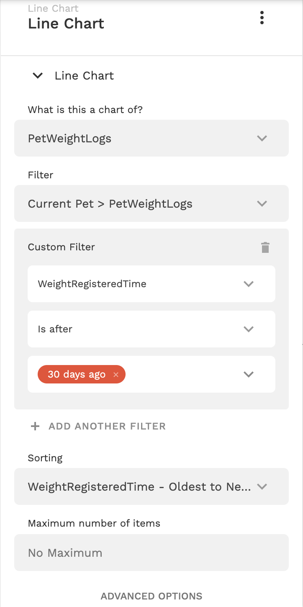

---
- Set X Axis Value to PetWeightLog > WeightRegisteredTime
  - Set Date Format to Date / Time
- Y Set Axis Value to PetWeightLog > WeightKg
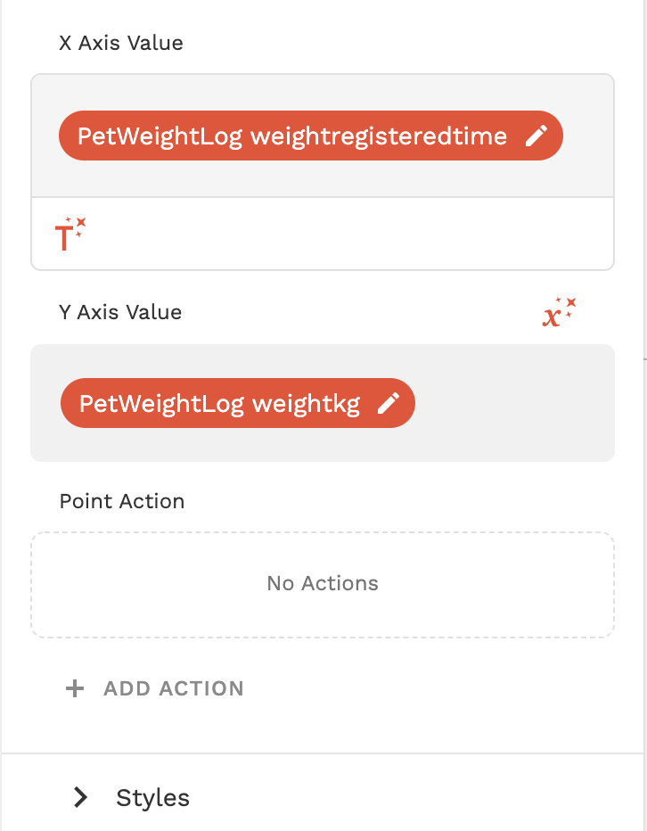
 !

---
Use the Preview function to check the display of the graph. If you add multiple weights, the graph will be drawn.
The registration time of the weight is too long and will be displayed abbreviated. I wanted to test it by registering multiple weights on the same day, so I used the Date&Time type, but it would be better to use the Date type and restrict multiple registration on the same day.
<!-- , if you add different weights in a row, the line will stretch up and down -->
<!-- 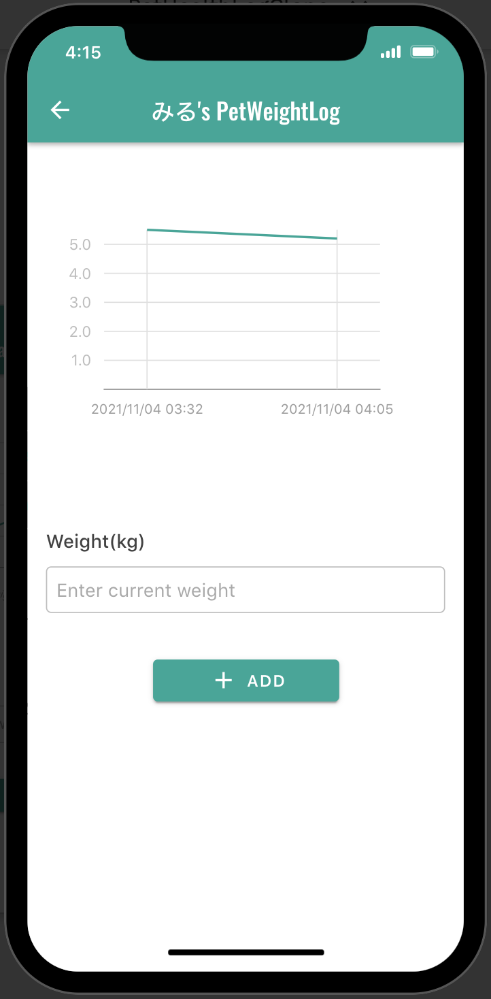 --> !


<!-- You can also set labels for the X and Y axis --> !

---
#### Updating Data
Create a new pet information edit screen where you can update the information of registered pets.


---
First, add a lead line to the Edit Pet Info screen in the Pet Details screen.
- Add Action Button from ADD COMPONENT
- Change the Icon to "edit
- Change Icon and Text Color to Default Background(white)


---
- Select Link > New Screen from ADD ACTION


---
- Enter a Screen Name
- Select Form
- Click CREATE SCREEN


---
Just make the following settings and the pet information editing screen is complete.
- Select "Pets" in "Which data collection?
  - The form will be automatically generated according to the selected collection.
- Select "Update Current Pet" in "What do you want the form to do?
- Change the order of Birthday and Image in Fields

[bg right h:420 [bg right h:420px](images/2021-11-04-04-38-03.png)
<!-- If there are any fields that don't need to be updated, we can delete the entry -->

---
Make sure you can use the Preview function to edit the pet information screen.


---
Supplement
- In the previous article, we created the input form for the pet registration screen by adding components one by one, but it can be automatically generated in the same way as we created the pet edit screen.

---
- Let's delete all components except the AppBar in the pet registration screen, add a Form component, and specify the Pet Collection to generate the form automatically.
  - Please note that only the transition to the pet list screen after registration requires you to manually add an Action to the Submit Button.

---
Additional Information
- Using the Form component, you can check if the required fields are filled in by simply checking the Required Error Text in the Field.
- Use the Form component as much as possible when creating an input form.


---
Reference: The actual flow of application development in Adalo
- In the sample application, we have proceeded with the following flow: UI creation > database design > linkage between them.
  - This is because we thought it would be difficult to design the database without knowing what kind of screen we would need and what data we would need.
- When actually developing an application with Adalo, I recommend that you first draw a UI sketch and identify the necessary data, and then design the database. By doing so, you can take advantage of automatic generation for subsequent UI creation.
  - However, the actual development will not be a one-way flow, but a trial-and-error process, alternating between database and UI.

---
#### Deleting Data
Create a button to delete a registered pet in the pet details screen.

---
<!-- ---
- Select Icon from ADD COMPONENT and place it on the right side of the AppBar.
- Change Icon to "delete
- Change Color to Default Background(White)
- Adjust Size

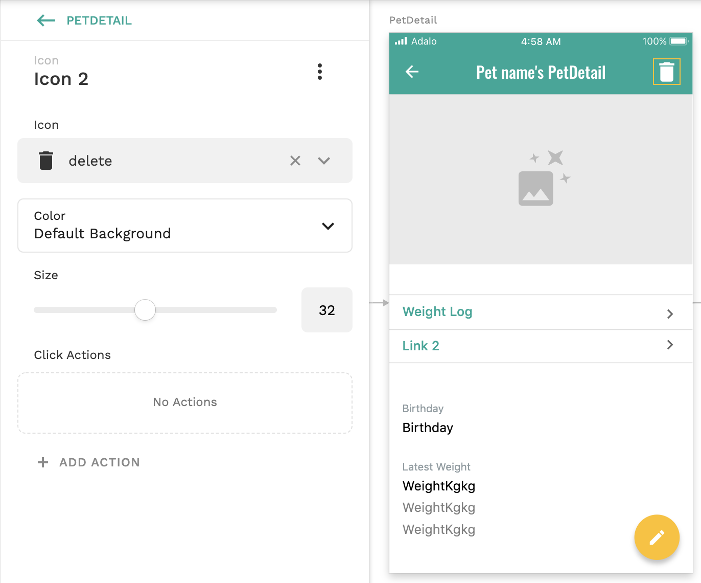

---Delete
- Select Delete > Current Pet from ADD ACTION
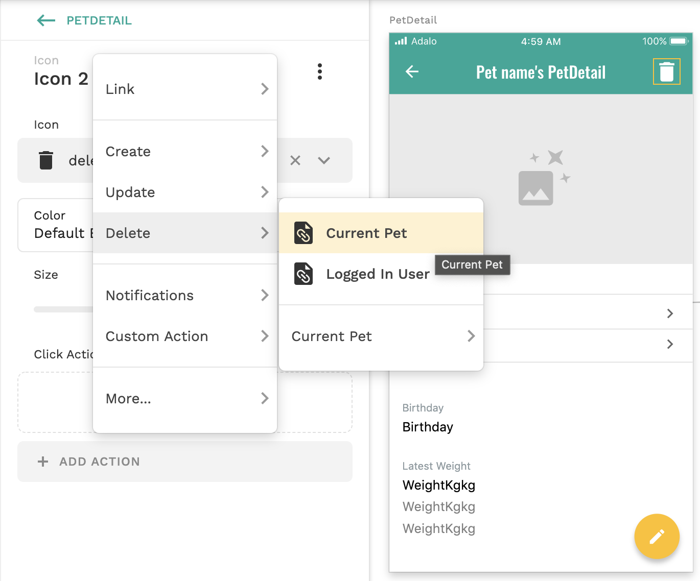 -->

- Select the App Bar and turn on the Right Icon 1 toggle
- Change Icon to delete
- Select Delete > Current Pet from ADD ACTION
- Select Link > Mypets from ADD ANOTHER ACTION

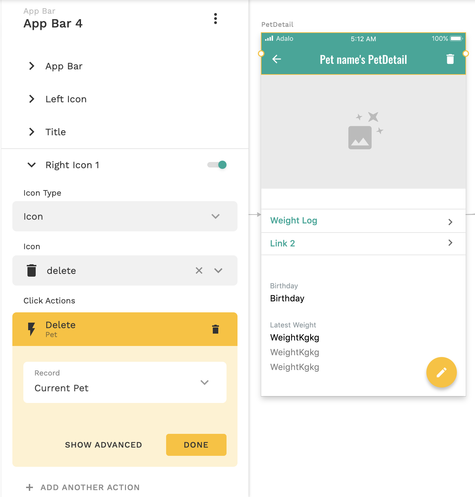

<!-- TODO: I want to put a "Are you sure? between the two-->
---
Let's try deleting with the Preview function.


When the deletion is completed and you go to the Pette List screen, the deleted pets will not be displayed.


---
We have now implemented all kinds of CRUD operations (CREATE, READ, UPDATE, DELETE).

---
## Let's improve the sample application
Let's improve the sample application by using the features of Adalo that I haven't introduced yet.

<!-- Validation (required check) is done in the UPDATE section, so it's OK -->
<!-- I tried Notification, but it doesn't seem to work unless it's a native app, so I skipped it -->.
<!-- TODO: Introduce a way to display a message to encourage registration when there are zero pets registered.
 -->
<!-- - The Share function will only work on a smartphone, so skip it -->
<!-- Change Input Value is also not very useful, so I omitted it. You can use it to clear the form when you register continuously. https://qwerty.work/blog/2021/06/adalo-form-cache-clear.php#toc0-->

---
#### Logout
- Select the AppBar in the pet list screen, and activate the Right Icon 1.
- Change Icon to exit_to_app
- ADD ACTION > More... > User Login > Select Log Out
- Select ADD ANOTHER ACTION > Link > Login
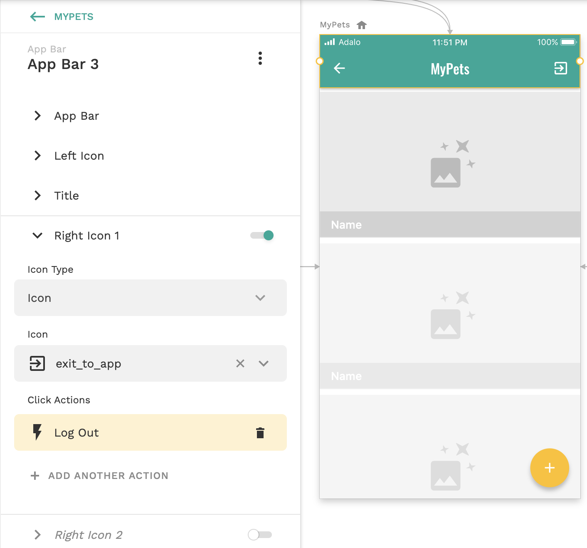

---
Check it with the Preview function.
Clicking on the added icon will now log you out and take you to the login screen.

---
#### Action execution condition setting
If no pets have been registered and the Pet List screen is displayed, the user will be redirected to the Pet Registration screen.
- On the Pet List screen, select Actions > ADD ACTION > Link > Pet Registration.
- Click "SHOW ADVANCED" and change "When does this happen?
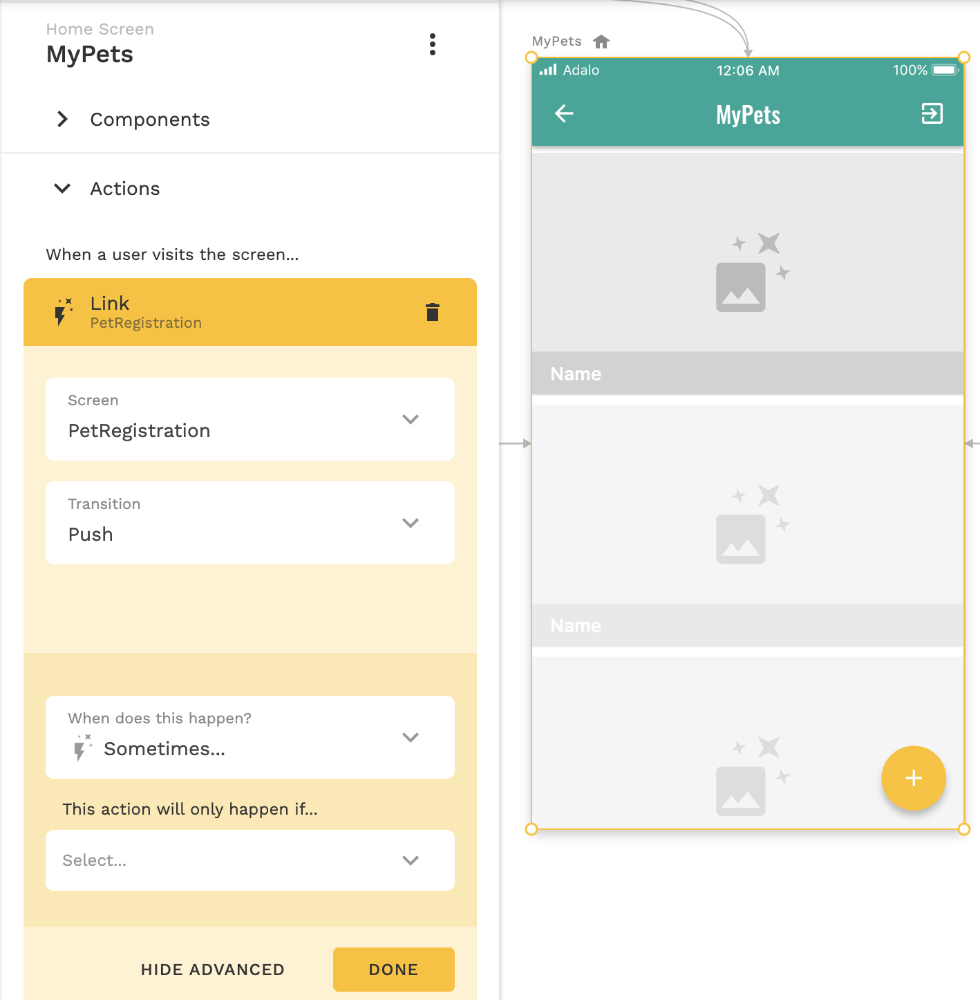

---
- This action will only happen if... Select More > Logged In User's > Pets' > Count
- Change the number under Is equal to to 0
Change the number under Is equal to to 0. [bg right h:600px](images/2021-11-05-00-15-50.png)

---
Check it out with the Preview function.
When you sign up as a new user, you will be redirected from the Pet List screen to the Pet Registration screen.

---
#### Selective Input Form
Add gender to the pet's information and allow selective input in the input form.

---
The choices used in the selective input form are prepared as records by adding a collection to the database.
- Add a Genders Collection to the database (leave the Property as default)
- 0 Click Records > ADD GENDER and add two Records, Male and Female.
Click on 

---
- Add a one-to-many Relationship to the Genders Collection with the Pets Collection
  - Since one pet has one gender, and one gender is set for multiple pets
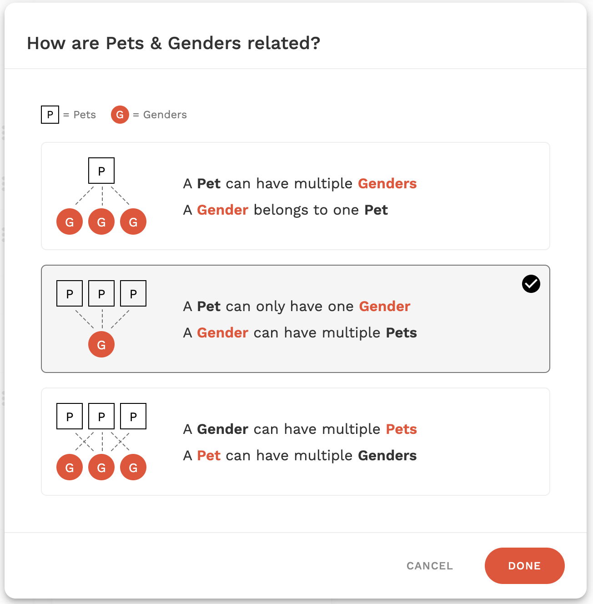

---
- Select the form on the pet registration screen
- Select Fields > ADD VISIBLE FIELD > Gender


---
- Add a Gender field to the Pet Detail screen.


---
Check it out in the Preview function.

- You can select the gender on the pet registration screen.
- The selected gender will be displayed on the Pet Details screen.


---
Supplement
- If you are bothered by the empty fields in the pets you registered before you were able to select the gender, you can go to the Pet Collection Record, click on the pet, and set the gender manually.
<!-- (the gender will not change, so we will not add it to the edit screen item) --> !


---
Reference

You can create a multiple-choice input form using Marketplace's MultiselectDropdown.

If you need it, try it out.
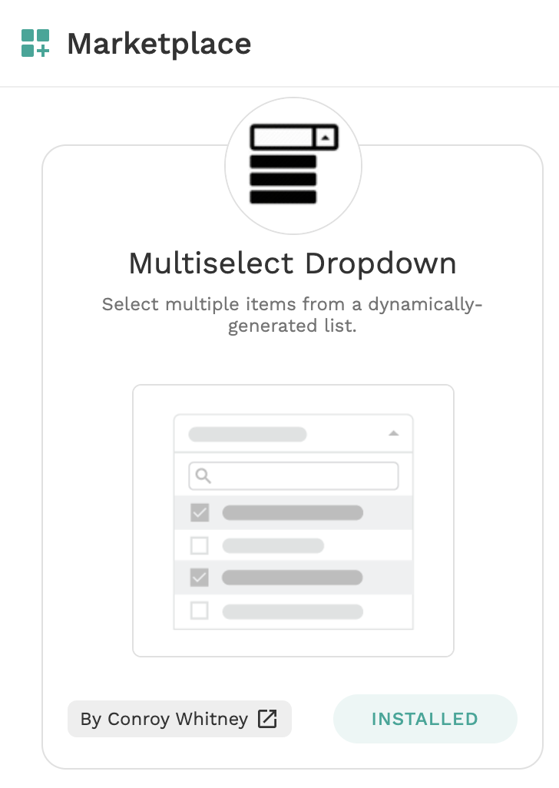

---
#### Hiding components setting
You can keep the components you do not want to display without deleting them.
- In the component list of the Pet Details screen, mouse over the Group that contains Link 2, and click the eye icon on the right side


---
If you check the Preview function, you will see that Link 2 has disappeared.

You can make it appear again by clicking on the icon a second time.


---
#### Show or hide components depending on conditions
If the weight is not registered, the Latest Weight in the Pet Details screen will be hidden.


---
- Select the label "Latest Weight" and its value, and group them together


---
- Select Change Visibility


---
- Change Visibility to Sometimes Visible
- Will be visible if... Select Current Pet > PetWeightLogs > Count
- Set to Is not equal to 0


---
Checking with the Preview function, if the weight is unregistered, the Latest Weight is now hidden.


This is the end of the improvement of the sample application.

---
#### URL for cloning
- You can use the following URL to clone the application that reflects the work done so far, and use it to check your answers.
https://previewer.adalo.com/f1324ea8-ec47-4c22-a3a9-3258044eb754


---
## Exercise
Work on this with your Development Phase team members. 
1. Develop a team member management app with following features.
    - Registration of team members
    - Display of member list
    - Display member details
    - Update member information
    - Delete a member
    - Your original functions
2. Develop new app freely (if there is enough time after exercise 1).

---
If no other team members are participating in today's lecture, please join another team.

If you are a remote participant, please join the other team members by connecting to Zoom and having a conversation or sharing your screen with them.

At the end of the session, all teams will be asked to make a presentation.

When the app is ready to use, share the URL on Slack for everyone to see.

<!-- - Try to design the database by looking at the screens of other template apps -->
<!-- - Add a screen to the sample app and add the necessary Collection and Property to the database -->


---
#### Additional information about the exercise
- To co-edit one app with a team member, select Settings > AppAccess > Add Team Member > Invite New Team Member and enter the team member's email address.


---
When editing one application at the same time with other members, the edits made by others will not be reflected on your screen in real time. (Reloading seems to be necessary).

When multiple people edit the same screen at the same time, the edits made earlier are overwritten by the edits made later. Each person should edit a different screen, or edit together while viewing the same computer.

---
Reference
- There are a number of Adalo apps available that can be cloned, so you may want to look for one that is similar to what you want to do.
  - App Templates
  https://www.adalo.com/app-templates
  - UI & Functional Kits
  https://www.adalo.com/cloneable-kits

---
Examples of apps that can be cloned
- Event Calendar https://www.adalo.com/cloneables/event-calendar
- Swipe-to-answer app quiz https://www.adalo.com/cloneables/quiz-app
- SNS follow function https://www.adalo.com/cloneables/follow-function
- Facebook clone https://www.adalo.com/cloneables/facebook-clone
- Blog app https://www.adalo.com/cloneables/minimal-blog-app
- Ecommerce app https://www.adalo.com/cloneables/ecommerce-app

---
Reference
- If there is something you cannot achieve with Adalo alone, you may be able to achieve it by integrating with external services.
- If you use a service called Zapier, you can easily integrate Adalo with external services by following the instructions. If you are interested, please give it a try.
  https://zapier.com/apps/adalo/integrations

---
Examples of external services that can be linked to Adalo with Zapier
- Google Spreadsheet
- Google Calender
- Slack
- Zoom
- Twitter
- Instagram
- Spotify
- Bubble
- Google Meet
- Strava

---
#### Presentation of the exercise results
Each team should present the application that they made in the exercise.

---
## Summary
- In this lecture, we designed a database and made it possible to perform CRUD operations on the database from the application.
- We also introduced some of Adalo's features while improving the app.
- I have not yet introduced the following Adalo features related to integration with external services, so I would like to introduce them again when I have time in the 5th lecture or Development Phase.
  - Custom Action(Calling APIs of external services from Adalo)
  - External Collections(function to handle data acquired from APIs of external services as Adalo's collections)

---
- Based on what we've learned so far, I think it's a good idea for teams to think about whether the application they want to create in the Development Phase can be realized with Adalo.
- Next time, I will give a lecture on Bubble, a no-code tool. Look forward to it!

---
# That's all!
# Thank you for your hard work!
