**Programming Boot Camp**

# Database design, Data manipulation, External integration with Adalo

**Tokyo Institute of Technology 2022/11/13**
　
　
　
　
　
　　　　　　　　　　　　　　　　　　　　　　　　**Ryo Imahashi**

<!-- <!-- ---
## Reference
- https://nocodo.net/media/media-4553/
- https://note.com/shinya_matsui/n/n05335098aaeb
- [Pet Health Care Application Development Log](https://www.notion.so/72d6bec451574cadb3d333a1ebc9355c) --> -->

---
## Table of Contents
  - Review previous lecture and check the goal of this lecture
  - Introduction to databases
  - Database design
  - Data manipulation
  - Improve sample application
  - External integration
  - Team development with Adalo
  - Exercises
  - Summary

---
####  Review previous lecture and check the goal of this lecture

- In the previous lecture, we learned Adalo, a no-code tool, and created the UI of the pet health management app.
  - In the lecture, we used simple components that does not require a database.
- In this lecture, we will design a database that matches the UI we created in the previous lecture, so that we can manipulate the data from the app. 
- After that, we will improve the sample app learning some features of Adalo, learn external integration and team development. Finally, we will do app development exercises and presentation.

---
## Introduction to databases
First, let's learn about databases.

---
#### Database(Previous lesson)
- A set of organized data.
- Data can be registered, read (displayed), updated, and deleted.
- Example: In the case of a Chat application

<!--  --> !


---
- Databases are often compared to "spreadsheet-like" software.
- A database can be used to CREATE, READ, UPDATE, and DELETE data. These operations are collectively called CRUD operations.


---
#### Basics of Adalo's database
 You can access Adalo's database from this icon.
There are three components of the Adalo database.
- Collection
- Property
- Record

---
###### What is a Collection?
A collection of data that has the same property.
 

---
- Collection is used to divide and organize the various data.(An analogous term is table.)
- In many cases, a Collection is a group of data that a user can register, update, or delete in a single operation. <!-- (A collection is often said to be something that can be expressed as a noun.
- By default, Users is prepared as a Collection, and the rest can be added according to the application to be developed.

It is very difficult to decide what kind of collection to add. Let's practice and get used to it. (If you have any problems, consult with mentors.)

---
###### What is Record?
- Record is a unit of information in a collection.
  - One row corresponds to one Record.
- In the example of Users Collection, the information belongs to one user is registered as one Record.


---
- Records are basically registered from the form on the screen of the app, but it is also possible to register from the form by pressing the "+Add xxxx" button on the upper right in Record View.
- You can also search for Records in the Collection, and upload (import) and download CSV files.


---
###### What is Property?
- Property is each and every item that makes up a Record.
- The Users Collection consists of properties such as email, password, user name, and name.
- The value of Property can be empty.


---
To define what kind of data the Property is, select the Type when adding it.
- Text
- Number
- True/False
- Date/Time
- Date/Time
- Image
- File
- Location

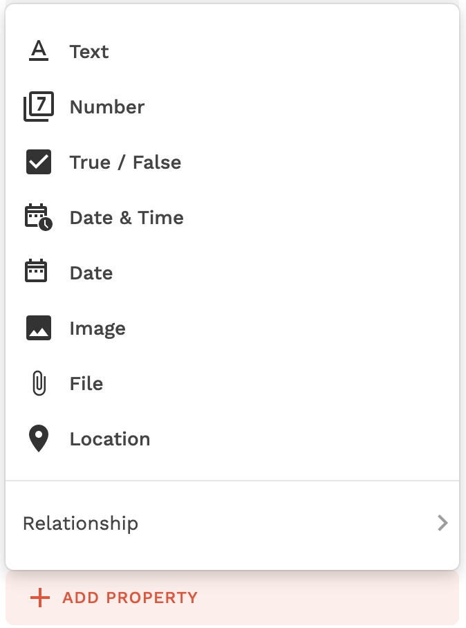

---
What is Relationship?
- Instead of storing a large number of properties for a single Record, we can set a special property to relate multiple Collections, called Relationship. This allows you to divide a Collection into manageable pieces.

---
For example, a message sent by a user in the Chat app is stored in the Messages Collection, which is separate from the Users Collection, and these two collections are related by Relationship.

The Users side has a Relationship called Messages, and the Messages side has a Relationship called Sender (with Users).


---
Types of Relationship
- In Adalo's Relationship, you can choose one of two types, one-to-many or many-to-many, depending on the number of Records associated with the Collection. 

---
One-to-many Relationship
- This means that one Record has a relationship with multiple Records in different collections. 
- Depending on whether the Collection you are trying to set the Relationship to is one or many, two choices will appear.

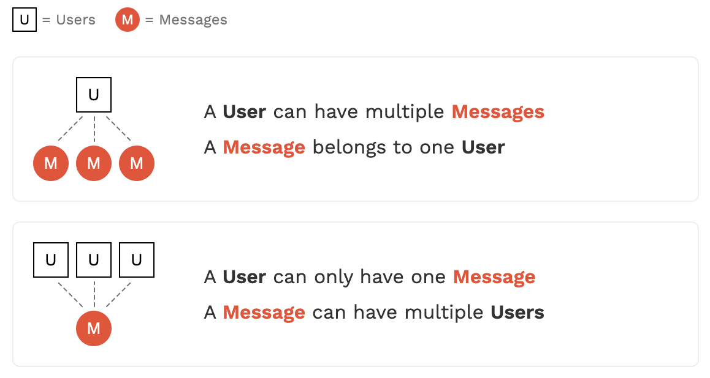

---
Example of a one-to-many Relationship
- In the Chat application, one user sends multiple messages, but the sender of the message is one user, so the Relationship in the Users Collection and Messages Collection is one-to-many.

 

<!-- For example, if there is only one organizer for an event, then the Relationship between the organizer and the event is one-to-many. -->
<!-- For example, one user organizes multiple events, or there is one organizer for multiple events, both of which represent true one-to-many Relationships. -->

---
Many-to-many Relationships
- This means that one Record in both Collections is tied to multiple Records in the other Collection.

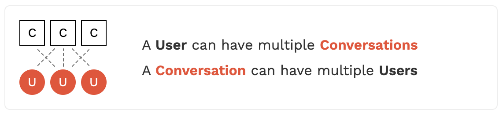

---
An example of a many-to-many Relationship
- In a Chat application, one user can have multiple conversations (to keep track of who and what messages were exchanged), and one conversation can have multiple members (users), so the relationship between the Users Collection and the Conversations Collection is many-to-many.

!

---
## Database design
Let's design the database by looking at the UI of the sample app created in the previous lecture and thinking about what kind of data needs to be saved.


---
#### URL for cloning the app created in the previous lecture
- Please clone the app from the following URL. We will use it to proceed with the lecture from here.
https://previewer.adalo.com/014fd9d1-80c6-4325-899a-d943e778c865

---
#### Let's design the database.
Let's design the database by looking at the UI of the sample application. The steps are described in the next page.


---
###### Database Design Steps
1. While looking at the UI, make a list of the data that will need to be saved. Write them down in a text editor (e.g. Notepad application).
2. Think about what kind of collections should be created to store the listed data, and create the collections in the Adalo database.
3. Add the data you listed in step 1 as a Property to the appropriate Collection and select the appropriate Type.
4. Set the Relationship Property to collections related to other collection.

---
In the next slide and onwards, there are explanations, but it is highly recommended that you try it by yourself before checking them.

There is no absolute right answer. When in doubt, follow your intuitions.

---
###### Explanations
While looking at the UI, made a list of the data that needs to be saved, and it looked like this
````
- User's Email
- User's Password
- User's FullName
- Pet's Name
- Pet's Photo
- Pet's Birth Date
- Pet's weight
- Date and time the pet's weight was registered
````

- If anyone can name any other data, please let me know!

---
Thinking about what kind of collections should be created to store the listed data, listed these three Collections.
```
- Users
- Pets
- PetWeightLogs
```
- Many of you would have listed two collections, one for users and one for pets.
- Some people would not have listed a collection for pet weight records. (It is not wrong to include the pet's weight and its registration date in the pet's Collection. This will be explained later.)
- Have any of you listed other Collections?
<!-- In extreme cases, you can do it with 1Collection -->.

---
Additional information on Collection classification
- When the relationship "if A is identified, then B is identified" is true, "A" is often a Collection and "B" is a Property of that Collection.
  - If a user is identified, the user's email, password, and FullName are identified.
  - If a pet is identified, the pet's name, photo, and birthday are identified.
- When the relationship "there are multiple B's corresponding to A" is true, A and B are often split into two collections.
  - There are multiple pet weights and their registration times corresponding to a pet.

---
- Register the Collection into the Adalo database.
- Users is created by default.


---
Next, I appended the data listed in 1 as a Property of the appropriate Collection. Types are placed in "()".
```
- Users
  - Email(Text)
  - Password(*Password)
  - FullName(Text)
- Pets
  - Name(Text)
  - Image(Image)
  - Birthday(Date)
- PetWeightLogs
  - WeightKg(Number)
  - RegisteredTime(Date&Time)
```
Password is a special Type that is set to Password by default.
<!-- This will be an encrypted version of Text. -->

---
- In Adalo database, add the properties.
- The Users Collection is already set by default and contains all the necessary items.
- We don't need Username, but since we can't delete it, leave it as is.


---
- The Pets Collection Property looks like this.


---
- The Property of the PetWeightLogs Collection looks like this.
- Delete the Name Property, which is set by default when you add a Collection.
  - You can delete it after dragging and dropping it so that the order is not at the top of the collection.

<!-- The name property is not needed. [](images/2021-11-03-15-36-02.png) --> !


---
Finally, for collections that are related to other collections, set the Relationship Property.

- Select the Users Collection to add a one-to-many Relationship with the Pet Collection.


---
- If you check the Pets Collection, you will see that a Relationship with the Users Collection has been automatically added because the Relationship setting was made on the Users Collection side.
  - Since the Users Collection is one side, the "s" at the end is omitted and the Property name is "User".


---
- Add a Relationship to the Pets Collection with the PetWeightLogs Collection.
  - Select the Pets Collection to add a one-to-many Relationship with the PetWeightLogs Collection.


---
If you check the PetWeightLogs Collection, you will see that a Relationship with the Pets Collection has been automatically added because the Relationship setting was made on the Pets Collection side.
  - Since the Pets Collection side is one side, the "s" at the end is omitted, and the Property name is "Pet".


---
Reference: What happens if you include the pet weights and its registration times in the Pets Collection?

The record will be registered as follows, but in this case, you will have the troubles.


---
The troubles
- Because multiple Records with different pet weights and their registration times are registered for one pet, the pet's information (Name, Image, Birthday) is registered in duplicate.
  - In order to change the information of one pet, we have to update all the duplicated records, which makes the process more complicated.
- Adalo has a convenient function to automatically generate a form to register a record in a single collection, but since the collection is not divided by the unit to register data, it cannot be used.

---
That's it for the sample app database design.

It is recommended that you set up Adalo's database in the same state as the document to avoid confusion in the later work.

---
## Data manipulation
Let's use the database we designed so that we can perform CRUD(CREATE, READ, UPDATE, DELETE) operations in the sample application.

---
#### Creating Data
First, let's make it possible to actually register a record of a pet in the pet registration screen.


---
- Select the "REGISTER" button on the pet registration screen and click "ADD ANOTHER ACTION"
- Select "Create" > "Pet"


---
<!-- Enter the following. -->
- For Name, select "Input" from Other Components.
- For Birthday, select "Date Picker" from Other Components.
- For Image, select "Image Picker" from Other Components.
- For User, select "Logged In User".
- Leave PetWeightLogs as Empty(not required here).


---
Let's try to register a pet with the Preview function.
It is OK if you can register record in the Pets Collection


---
Next, let's make it possible to register the current weight in the pet weight management screen.


---
- Select the "ADD" button on the pet weight management screen and click "ADD ACTION".
- Select "Create" > "PetWeightLog"


---
Enter the following.
- For WeightKg, select "Input" from Other Components.
- For WeightRegisteredTime, select "Date&Time" > "Current Time".
- For Pet, Nothing is Available. Leave it as Empty for now.(We will configure this later)


---
#### Displaying Data (READ)
First, let's make registered pets displayed in pets list screen.


---
- Select the two components that display the pet's image and name, and click "MAKE LIST".


---
- Select "Pets" in What is this a list of?
- Select "Logged In User" > "Pets" in Filter


---
- Click the first Group which corresponds to first pet you manually created.
- Let's edit the Image component and the Pet Name component in this Group.


---
Edit the Image component
- In Image Source, select "Database" > "Current Pet's" > "Image"
- In "If there's no image...", select "Don`t show anything"
  - Alternatively, you can select "Show a place holder image" and set your [pet's silhouette image](https://www.silhouette-ac.com/category.html?ct=3&sw=%E5%8B%95%E7%89%A9)


<!--  --> !

---
Edit the pet name component
- Under Add Magic Text, select "Current Pet's" > "Name"


---
- When you check it by preview function, you will see the Record registered in the database as the first pet.


---
- Delete the second Group (which displays static second pet) in the component that makes up the List of pets, since it is not needed anymore.

 

---
- When you check it by preview function, only the pets you have registered in the database are now displayed.
  - If you register additional pets, multiple pets will be displayed.

 

---
Make sure that when you click on a pet in the pet list, you can go to the detail screen of that pet.
- "Current Pet" is automatically set in the "Send This Data to PetDetail Screen" of the Link set in the Group component of the pet.


---
- Since "Current Pet" was set in "Send This Data to PetDetail Screen" of Link from Pet List Screen, "Current Pet" is set as "Linked Data" in "Available Data" of Pet Detail Screen.
  - As a result, the pet selected in the Pet List screen (Current Pet) can be handled in the Pet Detail screen.


---
Next, we will make sure that the pet selected in the Pet List screen is displayed in the Pet Detail screen.


---
Click on the Image component and configure it as follows.
- In Image Source, select "Database" > "Current Pet's" > "Image".
- In "If there's no image...", select "Don`t show anything"
  - Alternatively, you can select "Show a place holder image" and set your [image](https://www.silhouette-ac.com/category.html?ct=3&sw=%E5%8B%95%E7%89%A9)
  


---
Click the Birthday Value component and configure it as follows.
- Select "Current Pet's" > "Birthday" in Text
- Select "No Formatting" in Date Format


---
- Click the Latest Weight Value component and "MAKE LIST".

This is required to displaying the latest weight.
(The settings on the next page will narrow down the list to the most recent one.)


---
- Select "etWeightLogs" in "What is this a list of?"
- Select "Current Pet" > "PetWeightLogs" in Filter
- In Sorting, select "WeightRegisteredTime - Newest to Oldest"
- Set "Maximum number of items" to 1

This will narrow down the list to only the latest one.


---
- Click the Latest Weight Value component, add select "Current PetWeightLog's" > "WeightKg" to the Text, then add "kg" to the end.

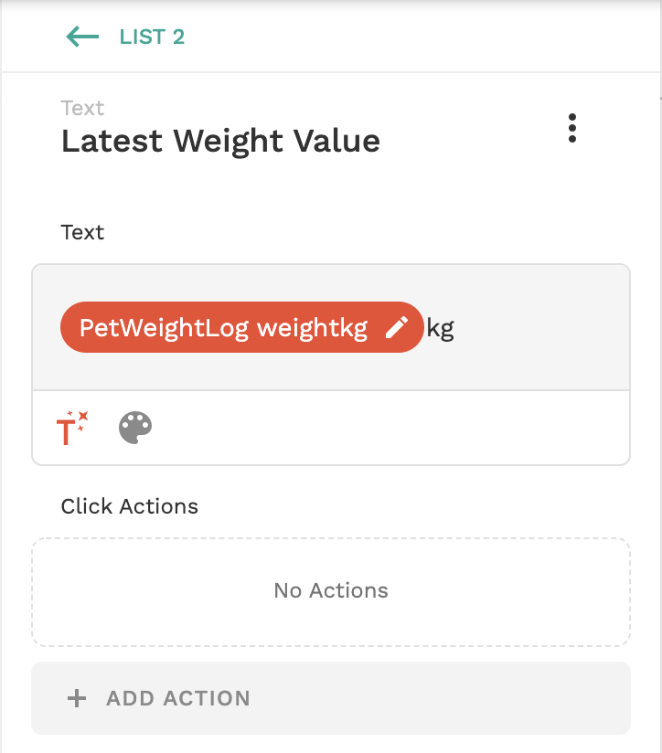

---
Make sure that the selected pets can be passed on when moving from the Pet Detail screen to the Pet Weight Management screen.
- Select the component of the link "Weight Log", and confirm that "Current Pet" is automatically set in "Send This Data to PetDetail Screen".


---
(The remaining work of creating data)

Allow added weight in the Pet Weight Management screen to be registered in the database.
- Select the "ADD" button, and set "Current Pet" to the "Pet" (that was once left as Empty).


---
Display the name of the selected pet in the header of the Pet Details screen and the Pet Weight Management screen. On each screen,
- Select the App Bar component at the top of the screen and add "Current Pet's" > "Name" to the Title Text.
- Add the string "'s PetDetail" after it.


---
In the Preview function, check the following.
- You can move to the detail screen of the selected Pet from the Pet List screen.
- It is possible to move to the weight management screen of the selected pet from the pet detail screen.
- When the pet weight is registered, the record is registered in the PetWeightLogs Collection of the database.
- The latest weight is displayed on the pet detail screen.


---
Next, we will display registered pet's weight logs as a graph in the pet weight management screen.
- First, delete the graph that was pasted as an image


---
- Select "EXPLORE MARKETPLACE" from "ADD COMPONENT"
- Install "Chart Kit"

 

---
- Add "Line Chart" to the screen


---
Set up a Line Chart.
- Select "PetWeightLogs" in "What is this a chart of?"
- Select "Current Pet" > "PetWeightLogs" in Filter
- In Custom Filter, set "WeightRegisteredTime", "Is after", "30 days ago" to specify display period.
- In Sorting, select "WeightRegisteredTime - Oldest to Newest"


---
- Set X Axis Value to "PetWeightLog" > "WeightRegisteredTime"
  - Set Date Format to "Date / Time"
- Set Y Axis Value to "PetWeightLog" > "WeightKg"


---
Let's preview the graph. If you add multiple weights, the graph will be drawn.

(The registration time of the weight is too long and will be displayed abbreviated...
We used the Date&Time type to test it by registering multiple weights on the same day, but it would be better to use the Date type and restrict multiple registration on the same day.)
<!-- , if you add different weights in a row, the line will stretch up and down -->
<!--  -->


<!-- You can also set labels for the X and Y axis -->

---
#### Updating Data
Create a new "EditPetInfo" screen where you can update the information of registered pet.


---
First, add a link to the Edit Pet Info screen in the Pet Detail screen.
- Add "Action Button" from "ADD COMPONENT"
- Change the Icon to "edit"
- Change Icon and Text Color to "Default Background"(white)


---
- Select "Link" > "New Screen" from ADD ACTION


---
- Enter "EditPetInfo" in a Screen Name
- Select "Form"
- Click "CREATE SCREEN"


---
- Select "Pets" in "Which data collection?"
  - The form is automatically generated according to the collection.
- Select "Update Current Pet" in "What do you want the form to do?"
- Change the order of "Birthday" and "Image" in Fields

EditPetInfo screen is ready.

<!-- If there are any fields that don't need to be updated, we can delete the entry -->

---
Make sure that you can edit the pet information.


---
Supplement
- In the previous article, we created the input form for the pet registration screen by adding components one by one, but it can be automatically generated in the same way as we created the pet edit screen.

---
- Let's delete all components except "AppBar" in the pet registration screen, add a "Form" component, and specify "Pet Collection" to generate the form automatically.
  - Then, manually add link to the pet list screen after registration by adding action to the Submit Button.

---
Additional Information
- Using the Form component, you can check if the required fields are filled in by just checking "the Required Error Text" of the field item.
- Use the Form component as much as possible when creating input forms.


---
Reference: The actual flow of application development in Adalo
- In the sample application, we have proceeded with the following flow: UI creation > database design > linkage between them.
  - This is because it seems difficult to design the database without knowing what kind of screen and data we need.
- When actually developing an application with Adalo, It is recommended that first draw a UI sketch and identify the necessary data, and then design the database. By doing so, you can take advantage of automatic generation for UI creation.
  - However, the actual development would not be a one-way flow, but a trial-and-error process, alternating between database design and UI design.

---
#### Deleting Data
Create a button to delete a registered pet in the pet details screen.

---
<!-- ---
- Select Icon from ADD COMPONENT and place it on the right side of the AppBar.
- Change Icon to "delete
- Change Color to Default Background(White)
- Adjust Size


---Delete
- Select Delete > Current Pet from ADD ACTION
 -->

- Select the App Bar and turn on the "Right Icon 1"'s toggle
- Change Icon to "delete"
- Select "Delete" > "Current Pet" from "ADD ACTION"
- Select "Link" > "Mypets" from "ADD ANOTHER ACTION"


<!-- TODO: I want to put a "Are you sure? between the two-->
---
Let's try deleting with the Preview function.


When the deletion is completed, you will be redirected to the Pet List screen. The deleted pets will not be displayed.


---
We have now implemented all kinds of CRUD(CREATE, READ, UPDATE, DELETE) operations.

---
## Improve sample application
Let's improve the sample application by using the features of Adalo that we haven't learned yet.

<!-- Validation (required check) is done in the UPDATE section, so it's OK -->
<!-- I tried Notification, but it doesn't seem to work unless it's a native app, so I skipped it -->.
<!-- TODO: Introduce a way to display a message to encourage registration when there are zero pets registered.
 -->
<!-- - The Share function will only work on a smartphone, so skip it -->
<!-- Change Input Value is also not very useful, so I omitted it. You can use it to clear the form when you register continuously. https://qwerty.work/blog/2021/06/adalo-form-cache-clear.php#toc0-->

---
#### Logout
- Select the AppBar in the pet list screen, and activate "Right Icon 1"
- Change Icon to "exit_to_app
- Select "ADD ACTION" > "More..." > "User Login" > "Log Out"
- Select "ADD ANOTHER ACTION" > "Link" > "Login"


---
Check it with the Preview function.


---
#### Action execution condition setting
If no pets have been registered, redirect users from Pet List screen to Pet Registration screen.
- In the Pet List screen, select "Actions" > "ADD ACTION" > "Link" > "Pet Registration"
- Click "SHOW ADVANCED" and change "When does this happen?"


---
- Set "This action will only happen if..." "More" > "Logged In User's" > "Pets'" > "Count"
- Change the number under "Is equal to" to 0.


---
Check it out with the Preview function.
When you sign up as a new user, you will be redirected from the Pet List screen to the Pet Registration screen.

---
#### Selective Input Form
Add gender to the pet's information and allow selective input in the input form.

---
The choices used in the selective input form are prepared as records by adding a collection to the database.
- Add a Genders Collection to the database (leave the Property as default)
- Click "0 Records" > "ADD GENDER" and add two Records, "Male" and "Female".


---
- Add a one-to-many Relationship to the Genders Collection with the Pets Collection
  - Since one pet has one gender, and one gender is set for multiple pets


---
- Select the form on the pet registration screen
- Select "Fields" > "ADD VISIBLE FIELD" > "Gender"


---
- Add a Gender field to the Pet Detail screen.


---
Check it out in the Preview function.

- You can select the gender on the pet registration screen.
- The selected gender will be displayed on the Pet Details screen.


---
Supplement
- If you are bothered by the empty fields in the pet you registered before you were able to select the gender, you can go to the Pet Collection Record, click on the pet, and set the gender manually.
<!-- (the gender will not change, so we will not add it to the edit screen item) --> !


---
Reference

You can create a multiple-choice input form using Marketplace's MultiselectDropdown.

If you need it, try it out.


---
#### Hiding components
You can keep the components which you do not want to display without deleting them.
- In the component list of the Pet Details screen, mouse over the Group that contains "Link 2", and click the eye icon on the right side


---
If you check the Preview function, you will see that "Link 2" has disappeared.

You can make it appear again by clicking on the icon a second time.


---
#### Show or hide components depending on conditions
If the weight is not registered, the Latest Weight in the Pet Details screen should be hidden. Let's configure this.


---
- Select the label "Latest Weight" and its value, and group them together


---
- Select Change Visibility


---
- Change Visibility to "Sometimes Visible"
- Set "Will be visible if..." as "Current Pet" > "PetWeightLogs" > "Count"
- Set "Is not equal to 0"


---
Checking with the Preview function, if the weight is unregistered, the Latest Weight is now hidden.


This is the end of the improvement of the sample application.

---
#### URL for cloning
- You can use the following URL to clone the application that reflects the work done so far, and use it to check your answers.
https://previewer.adalo.com/f1324ea8-ec47-4c22-a3a9-3258044eb754


---
## External Integration
If there is something you cannot achieve with Adalo alone, you may be able to achieve it by integrating your adalo app with external services.

I will show you how to do that.

---
Let's learn following four methods of external integration.
- Marketplace external integration component
- Custom Action
- External Collection
- Connector service

---
#### Marketplace external integration components
You can add a component that enables external integration from Marketplace.


---
First, let's create a new application.
- Login to Adalo
Go to https://app.adalo.com/login
- Click CREATE NEW APP


---
- Select Native Mobile App for Platform
- Click "Next"


---
- Select Blank for Template.


---
- For App Name, enter "MarketplaceComponentTrial".
- Please set the Color freely.


---
##### Twitter Timeline Component
- Press the + button and click Explore Marketplace in ADD COMPONENT


---
- INSTALL the Twitter Timeline component


---
Let's use Twitter Timeline component.
- Add a link button to the Twitter screen to the Home Screen.


---
- Add Link to New Screen from ADD ACTION


---
- Select "App Bar" in Template and create a "Twitter Timeline" screen.


---
- Place the Twitter Timeline component


---
- Enter "tokyotech_jp" as the Twitter Handle Name
  - You can also change it to the Handle Name of your favorite Twitter account!


---
- Signup in the Preview function and click the Twitter button.


---
- The posts of the Twitter account with the Handle Name you entered will be listed.


---
Let's modify it so that it lists the posts of the logged-in user's own Twitter account.
- Add a TwitterHandleName Property to the Users Collection.
  - Select Text as the Type


---
- Click Form on the Signup screen
- Fields > ADD VISIBLE FIEDLD > TwitterHandleName
- Change to Not Required


---
- "ALREADY HAVE AN ACCOUNT?" link is overlapping the form, so move it to the bottom


---
Let's set the TwitterHandleName for the registered users
- Click the "1 Record" button in the Users Collection


---
- Click on the record of the registered user.
- Enter TwitterHandleName (You can use your own account or any account you like.)


---
- Change the Twitter Handle Name in the Twitter Timeline component to "Logged In User's TwitterHandleName".


---
Theoretically, this should display the list of posts of the Twitter account set by the logged-in user himself.

Let's check it out with the Preview function.

---
I think an error will occur at first.

If so, go home screen by clicking "←" icon. After that, open "Twitter Timeline" screen again. You can see the posts of the logged-in user's own Twitter account.


---
Twitter Timeline is a component that has been made available for free by volunteers.

What someone else makes doesn't always work the way you want it to.


---
There are several other components provided to integrate with external services. If you are interested, you can try them.

Example: 
- Youtube (free)
- Google Map(free trial is available by registering credit card)

---
#### Custom Action
Next to the external integration component, I will show you how to handle the data retrieved from the API on the Adalo screen.

---
Reference
>In a broad sense, an Application Programming Interface (API) is a specification of an interface used by software components to exchange information with each other.

 https://ja.wikipedia.org/wiki/%E3%82%A2%E3%83%97%E3%83%AA%E3%82%B1%E3%83%BC%E3%82%B7%E3%83%A7%E3%83%B3%E3%83%97%E3%83%AD%E3%82%B0%E3%83%A9%E3%83%9F%E3%83%B3%E3%82%B0%E3%82%A4%E3%83%B3%E3%82%BF%E3%83%95%E3%82%A7%E3%83%BC%E3%82%B9

---
First, let's try API integration.
We will use The Cat API, which is free to try. Please access the following URL.
https://thecatapi.com/


---
Note: For the dog people, there is also The Dog API. It probably does the same thing as The Cat API. (I have not tried it, so I recommend using The Cat API with it first)
https://www.thedogapi.com/


---
When using an API, it is often necessary to have an API key issued by the API provider.
The Cat API also requires an API key, so have it issued to you.
- Scroll down to the bottom and click "SIGNUP FOR FREE" in the Pricing section.


---
- Enter your email, App Description, type of project and click "SIGNUP" !


---
- Check the API key that was sent to you by email (you will use it later).


---
Next, let's check the API documentation to see how to use the API.
- Go to the following URL (you can also find the link "API Documentation" in the email you received earlier)
https://docs.thecatapi.com/

---
Use the API to get a random kitten image as described in the top page.

As in the example, make sure that the image changes when the button is pressed.


---
- CREATE NEW APP in Adalo's admin panel
- The settings are as follows
  - Platform: Native Mobile App
  - Template: Blank
  - App Name: ApiIntegrationTrial


---
- Add a link button to the kitten image display screen on the Home screen.
- Set Link to New Screen from ADD ACTION


---
- Select App Bar as Template and create Kittens screen.


---
- Place the Image component on the screen
- Leave the component settings as they are (we'll set them later)


---
- Add a Change Kitten Image Button


---
- Select New Custom Action from ADD ACTION


---
You will be prompted to start a 14-day Free Trial.
- Click on "START FREE TRIAL"


---
The trial has started.
- Click on "CREATE NEW CUSTOM ACTION" !
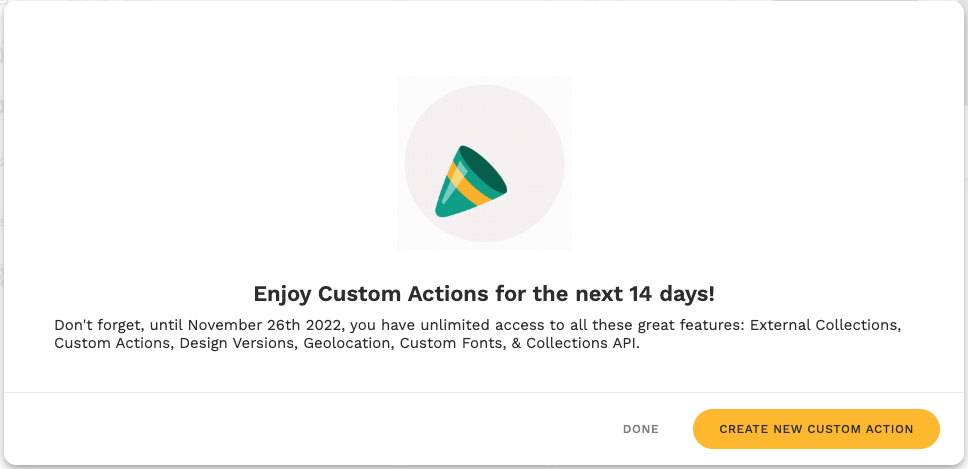

---
- Enter the following and click NEXT
  - Name: GetRandomKitten
  - Type: Create


---
Next, we will configure the API Request to be sent.


---
Go to the following URL to check the configuration items.
https://docs.thecatapi.com/api-reference/images/images-search
- API Base URL is https://api.thecatapi.com/v1/images/search
- Method is GET
- Set the API key in the Header with the name x-api-key


---
- Set the API Request based on the results of the check.
  - API Base URL is https://api.thecatapi.com/v1/images/search
  - Method is GET
  - Set the API key in the Header with the name x-api-key
- Click "RUN TEST REQUEST".


---
If the Test is successful, the data retrieved from the API (Magic Text Output Properties) will be displayed. These can be used in subsequent actions.
- Click on "SAVE CUSTOM ACTION


---
Next, set the URL of the kitten image retrieved from the API to the Image Source of the Image component.

As it is, the data retrieved from the API will not appear in the choices.


---
- Add a Text Input component to the screen
- Change the Name to "Invisible Kitten Image URL Input".


---
- Click on the "Change Kitten Image Button
- Select "Change Input Value" from ADD ANOTHER ACTION


---
- Set "Invisible Kitten Image URL Input" as Input
- Set Valoue to "GetRandomKitten > url".
- Click "DONE


---
- Click on the Image component
- Set the URL to "Invisible Kitten Image URL Input".


---
- Click on the screen name "Kittens".
- Click on the eye icon to the right of "Invisible Kitten Image URL Input" to hide it.


---
Check it with the Preview function.

Click on the CHANGE button and the kitten image is now displayed.


---
Supplemental

- Data acquired from the API in Custom Action can be used in subsequent Actions. If you want to use the data in your component, use one of the following methods.
  - Set the data to the Text Input value on the same screen using the Change Input Value of the subsequent Action and load it.
  - Alternatively, you can save the data to the database in a subsequent Action and load it from another component. In this case, it can be accessed even after the screen transition.
    - Example: https://help.adalo.com/integrations/custom-actions

---
Notes

Currently, Custom Action has some limitations.
- Custom Actions will not work with the Submit button of the Form component.
- If a Custom Action is used as an Action for the entire screen, data obtained as an API response cannot be used in the Imperial Action.
- Cloning an app does not copy the Custom Action; if you clone an app that contains a Custom Action, you will need to recreate it manually.

---
\>Cloning an app does not copy the Custom Action; if you clone an app that contains a Custom Action, you will need to recreate it manually.

The 14-day free trial will end before Development Phase.

If you are likely to use a lot of Custom Actions, we recommend that you create a new Adalo account and start a new free trial before you start working on the Development Phase.

---
#### External Collection
This section describes how to handle data retrieved from the API as an Adalo collection.

If you want to retrieve multiple data at once and list them on the screen, use External Collection instead of Custom Action.

---
Let's use this API to retrieve and display a list of cat breeds.
https://docs.thecatapi.com/api-reference/breeds/breeds-list#send-a-test-request


---
- Click "ADD COLLECTION" in External Collections of Database


---
- Collection Name: Breeds
- Base URL: https://api.thecatapi.com/v1/breeds
- Method: GET
- Auth Setup
  - Header x-api-key: the issued API Key


---
In Adalo, you can set up five Endpoints (access methods) for each resource (in this example, breeds) that you want to access with the API.

Depending on the specifications of the API, you may need to modify it to fit your needs, but in this case, you can just click NEXT.


---
- Run the test and if it succeeds, click "CREATE COLLECTION".


---
The External Collection has been created.

All the data to be retrieved from the API is set as properties.


---
Let's list the retrieved data.
- Add a "Breeds Link" button to the Home screen.
- Add a LINK to the NEW SCREEN from ADD ACTION.


---
- Enter "Breeds" in Name.
- Select Image List in Template
- Click CREATE SCREEN


---
- Change the List Title Text to "Cat Breeds".
- Set the Image List as the Breeds Collection list.
- Set Image URL to "image > url".
- "If there's no image..." Set "Don't show anything" to "If there's no image...".
- Remove the + button at the bottom right.


---
- Change Text to "name".


---
Show the back icon since it is hidden.
- Click on the App Bar
- Change the Left Icon toggle to ON.


---
Checking with the Preview function, the list of cat breeds is now displayed.


---
- If you use a service called Zapier, you can easily integrate Adalo with external services by following the instructions. If you are interested, please give it a try.
  https://zapier.com/apps/adalo/integrations


---

---
#### Connector Service
It is required to understand api document to use Custom Action and Extenal Collection, but it may be difficult.

Next, I will introduce connector service that can be more easily used to integrate adalo app with external services.

---
The following is a no-code mapping which contains connector services.
There are some connector services, but this time we will use a service called Zapier.


---
##### Zapier
- Using Zapier, you can easily integrate services by following the instructions. Let's give it a try.

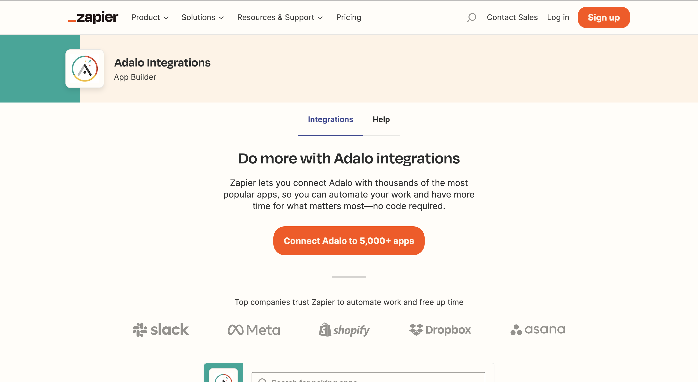

--- 
Adalo does not have an email sending function.

This time, we will use Zapier to integrate Adalo with Gmail so that Welcome email will be automatically sent to people who SignUp to the application.


--- 
- Create a Google account, as you will need it to use Gmail.
  - If you already have one, you can use that account, so you do not need to create new one.
  - If you do not have one, please create one with me. Click following URL.
  https://accounts.google.com/signup/v2/webcreateaccount?continue=https%3A%2F%2Faccounts.google.com%2FManageAccount%3Fnc%3D1&dsh=S50453738%3A1637917137418951&biz=false&flowName=GlifWebSignIn&flowEntry=SignUp

---
- Once you have your Google account ready, go to https://zapier.com/apps/adalo/integrations and click on "Connect Adalo to 5,000+ apps".


---
- Sign up by any method you like.


---
- Enter roles and number of employees and click "Continue".


---
- Add Adalo and Gmail to the list of applications to use and click "Finish setup".

 


---
You will see an edit screen for service integration settings, called Zap.

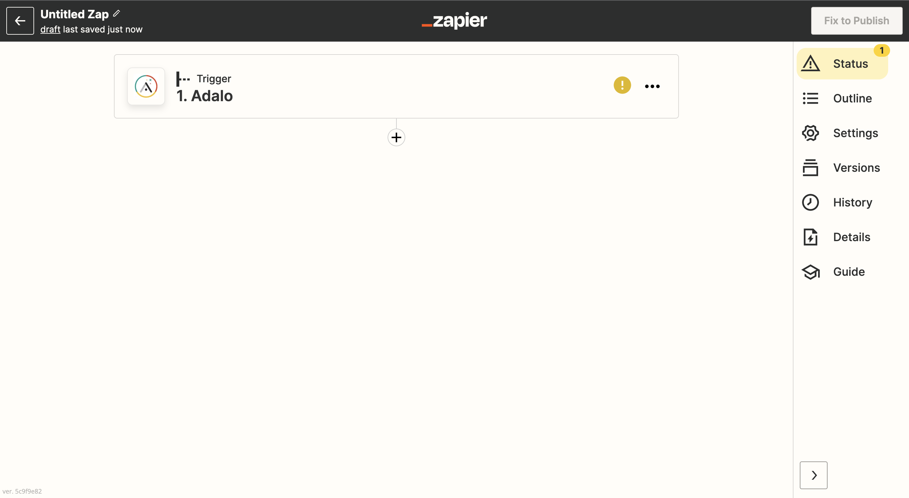


---
- Click on Trigger (= rectangle containing "1. Adalo")
- Set "New Record" as Event
- Click "Continue


---
- Click "Sign in"


---
- Enter the Email Address and Password of your Adalo account and click "SIGN IN" !


---
- Click "ALLOW ACCESS"

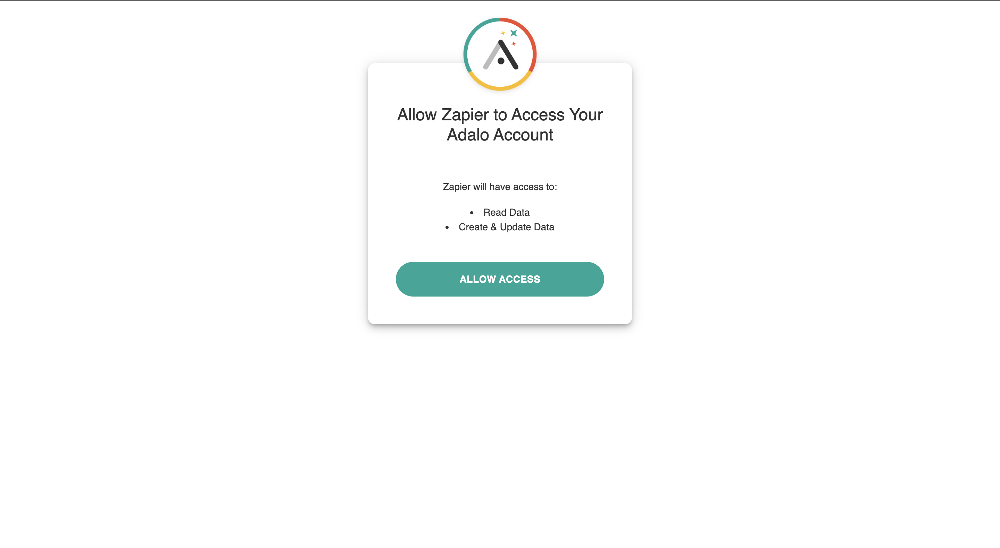


---
- Confirm that your Adalo account has been set up and click "Continue"


---
- Set "ApiIntegrationTrial" in App.
- Set "Users" in Table
- Click "Continue"

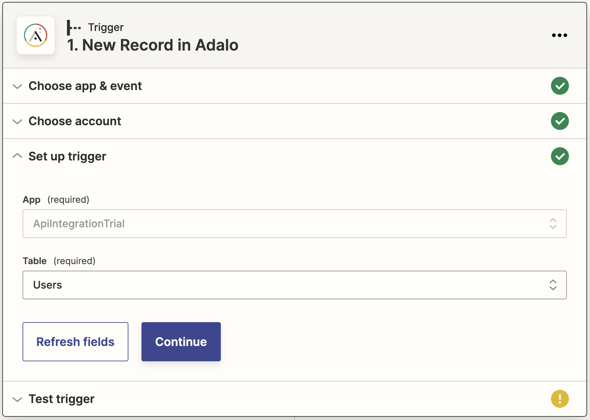


---
- Click "Test trigger" !


---
- Click "Continue" after Zapier found a record


---
- Select Gmail as the App to execute the Action.


---
- Set "Send Email" to "Event".
- Click "Continue


---
- Click "Sign in"


---
- Select the account from which you want the Welcome email to be sent.

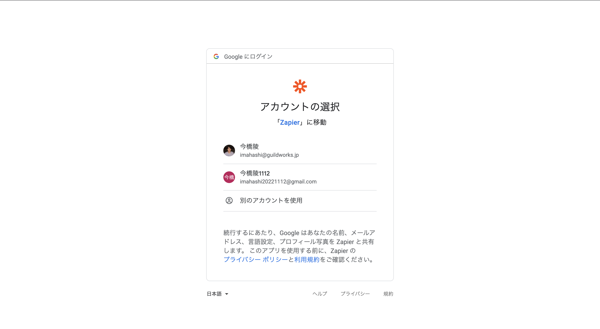

---
- Confirm that the Gmail account is set, and click "Continue".


---
- Set Email in To
- Set your Gmail address in From
- Set your app's name in From Name
- Enter Subject and Body as you like.
- Click "Continue"


---
- If the "to:" address is your real email address, click "Test action" to confirm receipt of the email.
  - If the address is not your real email address, do not click "Test action" (because the email will fail to be sent).
- Click on "Publish Zap"

  !

---
- Click "Publish & Turn On"

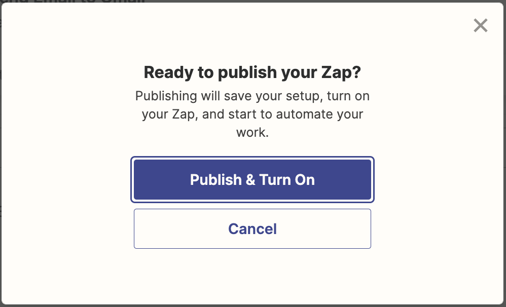

--- 
Let's confirm that Welcome email will be sent in ApiIntegrationTrial app.
- In the Preview function, enter your real email address and Signup


---
You will not receive an email immediately after Signup.
For 14 days, Zap will run every 2 minutes for the free trial period of Zapier's Professional Plan. After that, you will be on the Free Plan and Zap will run every 15 minutes. (Reference: https://zapier.com/app/pricing)


---
You can also manually run a Zap immediately from the Zap listing screen.
- Go to https://zapier.com/app/zaps
- Select the Zap you want to run and click "Run"


---
Two minutes after Signup or after manually running the Zap, you will see that you have received a Welcome email at the email address you signed up with.


---
With Zapier, you can integrate many other services.

When you find something you can't achieve with Adalo alone, it may be good to think about whether you can achieve it by integrating your app with other services.


Reference: [Popular ways to use Adalo workflows](https://zapier.com/apps/adalo/integrations#zap-template-list)


---
That's it for external integration of Adalo.


---
## Team Development with Adalo
Before exercises, let me tell you how to collaborate in Adalo's app development for team development in Development Phase.


---
Adalo has the ability to invite team members as co-editors, but this is only available with a paid plan.
 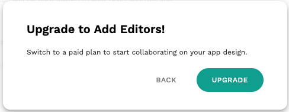

--- 
Therefore, everyone in same team should log in with the same Adalo account to edit same app.
- When you start developing your team's apps on Adalo, create a Google account for your team and sign up for Adalo with that account
 https://accounts.google.com/signup/v2/webcreateaccount?continue=https%3A%2F%2Faccounts.google.com%2FManageAccount%3Fnc%3D1&dsh=S50453738%3A1637917137418951&biz=false&flowName=GlifWebSignIn&flowEntry=SignUp
- Everyone should log in using that email address and password for collaborative editing

---
#### Notes on collaborative editing in Adalo
- Edits made by others will not be reflected on your screen in real time. You need to reload to reflect them.
- If you edit the same screen at the same time, the edits made earlier will be overwritten by the edits made later, and the screen will be in the state of the last person who made the edits.
  - The earlier edits will be undone, even if the edited components are different.
- For Actions, if you add them to the same screen at the same time, only the later one will be saved.
- Database, too, will be overwritten with the state of the last person who edited it if it is edited at the same time.

---
- If you edit on different screens at the same time, both will be saved and you will be fine. When editing, share with your team members which screen you are editing. It is also recommended to decide who is in charge of each screen.
- Before switching the screen to be edited, reload the screen to reflect the latest state (this will prevent you from reverting to the old state when someone else has edited the screen).
- To avoid inadvertently touching other people's screens, it is also recommended that you develop the screens apart from each other on Canvas.
- For the Database, decide on one person to be in charge and let that person update the database.

---
This is it about how to do team development with Adalo.

When you start team development in Development Phase, please check the above notes while actually doing collaborative editing with team members. (Because it is sad to see your work lost :cry: )

---
## Exercises
1. Develop a team member management app with following features.
    - Registration of team members
    - Display of member list
    - Display member details
    - Update member information
    - Delete a member
    - Your original functions
2. Develop new app freely (if there is enough time after exercise 1).

---
At the end of the excersises, each one of you will present the app you made in the exercise.

When the app is ready to use, share the URL on Slack for everyone to see.


---
Reference
- There are a number of Adalo apps available that can be cloned, so you may want to look for one that is similar to what you want to do.
  - App Templates
  https://www.adalo.com/app-templates
  - UI & Functional Kits
  https://www.adalo.com/cloneable-kits

---
Examples of apps that can be cloned
- Event Calendar https://www.adalo.com/cloneables/event-calendar
- SNS follow function https://www.adalo.com/cloneables/follow-function
- Facebook clone https://www.adalo.com/cloneables/facebook-clone
- Blog app https://www.adalo.com/cloneables/minimal-blog-app
- Ecommerce app https://www.adalo.com/cloneables/ecommerce-app

---

# :hourglass_flowing_sand:
# :hourglass_flowing_sand:
# :hourglass_flowing_sand:
# :hourglass:
# :hourglass:
---
#### Presentation of the exercise results
Please present the application that you made in the exercises.

---
## Summary
- In this lecture, you designed a database and made it possible to perform CRUD operations on the database of sample application.
- You learned some of Adalo's features and improved sample app.
- You also learned how to integrate your adalo app with external services.
  - Marketplace 
  - Custom Action(Calling APIs of external services from Adalo)
  - External Collections(function to handle data acquired from APIs of external services as Adalo's collections)

---
- Based on what we've learned so far, I think it's a good idea for teams to think about whether you can create your application using Adalo or not.
- Next time, We will give a lecture about Bubble, a no-code tool. Look forward to it!

---
# That's all!
# Thank you for your hard work!
