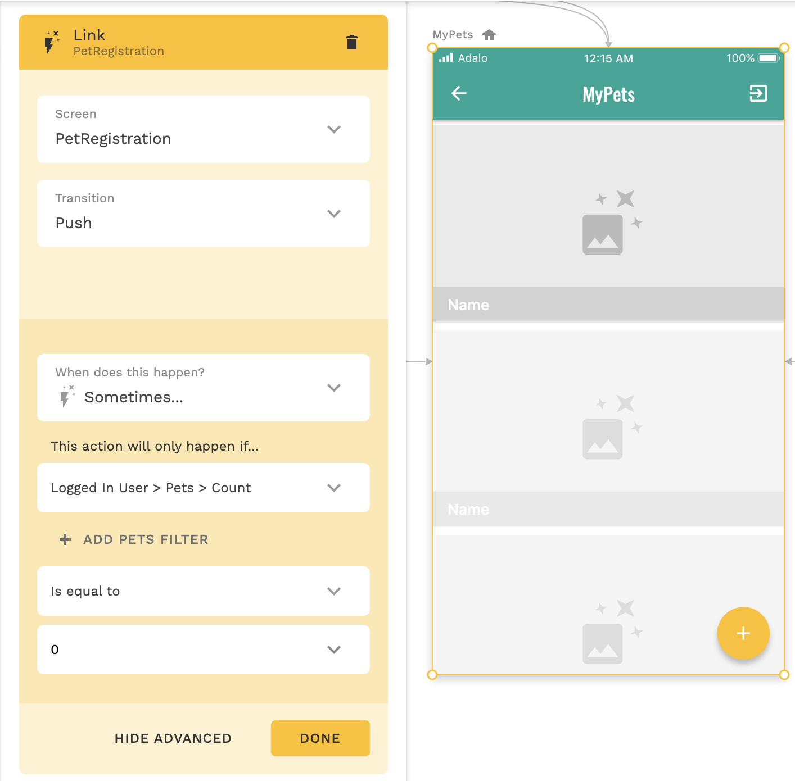

**Programming Boot Camp**

# Adaloでのデータ操作と外部連携

**東京工業大学 2021/11/6**
　
　
　
　
　
　　　　　　　　　　　　　　　　　　　　　　　　**Ryo Imahashi**

<!-- ---
## 参考
- https://nocodo.net/media/media-4553/
- https://note.com/shinya_matsui/n/n05335098aaeb
- [ペットの健康管理アプリ開発ログ](https://www.notion.so/72d6bec451574cadb3d333a1ebc9355c) -->

---
## 目次
  - 前回のふりかえりと今回のゴールの確認
  - データベースについて学ぼう
  - データベース設計
  - データベース操作
  - サンプルアプリを改善しよう
  - 演習
  - まとめ

---
## 前回のふりかえりと今回のゴールの確認
- 前回のレクチャーでは、ノーコードツールのAdaloについて紹介し、ペットの健康管理アプリを題材にアプリのUIを作成しました。
  - レクチャーでは、データベースを必要としない、シンプルなコンポーネントを使いました。(演習の中でデータベースを使った人もいるかもしれません)
- 今回のレクチャーでは、引き続きAdaloを使って、前回作ったUIに合わせたデータベースを構築し、アプリからデータを操作できるようにしていきましょう。 
- その後はサンプルアプリの改善をしながらAdaloの機能を紹介し、最後にチームでのアプリ開発演習と発表をしていただきます。

---
## データベースについて学ぼう
まず、これから学んでいくデータベースがどのようなものかを確認します。

---
#### Database(前回の復習)
- 整理されたデータの集合。
- データの登録、読込(表示)、更新、削除が行われる。
- 例: Chatアプリの場合

<!--  -->


---
- データベースとは、電子的にアクセスされる情報の整理された集合です。
- データベースを使ってユーザーはコンピュータに保存されている情報を作成(CREATE)、読み取り(READ)、更新(UPDATE)、削除(DELETE)することができます。 これらの機能を総称してCRUDと呼びます。
- データベースは、よく「表計算ソフトのようなもの」と例えられます。(実際に、表計算ソフトをデータベースとして使うことも可能です) 

---
#### Adaloのデータベースの基本
 このアイコンでAdaloのデータベースにアクセスできます。
Adaloのデータベースの構成要素は、以下の3つです。
- Collection
- Property
- Record

---
###### Collectionとは
同じ属性(Property)を持ったデータの集まり
 

---
- Collectionは、データベースで扱う様々なデータをデータの種類ごとに分割し、整理するためのものです。(類似の言葉として、「テーブル」があります)
- アプリの中でユーザーが登録、表示、更新、削除といった操作を行うものがCollectionとなります。(「名詞」として表現できるものがCollectionになることが多いと言われます)
- デフォルトでは、UsersがCollectionとして用意されており、それ以外は開発するアプリに合わせて追加していきます。

※ どのようなCollectionを用意するかを決めるのはとても難しいです。練習しながら慣れていきましょう。(悩んだ時は、メンター陣に相談するのもオススメです)

---
###### Propertyとは
- Propertyは、コレクションに含まれる(可能性のある)データが持つ項目です。
- 例えばUsers Collectionでは、Eメール、パスワード、名前、プロフィール写真などのPropertyを持つことが考えられます。


---
<!-- ###### Typeとは -->
- Propertyとして扱うデータがどのようなものかを定義するため、様々なTypeが用意されています。Propertyの追加時にどれか一つを選択します。
  - Text
  - Number
  - True/False
  - Date/Time
  - Date
  - Image
  - File
  - Relationship

---
Relationshipとは
- 1つのレコード(データセット)に対して多数のプロパティを保存する代わりに、Relationshipと呼ばれる複数のコレクションを関連づけるための特別なプロパティを設定します。これにより、Collectionを人間が理解しやすい形で分割することができます。
- AdaloのRelationshipでは、コレクション間でリンクされるレコードの数に応じて、1対多と多対多という2つの種類のいずれかを選択します。 

---
1対多
- 1つのレコードが、別のコレクションにある複数のレコードと関係を持つことを意味します。 
- 表示しているCollectionを1と多のどちらにするかで、2種類の選択肢が現れます。
- 例えば、主催者がイベントに対して1人だけいる場合の、主催者とイベントのRelationshipは1対多です。


<!-- 例えば、1人のユーザーが複数のイベントを主催したり、複数のイベントに1人の主催者がいたりしますが、どちらも真の1対多の関係を表しています。 -->

---
多対多
- 両方のコレクションのレコードが、もう一方のコレクションの複数のレコードにリンクできることを意味します。
- 例えば、参加者は複数のイベントに参加できるし、イベントには複数の参加者がいるという場合の、参加者とイベントのRelationshipは多対多です。

<!-- 例えば、イベントが複数のホストを持ち、ホストが複数のイベントを持つことが可能です。 -->


<!-- ---
「イベントには主催者が1人だけいる」「参加者は複数のイベントに参加できるし、イベントには複数の参加者がいる」と定義するリレーションを作りたいとします。そこで、選択肢を「User」という言葉で読むのではなく、「User」を「Host」という言葉に置き換えることで、どの選択肢を選べばよいのかをより明確にすることができます。この場合は、選択肢1となります。 もし、「参加者」と「イベント」の関係を作るとしたら、あなたはどちらを選びますか？ 実際に試してみてください。
>コレクションのレコードをクリックすると、そのコレクション内のレコードも表示されるので、リレーションシップを含むプロパティは、Adaloのデータベースの列としても視覚化できます。 -->

---
###### Recordとは
- Recordは、コレクション内へ情報を保存する際に1セットとなるデータの組み合わせです。
- Usersの例では、1人のユーザーがコレクション内の1つのレコードとみなされます。


---
- Recordは基本的にアプリの画面上のフォームから登録できるようにしますが、Recordの表示中に右上の「+Add xxxx」ボタンを押して、右の画像のようなフォームから登録することも可能です。
- Collection内のRecordの検索や、CSVファイルのアップロード(インポート)・ダウンロードも可能です。


---
## データベース設計

<!-- ---
TODO: 演習の前に一度テンプレートのアプリを例にデータベース設計の手順を紹介して、一度流れを理解してもらう? -->

前回のレクチャーで作成したサンプルアプリのUIを見ながら、保存が必要なデータを考えて、データベースを設計・構築しましょう。


---
#### 前回のレクチャーで作成したアプリのクローン用URL
- 以下のURLからアプリをクローンしてください。それを使ってここからのレクチャーを進めます。
https://previewer.adalo.com/014fd9d1-80c6-4325-899a-d943e778c865

---
#### データベースを設計してみよう
サンプルアプリのUIを見ながら、データベースを設計してみましょう。手順は次のページで紹介します。


---
###### データベース設計の手順
1. UIを見ながら、保存が必要になるデータをリストアップしましょう。テキストエディタ(メモ帳アプリ等)に書き起こしてください。
2. リストアップしたデータがどのようなCollectionに分類できるかを考えて、Adaloのデータベースに必要なCollectionを作成しましょう。
3. 1でリストアップしたデータを適切なCollectionにPropertyとして追加してください。その際、適切なTypeを選択してください。
4. 他のCollectionと関連を持つCollectionには、Relationship Propertyを設定しましょう。

--- 
※ 次のスライド以降に解説がありますが、答えを見る前に一度自分で手を動かして考えてみることをオススメします。

※ 絶対的な正解はないです。悩んだら、直感に従って進めてみてください。

---
###### 解説
UIを見ながら、保存が必要になるデータをリストアップすると、以下のようになりました。
```
- ユーザーのEmail
- ユーザーのパスワード
- ユーザーのFullName
- ペットの名前
- ペットの写真
- ペットの誕生日
- ペットの体重
- ペットの体重の登録日時
```

- その他のデータを挙げられた人がいれば、教えてください！

<!--  -->

---
リストアップしたデータがどのようなCollectionに分類できるかを考えて、今回はこの3つに分類することにします。
```
- Users
- Pets
- PetWeightLogs
```

- ユーザーのCollectionとペットのCollectionの2つを用意した人は多いのではないでしょうか？
- ペットの体重記録のCollectionは用意しなかった人もいるかもしれません。(ペットの体重とその登録日時をペットのCollectionに含める方法も間違いではないです。後ほど解説します。)
- その他のCollectionの分類をした人はいますか？
<!-- 極論、1Collectionでもやれなくはないよ -->

---
Collectionの分類に関する補足
- 「Aが決まればBが1つに決まる」という関係が成り立つ時、AをCollectionに、BをそのCollectionのPropertyにする場合が多いです。
  - ユーザーが決まれば、ユーザーのEmail、パスワード、FullNameがそれぞれ1つに決まります。
  - ペットが決まれば、ペットの名前、写真、誕生日がそれぞれ1つに決まります。
- 「Aに対してBが複数存在する」という関係が成り立つ時、AとBは別々のCollectionに分割することが多いです。
  - (1匹の)ペットに対して、ペットの体重とその登録日時は複数存在します。

<!-- ※ TODO: 従属性についてわかりやすい言葉で解説 -->
<!-- コツは、関連性の強い複数のデータを一つに決めることができるものを、Collection名にする -->
<!-- ※ Email,パスワード、FullNameは、ユーザーが決まれば一つに決まるので、UsersというCollectionにまとめる。
※ ペットの名前、写真、誕生日は、ペットが決まれば一つに決まるので、PetsというCollectionにまとめる。 -->

<!-- ※ ペットの体重とその登録日時は同時に登録されるため、セットで扱う -->
<!-- ※ ペットの体重とその登録日時は、1匹のペットに対して複数登録されるので、Collectionを分ける(ペットとペットの体重が1対多の関係になる) -->

---
- CollectionをAdaloのデータベースに登録しておきます。
- Usersはデフォルトで作成されています。


---
次に、1でリストアップしたデータを適切なCollectionの配下にPropertyとして追記すると、以下のようになりました。()の中は選択するTypeです。
```
- Users
  - Email(Text)
  - Password(※Password)
  - FullName(Text)
- Pets
  - Name(Text)
  - Image(Image)
  - Birthday(Date)
- PetWeightLogs
  - WeightKg(Number)
  - RegisteredTime(Date&Time)
```
※ Passwordはデフォルトで設定される特殊なTypeです。
<!-- Textを暗号化したものになります。 -->

---
- Adaloで実際にPropertyを追加しましょう。
- Users Collectionはデフォルトで設定済みで、必要な項目は含まれています。
- Usernameは不要ですが、削除できないのでそのままにしておきましょう。


---
- Pets CollectionのPropertyはこのようになります。


---
- PetWeightLogs CollectionのPropertyはこのようになります。
- Collection追加時にデフォルトで設定されるName Propertyは不要なので、削除しましょう。
  - ドラッグアンドドロップで順番がCollection内の一番上でなくなるように移動すれば、削除できます。

<!--  -->


---
最後に、他のCollectionと関連を持つCollectionには、Relationship Propertyを設定しましょう。

- Users Collectionを選択して、Pet Collectionとの1対多のRelationshipを追加します。


---
- Pets Collectionを確認すると、Users Collection側でRelationshipの設定をしたので、自動でUsers CollectionとのRelationshipが追加されています。
  - Users Collection側が1なので、末尾のsが省略されて、Userという Property名になっています。


---
- Pets Collectionに、PetWeightLogs CollectionとのRelationshipを追加しましょう。
  - Pets Collectionを選択して、PetWeightLogs Collectionとの1対多のRelationshipを追加します。


---
PetWeightLogs Collectionを確認すると、Pets Collection側でRelationshipの設定をしたので、自動でPets CollectionとのRelationshipが追加されています。
  - Pets Collection側が1なので、末尾のsが省略されて、Petという Property名になっています。


---
以上がデータベース設計の流れです。

---
参考: Pets Collectionにペットの体重とその登録日時を含めた場合どうなるか

以下のようにレコードが登録される。


---
この場合、少し困ることが出てきます。
- 1匹のペットに対して異なるペットの体重とその登録日時が結合されたRecordが複数登録されるため、ペットの情報が重複して登録されてしまう。
  - 1匹のペットの名前を変更する時には、重複して登録されたそのペットについてのRecordを全て更新しないといけなくなり、処理が複雑になる。
- Adaloには一つのCollectionを選んでそこにRecordを登録するためのフォームを自動生成する便利な機能があるが、データを登録する単位でCollectionが分かれていないので、それが使えなくなる。

---
## データベース操作
設計・構築したデータベースを使って、サンプルアプリでデータのCRUD操作ができるようにしましょう。

---
#### データの作成(CREATE)
まず、作成済みのペット登録画面で実際にペットのレコードを登録できるようにします。


---
- ペット登録画面のREGISTERボタンを選択し、「ADD ANOTHER ACTION」をクリック
- Create > Pet を選択


---
以下を入力してDONE。
- NameはOther ComponentsのInputを選択
- BirthdayはOther ComponentsのDate Pickerを選択
- ImageはOther ComponentsのImage Pickerを選択
- UserはLogged In Userを選択
- PetWeightLogsはEmptyのまま(ペット登録時には不要)


---
Preview機能でペットを登録してみましょう。
Pets CollectionにRecordが登録されたらOKです。


---
次に、ペットの体重管理画面で現在の体重を登録できるようにします。


---
- ペットの体重管理画面でADDボタンを選択し、「ADD ACTION」をクリック
- Create > PetWeightLog を選択


---
以下を入力してDONE。
- WeightKgはOther ComponentsのInputを選択
- WeightRegisteredTimeはDate&Time > Current Timeを選択
- PetはNothing Availableなので、一旦Emptyのままにする
  (後ほど、選択したペットの体重を登録できるように設定します)


---
#### データの表示(READ)
まず、作成済みのペット一覧画面に実際に登録したペットが表示されるようにします。


---
- ペットの画像と名前を表示している2つのコンポーネントを選択し、MAKE LISTをクリック


---
- What is this a list of?でPetsを選択
- FilterでLogged In User > Petsを選択


---
- 作成したListを構成するコンポーネントであるGroupの1つ目をクリック。
- Group内のImageコンポーネント、ペット名のコンポーネントをそれぞれ編集していきます。


---
Imageコンポーネントを編集
- Image Sourceで、Database > Current Pet's > Imageを選択
- If there's no image...でDon`t show anythingを選択
  - あるいは、Show a place holder image を選択して好きな[ペットのシルエット画像](https://www.silhouette-ac.com/category.html?ct=3&sw=%E5%8B%95%E7%89%A9)を設定してもOKです


<!--  -->

---
ペット名のコンポーネントを編集
- Add Magic TextでCurrent Pet's > Nameを選択


---
- Preview機能で確認すると、1匹目のペットとしてデータベースに登録したRecordが表示されます。


---
- ペットのListを構成するコンポーネントの中の2つ目のGroup(固定で表示していた2匹目のペット)は不要なので、削除しましょう

  

---
- Preview機能で確認すると、データベースに登録したペットだけが表示されるようになりました。
  - ペットを追加で登録すれば、複数のペットが表示されます

 

---
ペット一覧でペットをクリックした時に、そのペットの詳細画面に遷移できるようになっていることを確認します。
- ペットのGroupコンポーネントに設定されているLinkのSend This Data to PetDetail ScreenにCurrent Petが自動で設定されています。


---
- ペット一覧画面からのLinkのSend This Data to PetDetail ScreenにCurrent Petが設定されたため、ペット詳細画面のAvailable Data内にLinked Dataとして Current Petが設定されています。
  - これにより、ペット詳細画面でペット一覧画面で選択したペット(Current Pet)を扱えるようになります。


---
次に、ペット詳細画面にペット一覧画面で選択したペットが表示されるようにします。


---
Imageコンポーネントをクリックし、
- Image SourceでDatabase > Current Pet's > Imageを選択
- If there's no image...でDon`t show anythingを選択
  - あるいは、Show a place holder image を選択して好きな[ペットのシルエット画像](https://www.silhouette-ac.com/category.html?ct=3&sw=%E5%8B%95%E7%89%A9)を設定してもOKです
  


---
Birthday Valueコンポーネントをクリックし、
- TextでCurrent Pet's > Birthdayを選択
- Date FormatでNo Formattingを選択


---
- Latest Weight Valueコンポーネントをクリックし、MAKE LISTでリストにする

※ 最新の1件を表示するためには、そのコンポーネントをListにします
(次のページの設定で、最新の1件に絞り込みます)


---
- What is this a list of?でPetWeightLogsを選択
- Filterで Current Pet > PetWeightLogsを選択
- SortingでWeightRegisteredTime - Newest to Oldestを選択
- Maximum number of itemsに1を設定

これにより、最新の1件だけに絞り込まれます。


---
- Latest Weight Valueコンポーネントをクリックし、Textの"kg"の前にCurrent PetWeightLog's > WeightKgを追加する


---
ペット詳細画面からペットの体重管理画面に遷移する際に選択したペットが受け渡せることを確認します。
- Weight Logというリンクのコンポーネントを選択し、LinkのSend This Data to PetDetail ScreenにCurrent Petが自動で設定されています。


---
ペットの体重管理画面で選択したペットの体重をデータベースに登録できるようにします。
- ADDボタンを選択し、CreateのActionで一旦EmptyのままにしていたPetにCurrent Petを設定


---
ペット詳細画面、ペットの体重管理画面に選択したペットの名前を表示しましょう。それぞれの画面で、
- 画面上部のApp Barコンポーネントを選択し、TitleのTextに Current Pet's > Name を追加
- その後ろに、's という文字列を追加


---
Preview機能で、以下を確認しましょう。
- ペット一覧画面から選択したペットの詳細画面に遷移できること
- ペット詳細画面から選択したペットの体重管理画面に遷移できること
- ペットの体重を登録すると、データベースのPetWeightLogs CollectionにRecordが登録されること
- ペット詳細画面に最新の体重が表示されること


---
次に、ペットの体重管理画面で過去に登録したペットの体重がグラフとして表示されるようにします。
- まず、画像で貼り付けていたグラフを削除


---
- ADD COMPONENTからEXPLORE MARKETPLACEを選択
- Chart KitをINSTALL

　

---
- Line Chartを画面に追加


---
Line Chartを設定します。
- What is this a chart of?でPetWEightLogsを選択
- FilterでCurrent Pet > PetWeightLogsを選択
- Custom Filterに WeightRegisteredTime Is after 30 days ago を設定
- SortingでWeightRegisteredTime - Oldest to Newestを選択


---
- X Axis ValueにPetWeightLog > WeightRegisteredTimeを設定
  - Date FormatにDate / Timeを設定
- Y Axis ValueにPetWeightLog > WeightKgを設定


---
Preview機能でグラフの表示を確認しましょう。
- 体重を複数追加すると、グラフが描画されます。

※ 体重の登録日時が省略されてしまいます。同じ日に複数の体重を登録してテストをしたかったのでDate&Time型にしていますが、本来はDate型にして、1日に1回しか登録できないよう制御する方が良さそうです。
<!-- 、連続で異なる体重を追加するとLineが上下に伸びてしまう -->
<!--  -->


<!-- X軸、Y軸のラベルも設定できるよ -->
---
#### データの更新(UPDATE)
登録したペットのデータを更新できるペット情報編集画面を新たに作ります。


---
- ADD COMPONENTからAction Buttonを追加
- Iconをeditに変更
- Icon and Text ColorをDefault Background(white)に変更


---
- ADD ACTIONからLink > New Screenを選択


---
- Screen Nameを入力
- Formを選択
- CREATE SCREENをクリック


---
以下の設定をするだけでペット情報編集画面は完成です。
- Which data collection?でPetsを選択
  - 選択したCollectionに合わせたフォームを自動生成してくれる
- What do you want the form to do?でUpdate Current Petを選択
- FieldsでBirthdayとImageの順番を入れ替え


<!-- 更新不要な項目があれば、その入力箇所は削除できそう -->

---
Preview機能でペット情報編集画面が使えることを確認しましょう。


---
補足
- 前回はペット登録画面の入力フォームをコンポーネントを一つずつ追加して作成しましたが、ペット編集画面を作ったのと同様の手順で自動生成できます。
- ペット登録画面のAppBar以外のコンポーネントを削除して、Formコンポーネントを追加し、Pet Collectionを指定してフォームを自動生成してみましょう。
  - 登録後のペット一覧画面への遷移だけは、手動でSubmit ButtonにActionを追加する必要があります。

---
- Formコンポーネントを使えば、FieldのReguired Error Textにチェックを入れるだけで必須項目が入力されているかどうかをチェックすることができます。
- フォームを作る際は、できるだけFormコンポーネントを使いましょう。


---
参考: 実際のアプリ開発の流れについて
- サンプルアプリでは、UI作成->データベース作成->それらの連携という流れで作成を進めました
  - どのような画面かがイメージできていないと、それに必要なデータが分からず、データベースの設計も難しいと考えたため、このようなレクチャーの流れにしています
- 今後Adaloを使ってアプリ開発をする際は、必要なデータが分かっているのであれば、先にデータベースの設計・構築を行うことをオススメします。それによって、UIの作成も自動生成を活用しながら簡単に行うことができます。
  - とはいえ、実際の開発は一方的な流れではなく、試行錯誤してデータベースとUIを行ったり来たりすることになります。

---
#### データの削除(DELETE)
ペット詳細画面に、登録したペットを削除できるボタンを作ります。

---
<!-- ---
- ADD COMPONENTからIconを選択し、AppBarの右側に配置
- Iconをdeleteに変更
- ColorをDefault Background(White)に変更
- Sizeを調整


---
- ADD ACTIONからDelete > Current Petを選択
 -->

- App Barを選択し、Right Icon 1のトグルをONにする
- Iconをdeleteに変更
- ADD ACTIONからDelete > Current Petを選択
- ADD ANOTHER ACTIONからLink > Mypetsを選択


---
Preview機能で削除を試してみましょう。


削除が完了してペット一覧画面に遷移すると、削除したペットは表示されません。


---
以上で、データベースに対するCRUD操作(CREATE, READ, UPDATE, DELETE)を全種類実装することができました。

---
## サンプルアプリを改善しよう
まだ紹介していないAdaloの機能を使いながら、サンプルアプリを改善していきます。

<!-- バリデーション(必須チェック)はUPDATEのとこでやったのでOK -->
<!-- Notificationは試したけどネイティブアプリでないと動かないみたいだったので、割愛 -->
<!-- TODO: ペットの登録が0匹の時に登録を促すメッセージを表示させる方法の紹介
 -->
<!-- - Share機能はスマホでないと動作しないので、割愛 -->
<!-- Change Input Valueもあまり使い道がなさそうなので割愛。連続で登録するときとかにフォームをクリアするのに使える？ https://qwerty.work/blog/2021/06/adalo-form-cache-clear.php#toc0-->

---
#### ログアウト
- ペット一覧画面のAppBarを選択し、Right Icon 1を有効化
- Iconをexit_to_appに変更する
- ADD ACTION > More... > User Login > Log Outを選択
- ADD ANOTHER ACTION > Link > Loginを選択


---
Preview機能で確認しましょう。
追加したアイコンをクリックするとログアウトし、ログイン画面に遷移するようになりました。

----
#### Actionの実行条件設定
ペットが未登録の場合にペット一覧画面を表示したらペット登録画面へ遷移させます。
- ペット一覧画面でActions > ADD ACTION > Link > Pet Registrationを選択
- SHOW ADVANCEDをクリックし、When does this happen?をSometimesに変更


---
- This action will only happen if...でMore > Logged In User's > Pets' > Count を選択
- Is equal to の下の数値を0に変更


---
Preview機能で確認しましょう。
新しいユーザーでSignupすると、ペット一覧画面からペット登録画面に遷移します。

---
#### 選択式入力フォーム
ペットの情報に性別を追加し、入力フォームで選択式入力ができるようにします。

---
- データベースにGenders Collectionを追加
- 0 Records > ADD GENDERとクリックし、MaleとFemaleの2つのRecordを追加


---
- Genders CollectionにPets Collectionとの1対多のRelationshipを追加する


---
- ペット登録画面のフォームを選択
- Fields > ADD VISIBLE FIELD > Genderを選択


---
- ペット詳細画面に性別の表示欄を追加


---
Preview機能で確認しましょう。

- ペット登録画面で性別が選択できます。
- 選択した値がペット詳細画面に表示されます。


---
- 性別を選択できるようになる前に登録したペットについては、Pet CollectionのRecordを表示してそのペットをクリックし、性別を手動で設定しておきます。


---
参考

複数選択式の入力フォームは、MarketplaceのMultiselectDropdownを使って作れます。

必要になったら、試してみてください。


---
#### コンポーネントの非表示設定
表示しないコンポーネントを削除せずに残しておくことができます。
- ペット詳細画面のコンポーネント一覧で、Link 2を含むGroupにマウスオーバーして、右側の目のアイコンをクリック


---
Preview機能で確認すると、Link 2が消えています。

もう一度目のアイコンをクリックすれば、再度表示させられます。


---
#### 条件によってコンポーネントの表示or非表示を切り替える
体重が未登録であれば、ペット詳細画面のLatest Weightは非表示にします。


---
- Latest Weightというラベルとその値を選択し、グループ化します


---
- Change Visibilityを選択します


---
- VisibilityをSometimes Visibleに変更
- Will be visible if...でCurrent Pet > PetWeightLogs > Countを選択
- Is not equal to 0と設定


---
Preview機能で確認すると、体重が未登録なペットのペット詳細画面では、Latest Weightが非表示になりました。


サンプルアプリの改善は一旦ここまでとします。

---
#### クローン用URL
- 以下のURLからここまでの作業を反映したアプリをクローンできますので、答え合わせに使ってください。
https://previewer.adalo.com/f1324ea8-ec47-4c22-a3a9-3258044eb754


---
## 演習
Development Phaseのチームメンバーと一緒に新規のアプリを開発してください。作るアプリは自由に決めてOKです。

作るアプリが決まらないチームは、チームメンバー紹介アプリ(メンバー情報のCRUDができるもの)にしましょう。

※ 今日のレクチャーにチームメンバーが参加していない場合は、新しくチームを組んでもOKです。
※ 最後は全チームに発表していただきます。
※ アプリが使えるようになったら、SlackでURLを共有して、みなさんに見てもらいましょう。

<!-- - 他のテンプレートアプリの画面を見ながらデータベース設計をしてみる -->
<!-- - サンプルアプリに画面を追加し、必要なCollectionやPropertyをデータベースに追加する -->


---
#### 演習についての補足
- チームメンバーと一つのアプリを共同編集するには、Settings > AppAccess > Add Team Member > Invite New Team Memberを選択してチームメンバーのメールアドレスを入力しましょう。


---
※ 他のメンバーと同時に一つのアプリを編集する際、他の人が行った編集は自分の画面にリアルタイムで反映されません。(リロードが必要なようです)

※ 同時に複数人が同じ画面を編集すると、先に行われた編集が後から行われた編集に上書きされてしまいます。それぞれが別の画面を編集するか、みんなで同じPCを見ながら一緒に編集しましょう。

---
参考
- クローンできるアプリが公開されているので、やりたいことに近いものがないか探してみると良いかもしれません。
  - App Templates
  https://www.adalo.com/app-templates
  - UI & Functional Kits
  https://www.adalo.com/cloneable-kits

---
クローンできるアプリの例
- Eventカレンダー https://www.adalo.com/cloneables/event-calendar
- スワイプで回答するクイズ https://www.adalo.com/cloneables/quiz-app
- SNSのフォロー機能 https://www.adalo.com/cloneables/follow-function
- Facebookのクローン https://www.adalo.com/cloneables/facebook-clone
- ブログアプリ https://www.adalo.com/cloneables/minimal-blog-app
- 商品販売アプリ https://www.adalo.com/cloneables/ecommerce-app

---
参考
- Adaloだけで実現できないことがある場合、外部サービスと連携することでそれを実現できるかもしれません。
- Zapierというサービスを使えば、案内に従って操作することで、簡単にAdaloと外部サービスを連携させられます。興味があれば、試してみてください。
  https://zapier.com/apps/adalo/integrations

---
ZapierでAdaloと連携させることが可能な外部サービスの例
- Google Spreadsheet
- Google Calender
- Slack
- Zoom
- Twitter
- Instagram
- Spotify
- Bubble
- Google Meet
- Strava

---
#### 演習結果の発表
チームごとに演習で作ったアプリについて発表してください。

---
## まとめ
- 今回のレクチャーでは、データベースを設計・構築し、アプリからそのデータベースに対してCRUD操作を行えるようにしました。
- また、それ以外にも、アプリの改善に役立つAdaloの機能をいくつか紹介しました。
- 以下のような、外部サービスとの連携に関するAdaloの機能はまだ紹介していないので、5回目のレクチャーかDevelopmentPhaseで時間が取れたら、改めて紹介したいと思います。
  - Custom Action(Adaloから外部サービスのAPIを呼び出す機能)
  - External Collections(外部サービスのAPIから取得したデータをAdaloのコレクションとして扱う機能)

---
# 以上です！
# お疲れさまでした！

