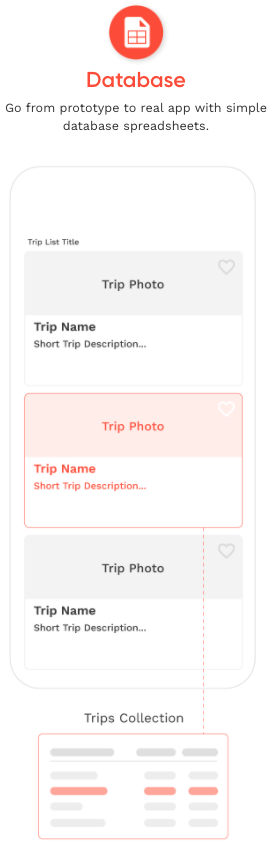
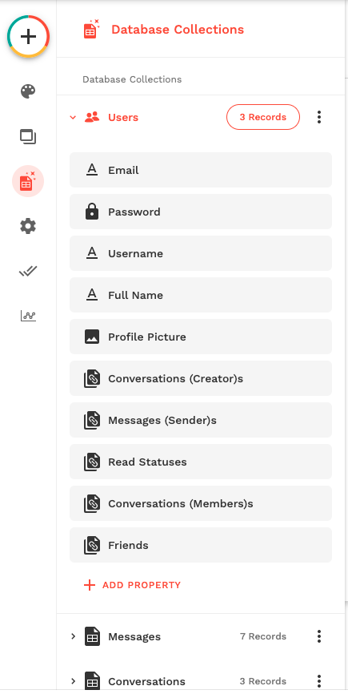
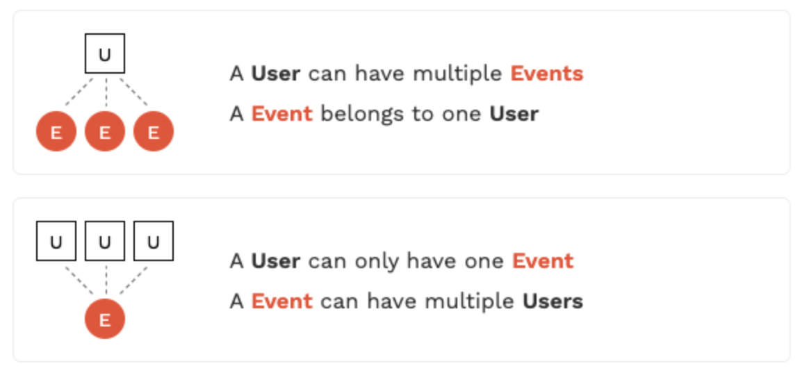
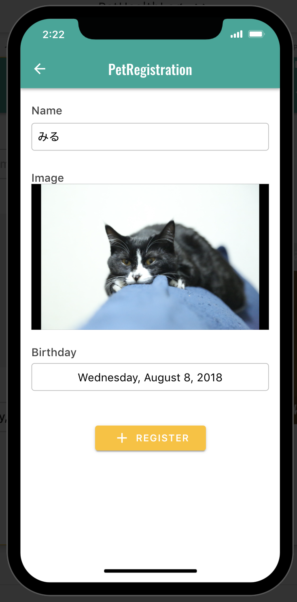
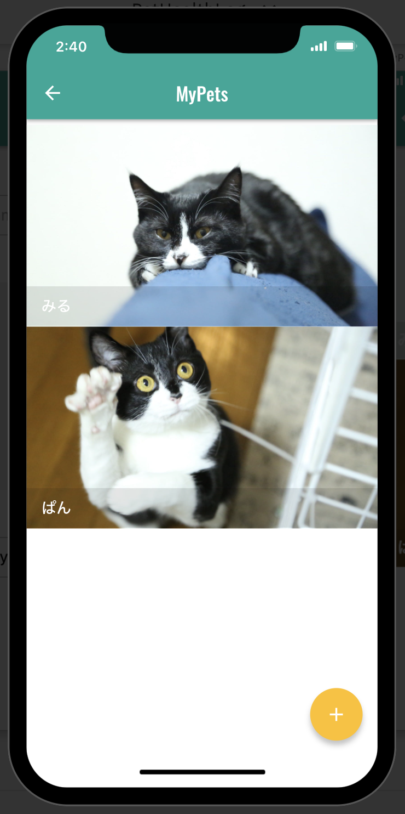
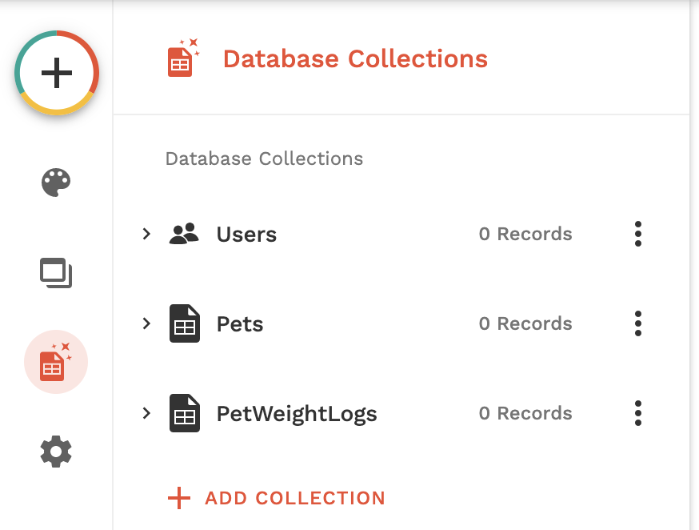
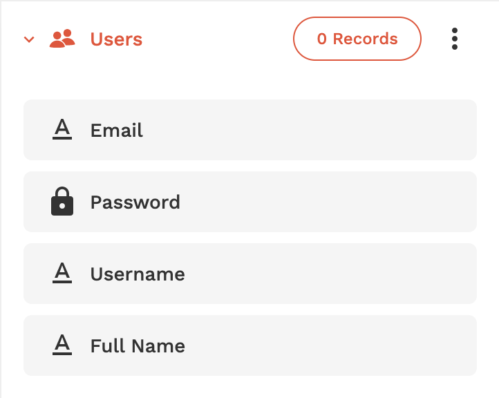
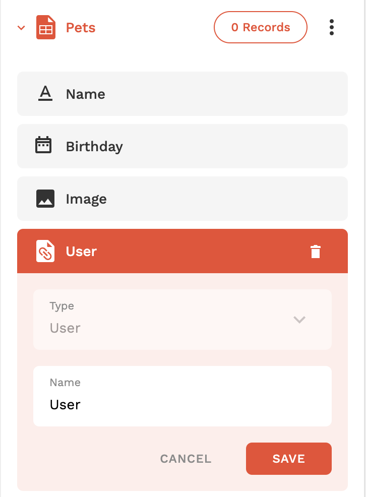
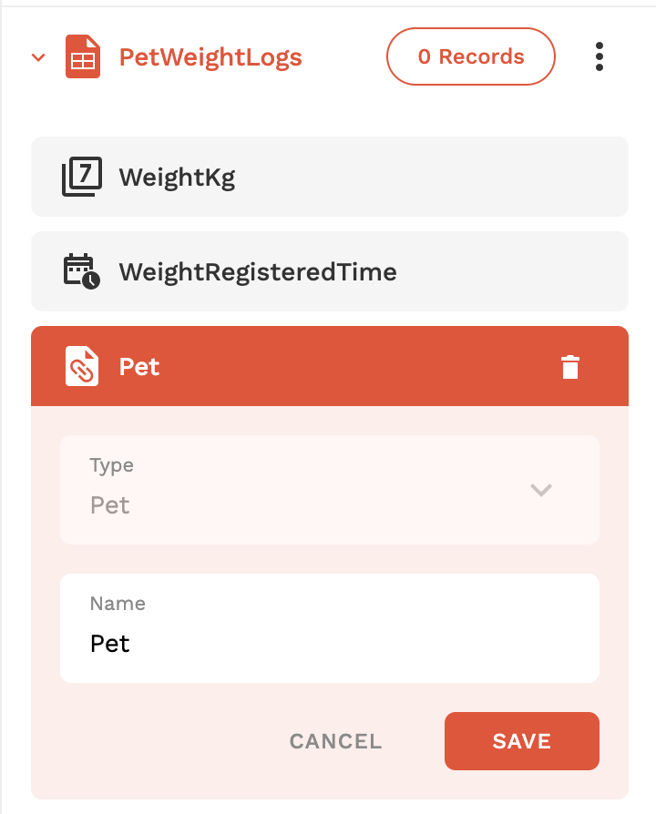
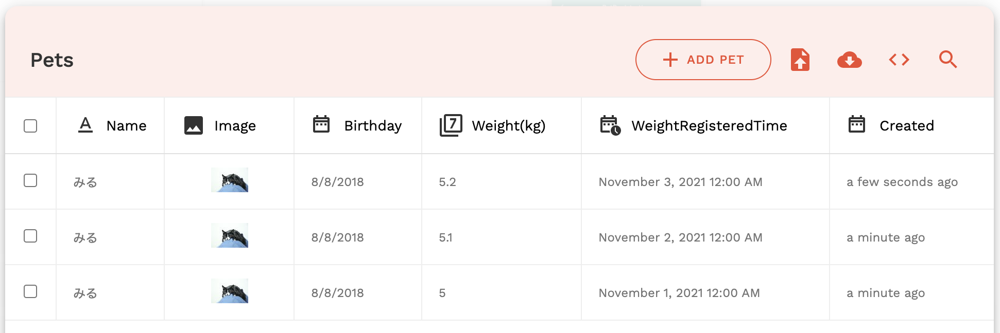

**Programming Boot Camp**

# Adaloでのデータ操作と外部連携

**東京工業大学 2021/11/6**
　
　
　
　
　
　　　　　　　　　　　　　　　　　　　　　　　　**Ryo Imahashi**

<!-- ---
## 参考
- https://nocodo.net/media/media-4553/
- https://note.com/shinya_matsui/n/n05335098aaeb
- [ペットの健康管理アプリ開発ログ](https://www.notion.so/72d6bec451574cadb3d333a1ebc9355c) -->

---
## 目次
  - 前回のふりかえりと今回のゴールの確認
  - データベースについて学ぼう
  - データベース設計
  - データベース操作
  - サンプルアプリを完成させよう
  - 外部サービス連携
  - 演習
  - まとめ

---
## 前回のふりかえりと今回のゴールの確認
- 前回のレクチャーでは、ノーコードツールのAdaloについて紹介し、ペットの健康管理アプリを題材にアプリのUIを作成しました。
  - レクチャーでは、データベースを必要としない、シンプルなコンポーネントを使いました。(演習の中でデータベースを使った人もいるかもしれません)
- 今回のレクチャーでは、引き続きAdaloを使って、前回作ったUIに合わせたデータベースを構築し、アプリからデータを操作できるようにしていきましょう。 
- その後は、Adaloだけでは実現できないことを、Adaloと外部のサービスを連携させることで実現する方法をいくつかご紹介します。


---
## データベースについて学ぼう
まず、これから学んでいくデータベースがどのようなものかを確認します。

---
#### Database(前回の復習)
- 整理されたデータの集合。
- データの登録、読込(表示)、更新、削除が行われる。
- 例: Chatアプリの場合

<!--  -->


---
- データベースとは、電子的にアクセスされる情報の整理された集合です。
- データベースを使ってユーザーはコンピュータに保存されている情報を作成(CREATE)、読み取り(READ)、更新(UPDATE)、削除(DELETE)することができます。 これらの機能を総称してCRUDと呼びます。
- データベースは、よく「表計算ソフトのようなもの」と例えられます。(実際に、表計算ソフトをデータベースとして使うことも可能です) 

---
#### Adaloのデータベースの基本
 このアイコンでAdaloのデータベースにアクセスできます。
Adaloのデータベースの構成要素は、以下の3つです。
- Collection
- Property
- Record

---
###### Collectionとは
同じ属性(Property)を持ったデータの集まり
 

---
- Collectionは、データベースで扱う様々なデータをデータの種類ごとに分割し、整理するためのものです。(類似の言葉として、「テーブル」があります)
- アプリの中でユーザーが登録、表示、更新、削除といった操作を行うものがCollectionとなります。(「名詞」として表現できるものがCollectionになることが多いと言われます)
- デフォルトでは、UsersがCollectionとして用意されており、それ以外は開発するアプリに合わせて追加していきます。

※ どのようなCollectionを用意するかを決めるのはとても難しいです。練習しながら慣れていきましょう。(悩んだ時は、メンター陣に相談するのもオススメです)

---
###### Propertyとは
- Propertyは、コレクションに含まれる(可能性のある)データが持つ項目です。
- 例えばUsers Collectionでは、Eメール、パスワード、名前、プロフィール写真などのPropertyを持つことが考えられます。


---
<!-- ###### Typeとは -->
- Propertyとして扱うデータがどのようなものかを定義するため、様々なTypeが用意されています。Propertyの追加時にどれか一つを選択します。
  - Text
  - Number
  - True/False
  - Date/Time
  - Date
  - Image
  - File
  - Relationship

---
Relationshipとは
- 1つのレコード(データセット)に対して多数のプロパティを保存する代わりに、Relationshipと呼ばれる複数のコレクションを関連づけるための特別なプロパティを設定します。これにより、Collectionを人間が理解しやすい形で分割することができます。
- AdaloのRelationshipでは、コレクション間でリンクされるレコードの数に応じて、1対多と多対多という2つの種類のいずれかを選択します。 

---
1対多
- 1つのレコードが、別のコレクションにある複数のレコードと関係を持つことを意味します。 
- 表示しているCollectionを1と多のどちらにするかで、2種類の選択肢が現れます。
- 例えば、主催者がイベントに対して1人だけいる場合の、主催者とイベントのRelationshipは1対多です。



<!-- 例えば、1人のユーザーが複数のイベントを主催したり、複数のイベントに1人の主催者がいたりしますが、どちらも真の1対多の関係を表しています。 -->

---
多対多
- 両方のコレクションのレコードが、もう一方のコレクションの複数のレコードにリンクできることを意味します。
- 例えば、参加者は複数のイベントに参加できるし、イベントには複数の参加者がいるという場合の、参加者とイベントのRelationshipは多対多です。

<!-- 例えば、イベントが複数のホストを持ち、ホストが複数のイベントを持つことが可能です。 -->


<!-- ---
「イベントには主催者が1人だけいる」「参加者は複数のイベントに参加できるし、イベントには複数の参加者がいる」と定義するリレーションを作りたいとします。そこで、選択肢を「User」という言葉で読むのではなく、「User」を「Host」という言葉に置き換えることで、どの選択肢を選べばよいのかをより明確にすることができます。この場合は、選択肢1となります。 もし、「参加者」と「イベント」の関係を作るとしたら、あなたはどちらを選びますか？ 実際に試してみてください。
>コレクションのレコードをクリックすると、そのコレクション内のレコードも表示されるので、リレーションシップを含むプロパティは、Adaloのデータベースの列としても視覚化できます。 -->

---
###### Recordとは
- Recordは、コレクション内へ情報を保存する際に1セットとなるデータの組み合わせです。
- Usersの例では、1人のユーザーがコレクション内の1つのレコードとみなされます。


---
- Recordは基本的にアプリの画面上のフォームから登録できるようにしますが、Recordの表示中に右上の「+Add xxxx」ボタンを押して、右の画像のようなフォームから登録することも可能です。
- Collection内のRecordの検索や、CSVファイルのアップロード(インポート)・ダウンロードも可能です。


---
## データベース設計

<!-- ---
TODO: 演習の前に一度テンプレートのアプリを例にデータベース設計の手順を紹介して、一度流れを理解してもらう? -->

前回のレクチャーで作成したサンプルアプリのUIを見ながら、保存が必要なデータを考えて、データベースを設計・構築しましょう。


---
#### 前回のレクチャーで作成したアプリのクローン用URL
- 以下のURLからアプリをクローンしてください。それを使ってここからのレクチャーを進めます。
https://previewer.adalo.com/014fd9d1-80c6-4325-899a-d943e778c865

---
#### データベースを設計してみよう
サンプルアプリのUIを見ながら、データベースを設計してみましょう。手順は次のページで紹介します。


---
###### データベース設計の手順
1. UIを見ながら、保存が必要になるデータをリストアップしましょう。テキストエディタ(メモ帳アプリ等)に書き起こしてください。
2. リストアップしたデータがどのようなCollectionに分類できるかを考えて、Adaloのデータベースに必要なCollectionを作成しましょう。
3. 1でリストアップしたデータを適切なCollectionにPropertyとして追加してください。その際、適切なTypeを選択してください。
4. 他のCollectionと関連を持つCollectionには、Relationship Propertyを設定しましょう。

--- 
※ 次のスライド以降に解説がありますが、答えを見る前に一度自分で手を動かして考えてみることをオススメします。

※ 絶対的な正解はないです。悩んだら、直感に従って進めてみてください。

---
###### 解説
UIを見ながら、保存が必要になるデータをリストアップすると、以下のようになりました。
```
- ユーザーのEmail
- ユーザーのパスワード
- ユーザーのFullName
- ペットの名前
- ペットの写真
- ペットの誕生日
- ペットの体重
- ペットの体重の登録日時
```

- その他のデータを挙げられた人がいれば、教えてください！

<!--  -->

---
リストアップしたデータがどのようなCollectionに分類できるかを考えて、今回はこの3つに分類することにします。
```
- Users
- Pets
- PetWeightLogs
```

- ユーザーのCollectionとペットのCollectionの2つを用意した人は多いのではないでしょうか？
- ペットの体重記録のCollectionは用意しなかった人もいるかもしれません。(ペットの体重とその登録日時をペットのCollectionに含める方法も間違いではないです。後ほど解説します。)
- その他のCollectionの分類をした人はいますか？
<!-- 極論、1Collectionでもやれなくはないよ -->

---
Collectionの分類に関する補足
- 「Aが決まればBが1つに決まる」という関係が成り立つ時、AをCollectionに、BをそのCollectionのPropertyにする場合が多いです。
  - ユーザーが決まれば、ユーザーのEmail、パスワード、FullNameがそれぞれ1つに決まります。
  - ペットが決まれば、ペットの名前、写真、誕生日がそれぞれ1つに決まります。
- 「Aに対してBが複数存在する」という関係が成り立つ時、AとBは別々のCollectionに分割することが多いです。
  - (1匹の)ペットに対して、ペットの体重とその登録日時は複数存在します。

<!-- ※ TODO: 従属性についてわかりやすい言葉で解説 -->
<!-- コツは、関連性の強い複数のデータを一つに決めることができるものを、Collection名にする -->
<!-- ※ Email,パスワード、FullNameは、ユーザーが決まれば一つに決まるので、UsersというCollectionにまとめる。
※ ペットの名前、写真、誕生日は、ペットが決まれば一つに決まるので、PetsというCollectionにまとめる。 -->

<!-- ※ ペットの体重とその登録日時は同時に登録されるため、セットで扱う -->
<!-- ※ ペットの体重とその登録日時は、1匹のペットに対して複数登録されるので、Collectionを分ける(ペットとペットの体重が1対多の関係になる) -->

---
- CollectionをAdaloのデータベースに登録しておきます。
- Usersはデフォルトで作成されています。


---
次に、1でリストアップしたデータを適切なCollectionの配下にPropertyとして追記すると、以下のようになりました。()の中は選択するTypeです。
```
- Users
  - Email(Text)
  - Password(※Password)
  - FullName(Text)
- Pets
  - Name(Text)
  - Image(Image)
  - Birthday(Date)
- PetWeightLogs
  - WeightKg(Number)
  - RegisteredTime(Date&Time)
```
※ Passwordはデフォルトで設定される特殊なTypeです。
<!-- Textを暗号化したものになります。 -->

---
- Adaloで実際にPropertyを追加しましょう。
- Users Collectionはデフォルトで設定済みで、必要な項目は含まれています。
- Usernameは不要ですが、削除できないのでそのままにしておきましょう。


---
- Pets CollectionのPropertyはこのようになります。


---
- PetWeightLogs CollectionのPropertyはこのようになります。
- Collection追加時にデフォルトで設定されるName Propertyは不要なので、削除しましょう。
  - ドラッグアンドドロップで順番がCollection内の一番上でなくなるように移動すれば、削除できます。

<!--  -->


---
最後に、他のCollectionと関連を持つCollectionには、Relationship Propertyを設定しましょう。

- Users Collectionを選択して、Pet Collectionとの1対多のRelationshipを追加します。


---
- Pets Collectionを確認すると、Users Collection側でRelationshipの設定をしたので、自動でUsers CollectionとのRelationshipが追加されています。
  - Users Collection側が1なので、末尾のsが省略されて、Userという Property名になっています。



---
- Pets Collectionに、PetWeightLogs CollectionとのRelationshipを追加しましょう。
  - Pets Collectionを選択して、PetWeightLogs Collectionとの1対多のRelationshipを追加します。


---
PetWeightLogs Collectionを確認すると、Pets Collection側でRelationshipの設定をしたので、自動でPets CollectionとのRelationshipが追加されています。
  - Pets Collection側が1なので、末尾のsが省略されて、Petという Property名になっています。



---
以上がデータベース設計の流れです。

---
参考: Pets Collectionにペットの体重とその登録日時を含めた場合どうなるか

以下のようにレコードが登録される。


---
この場合、少し困ることが出てきます。
- 1匹のペットに対して異なるペットの体重とその登録日時が結合されたRecordが複数登録されるため、ペットの情報が重複して登録されてしまう。
  - 1匹のペットの名前を変更する時には、重複して登録されたそのペットについてのRecordを全て更新しないといけなくなり、処理が複雑になる。
- Adaloには一つのCollectionを選んでそこにRecordを登録するためのフォームを自動生成する便利な機能があるが、データを登録する単位でCollectionが分かれていないので、それが使えなくなる。

---
## データベース操作
設計・構築したデータベースを使って、サンプルアプリでデータを操作できるようにしましょう。

---
#### データの作成(CREATE)
まず、作成済みのペット登録画面で実際にペットのレコードを登録できるようにします。


---

---
次に、ペットの体重管理画面で現在の体重を登録できるようにします。


---


---
#### データの表示(READ)
まず、作成済みのペット一覧画面に実際に登録したペットが表示されるようにします。


---

---
次に、作成済みのペット詳細画面に、ペット一覧画面で選択したペットが表示されるようにします。


---

---
次に、ペットの体重管理画面で過去に登録したペットの体重がグラフとして表示されるようにします。


---


---
#### データの更新(UPDATE)
登録したデータをペットのデータを更新できるペット編集画面を新たに作ります。

---
TODO: Pet Collectionの編集フォームをFormコンポーネントで自動生成
TODO: 更新不要な項目があれば、その入力箇所は削除できる？

---
補足
- 前回はペット登録画面の入力フォームをコンポーネントを一つずつ追加して作成しましたが、ペット編集画面を作ったのと同様の手順で自動生成できます。
- ペット登録画面のコンポーネントを全て削除して、入力フォームをPet Collectionから自動生成してみてください。

---
参考: 実際のアプリ開発の流れについて
- サンプルアプリでは、UI作成->データベース作成->それらの連携という流れで作成を進めました
  - どのような画面かがイメージできていないと、それに必要なデータが分からず、データベースの設計も難しいと考えたため、このようなレクチャーの流れにしています
- 今後Adaloを使ってアプリ開発をする際は、必要なデータが分かっているのであれば、先にデータベースの設計・構築を行うことをオススメします。それによって、UIの作成も簡単に行うことができます。
  - とはいえ、実際の開発は一方的な流れではなく、試行錯誤してデータベースとUIを行ったり来たりすることになります。

---
---
#### データの削除(DELETE)
ペット詳細画面に、登録したペットを削除できるボタンを作りましょう。


---

---
次に、ペット編集画面で画像を削除できるようにしましょう。

TODO: 画像

---

---
参考
画像がない場合に表示される、デフォルトの画像を設定できます。
TODO: やり方紹介


---
## サンプルアプリを完成させよう
- Actionの紹介
  - 通知(ペットの登録が0匹の時に登録を促すメッセージを表示させる)
  - バリデーション(必須チェックくらい？)
  - TODO: その他のAction
- Tips
---
TODO: 通知(ペット0匹通知)の紹介


---
TODO: バリデーションの紹介
- 必須チェック
- 他はテキストとVisibilityを駆使するとのこと。デフォルトのフォームでやれないのはとても面倒。。
https://note.com/uramot/n/n035bc528aefc

---
TODO: Tipsの紹介
- Auto Refleshオプション
- 最新のn件だけ表示
TODO: 追加


---
#### クローン用URL
- 以下のURLから完成したアプリをクローンできますので、答え合わせに使ってください
TODO: URL貼り付け


---
## 外部サービス連携
TODO
- Zapier紹介
  - Slack連携?
  - Google Spreadsheet or Firestoreとの連携でレコード上限50件を回避させる？(せっかくAdaloのデータベースを学んだのに...というところはある)
  - Twitter or Instagram連携?

---
## 演習
どれでも好きなものにチャレンジしてみてください。
TODO: お題を設定してチーム演習
TODO: チームメンバーのアプリ編集への招待方法を紹介
TODO: 同時編集での注意点について紹介(リアルタイムで他の人の編集は反映されません。同じ画面を編集すると上書きされてしまうので、別の画面を編集しましょう。上書きが恐ければ、みんなで同じ画面を見ながら一緒に操作しましょう。)

- 他のテンプレートアプリの画面を見ながらデータベース設計をしてみる
- サンプルアプリに画面を追加し、必要なCollectionやPropertyをデータベースに追加する
- 好きなアプリを新しく作成する
- 最後は全員

できたらSlackでURLを共有して、みなさんに見てもらいましょう


---
#### 演習結果の発表
(時間があれば)

演習で作った画面を紹介してみませんか？

---
## まとめ
- 

---
# 以上です！
# お疲れさまでした！

