**Programming Boot Camp**

# Bubble Basics

**東京工業大学 2021/11/13**
　
　
　
　
　
　　　　　　　　　　　　　　　　　　　**Naotake KYOGOKU**

---

## Table of Contents
  - What is Bubble?
  - Registering with Bubble
  - Overview of Application Development with Bubble
  - Let's Start with Pet Registration and List Display
  - Let's Make a Pet Detail Screen
  - Let's manage your pet's weight
  - Summary

---

What is ## Bubble?
- [Bubble](https://bubble.io/) is a visual programming tool, which means it is a no-code tool, but it requires a programming mindset.
- It is a no-code tool, but it requires programming ideas.
- However, the part where you can add movement to the placed parts requires programming ideas.
- Also, unlike Adalo, this application is developed based on the premise of a web application, and then adapted to be displayed on a smartphone.

---

#### Examples of apps built with Adalo
- LIBRIS: https://libris.ne.jp/
  - Released in March 2021
  - A search site to find the bookstore you want to visit
  - You can search for bookstores all over the country, including privately owned stores, book cafes, libraries, etc.
  - The developer is said to be a non-engineer who loves books

- More
  - https://nocode-freaks.com/?p=200
  - There was also a game...

---

## Register with Bubble
- Go to the top page of Bubble and enter your email address to register.
  - https://bubble.io/
  - Get started Click

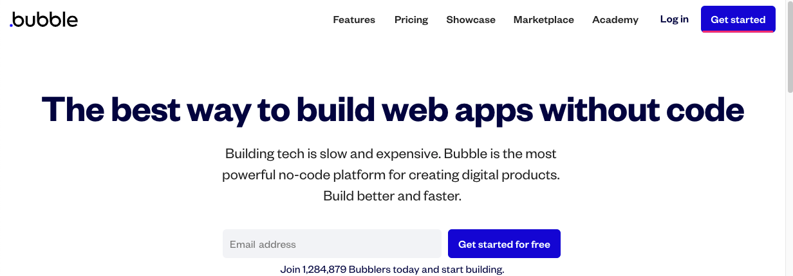

---

- You can register for a free account
- Enter your email address and password and click "Get started"!

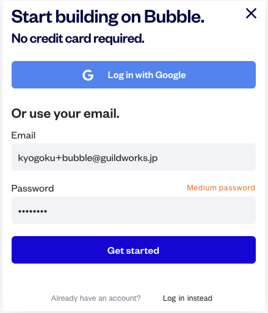

---

- I agree to the terms of use and "I agree..." Click!

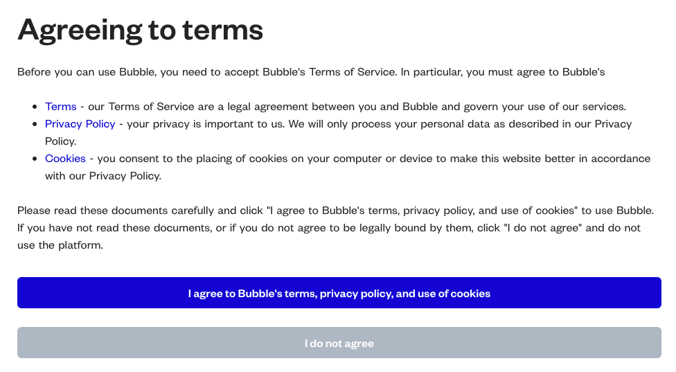

---

- Answer a few questionnaires for use.
- Finally, "Submit (thanks!)" Click !

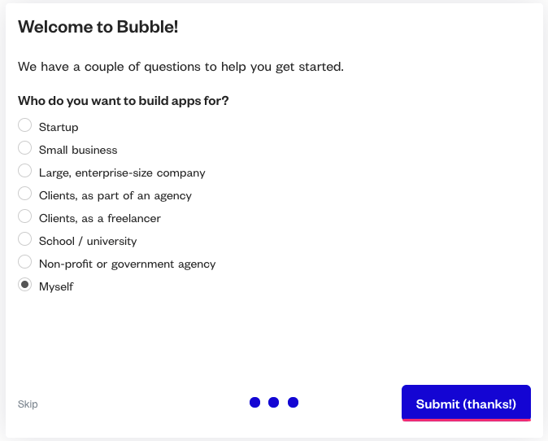

---

- This will bring up the editor screen and start the tutorial, which can be closed later.
- Click on the icon in the upper right corner of the screen and select "My applications".

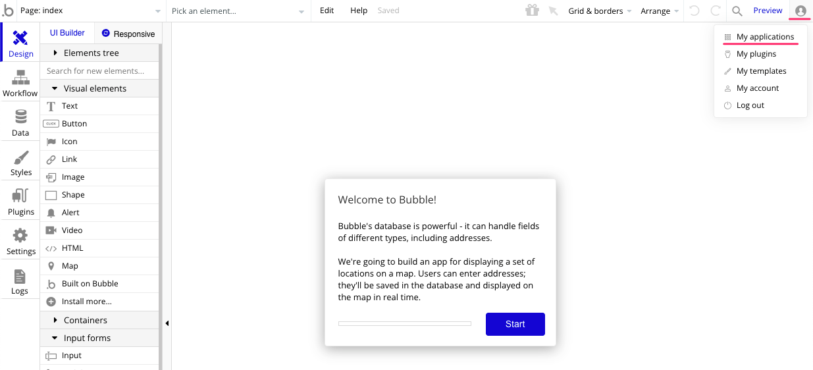

---

- When the Welcome page appears, scroll to the bottom of the screen and click "Create a new app".

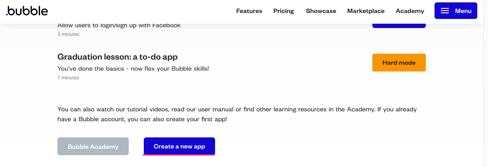

---

- If you see a screen like this, you are good to go
- This is the initial state of the template generated by Bubble.
- If you see the New Application Assistant in the left panel, select "Close the assistant" at the bottom
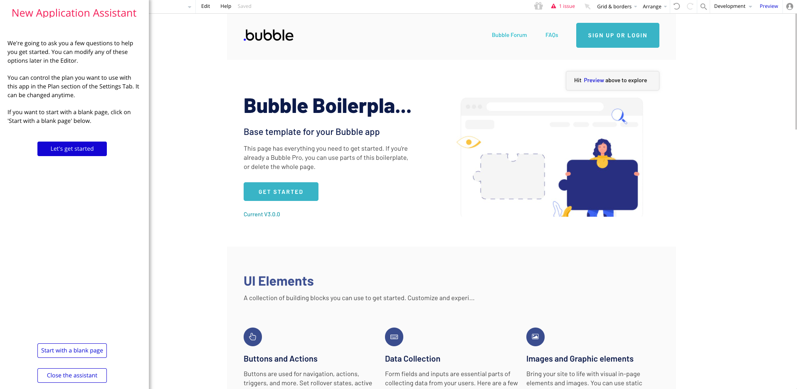

---

### Let's try to run the Bubble template first.

- Click the Preview button in the upper right corner of the screen.

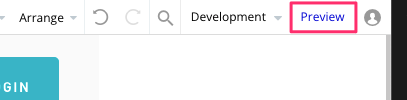

---

- The preview screen will be launched.

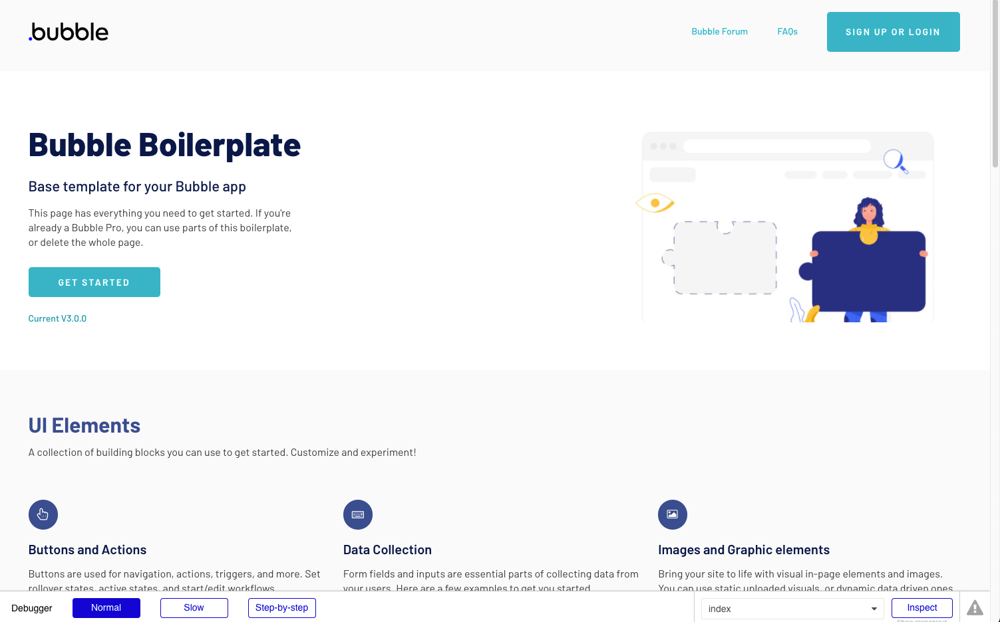

---

### Try to Sign up

- Click on "SIGN UP OR LOGIN" at the top right of the screen.
- Enter your Email / Password / Confirm password and click "SIGN UP".
  - Make a note of the Email and Password you entered (you will use them later).
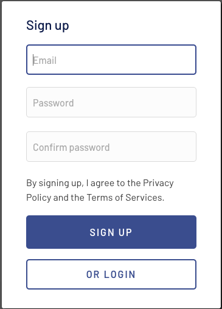

---

- The button on the upper right corner of the screen should now read "LOG OUT".
- This means that your account has been registered and you are now logged in.
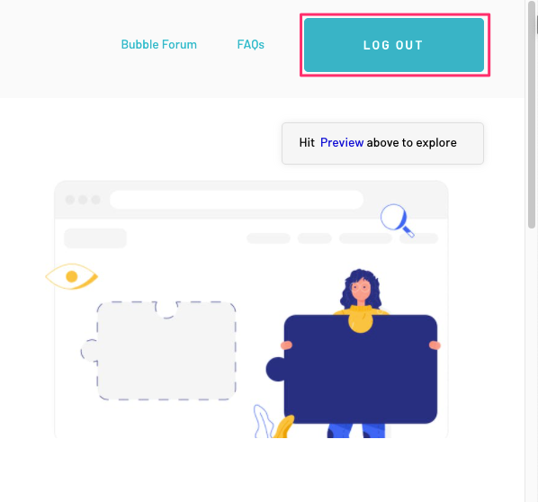

---

### Try to Login

- Click "LOG OUT" in the upper right corner of the screen to log out.
- Click "SIGN UP OR LOGIN" in the upper right corner again.
- Click "OR LOGIN" at the bottom of the modal.


---

- When the login modal appears, enter the email address and password that you just entered.
- Finally, click "LOG IN".
- If successful, the button in the upper right corner of the screen should change to "LOG OUT".
- Now you can see that the sign-up and sign-in process is working.


---

#### About mobile phone support

- As we mentioned at the beginning, the Bubble app is based on a web application.
- To make the Bubble app compatible with smartphones, we will use the concept of **responsive design**.

---

- Let's see it in action first.
- Try shrinking the width of your browser.

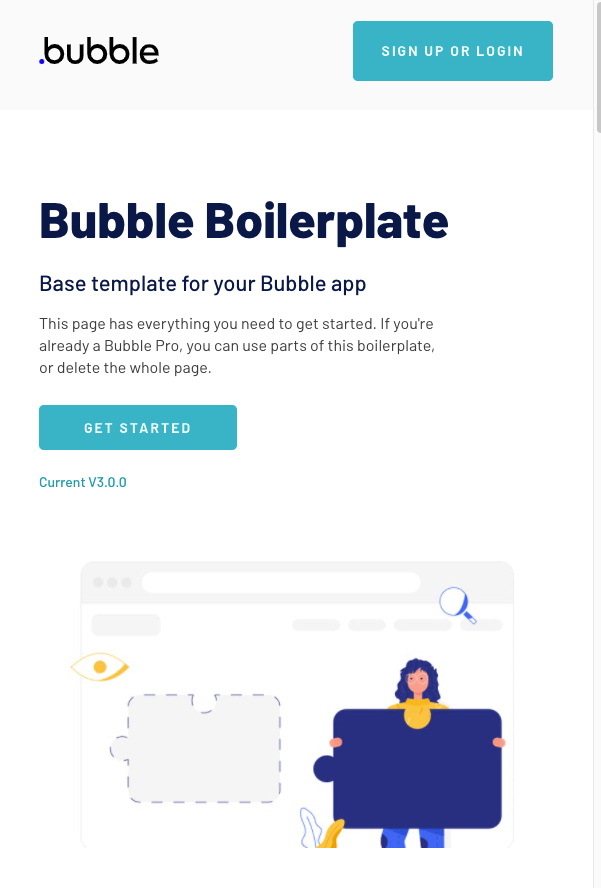

---

- The layout is not broken, and the elements are automatically rearranged to fit the phone size.
- This is called responsive design.
- Google explains it like this

```
Regardless of the user's device type (computer, tablet, mobile, non-visual browser), the
It delivers the same HTML code at the same URL, but renders it differently based on screen size.
```

---

- The points are as follows
1. the URL of the page being displayed is the same
2. automatically change the rendering method according to the screen size

---

- To break it down a little more, it controls whether elements should stretch/shrink, wrap/unwrap, and display/not display depending on the screen size.
- By configuring these settings at each item level, you can automatically support responsive design.
  - During actual development, it is a good idea to set up the settings and preview them to make sure they work.

- We'll see how to set up responsive design in the screen operations later.

---

## An overview of application development in Bubble

The following is an overview of how to develop an app in Bubble.

---

### The three main operations

- In Bubble, there are three main operations that you can use
  1. design
  2. Workflow
  3. Data
- You can go back and forth between them from the left panel

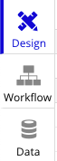

---

#### Design

- A mode for placing components on the screen to create a user interface.
- UI components in the left panel, actual screen editing area in the right panel

---

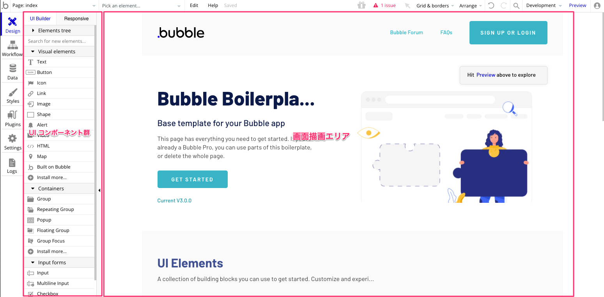

---

#### Workflow

- A mode for adding movement to the screen.
  - Example: Screen transition when a button is pressed
- This is the part where you need to think a little bit about programming.

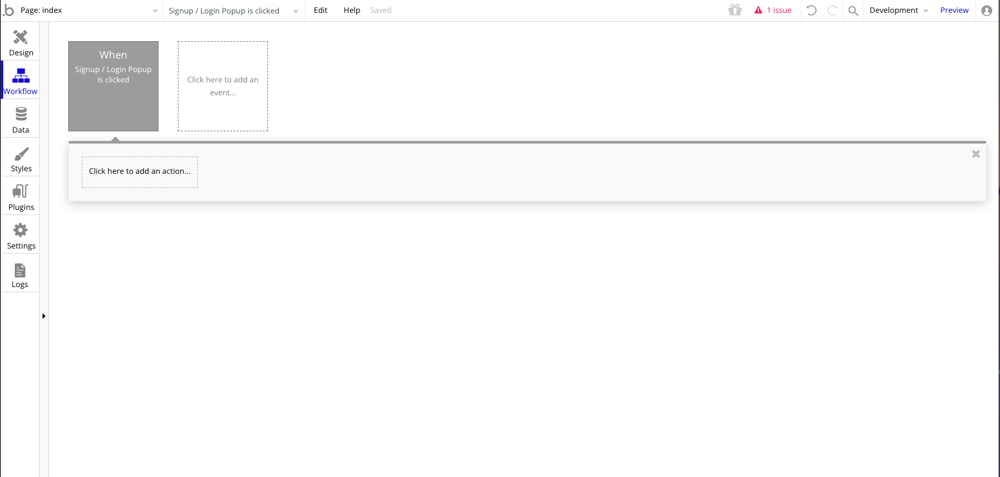

---

#### Data

- Mode for defining and manipulating data

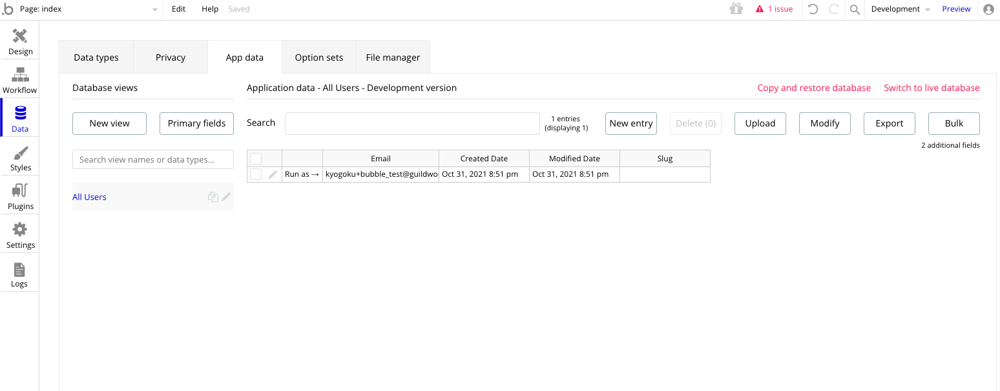

---

- Select the "App data" tab and click the "All Users" link on the right side.
- You will see the list of registered users in the right panel, and the user you just "signed up" should be there.
- Now you can see that the screen and the database are connected!

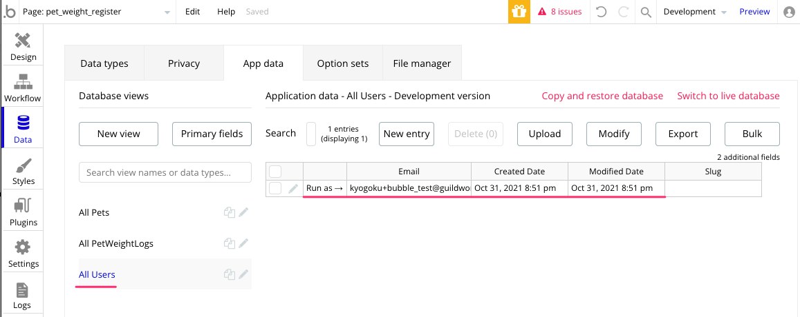

---

#### Other Operations

- Styles
  - By naming styles, you can use them universally.
  - You can also specify individual styles for each part.
  - In this lecture, we will basically use common styles, so we will not cover them in this lecture.

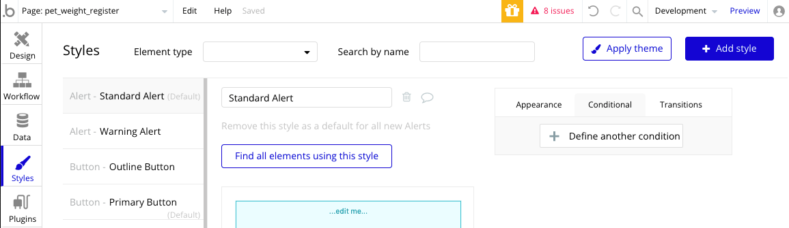

---

- Plugins
  - Just as we added a line chart component to Adalo, Bubble has a variety of components available to extend the application
  - In Bubble, these are called plugins.
  - There are both free and paid plugins for Bubble, so check them out before you use them!

---

- Settings
  - Change your Bubble plan and account settings
  - Centralize the messages provided by Bubble
    - Change the locale (language setting) for the main user of the application
    - Change this message to unify message management across the system
    - You can change the messages that can be used in common throughout the application, and you can also change the default messages.
    - It is also possible to add app-specific messages.
  - Not covered in this lecture.

---

- Logs
  - You can view the logs of the application as it runs.
  - However, since it is possible to view the logs while previewing the application, we will not cover this in this lecture.

---

#### Overall view of the screen we are going to create.

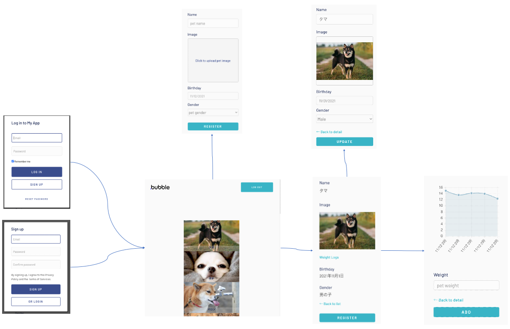

---

## First, let's make something from pet registration to list display.

- We will create the same screen elements and data structure that we created in the Adalo meeting.
- Therefore, we will create the screen and database operations together in the Bubble meeting.
- We'll also use the default authentication methods provided in Bubble.
- First of all, let's create a screen to register pets and display them in the list!

---

#### Prepare only the frame for the pet list page

- First of all, we will use the page that we used to check the operation as the pet list page.
- To do so, we will delete all the parts that Bubble generated automatically.
- Select one of the elements in the index page and press "Ctrl + A" to select all the elements.
- Then click on the Delete button and you should see the screen clear up.

---

##### before element trimming

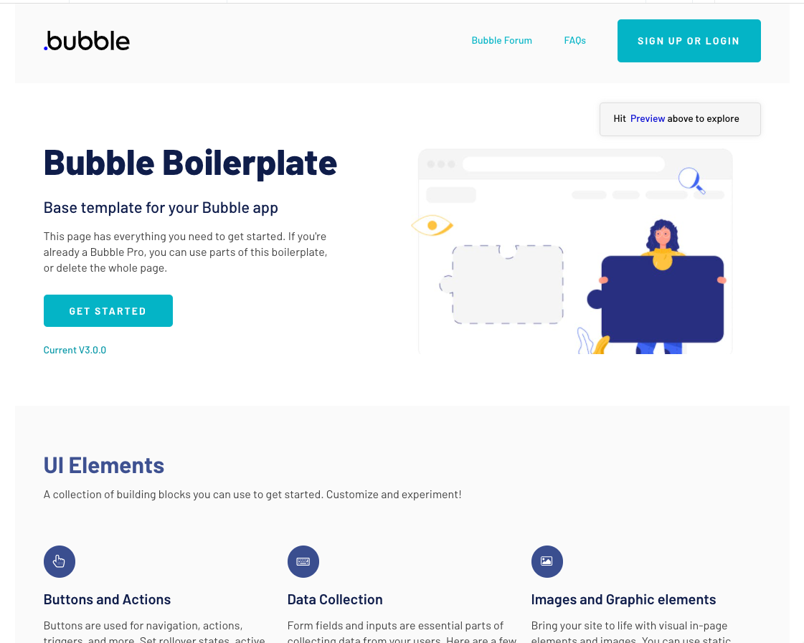

---

##### after element trimming

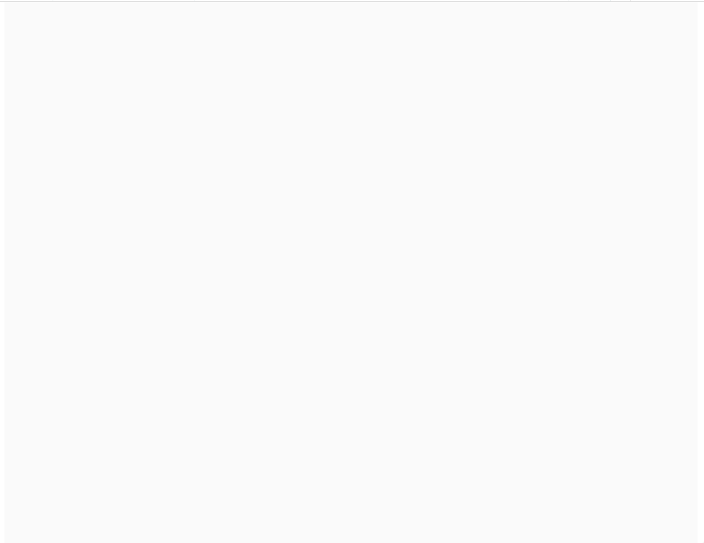

---

- We'll use the header from the Bubble template
- Select the Design tab, scroll down to the "UI Builder" section, and in the `Reusable elements` section, you will see a Header, click on it

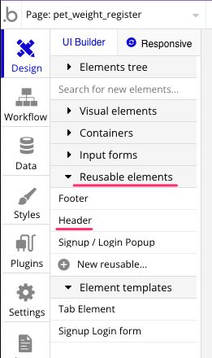

---

- Then, select (drag) a range at the top of the right side drawing area to add a common Header element to that area

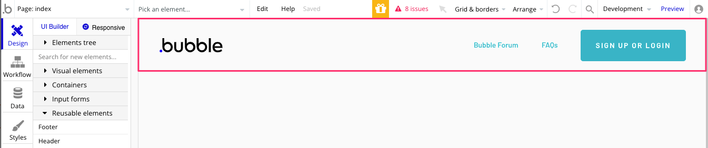

---

- If the location cannot be placed exactly at the top, select Header and drag it to the top center of the screen.
  - Right-click on an element and select `Center horizontally` to center the horizontal position of the element
  - If you select `Center vertically`, the vertical position of the element will be centered.
  - Use this if you want to center the element in the future.
- The contents of the header will be changed later.

---

#### Let's create the pet registration page.

- Click on the `Search a page or ~` part in the upper right corner of the screen, and a popup will appear.
- Click `Add a new page...` in the popup Click on `Add a new page...

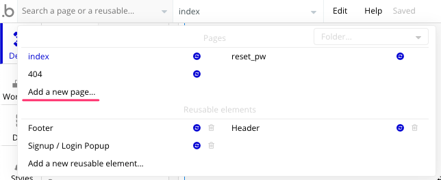

---

##### By the way...

- Here you can see the list of "Pages" and "Common Components" in the application you are currently creating.
- In Adalo, all the screens were displayed on one canvas, but in Bubble, you will be manipulating one screen on one canvas.
- In Bubble, you will be manipulating a single screen on a single canvas, so keep in mind that you will need to change the movement between screens from here :raising_hand:

---

- Click `Add a new page... Click `Add a new page...` to display a popup for the new page.
- The `Page name` will be the name of the screen, so enter only alphanumeric characters, no spaces.
  - This time, let's use `pet_register`.

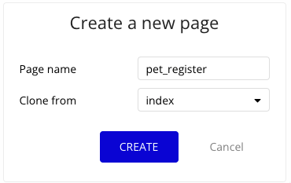

---

- The `Clone from` function allows you to create a copy of a similar screen by selecting the screen to be copied from.


---

- For example, the elements of the registration screen and the editing screen are almost the same, so if you want to make the editing screen after making the registration screen, selecting the registration screen as "Clone from" will reduce the development time.


---

- This time, let's select and copy the index for which we just prepared the header.
- After entering the necessary information, click the "CREATE" button.


---

#### Assemble the Pet Registration Screen

- Let's make a screen based on the image of the pet registration screen created by Adalo.
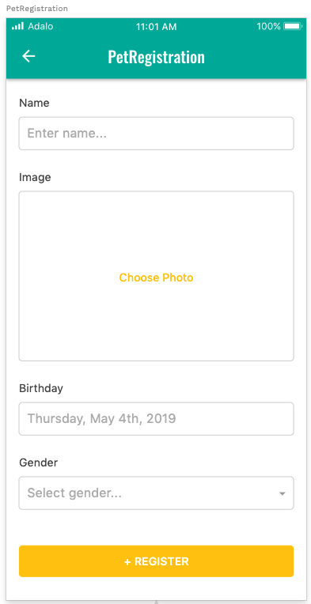

---

#### Pet's name

- First, we'll place a text box for the pet's name.
- Go to "UI Builder" in the left panel and select `Input` in the `Input forms` section.
- Then, drag the text box on the right panel where you want to place it, and the input box will appear

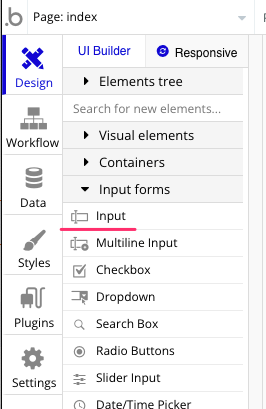

---

- Double-clicking on an element will bring up a dialog where you can set various information about the element, and set the necessary items.
- The `Placeholder` is the auxiliary text that will be displayed when the text box is not filled in.
  - In this case, we will use "pet name".

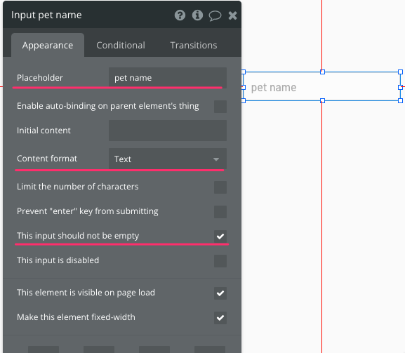

---

- The `Content format` allows you to specify the format of the value that can be entered into the text box.
  - In this case, we'll leave it as "Text" since we'll be entering a string.


---

- The `This input should not be empty` option allows you to specify whether or not the input should be required.
  - In this case, we want to make it mandatory, so we'll check the box.


---

- Once you have set up your settings, you are good to go.
  - You can also specify other details, but I won't explain them here.
  - If you are interested, please take a look at :mag:

---

- There is only one more item to set
- If you click on the top of the dialog, you can give a name to the element in this text box
- This will come in handy later when defining workflows, so let's use `Input pet name` here

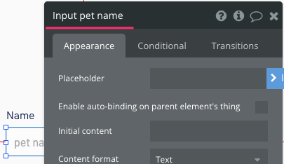

---

#### Pet Image

- The next step is to place the elements for uploading the pet image
- Select `Picture Uploader` from the left panel and drag it on the right panel to place the element

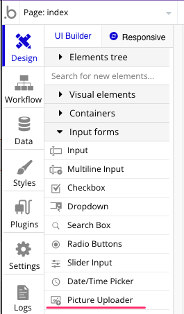

---

- Double-click on this element as well to set the element's information
  - This time, enter "Click to upload pet image" in the `Placeholder` field.
  - Give the element a name of `Input pet image`.

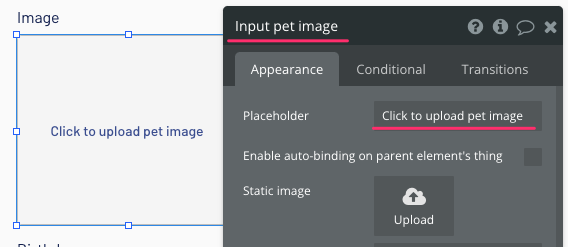

---

#### Pet's birthday

- Next, we will place the elements for entering the pet's birthday.
- Select the `Date/Time Picker` from the left panel and drag it on the right panel to place the element

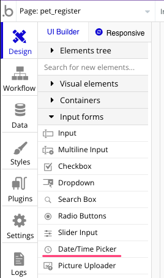

---

- Double click on the element to set the element details.
  - Select Date for the `Input type` to allow only date input.
    - Selecting `Date & Time` will allow you to enter both date and time.
    - In this case, we will use Date.

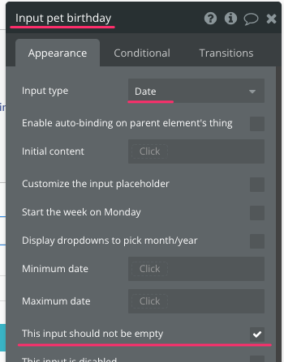

---

- Check the `This input should not be empty` box to make it mandatory.
- Specify `Input pet birthday` as the name of the element


---

#### Pet's gender

- Finally, we will place an element to select the gender of the pet
- Select `Dropdown` from the left panel and drag it on the right panel to place the element

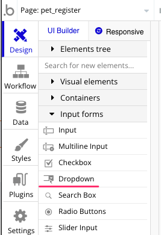

---

- Double-click on the element to set the element details.
  - Type "pet gender" in the `Placeholder` field.
  - Type "Male" in the `Choices` field, hit Enter to start a new line, and type "Female" in the next line

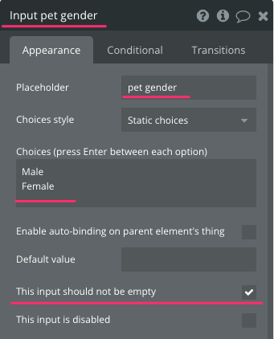

---

- Check the `This input should not be empty` box to make it mandatory.
- Specify `Input pet gender` as the name of the element


---

#### Registration Button

- Now that you have entered your pet's information, you can place the registration button.
- Select `Button` in the left panel under `Visual elements` and drag it in the right panel to place the element.

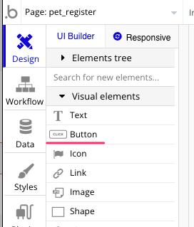

--- 

- Double-click on the element to set the details of the element.
  - At the top of the Appearance tab, click the ". .edit me..." at the top of the Appearance tab. and type in "REGISTER

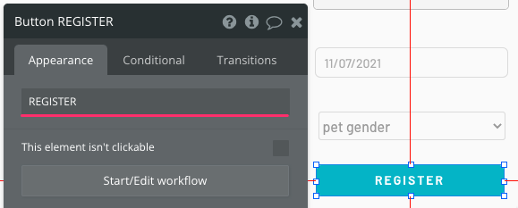

---

#### Let's label each input element!

- Let's prepare a label in the upper left corner of each element, as shown in the Adalo screen
- Select `Text` in the left panel under `Visual elements` and drag it in the right panel to place the element.


---

- When placing the element, make sure that the height is at least 30px.
- Otherwise, the content of the element will not be displayed correctly!
- Double-click on the element to set the details of the element.
  - Double-click on the element to set its details. .edit me..." at the top of the Appearance tab. and type "Name".
  - Select `H3 Sub Heading - Dark` for `Style` in the dialog interruption

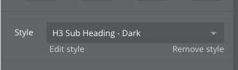

---

- Let's add the other labels in the same way
- You can follow the same procedure, but you can save time by copying and using the Name label that you just created.
  - Copy (Ctrl + C), paste (Ctrl + P), and rewrite the label content only.
- Finally, set the width of all the elements to 220px.
  - From the dialog that appears when you double-click on each element, change the `W` (Width) value to 220.
  - This is to make it look better when displayed on the screen.

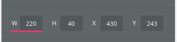

---

#### Finally, organize the elements and preview them

- Select all the elements placed in the right panel (except Header) by dragging them, right-click and select `Center horizontally` to center the input form horizontally.

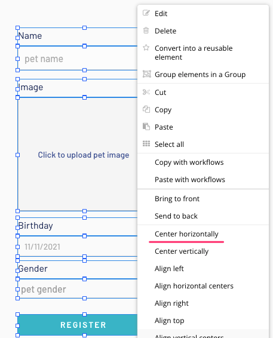

---

- Once you've done all this, click on `Preview` in the upper right corner of the screen to show a preview and see it in action!
- At this point, make sure you are logged in!
  - Make sure you are logged in at this time! This is because this information is required for the list view and linkage later on!

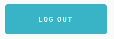

---

  - The button in the upper right corner of the header is 
  - Are all the elements visible?
  - Can you enter values in all the input forms?
  - Does it display when an image is specified?

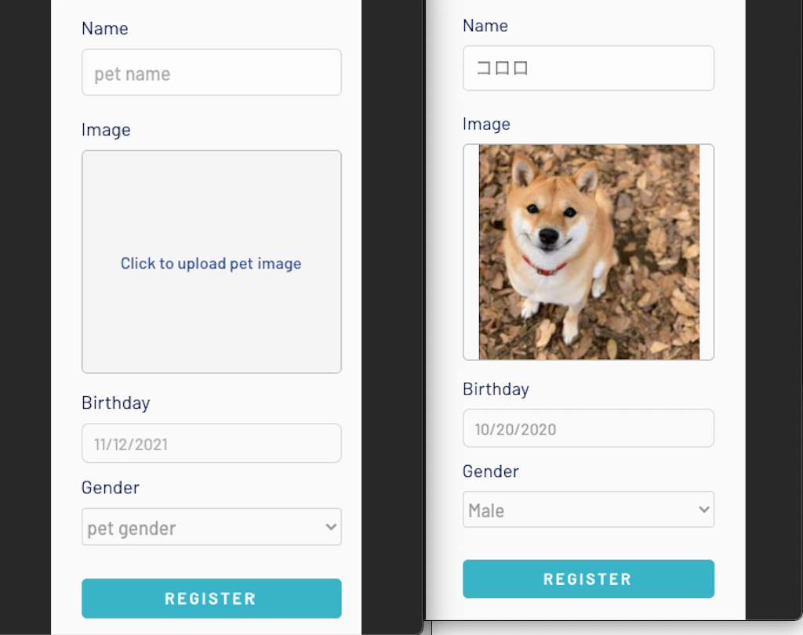

---

### Let's connect it to the database.

- Now that the screen layout is ready, let's connect it to the database.

---

#### First of all, we need to prepare a box to store the pet information.

- Select Data from the tabs on the left panel.
- Under the Data types tab, type "Pets" in the text box labeled `New type` in the Custom data types section.

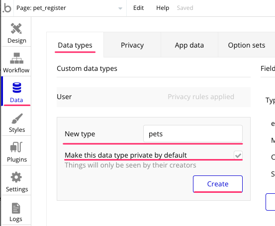

---

- Then, check the `Make this data type private by default` checkbox and click the `Create` button !


---

##### By the way...

- Adalo and Bubble have different names for some of the elements of the database

- Type: Defines the type (box) of data.
  - In Adalo, it is called Collection
- Field: An element to represent the type of data
  - Property in Adalo.

---

- Let's add an element (field) to the type of Pets we created.
- Select `Pets` from `Custome data types`.
- Click on `Create a new field` under `Fields for type pets` on the right

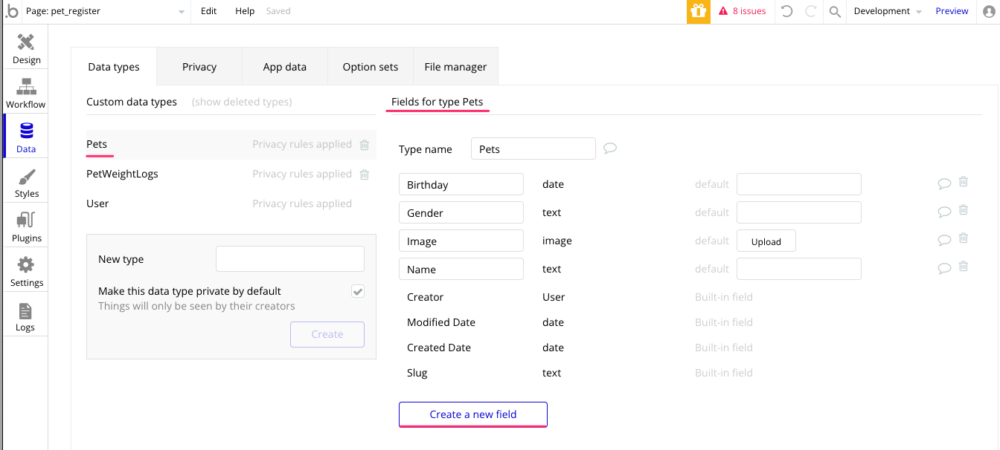

- Then a popup will appear and you can enter the necessary information.

---

- Enter the name of the element in the `Field name` field.

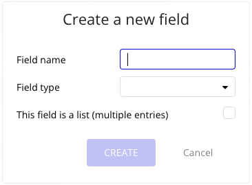

---

- In the `Field type` field select the type of element (text, number, date, etc.)


---

- Adalo allows you to specify the relationship between types via Relationship
- In Bubble, the `Field type` option also shows the registered types, so you can select the type you want to associate with it, just like in Adalo


---

##### Now let's add the necessary fields to Pets type

- Name: text
- Image: image
- Birthday: date
- Gender: text

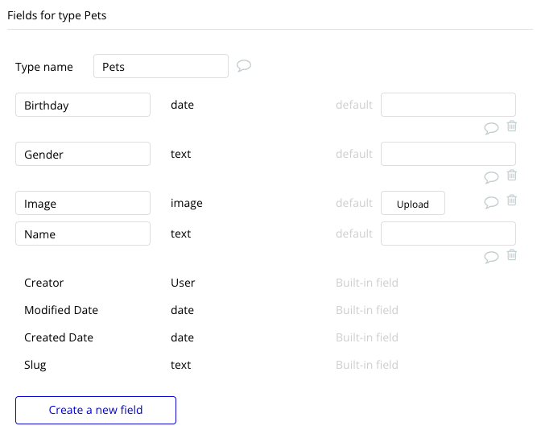

---

### Make it possible to register a pet after clicking the Register button.

- Now that the box for storing the pet information is ready, it's time to add the movement to save the information to the database when the registration button is clicked.
- In Bubble, all the movement settings are done in the Workflow tab.
- We can start with the Workflow tab, but for this example, we'll start with the button that will be the source of the movement.

---

- Select the Design tab from the left panel
- Double-click the "REGISTER" button on the Pette Registration screen in the right panel
- Click the `Start/Edit workflow` button in the "Appearance" tab

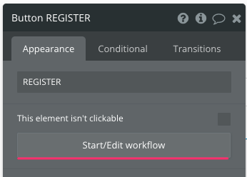

---

- This will switch to the Workflow tab, and in the When section, you should see `Button REGISTER is clicked
  - This is literally the workflow definition for when the "REGISTER" button is clicked

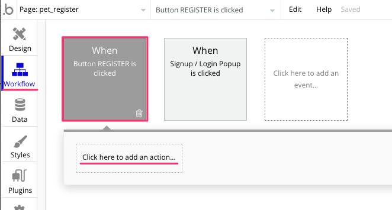

---

- So, select `Click here to add an action...` below it. and configure the behavior when the button is pressed.


---

- `Click here to add an action... Select `Click here to add an action...' to display a popup window where you can specify various actions.
- Select `Data(Things)` for database operations (actions) like this one.

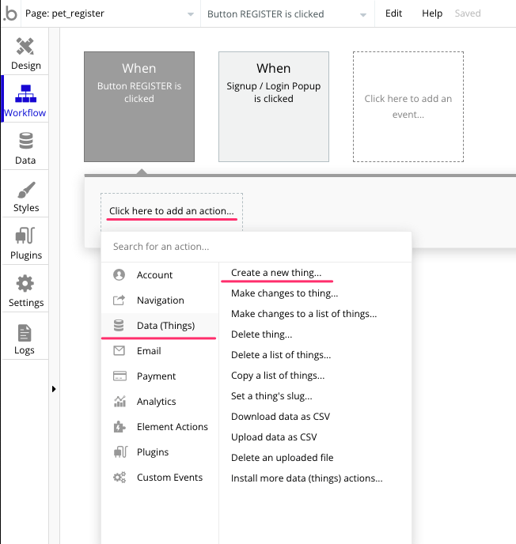

---

- Then you will see more sub-elements, select `Create a new thing... Select `Create a new thing...


---

- Select `Create a new Pets... When the dialog box `Create a new Pets...' appears, specify the type of pets you want to register.
  - This time it will be Pets.
- Then, a button `Set another field` will appear, and as the title says, set the fields entered on the screen to the "field" of Pets

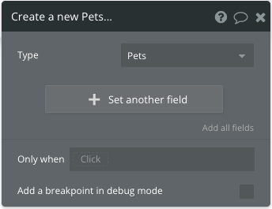

---

- Here, we specify the name of the "field" of the item we want to store in Pets on the left side, and the actual value to be stored in the "field" on the right side.
  - First, select `Name` for the left side

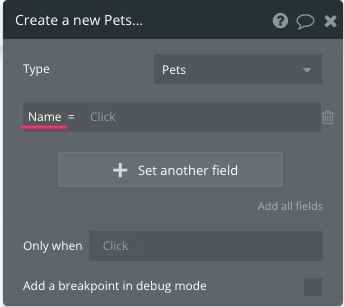

---

- If you specify the left side, you will see `Click` on the right side, sandwiched between `=`.

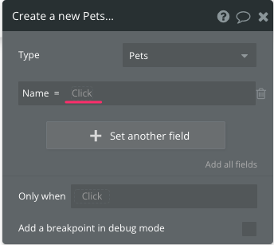

---

- If you click here, you'll see a variety of options.
- I'm not going to go into details here, but you can specify what you want to set for the field selected on the left side

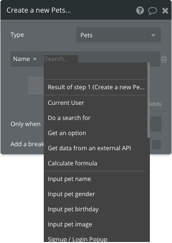

---

- Select the `Input pet name` field since this will be the name of the pet entered on the screen.

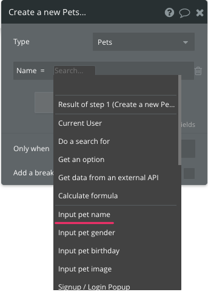

---

- This `Input pet name` is the name you gave to the input element when you created the screen, and it is displayed here.
- This makes it easier to uniquely identify the input elements when there are multiple input elements on a screen, for example


---

- If you select `Input pet name`, more options will be displayed
- We want to use the "value" of the pet name entered on the screen, so we will select `'s value`.
  - The other options `is valid` and `isn't valid` can be used to check if the input value is valid or not

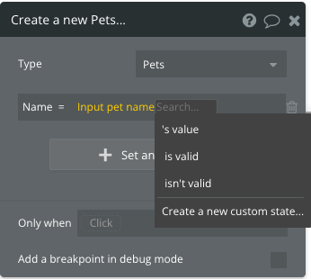

---

- If you specify all of them, it looks like this

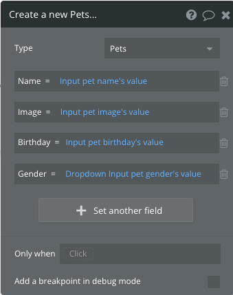

---

### Let's try to make it work!

- Once you've set up the settings so far, let's check if your pet is actually registered in the preview!
  - By the way, you can click "Ctrl + P" to see the preview (shortcut key).
- Fill in all the input elements and click the "REGISTER" button.
- Nothing will happen on the screen, but let's see if the data has actually been registered.

---

- Close the preview, open the Data tab, select App data, and when you select `All Pets` in the left panel, make sure that the information you just entered from the screen is saved

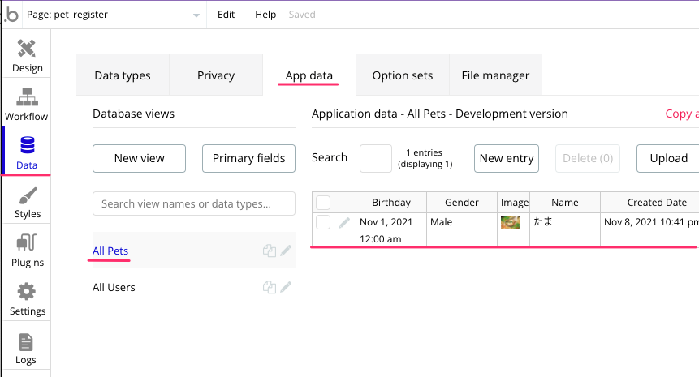

---

- Now we're up to the point where we can save what we've entered on the screen to the database! :tada:

- Next, let's create the screen transitions.

---

#### Let's try screen transitions.

- Click on the Workflow tab in the left panel.
- You will see the behavior when you click the "REGISTER" button that you just set.

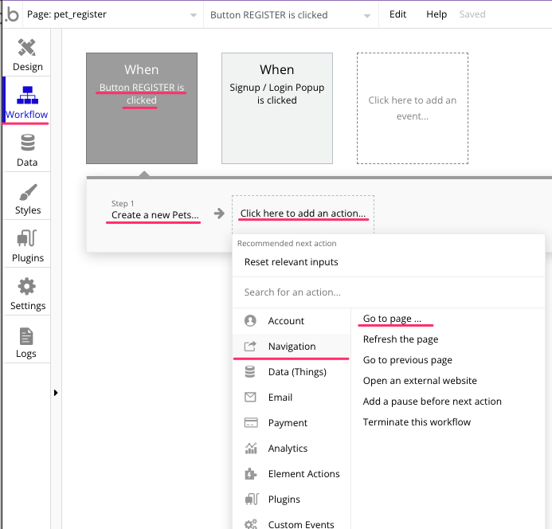

---

- Here, to the right of "Create a new Pets..." to the right of "Create a new Pets...", click `Click here to add an action... Click here to add an action...


---

- Now select `Navigation` and click on `Go to page...` as a sub-element. Click `!


---

- Then a dialog box will appear.
- In this case, we want to go to the Pet List page, so select `index`.

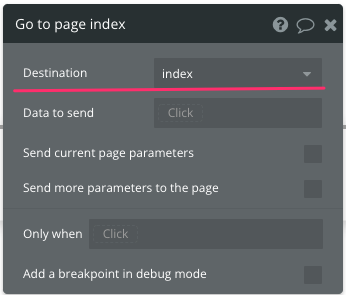

---

- Now let's preview it!
- Enter your pet's information as before, and click the "REGISTER" button.
- You should now be taken to a completely new page.
  - We haven't created the pet list page yet, so it's not a problem now.

- Now you've mastered the screen transition! :tada::tada:

---

### Pet List View

- Next, let's create the pet list view.

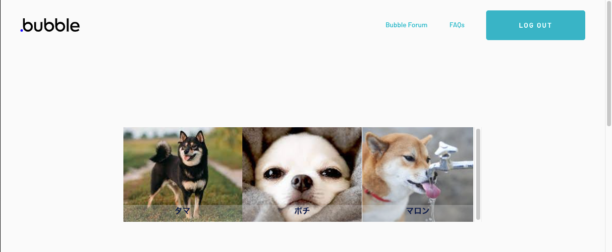

---

- Select `index` from the list of pages in the upper left corner.
- If you want to repeat the same element, select `Repeating Group` from the list of `Containers
- Drag it to the canvas in the right panel

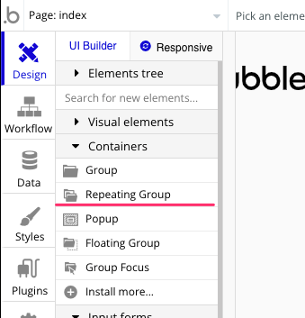

---

- The popup for the element's advanced settings will appear, so let's configure it
- Enter `pet list` for the element name at the top.
- For `Type of content`, specify the type of data to be repeated.
  - In this case, it's `Pets`.

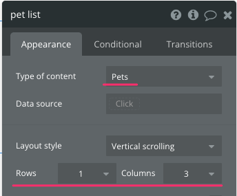

---

- `Rows` is the number of rows to display by default.
  - If there is more than one row of data, the number of rows is automatically set to `1`.
- `Columns` is the number of columns per row.
  - In this case, `3`.


---

- Select `Full list` for "Layout style" to automatically expand the list if there are more than 4 Pette data.
- Also, set the Cell min width to the same value as the current width listed in parentheses (193 in the image example) to display the full width of the image in each cell.

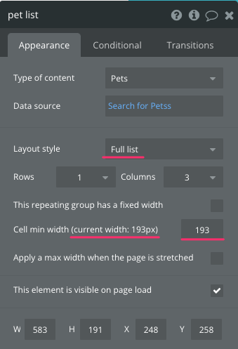

---

- Then click `Do a search for` from the `Data source` Click
  - This is to specify the data source to be listed
- Another popup will appear and you can specify `Pets` for Type

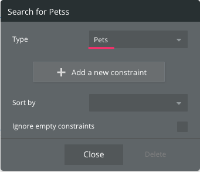

---

- Since this is the only way to display the list of pets even if the user is not logged in, we will add a condition to display only the pets registered by the logged-in user
- Click "Add a new constraint" to add more conditions.
  - What will be the contents of the configuration?

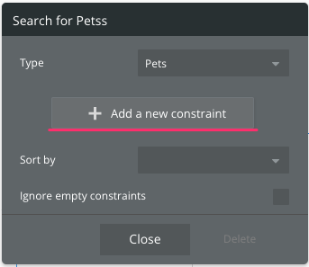

---

- The condition to be set is that the "Created By" of the pet must be the same as the "Current User".


---

- The next step is to set the content to be repeated.
- Let's display the image and the name, just like we did in Adalo

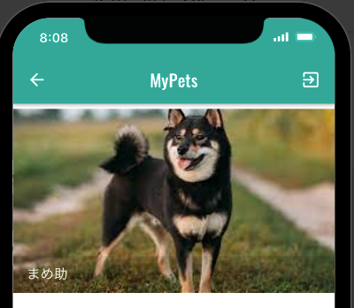

---

- First, select `Image` from `Visual elements` and drag it to the right panel.
  - If you drag the image to include it in the Repeating Group you just placed, you won't have to move it later.
  - You can also include it in the Repeating Group afterwards
  - After placing the element, drag it into the Repeating Group to expand it.
- Let's name the element `pet list image`.

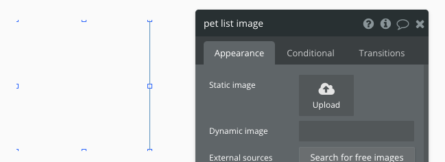

---

- After placing the elements, select "Dynamic image" from the advanced settings popup that appears.
- You will see a button (or something like that) that says `Insert dynamic data`.
  - This function can be used when you want to display values and images dynamically, instead of displaying fixed values and images.

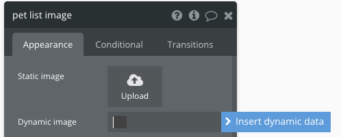

---

- Click on the pull-down menu, and then click on `Current cell's Pets`.
  - This can be used if you literally want to use the data of the current cell's pets

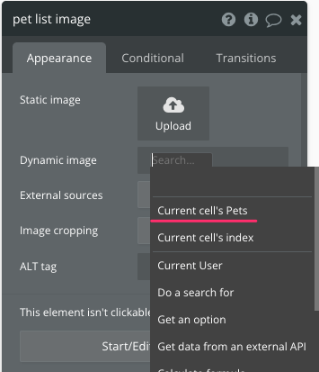

---

- If you select `Current cell's Pets`, a pull-down menu will appear, showing the fields that the Pets type has.
  - The command will display the images of the pets in the current cell, so if there are multiple pet data, each cell will have its own image

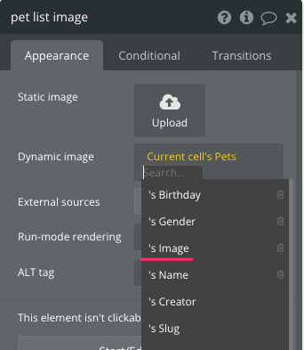

---

- Now that we've set the image to fill the width of the cell, we need to change the "Run-mode rendering" value of the image element from `Streth` to `Zoom`.
  - Change the value of the "Run-mode rendering" of the image element from `Streth` to `Zoom`, otherwise the image will automatically change its aspect ratio in the cell.

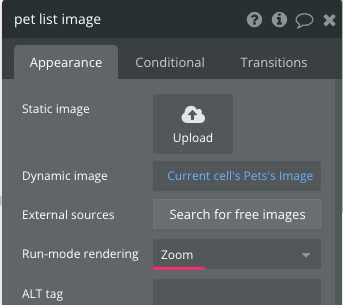

---

- Next, let's set the background for the name to be displayed below the image.
- Select `Shape` from `Visual elements` and drag it to the right panel.
  - Drag it to the right panel and include it in the Repeating Group.
  - After placing it, move it to the bottom of the Repeating Group and drag it to the full width to expand it.
- Set the value next to the Color of the placed shape to `30`.
  - This is the transparency of the image, with 100 being non-transparent and 0 being transparent

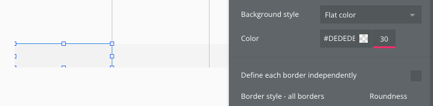

---

- Finally, we will display the pet's name
- Select `Text` from `Visual elements` and drag it onto the Shape you just placed.
  - Drag it to include it in the Repeating Group.
  - After placing it, drag it to the same size as the Shape to expand it
- Name the element `pet list name`.

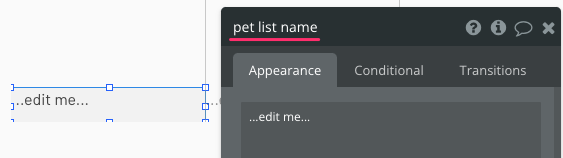

---

- Like the pet image, the pet name also uses Dynamic data
- `.... .edit me... Click on the `...edit me...' button, and as with the image, `Insert dynamic data` will be displayed.
  From there, select `Current cell's Pets` --> `'s Name`.

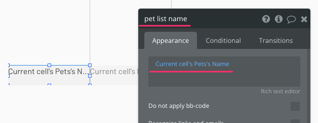

---

#### Now that you have done this, let's preview it!

- Do you see the pet's image and the pet's name as the list of pets?


---

- By the way, Repeating Group is responsive, so if you change the width of your screen, it'll automatically resize the image for you!

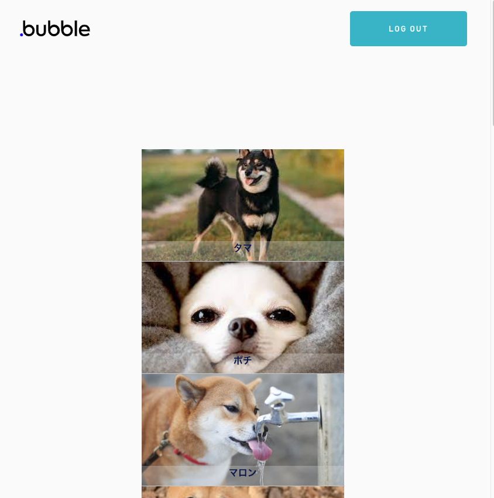

---

#### Let's prepare a lead line from the pet list to the registration screen!

- Now that we've created the pet list screen, let's prepare a line from the list screen to the registration screen.
- Let's prepare this line so that we can move to the registration page from the Header page at any time.

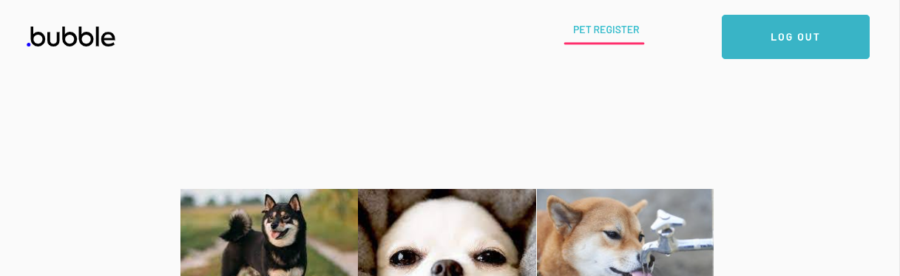

---

- Click on the menu in the upper left corner and select Header from it.

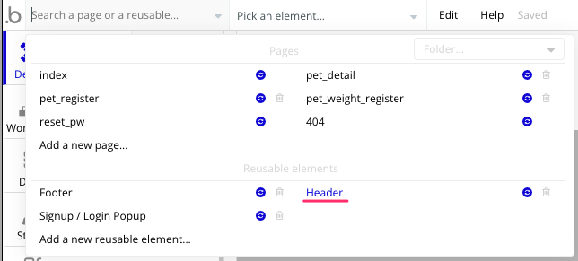

---

- Then the header elements will be displayed in the right panel, and you can edit them here

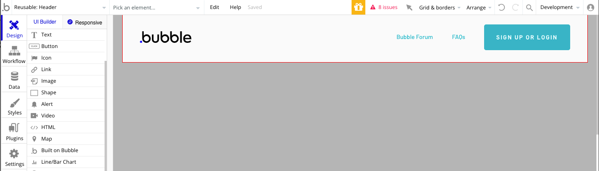

---

- First of all, remove the original `Bubble Forum` and `FAQs` links as they are no longer needed.
- Then select `Link` from the `Visual elements` and drag it to the header area.

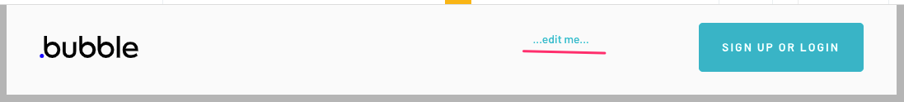

---

- Name the link "PET REGISTER".
- Select `pet_register` as the "Destination page".
- Uncheck "This element is visible on page load"
  - Uncheck this, and the element will always be hidden.
  - I'll explain why later.

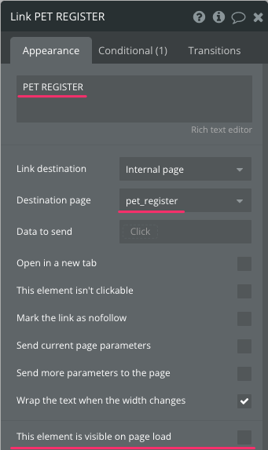

---

- We want this link to register pets to be displayed only when the user is logged in, so we'll set up the control for that
- From the same dialog, select the `Conditional` tab and click `Define another condition`.

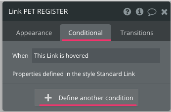

---

- Here, we can define a simple behavior for this link itself.
- In this case, we only want the link to be displayed when the user is logged in, so in the "When" section, we first set the conditions under which we want the link to be displayed

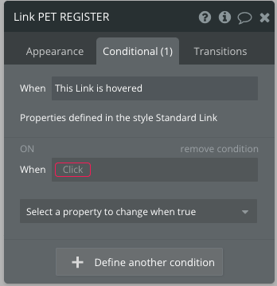

---

- Click to select `Current User` and then `is logged in` to specify the condition "if the current user is logged in" !

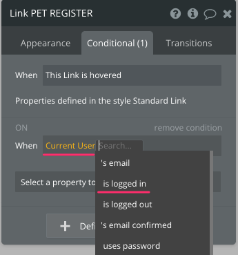

---

- Next, let's set the behavior when When is satisfied.
- Select `This element is visible` from the pull-down menu of `Select a property to change when true`.
  - This will literally make this element visible.
- Once selected, check the behavior

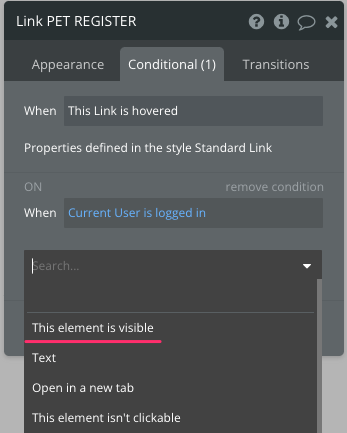

---

#### Now let's preview it!

- Once back to index, run preview
- You should be logged in now, so you should see the link "PET REGISTER".
- From there, click LOG OUT in the upper right corner, and you should see the "PET REGISTER" link disappear.

---

## Let's create the Pet Detail screen.

- Next, let's create the pet detail screen.
- The key point here is to pass the information of the selected pet in the list screen.

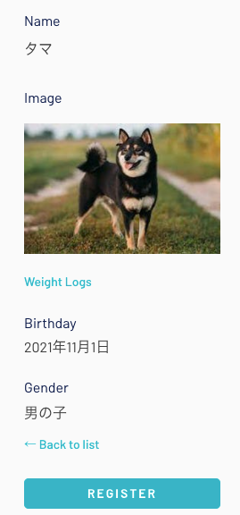

---

### First, prepare a new detail screen.

- Select "Add a new page..." from the top left. from the top left corner.
- "Page name" is `pet_detail`.
- For "Clone from", choose `pet_register` since the screen structure is similar.

---

- If we clone the page, it will be the same as the registration page, so we will review it.

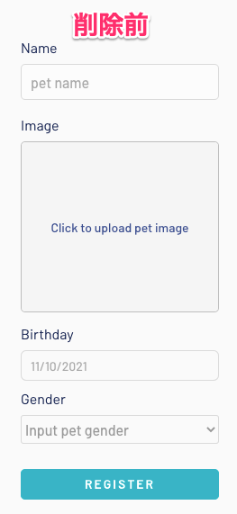

---

- First of all, we will delete all the input elements that we prepared as input items
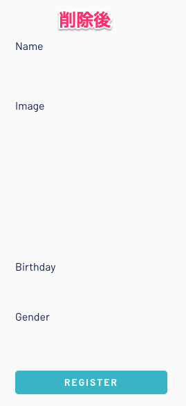

---

- Next, let's place the elements for display.
- Let's drag each element from "Visual elements".
  - Name: Text
  - Image: Image
  - Birthday: Text
  - Gender: Text
- The width (w) of the elements should all be 220px

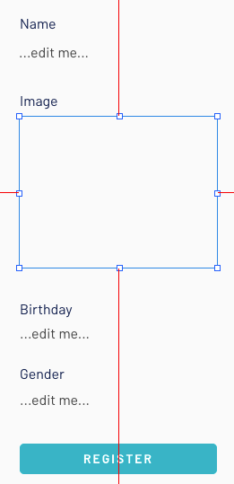

---

- Once the elements are ready, we will actually define the values to be referenced from the database.
- First of all, let's display the advanced dialog for this screen itself.

---

- Select `pet_detail` from the upper left part of the right panel to display the dialog.
  - You can also select an element from here, which is useful if you have several overlapping elements!

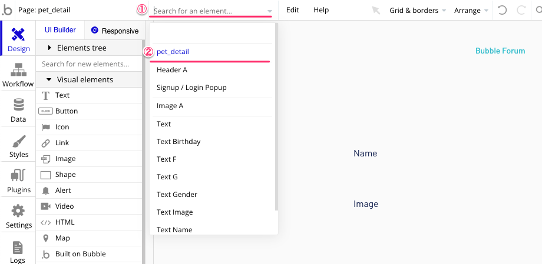

---

- From there, you will find a field called `Type of content`, where you can specify `Pets`.
- This way, you can specify what type of database you want to display this screen from, and for each field, you only need to specify which field of that type you want to use

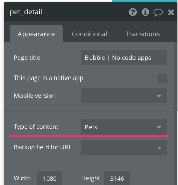

---

- By the way, you can now specify the type, but you will have to specify the specific pet information (whether it's a pooch or a ball) when you move from the list screen.

---

- Now, let's connect the display element to the Pets type field.
- Let's start with Name.
- If you want to dynamically display a value retrieved from the database, as in this case, do you remember how to do it?

:ghost::jack_o_lantern::ghost::jack_o_lantern:

---

- That's right! We'll use "Dynamic data!"
- Double-click on the Name element and type `.... .edit me... Double click on the Name element and click on the `Insert dynamic data` button.

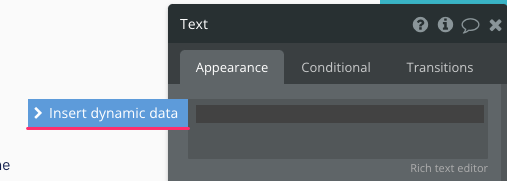

---

- Then, a pull-down will appear, and click `Current Page Pets's` from the pull-down.
  - This literally means the information of the pets assigned to the current page
- Then the fields that the Pets type has will be displayed, select `'s Name`.

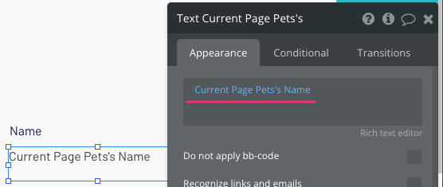

---

- In the same way, let's set the Dynamic data for Image / Birthday / Gender.
- After the settings are done, select all the elements related to the pet details and center them
  - Right-click on the selected element --> `Center horizontally

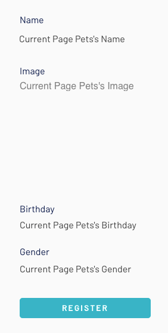

---

- When you're done, preview the settings.
- The values are not displayed correctly, right?
- This is because you haven't specified which pet's information is displayed in the list screen yet. This is because you haven't specified which pet's information you want to see in the list screen yet.
  - The `Lorem ipsum` is a common dummy content idiom that Bubble will automatically give you

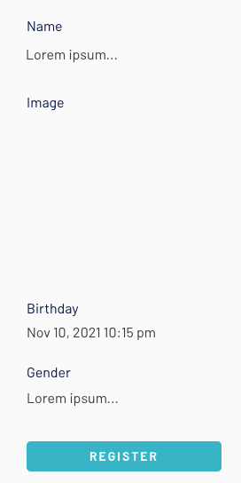

---

### Now let's connect the list page to the detail page.

- Switch to the index page from the menu on the top left.
- When you click on the image of a pet in the "Pet List" screen, you will be taken to the "Details" screen of the pet.
- So, let's set up a workflow for the pet image in the list screen

---

- Double-click the pet image and click `Start/Edit workflow`.
- You should now be in the state before setting the behavior for the "When pet list image is clicked" box

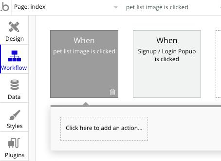

---

- So from "Click here to add an action", select Navigation -> Go to page
- A dialog will appear, and `Destination` should be `pet_detail`.

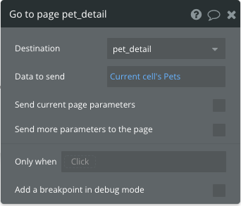

---

- And specify `Current cell's Pets` for `Data to send`.
  - Now you can specify that the pet information of the current cell will be sent to the destination when moving to the pet detail page.


---

- Now let's preview it!
- Did you see that when you select a pet image in the list screen, the detail screen of that pet will be displayed?

---

### Appendix

- Display advice
- The display of Birthday and Gender is a bit bland, so let's change the display format

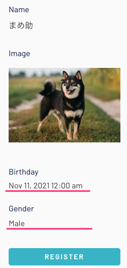

---

### Appendix1: Change the birthday format to Japanese style.

- Open the pet_detail screen in the Design tab.
- Double-click on the Birthday display element to open the advanced settings dialog.

---

- Then, click the `Current Page Pets's Birthday` Birthday section, and you will see a `More` section behind it.

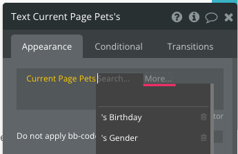

---

- Then you can further specify the display format of the Birthday value
- This time, click on `:formatted as DD/MM/YY` at the top
  - DD/MM/YY will contain today's date

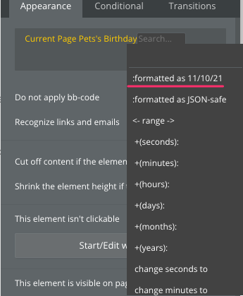

---

- Then you will see the `Date Formatting` dialog next to it
- Here you can specify the format in detail.
- This time, select `Custom` for `Format type` and `yyyy year m month d day` for `Custom format`.

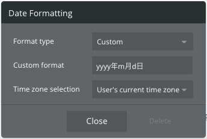

---

- Now let's preview it.
  - Open the index page once and run the preview
- If you open the pet details from the pet list, you will see that the Birthday date is in the format you specified

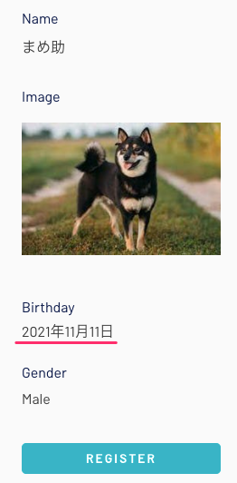

---

### Appendix2: Let's change the gender label.

- Open the pet_detail screen in the Design tab.
- Double-click on the Gender display element to open the Advanced Settings dialog box.
- In the same way as before, click the Gender part of `Current Page Pets's Gender`, click `More`, and then enter the following

---

- Select `is`, type `Male` manually and click enter, then select `:formatted as text`.
- This will bring up a dialog called `Boolean Formatting` where you can enter the following
  - Formatting for yes: Boy
  - Formatting for no: Girl

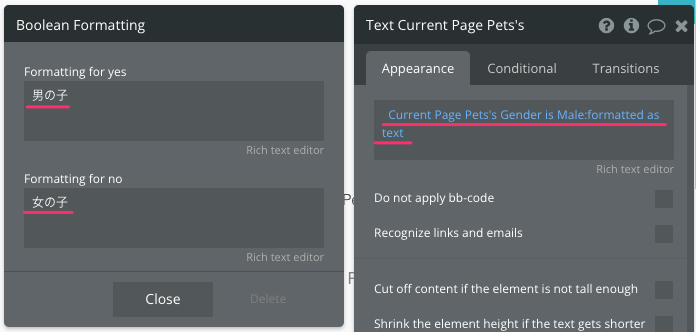

---

- This would write the following process

```
If the current pet's Gender is Male, display "Boy", otherwise display "Girl".
```

Now there's a little programming involved!

---

- Now let's run the preview from the index page
- If you open the pet details from the pet list, you will see that the gender values are "boy" and "girl".

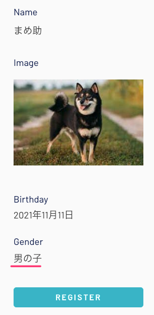

---

### Appendix3: Let's set up a line from the detail screen to the list screen.

- Let's prepare a line to return to the list from the detail screen.
- I'm sure you've got an idea of what I'm talking about, so I'll just give you a hint.

---

#### Hints

- The element to use is `Link` of `Visual elements`.
- In the case of the Link element, the screen transition is not Workflow, but the element itself can be set to "Destination page".
- Finished image

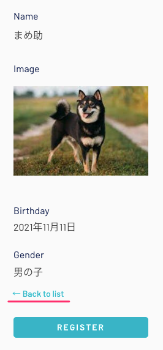

---

## Keep track of your pet's weight

- Next, let's take a look at managing your pet's weight!


---

- First, let's prepare the Type.
- From the Data tab, enter `PetWeightLogs` as the New type and click Create.
- Next, we need to set up the field.

---

- The weight of the pet entered from the screen
  - WeightKg: number
- Connect the weight of the pet to the field
  - pet: Pets

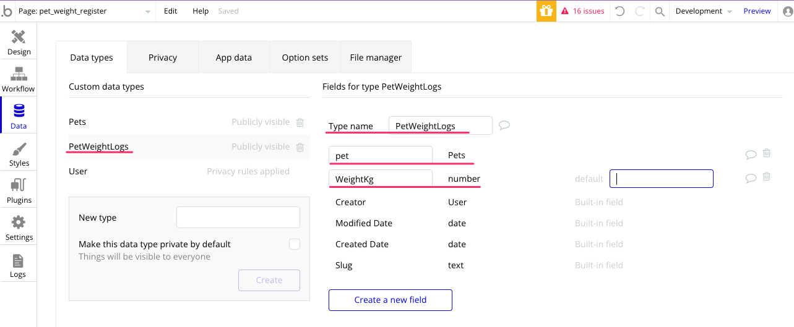

---

- Now that the database is ready, let's set up the screens.
- First, let's create a new page to manage the weight of pets.
- From Add a new page, select the page name `pet_weight_register` and the source is `pet_register`, then CREATE

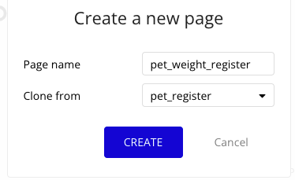


---

- Since this screen is also supposed to be transitioned from the pet details, specify Pets as the `Type of content` in the advanced settings dialog for the `pet_weight_register` screen

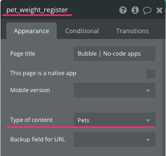

---

- Since the elements from the original pet registration screen are still there, delete the unnecessary ones and place the elements as shown in the reference image.
- However, the graph drawing area will not be placed at this time.

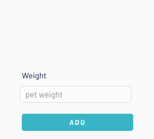


---

- At this time, we want to allow only numbers with a decimal point to be entered for the weight input element, so we will just set that
- Double-click on the pet weight input element and select `Decimal` for `Content format`.
  - Note that `Integer` is for integer input without decimal point.

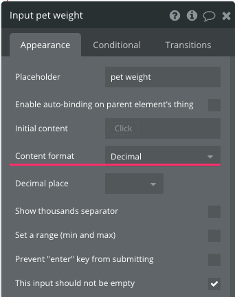

---

- Next, we will set up the workflow for the Save Weight button click
- Double-click on the ADD button, and select Start/Edit workflow from the Advanced Settings dialog

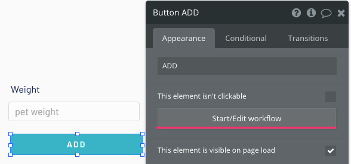

---

- Then you can see that some behaviors are already set for `When Button ADD is clicked
- This is because we copied `pet_register` when we created the page, so the workflow settings are inherited from that time.
- Since we will be defining new behaviors, we will delete the existing workflow.
- If you select the behavior of Step1 / Step2, you will see `delete` in the bottom right corner, so you can delete the behavior from there

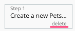

---

- Now let's set up the workflow.
- The first thing we want to do is to save the weight values entered on the screen to the PetWeightLogs that we prepared earlier.
- Please set this up based on what we have learned so far!

- I've included an explanation on the next page, so let's get started!

---

# :hourglass_flowing_sand:
# :hourglass_flowing_sand:
# :hourglass_flowing_sand:
# :hourglass:
# :hourglass:

---

- The first action to set is `Data(Thing)` --> `Create a new thing... `.

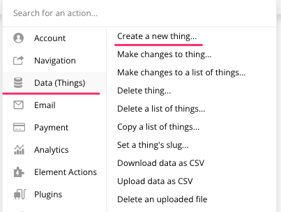

---

- Then, specify the type and field to be registered
- Since we are registering the weight of pets, the Type is `PetWeightLogs`.

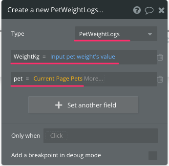

--- 

- So the fields to set are `WeightKg` and `pet`.
- If you don't set the `pet` field, you won't be able to determine which pet's weight it is, so specify it!
- If you don't set the `pet` field, you won't be able to determine the weight of the pet.


---

- Since we want to redraw the screen after registration to update the graph to be displayed later, let's define the behavior to redraw the screen after registration
- The action for screen manipulation was `Navigation`.
- If you look at the sub-menu, you will see that `Refresh this page` is the right action, so let's select it

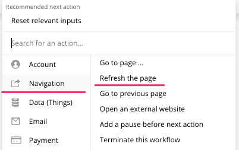

---

- Now that you've registered your pet's weight, it's time to prepare a link from the details screen.
- Let's open the detail page and create a link between Image and Birthday.
- Let's use `Link` of `Visual elements` for the link.

---

- There are two points. 1.

1. set the destination to `Destination page` 2.
2. give the pet information of the current page to the link destination

- The following page shows you how to set it up, so you can try it yourself.

---

- Like this!

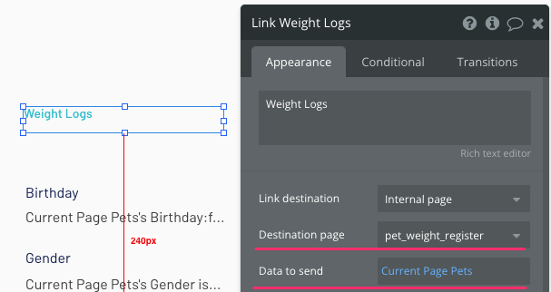

---

- Once you've created the link from the detail screen to the weight management, you'll need to prepare the reverse link as well!
- The idea is the same as the link in the detail screen.

---

- After setting up, let's go back to the list screen and run the preview.
- After moving to the list, detail, and weight management screens, enter a value in the Weight field and press ADD to redraw the screen, right?

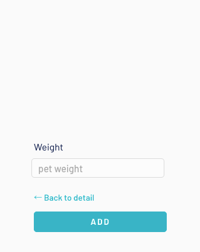

---

- Just to be sure, let's check that the data is registered in the database
- If you select `All PetWeightLogs` from the App data tab of Data, you should see the data registered on the left side, right?

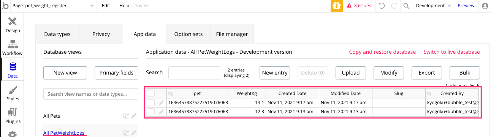

---

## Let's display the pet's weight graphically.

- Let's display the weight of the registered pets graphically as we did in Adalo.


---

### First, we need to install a plugin.

- Bubble doesn't come with graphing functionality by default, so we'll need to add it in the form of a plugin.
- In Adalo, we used Component, but in Bubble, we'll use Plugins.

---

- Select Plugins from the left menu to display the Plugins screen.
- Then press `+ Add plugins` in the upper right corner to search for plugins to add

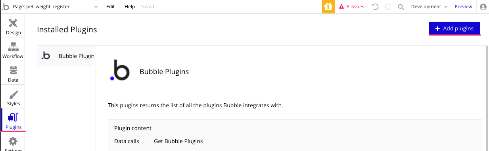

---

- When the `Install New Plugins` popup appears, type `chart` in the search window on the left panel.
- Then, the right panel will display the search results, and click the `Install` button for the `Chart Element` (probably the top one)

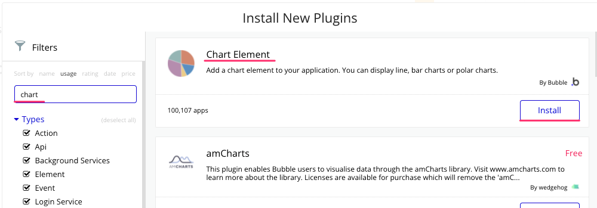

---

- When the installation is complete, click DONE to close the popup
- If Chart Element is included in Installed Plugins, you are good to go.

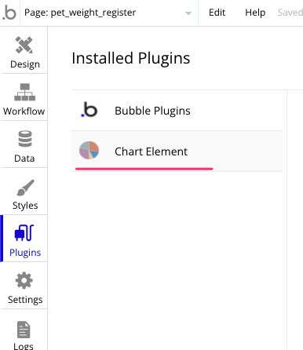

---

- There are two types of Bubble plug-ins: free and paid.
- Plugins marked `Free` or `By Bubble` in the list of plugins are free.
  - Especially the ones marked `By Bubble` are literally official Bubble plugins, so you can trust them for anything.
- On the other hand, plug-ins with a price are literally paid plug-ins.
- Since there are various plug-ins, when you install a plug-in, you should first look for a plug-in that is free and sufficient, and if there is no other plug-in but a paid plug-in, you may consider installing a paid plug-in.

---

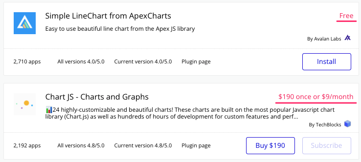

---

### Now let's do some actual graph drawing!

- Open the Design section of the `pet_weight_register` page.
- In the `Visual elements` section, you will see a new element called `Line/Bar Chart`, select it and drag it to the top of the weight input.


---

- Once drawn, a dialog box for detailed settings will appear as before, so let's set each item!
- The `Chart type` specifies the type of graph.
  - We'll use `Line` for the line graph.

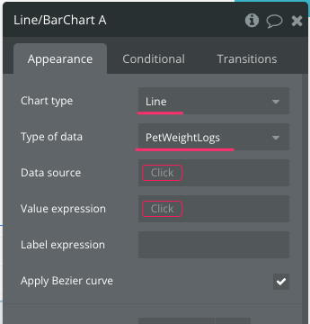

---

- The `Type of data` specifies the type of data to be graphed.
  - This time, we'll use `PetWeightLogs` to display the weight of pets.


---

- Then, specify the condition of the target data in `Data source`.
  - As in the list screen, first select `Do a search for`.


---

- The `Do a search for` dialog box will appear.
  - Select `PetWeightLogs` for `Type` to specify the type of the target data.

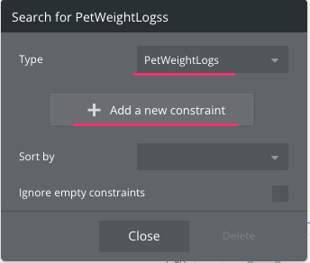

---

- This will display all weight data for all pets, so we need to specify the criteria for narrowing down the list.
  - Click on `Add a new constraint` to specify the criteria


---

- First, click on Click to display the fields of `PetWeightLogs` specified in Type.
- This time, we will target the data of the `Pet` associated with `PetWeightLogs`, which is the same as the currently displayed pet.

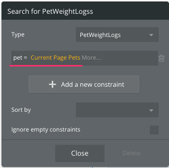

---

- If we express this as a condition, it will look like this, so let's set it
  ```
  pet = Current Page Pets
  ``` pet = Current Page Pets


---

- Finally, specify the order of the data.
  - To show the graph, we want to put the registered weights in order of newest to newest

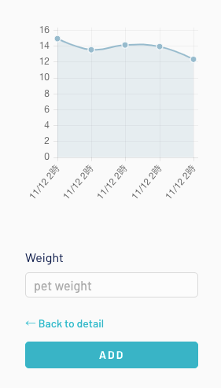

---

- Specify `Created Date` for `Sort by`.
  - Now we've specified the sort order key.
- Set `Descending` to `"yes"`.
  - Now we specify the order of the keys in descending order

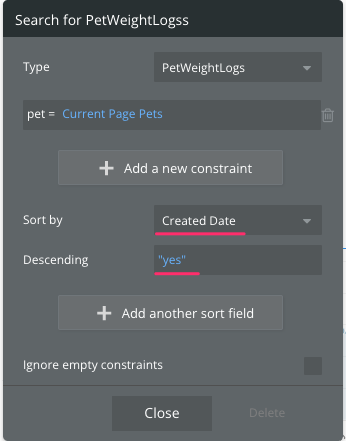

---

- If you want to order by oldest first, specify `"no"` for `Descending` to make it oldest first (ascending order).
- When you are done, click `Close` to close this sub-dialog.

---

- Finally, specify the X-axis and Y-axis to be drawn on the graph.
- In this case, the X-axis is the registration date and time, and the Y-axis is the weight.


---

- To set the X axis, use `Label expression`.
  - In this case, we'll use `Current point's Creation Date`.
- The Y axis is set to `Value expression`.
  - The Y axis is set to `Current point's WeightKg` this time

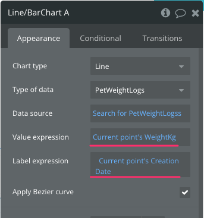

---

- The `Current point` refers to the individual data plotted for each of the `PetWeightLogs` specified in the target data type !

---

- Now let's go back to the list screen and preview it!
- Is the weight registered for the selected pet in the list displayed as a graph?
- Does the graph change as you add more and more weights in the same screen?

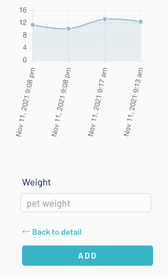

---

### Appendix4: Let's change the labels of the X-axis of the graph.

- At the moment, the labels on the X-axis are in a long date/time format, so you can change them to any format you like.
- For example

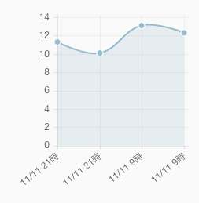

---

### Appendix5: Let's send a message when there is no weight data.

- In the current development, if there is no weight data for a pet, the graph drawing area will be blank and the page will not look good.

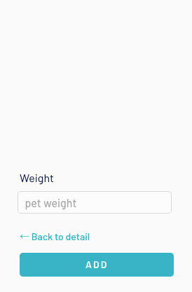

---

- So, let's try to improve usability by displaying a special message when none of the pet's weights have been registered!

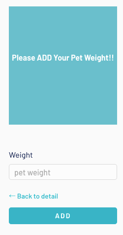

---

- In the corresponding image, a Shape with the same width and height as the graph element is prepared at the same position.
  - Place the message you want to display on top of it as Text, and group the Shape and Text together.
  - By grouping them together, you can treat them as one element.
- Set the following for the Shape
  - The element itself will always be hidden
  - If the number of PetWeightLogs in Conditional is 0, the element will be shown.
- In this way, the Shape can be displayed when no weight is registered, and the graph can be displayed when no weight is registered.

---

- Here's what the setup image looks like

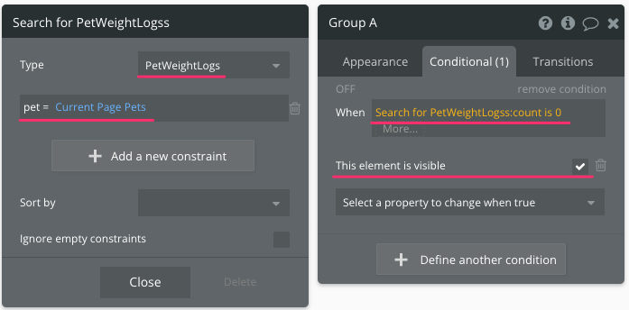

---

### Appendix6: Let's display different messages in the pet list.

- You need to be logged in to see the Pet List.
- Moreover, even if you are logged in, nothing will be displayed if no pets have been registered.
- However, it is difficult for users to understand why the Pet List is not displayed.

---

- So, let's send out different messages according to each status

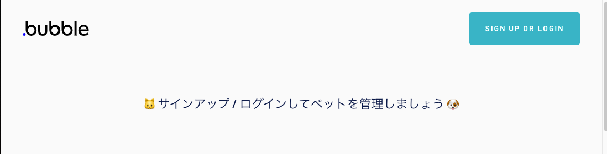
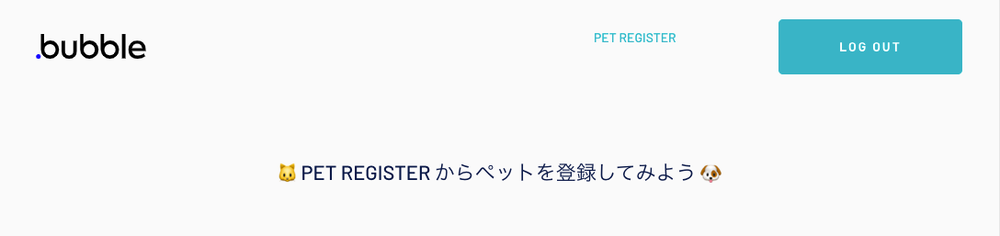 !

--- 

- The concept of the setting is the same as the one described above when the weight of the pet is 0.
- Prepare a message for each of these conditions, but hide them by default.
- Then, when each condition is met, the message will be displayed.
  - Whether the current user is logged in or not?
  - Is the current user logged in and does the user have at least one registered pet?
- The answers (settings) are written on the next page!

---

- Is the current user logged in or not?

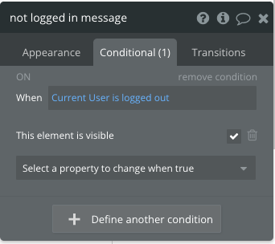

---

- Whether the current user is already logged in and whether there is at least one pet registered by the user?

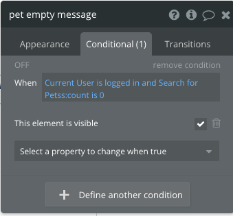

---

#### Appendix7: Let's create an update function by setting up a line from the detail screen to the update screen.

- As for the points, they are as shown in the following sheet! Please try to put them into practice!

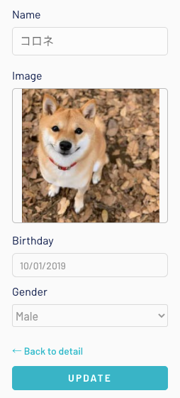

---

- Since the update screen has almost the same screen elements as the registration screen, let's clone `pet_register` and create `pet_update`!
- In the registration screen, the content of each input element (name, birthday, etc.) was empty, but in the update screen, we need to set the value of the data that has already been registered at the time the screen is displayed.
- From the dialog of each input element, there is an item that looks like this, and we can specify the initial value there.
  - Hint:bulb: Insert dynamic data
  - Hint:bulb: Initial content

---

- As for the behavior when the update button is clicked, it was `Create a new thing...` in `Data(Thing)` when it was a new registration. But this time it's an update, right?
  - Speaking of updating, change... Oh, there's an action that looks like that :yum:
- Finally, when we move from the detail screen to the update screen, we need to pass the information of the pet displayed in the detail screen. This is the part I learned in today's lecture!
  - Hint:bulb: Data to send

---

# Summary

- In this lecture, we started with how to use Bubble, and then went on to the actual design of the screen and integration with the database.
- The basic flow is similar to that of Adalo, but the workflow is a little more in line with why it is called a visual programming tool.
- In the next article, I hope to give a more in-depth lecture on Bubble, so stay tuned!

---

# That's all!
# Thank you for your time!
