**Programming Boot Camp**

# Bubble の基本

**東京工業大学 2023/11/04**
　
　
　
　
　
　　　　　　　　　　　　　　　　　　　**Naotake KYOGOKU**

---

## 目次
- Bubble とは (P3 〜)
- まずはユーザ登録とサインアップの部品を使って画面を作ってみよう (P25 〜)
- Bubble でのアプリ開発の概要説明 (P43 〜)
- ペット登録から一覧表示まで作ってみよう (P56 〜)
- データベースとつなげてみよう (P93 〜)
- ヘッダー部品を作っていこう (P203 〜)
- ペットの体重を管理しよう (P292 〜)
- まとめ (P349 〜)

---

## Bubble とは

- [Bubble](https://bubble.io/) はビジュアルプログラミングツールと呼ばれ、ノーコードツールではありますが、プログラミング的な発想が必要なツールとなります。
- 用意されているパーツから使用したいものを選び、それを画面にドラッグ＆ドロップしていくなどの操作は Adalo と同じです。
- ただ、配置したパーツに対して動きをつけていく部分については、プログラミング的な発想が必要となります。
- また、Adalo と違い、Web アプリケーション前提での開発を行い、それをスマホ表示に対応させていく形となります。

---

#### Bubble で作られたアプリの例

- あいホームバーチャル展示場: https://aihome-vr.com/
  - 物件のオンライン内見アプリ
  - 物件をストリートビューのような形でオンライン内見できるアプリです。
  - 参考: https://note.com/apopopo/n/n155b0df7f78c
    - Bubble のノウハウというよりノーコード開発の知見が書かれている

- 他にも色々あるので「Bubble 事例」などで調べてみてください！
  - 例: https://nocodedb.world/archives/3337

---

### Bubble に登録しよう

- Bubble の TOP 画面からメールアドレスを入力してアカウント登録
  - https://bubble.io/
  - "Get started" をクリック

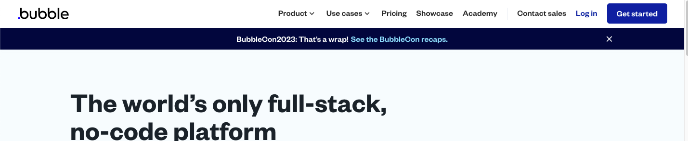

---
- アカウントは無料で登録できます
- ご自身のメールアドレスとパスワードを入力して "Start building" をクリック

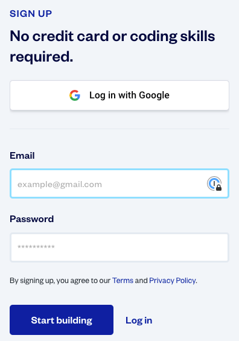

---

- 今日の目標を聞かれるので "BUILD" を選択

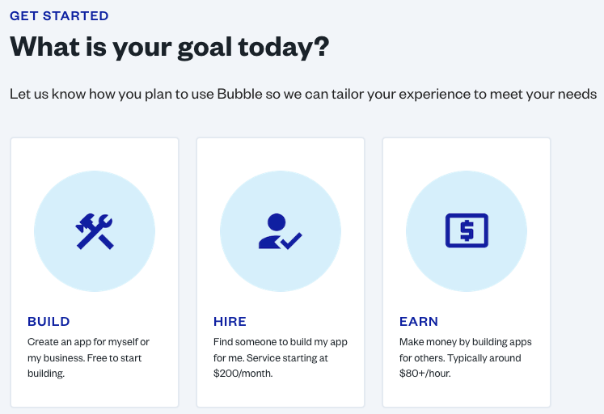

---

- 新しい技術を学ぶことにどの程度慣れているかを聞かれるので、皆さんご自身のレベルで選択してください


---

- Bubble で作るアプリのアイデアがどの段階かを聞かれているのですが、今回は講義の中で作るものが明確なので "EXECUTION" を選択しておきます

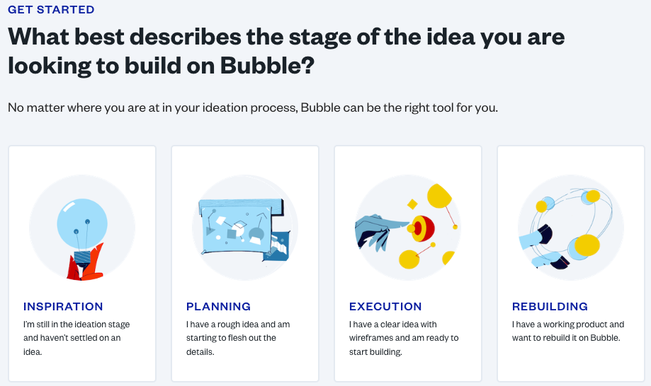

---

- 最後に Bubble をどこで知ったかを聞かれるので、適当に選択してください

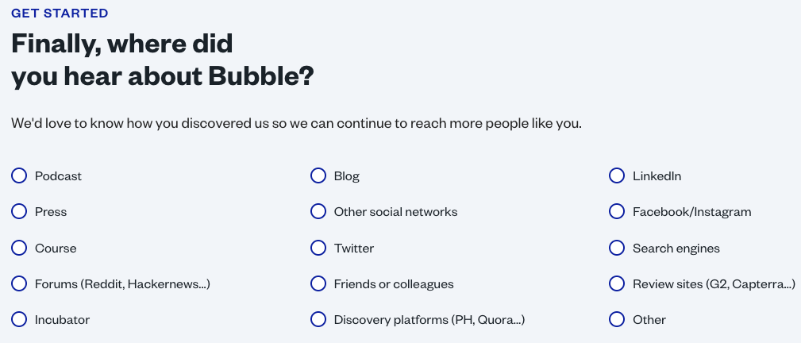

---


- すると、入力したメールアドレス宛に確認メールが送信されるので、ご自身のメールボックスを確認

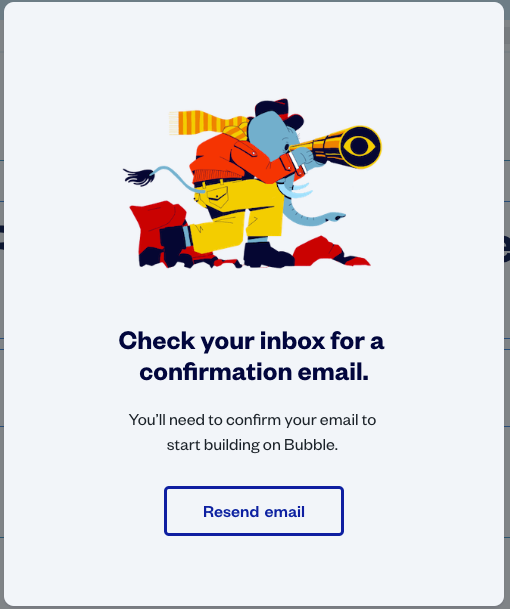

---

- "Verify Your Bubble Account" というタイトルで Bubble からメールが来ていると思うので、本文に記載の "Click here to confirm your email address" のリンクをクリック

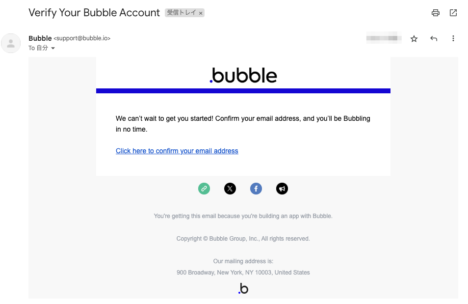

---

- Bubble の画面が表示され "Thanks for confirming!" と表示されていれば OK
- "Start building" をクリック

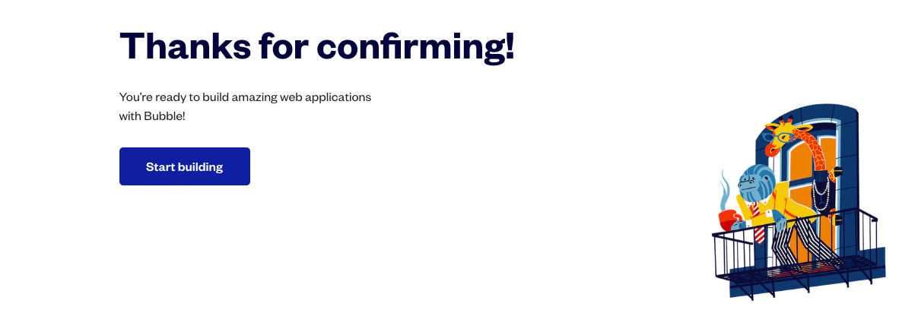

---

- Welcome ページが表示されるので "Get started" をクリック

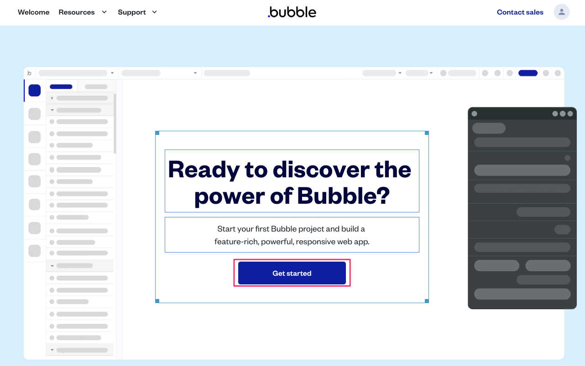

---

今から作成するアプリのプランを聞かれるので左側の FREE PLAN の "Start with basic features" をクリック

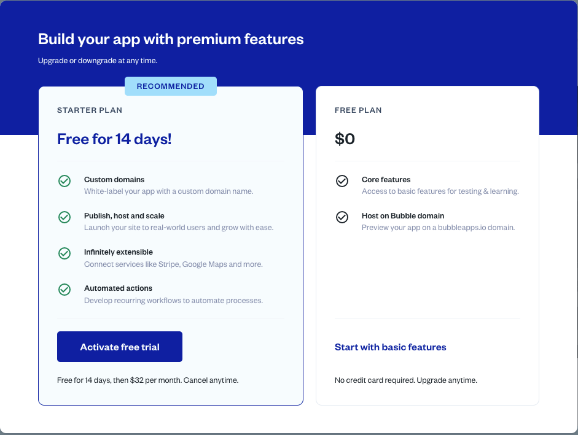

---

- 作成されると、Bubble のエディタ画面が表示され、初期設定の入力ガイドが表示されるので従っていきます

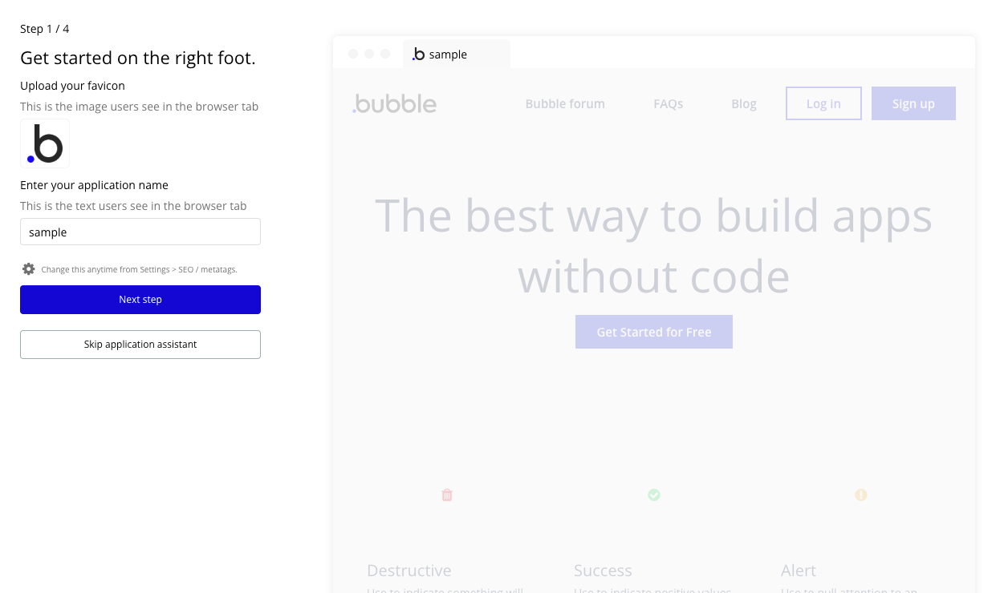

---

- Step 1/4 はこれから作成する Web アプリケーションの画面上での表示名を聞かれます
- おそらく先ほど入力したアプリ名が初期値として入っていると思うので一旦そのままで OK
- Next step をクリック

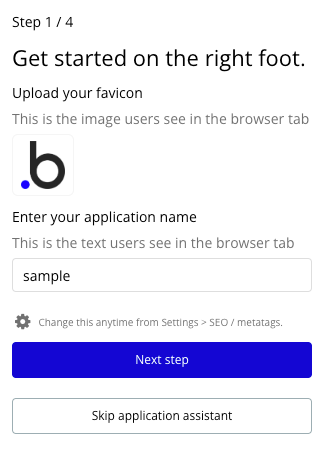

---

- Step 2/4 はアプリの標準のフォントを選択します
- 後からでも変えられるので一旦ここもそのままで Next step をクリック

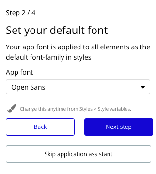

---

- Step 3/4 はアプリの標準的な各種要素のカラーを選択します
- ここも後から変えられるので一旦このままで Next step をクリック

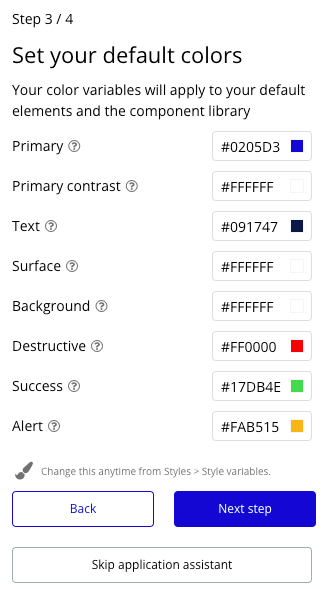

---

- Step 4/4 はアプリに対してプラグインを導入するかを選択します
- 右パネルに Bubble のオフィシャルプラグインがいくつか表示されていますが、こちらも後から導入できるので特に導入せずに先に進みます
- "Get started building" をクリック

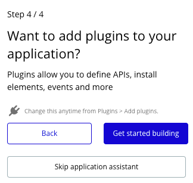

---

- このような画面が表示されたら OK です

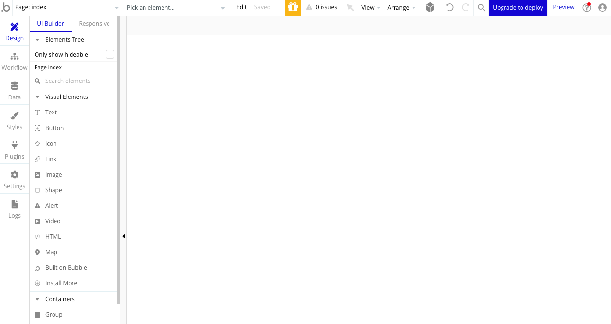

---

### まずは Bubble のテンプレートを動かしてみよう

- 画面右上の Preview ボタンをクリックしてください

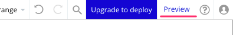

---

- プレビュー画面が起動します
- が、真っ白の画面しか表示されません
- Adalo と違ってテンプレートなどを選択していないため、何もオブジェクトが配置されていない状態の画面となります

---

- さすがに少し動きを見ていきたいので、Adalo と同じくアカウントのサインアップ・ログインを試してみましょう
- Bubble では、サインアップ・ログインの「画面」は用意されていませんが「部品」は用意されています
- その部品を組み込んでログイン画面を表現してみたいと思います
- :warning: 実際のサインアップやログインの機能はこのあと開発していくので今は紙芝居としてしか動きません

---

## まずはユーザ登録とサインアップの部品を使って画面を作ってみよう

- :warning: 画面の色々な部品を触っていきますが、各パーツの説明は後ほど行います
- まずは最低限の部品の説明を行い、ユーザ登録画面を作ってみます

---

### 3 つのメイン操作

- Bubble では主に 3 つの操作を使い分けていきます
  1. Design
  2. Workflow
  3. Data
- 左メニューからそれぞれを行き来することができます

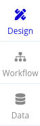

---

#### Design

- このうち Design の説明だけ先に行います
- ユーザーインターフェースを作るために画面上にコンポーネントを配置するモード
- 左パネルに UI のコンポーネント類、右パネルに実際の画面編集領域となっています

---

- 画面のテイストは Adalo と同じですね

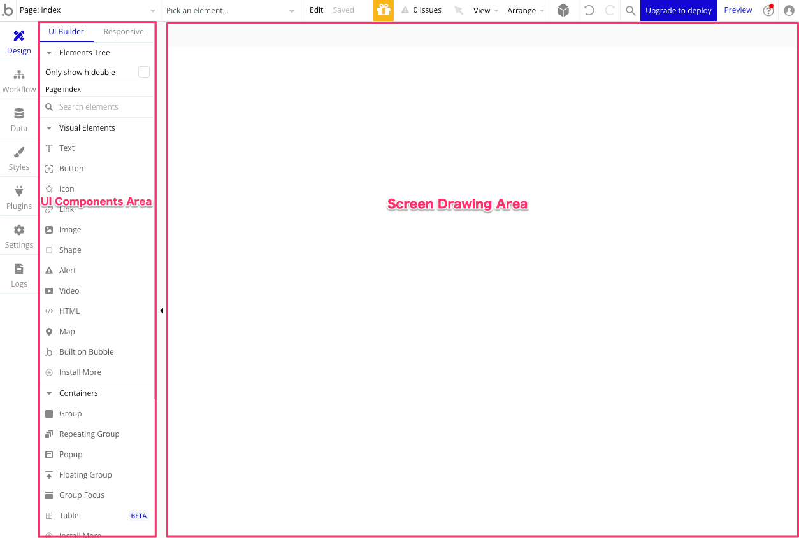

---

- それでは、ユーザ登録を作っていきましょう！

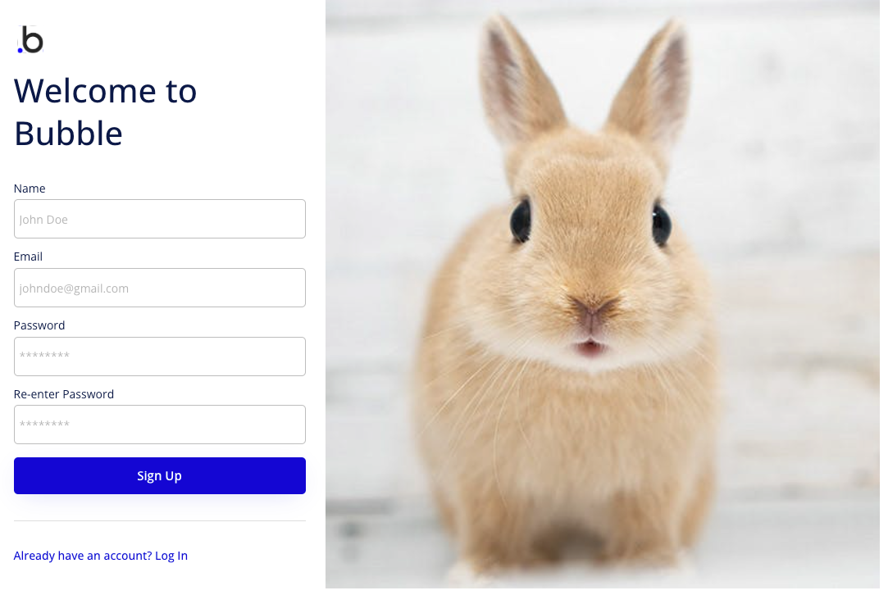

---

- まずは Bubble に標準で用意されているサインアップ・ログインの部品を、配置していきます
- 画面上段に黒の四角いアイコンがあると思いますので、それをクリック

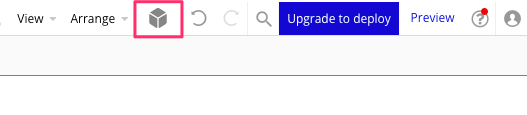

---

- すると、画面の右側から `Component Library` というエリアが出てきたと思います
- これは文字通り、Bubble で用意されている共通部品の一覧になります

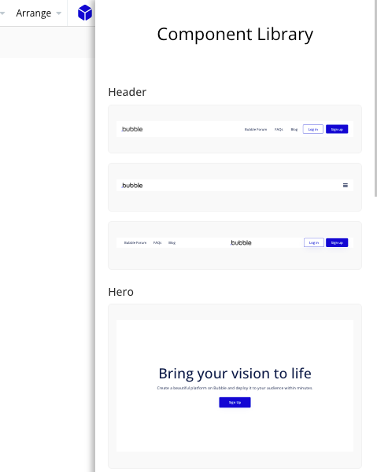

---

- このエリアの一番下に画像付きのサインアップ / ログイン用の共通部品があるのでそれを Drawing エリアへドラッグ & ドロップします

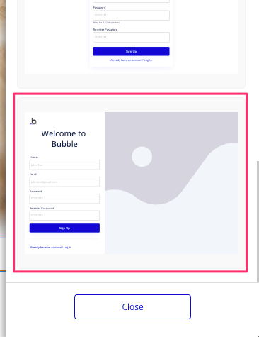

---

- おそらくこんな感じで画面上部にピッタリ収まるよう配置されたかと思います

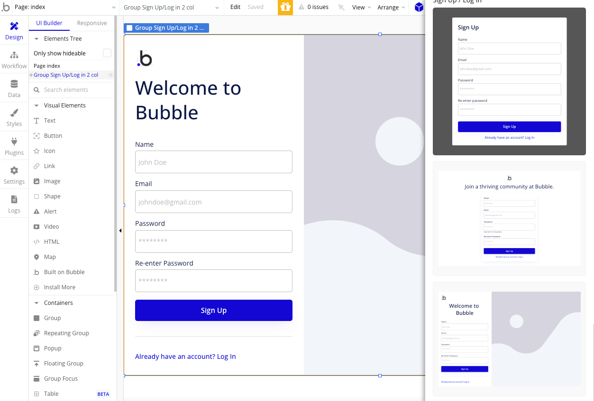

---

- ⚠️この部品は「サインアップ」と「ログイン」が一緒になっている部品のため、移動させる際などは注意
- 仕組みとしては、今見えている「サインアップ」の部品の上に「ログイン」のパーツがあるのですが、それが非表示になっています

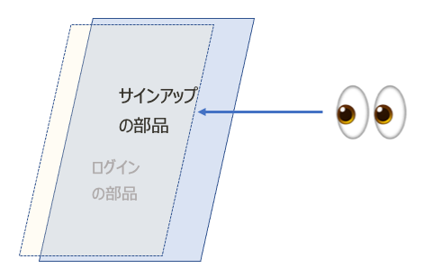

---

- ここでプレビューを実施してみます
- 最初はサインアップの部品が表示されていますが、下にある `Already have an account? Log In` というリンクを押すと、部品の内容がログインに切り替わりますね

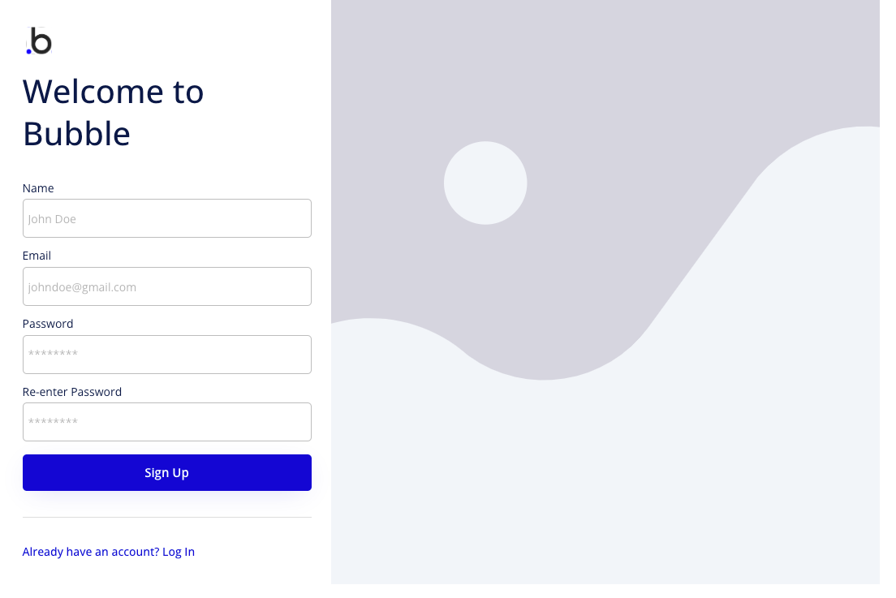

---

- こっちがログイン部品

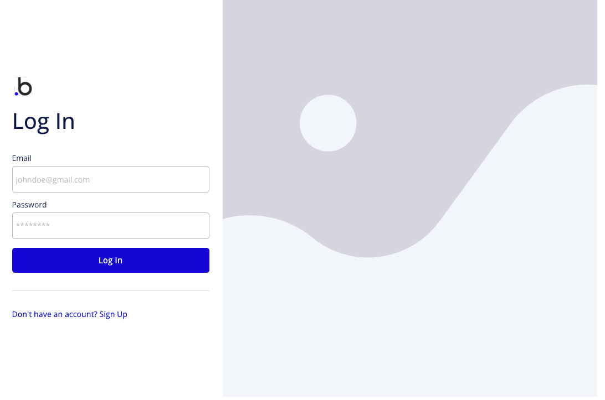

---

- まだ今の時点では、"Sign Up" ボタンや "Log In" ボタンを押しても何も起きません
- これは、ボタンを押した時にどう言うアクションを実行して欲しいか、Bubble にまだ教えていないからできません
- この設定については追って説明していきますので、次に進んでいきましょう 🙋‍♀️

---

#### スマホ対応について

- 冒頭でお伝えした通り、Bubble のアプリは Web アプリケーションの前提となっています
- Bubble のアプリをスマホ対応させる場合、 **レスポンシブデザイン** という考え方を取り入れます

--- 

- まずは動きを見てみましょう
- ブラウザの横幅を縮めてみてください

https://matsushitahome.com/


---

- レイアウトが崩れることはなく、自動的に要素の配置が変わり、スマホサイズに適した配置になったと思います
- これがレスポンシブデザインというものです
- Google さんはこのように説明されています

```
ユーザーのデバイスの種類（パソコン、タブレット、モバイル、非視覚的ブラウザ）に関係なく、
同じ URL で同じ HTML コードを配信しつつ、画面サイズに応じてレンダリング方法を変更します。
```

参考資料
https://developers.google.com/search/mobile-sites/mobile-seo/?hl=ja

---

- ポイントとしては下記の点ですね
1. 表示しているページの URL は同じ
2. 画面サイズに応じてレンダリング方法を自動的に変える

---

- もう少し噛み砕いて言うと、画面サイズに応じて、要素が伸びる／縮む、折り返す／折り返さない、表示する／表示しないを制御する
- これを各項目レベルで設定してあげることで、自動でレスポンシブデザインに対応させることができます
  - 実際の開発時には、設定してプレビューして動作確認していくと良いと思います
- Bubble のアプリケーションをレスポンシブ対応させていく話は次回 Bubble 2 回目の講義で説明予定です🙋‍♀️

---

## Bubble でのアプリ開発の概要説明

次に、Bubble でのアプリ開発の概要を説明していきます

---

### 3 つのメイン操作

- 残りの 2 つの操作を見ていきます
  1. Design
  2. Workflow
  3. Data


---

#### Workflow

- 画面に動きをつけるためのモード
  - 例）ボタンが押された時に、画面遷移する
  - 例）ボタンが押された時に、データを操作する
- ここが、少しプログラミングの考え方を必要とする部分となります

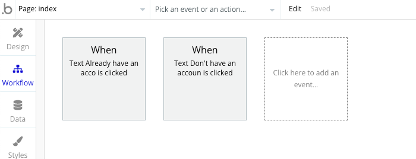

---

- ちなみに、すでにいくつかの箱があると思います
- これは先ほど使ったサインアップ / ログインの共通部品に設定されていたワークフローの定義となります。
  - 具体的にはサインアップ部品とログイン部品の表示切り替えを行なっているワークフローになります


---

#### Data

- データを定義したり操作したりするモード

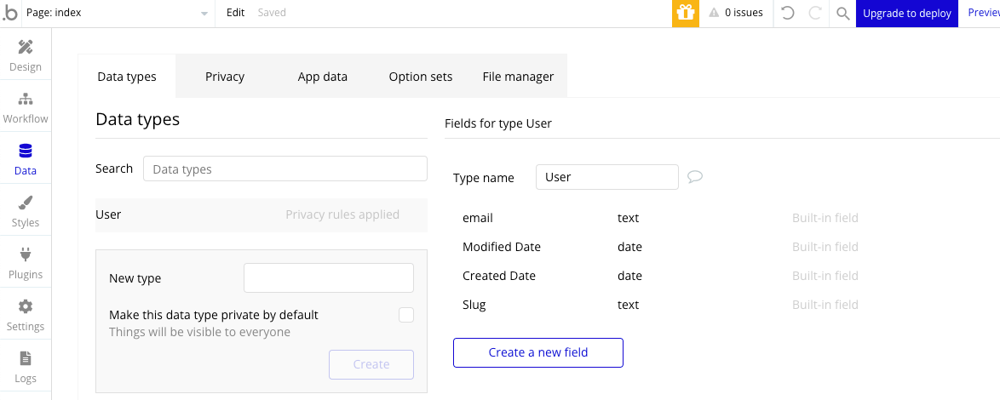

---

- "App data" タブを選び、 "All Users" のリンクをクリック
- すると、右パネルに登録済みのユーザ一覧のデータが表示されますが、まだサインアップ機能を作っていないので、ユーザがまだ 0 件だと思います

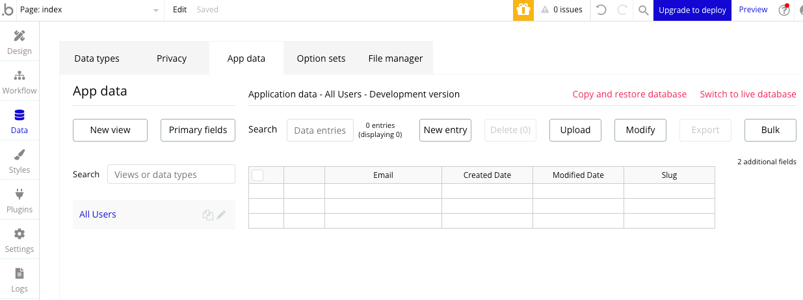

---

#### その他の操作について

その他の操作（メニュー）についても簡単に説明します

---

#### Styles

- スタイルに名前をつけてあげることで、アプリケーション全体で汎用的に使用可能（部品ごとに個別指定も可能）

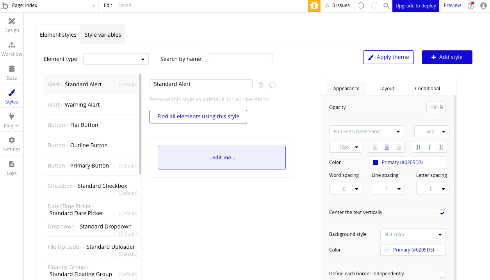

---

#### Plugins

- Adalo で折れ線グラフのコンポーネントを追加したように、Bubble にもアプリケーションを拡張するための様々なコンポーネントが公開されています
- Bubble ではこれを「プラグイン」と呼びます
- Bubble のプラグインには無料 / 有料のものがあるので、お使いになる際には確認しましょう

---

#### Settings

- Bubble のプランの変更やアカウントに関する操作
- 今回の講義では扱いません

---

- Settings の Languages では Bubble が提供しているメッセージを一元管理できます
  - アプリケーションを使うメインユーザ向けにロケール（言語設定）を変更可能
  - このメッセージを変更することで、システム全体でメッセージ管理を統一できます
  - アプリ全体で共通に使えるメッセージ類を変えられるし、デフォルトのメッセージを変えることも可能
  - アプリ固有のメッセージを追加することも可能
- 今回の講義では扱いません

---

#### Logs

- アプリケーションを動かしたときのログを見ることができます
- アプリケーションをプレビュー表示しながらログを見ることも可能です
- 今回の講義では扱いません

---

#### これから作っていく画面の全体像

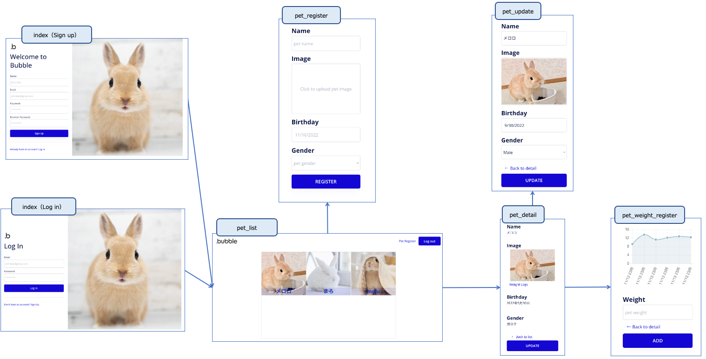

---

## ペット登録から一覧表示まで作ってみよう

- Adalo での会で作成した画面要素やデータ構造と同じものを作っていきます
- そのため、Bubble の会では画面とデータベース操作を一緒に作っていきます❗️❗️
- まずはペットの登録画面を作成し、そのペットを一覧に表示するところまで作ってみましょう❗️

---

#### ペット登録画面を作成していきます

- 画面左上の `Page: index` をクリックするとポップアップが表示されます
- ポップアップの中から `Add a new page...` をクリック


---

##### ちなみに...

- ここには現在作成中のアプリケーションの中にある「ページ」や「共通コンポーネント」の一覧が表示されています
- Adalo では 1 つのキャンバスにすべての画面が表示されていましたが、Bubble では 1 つのキャンバスで 1 つの画面を操作していく操作になります
- そのため、画面間の移動はここから変更する必要があるので覚えておきましょう :raising_hand:

---

- `Add a new page...` をクリックすると新しい画面のポップアップが表示されます
- `Page name` は画面の名前となるので、空白などを含めずに英数字だけで入力します
  - 今回は `pet_register` としましょう

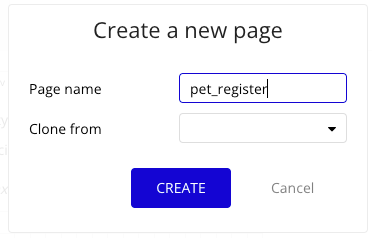

---

- `Clone from` は似たような画面を作りたい時に、コピー元となる画面を選択してその画面のコピーを作ることができます


---

- 例えば登録画面と編集画面などは画面要素がほとんど同じになるので、登録画面を作った後に編集画面を作る時に "Clone from" に登録画面を選択すると、開発工数の削減につながります


---

- 今回は未選択のままとします
- "CREATE" ボタンをクリック


---

#### ペット登録画面を組み立てる

- Adalo で作成したペット登録画面のイメージを参考に画面を作ってみましょう


---

#### ペットの名前

- まずはペットの名前を入力するテキストボックスを配置します
- 左パネルの "UI Builder" から `Input forms` の中にある `Input` を選択
- そして右パネル上で配置したい場所でクリックすると入力欄が表示されます

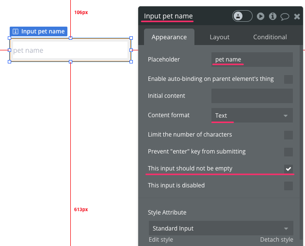

---

- 要素をダブルクリックすると要素の様々な情報を設定できるダイアログが表示されますので、必要な項目を設定していきます
- `Placeholder` はテキストボックスが未入力状態の時に表示される補助文言です
  - 今回は「pet name」とします


---

- `Content format` はテキストボックスに入力できる値の形式を指定できます
  - 今回は文字列の入力となるので "Text" のままとします


---

- `This input should not be empty` は入力必須にするかどうかを指定できます
  - 今回は必須としたいのでチェックをつけます

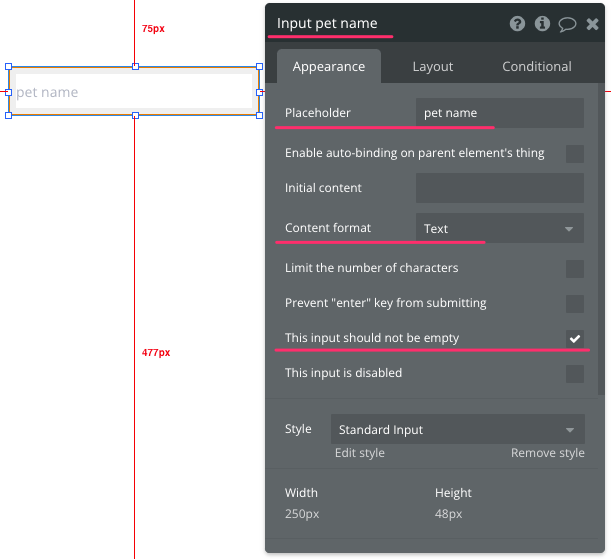

---

- ダイアログ先頭の部分をクリックすると、このテキストボックスの要素に対して名前を付けることができます
- これは後々ワークフローを定義するときに便利になるのでここでは "Input pet name" と指定しましょう


---

- まずはここまで設定したら OK です
  - ほかにも細かく指定ができますが、ここでは説明を省略します
  - 気になる方は見てみてください :mag:

---

#### ペットの画像

- 次にペットの画像をアップロードする要素を配置します
- 左パネルから `Picture Uploader` を選択し、右パネル上でペットの名前の下に **ドラッグして** 要素を配置します

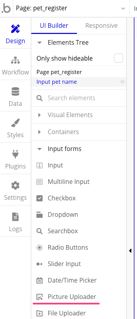

---

- この要素も同じくダブルクリックから要素の情報を設定します
  - 今回は `Placeholder` に "Click to upload pet image" と入力します
  - 要素の名前として "Input pet image" を指定します
  - `This input should not be empty` はチェックをつけて必須にします

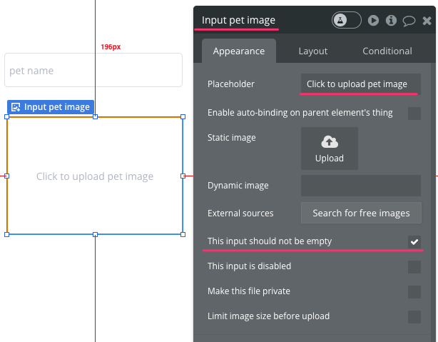

---

#### ペットの誕生日

- 次にペットの誕生日を入力するための要素を配置します
- 左パネルから `Date/Time Picker` を選択し、右パネル上でドラッグして要素を配置します

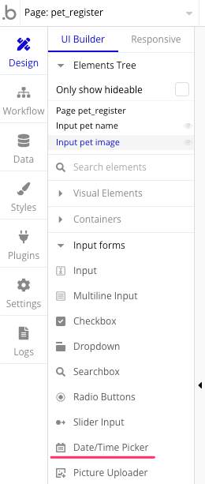

---

- こちらも要素をダブルクリックして要素の詳細を設定します
  - `Input type` に Date を選択することで日付入力のみとなります
    - ここで Date & Time を選択することで日付と時刻の入力が可能です
    - 今回は Date とします

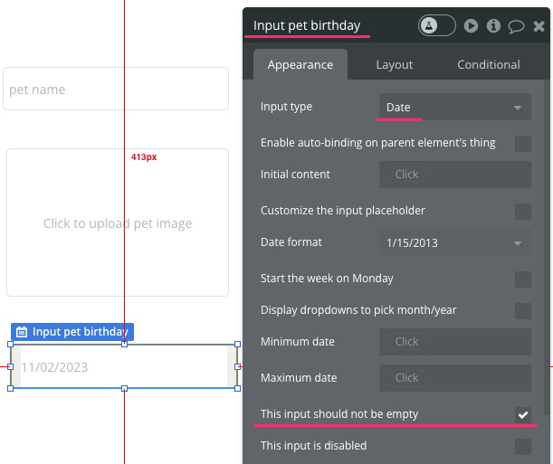

---

- `This input should not be empty` はチェックをつけて必須にします
- 要素の名前として `Input pet birthday` を指定します


----

#### ペットの性別

- 最後にペットの性別を選択するための要素を配置します
- 左パネルから `Dropdown` を選択し、右パネル上でクリックして要素を配置します

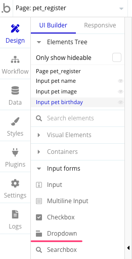

---

- こちらも要素をダブルクリックして要素の詳細を設定します
  - `Placeholder` に "pet gender" と入力します
  - `Choices` に "Male" と入力したら Enter キーで改行し、次の行に "Female" と入力します

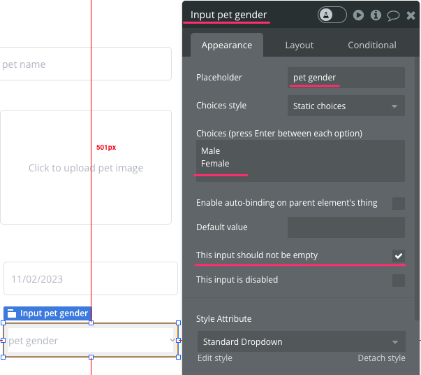

---

- `This input should not be empty` はチェックをつけて必須にします
- 要素の名前として `Input pet gender` を指定します


---

#### 登録ボタン

- ここまでペット情報の入力ができたら登録ボタンを配置します
- 左パネルの `Visual elements` の中にある `Button` を選択し、右パネルでクリックして要素を配置します

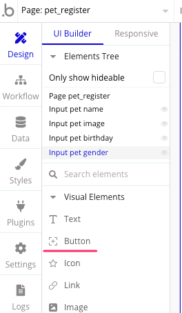

---

- こちらも要素をダブルクリックして要素の詳細を設定します
  - Appearance タブの上部にある「...edit me...」と入力されている部分を編集して「REGISTER」と入力します

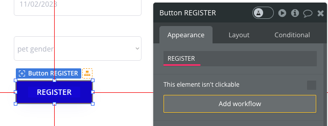

---

#### 各入力要素にラベルをつけましょう

- Adalo の時の画面のように、各要素の左上にラベルを用意しましょう
- 左パネルの `Visual elements` の中にある `Text` を選択し、右パネルでドラッグして要素を配置します

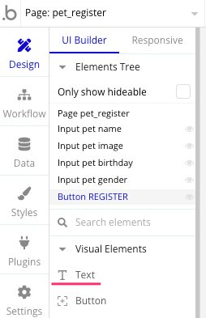

---

- 配置する際、高さは 30px 以上になるように配置してください
  - そうしないと、要素の中身が正しく表示されないためです！
  - 要素を配置した後に詳細ダイアログ Layout タブから `H` の値を編集することもできます！

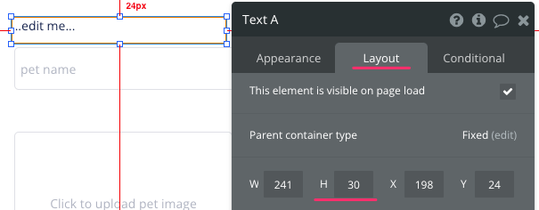

---

- こちらも要素の詳細を設定します
  - Appearance タブの上部にある「...edit me...」と入力されている部分を編集して「Name」と入力します
  - ダイアログ中段にある `Style` に `Heading 5` を選択します


---

- 同じ要領でその他のラベルもつけてみましょう
  - Name
  - Image
  - Birthday
  - Gender

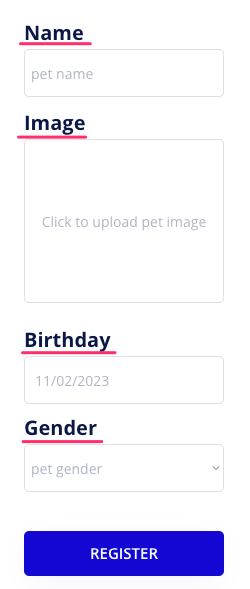

---

- 同じ手順でもよいですが、先ほど作った Name のラベルをコピーして使い回すことで手間を省けます
  - コピー（Ctrl + C）してペースト（Ctrl + P）し、ラベルの内容だけ書き換える
  - Mac であればコピー（Command + C）とペースト（Command + P）


---

- 最後にすべての要素の幅を 220px に統一してください
  - 各要素をダブルクリックしたときのダイアログから `W` (Width) の値を 220 に統一します
  - これは画面表示したときの見栄えを整えるためです

---

- 一つずつ変更していくこともできますが、要素が多いので一括で変更してみましょう
- 要素を全て選択した状態で右クリック、Edit を選択
  - 全ての要素をドラッグで選択

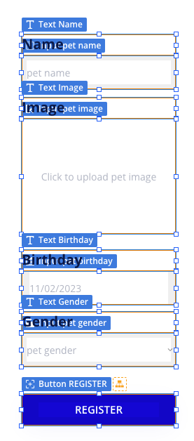

---

- 全て選択している状態で、どれか一つの要素を右クリック
- 表示されるサブメニューから Edit を選択

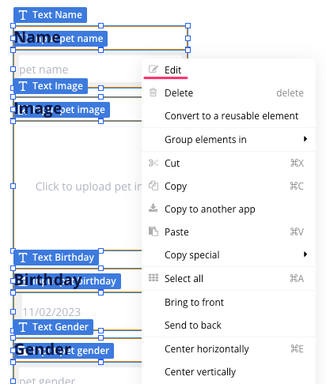

---

- するとダイアログが表示されるので、選択中の要素数が「9」であることを確認
- 問題なければ、ダイアログの中から Layout タブを開き `W` (Width) の部分をクリック

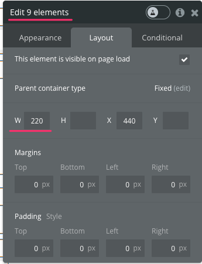

---

- すると選択中の要素に対して幅（W）と高さを一律で設定できるので、`W` に 220 を入力して完了
- "Apply changes to eleents" をクリック


---

#### 最後に要素を整理してプレビュー

- 先程と同じくすべての要素をドラッグで選択し右クリックから `Center horizontally` を選択し、入力フォームの横位置を中央に統一します

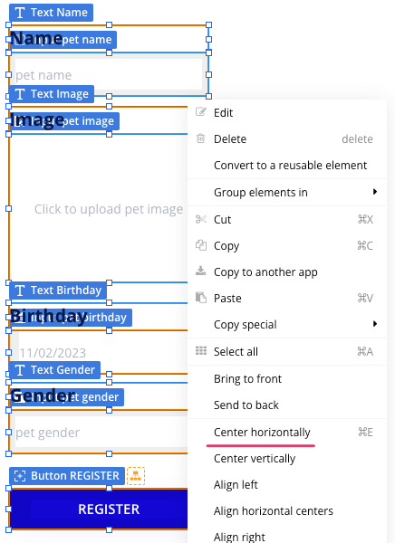

---

- ここまで出来たら画面右上にある `Preview` をクリックしてプレビューを表示して動きを見てみましょう！

---

- すべての要素が表示されていますか？
- すべての入力フォームに値を入力できますか？
- 画像を指定すると表示されますか？

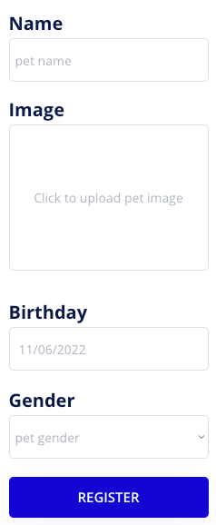
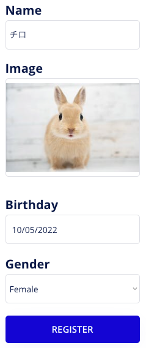

---

### データベースとつなげてみよう

- これで画面レイアウトが整ったので、いよいよデータベースとつなげてみましょう

---

#### まずはペットの情報を保存するための箱を用意します

- 左メニューのタブから Data を選択
- すると Data types タブを選択し、その下にある Custom data types の中から `New type` と書かれたテキストボックスに "Pets" と入力してください

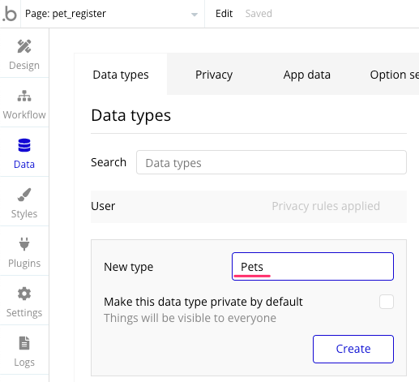

---

- そして `Make this data type private by default` のチェックをつけて `Create` ボタンをクリックします

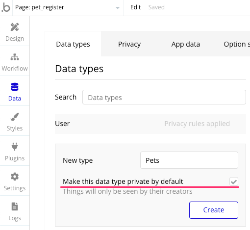

---

##### ちなみに...

- Adalo と Bubble ではデータベースに関する各要素の呼び方が一部異なります

- Type: データの型（箱）を定義したもの
  - Adalo でいうところの Collection
- Field: データの型を表現するための要素
  - Adalo でいうところの Property

---

- 作成した Pets の type に対して要素（field）を追加していきます
- `Data types` から `Pets` を選択
- 右側の `Fields for type Pets` の下にある `Create a new field` をクリック

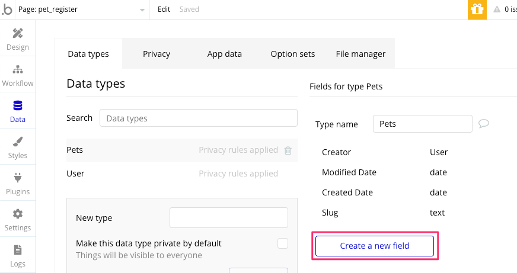

---

- するとポップアップが表示されるので必要な情報を入力します

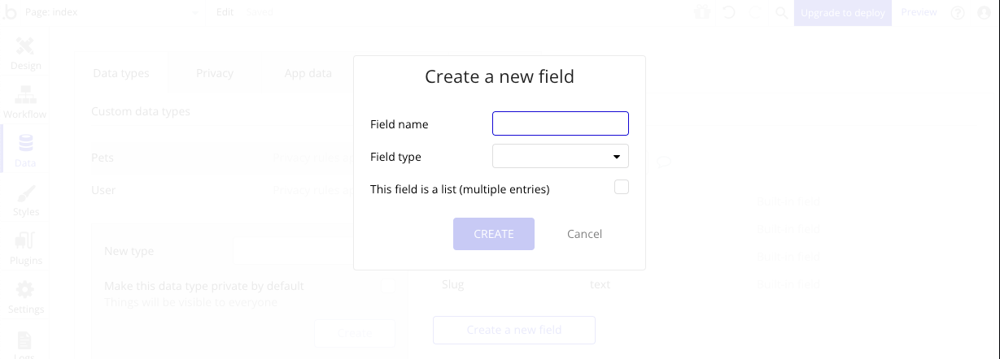

---

- `Field name` には要素の名前を入力します


---

- `Field type` には要素の種類（テキスト、数字、日付など）を選択します


---

- Adalo では Relationship から type 同士の関連を指定できました
- Bubble では `Field type` の選択肢の中に、登録されている type も表示されているので、そこで関連付けたい type を選択することで Adalo と同様のことが実現できます


---

##### それでは Pets type に必要な field を追加していきましょう

- Name: text
- Image: image
- Birthday: date
- Gender: text

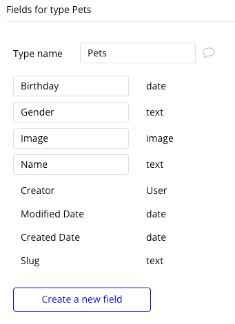

---

### 登録ボタンをクリックしたらペットを登録できるようにする

- ペットの情報を格納するための箱が準備できたので、いよいよ登録ボタンを押したときにデータベースに保存する動きをつけていきます
- Bubble では動きを設定するのはすべて Workflow タブで操作をしていきます
- いきなり Workflow タブから設定も出来ますが、今回は動きをつける元となるボタンからワークフローの設定をしていきます

---

- 左メニューから Design タブを選択
- 左上から "pet_register" 画面を選択
- 右パネルからペット登録画面の "REGISTER" のボタンをダブルクリックします
- "Appearance" タブにある `Add workflow` をクリックします

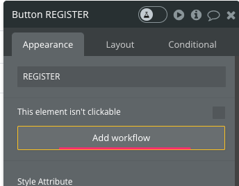

---

- すると Workflow タブに切り替わり、When の部分に `Button REGISTER is clicked` と表示されていると思います
  - これは文字通り "REGISTER" ボタンを押したときのワークフロー定義になります

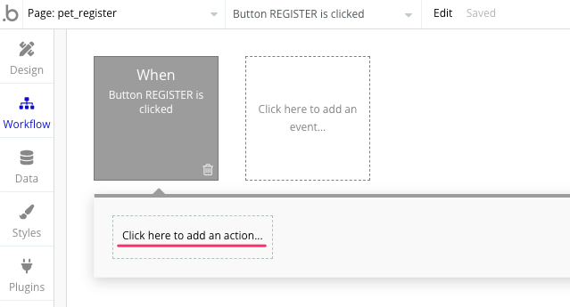

---

- なので、その下にある `Click here to add an action...` を選択して、ボタン押下時の振る舞いを設定していきます


---

- `Click here to add an action...` を選択すると、様々なアクションを指定できるポップアップが表示されます
- 今回のようにデータベースに関する操作（アクション）の場合 `Data(Things)` を選びます


---

- すると下位要素がさらに表示されると思いますので、その中から `Create a new thing...` を選択します


---

- `Create a new thing...` のダイアログが表示されるので、今回登録するタイプを指定します
  - 今回は Pets ですね
- すると `Set another field` というボタンが表示されるので、タイトルの通り画面で入力された項目を Pets の "field" にセットしていきます

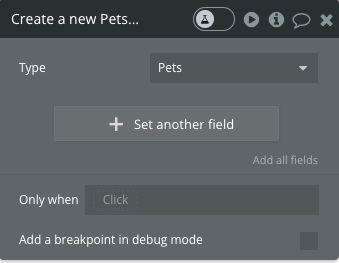

---

- ここでは Pets に保存したい項目の "field" 名を左辺に指定し、右辺に実際にその "field" に保存する値を指定します
  - まず、左辺に `Name` を選択します

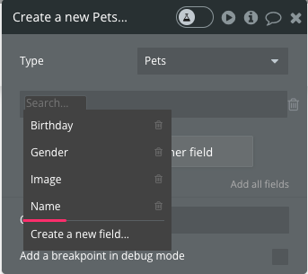

---

- 左辺を指定すると `=` に挟まれて今度は右辺に `Click` というのが表示されると思います

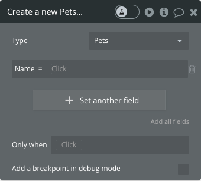

---

- ここをクリックすると何やらいろいろな選択肢が出てきます
- 詳細はここでは割愛しますが、左辺に選択されたフィールドに対して設定する対象を指定します

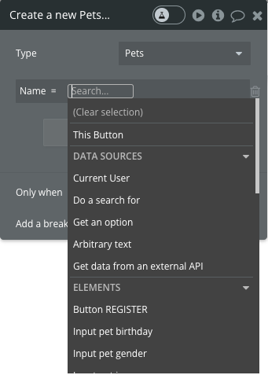

---

- 今回は画面で入力されたペットの名前になるので `Input pet name` という項目を選択します
- 選択肢が多い場合などは項目名を入力して絞り込むこともできます
  - キャプチャでは "Input" と入力して絞り込んでいます

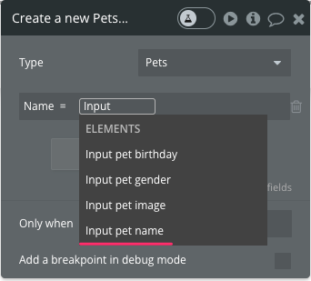

---

- この `Input pet name` というのは画面を作るときに入力要素に対して名前を付けたものがここに表示されています
- こうすることで、例えば 1 つの画面に複数の入力要素が存在したときにも、それらを一意に識別しやすくなります


---

- `Input pet name` を選択するとさらに選択肢が表示されます
- ここでは画面で入力されたペットの名前の「値そのもの」を使いたいので `'s value` を選択します
  - その他の選択肢である `is valid` と `isn't valid` は入力された値が正しいかどうかの判定結果を使いたい時に利用します

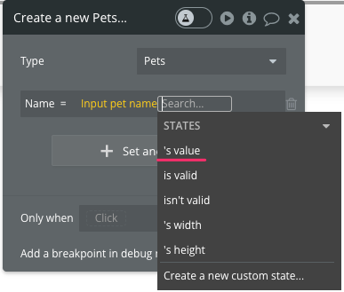

---

- すべて指定するとこんな感じ

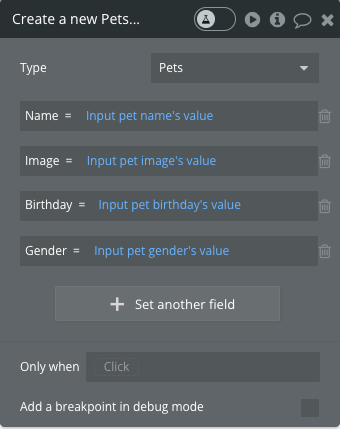

---

### 動かしてみよう！

- ここまで設定したら実際にプレビューでペットが登録されるかどうかを確認してみましょう
  - ちなみに "Ctrl + P" をクリックするとプレビュー表示ができます（ショートカットキー）
- 入力要素をすべて埋めて "REGISTER" ボタンをクリックしてみましょう
- 画面としては特に何も起こらないですが、実際にデータが登録されたかどうか見てみましょう

---

- プレビューを閉じ Data タブを開いて App data を選択、そして左パネル `All Pets` を選択したときに、先ほど画面から入力された情報が保存されていることを確認してください

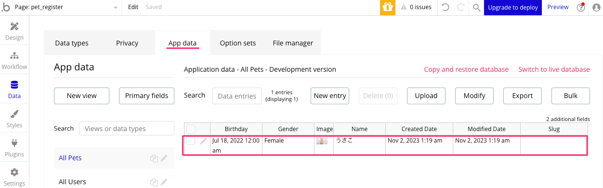

---

- これで画面で入力した内容をデータベースに保存するところまで出来ました！ :tada:

- 続いて、画面遷移を作り込んでみます

---


#### ペットの一覧画面の枠だけ用意する

- まず最初にペットの一覧ページの枠だけを用意します

- 画面左上の `Page: index` をクリックするとポップアップが表示されます
- ポップアップの中から `Add a new page...` をクリック

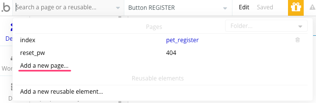

---

- `Add a new page...` をクリックすると新しい画面のポップアップが表示されます
- `Page name` は`pet_list` としましょう
- `Clone form` は今回は空欄
- "CREATE" ボタンをクリック

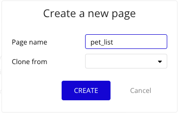

---

- 真っ白な画面だと何画面か分からなくなるので、Visual elements から Text ラベルだけ配置して、ペット一覧としておきましょう
- これで先にペット一覧画面の枠だけできました

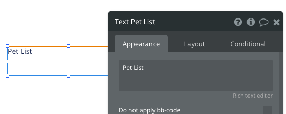

---

#### ペット一覧画面への画面遷移をしてみよう

- 左上から pet_reigster のページを選択
- 左メニューから Workflow タブをクリック
- 先ほど設定した "REGISTER" ボタンをクリックした時の振る舞いが表示されていると思います

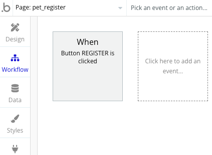

---

- ここで "Create a new Pets..." の右にある `Click here to add an action...` をクリック

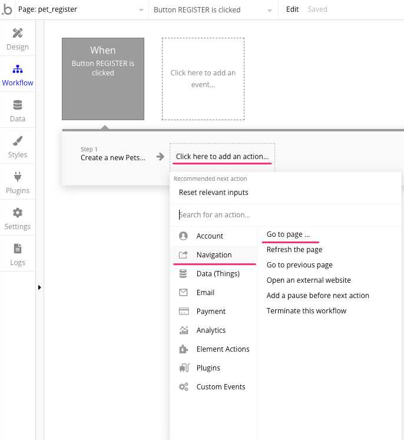

---

- 今度は `Navigation` を選択し、下位要素として `Go to page...` をクリック


---

- するとダイアログが表示されるので "Destination" に遷移したい画面を選択します
- 今回はペット一覧画面へ遷移したいので `pet_list` を選択します


---

- それではプレビューしてみましょう
- ペット登録画面が表示されたと思うので、先ほどと同じようにペット情報を入力し "REGISTER" ボタンをクリックします
- すると、ペット一覧画面に遷移したと思います

- これで画面遷移もマスターしました！ :tada::tada:

---

### ペットの一覧表示

- 次にペットの一覧画面を作り込んでいきましょう

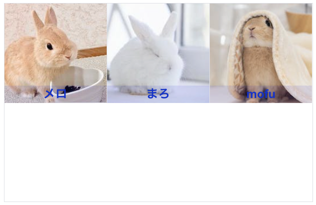

---

- 左上のページ一覧から `pet_list` を選択
- 先程用意したペット一覧の text は削除しておきましょう
  - 要素を選択して Backspace で OK

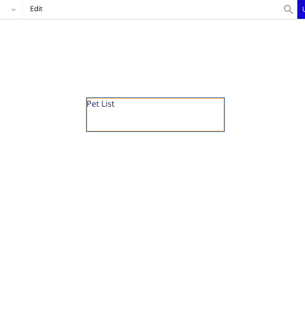

---

#### ペット一覧画面を作り込んでいきます

- 今回のように、同じ要素を繰り返し表示する場合、 `Containers` の中から `Repeating Group` を選択
- 右パネルのキャンバスにドラッグします

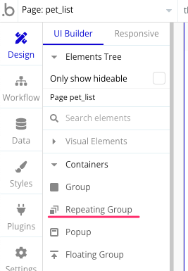

---

- 要素の詳細設定ポップアップが表示されるので設定していきます
- 一番上の要素名に `pet list` を入力
- `Type of content` には、繰り返し表示するデータのタイプを指定します
  - 今回は `Pets` ですね

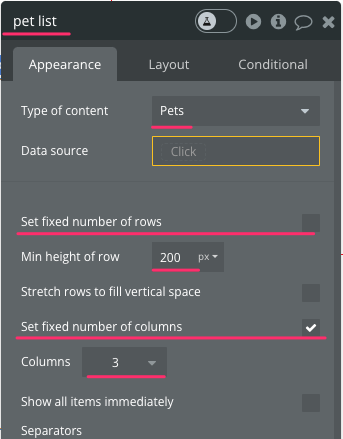

---

- 一覧表の行数と列数を指定します
- 行数は動的に変わるものとしたいので、 `Set fixed number of rows` のチェックを外します
- 代わりに 1 行の最小となる高さを指定しておきます
  - 今回は "200px" とします


---

- 列数は今回 1 行当たり 3 つの画像を表示したいので `Set fixed number of columns` のチェックは ON のまま
- Columns の値を "3" とします


---

- 表全体の高さは 2 行分の高さを確保しておきたいので、 `Layout` を選択し `H` の値を "400" としておきます
- 1行当たりの画像のサイズを正方形にするため、`Layout` の `W` の値を "600" としておきます

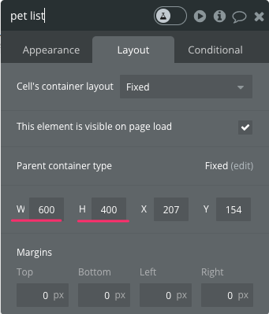

---

- 次に一覧表に表示するデータを指定します

- `Appearance` タブから `Data source` の Click から `Do a search for` をクリック
  - これは一覧表示対象のデータを指定するためのものです

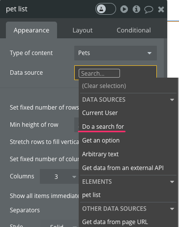

---


- Do a search for のポップアップが表示されますので Type に `Pets` を指定

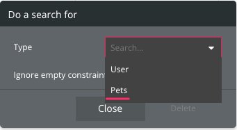

---

- これだけだと、未ログイン状態でもペットの一覧が表示できてしまうため、ログインユーザが登録したペットだけを表示するように条件を追加していきます
- "Add a new constraint" をクリックし、さらに条件を追加します


---

- どんな設定内容になりますか？
- 設定する条件としては「ペットの作成者（Created By）が "Current User" と同一であること」
- 次ページに答えが載っています

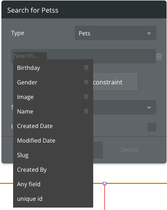

---

- こんな感じですね

- これで一覧表で表示するデータの指定は完了です


---

- 次に繰り返し表示する内容を設定していきます
- Adalo の時のように、画像と名前を表示してみましょう


---

- まず `Visual elements` から `Image` を選択し、右パネルにドラッグ
  - このとき先ほど配置した "Repeating Group" の中に含める形でドラッグすると、後で移動する手間が無くなります
  - 後から Repeating Group に含めることも可能

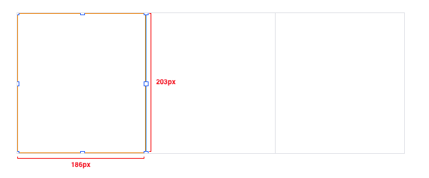

---

- Repeating Group 内に配置したら `Layout` タブから画像のサイズと Repeating Group 内での位置を調整します
- `W`: 200 / `H`: 200 / `X`: 0 / `Y`: 0

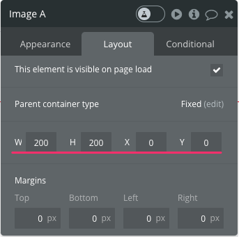

---

- 要素名には `pet list image` と名付けましょう

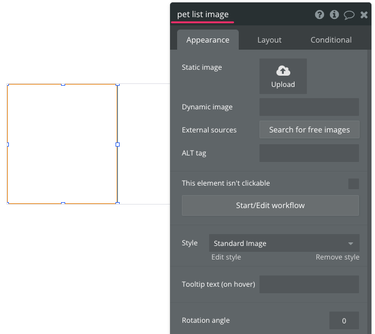

---

- 要素を配置したら、表示される詳細設定のポップアップから "Dynamic image" を選択
- すると `Insert dynamic data` というボタン（のようなもの）が表示されるのでクリック
  - これは固定の値や画像を表示するのではなく、文字通り動的に値や画像を出したい時に利用する機能となります


---

- クリックすると、プルダウンが表示されますので、そこから `Current cell's Pets` をクリック
  - これは文字通り現在のセルのペットのデータを使いたい場合に利用できます


---

- `Current cell's Pets` を選ぶとさらにプルダウンが表示され、Pets タイプが持っている field が表示されますので `'s Image` をクリック
  - これで、現在のセルのペットの画像を表示する、という命令になるため、ペットデータが複数存在する場合に、それぞれのセルにペットの画像が並ぶようになります


---

- 先ほどセルの横幅いっぱいに画像を表示する設定にしたのですが、画像要素の `Run-mode rendering` の値を "Stretch" から "Zoom" に変えておきましょう
  - こうしないと、セルの中で画像の縦横比率を自動で変えられてしまうため、拡大表示に変更します


---

- 続いて画像下に表示する名前の背景を設定しましょう
- `Visual elements` から `Shape` を選択し、右パネルにドラッグ
  - こちらも "Repeating Group" の中に含める形でドラッグ
  - 配置した後に Repeating Group の下部に移動して横幅いっぱいにドラッグして広げます

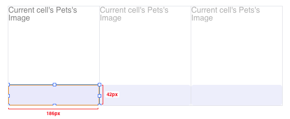

---

- この配置した要素の位置も `Layout` タブから設定しておきます
  - `W`: 200（画像と同じ幅）
  - `H`: 40
  - `X`: 0
  - `Y`: 160（高さ 40 のオブジェクトを下いっぱいに設置するため、200 - 40 = 160）

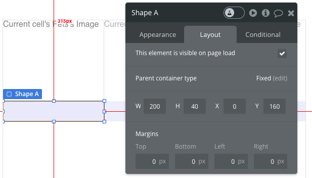

---

- 配置した Shape の透過率を少し下げてみましょう
- Shape の要素をダブルクリックしていつものポップアップを表示します
- Style の内容が "Shape" になっていることを確認したらその下にある "Edit style" をクリック

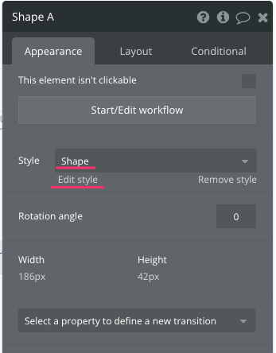

---

- すると、Styles タブに移動し、先程選択されていた "Shape" のスタイル編集画面が表示されます

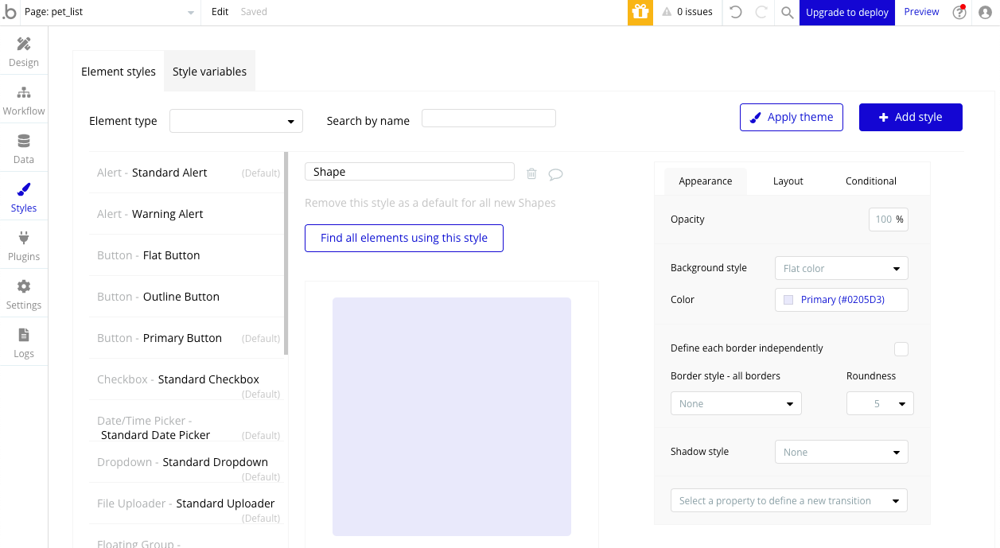

---

- ここで Color の内容を選択すると、色と透過率を変更するポップアップが表示されるので、"Primary" と書いている右側の数値を 10% から 20% に変更します
  - この数値が透過率となっており、100 が非透明、0 が透明となります

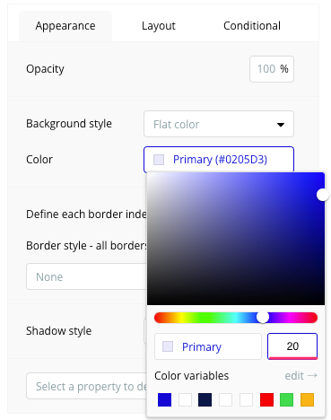

---

- 最後にペットの名前を表示します
- `Visual elements` から `Text` を選択し、先ほど配置した Shape の上にドラッグ
  - こちらも Repeating Group の中に含める形でドラッグ
  - 配置した後に Shape と同じサイズにドラッグして広げます
- 要素名に `pet list name` と名付けましょう


---

- ペットの画像と同様、ペットの名前も Dynamic data を使います
- `...edit me...` となっている部分をクリックすると、画像の時と同様 `Insert dynamic data` が表示されるので、そこから「現在セルのペットの名前」を設定してみましょう
- 次ページに答えが載っています

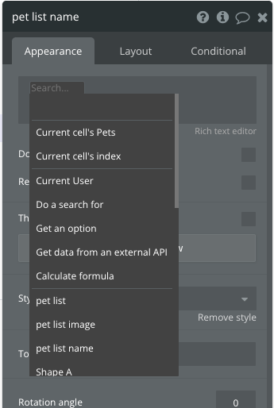

---

- `Current cell's Pets` --> `'s Name` を選択

- これで一覧表で表示する内容の設定は完了です

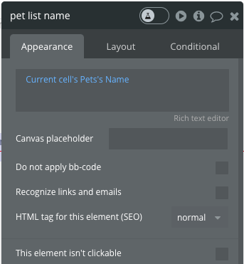

---

#### ここまで出来たらプレビューしてみましょう

- ペットの一覧として、ペットの画像とペットの名前が表示されていますか？

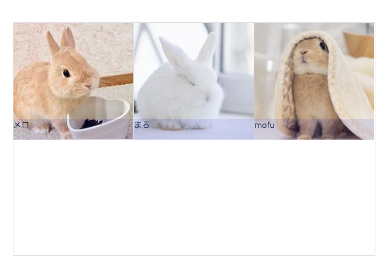

---

##### 演習1

- ペットの名前が左上寄せになっているので、中央寄せにして文字を少し大きくしてみましょう


---

- Hint :bulb:
  - 新しい "Style" を作成して "pet list name" に設定する

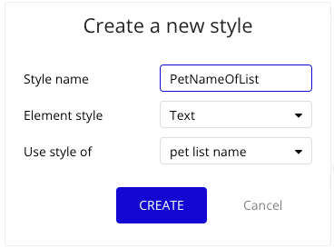

---

#### ペット一覧から登録画面の導線を用意しましょう

- ペットの一覧画面が出来たので、一覧画面から登録画面への導線を用意しましょう
- この導線はペット一覧画面の上部に用意してみましょう

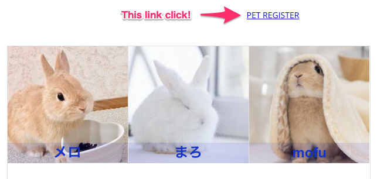

---

* 左上のメニューをクリックし、pet_list（ペット一覧画面）を選択します
- そして、 `Visual elements` の中から `Link` を選択して画面の上部にドラッグします

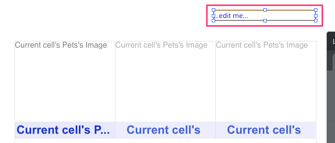

---

- リンクの名前は "PET REGISTER" としましょう
- 遷移先として `Destination page` に ペット登録画面を選択

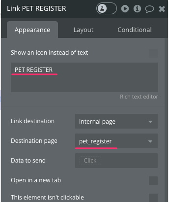

---

#### ではプレビューしてみましょう！

- ペット一覧の上部に設置された "PET REGISTER" のリンクをクリックして、ペット登録画面へ遷移しましたか？


---

## ペット詳細画面を作ってみよう

- 次にペット詳細画面を作っていきます
- ここでのポイントは、一覧画面で選択されたペットの情報の受け渡し部分ですね

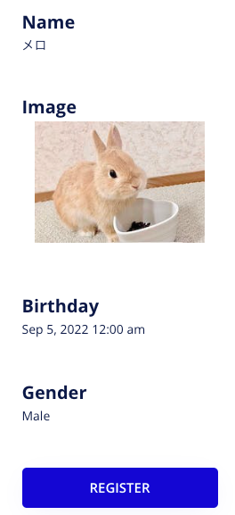

---

### まずは詳細画面を新たに用意

- 左上から "Add a new page..." を選択
- "Page name" は `pet_detail`
- "Clone from" は画面構成が似ているので `pet_register` を選びましょう

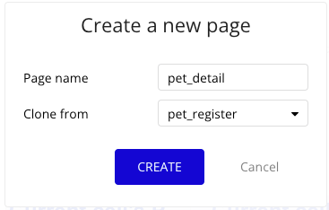

---

- クローン（コピー）してきたままだと、登録画面と同じになってしまうので見直していきます

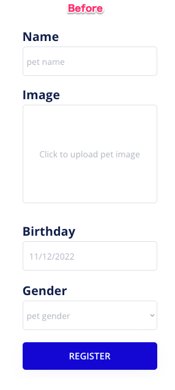

---

- まずは入力項目として用意した入力要素をすべて削除します

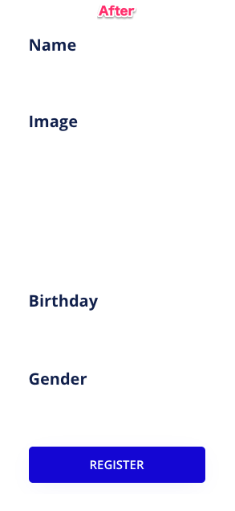

---

- 合わせて、ワークフロータブから、REGISTER ボタンを押した時の設定を削除しておきます
- REGISTER ボタンのワークフローを選択すると、右下にゴミ箱アイコンが出てくるので、それを押すとワークフローの定義を削除できます


---

- 続いて表示用の要素を配置していきます
- "Visual elements" からそれぞれの要素ドラッグしてみましょう
  - Name: Text
  - Image: Image
  - Birthday: Text
  - Gender: Text
- 要素の幅（w）はすべて 220px としてください

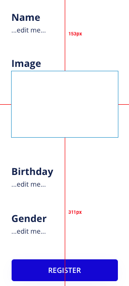

---

- 要素の準備が出来たら実際にデータベースから参照する値を定義していきます
- まず最初にこの画面自体の詳細設定用ダイアログを表示します

---

- 右パネルの左上の部分から `pet_detail` を選択すると、ダイアログが表示されます
  - 要素がいくつも重なっているときなどはここから要素を選ぶことも出来て便利です！

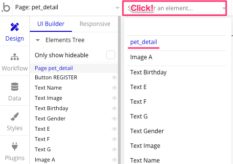

---

- その中から `Type of content` という項目があるので、そこで `Pets` を指定します
- こうすることで、この画面を表示する元となるデータベースのタイプが何なのかを指定でき、各項目にはそのタイプのどのフィールドを使うのかを指定するだけで済みます

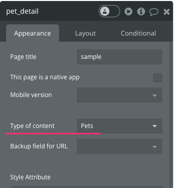

---

- ちなみに、タイプは指定できましたが、具体的にどのペットの情報なのか（ポチなのかタマなのか）は一覧画面から遷移するときに指定しますが、これは後ほど設定しましょう

---

- それでは表示用の要素と Pets タイプのフィールドを紐付けていきます
- まずは Name からやってみましょう
- 今回のように、データベースから取得した値を動的に表示したい場合、どうやるか覚えていますか？

:ghost::jack_o_lantern::ghost::jack_o_lantern:

---

- そうです！ "Dynamic data" を使います！
- Name の要素をダブルクリックし `...edit me...` と書かれた部分をクリックすると `Insert dynamic data` というボタンが表示されるのでクリック


---

- すると、プルダウンが表示され、その中から `Current Page Pets's` をクリック
  - これは文字通り現在のページに割り当てられたペットの情報を指しています
- すると Pets タイプが持っているフィールドが表示されるので `'s Name` を選択

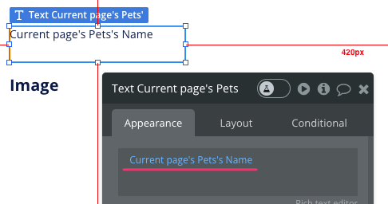

---

- 同じ要領で Image / Birthday / Gender の Dynamic data を設定してみましょう
- 設定が済んだらペット詳細に関するすべての要素を選択して中央寄せにしましょう
  - 要素を選択した状態から右クリック --> `Center horizontally`

---

- 設定が済んだらプレビューしてみましょう
- 正しく値が表示されませんよね？
- これはまだ一覧画面からどのペットの情報なのか？を指定していないからです
  - `Lorem ipsum` と出ているのはよくあるダミーコンテンツのイディオムを Bubble が自動的に出しています

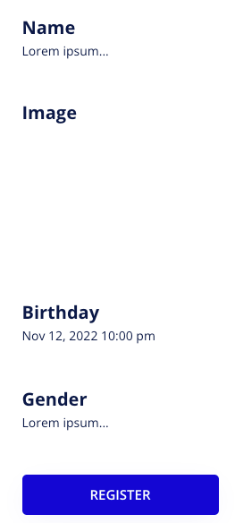

---

### それでは一覧画面と詳細画面をつなげてみましょう

- 左上のメニューから pet_list ページに切り替えます
- 画面操作のイメージとしては、ペット一覧画面で表示されているペットの画像をクリックしたら、そのペットの詳細画面へ遷移させたいですね
- なので、一覧画面のペット画像に対してワークフローを設定していきます

---

- 要素一覧から "pet list image" をクリック
- 詳細設定用ダイアログから `Edit workflow` をクリックします

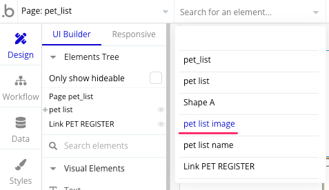

---

- すると "When pet list image is clicked" の箱に対して振る舞いを設定する前の状態になっているかと思います

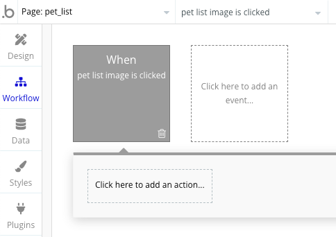

---

- なので "Click here to add an action" から Navigation -> Go to page を選択
- ダイアログが表示されるので `Destination` (遷移先) には "pet_detail" を指定

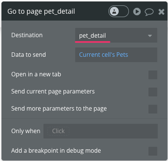

---

- そして `Data to send` に "Current cell's Pets" を指定
  - これでペット詳細画面へ遷移するときに、現在のセルのペット情報を遷移先へ送る、という指定ができました

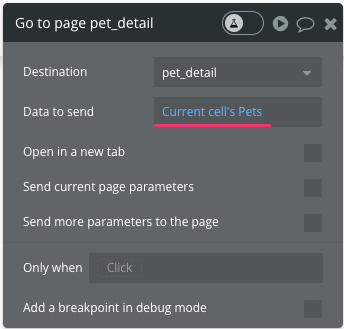

---

- それではプレビューしてみましょう
- 一覧画面でペットの画像を選択すると、そのペットの詳細画面が表示されることを確認できましたか？


---

- ここで表示のアドバイス
- Birthday と Gender の表示が少し味気ないので、表示の書式を変えてみましょう

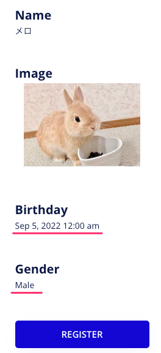

---

##### 演習2: 誕生日の書式を日本風に変えてみます

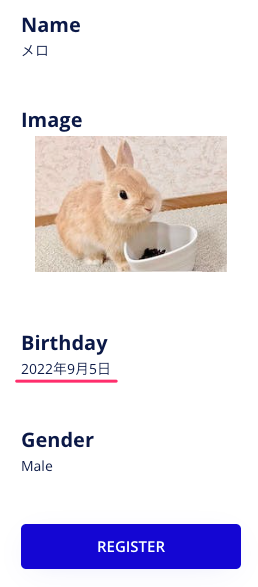

---

- pet_detail 画面で Design タブで開きます
- そして Birthday の表示要素をダブルクリックし、詳細設定用ダイアログを表示します

---

- そして `Current Page Pets's Birthday` の Birthday の部分をクリックすると、後ろに `More` という項目が表示されると思いますので、それをクリックします

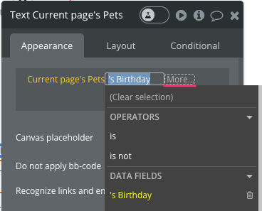

---

- すると Birthday の値の表示フォーマットをさらに指定できるようになります
- 今回は一番上の `:formatted as DD/MM/YY` をクリックします
  - DD/MM/YY には本日日付が入っていると思います

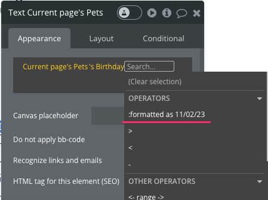

---

- すると、さらに隣に `Date Formatting` のダイアログが表示されると思います
- ここでフォーマットの細かな指定が可能です
- 今回は `Format type` に `Custom` を選択し、 `Custom format` に `yyyy年m月d日` を指定します


---

- それではプレビューしてみましょう
  - 一度 index ページを開いた上で、プレビュー実行
- ペット一覧からペット詳細を開いてみると Birthday の日付が指定した書式になっていると思います


---

##### 演習3: 性別のラベルを変えてみよう

- 性別が "Male" だったら "男の子"、"Female" だったら "女の子" と表示してみましょう！

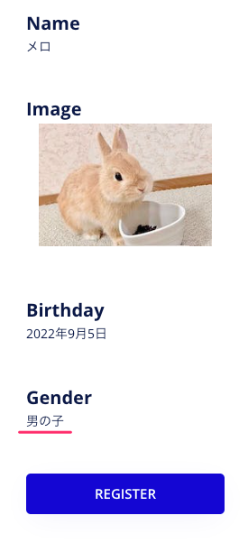

---

- pet_detail 画面を Design タブで開きます
- そして Gender の表示要素をダブルクリックし、詳細設定用ダイアログを表示します
- 今回は Conditional のタブから条件設定によって表示する文字列を変えてみましょう

---

- まず、先ほど Appearance タブで入力していた `Current Page Pets's Gender` の入力欄にカーソルを合わせ、Delete ボタンで入力内容を削除します

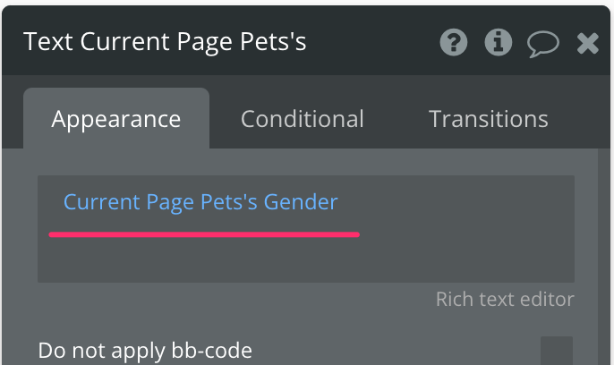

---

- 続いて Conditinal タブを開き、 `Definel another condition` ボタンをクリックし条件を追加します

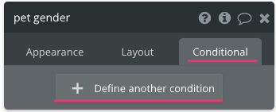

---

- まず「現在表示しているペットの性別が "Male" の場合」という条件を When に指定します
- Male だけ手入力で、それ以外はプルダウンから選択ですね

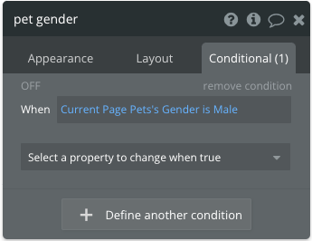

---

- When が設定できたら、その条件が true の時の振る舞いを設定します
- 今回の場合、特定も文字列を表示したいので "Select a property..." のプルダウンから "Text" を選択します

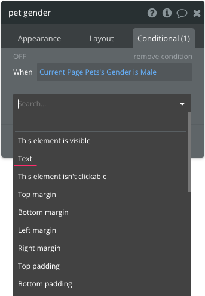

---

- すると、文字列の入力欄が表示されるのでそこに「男の子」と入力します

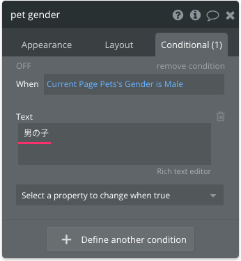

---

- 同じ要領の「女の子」の設定をしてみましょう

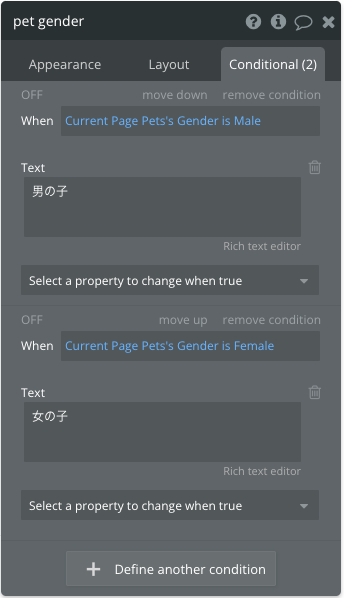

---

- これは下記の処理を書いていることになります

```
現在のペットの Gender（性別）が Male だった場合には「男の子」、
Female だった場合には「女の子」を表示する
```

ここで少しプログラミング的な要素が出てきましたね！

- Birthday のように要素自体の値を加工するような場合は Format を指定するのが良いですが、今回のように要素の値に応じて何か処理をしたい場合には Conditional を使うと良いでしょう！

---

- それでは index ページからプレビュー実行してみましょう
- ペット一覧からペット詳細を開いてみると Gender の値が「男の子」「女の子」になっていると思います


---

##### 演習4: 詳細画面から一覧画面への導線を設けてみよう

- 詳細画面から一覧へ戻るための導線を用意してみましょう
- これまでの講義を踏まえるときっとイメージは沸いていると思うので、完成イメージとヒントだけ記載しておきます

---

#### ヒント

- 使用する要素は `Visual elements` の `Link`
- Link 要素の場合、画面遷移は Workflow ではなく、要素自身に "Destination page" を設定できます
- 完成イメージ

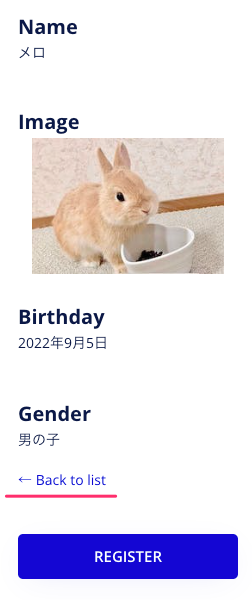

---

## ヘッダー部品を作っていこう

- ここで画面作成から少し離れ、"共通部品" の作成をしていきます
- "共通部品" とは複数の画面で同じように使われる要素をまとめたものを指し、今回はヘッダー部品を題材に作成していきます

---

#### 作成するヘッダー部品の機能

- ペット登録画面へのリンク
- ログイン状態に応じたログイン / ログアウトボタンの制御

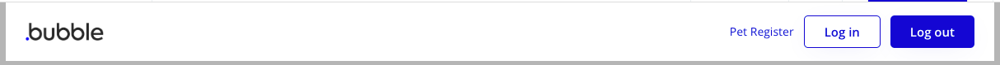

---

#### なぜ共通部品を作成するか？

- ヘッダー部品のような、複数の画面で利用したい要素を、それぞれの画面に個別に準備するのは手間ですよね
- また、個別に準備した場合、その内容を変更しようとした時に、それぞれの画面に対して修正が必要になり、開発の手間が増えてしまいます

---

- そこで Bubble では "Reusable elements" のコンポーネントを用いて、そのような問題を解決します
- 今回はヘッダー部品を "Reusable elements" として作成し、ペットの一覧・登録・詳細画面に配置していきます

---

#### ヘッダー部品の作成

- 左上の画面一覧を開き、その中にある "Add a new reusable element..." をクリック

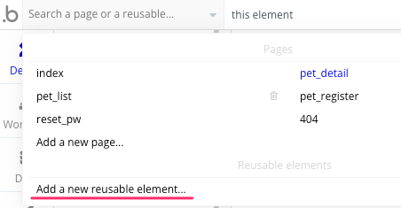

---

- すると、画面作成時と同じポップアップが表示されるので、今回は共通部品の名前として "header" と入力して CREATE をクリック

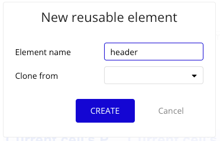

---

- すると右パネルに縦横 200px のエリアが表示されると思います
- このままでは少し横幅が狭いので、まずはエリアの領域を調整します

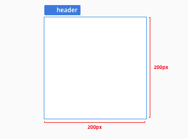

---

- 右パネルのエリア内で右クリック --> Edit
- 見慣れたポップアップが表示されるので "Layout" タブを選択
- その中にある `Width` を "1200"、 `Height` を "72" に変更

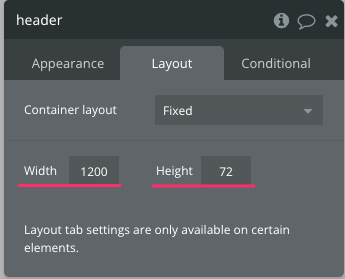

---

- それではヘッダーの共通部品を作り込んで行くのですが、ここでは便利な機能を使います
- 最初にサインアップ / ログイン部品を使った "Components" の中からヘッダー部品を流用してみます


---

- 今回はこの中にある "Header" 部品の中から一番上の部品を選択して、右パネルにドラッグします
- 配置したら Component Library の下にある Close ボタンをクリックして閉じます

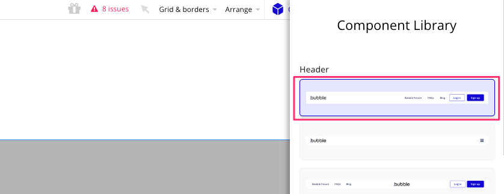

---

- すると Bubble が用意している Header のサンプルが右パネルに表示されていますね
- 今回はこれをカスタマイズしていきます

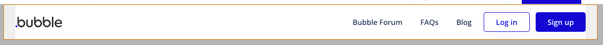

---

- まずは今回のヘッダー部品として不要なものを削除します
- 下記 2 つの要素を選択して削除しておきます
  - FAQs
  - Blog
- 誤って他の要素を削除しないよう注意してくださいね
- "Bubble Forum" の要素は次のステップで使い回すので残しておきます

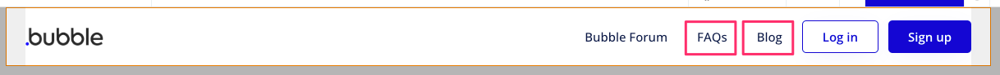

---

- 削除後はこんな感じです

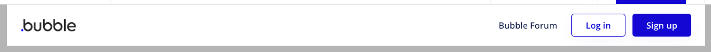

---

#### ペット登録画面へのリンクの設置

- まずはペット登録画面へのリンクを設置してみましょう

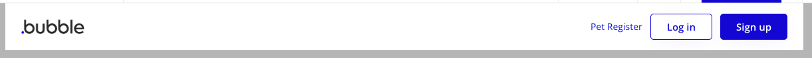

---

- 先程残しておいた "Bubble Forum" の要素をダブルクリックして編集ポップアップを表示します
- そのポップアップの下の方にある `Replace` というボタンをクリック

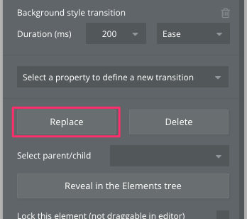

---

- これは、選択中の要素の種類を変更する機能となります
- 今回はこの Text 要素を Link 要素に置き換えていきます
- `New element type` の中から "Link" を選択して REPLACE をクリック

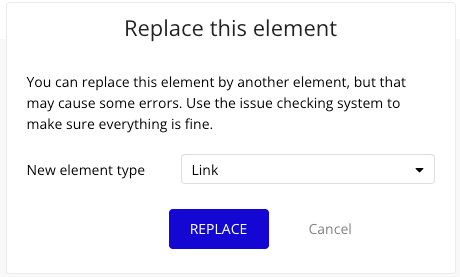

---

- これで要素の種類が Link に置き換わりました
- ただ、もともとの要素に設定されていた `Style` や `Conditional` は残っているので、これを変更していきます

---

- まずは `Style` をリンクに変更します
- 要素の編集ポップアップから `Style` に "Standard Link" を選択
- そのままだと、要素内の文字列が上寄せになっているので、縦位置を中央寄せにしておきます

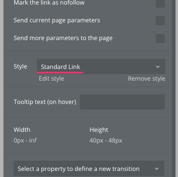

---

- "Standard Link" 下の "Edit style" をクリック
- Styles タブに移動し、Standard Link のスタイル編集画面になるので、Appearance タブにある `Center the text vertically` にチェックを入れます
  - これで、リンクの文字列が縦中央寄せになります

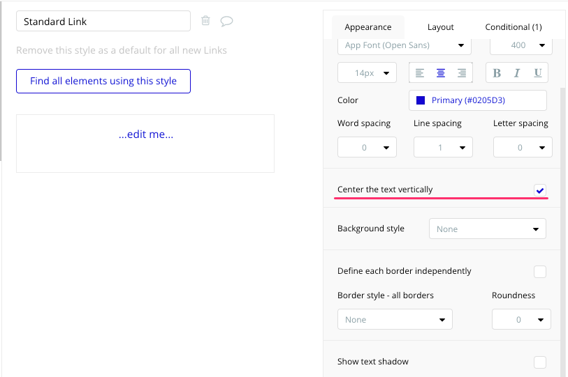

---

- Design タブに戻り、先程上寄せになっていた文字が縦中央寄せになっていれば OK
- 文字列の内容も "Pet Register" に変更
- 遷移先も "pet_register" を設定

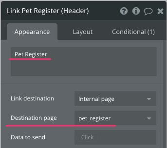

---

- Style を変更したことで `Conditional` の内容も削除されています
- キャプチャの通りになっていれば OK

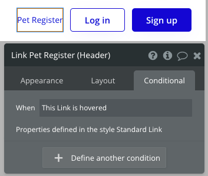

---

- これでペット登録画面へのリンクの設置は完了です


---

#### サインアップ / ログインを作り込む

- ヘッダーが準備できましたので、その先で必要になってくるユーザ情報のサインアップ（登録）とログインを作っていきます


---

- ここでやることは下記 2 つです

1. ユーザを登録するための箱を準備
2. 最初に用意した index ページにサインアップとログインを設定する

- まずはユーザ登録のための箱を準備していきます

---

#### 1. ユーザを登録するための箱を準備

- 実はユーザの箱は最初から準備されています
- Data の Data types にすでに User があると思いますので選択
- すでにフィールドとして email もありますが、ユーザ名のフィールドがないため、type を `text` で追加します

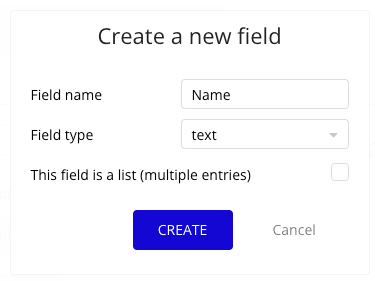

---

- ちなみにパスワードのフィールドが見当たりませんが、実際には存在しています
- これは、データ保護の観点から Bubble が表に見せていないだけで、裏ではパスワードのフィールドがあり、そこにユーザが入力したパスワードが暗号化されて保存されています

---

#### 2. 最初に用意した index ページにサインアップとログインを設定する

- ユーザの箱は準備ができたので、いよいよ index ページにワークフローを設定していきます
- 左上の画面一覧から index を選択

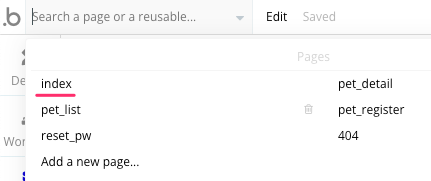

- 今回はワークフローのタブから設定していきます

---

##### まずはサインアップ（ユーザ登録）から設定

- `Click here to add an event...` をクリック
- 今回はすでに index ページにある `Sign up` / `Sign in` ボタンを押した時のワークフローとなるため `Elements` --> `An element is clicked` を選択

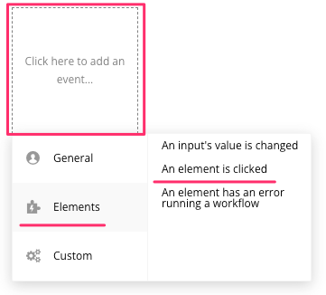

---

- 詳細ポップアップが出てくるので、まずは要素を選択します
  `Button Sign Up (Sign Up / Log In)`
- これで Sign Up ボタンを押した時のワークフローという意味になりました

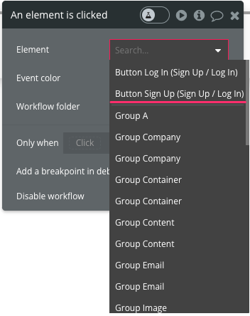

---

- 次にワークフローの中身を設定していきますが、皆さんならきっと設定できますよね？
- これまでの学習内容を踏まえて設定してみてください
- 注意点としては、ユーザの操作に関しては特別であるため、 `Data (Things)` ではなく `Account` からそれらしきメニューを選択してくださいね

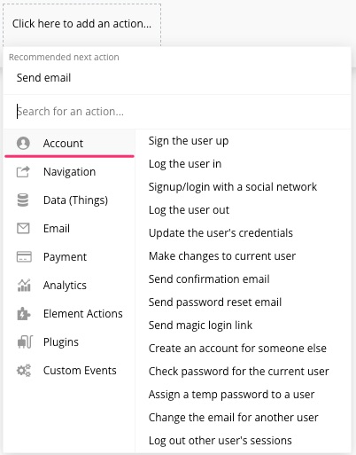

---

# :hourglass_flowing_sand:
# :hourglass_flowing_sand:
# :hourglass_flowing_sand:
# :hourglass:
# :hourglass:

---

- メニューは文字通り `Sign the user up` ですね
- そして、設定する中身はこんな感じ
  - Email: Input Sign Up Email (titech)'s value
  - Password: Input Sign Up Password (titech)'s value
  - Name: Input Sign Up Name (titech)'s value

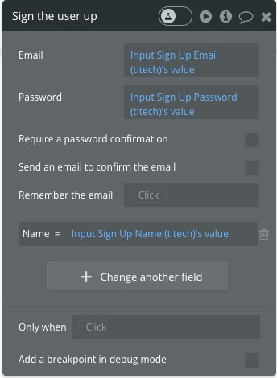

---

- Input 要素が大量にあり、お目当ての要素を探しづらかったため、要素名の末尾に `(titech)` をつけました
  これにより、設定時に `titech` で絞り込みができて便利 ☝️

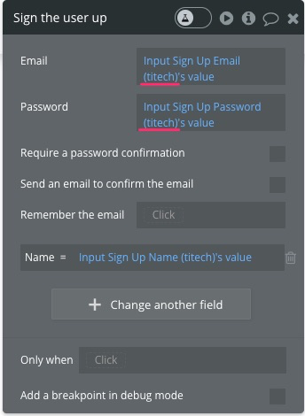

---

- 実際にプレビューしてみましょう
- Sign up 画面で必要事項を入力して `Sign Up` を押してみましょう
- そして、Data タブの App data から `All Users` を選択し、今入力したユーザ情報が登録されていればオッケー🙆‍♀️

----

##### 続いてログインを設定してみましょう

- 先程の Sign Up と考え方は同じですので、やってみましょう！

---

# :hourglass_flowing_sand:
# :hourglass_flowing_sand:
# :hourglass_flowing_sand:
# :hourglass:
# :hourglass:

---

- 選択するアクションは `Account` --> `Log the user in` ですね
- そしてログイン時に使用するメールアドレスとパスワードを選択します
  - ここでも、要素が大量にあるため識別するために対象要素の末尾に `(titech)` とつけてみました

---

- それではプレビューしてみましょう
- 先程サインアップの時に入力したユーザのメールアドレスとパスワードを入力して Log In ができることを確認
- Log In ボタンを押して、下記のようなダイアログが出なければログイン成功です！

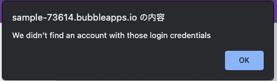

---

- これでユーザ登録とログインが出揃いましたので次に進んでいきます🙋‍♀️

---

#### ログイン状態に応じたログイン / ログアウトボタンの制御

- 次にログイン、ログアウトボタンの準備をしていきます
- 左上から Reusable elements の header を選択


---

- ここでやることは 4 つです

1. ログインボタンは「未ログイン状態の時だけ表示する」
2. ログインボタンを押すとログイン画面（index）に遷移する
3. サインアップボタンをログアウトボタンに変更し、「ログイン済み状態の時だけ表示する」
4. ログアウトボタンを押すと、ログアウト状態にした上でログイン画面（index）に遷移する

- まずはログインボタンの制御を組み込んでいきます

---

#### 1. ログインボタンは「未ログイン状態の時だけ表示する」

- 制御のイメージとしては下記のようになります
  - ログインボタンは非表示にしておく
  - Conditional の条件で、現在ユーザが未ログイン状態であれば、ログインボタンを表示する

---

- まずログインボタンの編集ダイアログを表示
- Layout タブの `This element is visible on page load` のチェックを外します
- これにより、画面表示時に、この要素は表示しない、という制御になります


---

- 次に、ログイン状態による制御を行います
- Conditional タブから `Define another condition` をクリック
- When の条件に「現在ユーザが未ログイン状態」という内容を設定してみましょう

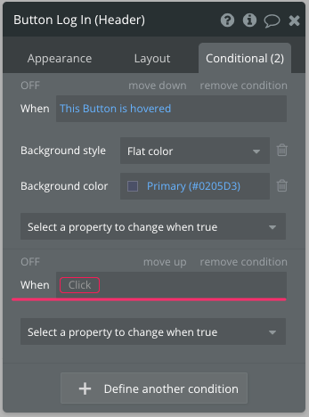

---

- こんな感じですね
  - "Current User is logged out"

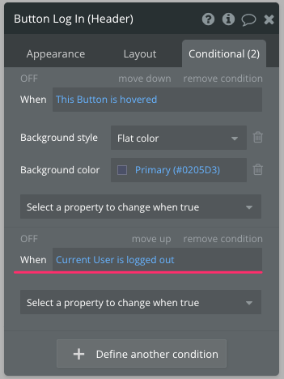

---

- そして、When の条件を満たした時に行う処理を `Select a property to change when true` で選択します
- 何を選択するか分かりますか？


---

- "This element is visible"
- これを選択し、チェックをつければ OK です

- これで、下記の状態が準備できました
  - ログインボタンは非表示にしておく
  - Conditional の条件で、現在ユーザが未ログイン状態であれば、ログインボタンを表示する

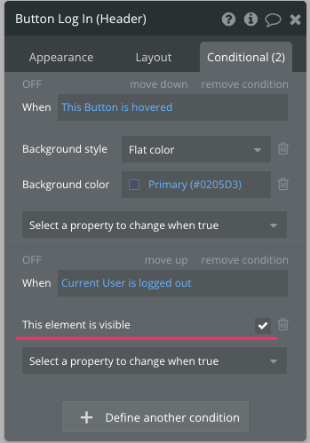

---

#### 2. ログインボタンを押すとログイン画面（index）に遷移する

- 次に "Log in" ボタンを押したらログイン画面へ遷移するワークフローを設定します
- 単純な画面遷移だけなので、みなさん設定してみましょう！

---

# :hourglass_flowing_sand:
# :hourglass_flowing_sand:
# :hourglass_flowing_sand:
# :hourglass:
# :hourglass:

---

- 設定するワークフローは Go to page
- Destination にログイン画面である index を選択すれば OK

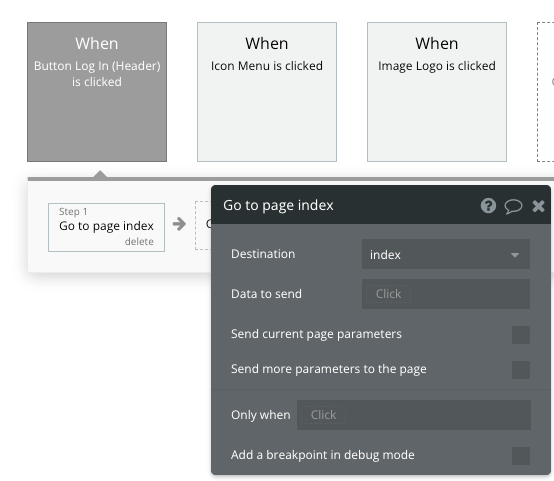

---

- これでログインボタンの制御は完了です
- 続いてログアウトボタンの制御を行っていきましょう

---

#### 3. サインアップボタンをログアウトボタンに変更し、「ログイン済み状態の時だけ表示する」

- まず "Sign up" ボタンのラベルを "Log out" に変更しておきます

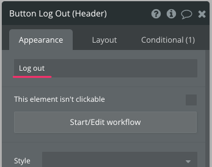

---

- そして表示・非表示の制御については、先ほどのログインボタンとほぼ同じです
  - ログアウトボタンは非表示にしておく
  - Conditional の条件で、現在ユーザがログイン済み状態であれば、ログインボタンを表示する

- 先ほどの内容を参考に、設定してみましょう

---

# :hourglass_flowing_sand:
# :hourglass_flowing_sand:
# :hourglass_flowing_sand:
# :hourglass:
# :hourglass:

---

- まずログインボタンの編集ダイアログを表示
- Layout タブの `This element is visible on page load` のチェックを外します
- これにより、画面表示時に、この要素は表示しない、という制御になります

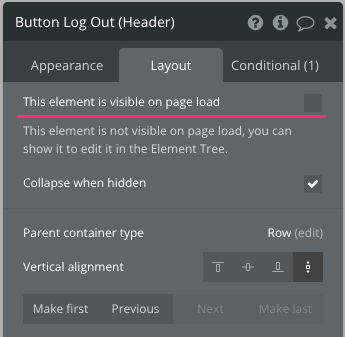

---

- そして Conditional の内容はこんな感じです
- When の条件としては "Current User is logged in"
- これで、下記の状態が準備できました
  - ログアウトボタンは非表示にしておく
  - Conditional の条件で、現在ユーザがログイン済み状態であれば、ログアウトボタンを表示する

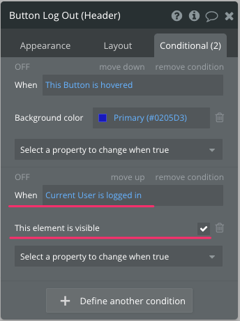

---

- 実はもう 1 箇所、これと同じ Conditional の条件を設定して、現在ユーザがログイン済み状態の時だけ要素を表示する制御を行う箇所があります
- どこか分かりますか？

---

- 最初に追加した "Pet Register" のリンクです
- ペットのデータは、ログイン中のユーザに対して関連づけるデータです
- そのため、ログイン済み状態のときだけペット登録画面へ遷移できるよう "Pet Register" のリンクにも Conditional をセットしておきましょう

---

- 先ほどのログアウトボタンと同じ制御なので分かりますよね :smile:

---

- こんな感じです :+1:

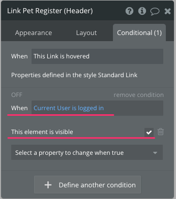

---

#### 4. ログアウトボタンを押すと、ログアウト状態にした上でログイン画面（index）に遷移する

- 最後に "Log out" ボタンを押した時のワークフローを設定します
- こちらもまずはみなさんで設定してみましょう！

---

- ログアウト状態にするワークフローのヒントは "Account" の中のどれかのアクションです

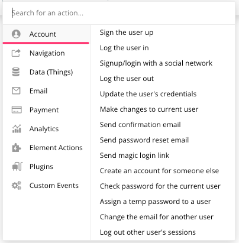

---

# :hourglass_flowing_sand:
# :hourglass_flowing_sand:
# :hourglass_flowing_sand:
# :hourglass:
# :hourglass:

---

- ログアウト状態にするアクションは "Account" の "Log the user out" です
- その後に画面遷移のアクションを設定すれば OK

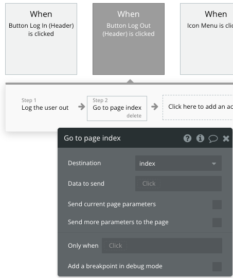

---

- これでヘッダー部品に関する設定が完了しました


---

やったこと

- ペット登録画面へのリンク
- ログイン状態に応じたログイン / ログアウトボタンの制御
  1. ログインボタンは「未ログイン状態の時だけ表示する」
  2. ログインボタンを押すとログイン画面（index）に遷移する
  3. サインアップボタンをログアウトボタンに変更し、「ログイン済み状態の時だけ表示する」
  4. ログアウトボタンを押すと、ログアウト状態にした上でログイン画面（index）に遷移する

---

ちなみに...

- みなさんのヘッダー部品では "Log in" と "Log out" ボタンが表示されていないと思います
- これは設定の中で、初期状態では非表示設定にしたからですが、その状態でも要素を表示する方法があります

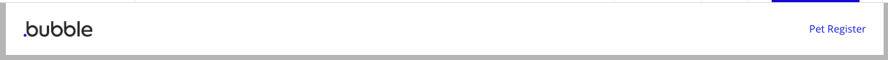

---

- 左パネルの中から `Elements tree` を開き、その中にあるオブジェクトの `+` を押して要素を表示します

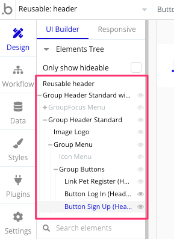

---

- ここに表示されている要素は、今表示している画面（共通部品）に含まれている全ての要素です
- 表示順序にも意味があり、下に表示されているのが、画面上でいうところの最前面に表示されているものになります


---

- そして、その中で一番最前面（一番下）にある要素の中で、"Log in" ボタンと "Log out"（Sign in）ボタンの右にある「目」のアイコン👁️
- これが ON と OFF の状態があり、ON が右パネル上に表示、OFF が右パネル上に非表示、を表します

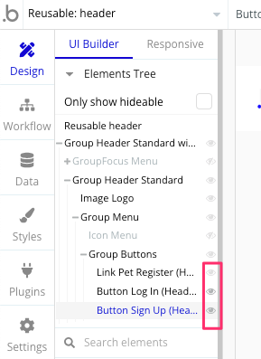

---

- 今回は、この "Log in" ボタンと "Log out"（Sign in）ボタンの「目」のアイコンを一度 OFF にして、再度 ON にすると、右パネル上でもボタンが表示されます
- これは右パネル上での表示 / 非表示の制御であり、実際のアプリケーション上での表示 / 非表示とは関係ないので注意してください


---

- 最後に、現在のヘッダー部品の幅と、画面の幅を合わせるため、`Elements tree` から下記要素を選んで、`Width` の値を "1080" に変更します
  - "Reusable header"
  - "Group Header Standard with Menu"

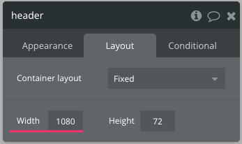

---

- `Width` を変更したことで、"Pet Register" のリンクやログインのボタンが見えなくなった場合は、先ほどと同じ手順で、`Elements tree` からボタンなどの要素の「目」のアイコンをクリックして表示 ON にすると見えるはずです

---

### 各画面に組み込んでみよう

- ヘッダー部品ができたので、まずはペット一覧画面に組み込んでみましょう

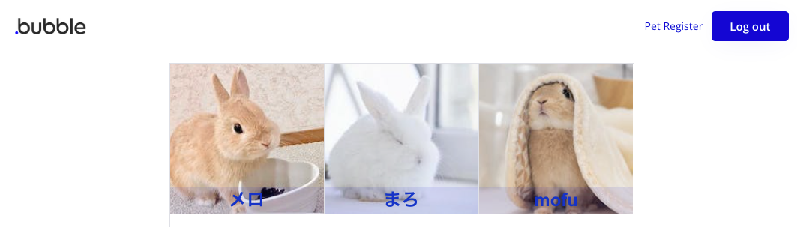

---

- "pet_list" を開き、最初に配置した "PET REGISTER" のリンクを削除します

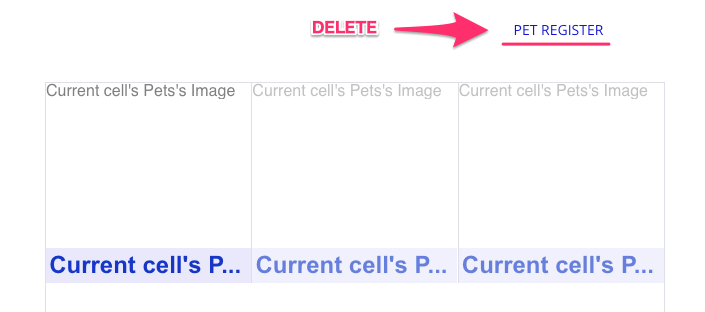

---

- 左パネルから `Reusable elements` の中にある "header" をクリックして、右パネルの上部にドラッグします
- 画面の最上部に設置しておきましょう

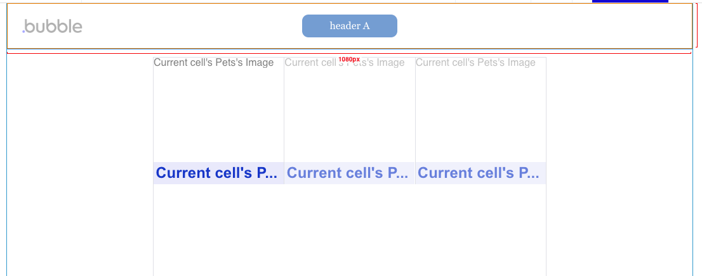

---

それではプレビューしてみましょう 🙋‍♀️

---

#### ログイン状態の場合

- ペット登録のリンクが表示されていること
- ログアウトボタンが表示されていること
- ログアウトボタンを押すとサインアップ画面へ遷移すること


---

#### ログアウト状態の場合

- ペット登録のリンクが表示されていないこと
- ログインボタンが表示されていること
- ログインボタンを押すとサインアップ画面へ遷移すること

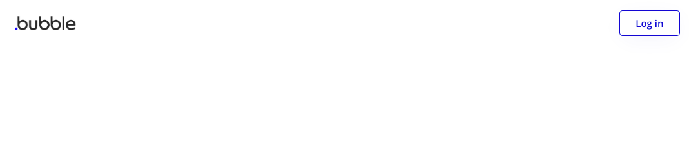

---

- 問題なければ残りの画面へ同じように組み込んでいきたいのですが、その前に 1 つワークフローを設定しておきます
- それは、サインアップ / ログインに成功した時にペット一覧画面へ遷移するワークフローです

Let's Try!! :fire:

---

# :hourglass_flowing_sand:
# :hourglass_flowing_sand:
# :hourglass_flowing_sand:
# :hourglass:
# :hourglass:

---

- 今の皆さんには簡単ですね！
- index ページのワークフローを開き、下記 2 つの When に対して、"Go to page pet_list" のアクションを追加するだけです
  - "When Button Log In (Sign Up / Log In) is clicked"
  - "When Button Sign Up (Sign Up / Log In) is clicked"

---

- 念の為プレビューを行い、ログインボタンを押した時、サインアップボタンを押した時、それぞれペット一覧画面へ遷移することを確認しておきましょう！
- プレビューが問題なければ、のこり 2 画面にも同様にヘッダー共通部品を配置しておきましょう
  - ペット登録画面
  - ペット詳細画面

---

- ペット登録画面

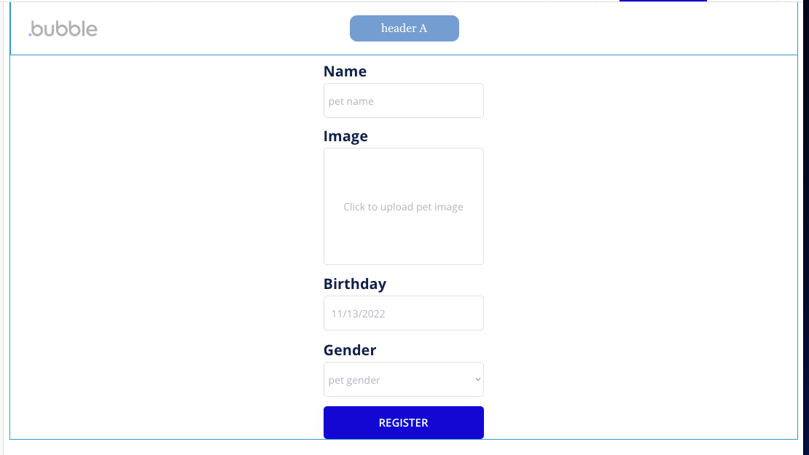

---

- ペット詳細画面

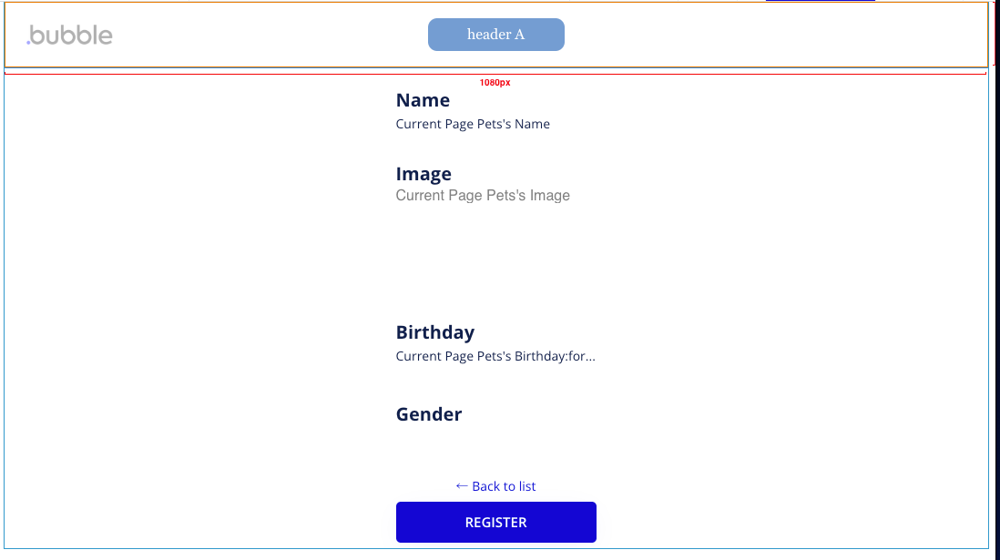

---

- 登録画面と詳細画面もプレビューで確認してみましょう

---

#### ペット登録画面

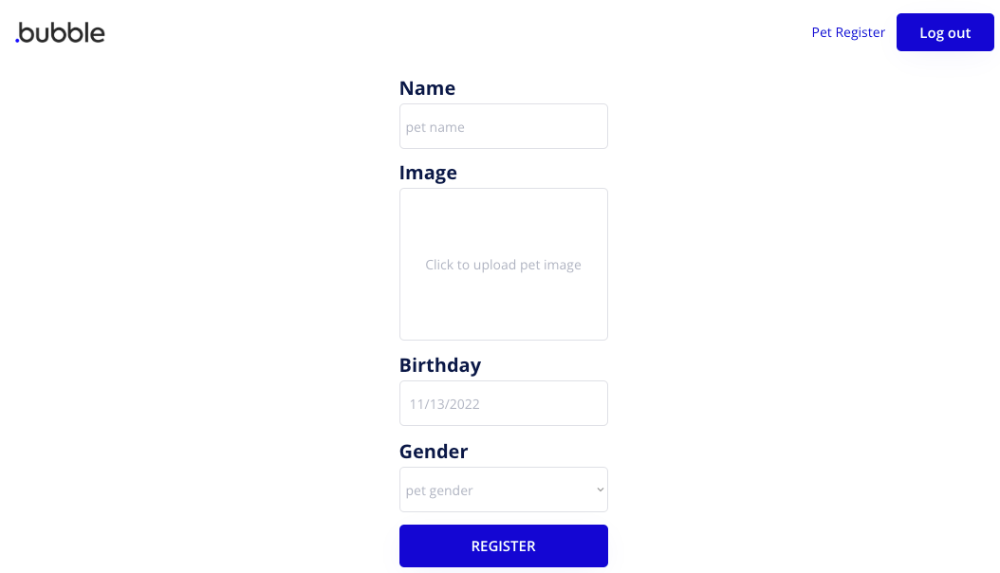

---

#### ペット詳細画面

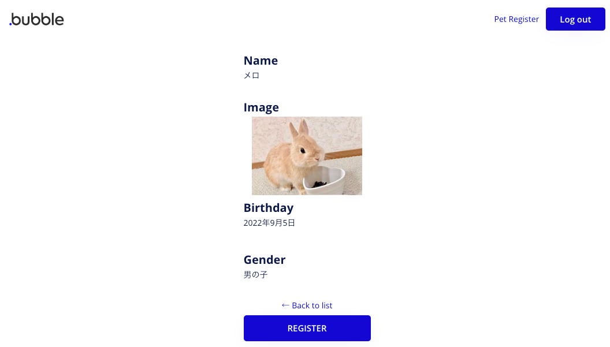

---

##### 演習5: ペット登録画面のリンクも出し分けしてみよう

- 余裕のある人はペット登録画面ではヘッダーの "Pet Register" のリンクを表示しない設定をしてみましょう
- Hint :bulb:
  - "Current page name"
  - ペット登録画面のページ名は "pet_register"

---

## ペットの体重を管理しよう

- いよいよ最後です :fire:
- ペットの体重管理を見ていきましょう

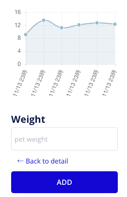

---

- まずはデータベースの Type を用意していきます
- Data タブから New type として `PetWeightLogs` を入力し、`Make this data type private by default` のチェックを入れて Create します
- 続いて field を設定していきます

---

- 画面から入力されたペットの体重
  - WeightKg: number
- どのペットの体重かを紐付ける
  - Pet: Pets


---

- データベースの準備が出来たので画面を設定していきましょう
- まずはペットの体重管理画面を新たに用意します
- Add a new page からページ名 `pet_weight_register` でコピー元は `pet_register` を選択して CREATE


---

- この画面も、ペット詳細から遷移する前提であるため `pet_weight_register` 画面に対する詳細設定ダイアログから、 `Type of content` に "Pets" を指定します

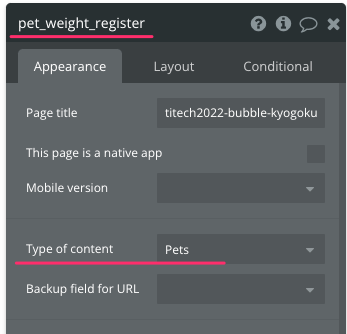

---

- コピー元のペット登録画面の要素が残っているので、不要なものは削除しつつ参考画像のような要素を配置します
- ただし、グラフ描画エリアは現時点では配置しません

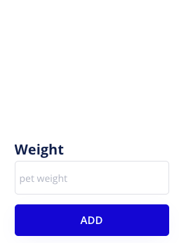


---

- このとき、体重の入力要素について、今回は小数点付き数字だけの入力を許容したいので、その設定だけ行います
- ペットの体重入力要素をダブルクリックし `Content format` に `Decimal` を選択します
  - ちなみに `Integer` は小数点なしの整数入力の場合に選択します

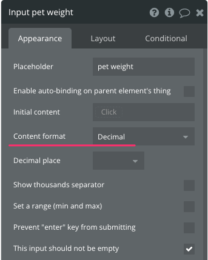


---

- 次に、体重保存のボタンクリックに対してワークフローを設定していきます
- ADD ボタンをダブルクリックし、詳細設定ダイアログから Edit workflow を選択

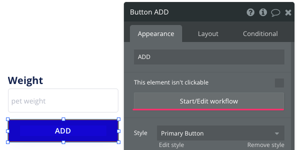

---

- すると `When Button ADD is clicked` に対して、すでに振る舞いがいくつか設定されています
- これはページ作成時に `pet_register` をコピーして作ったため、そのときのワークフロー設定が引き継がれています
- 今回は新たに振る舞いを定義していくので、既存のワークフローは削除します
- Step1 / Step2 の振る舞いを選択すると、右下に `delete` と表示されているので、そこから振る舞いを削除します


---

- それではワークフローを設定していきましょう
- まずやりたいのは、「画面で入力された体重の値を、先ほど用意した PetWeightLogs に保存する」ですね
- 今までの講義内容を踏まえて設定してみてください！

- 次のページに解説を載せているので、まずはやってみましょう！

---

# :hourglass_flowing_sand:
# :hourglass_flowing_sand:
# :hourglass_flowing_sand:
# :hourglass:
# :hourglass:

---

- まず設定するアクションとしては `Data(Thing)` --> `Create a new thing...` ですね


---

- そして、登録するタイプとフィールドを指定します
- 今回登録するのはペットの体重なので Type は `PetWeightLogs`


---

- 設定するフィールドは `WeightKg` と `pet` ですね
- `pet` フィールドを設定しないと、どのペットの体重なのかを判断できないので指定します
- その際に指定するのが `Current Page Pets` 、今表示している画面の Pets となります


---

- 登録ができたら画面を再描画して、この後表示するグラフを最新化したいので、登録後に画面を再描画する振る舞いを定義しましょう
- 画面操作に関するアクションは `Navigation` でしたね
- その中のサブメニューを見てみると `Refresh this page` というピッタリのアクションがあるのでこれを選択しましょう


---

- これでペットの体重登録が出来たので、詳細画面からの導線を用意しましょう
- 詳細画面を開き、Image と Birthday の間にリンクを用意しましょう
- もし画面の高さが足りない人は、pet_detail 自身の Height を広げましょう
- リンクは `Visual elements` の `Link` を使いましょう

---

- ポイントとしては 2 つ

1. 遷移先を `Destination page` に設定する
2. リンク先に対して現在ページのペット情報を渡してあげる

- 次のページに設定イメージを書いていますのでまずはご自身で設定してみましょう

---

- こんな感じ！

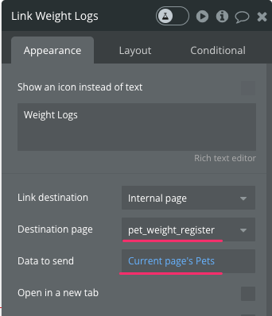

---

- 詳細画面から体重管理への導線が出来たら、逆の導線も用意しておきましょう
- 考え方は詳細画面に設置したリンクと同じで大丈夫です

---

- 設定できたら一覧画面に戻ってプレビューを実行してみましょう
- 一覧、詳細、体重管理へ遷移した後、Weight に値を入力して ADD を押すと画面が再描画されましたかね？

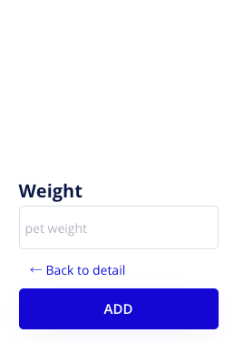

---

- 念のため、データベースにデータが登録されていることを確認してみましょう
- Data の App data タブから `All PetWeightLogs` を選択すると左側にデータが登録されていますよね？


---

### ペットの体重をグラフィカルに表示してみよう

- 登録したペットの体重を Adalo の時と同様グラフを使って表示してみましょう


---

### まずはプラグインを導入します

- Bubble でもグラフ表示の機能は標準では搭載していないため、プラグインという形で機能を追加します
- Adalo の時は Component という形でしたが、Bubble では Plugins から導入します

---

- 左メニューから Plugins を選択し、プラグイン画面を表示します
- そして、右上の `+ Add plugins` を押して追加するプラグインを検索します

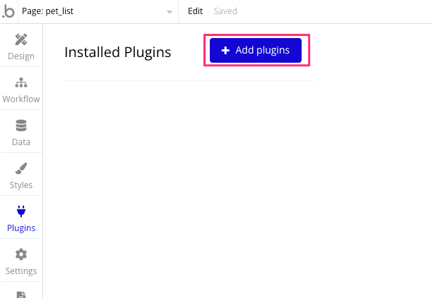

---

- `Install New Plugins` というポップアップが表示されますので、左パネルの検索窓に `chart` と入力します
- すると、右パネルに検索結果が表示されますので、その中から（おそらく一番上にある） `Chart Element` の `Install` ボタンをクリックします


---

- インストールが完了したら DONE をクリックしてポップアップを閉じます
- Installed Plugins に Chart Element が入っていれば OK です

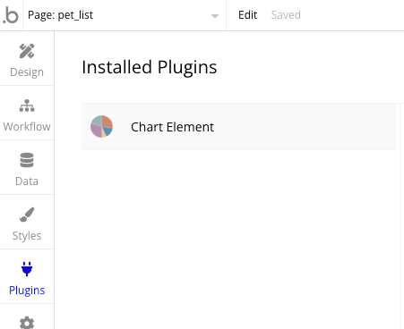

---

- Bubble のプラグインには無料のものと有料のものが存在します
- プラグイン一覧の画面で `Free` と書かれているもの、もしくは `By Bubble` と書かれているものは無料です
  - とくに `By Bubble` と書かれているものは文字通り Bubble の公式が提供しているプラグインのため、何かと信頼できます
- 逆に金額が記載されているプラグインは文字通り有料です
- 様々なプラグインがあるので、導入する際には Free のもので事足りるプラグインがないかをまずは探し、有料のプラグインしかどうしても存在しない場合には有料のプラグインインストールを検討してみても良いでしょう

---


---

### それでは実際にグラフ描画を行っていきましょう

- `pet_weight_register` ページの Design を開きます
- すると `Visual elements` の中に `Line/Bar Chart` という要素が新たに追加されていると思いますので、この要素を選択して早速体重入力の上部にドラッグします

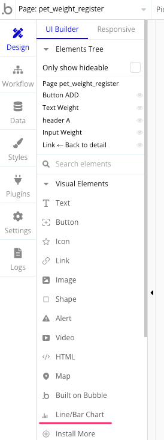

---

- このような形にサイズを調整します

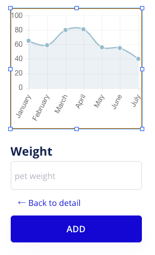

---

- 描画するとこれまでと同じく詳細設定用のダイアログが表示されますので、各項目を設定していきましょう
- `Chart type` はグラフの種類を指定します
  - 今回は折れ線グラフなので `Line` とします


---

- `Type of data` はグラフ描画するデータのタイプを指定します
  - 今回はペットの体重表示となるので `PetWeightLogs` とします


---

- 続けて `Data source` に対象データの条件を指定します
  - 一覧画面での条件指定と同じように、まずは `Do a search for` を選択

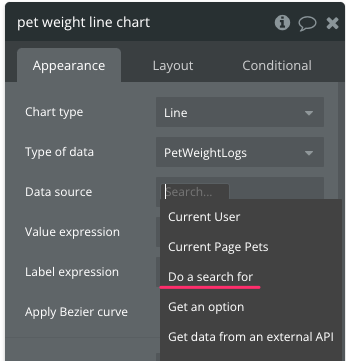

---

- Do a search for のダイアログがさらに表示されますので
  - `Type` には対象データの型を指定しますので `PetWeightLogs` を指定


---

- これだけだとすべてのペットのすべての体重データが表示されてしまうので絞り込みの条件を指定します
  - `Add a new constraint` をクリックして条件を指定します


---

- まずは Click をクリックすると Type に指定した `PetWeightLogs` が持っているフィールドが表示されます
- 今回は `PetWeightLogs` に関連する `Pet` の情報が、現在表示しているペットと同じデータを対象とします

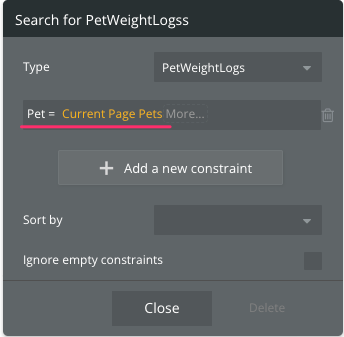

---

- これを条件として表現するとこのようになりますので、それを設定してみましょう
  ```
  Pet = Current Page Pets
  ```


---

- 最後にデータの並び順を指定します
  - グラフの見せ方として、登録した体重を新しいもの順にしたいと思います


---

- `Sort by` に `Created Date` を指定します
  - これで並び順のキーを指定しました
- `Descending` に `"yes"` を指定します
  - これでキーの新しいもの順（降順）と指定しました

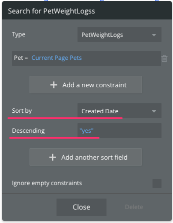

---

- 仮に登録日の古いもの順としたい場合、 `Descending` に `"no"` を指定すれば古いもの順（昇順）となります
- 設定完了したら `Close` をクリックしてこのサブダイアログを閉じておきます

---

- 最後にグラフに描画する X 軸と Y 軸を指定します
- 今回の場合、X 軸は登録日時、Y 軸は体重となります


---

- X 軸の設定は `Label expression`
  - 今回は `Current point's Creation Date` とします
- Y 軸の設定は `Value expression`
  - 今回は `Current point's WeightKg` とします


---

- `Current point` は対象データのタイプで指定した `PetWeightLogs` の各データをプロットした 1 件 1 件のデータを指します

---

- それでは一覧画面に戻ってプレビューしてみましょう！
- 一覧で選択したペットに対して登録された体重がグラフとして表示されましたか？
- 同じ画面で Weight をどんどん追加するとグラフの内容が変化しますか？


---

##### 演習6: グラフの X 軸のラベルを変えてみよう

- 現時点の X 軸のラベルは長ったらしい日時の書式になっているので、皆さんでお好きなフォーマットに変えてみてください
- 例えばこんな感じ


---

##### 演習7: 体重データが 1 件もない場合にメッセージを出してみよう

- 現在の開発内容だと、ペットの体重が 1 件も登録されていない場合、グラフ描画エリアが空白になってしまい、ページとしての見栄えが悪いですね

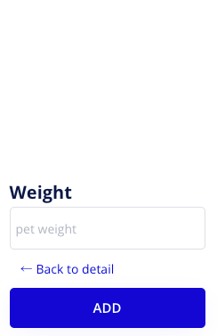

---

- そこで、ペットの体重が 1 件も登録されていない場合に専用のメッセージを表示して、ユーザビリティを向上させてみましょう

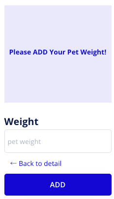

---

- 対応イメージとしては、グラフ要素と同じ幅と高さの Shape を同じ位置に用意
  - その上に表示したいメッセージを Text として配置し、Shape と Text をグルーピング
  - グルーピングすることで 1 つの要素として扱うことができます
- その Shape に対して下記を設定します
  - 要素自身は常に非表示とする
  - Conditional で PetWeightLogs の件数が 0 件だった場合に、要素を表示する
- こうすることで、体重が 1 件も登録されていない場合は Shape を表示し、そうでない場合はグラフを表示することができます

---

- 設定イメージはこんな感じです


---

##### 演習8: 未ログイン状態では常にログイン画面へ遷移させてみよう

- ヘッダー部品を配置した画面は、全てログイン状態でなければ使わせたくないですよね
- そこで、ヘッダー部品を配置した画面に、未ログイン状態で遷移した場合にはログイン画面（index）へ強制遷移させるようにしてみましょう

---

- Hint :bulb:
  - ヘッダー部品を配置した画面に対してワークフローを設定するのではなく、ヘッダー部品そのものにワークフローを設定します
  - 設定する内容はシンプル
  - When: 現在ユーザが未ログインであれば "Go to page index"

- 次のページに答え（設定内容）を書いています！

---

- ヘッダー部品に対して
  - When: User is logged out
  - Go to page index
- 他のワークフローと違ってボタンをトリガーにしないため、分かりやすく色を変えました

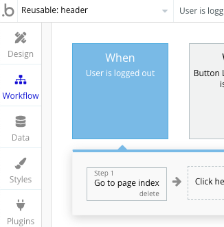

----

##### 演習9: 詳細画面から更新画面への導線を設け、更新機能を作ってみよう

- ポイントとしては次のシートの通りです！ぜひ実践してみてください！

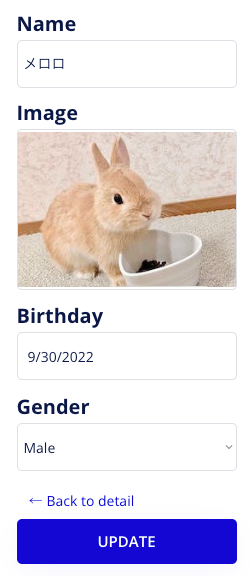

---

- 更新画面は登録画面とほぼ同じ画面要素を持つので `pet_register` を Clone して `pet_update` を作ってみましょう
- 登録画面では、各入力要素（名前や誕生日など）の中身は空っぽでしたが、更新画面では既に登録済みのデータの値を画面表示時点でセットしてあげる必要があります
- 各入力要素のダイアログからそれっぽい項目がありますので、そこに初期値となる値を指定します
  - Hint:bulb: Insert dynamic data
  - Hint:bulb: Initial content

---

- 更新ボタンを押したときの振る舞いについては、新規登録時には `Data(Thing)` の `Create a new thing...` でしたが、今回は更新ですよね
  - 更新といえば change... お、それっぽいアクションがありそうですね :yum:
- 最後に詳細画面から更新画面へ遷移するとき、詳細画面で表示しているペットの情報を渡してあげる必要がありますね。これは今日の講義で学んだ部分です！
  - Hint:bulb: Data to send

---

##### 演習10

今日学んだ機能を使って、自由に機能追加してみてください
できたら Slack でログイン画面の URL を共有して、みなさんに見てもらいましょう

---

##### 演習10の結果発表

(時間があれば)

演習で作った画面・機能を紹介してみませんか :smile: ?

---

## まとめ

- 今回のレクチャーでは Bubble の使い方から始まり、実際に画面をデザインするところから、データベースとの連携まで行いました
- 基本的な流れは Adalo と似ている部分もありつつ、ワークフロー周りの考え方はビジュアルプログラミングツールと呼ばれる所以をを少しは感じていただけたかなと思います
- 次回は Bubble のより深いところをレクチャーしていければと思いますので乞うご期待！

---

# 以上です！
# お疲れさまでした！
