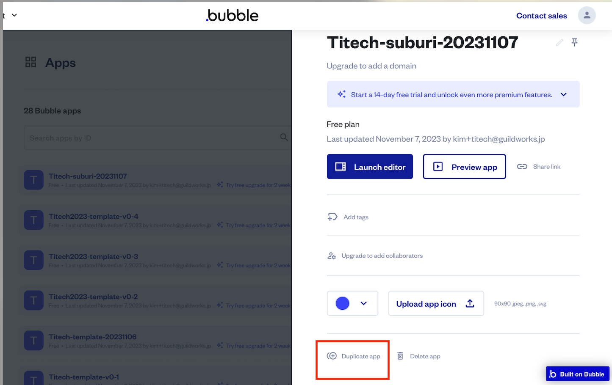
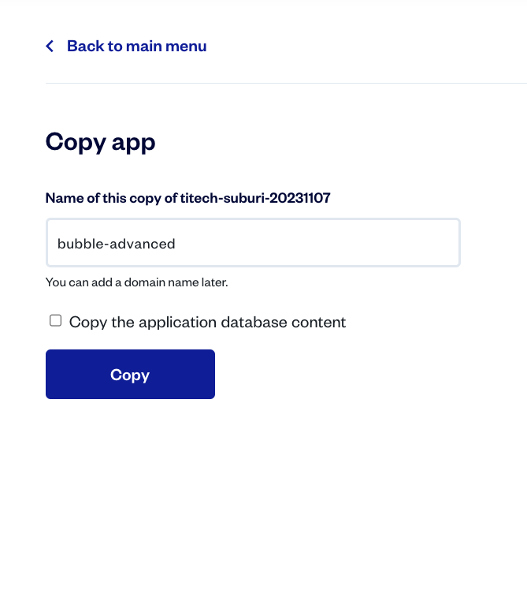
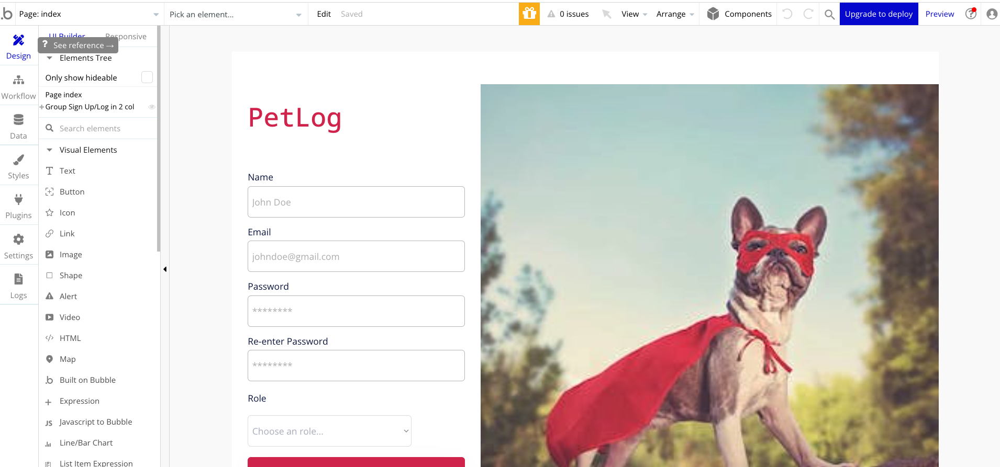
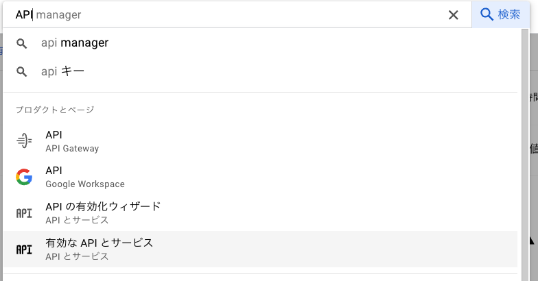
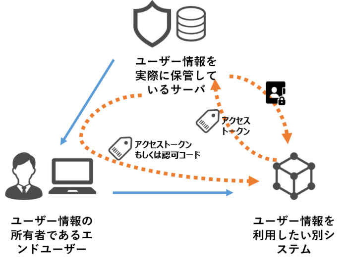
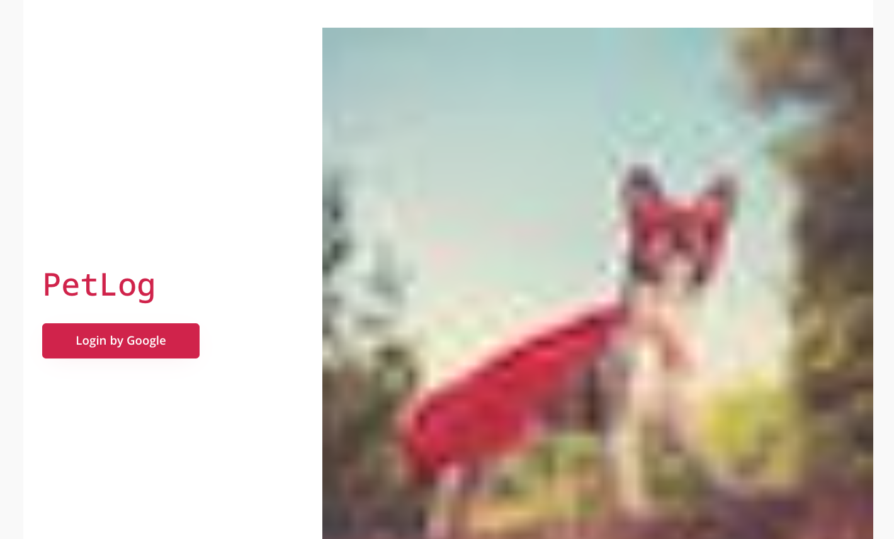
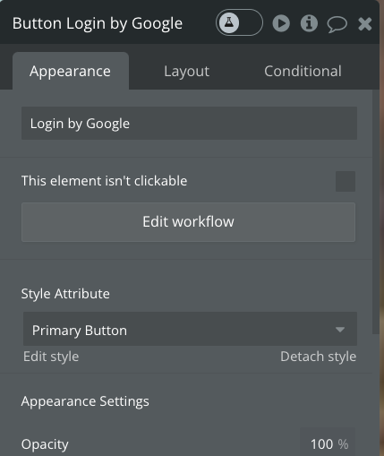
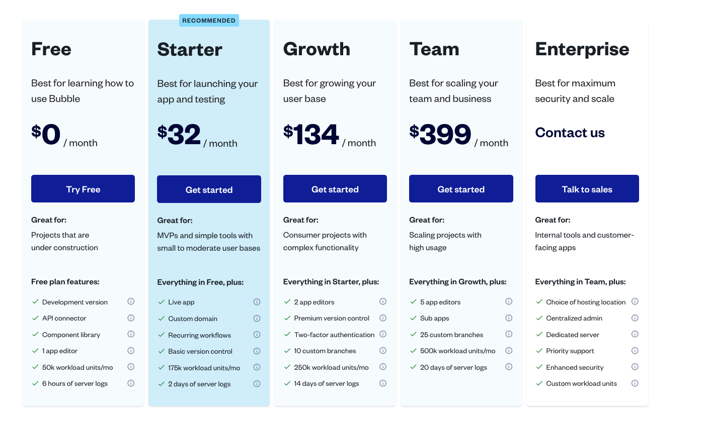

Programming Boot Camp Learning Phase #3

# Bubble Advance

2023/11/11

---

## table of contents

- External collaboration with Bubble
- Tips for collaboration in Bubble
- Team development exercises
- summary

---

### Confirm what to do

- First, learn how to integrate applications created with Bubble with external services.
- Next, we will introduce some tips and things to keep in mind when working together using one application.
- Finally, the Development Phase team will practice and present app development

---

## External collaboration with Bubble

---

The screen includes the following functions:

- Display a list of YouTube videos
- Social login using your Google account
- Dynamically search YouTube video list

---

##### First, prepare a new application as the foundation

- Bubble I would like to copy and reuse the application used in the first lecture.
- Visit https://bubble.io/home?tab=apps

---

-A list of his Bubble apps created by each person's account will be displayed.
- From there, select the application you created in the basics section and click `Duplicate app` at the bottom of the popup

---

- An input dialog for the application name after copying will be displayed, so enter an appropriate name.
- Since the previous data will not be reused, leave the `Copy the application database content` check unchecked.
-Click COPY

---

- When the copying is complete, it is OK if the editing screen (index) of the copied application is displayed.

---

## What is API?

API (Application Programming Interface) is a method for software and applications to communicate with other software and services. Through APIs, applications can share data and expose and leverage the functionality of other applications.

---

##### Preparation for YouTube linkage

- Next, make the necessary preparations to display the YouTube video list.
- In this lecture, we will use various APIs provided by the cloud service "Google Cloud Platform" provided by Google.
   - Think of it as Google's version of "Amazon Web Service" (AWS) provided by Amazon

---

- Access the URL below
   - https://console.developers.google.com/
- Log in with your Google account
   - If you do not have a Google account, please create one.

---

- When you access the Google Cloud Platform (GCP) screen for the first time after logging in, a dialog like this will be displayed, so select your country, check the terms of service, and click "Agree and continue"

---

- Once you agree, the API and service dashboard will be displayed, so click the Create project link to create the project (box) for this lecture.

---

- A new project creation screen will be displayed, so specify an appropriate name for the project name and create it.

---

- Once creation is complete, the dashboard of the created project will be displayed
- It is OK if the created project name is displayed to the left of Google Cloud at the top of the screen.

---

- Next, we will issue the authentication key necessary to display the YouTube video list.
- Type "API" in the search box at the top of the screen to open the API and Services menu.

- Select "APIs and Services" in the "Projects and Pages" block from the suggestions

---

- When the API and services page opens, select "Credentials" from the left menu
- The right panel will change to authentication information, so click "+Create authentication information" at the top of the screen
- Select "API Key" from the popup

---

- A pop-up will appear informing you that API key creation is complete, so make a note of the value.
- You will be asked to restrict keys, but we will delete these keys at the end of the lecture, so let's continue as is.

---

- Now that we have issued the key to get the YouTube list from Bubble, let's configure the settings on the Bubble side.
- First, prepare to retrieve the YouTube list from Bubble via API

---

##### Preparation for Bubble API integration

- Select Plugins from the left menu and click the Add plugins button
- Search for "API" and install the plugin called `API Connector`

---

- This plugin is a plugin that allows you to connect Bubble to information on the other side of the API using APIs published in the world from the Bubble app.
- Some Bubble plugins are specialized for specific APIs and may be simpler to configure than this API Connector.
- This time, let's use the YouTube API via the most basic API Connector plugin to display a list of videos.

---

- Now let's configure the settings to use the YouTube API.
- Select "API Connector" from Installed Plugins on the Plugins tab
- There is an overview of this plugin on the right panel, click "Add another API" below to start setting up a new API integration

---

- When you click "Add another API", you will see API settings parts like this
- We will provide a brief explanation and settings for each item.

---

1. API Name: Group name for this API integration
   -This time YouTube

---

2. Authentication: Common authentication method performed by APIs under this group
   - This time "None or self-handled"

---

3. Shared headers for all calls: Common header information specified for all APIs under this group.
   *Not specified this time

---

4. Shared parameters for all calls: Common parameter information specified for all APIs under this group
   *Not specified this time

---

- Next, we will set the specific API contents for this group.
- On the previous screen, there is a link to the right of the block that says "API Call", click on it.

---

- Then, the specific API setting items will be displayed, so I will briefly explain them.

---

1. Name: Specific API name
   * This time enter "search"

---

2. Path: URL of specific API
   * This time enter `https://www.googleapis.com/youtube/v3/search`

---

3. Headers: Header information specific to this API
   *Not specified this time

---

4. Parameters: Parameter information specific to this API
   * This time, specify the following two parameters. Private / Allow blank / Optional as attached
     1. Key: `key`, Value: API key issued earlier on the Google account side
     2. Key: `q`, Value: Keyword when searching for motion on YouTube (please specify freely)

---

- This is what it looks like when everything is set

---

- After completing the settings, check that the settings are correct.
- Click the "Initialize call" button at the bottom

---

- You probably got an error message with Status code 403.
- The content is as written, but it can be summarized as follows.

> YouTube Data API v3 is disabled in your project.
> Visit this URL to enable it and try again.

---

-It seems that the YouTube Data API used this time is not enabled on each person's girlfriend's Google account.
-This is because from the beginning, Google has turned off features that everyone won't use, and only those who need them can turn them on themselves.
- So this time we want to use the YouTube Data API, so access the URL in the message and enable it.
   https://console.developers.google.com/apis/api/youtube.googleapis.com/overview?project={Each person's project ID}

---

- Then you should be kindly redirected to the "YouTube Data API v3" screen that you want to use this time.
- Click "Enable" to enable it as shown on the screen

---

- After a while, you should see a screen like this
- If the red line at the top of the screen says "Disable API", activation is successful.

---

- Now that YouTube Data API has been enabled, return to the Bubble screen and click the "Initialize call" button.
- If successful, you should see a popup saying "Returned values - search"

---

- This represents the information of the result (response) of executing the "https://www.googleapis.com/youtube/v3/search" API that we set this time.

---

I won't go into details, but there are three main points:

- The part marked `items(list)` is a list that stores the list of search results videos.
- The type is `search item`, which indicates that there are multiple types of data included in the search results.
-The most important item in the settings that follows is `id videoId`

---

- As anyone who has watched YouTube will know, this VideoId is information that uniquely identifies each video, and this ID is also required when displaying on screen.
- Other items that are not particularly referenced may be confusing, so select `Ignore field` from the dropdown.
- By doing this, when handling it as Dynamic data, it will not be displayed in the options, so you will not have to worry about choosing a setting item.

---

- This is what it looks like when everything is set
- Once the settings are complete, click "SAVE" to save the settings.

---

##### Preparing for screen display

- Now that we are ready to integrate Bubble's API, let's set up the screen.
- I think you have mastered the screen settings from the previous and this lecture, so please just give me an overview and try assembling the screen layout.

---

- Create a "video_list" screen by cloning the pet_list page
- Delete all contents of each cell of Repeating Group
- Instead, set the Visual elements Video to fill the cell.
- Something like this

---

- Now that the layout is created, let's actually set up the YouTube list display.
- First, the Type of content of Repeating Group is the `search item` type that we checked earlier when executing the API.
- Now the type of data to repeat is for each YouTube video

---

- Next is the data source, but this time we will target the YouTube video list obtained from the API.
- If you look at the options from Click, you will see an item called `Get data from an external API`, so select that.

---

- A popup will appear next to Get data from an external API, select the API provider dropdown.
- Then, there will be a candidate for `YouTube - search` that you set earlier in the dropdown, so please select it.
   - The name before the hyphen is the API group name, and the name after the hyphen is the specific API name.

---

- Once the API Provider is configured, close it with CLOSE
- And further select `'s items` as the Data source selection of the original Repeating Group
- Now you can specify that the list of videos (items) included in the API results will be displayed repeatedly.

---

- Next, we will set up each cell, but first let's set it up.

- Hint :bulb:
   - Video source is YouTube
   - Then an item called Video ID will be displayed, so it seems like you should refer to the `Video Id` that you saw earlier when setting up the API.

---

- Something like this

---

- The setup is now complete! Let's preview it now!
- Did you see a list of videos for the keywords you specified in advance using the API?

---

---

##### Try Google Login

- Next, log in to the Bubble app using your Google account!
- First, install the Google plugin

---

- Select installed Google plugins
- Check the `Use a generic redirect URL` box displayed on the right panel
   - Make a note of this URL as well, but since you cannot select it on the screen, please replace the app name part of the URL below with your own app name and write it down 😅
   - `https://{Your App Name}.bubbleapps.io/api/1.1/oauth_redirect`

---

---

## What is OAuth?
OAuth is a mechanism on the Internet that allows one service to authenticate and access resources without revealing its password to another service. If you want to use another service (e.g. a pet management service) but don't want to create a new account to do so, you can use OAuth to log in with your existing account (e.g. Google or Facebook account).

---

## How it works
- Login request: Select "Login with Google Account" for the pet management service.
- Permission confirmation: Google asks, "Can I use some of your information for this service?"
- Passing a "key": If you give permission, Google will pass a special "key" to the service. That service then has access to limited information, such as your name and email address.

---

##### Preparing for authentication to return to the app after logging in to Google

- Access the Google Cloud Platform screen

https://console.developers.google.com/

- Display the same API and service screen as before

---

- Select the project and select "OAuth consent screen" from the left menu

---

- Select "External" for User Type and click Create

- Enter the required information on the next page

---

- App information
   - App name: App name created with bubble
   -User support email: your own Google account email address

---

- Approved domains
   - bubbleapps.io
- Developer contact information
   - Your Google Account email address
- "Save and Next"

---

- Do not change the scope settings and click "Save and Next"

---

-Enter your girlfriend's Google email address as the test user
- After setting, save and continue

---

- Registration is now complete, so we will issue authentication information next.
- Select credentials from the left menu and click "+ Create Credentials"
- Select OAuth Client ID from the submenu

---

- The screen for creating an OAuth client ID will be displayed, so enter it as shown below and click "Save".
   - Application type: Web application
   - Name: `Bubble OAuth`

---

- Approved redirect URI: URL you recorded when installing the Google plugin on Bubble side
   `https://{Your App Name}.bubbleapps.io/api/1.1/oauth_redirect`

---

- Click "Create"
- Then a popup will appear saying "OAuth client has been created" and the client ID and client secret will be displayed, so make a note of them.
   - If you have a memo and you might forget it, you can download the JSON.
- Make a note and close with OK

---

##### Set the issued authentication information on Bubble side

- Return to Bubble's Google plugin screen and enter the key you obtained earlier into each field.
   - Client ID → AppID/API Key
   - Client Secret → App Secret

---

- Pre-configuration is now complete
- Next, we will create a login function

---

##### Replace login mechanism with Google

- Open the index screen and remove all signup text boxes and buttons
- Place a new button and change the label to `Login by Google`

---

- Click `Edit workflow` in the settings window of the button you placed to start creating the button click workflow

---

- Set up the Google Login workflow
- Select Click here to add an action...
- Select Signup/login with a social network from Account

---

- A Signup/login with Google popup will appear
- Select Google as OAuth provider

---

Specify that you will be redirected to the pet list after logging in.
- Select Click here to add an action...
- Specify `Navigation`>`Go to page`
- Specify `pet_list` as Destination

Now you can log in with your Google account. It's easy.

---

- As a precaution, let's display the account name and image at the top of the header once you have successfully logged in.

---

- Open the header of Reusable elements

---

-
- Switch to the Design tab and display the following three components that are currently hidden from the Elements tree.
   - If you do not do this, it will be difficult to understand the image after adding the image.

---

- Select Image from Visual elements and place the image between the "Pet Register" link and the "Log in" button
   - Make it a square with dimensions 50 x 50.

---

- and set the image source
- Bubbler users will have an idea of how to set it up.
- Dynamic display settings are Dynamic image
-What you want to display is the profile image of the currently logged in user's girlfriend's Google account.

---

- Something like this

---

- Let's preview it!
   - In advance, if there is any data in the Data User with the same email address as the Google email address that you will use to check the operation, please delete it.
- When you press the login button, you are taken to the Google login screen, and when you log in there, you are returned to Bubble, right?
- By the way, when you log in, the email address information of the Google account you logged into will be registered in the User data on Bubble.
   - Of course, your password is not saved, so don't worry :smile:

---

#### <Advanced>

##### Finally, let's incorporate the search function using the YouTube API

---

#### <Advanced>

- Currently, YouTube API authentication keys and search keywords are fixed.
- So, let's change this to the following
   - Obtain the authentication key from the logged in user information (add a new field)
   - Search keywords can be entered and searched from the screen

---

#### <Advanced>

I will write some hints on the next page, so let's try it first!

---

#### <Advanced>

- First, add a field called `key` to User and set it in advance.
   - Normally, it would be natural to have the user enter the information themselves, but due to time constraints, we will omit the API key setting screen this time.
- If you want to dynamically set API parameters during processing, first remove the fixed value and uncheck `Private`, then you can specify the parameters when calling the API with DataSource etc.
- Place new search elements (text box and search button) on the video_list page, and when the search button is clicked, search via YouTube API and set the results to Repeating Group.

---

# :hourglass_flowing_sand:
# :hourglass_flowing_sand:
# :hourglass_flowing_sand:
# :hourglass:
# :hourglass:

---

#### <Advanced>

- Explain important points
- First, add a field called `key` to the User type

---

#### <Advanced>

- Then, set the authentication key (API key) you obtained this time to the registered User in advance.

---

#### <Advanced>

- Next, the settings on the YouTube API side are like this.

---

#### <Advanced>

- The key point is that for items that you want to specify dynamically, delete the Value value and uncheck Private.
- This allows you to specify values for these parameters when using the API

---

#### <Advanced>

- While we're at it, let's add two search options.
- key: `maxResults`, number of data to retrieve in one search
   - Default is 5
- key: `type`, type of data to search for
   - You can search only videos by specifying `video`

---

#### <Advanced>

- Then empty the Repeating Group's Data source
- The target data to be displayed will be specified in the workflow of the new search function, so there is no problem even if this field is empty.

---

#### <Advanced>

- This will be the workflow setting for the next keyword search, so set the workflow for the newly prepared search button.
- This time, select "Display list" in "Element Actions" since the action will be for an element (Repeating Group).

---

#### <Advanced>

- Select Get data from an external API for Data source to display data via API.
- And when you select `YouTube - search` as the API provider, you should see two params that weren't there before.
- This is because you previously unchecked Private for the parameters you want to specify dynamically in the settings on the YouTube API side.
- The value specified here is the usual Dynamic data.

---

#### <Advanced>

- This is what it looks like when you set it up

---

#### <Advanced>

#### Let's preview

- Did you see a list of videos you entered in the keyword field while logged in?

---

#### <Advanced>

- What did you think?
- I think the range of things that can be done with Bubble has been further expanded by linking with API!
- Some teams may use external APIs at the training camp, so let's take advantage of what we learned today and put API collaboration into practice!

---

## Tips for collaborating with Bubble

Here's some useful information when collaborating with your team using Bubble.

---

#### How to invite team members on Bubble

To co-author an app with your team members...
- The team will prepare one account and everyone will log in and use that account.

---

- Bubble has a collaborative editing function using a regular method... 💰💰💰

---

#### Notes on simultaneous editing with Bubble

- Avoid simultaneous editing on the same element (later edits will overwrite it)
   - To this end, we recommend assigning a person to be in charge of each screen and avoid editing the same screen at the same time.
- There are no other special considerations.
- Edits are reflected on other people's screens in real time.
   - Not only screen edits, but also database and Workflow edits are reflected in real time.
- If you divide the work between screens, <!-- you won't accidentally touch other screens (the canvas is divided), so --> development will be easy.

<!-- ---
Introduction to mob programming?
- Will you include a story like the driver and navigator? -->

---

## Team development exercise

- Try developing a new app with the DevelopmentPhase team
   - Make the app different from the one you plan to develop in DevelopmentPhase.
- You are free to use Adalo or Bubble
   - You can choose the one you plan to use in DevelopmentPhase, or you can choose both.
- Let everyone move their hands

---

#### Example of how to divide work

- Let's all work together to identify screens and functions and design the database first.
- Decide who will be in charge of each screen (registration screen person, list screen person, detail screen person, update screen person, etc.)
- Another option is for multiple people to work on the same PC. In that case, the person who operates the PC and the person who gives instructions should be alternated regularly.

---

# :hourglass_flowing_sand:
# :hourglass_flowing_sand:
# :hourglass_flowing_sand:
# :hourglass:
# :hourglass:

---

#### Announcement of exercise results

Let's have each team present about the app they created during the exercise!

---

## summary

- That's all for the learning phase lecture.
   - Have you mastered Adalo or Bubble?
   - Do you have an idea of how to develop a team?
- From the next session onwards, we will be in the Development Phase, where each team will brush up and develop the ideas they presented.
   - In preparation for that, let's reconfirm our ideas and select the tools (Adalo, Bubble, or something else?) to use for development.

---

### lastly

- Delete the API key and OAuth information issued by Google Cloud Platform.

---

# that's all!
#　Thank you for your hard work!