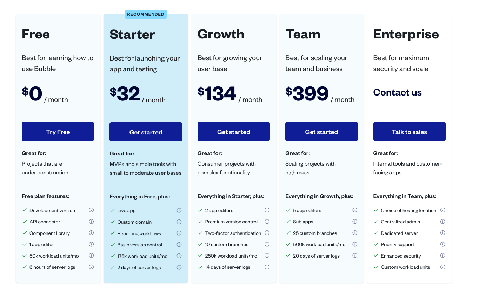

Programming Boot Camp Learning Phase #3

# Bubble Advance

2023/11/11
　
　
　
　
　

---

## 目次

- Bubble での外部連携
- Bubble での共同作業の Tips
- チーム開発演習
- まとめ

---

### やることの確認

- ここではまず、Bubble で作ったアプリケーションを外部のサービスと連携させる方法を学びます
- 次に、1つのアプリケーションを使った共同作業に関するコツや注意点をご紹介します
- 最後に、Development Phaseのチームでアプリ開発の演習と発表を行います

---

## Bubble での外部連携

---

機能としては下記を盛り込んだ画面となります

- YouTube の動画一覧を表示
- Google アカウントを使ったソーシャルログイン
- YouTube の動画一覧を動的に検索

---

##### まずは土台となるアプリケーションを新たに用意

- Bubble 1 回目の講義で使ったアプリケーションをコピーして使い回したいと思います
- https://bubble.io/home?tab=apps にアクセス

---

- 各自のアカウントで作成している Bubble アプリの一覧が表示されます
- その中で、先ほどまでの基礎編で作ってきたアプリケーションを選択して、ポップアップの最下部にある`Duplicate app`をクリック

---

- コピー後のアプリケーション名の入力ダイアログが表示されるので、適当な名前を入力
- 以前のデータは使い回さないので `Copy the application database content` のチェックは OFF のまま
- COPY をクリック

---

- コピーが終わると、コピーしたアプリケーションの編集画面（index）が表示されれば OK です

---

## APIって何？

「API（Application Programming Interface）」のことで、ソフトウェアやアプリケーションが他のソフトウェアやサービスと通信するための方法です。APIを通じて、アプリケーションはデータを共有したり、他のアプリケーションの機能を公開し、利用することができます。

---

##### YouTube 連携の事前準備

- 続いて、YouTube の動画一覧を表示するために必要な下準備を行います
- 今回の講義では Google が提供しているクラウドサービス "Google Cloud Platform" に用意されている各種 API を使っていきます
  - Amazon が提供している "Amazon Web Service" (AWS) の Google 版だと思ってください

---

- 下記 URL にアクセス
  - https://console.developers.google.com/
- ご自身の Google アカウントでログインしてください
  - もし、Google アカウントをお持ちでない方は、アカウントの作成をお願いします

---

- ログイン後、はじめて Google Cloud Platform(GCP) の画面にアクセスするとこのようなダイアログが表示されますので、国を選択し、利用規約にチェックを入れて「同意して続行」

---

- 同意すると、API とサービスのダッシュボードが表示されると思いますので、プロジェクトを作成のリンクを押下して今回の講義用のプロジェクト（箱）を作成します

---

- 新しいプロジェクトの作成画面が表示されるのでプロジェクト名に適当な名前を指定して作成

---

- 作成が完了すると、作成したプロジェクトのダッシュボードが表示されます
- 画面上部の Google Cloud の左隣に作成したプロジェクト名が表示されていれば OK

---

- 続いて YouTube の動画一覧を表示するために必要な認証キーを発行していきます
- API とサービスというメニューを開くため、画面上部の検索ボックスに "API" と入力

- サジェスト候補の中から "プロジェクトとページ" ブロックにある "API とサービス" を選択

---

- API とサービスページが開いたら、左メニューから「認証情報」を選択
- 右パネルが認証情報に変わるので、画面上部の「＋ 認証情報を作成」をクリック
- ポップアップから「API キー」を選択

---

- すると API キー作成完了のポップアップが表示されるので、その値を控えておきます
- キーを制限しろと言われますが、講義の最後にこれらのキーを削除しますので一旦このまま行きます

---

- これで Bubble から YouTube の一覧を取得するためのキーが発行できたので Bubble 側の設定を行っていきます
- まずは Bubble から YouTube の一覧を API を介して取得するための準備を行います

---

##### Bubble の API 連携の準備

- 左メニューから Plugins を選択し、Add plugins ボタンをクリック
- "API" で検索し、 `API Connector` というプラグインをインストールします

---

- このプラグインは Bubble のアプリから、世の中で公開されている API を使って、API の向こう側の情報と Bubble を繋げるためのプラグインとなります
- いくつかの Bubble のプラグインの中には、特定の API に特化させたものもあり、それらのプラグインはこの API Connector よりも設定が単純なものもあります
- 今回は一番の基本形となる API Connector プラグインを介して YouTube API を使い、動画の一覧を表示してみましょう

---

- それでは YouTube API を使うための設定を行っていきます
- Plugins タブで Installed Plugins の中から "API Connector" を選択
- 右パネルにこのプラグインの概要が記載されているので、その下にある "Add another API" をクリックし、新しい API 連携の設定を開始します

---

- "Add another API" をクリックすると、このような API 設定部品が表示されると思います
- 各項目の簡単な説明と設定をしていきます

---

1. API Name: この API 連携のグループ名
  - 今回は YouTube

---

2. Authentication: このグループ配下の API で行う共通の認証方式
  - 今回は "None or self-handled"

---

3. Shared headers for all calls: このグループ配下の API すべてで指定する共通のヘッダー情報
  * 今回は特に指定しません

---

4. Shared parameters for all calls: このグループ配下の API すべてで指定する共通のパラメータ情報
  * 今回は特に指定しません

---

- 続いて、このグループに対して具体的な API の内容を設定していきます
- 先ほどの画面で "API Call" となっているブロックの右側に expand というリンクがあるのでそれをクリック

---

- すると、具体的な API の設定項目が表示されますので、簡単に説明します

---

1. Name: 具体的な API の名前
  * 今回は "search" と入力します

---

2. Path: 具体的な API の URL
  * 今回は `https://www.googleapis.com/youtube/v3/search` を入力します

---

3. Headers: この API 固有のヘッダー情報
  * 今回は特に指定しません

---

4. Parameters: この API 固有のパラメータ情報
  * 今回は下記 2 つのパラメータを指定します。Private / Allow blank / Optional は添付の通り
    1. Key: `key`、 Value: 先ほど Google アカウント側で発行した API キー
    2. Key: `q`、Value: YouTube で動作検索をする際のキーワード（ご自由に指定ください）

---

- すべて設定するとこんな感じです

---

- 設定が終わったら、設定内容が正しいかを確認します
- 下部にある "Initialize call" ボタンをクリック

---

- おそらく Status code 403 のエラーメッセージが返ってきたはずです
- 内容は書いてある通りですが、要約するとこんな感じです

> YouTube Data API v3 はあなたのプロジェクトで無効になっています。
> この URL にアクセスして有効にしてから再試行してください。

---

- どうやら今回利用した YouTube Data API が各人の Google アカウント上で有効になっていないようです
- これは Google さんが全員が使わないであろう機能は最初から OFF にしていて、必要ある人だけ自分で ON にしてね、という状態になっています
- なので今回は YouTube Data API を使いたいので、メッセージに記載されている URL にアクセスして有効化しましょう
  https://console.developers.google.com/apis/api/youtube.googleapis.com/overview?project={各人のプロジェクトID}

---

- すると親切に今回利用したい "YouTube Data API v3" の画面へ遷移したはずです
- 画面にあるとおり「有効にする」をクリックして有効にします

---

- しばらくするとこんな画面に遷移するはずです
- 画面上部の赤線部分が「API を無効にする」となっていれば有効化は成功です

---

- YouTube Data API が有効化できたので、再度 Bubble の画面に戻り "Initialize call" ボタンをクリック
- 成功すると "Returned values - search" というポップアップが表示されるはずです

---

- これは今回設定した "https://www.googleapis.com/youtube/v3/search" の API を実行した結果（レスポンス）の情報を表しています

---

詳しくは割愛しますが、ポイントとしては下記 3 つです。

- `items(list)` となっている部分が検索結果の動画一覧が格納されている一覧になります
- その型となるのが `search item` という型となり、検索結果に含まれる複数系のデータであることを表しています
- そして、この後の設定で特に重要なのが `id videoId` となっている項目です

---

- YouTube を見たことがある人なら分かると思いますが、この VideoId というのが、それぞれの動画を一意に識別する情報となっており、画面表示するときにもこの Id が必要となります
- その他、特に参照しない項目については紛らわしいのでプルダウンの中から `Ignore field` を選択しておきます
- こうすることで、Dynamic data として扱う時に、選択肢の中に表示しないようになり、設定項目を選ぶ際に悩まずに済みます

---

- すべて設定するとこんな感じです
- 設定が完了したら "SAVE" をクリックして、設定内容を保存しておきます

---

##### 画面表示の準備

- Bubble の API 連携の準備が出来たので、いよいよ画面の設定をしていきます
- 画面の設定は前回と今回の講義でマスターしていると思いますので、概要だけお伝えして画面レイアウトを組み立ててみてください

---

- pet_list ページを clone する形で "video_list" 画面を作成
- Repeating Group の各セルの中身を全て削除
- 代わりに Visual elements の Video をセル内いっぱいになるよう設置
- こんな感じですね

---

- レイアウトが出来たので実際に YouTube の一覧表示を設定していきます
- まず Repeating Group の Type of content は、先ほど API 実行時に確認した `search item` 型となります
- これで繰り返しするデータの種類が YouTube の動画 1 つ 1 つとなります

---

- 次に Data source ですが、今回は API から取得した YouTube の動画一覧を対象とします
- Click から候補を見てみると `Get data from an external API` という項目があると思うのでそちらを選択

---

- 隣に Get data from an external API のポップアップが表示されるので、API provider のプルダウンを選んでください
- すると、プルダウンの中に先ほど設定した `YouTube - search` の候補があると思いますのでそれを選択してください
  - ハイフンの前が API のグループ名で、後ろが具体的な API の名前です

---

- API Provider が設定できたら、CLOSE で閉じます
- そして元の Repeating Group の Data source の選択として、さらに `'s items` を選択します
- これで、API の結果に含まれる動画一覧（items）を繰り返し表示する、という指定ができました

---

- 次に各セルの設定をしていきますが、まずは皆さん設定してみましょう

- Hint :bulb:
  - Video source は YouTube
  - すると Video ID という項目が表示されるので、先ほど API 設定をしたときにみた `Video Id` を参照すればよさそうですね

---

- こんな感じですね

---

- これで設定完了です！さっそくプレビューしてみましょう！
- 事前に API で指定したキーワードの動画一覧が表示されましたか？

---

---

##### Google ログインを試してみよう

- 続いて Bubble アプリへのログインを Google アカウントを使ってログインしてみましょう！
- まずは Google のプラグインをインストール

---

- インストールした Google プラグインを選択
- 右パネルに表示されている `Use a generic redirect URL` の欄にチェックを入れる
  - この URL もメモしておくのですが、画面上で選択ができないため、下記 URL のアプリ名部分だけご自身のアプリ名に読み替えてメモしておいてください 😅
  - `https://{Your App Name}.bubbleapps.io/api/1.1/oauth_redirect`

---

---

## OAuthとは何か
OAuthはインターネット上で、あるサービスが別のサービスにパスワードを明かすことなく、認証とリソースアクセスを可能にするための仕組みになります。あなたが他のサービス（例えばペット管理サービス）を使いたいけど、そのために新しいアカウントを作りたくないとき、OAuthを使って既存のアカウント（例えばGoogleやFacebookのアカウント）でログインできます。

---

## どうやって動くのか
- ログインのリクエスト: ペット管理サービスに「Googleアカウントでログイン」を選ぶ。
- 許可の確認: Googleが「このサービスにあなたの情報の一部を使ってもいいか」と尋ねる。
- 「鍵」の渡し: 許可すると、Googleはそのサービスに特別な「鍵」を渡す。すると、そのサービスはあなたの名前やメールアドレスなど、限られた情報にアクセスできるようになります。

---

##### Google へのログイン後にアプリに戻ってくるための認証準備

- Google Cloud Platform 画面にアクセス

https://console.developers.google.com/

- 先程と同じ API とサービスの画面を表示

---

- プロジェクトを選択し、左メニューから "OAuth 同意画面" を選択

---

- User Type に "外部" を選択して作成をクリック

- 次ページで必要事項を入力していきます

---

- アプリ情報
  - アプリ名: bubble で作成したアプリ名
  - ユーザーサポートメール: ご自身の Google アカウントのメールアドレス

---

- 承認済みドメイン
  - bubbleapps.io
- デベロッパーの連絡先情報
  - ご自身の Google アカウントのメールアドレス
- "保存して次へ"

---

- スコープは特に設定変更せず "保存して次へ"

---

- テストユーザにはご自身の Google メールアドレスを入力しておく
- 設定したら保存して次へ

---

- これで登録は完了したので続いて認証情報を発行します
- 左メニューから認証情報を選択して、「＋ 認証情報を作成」をクリック
- サブメニューから OAuth クライアント ID を選択

---

- OAuth クライアント ID の作成画面が表示されるので下記の通り入力し「保存」
  - アプリケーションの種類: ウェブアプリケーション
  - 名前: `Bubble OAuth`

---

- 承認済みのリダイレクト URI: Bubble 側で Google プラグインインストール時に控えた URL
  `https://{Your App Name}.bubbleapps.io/api/1.1/oauth_redirect`

---

- "作成" クリック
- すると「OAuth クライアントを作成しました」というポップアップが表示され、そこにクライアント ID とクライアントシークレットが表示されているので、それをメモしておく
  - メモだと忘れるかもしれない場合は JSON をダウンロードしても OK
- メモしたら OK でクローズ

---

##### 発行した認証情報を Bubble 側に設定

- Bubble の Google プラグイン画面に戻り、先ほど取得したキーをそれぞれの項目へ入力する
  - クライアントID → AppID/API Key
  - クライアントシークレット → App Secret

---

- これで事前設定は完了
- 続いてログイン機能を作り込んでいきます

---

##### ログイン機構を Google に置き換える

- index画面を開き、サインアップのテキストボックスやボタンをすべて削除しましょう
- 新たにボタンを置いて、`Login by Google`といったラベルに変更しましょう

---

- 設置したボタンの設定ウィンドウで`Edit workflow`をクリックして、ボタンクリック時のワークフロー作成を開始しましょう

---

- Google ログインのワークフローを設定していきます
- Click here to add an action... を選択
- Account から Signup/login with a soccial network を選択

---

- Signup/login with Google のポップアップが表示されます
- OAuth provider に Google を選択

---

ログインができた後に、ペットリストに遷移するように指定しましょう
- Click here to add an action... を選択
- `Navigation`>`Go to page`を指定する
- Destinationに`pet_list`を指定する

これだけでGoogleアカウントでのログインができるようになりました。簡単ですね。

---

- 折角なのでログイン成功したらヘッダー上部にアカウント名と画像を表示してみましょう

---

- Reusable elements の header を開きます

---

- 
- Design タブに切り替え、現在非表示になっている下記 3 つのコンポーネントを Elements tree から表示しておきます
  - こうしておかないと、画像追加後のイメージが分かりづらいため

---

- Visual elements から Image を選択し、"Pet Register" リンクと "Log in" ボタンの間に画像を配置します
  - 縦横 50 x 50 の正方形にしておきましょう

---

- そして、画像の参照元を設定します
- Bubbler の皆さんなら設定方法はイメージつきますよね
- 動的な表示設定は Dynamic image
- 表示したいのは現在ログインしているユーザの Google アカウントのプロフィール画像

---

- こんな感じですね

---

- ではプレビューしてみましょう！
  - 事前に Data の User にこれから動作確認する際に使用する Google メールアドレスと同じメールアドレスのデータがある場合は削除しておいてください
- ログインボタンを押すと Google のログイン画面に遷移し、そこでログインをすると Bubble 側に戻ってきましたよね？
- ちなみに、ログインすると Bubble 側の User data にログインした Google アカウントのメールアドレス情報が登録されます
  - もちろんパスワードは保存されていないのでご安心を :smile:

---

#### ＜Advanced＞

##### 最後に YouTube API を使った検索機能を組み込んでみましょう

---

#### ＜Advanced＞

- 現状では YouTube API の認証キーや検索キーワードは固定になっています
- なので、これを下記のように変えてみましょう
  - 認証キーはログインしているユーザ情報から取得する（新たに field を追加する）
  - 検索キーワードは画面から入力・検索できるようにする

---

#### ＜Advanced＞

次のページにヒントを書いておきますのでまずはトライしてみましょう！

---

#### ＜Advanced＞

- まずは User に対して `key` という field を追加し、事前に設定しておく
  - 本来ここもユーザ自身に入力させるなどの導線が自然ですが今回は時間の都合上、API キーの設定画面は割愛します
- API のパラメータを処理の中で動的に設定する場合、まずは固定値を無くし `Private` のチェックを外すことで、DataSource などで API 呼び出しする際にパラメータを指定できます
- video_list ページに新たに検索用の要素（テキストボックスと検索ボタン）を配置し、検索ボタンがクリックされた時に、YouTube API 経由で検索を行い、結果を Repeating Group にセットしてあげます

---

# :hourglass_flowing_sand:
# :hourglass_flowing_sand:
# :hourglass_flowing_sand:
# :hourglass:
# :hourglass:

---

#### ＜Advanced＞

- 重要なポイントを解説します
- まずは User の型に対して `key` という field を追加します

---

#### ＜Advanced＞

- そして、今回取得した認証キー（API キー）を登録済みの User に事前にセットしておきます

---

#### ＜Advanced＞

- 次に YouTube API 側の設定はこんな感じですね

---

#### ＜Advanced＞

- ポイントとしては、動的に指定したい項目については Value の値を削除し、Private のチェックを外しました
- これにより、API を使う場面でこれらのパラメータの値を指定することができるようになります

---

#### ＜Advanced＞

- ついでに、検索のオプションを 2 つ追加しておきましょう
- key: `maxResults`、1 回の検索で取得するデータの件数
  - デフォルトは 5
- key: `type`、検索対象のデータ種類
  - `video` を指定することで、動画だけの検索が可能

---

#### ＜Advanced＞

- 続いて Repeating Group の Data source を空にします
- 表示する対象データの指定は、新たに設ける検索機能のワークフローの中で設定するため、ここが空でも問題ありません

---

#### ＜Advanced＞

- 次にキーワード検索が行われた時のワークフローの設定となるため、新たに用意した検索ボタンに対してワークフローを設定します
- 今回は要素（Repeating Group）に対するアクションとなるため "Element Actions" の中にある "Display list" を選択します

---

#### ＜Advanced＞

- Data source には Get data from an external API を選択し、API 経由のデータ表示とします
- そして API provicer に `YouTube - search` を選択すると、先ほどはなかった 2 つの param が表示されるはずです
- これは先ほど YouTube API 側の設定で動的に指定したいパラメータについて Private のチェックを外したためとなります
- ここで指定する値はいつもの Dynamic data ですね

---

#### ＜Advanced＞

- 設定するとこんな感じです

---

#### ＜Advanced＞

#### プレビューしてみましょう

- ログインしている状態で、キーワード欄に入力した動画一覧が表示されましたか？

---

#### ＜Advanced＞

- いかがでしたでしょうか？
- API 連携を行うことで、Bubble で出来る幅がさらに広がったと思います！
- 合宿でも外部の API を使うチームがあるかもしれませんが、そのときは今日学んだことを活かして、API 連携を実践してみましょう！

---

## Bubble での共同作業の Tips

チームで Bubble を使って共同作業をする時に役立つ情報をお伝えします。

---

#### Bubbleでのチームメンバーの招待方法

チームメンバーと一つのアプリを共同編集するには...
- チームで一つのアカウントを用意し、そのアカウントをみんなでログインして使いまわすことになります

---

- Bubble には正規の方法による共同編集機能はついているのですが... 💰💰💰

---

#### Bubbleでの同時編集の注意点

- 同じエレメントに対する同時編集は避けましょう(後から行われた編集で上書きされます)
  - そのためには、画面ごとに担当者を決めて同じ画面の同時編集を避けるのがおすすめです。
- それ以外の注意点は特にありません。
- 編集は他の人の画面にリアルタイムで反映されます。
  - 画面の編集だけでなく、データベースやWorkflowの編集もリアルタイムで反映されます。
- 画面ごとに作業分担すれば、<!-- うっかり他の画面を触ってしまうこともない(Canvasが分割されている)ので -->難なく開発できそうです。

<!-- ---
モブプログラミングの紹介?
- ドライバーとナビゲーターみたいなお話を盛り込む？ -->

---

## チーム開発演習

- DevelopmentPhase のチームで、新たに一つアプリを開発してみてください
  - DevelopmentPhase で開発予定のアプリとは異なるアプリにしましょう
- AdaloかBubble のどちらを使うかは自由です
  - DevelopmentPhase で使う予定の方を選んでも良いですし、両方を選んでも良いです
- 全員が手を動かすようにしましょう

---

#### 作業分担のやり方の例

- 画面や機能の洗い出しとデータベース設計は最初にみんなで一緒にやりましょう
- 画面ごとに担当者を決めましょう(登録画面担当、一覧画面担当、詳細画面担当、更新画面担当 など)
- 複数人で一つのPCを使って作業をするというやり方もあります。その場合、PC操作をする人と指示をする人は定期的に交代しましょう

---

# :hourglass_flowing_sand:
# :hourglass_flowing_sand:
# :hourglass_flowing_sand:
# :hourglass:
# :hourglass:

---

#### 演習結果の発表

チームごとに演習で作ったアプリについて発表してみましょう！

---

## まとめ

- Learning Phase のレクチャーは以上になります
  - Adalo や Bubble をマスターできましたか？
  - チーム開発のやり方のイメージがつきましたか？
- 次回からは Development Phase として、各チームがプレゼンをしたアイデアのブラッシュアップや開発をしていきます
  - それに向けて、自分たちのアイデアの再確認や、開発に使用するツール(Adalo?Bubble?それ以外?)の選定をしておきましょう

---

### 最後に

- Google Cloud Platform で発行した API キーや OAuth の情報を削除しておきましょう

---

# 以上です！
# お疲れさまでした！
