Programming Boot Camp Learning Phase #3

# Bubble Basic #2-1

2023/11/11

---

## Advance preparation

- Today we will add design and logic to the pet health management app we created last time.
- After that, we will also talk about applications such as API collaboration and team development.
- We have made some changes for today's lecture, so in order to align the starting points, we will ask you to use a duplicate of the application we prepared.
- We will distribute the duplicated application, so please send the email address where you created your Bubble account to `@imahashi`.
- Also, please register about 5 pets to confirm operation.

---

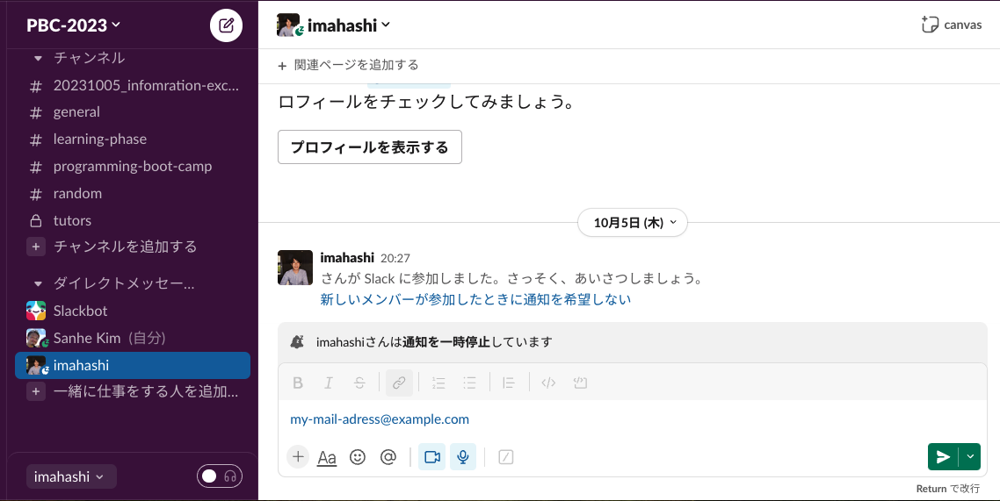

---

## What to do today

   - Review from last time
   - Create a design
   - Create logic
   - Interact with external systems
   - Develop as a team

---

## Review of last time

- [Bubble](https://bubble.io/) is a visual programming tool that allows you to program the appearance and movement by clicking on the screen.
- This is a web application, and it will be compatible with smartphones and PCs by adjusting the display size.

- If you took a break last time, catch up with this material.
   - https://github.com/GuildWorks/titech-2023/tree/main/docs/Bubble1

---

## Review of last time

Pet registration, list, details, and weight recording screens of the pet management application
While making it, I learned how to use Design/Workflow/Data, which is the basics of Bubble.

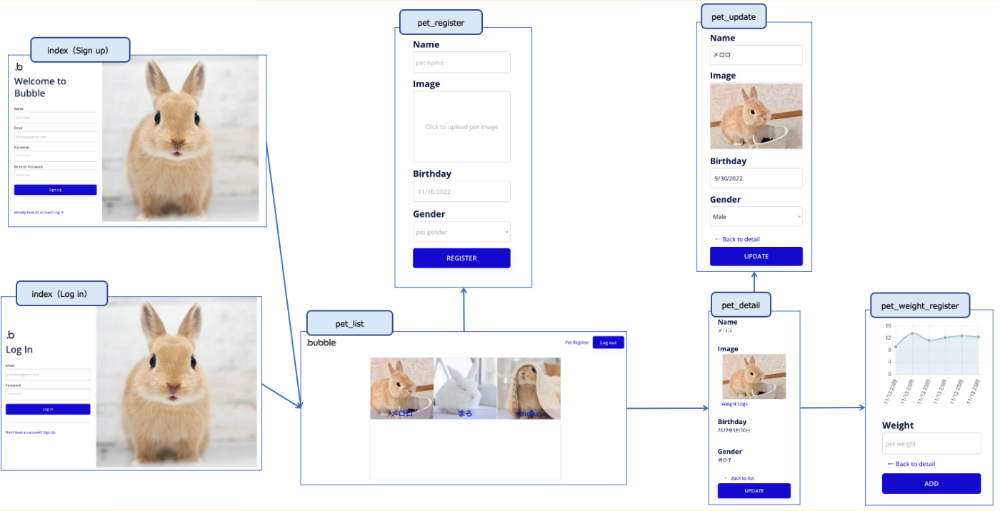

---

## What to do today

First, let's further refine the design and logic of the previous application.

---

### The final result will look like this

top page


---

pet list


---

pet details


---

Advisor pet list


---

### So let's get started.
### First, let's create the design

---

### What to do when creating a design

- Create a screen that matches the display size
   - Control appearance based on display size using a technique called responsive web design
- Try using Style
   - Edit and add styles, or apply styles individually

---

## Create a screen that matches the display size

---

## Create a screen that matches the display size

- Web applications are used on various devices such as PCs, tablets, and smartphones.
- Each device has a different display size, and there is a design method called responsive web design that can accommodate these differences.
- This is a method that allows you to flexibly switch the appearance of elements, such as stretching/shrinking, wrapping/unwrapping, and displaying/not displaying elements, depending on the screen size.
- This is achieved by specifying rules for determining placement and size, rather than specifying fixed placement and size.
- By default, Bubble has a fixed placement and size, but you can also specify various rules.

---

## Frequently used rules

The following rules are often used to achieve responsive design with Bubble.

1. Placement rules within parent elements
2. Element sizing rules
3. Display/display rules

Combine these rules to achieve responsive screen design.
Note that these rules are not limited to Bubble, but apply to web applications in general.

We will incorporate this into the screen later, but there are some difficult ideas, so I will give an overview first.

---

## Rule 1: Placement rule within parent element

This is a rule specification for how to place it within the parent element.

In Bubble, a parent element that encloses a group such as a repeating group or an individual element such as an entire page is called a Container.
Container allows you to specify placement rules for child elements contained within.


---

There are four placement rules for child elements:

- Fixed: Specify the fixed location.
- Align to parent: Specify the relative position to the parent element
- Row: Arrange in row direction (horizontal direction)
- Column: Arrange in column direction (vertical direction)

I will explain them step by step.

---

## Fixed: Specify the fixed location

This is a rule that specifies a fixed location. Specify the placement location in pixels.
This is the initial setting when placing the parent element in Bubble.

Since it is specified as fixed, it will not change from the specified position even if the screen width is changed. In the example below, it extends off the screen.

→

---

## Align to parent: Specify the relative position to the parent element

This rule specifies the relative position of an element to its parent element.
In Bubble, you can specify the placement location from nine areas.


If you change the screen width, move while maintaining the relative position. In the example below, when the screen width is narrowed, the relative positions of upper left, center, and lower right are maintained.
→

---

## Row: Arrange in row direction (horizontal direction)

The rule is to arrange them in the row direction (horizontal direction). Lines will wrap automatically.
In the example below, when the screen width is narrowed, the lines wrap, resulting in them being lined up vertically.
→

---

## Row: You can specify horizontal (left and right) placement within the row.
You can specify vertical alignment within a row for each element.

　(Left-aligned)
　(Centered)
　(Right-aligned)
　(Space-around)
　(Space-between)

---

## Row: You can specify vertical (top and bottom) placement within the row.
You can specify vertical alignment within a row.
*This is specified for the child element, not the parent element.


---

## Column: Arrange in column direction (vertical direction)

Arrange in columns (vertical direction).
In the example below, the pages are arranged vertically with left and right center alignment, and even if the screen width is reduced, they remain centered and arranged vertically.
→

Similar to Row, you can specify horizontal and vertical placement. (Contents that can be specified horizontally and vertically are opposite)

---

## Rule 1 (review): Placement rules within parent elements

This is a rule specification for how to place it within the parent element.
There are four placement rules for child elements:

- Fixed: Specify the fixed location.
- Align to parent: Specify the relative position to the parent element
- Row: Arrange in row direction (horizontal direction)
- Column: Arrange in column direction (vertical direction)

---

## Rule 2: Element sizing rules

Rather than specifying a fixed size, specify rules for determining the size so that it can grow or shrink depending on the screen width. Mainly use one of the following two methods.
- Specify a percentage of the parent element's size
- Specify the maximum and minimum size when expanded or contracted
   - *You can also set it to unlimited without specifying the maximum and minimum.

---

## Specify percentage

The example below specifies the width to be 80% of the screen. If you reduce the screen width, the image size will also become smaller while maintaining the 80% ratio.

→

---

The example below specifies a maximum width of 800px and a minimum width of 300px.
It expands and contracts between 300px and 800px, but even if you widen the screen completely, it will not grow larger than 800px, and conversely, even if you narrow the screen, it will not become smaller than 300px.

→

---

## Rule 3: Display/existence rule

You can display or hide elements on the screen by specifying the lower and upper limits of the screen width.

The example below specifies that the image will not be displayed if the screen width is less than 800px.
→

This is often used when you want to display more information only when the screen is large.

---

## Frequently used rules (review)

The following rules are often used to achieve responsive design with Bubble.

1. Placement rules within parent elements
2. Element sizing rules
3. Display/display rules

Now, let's actually use it.

---

## (Reconfirmation) Advance preparation

- Today we will add design and logic to the pet health management app we created last time.
- We have made some changes for today's lecture, so in order to align the starting points, I would like you to use a duplicate of the application we prepared.
- We will distribute the duplicated application, so please send the email address where you created your Bubble account to `@imahashi`.
- Also, please register about 5 pets to confirm operation.


---

## Apply responsive design to the top page (login page)
First, let's check the responsive design summarized on the top page (login page).
On the home page, when there is sufficient display width, the image will fill the page, but if the screen width becomes smaller, only the sign-up and sign-in areas will be visible.
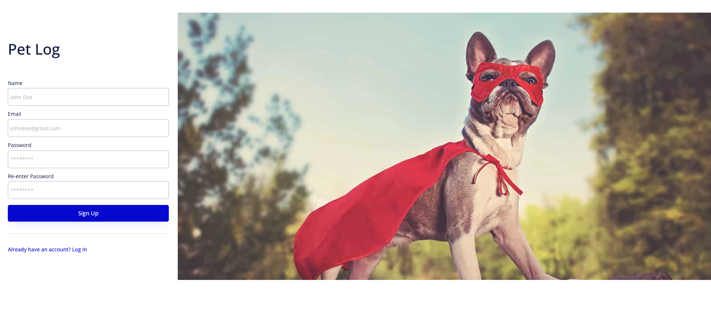→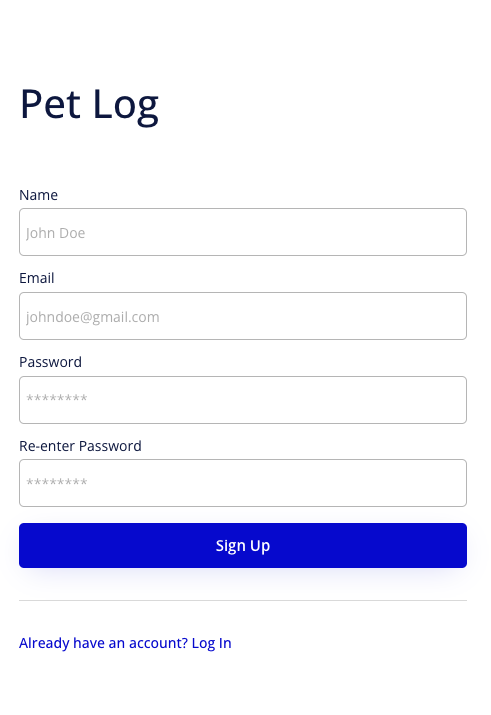

---

### Applied rules

There are many detailed settings, but the following two settings are important.
- Display/existence rules: When the screen width becomes smaller (less than 768px), the image will not be displayed.
- Placement rules within the parent element: Place the input area + image area in the center of the entire screen.

Let's look at them in order.

---

### Visibility rules
In the Conditional tab of the Group Image element, there is a rule that says ``Do not make it Visible if it is 768px or less.''

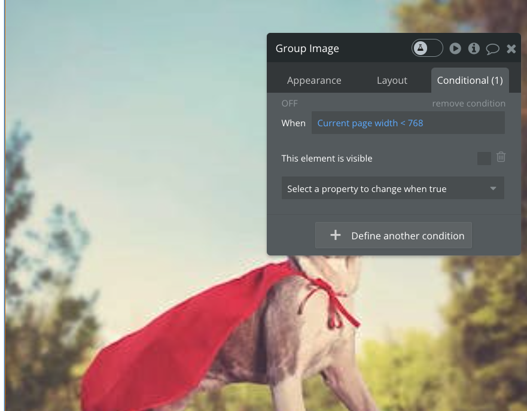

If you remove this setting, the image will not disappear.

---

### Rules within parent element

The following settings are made in the Layout tab of the element Group Sign Up/Log in 2 col.
- Child elements are arranged in row direction
- Center left and right

If you change this setting, it will move to the left, for example.

---

## Apply responsive design to pet list page
Next, apply responsive design to the pet list page.
If supported, the number of columns will change flexibly depending on the screen width, allowing you to see all your pets in a list.
→

We will use Column, which was introduced as a placement rule within the parent element.
We will also combine size specification and responsive settings specific to repeating groups.

---

First, let's change the `Container layout` of the page that will be the parent element.
This time, specify `Column`.
- Open the `pet_list` screen
- Double-click on a blank area of the page to open the page's own settings window
- Specify the Layout tab of the settings window
- Change `Container layout` to `Column`


---

Then, the elements on the screen will automatically line up vertically.
The child elements directly under the parent element set with `Column` are automatically arranged in the column direction (vertical direction). We will use this arrangement as the basics.


---

Next, we will enter settings for the repeating group.
- Open the settings window for the repeating group `pet list` and go to the `Layout` tab
- Enter the following settings
   -Horizontal alignment:`centered`


The elements directly below the pet list page are arranged in columns, but this repeating group will be aligned left and right in the center.

---

Additionally, enter the following settings
   - Make this element fixed-widtht: unchecked
   - Min width: Not specified
   - Max width: 1010px

The width of this repeating group is not fixed, but flexibly expands and contracts depending on the width of the parent element (in this case, the screen itself). However, if it spreads too much, it becomes difficult to see, so the maximum width is limited to 1010px.


---

Enter the following settings
   - Make this element fixed-height: unchecked
   - Min height: Not specified
   - Max height: Not specified (inf) *Probably an abbreviation of infinity
   - Fit height to content: Check

The height of this repeating group is not fixed, but is set to expand and contract to match the contents.


---

Now let's display a preview.

It still looks ugly, but the repeating group should be closer to the center, and it should be able to expand and contract vertically and horizontally.


However, the cell size is not the intended size, and the number of columns does not change. Let's make the settings.

---

Next, move to the `Appearance` tab in the repeating group settings window.
We will set the following.
- Set fixed number of rows: unchecked
- Min height of row: 200px
- Set fixed number of columns: unchecked
- Min width of column: 200px

The number of columns and rows is not fixed, but the minimum width of rows and columns is specified. This allows you to flexibly switch the number of rows and columns depending on the size of the table while maintaining the minimum width.

---

Now let's display the preview.

Although it is still ugly, the number of columns and rows now changes according to the width of the screen and the width of the table.


However, sometimes it ends up on the left side of the cell, or when you reduce the width, unintended margins are created. Let's fix it.

---


Also, go to the `Layout` tab in the repeating group settings window.
Set the following:
- Cell's container layout: Align to parent

These are the settings used on the login page. You can now place elements relative to the parent element (in this case, each cell in the repeating group).


---

Next, we will lay out the elements inside the cell.

Since the elements overlap and are difficult to select, specify them from the `Elements tree` on the left side of the screen.
- There is a section called `Elements tree` at the top of `UI Builder` in the Design menu.
- If `Only show hideable` is checked, uncheck it.
- *If only `pet list` is displayed, click `+` to open the tree.


---

Now, let's configure the settings in order starting from `pet list image`.
- Click `pet list image` in `Elements tree` to open the settings window
- In the `Layout` tab, configure the settings as shown in the image on the right.

The settings will place it in the middle of the cell and display it large enough to fill the cell while maintaining the aspect ratio of 4:5.


---

Next, enter the same settings as the image on the right in `Layout` of `Shape A`.

The setting is to place it at the bottom of the cell and enlarge it to the left and right while maintaining the height of 45px.


---

Next, enter the same settings as the image on the right in `Layout` of `pet list name`.

It has the same content as `Shape A`.


---

Preview.

It's a shame. I'm also concerned about the position of the header and the margins.


---

Open the header settings window and enter the settings on the right in `Layout`.

Centered when arranged in columns on a page. The width is not fixed and grows up to 1080px depending on the page width. Leave a margin of 20px at the bottom. This is the setting.


---

## About Magin and Padding

This is the first time I've heard the word Margin, so I'll explain it.
There are two words that describe margins: Margin and Padding, which each have the following meanings:
- Margin: Margin outside the border of the element
- Padding: Margin inside the border of the element


Please keep this in mind when you want to use white space differently inside and outside the border.

---

Also, add some space to the repeating group.

Set the following in the `Layout` tab of the repeating group.

The settings will be 10px for the top and bottom margins and 50px for the left and right margins.


---

Now let's preview it.


Yay.
Please note that the hamburger menu appears, but don't worry about it not working.

---

### <Advanced>

## Apply responsive design to pet details screen

Since the pet details screen cannot take advantage of the large PC screen, let's make it responsive.

Use the Row placement rule within the parent element to set up multi-column settings.
It also controls the visibility and hiding of elements.

→

---

Combine groups to create columns like this.


---

I feel like this.


---


First, let's create a group like this.


---

Since we want to separate the image area and text area, we will create groups for each.

- Select by dragging the image label and image display area
- Right click (or double tap) to bring up the menu
- Specify `Group elements in a Fixed container`.

A group containing the selected elements is created. Since it is created as a fixed placement group, the placement will be fixed within the group.


---

Similarly, drag the Name, Birthday, and Gender elements to create a Fixed group.


---

Be sure to give the group you created a name so that you can easily find it later.
- Click on the group from `Elements tree` to bring up the settings window
- Click the title part of the settings window to change the name
   - `Group A` → `Image Group`
   - `Group B` → `Text Group`


---

Also, if a group and an element overlap exactly, it will be difficult to select the group later, so make sure to expand the group a little.
- Click on the group from `Elements tree` to bring up the settings window
- Drag the edge square of the Group element to expand it


---

Next, we want to create a column where the image area and text area are lined up horizontally, so select `Image Group` and `Text Group` to create more groups.
- Select `Image Group` (I made it a little bigger so it's easier to select)
- Also select `Text Group` while holding down Shift (two groups will be selected)
- Right click (or double tap) to bring up the menu
- Specify `Group elements in a Row container`.


---

Let's spread it out a little again to make it easier to select groups later.

By specifying `Row` for a group, it becomes a group in which child elements are arranged in the row direction (horizontal direction).
Lines are automatically wrapped, and in the state created here, the width of the group is small, so it will be wrapped. If you try increasing the width enough, they will line up in the row direction.


---

I want to create a column where the `Weight Logs` link and the `Back to list` link are lined up horizontally, so I will create a group.
- Select `Weight Logs` link
- Shift-select the `Back to list` link
- Right click (or double tap) to bring up the menu
- Specify `Group elements in a Row container`.
- Let's spread it out a little again.


---

Be sure to give the group you created a name so that you can easily find it later.
- Click on the group from `Elements tree` to bring up the settings window
- Click the title part of the settings window to change the name
   - `Group C` → `Contents Group`
   - `Group D` → `Navigation Group`


---

I've created a lot of groups, but if I've created them properly, they should look like the one on the right.


---

Specify the `pet_detail` page itself as `Column`.
- Click on an empty part of the screen and select `pet_detail`
- Open `Layout` tab
- Specify `Column` in `Container layout`


---

The elements should now be lined up vertically on the left side.

By specifying `Column`, they are arranged in the column direction.


---

Select the header (`header A`) and specify the Layout as shown on the right.

You understand the meaning of the settings.
- When aligning in columns, align to the center relative to the parent element
- The width expands and contracts up to 1080px according to the parent element.
- Leave a margin of 20px at the bottom.
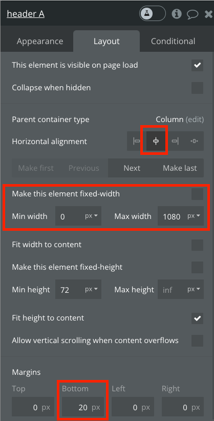

---

Select `Contents Group` and specify the Layout as shown on the right.

A new setting has appeared. It has the following meaning.
- When aligning in the row direction, child elements (here, `Image Group` and `Text Group`) should be placed in the middle.
- When aligning child elements, the row and column spacing between elements should be 40px.


---

- When aligning in the column direction with respect to the parent element, align it to the center.
- The width expands and contracts according to the parent element.


---

Be sure to specify the margins as well.
If Min height has a value, please set it to 0.


---

Next, select `Navigation Group` and specify the Layout as shown on the right.

It has the following meaning.
- When aligning in the row direction, child elements are spread horizontally.
- When aligning in the column direction with respect to the parent element, align it to the center.
- The width expands and contracts according to the parent element.
- The vertical width expands and contracts according to the content.


---

Let's rearrange the positions of the `Back to list` and `Weight Logs` links.

- Select the `Back to list` link to open the settings window
- Open `Layout` tab
- Press the `Previous` button

In this way, you can change the sorting order within the parent element specified by `Row` or `Column`. You can also change it by dragging it, but it might move it outside the group, so this method is easier to specify.


---

Similarly, rearrange the positions of `Contents Group` and `Navigation Group`.

- Select the `Navigation Group` link to open the settings window
- Open `Layout` tab
- Press the `Previous` button


---

Center the Update button
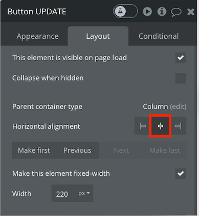

---

Let's preview it.
I'm a little concerned about the details, but I've created a multi-column layout.
On smartphones, they are arranged vertically.


---

### <Excercexercise>

If you are concerned about the subtle aspects of the layout, try the following.
- Make the width of `Back to list` link and `Weight Logs` link stretch to fit the content.
- Leave margins on the left and right sides of `Navigation Area`.
- Increase image size and align text

---

I feel like this.


---

## Next, I'll bring you a weight graph.

- On the pet_weight_register screen, click and copy the graph
- Paste on pet_detail screen
- Press `Next` on `Layout` and place it at the bottom
- Furthermore, specify other items of `Layout` as shown in the image on the right.


---

Displaying graphs on one screen on a smartphone would be cramped, so avoid displaying them when the screen width is small.

- Open the graph settings window and open the `Conditional` tab
- Create a new condition and specify `Current page width`, `<`, and `800` for `When`. That means if your current screen size is smaller than 800.
- Define the changes in that case. Select `This element is visible` and leave it unchecked


---

Let's preview it.


The graph is not displayed on smartphone display.

---

## Frequently used rules (review)

The following rules are often used to achieve responsive design with Bubble.

1. Placement rules within parent elements
2. Element sizing rules
3. Display/display rules

We combined these and applied responsive design.

---

## Reference: Things to consider when designing UI

It's good to create a design that somehow feels good, but it will be even better if you consciously think about the following while keeping in mind your target users.

1. Layout and structure
2. Visual elements
3. Interaction
4. Consistency and standardization

---

## Try using Style

---

## Try using Style

- Up until now, we have been using the styles provided by Bubble as standard.
- For the actual product, we will draw and apply the design concept that suits the product.
- Here's how to change the style

---

## There are three main ways to apply Style.

- Edit existing styles
- Apply styles individually
- Add new styles

Let's do it in order

---

# Edit existing styles

I would like to change the color of buttons and links by modifying an existing style.


---

## Let's use Style variables

In Bubble, the basic colors and fonts are set as `Style variables`.

Try going to `Styles` in the left menu > `Style variables` in the tabs at the top of the screen. The color specified here can be used when creating or editing a style. For example, the color setting "Primary" means the base color, and is used in things like the "Primary" button.


---

When you change the `Primary` setting of `Style variables`, the change is applied to all the places where it is used.
- Select `Styles` from the left menu > `Style variables` from the tab at the top of the screen
- Change Primary. (I want the eyes to be dark red, so specify `#D62755`.)


---

If you check the style of the Primary button, you will see that it has been changed.


---

Let's preview the screen.
The colors of the basic buttons and links, such as the login/logout button, have changed.


---

## When to use Style variables

In this way, by editing `Style variables`, you can change the standard base colors all at once. Also, when creating or editing a new style, you can decide on your own rules and use `Style variables`, making maintenance easier by making changes in bulk later.

---

## Next, let's specify styles individually

I would like to match the header logo with the base color and make the font a little more cute.


---

bOpen the menu to the right of the logo and select header


---

- Double click on the logo to open settings
- Go to the `Style` part of the settings window
- Click `Detach style` near the bottom right of the dropdown
   - Instead of applying a defined Style, you can now specify it individually


---

Specify your favorite style
- I set the font color to the Primary color specified in `Style variables`
- I like the font `Noto Sans Mono`, so I will specify that.
- If you change the font, the logo may be cut off, so please adjust the width accordingly.


---
## Let's preview

Things have changed.


---

I don't think the logo on the login screen has changed.
Since the styles are specified individually, you will need to change them individually.

We won't change it here, but if you're interested, feel free to change it.

---

## Next, let's add a new style

I'm worried that the label is too big, so I'm going to create a style for the label.


---

First, specify the styles individually.

- Open pet_detail and double-click the `Image` text to open settings
- Click `Detach style` at the bottom right of the `Style` pulldown


---

Make the following settings
- Font is `Barlow`
- Font weight is `600`
- Font size is `14`
- Check `Center the text vertically`


---

Then define the specified individual style as a common style

- Open the `Style` pulldown in the `Image` settings.
- Click `Create a new style..` at the bottom


---

- Enter `Label` in the Style name
- Leave the Element style as `Text` to indicate that it is the style of the text element.
- Use style of remains `Text Image` and creates a style based on `Text Image`


---

Label should now be specified in the style.


Rather than defining individually specified styles as a common style,
You can define the style first, but you can also define the style individually.
It is better to set the specified style as a common style.
It's easy to create because you can check the image in Design View.

---

Now, let's apply the defined style to other labels.

- pet_detail: Name, Birthday, Gender
- pet_register: Image, Name, Birthday, Gender
- pet_weight_register: Weight

It's a bit much and time consuming.

If you had separated the styles from the beginning, you would only have to change the style in one place, so if you come across screen elements with different meanings, it's a good idea to keep in mind that you should define styles.

----

## Let's preview


That's all about Style.

---

## Create logic

---

## Create logic

Logic is embedded in various places in an application.

- Return feedback on screen operations
- Extract and process data
- Various options such as switching screens depending on permissions etc.

Logic can be embedded in various places in Bubble, so let's do it together.

---

## Return feedback for screen operations

---

## Return feedback for screen operations

Bubble allows you to embed logic into screen elements.
It can be used to create feedback for screen operations.

Let's add a movement so that when you hover over the pet list, a red frame will appear.


---

Embed logic in the image element
- open pet_list
- Double-click the image element of the pet image to open settings
- Specify `Conditional` from the tab
- Click the `Define another condition` button

As mentioned in the rules for displaying responsive content, here you can define conditions and how to change properties when the conditions are met.


---

First, let's take a look at what conditions can be specified.

- The corresponding image element, its parent element, and other elements on the screen
- Login user
- New data search
- Current status, including date, current position, page width, scroll position, etc.

As you can see, you can specify various conditions like this.


---

This time, let's simply select the relevant image `This Image`.

Then, the image status will be arranged next. There are various options here as well, but this time select `is hovered`.

This will create a condition when the image in question is hovered over.


---

Next, specify which properties should be changed and how if the conditions are met.
Click on `Select a property to change when true` and take a look inside.

- Image source, alt attribute
- Clickable, borders, etc.

I understand that there are many things that can be changed.
The items listed here vary depending on the type of element.


---

This time, when it is hovered over, a red border will be added.
- Click on `Border style - all borders`
- Change `None` to `Solid`
- This means that the frame line specified as ``no frame'' is changed to ``display solid line''.


---

- Select `Select a property to change when true`
- Click `Border color - all borders`
- You will be able to specify the color, so select the defined Primary
- Similarly, next, specify `Border width - all boards` and set it to `2`


The settings are now complete.

---

## Let's preview

When you hover over it, a red frame will appear.


In this way, you can create a product by embedding logic such as returning easy-to-understand feedback to user operations or switching screen decorations depending on the state.

---

## Extract and process data

---

## Extract and process data

You can extract only specific data or process or calculate the acquired data.
Display your pet's initials, age, and most recent weight.


---

## Advance preparation

We'll be adding elements from now on, so let's shorten the width of Name, Birthday, and Gender.
- In pet_detail, double-click Name to open settings
- Hold Shift and select from the Name label to the Gender text element
- Go to the `Layout` tab and click on the part that says `Width`
- Specify `110` for W (width)
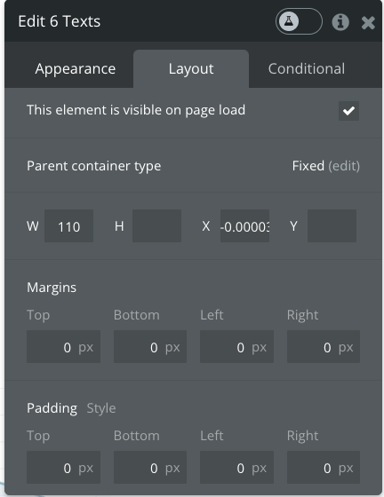

---

## First, display the initials

- Change the contents of the Name label to `Name (Initial)` so that you can see that it includes initials.


---

- Select the text showing the contents of Name
- Click on the empty part of the text input field to give focus
- Type `(`
- Select `Insert dynamic data`
- Select `Current Page Pets`>`'s Name`
- `More...` should appear faintly, so click it.

Here you can select various processing methods. Let's take a look and see.


---

- Select `truncated to`
   - This means to cut up to the specified number of characters.
- Type `1` and confirm with Enter key
- You will see `More` again, so click
- Select `:uppercase`
   - This means convert to uppercase
   - (This is meaningless for those who have Japanese names)
- Click on the empty part of the text input field and enter `)`


---

## Let's preview


---

## Show latest weight

- Copy and paste the Birthday label and text to place it
- Change the label to `Latest Weight`


---

- Open the text settings for Latest Wight and empty the text input area
- Focus and click `insert dynamic data`
- Click `Do a search for`
   - It means searching for data.


---

Specifies to obtain the weight of the pet currently displayed on the page.

- Specify `PetWeightLogs` for `Type`
- Click the `Add a new constraint` button
- A condition input field will appear, so click on it and specify `Pet`, `=`, and `Current Page Pets` in that order.

You can get it under various conditions, so let's take a look at what conditions are available.


---

Specifies to sort in descending order of creation date, that is, in order of newest creation.

- Specify `Created Date` for `Sort by`
- Specify `yes` for `Descending`
- Close

Specifying the sort order is often forgotten, but it is often important.


---

Displays the latest 1 weight
- Click `More` in the text field to see what's inside
- We want to get the first item, so specify `:first item`
- Next, specify `'s WeightKg`
- Click on the blank space and type `kg`

This completes setting the latest weight.
Remember this as a method for data extraction and list processing.


---

## Let's preview.


---
#### <Advanced>

## A little sidetracked,
## Let's take a look at More numbers and More dates.

Bubble offers various processing and calculation methods for numbers and dates.

---

#### <Advanced>

## Calculate age

Next, give your age. As we saw earlier, it is possible to process and calculate numbers and dates, but calculating age seems a bit difficult, so I will try to do it by directly embedding code.

By installing a plugin in Bubble, you can run simple processing using the programming language called Javascript.

---

#### <Advanced>

To embed javascript code, use a plugin called `Toolbox`.
Let's install it.

- Specify `Plugins` in the left menu
- Type `tool` in the search text box (search may take a while)
- Press the `Install` button of `Toolbox` that appears at the top of the search results


---

#### <Advanced>

There are two main ways to embed code in Toolbox, and this time we will introduce the following two methods.

- Execute with `Run javascript` on Workflow / Receive with `Javascript to Bubble` on Design
   - Used for complex processing that spans multiple lines
- Execute and receive with `Expression` on Design
   - Used for one-shot processing

---

#### <Advanced>

Now let's calculate the age.
This is done with `Run javascript`/`Javascript to Bubble`. First, add `Javascript to Bubble` to the pet_detail screen.

- Select `javascript to Bubble` from `Visual elements` on the left menu
- Place it somewhere out of the way, such as at the bottom of the screen
- This is for receiving the javascript result, so it will not be displayed during execution such as previewing.


---

#### <Advanced>

- Specify `age` for `bubble_fn_suffix`
- Check `Publish value`
- Specify `number` for `Value type`

Now, if you pass a value from JavaScript to the function (processing block) called `bubble_fn_age`, it will be received by this screen element.


---

#### <Advanced>

Next, define the location where the javascript will be executed.
- Select Workflow from the left menu
- Select `Click here to an event...` on the far right side of the row of squares.
- Select `General`>`Page is loaded`


---

#### <Advanced>

- Click `Click here to add an action...`
- Click `Plugins` > `Run javascript`
- The settings will open, so paste the code from the next page into the `Script` field.


---

#### <Advanced>

````
//date of birth
const birthday = {
     year: ,
     month: ,
     date:
   };

function getAge(birthday){

     //today
     let today = new Date();
 
     //This year's birthday
     let thisYearsBirthday = new Date(today.getFullYear(), birthday.month-1, birthday.date);
 
     //age
     let age = today.getFullYear() - birthday.year;

     if(today < thisYearsBirthday){
         //My birthday hasn't come yet this year
         age--;
     }

     return age;
}

bubble_fn_age(getAge(birthday));
````

---

#### <Advanced>

Insert the year, month and day using `insert dynamic data` after `year: `, `month: `, and `date: ` in lines 3 to 5.
- Place the cursor after `year: ` (before `,`)
   - `insert dynamic data`>`Current Page Pets`>`'s Birthday`
   - `More`>`formatted as 11/20/21`
   - Specify `Custom` for `Format type`
   - Specify `yyyy` for `Custom format`
- Similarly, after `month: `, set `Custom format` to `m` and insert
- Similarly, after `date: `, set `Custom format` to `d` and insert

*The image after input is on the next page

---

#### <Advanced>

Image after input


---

#### <Advanced>

Arrange screen elements for display
- Copy and paste Birthday label and text
- Change label to Age
- Specify the text content as `JavascripttoBubble A`>`'s value`

---

#### <Advanced>

## Let's preview


---

#### <Advanced>

Next, I would like to show how old the dog and cat are when converted into ages.
Use `Expression`.

- Select `Expression` from Visual elements and place it next to `Javascript to Bubble` from earlier
- Enter `24 + (` in Expression
- Insert `JavascripttoBubble A`>`'s value` with `insert dynamic data`
- Then enter ` -2) * 4`
- Specify `number` for Result type


---

#### <Advanced>

Configure display settings.
- Change the Age label to `Age(as Dog/Cat)` to make it easier to understand that it includes the age of dogs and cats.
- Enter `(` after the content of the Age text originally entered.
- Insert `Expression A`>`'s value` with `insert dynamic data`
- Enter `)`


---

#### <Advanced>
## Let's preview


---

## Switch screens by permissions

---

## Switch screens by permissions

So far, we have explained how to incorporate logic into parts such as feedback to screen operations and data extraction and processing.

Next, I will add logic that spans multiple functions.

Do the following:
- Divide users into pet owners and pet advisors
- Owners can use the screens and functions they have created so far.
- Advisors can use screens and functions exclusive to advisors.

---

The development flow is as follows:
- Add a field to user information to determine whether the user is an owner or an advisor.
- When registering as a user, you can select whether you are an owner or an advisor.
- Create advisor list screen and details screen
- Switch the screen transition destination after login/signup depending on whether you are an owner or an advisor

It takes a lot of steps, but there are many products that handle multiple user types, so be sure to learn how to do it.

---

## Add fields that can identify users

First of all, we will be able to maintain the difference in the roles of owners and advisors in the data.

You can store it as text, as in the case of male and female pets, but values that must be specified from a set of fixed options are easier to handle by defining the options in advance and using them. Bubble provides a mechanism called Option set, so let's use it.

---

Let's set Options

- Go to `Data` on the left menu > `Option sets` on the tab
- Enter `Role` in `New Option set` and press the Create button
- Role will be created as a new Option set


---

We will add specific options to the Option set called Role. This time, we will create `Pet Owner` and `Pet Advisor`.

- Enter `Pet Owner` in `New Option` at the bottom right of the screen and press the Create button.
- Similarly, enter `Pet Advisor` in `New Option` and press the Create button.

The settings are now complete.


---

Next, let's add the role as a user attribute.

- Go to `Data` on the left menu > `Data types` on the tab
- Select `User`
- Click the `Create a new field` button at the bottom right of the screen


---

- Enter `Role` in `Field name`
   - You can call this whatever you want as long as it's easy to understand.
- Select `Role` for `Field type`
   - What is specified here is the `Role` as the `Option set` that we created earlier.
-Press the Create button


---

Since we added a new field, Role will be empty for users who have already created it. This will lead to inconsistencies later on, so be sure to patch (data correction) the existing data.

- Move to `App Data` tab and select `All Users`
- A table will be displayed. Click the pen icon on the left end of the table to edit each item one by one.
   - All users created now should be owners, so specify `Pet Owner` for `Role`


---

OK if all lines in Users have `Role` set to `Pet Owner`


---

## Allow role to be specified during user registration

Next, when registering as a user, you will be able to specify whether you are an owner or an advisor.

I've been using the registration screen provided by Bubble, but I'll make some changes to it.

---

- Go to login page `index`
- Copy the `Re-enter Password` label and place the `Role` label
- Select `Dropdown` from `Input forms` in the `Design` menu and place it below the password input field.

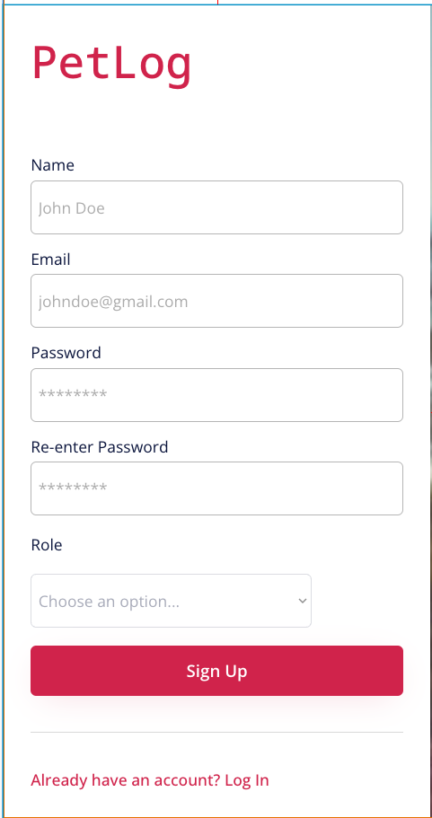

---

- Dropdown settings are as follows
   - Element name: `Dropdown Role`
   - Placeholder: `Choose a role...`
   - `Choice style`: `Dynamic choices`
   - `Type of choices`: `Role`
   - `Choices source`: `All Role`
   - `Option caption`: `Current option`>`'s Display`
   - `Default value`: `Pet Owner`
   - `This input should not be empty`: Check


*Screen image is on the next page

---

Image after input
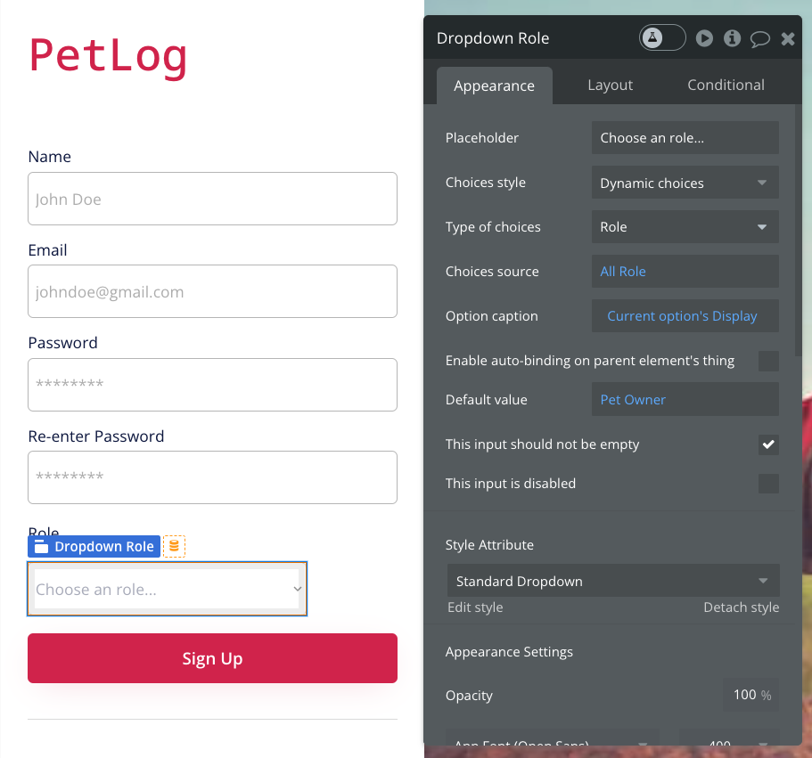

---

Next, ensure that the entered Role is set during user registration.

- Go to `Workflow` from the left menu > `Button Sign up is clicked` from the lined squares > `Sign the user up` from the lined actions
- Click the `Change another field` button in the Action settings screen
- An input field will appear, so select `Role` = `Dropdown Role` `'s value`


---

## Preview and check operation

I was able to register an account as an advisor! (No dedicated screen yet)

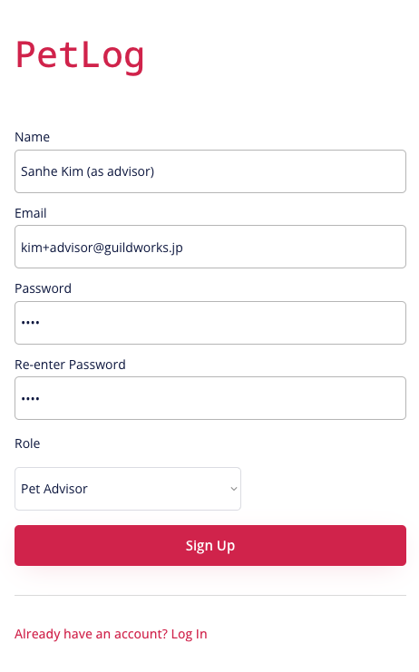
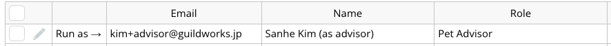

---

## Create advisor list screen

Create an advisor list screen

- Open the menu next to the b logo and `Add a new page...`
- Enter `pet_list_for_advisor` in `Page name`
- Select `pet_list` in `Clone from`
- A new screen will be created


---

Advisors will be able to see all registered pets.

- Delete original search criteria
   - Click `Do search for` in Data source
   - Click the trash can icon to delete the part with the condition `Created By = Current User`
- Advisors need to view many pets, so the size of each cell should be small.
   - Specify 150px for `Min width` and 120px for `Min height`


---

### Let's preview

The destination after logging in is still the normal pet list, so open the advisor pet list directly from the Preview button.

...Nothing comes out! ? why? ?

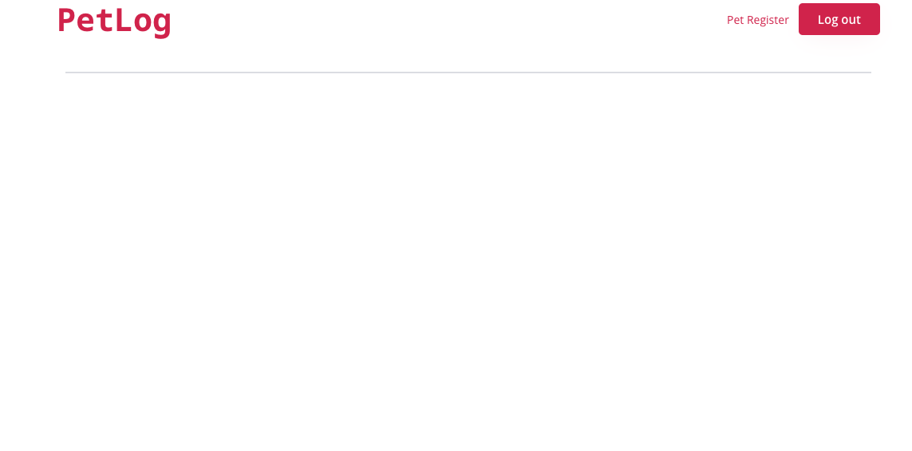

Because you don't have the authority.

---

### Permission control in Bubble

I'm glad I didn't have to be aware of this until now, but Bubble strictly restricts access to data.

Go to `Data` in the left menu > `Privacy` in the tab.
Initially, data is only accessible to the creator.

Of course, of course.


---

Now, let's add permissions so that advisors can view all data.

- From the `Data` tab and then in the `Privacy` tab, select `Pets`
- Click on the `Define a new rule` button
- Enter `Visible to advisor` in Rule name
- Select When `Current User` `'s Role` `is` `Pet Advisor`
   - The condition is that the user is an advisor

Now, if you are an advisor, you can see all the pet data.
It is also possible to limit the fields that can be referenced for each rule, but we will not use it this time.

*Screen image is on the next page

---


Now, add a rule to `PetWeightLogs` in the same way.
Your advisor should now be able to see all your data.

---

## Let's preview
yay


---

Next, control the transition destination when logging in.

For advisor, add an action to transition to pet_list_for_advisor when transitioning to pet_list

---

- Open the Workflow on the index page
- Click `Click here to add an event..`
- Select `General` > `Page is loaded`
- Click `Click here to add an action..`
- Click `Navigation` > `Go to page..`
- Settings will open, select `pet_list_for_advisor` as Destination
- Select `Current User` `'sRole` `is` `Pet Advisor` for `Only when`


---

## Preview & check operation

Log in as an advisor


---

Log in as the owner


Okay, okay

---

#### <Advanced>

## An account was created by an advisor without permission,
## Can I see the information without permission?

---

#### <Advanced>

## Make sure that you cannot start using it unless the system administrator approves it.

---

#### <Advanced>

## We will do the following

- Add a field to user information to indicate if they are approved as an advisor
- Add the condition that you have permission to access data, as well as being an advisor.
- In the pet list for advisors, if the pet is not approved, a message will be displayed that the pet is under review.

---
#### <Advanced>

## Add a field to user information to indicate if they are approved as an advisor

- From the left menu, click `User` in `Data types`> of the `Data`> tab.
- Click the `Create a new field` button at the bottom right of the screen
- Enter `Approved As Advisor` in Field name
- Select `yes/no` for Field type
-Click on the Create button


---

#### <Advanced>

There is a field called `default` in the added field, so set it to `no` (or `No`).
At the time of creation, it is in an unapproved state.
 
  

---

#### <Advanced>

For existing users, leave all `Approved As Advisor' set to `no`
(It's a pain and a pain...but it's important!)


---

#### <Advanced>

## See if you have permission to access the data

- Click on `Pets` in `Privacy`> of `Data`> tab from the left menu
- Click `Pet Advisor` at the end of the part where the `Visible to advisor` condition is described.
- `More` will appear, so click `More`
- Select `and` `Current User` `'s Approved As Advisor` `is "yes"`
- Do the same for `PetWeightLogs`

---

#### <Advanced>

Let's check the operation
Try logging in as a user whose `Approved As Advisor` is `no`


Okay

---

#### <Advanced>

What if `Approved As Advisor` is `yes`?


Okay

---

#### <Advanced>

## If it is not approved, send a message saying it is under review.

- Open the `Design` menu on the pet_list_for_advisor screen
- Add `Popup`
- Add a text element above `Popup` to write a message that it is under review


---

#### <Advanced>

- Go to Workflow from the menu
- Click `Click here to add an event..`>`Page is loaded`
- `Click here to add an action..`>`Element Actions`>`Show`
- Specify `Popup A` for Element
- Specify `Current User` `'s Approved As Advisor` `is "no"` for Only when


---

#### <Advanced>

## Let's check the operation

If you are an advisor who says yes


Okay

---

#### <Advanced>

If no


Okay

---

#### <Advanced>

## How do system administrators know?

---

#### <Advanced>

## When an advisor is registered, the system administrator will be notified by email.

---

#### <Advanced>

## Let the system administrator be notified by email

- Open `index` page
- Go to Workflow from the menu and select `Button Sign up is clicked`
- `Click here to ad an action...`> `Email`>`Send Email`
- Drag and move the Action position before `Go to page pet_list`


---

#### <Advanced>

- Set your email address in To
- Sender name is `PetLog`
- Subject is `New Advisor Requested`
- Body selects `Current User` `'s email` with `dynamic data isert` at the end of the body below
````
New Advisor has been Registered.
Please check it.

Email:
````

---

#### <Advanced>

- Specify `Current User` `'s Approved As Advisor` `is "yes"` for Only when


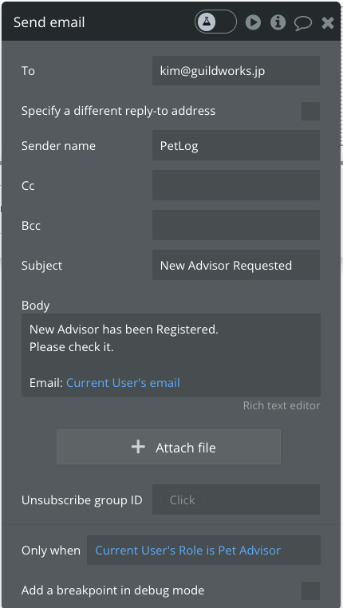

---

#### <Advanced>

## Let's check the operation
Sign up as an advisor

I came here

---

#### <Advanced>

If you are the owner

Yeah, it's not coming. Yay


---

#### <Advanced>

## Exercises

Let's add functionality using the design and logic we've learned so far.

For example, let's create a function that allows advisors to approach owners, or owners to approach advisors.

- Example: You can send advice to the owner
- Example: You can post advertisements
- Example: You can consult with an advisor, etc.

---

### Review so far

---

### The design has been elaborated

- We created a screen that matches the display size.
   - Using a method called responsive web design, we controlled the appearance according to the display size using the following rules.
     - Placement rules within parent element
     - Element sizing rules
     - Display/display rules
- I tried using Style.
   - Edit and add styles, or apply styles individually

---

## I created the logic

- Returned feedback for screen operations
- Extracted and processed data
- Screens were switched by permissions

Together we looked at how you can embed logic in various places with Bubble.

---

## Looking back so far

This concludes the basic lecture on Bubble.
After this, we will move on to the advanced version of Bubble.

There are many features that I didn't touch on,
Bubble has extensive manuals and references, so
If you choose Bubble, please use it.

Click here for the manual.
https://manual.bubble.io/

References appear when you hover over something you don't understand on the screen.
Links to references for most functions will appear.

---

## Now, let's move on to the advanced version.