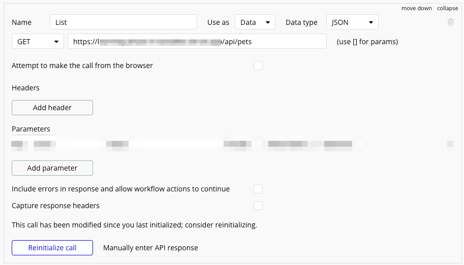
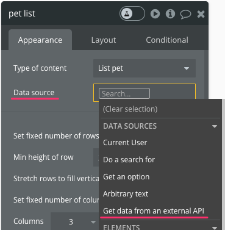
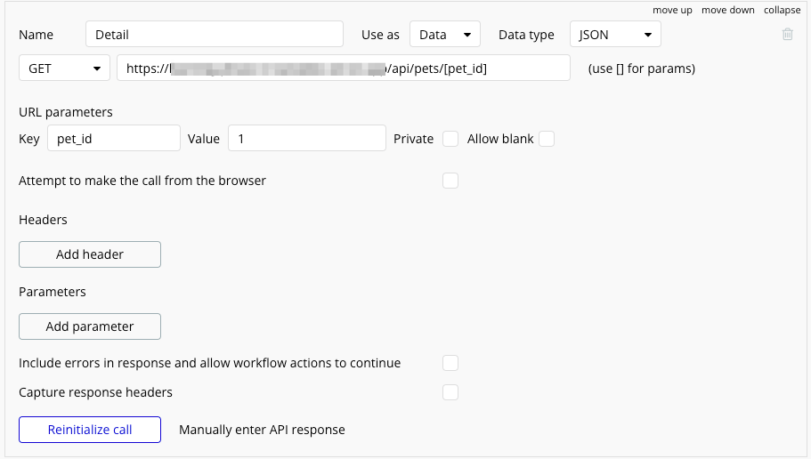
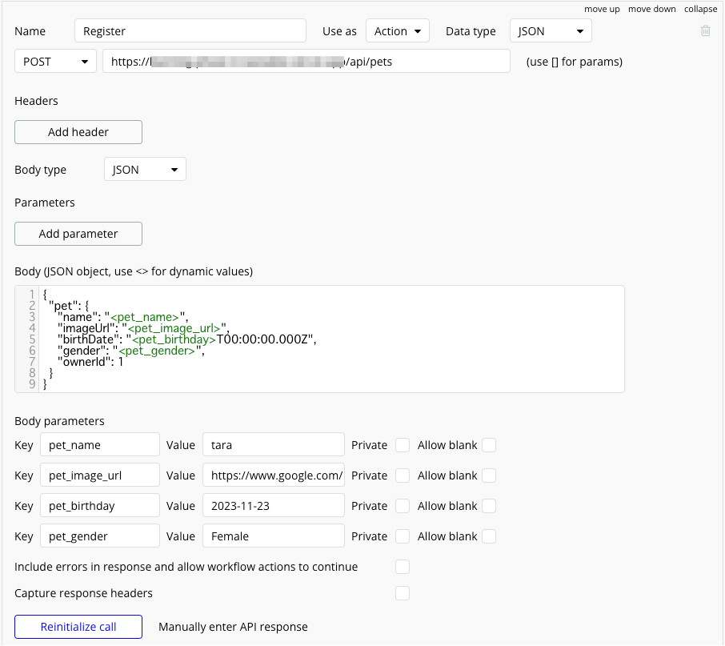
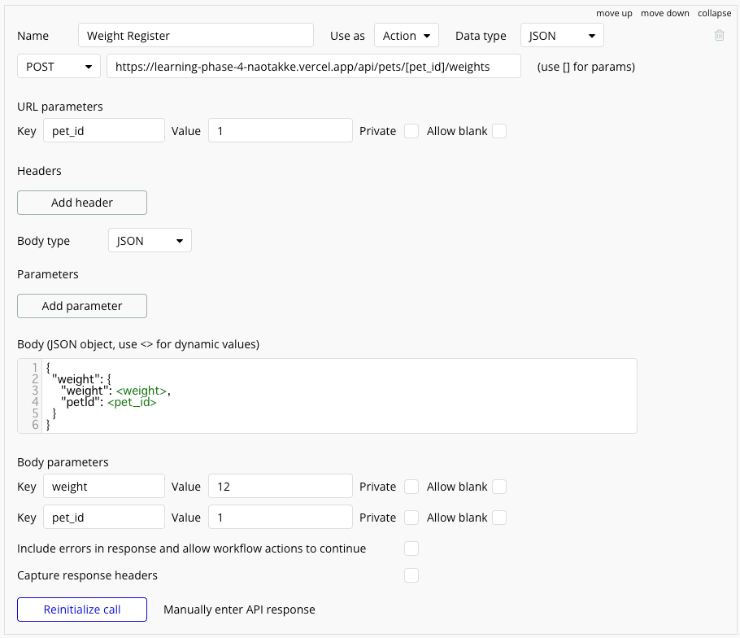
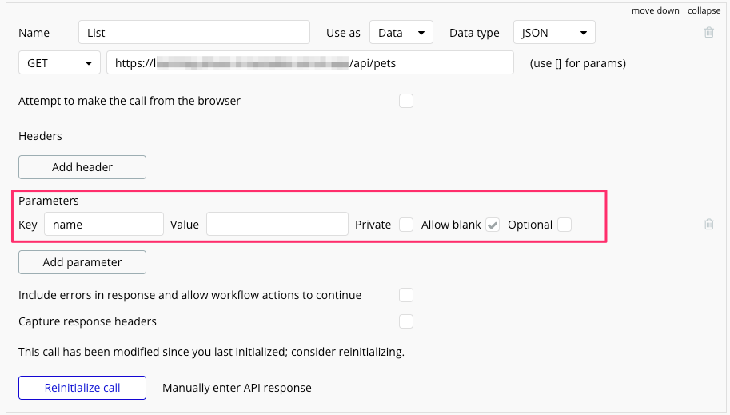

**Programming Boot Camp**

# Connecting Bubble and Vercel API

**Tokyo Institute of Technology 2023/11/25**
　
　
　
　
　
　　　　　　　　　　　　　　　　　　　　　　**Naotake KYOGOKU**

----

In the learning phase up to this point

* Development of Web applications using Bubble
* Development of Web API using Vercel

Web API development using Vercel

----

With the knowledge up to this point, you can make the connection between the two!
So let's try it as an exercise!

Used by.

* Bubble application created in the 2nd session
* Vercel application created in the 4th session (already deployed)

----

Let's combine them to realize the following functions

Step1. Get pet list data from Vercel API
Step2. Get detailed pet data from Vercel API
Step3. Pet registration via Vercel API
Step4. Pet weight display & weight registration with Vercel API

:warning: To make it an exercise, only hints are given thereafter.
:warning: Those who have completed the development process will receive a copy of the Bubble application for their answers, which they can use to test their answers.

----

If you have finished that in plenty of time, too, you can proceed here in a more advanced way!

Step5. Search the list of pets by name

- This one needs to address Prisma as well, so please try to pair up with someone to go ahead with it if possible!
- One of you will revamp the Prisma side 🙋‍♀️
- The other one is to revamp the Bubble side 🙋.

----

<!-- _class: lead -->

# <!-- fit -->First, let me show you the finished application :eyes:

----

In every step, there are two main things you need to do

* Set up a connection between Bubble and Vercel API.
* Connect Bubble to Vercel API and display the screen.

----

<!-- _class: lead -->

# <!-- fit -->Let's try it!

----

:warning: If you have not attended some or all of the previous Learning Phases, please let us know if you need the following so we can share it with you!🙋‍♀️

* Bubble application created in the 2nd session
* Vercel application created in the 4th session (already deployed)

----

<!-- _class: lead -->

# <!-- fit -->Here's a hint 💡.

----

# :hourglass_flowing_sand:
# :hourglass_flowing_sand:
# :hourglass_flowing_sand:
# :hourglass:
# :hourglass:

---

<!-- _class: lead -->

# <!-- fit -->💡Step1. Get pet list data from Vercel API

----

### Bubble's API Connector configuration looks like this

----

- When calling the API from the Data source for each data display item, it is `Get data from an external API`.

----

# :hourglass_flowing_sand:
# :hourglass_flowing_sand:
# :hourglass_flowing_sand:
# :hourglass:
# :hourglass:

---

<!-- _class: lead -->

# <!-- fit -->💡Step2. Get detailed pet data from Vercel API

----

### Bubble's API Connector configuration looks like this

---

- When moving from the list screen to the detail screen, only the ID of the pet is passed.
- Since `Data to send` is not available, use `Send more parameters to the page` instead.
- Then, on the detail screen, `When the screen is displayed`, call the API to get the pet's details using the pet's ID received by the URL parameter.
- The result is stored in the detail screen itself using Bubble's `Custom state` function.
  - This part may be a little difficult :fire:.
- Then, each item on the detail screen is displayed based on the value stored in the state.

----

# :hourglass_flowing_sand:
# :hourglass_flowing_sand:
# :hourglass_flowing_sand:
# :hourglass:
# :hourglass:

---

<!-- _class: lead -->

# <!-- fit -->💡Step3. Pet registration via Vercel API

----

### Bubble's API Connector configuration looks like this

----

# :hourglass_flowing_sand:
# :hourglass_flowing_sand:
# :hourglass_flowing_sand:
# :hourglass:
# :hourglass:

---

<!-- _class: lead -->

# <!-- fit -->💡Step4. Pet weight display & weight registration with Vercel API

----

### Bubble's API Connector configuration looks like this

----

- The pet weight display is included in the results of the API we prepared for the pet details screen, so we can use that!
- The concept of registering a pet's weight is similar to that of registering a pet, so we can use that as a reference.

----

# :hourglass_flowing_sand:
# :hourglass_flowing_sand:
# :hourglass_flowing_sand:
# :hourglass:
# :hourglass:

---

<!-- _class: lead -->

# <!-- fit -->💡Step5. Search the list of pets by name

----

### Here's what the Prisma side of the renovation looks like

[Pull request for additional search criteria](https://github.com/naotakke/learning-phase-4/pull/1/files#diff-55a96e5472d8f91f5a26633e882ef76ab92d3aece0d6bfa753f2c84e7794a80f)

----

### Here's what the Bubble side of the renovation looks like

- This is a form of changing the settings for acquiring a list prepared above.

----

# :hourglass_flowing_sand:
# :hourglass_flowing_sand:
# :hourglass_flowing_sand:
# :hourglass:
# :hourglass:

---

# That's all!
# Thank you for your hard work!
