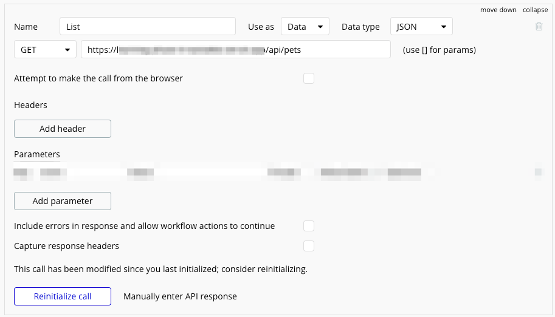
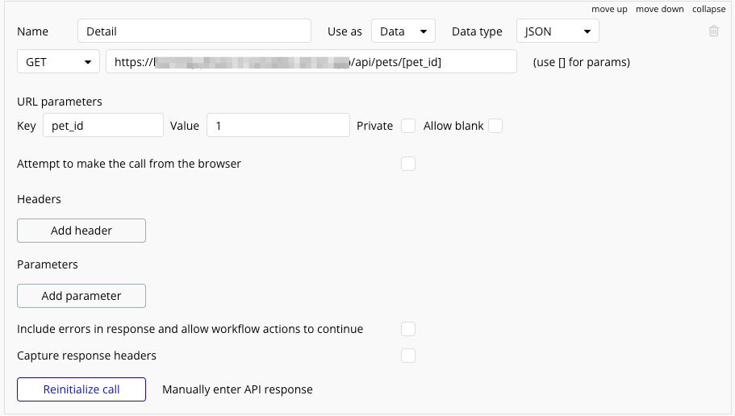
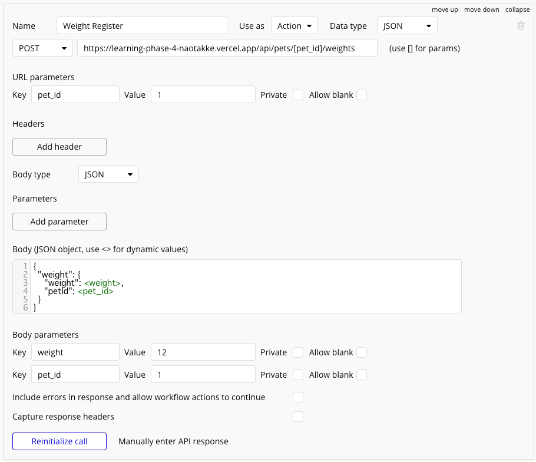

**Programming Boot Camp**

# Bubble と Vercel API をつなげよう

**東京工業大学 2023/11/25**
　
　
　
　
　
　　　　　　　　　　　　　　　　　　　　　　**Naotake KYOGOKU**

----

ここまでのラーニングフェーズで

* Bubble を使った Web アプリケーションの開発
* Vercel を使った Web API の開発

を学んできました。

----

ここまでの知識があれば、この 2 つをつなげることは皆さんならできます！
なので演習としてやってみましょう！

使用するのは

* 第 2 回で作った Bubble のアプリケーション
* 第 4 回で作った Vercel のアプリケーション（デプロイ済みのもの）

----

これらを組み合わせて下記の機能を実現してみましょう

Step1. ペットの一覧データを Vercel API から取得
Step2. ペットの詳細データを Vercel API から取得
Step3. ペットの登録を Vercel API で実行
Step4. ペットの体重表示 & 体重登録を  Vercel API で実行

:warning: 演習とするため、以降はヒントだけを記載しています
:warning: 一通り開発ができた人から回答用の Bubble アプリケーションをコピーしてお渡ししますので答え合わせに使ってください

----

もしそれも余裕で終わったよ、という人はさらにアドバンスでこちらを進めてみましょう！

Step5. ペットの一覧を名前で検索

- こちらは Prisma の対応も行う必要がありますので、できれば誰かとペアで進めてみてほしいです
- 1人は Prisma 側の改修 🙋‍♀️
- もう1人は Bubble 側の改修 🙋

----

<!-- _class: lead -->

# <!-- fit -->まず完成系のアプリケーションをお見せします :eyes:

----

どの Step も、やることは大きく分けて 2 つです

* Bubble に Vercel API の接続設定を行う
* Bubble と Vercel API をつなげて画面表示を行う

----

<!-- _class: lead -->

# <!-- fit -->それではレッツトライ！

----

:warning: もし、これまでのラーニングフェーズに一部、もしくは全て出席していない場合、下記を共有しますので必要な方は教えてください🙋‍♀️

* 第 2 回で作った Bubble のアプリケーション
* 第 4 回で作った Vercel のアプリケーション（デプロイ済みのもの）

----

<!-- _class: lead -->

# <!-- fit -->ここからヒントになります 💡

----

# :hourglass_flowing_sand:
# :hourglass_flowing_sand:
# :hourglass_flowing_sand:
# :hourglass:
# :hourglass:

---

<!-- _class: lead -->

# <!-- fit -->💡Step1. ペットの一覧データを Vercel API から取得

----

### Bubble の API Connector の設定内容はこんな感じ

----

- 各データ表示項目において Data source で API を呼ぶ時は `Get data from an external API` でしたね。

----

# :hourglass_flowing_sand:
# :hourglass_flowing_sand:
# :hourglass_flowing_sand:
# :hourglass:
# :hourglass:

---

<!-- _class: lead -->

# <!-- fit -->💡Step2. ペットの詳細データを Vercel API から取得

----

### Bubble の API Connector の設定内容はこんな感じ

---

- 一覧画面から詳細画面へ遷移する時に、ペットの ID だけを渡します
- 渡し方として `Data to send` は使えないため、代わりに `Send more parameters to the page` を使います
- そして、詳細画面側では「画面表示の時」に「URL パラメータで受け取ったペットの ID を使って、ペット詳細取得の API を呼び出します
- その結果を Bubble の `Custom state` という機能を使って詳細画面自身に保存します
  - ※ここはちょっと難しいかも :fire:
- あとは詳細画面の各項目は、その state に保存された値から表示します

----

# :hourglass_flowing_sand:
# :hourglass_flowing_sand:
# :hourglass_flowing_sand:
# :hourglass:
# :hourglass:

---

<!-- _class: lead -->

# <!-- fit -->💡Step3. ペットの登録を Vercel API で実行

----

### Bubble の API Connector の設定内容はこんな感じ

----

# :hourglass_flowing_sand:
# :hourglass_flowing_sand:
# :hourglass_flowing_sand:
# :hourglass:
# :hourglass:

---

<!-- _class: lead -->

# <!-- fit -->💡Step4. ペットの体重表示 & 体重登録を  Vercel API で実行

----

### Bubble の API Connector の設定内容はこんな感じ

----

- ペットの体重表示は、ペットの詳細画面のために用意した API の結果に含まれているので、それを使えそうです
- ペットの体重登録は、ペットの登録と考え方は似ているのでそれを参考にできますね

----

# :hourglass_flowing_sand:
# :hourglass_flowing_sand:
# :hourglass_flowing_sand:
# :hourglass:
# :hourglass:

---

<!-- _class: lead -->

# <!-- fit -->💡Step5. ペットの一覧を名前で検索

----

### Prisma 側の改修はこんな感じです

[検索条件を追加した時の Pull request](https://github.com/naotakke/learning-phase-4/pull/1/files#diff-55a96e5472d8f91f5a26633e882ef76ab92d3aece0d6bfa753f2c84e7794a80f)

----

### Bubble 側の改修はこんな感じです

- 上で用意した一覧取得の設定を変更する形です

----

# :hourglass_flowing_sand:
# :hourglass_flowing_sand:
# :hourglass_flowing_sand:
# :hourglass:
# :hourglass:

---

# 以上です！
# お疲れさまでした！
