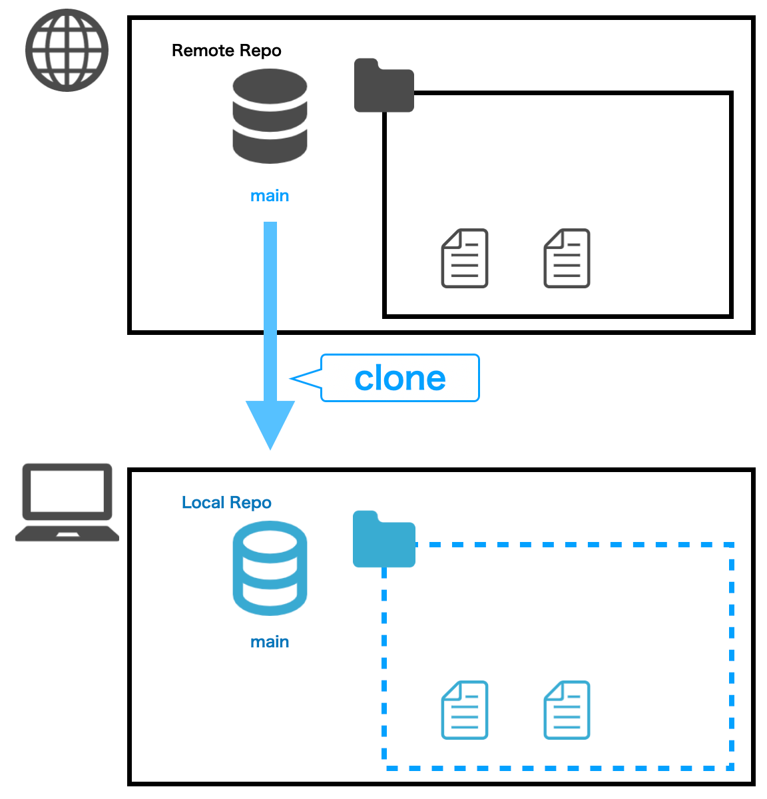
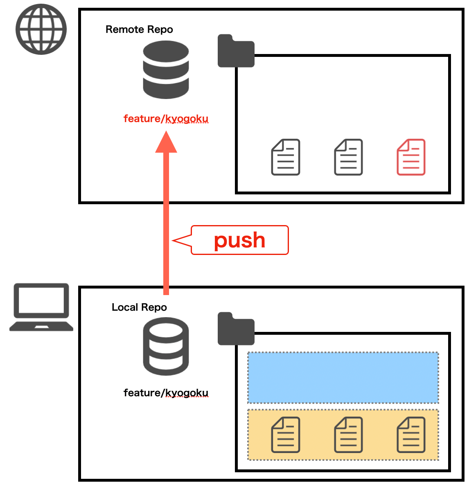
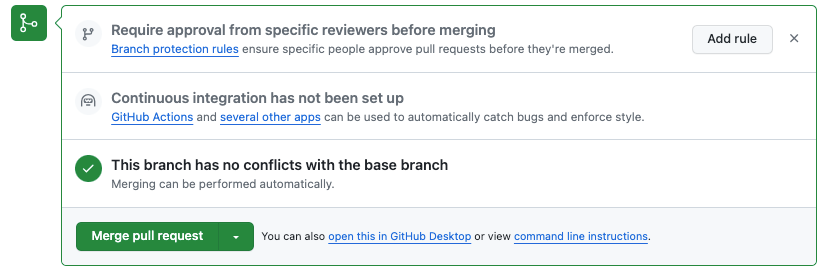

**Programming Boot Camp**

# About Git / GitHub

**Tokyo Institute of Technology 2023/11/25**
　
　
　
　
　
　　　　　　　　　　　　　　　　　　　　　　**Naotake KYOGOKU**

----

### What you will do in this chapter

* Learn the Git commands
* Learn how to use GitHub Pull & Request to review code
* Learn how to deal with code conflicts when they occur

----

### First of all, what is Git?

- Git is a distributed version control system for recording and tracking changes to program source code (files).
- Using Git to version your code makes it easier to go back and forward to a specific point in time, and it also makes it easier to collaborate with other developers.

----

Diagram of Git


authority：[GitとSubversionの構造的な違い - Ricksoft Blog](https://www.ricksoft.jp/blog/archives/9483/)

----

<!-- _class: lead -->

### <!-- fit --> Learn the full range of Git commands :sunglasses:


----

### First things first...

Git provides a variety of **commands**.
We're going to learn a few of those commands...

But first...

I'm going to explain an important concept when learning Git... :point_up:

----

### Git when developing with multiple people...

When you have multiple developers working on a project, it is inevitable that each of them will make changes to files at their own pace.
file at their own pace.
file is actually in a different state than it was when you first saw it,
And it can be the same from other people's point of view.

And the same can be said from other people's point of view.

----

### So...

In Git, we use something called **branches** to
to eliminate a lot of hassles when you have multiple developers working on a project.

Before I explain what a branch is...

The first Git command that you saw in the last lecture was this one.

```bash
git clone https://github.com/{Your Name}/learning-phase-4.git
```

----

What is this command doing behind the scenes... :eyes:

* Use `git` to indicate that it's a Git command
* Then run the Git `clone` command
* This `clone` command creates a `local repository` based on the contents of the remote repository that follows it
* This is where it's important to know **which branch** you're bringing in from the remote repository
* In the first command, the branch name is omitted, but in this case it is the default branch in the target remote repository (in this case, the `main` branch).

----

* If you want to specify the state of a particular branch and bring in the contents of a remote repository, it would look something like this

```bash
git clone -b feature/day5 https://github.com/{Your Name}/learning-phase-4.git
```

* Also, when creating a "local repository", if you want to bring it under a different name from the "remote repository", it will look like this.

```bash
git clone https://github.com/{Your Name}/learning-phase-4.git learning-phase-4-day5
```

In this case, the name of the directory after `clone` will be `learning-phase-4-day5`.

----




----

### In this example

You have just brought in the `main` branch from the remote repository, but be sure to keep in mind the term **branch** as you will be using it a lot in your development!

----

Now, let's get started learning some Git commands, but before we do that, let's get everyone prepped together.

But first, let's all do some preliminary preparation together.

There are two things you need to do.

1. :black_square_button: Invite your GitHub account to join the GitHub page we will be covering in this workshop.
2. :black_square_button: Newly `clone` the repository for this workshop

----

#### 1. Invite your GitHub account to join the GitHub page we will be covering in this workshop.

https://github.com/titech-2023-day5/workshop/issues/1

Please visit this page and write appropriate comments!
We will send you an invitation e-mail in order from those who were able to write, so please check there.


:sunglasses: 講師は[ココ](https://github.com/orgs/titech-2023-day5/teams/titech-2023/members)から招待していく！

----

If the invitation is successful, you should receive an email like this.

If you receive it successfully, press the `Join @titech-2023-day5` link in the body of the email.


----

You should then be redirected to the GitHub page and a screen like this should appear.

When the screen appears correctly, click the `Join titech-2023-day5` button.

This will successfully complete the invitation.


Who hasn't done well so far? :raising_hand:

----

#### 2. Newly `clone` the repository for this workshop

:warning: Do not run it in the `learning-phase-4` directory that was touched in the previous lecture!

```bash
# clone the repository for the workshop
git clone https://github.com/titech-2023-day5/workshop.git titech-2023-day5

# Move to the cloned directory
cd titech-2023-day5
```

----

Have you been able to execute it?

1. :white_check_mark: Invite your GitHub account to join the GitHub page we will be covering in this workshop.
2. :white_check_mark: Newly `clone` the repository for this workshop

Now you are ready to go!

----

Let's quickly verify that the branch of the repository you just `cloned` is really the `main` branch 👀.

Let's run the `git branch` command directly under the `titech-2023-day5` directory that we just cloned from

----

Then you should see `*` next to the current branch name.
If you are using GitBash or Terminal, the text color should also change :smile:.


This command checks what branches currently exist in the "local repository" and which branch is currently facing it.

----

<!-- _class: lead -->

# <!-- fit --> I hope you are now a little more familiar with **brunch**. :heart:

----

Now let us create a new branch.
The image of creating a new branch is literally branching out.


This is an image of a `feature` branch branch branching off of a `main` branch.

----

Now let's create a branch.
The command is here.

```bash
git branch feature/{your-name}
```

The `{your-name}` part should be your name.
For example, I would be `feature/kyogoku`, so the command to execute would be something like this.

```bash
git branch feature/kyogoku
```

----

I don't think anything special happened.
Let's see if the branch was really created.

... You know what command to use. :smile:？

Yes, that's right!
It will be the `git branch` command that we hit earlier as well.

----

```bash
git branch
```

You should now have a `feature/{your-name}` branch that you just created, in addition to the `main` branch that was there when you first hit `git branch`!


----

This means that a new branch has been created in the `local repository`.
But the `*` mark is still on the `main` branch, right?
So if you edit any files, you will be working on the `main` branch.

----

So, let's go to the branch you created.
The command to run will be the `git checkout` command.

```bash
git checkout feature/{your-name}
```

You specify the name of the branch you want to move after the `checkout` like this.

In my case, it looks like this.

```bash
git checkout feature/kyogoku
```

----

When you hit this command.
```git
Switched to branch 'feature/{your-name}'
```

The message "I am a member of the group!

----

Now let's see if you really moved the branch.

... You know what command to use. :smile::smile:？

That's right!
Appears three times! It will be the `git branch` command.

----

```bash
git branch
```

When you run it, the `*` is in a different position, isn't it?
It should have been in the `main` branch, but when you run it now, it should be in `feature/{your-name}` branch.
Now you should see `*` on your `feature/{your-name}` branch.


You have now successfully moved your working branch to the `feature/{your-name}` branch.

----

Let's take a quick review of the commands we have learned so far.

command|use|
:-|:-|
`clone`|Create a local repository from a remote repository|
`branch`|Create Branch|
`checkout`|Move Branch|

----

Now, let's edit the file and add its contents to the "remote repository"!

The flow is as follows.

1. :black_square_button: Add the directory you just `cloned` to VS Code
2. :black_square_button: Add files in the working directory
3. :black_square_button: Changes are reflected in the "Local Repository
4. :black_square_button: Reflect the contents of the "Local Repository" to the "Remote Repository

----

#### 1. Add the directory you just `cloned` to VS Code

First, as a preliminary step, add the directory you have just `clone` to VS Code so that you can edit it in VS Code.

----

The procedure is the same as in the previous lecture.

Click `File > Open Folder... ` and select the `titech-2023-day5` folder you just cloned.

Click `Yes, I trust the authors`.

Previous documents: [A little below this block.](https://github.com/naotakke/learning-phase-4/blob/main/docs/1-how-to-setup.md#github)

Once you have added the file to VS Code, you can actually add the file!

----

1. :white_check_mark: Add the directory you just `cloned` to VS Code
2. :black_square_button: Add files in the working directory
3. :black_square_button: Changes are reflected in the "Local Repository
4. :black_square_button: Reflect the contents of the "Local Repository" to the "Remote Repository

----

#### 2. Add files in the working directory

Select the following directory in VS Code.

```bash
titech-2023-day5/greeting
```

Then select `New File` from the right-click menu to create a new file.

----

The name of the file should be `{your-name}.txt`, following the same sequence of files.
Once you have created the file, you can add your own introduction to the contents of the file.

* ニックネーム (Nicknames)：
* 誕生日 (Birthday)：
* 出身地 (Birthplace)：
* 学部 (Faculty)：
* 趣味 (Hobbies)：

:notebook: It is OK to copy the contents of `template.txt` in the same line. :information_desk_person:

----

Have you finished adding your personal statement?

1. :white_check_mark: Add the directory you just `cloned` to VS Code
2. :white_check_mark: Add files in the working directory
3. :black_square_button: Changes are reflected in the "Local Repository
4. :black_square_button: Reflect the contents of the "Local Repository" to the "Remote Repository

----

#### 3. Changes are reflected in the "Local Repository

First, you need to make sure that Git recognizes the file that has been modified.

This is where the `git status` command comes in.

This command checks to see what files have changed on the current branch.

----

```bash
git status
```


When you run it, you should see the path to the file you just appended.
At this point, remember that the text color of that file path is red!

----

Now that we have confirmed that Git recognizes the modified file, let's reflect the changes to the "local repository".

... However, there are two steps to reflect the changes in your local repository.

1. Reflects changes in staging area
2. Reflect staging area contents in local repository

Let's look at them in order :eyes:

----

##### 1. Reflects changes in staging area

**Staging Area**

I'm not familiar with the term 💧.

Don't worry. I will explain them in order!

----

In fact, in the local repository

* 「Work Area」
* 「Staging Area」

There are two areas of.


----

Each of these two areas has the following roles

* Work Area
  * The area where you are actually doing the work
  * Adding files, directories, etc.
* Staging Area
  * The part to remember changes to be reflected in the local repository

----

The changes you have made are only reflected in the "Work Area".

We will now reflect your changes in the "Staging Area".


----

This is where the `git add` command comes in.

This command is used to reflect the work done in the "working area" to the "staging area".


----

You can specify the path of the file you want to reflect in the "staging area" by following `git add` with the path of the file you want to reflect only that file in the "staging area".

... But it's a hassle to type each and every one of those files by hand, isn't it?

The `git status` command mentioned earlier is useful for this purpose.

----

The file displayed by running the `git status` command is the path to the file that is currently being modified, so copy it as it is.


Then paste that path after the `git add`.
(You shouldn't see anything when you run it)

```bash
git add greeting/{your-name}.txt
```

----

Were you able to execute it?
Now let's check to see if the changes were really reflected in the "staging area".

The command to check the status of a changed file is...

----

The `git status` command.


When you run it, the file paths you see are the same as before the `git add`, but there are some things that have changed, right?

... That's right! It's the color of the text!

----

Before the `git add`, the file path color was red :heart:.
But after `git add`, the file path is green :green_heart:.

This indicates that the file has been properly added to the staging area.

Now that you have confirmed that the file is correctly reflected in the staging area, it is time to move it to the local repository.

----

##### 2. Reflect staging area contents in local repository

Now that the changes have been successfully reflected in the staging area, it is time to reflect the changes in the local repository.

The `git commit` command is used to commit changes to the local repository.

----

`git commit` is a command that reflects what is reflected in the staging area (what has been staged) to the local repository.
Therefore, you do not need to specify individual files in `git commit`.


----

However, when you run `git commit`, you need to register "what to reflect in the local repository (what)" and "why to reflect (why)" as a **commit message**.

ℹ️ Generally, you can figure out the what by looking at the commit content, so you often fill in the why in the commit message
ℹ️ You don't have to be that aware of it now! :ok_hand:

----

The command to be executed based on these factors looks like this.

```bash
git commit --message "Add {your-name}'s self-introduction"

# -m でも OK
git commit -m "Add {your-name}'s self-introduction"
```

`--message` is an **option** to the `git commit` command to specify the commit message.

----

Slight digression.... :railway_car:

Like `--message`, the Git command set has a variety of options, so a detailed explanation is beyond the scope of this section.
For more details, type `--help` or `-h` at the end of each command to see a list of options for that command, if you are interested.

```bash
git branch --help
git checkout --help
```

----

Let's go back and hit `git commit`.

```bash
git commit --message "Add {your-name}'s self-introduction"
```


----

Now we will check if the `git commit` was successful.
The `git status` command is used to check.

When I hit the `git status` command...


That thing.
The file you were supposed to be editing no longer appears 😱.

Don't worry. It is the correct behavior.
(Is anyone else seeing the opposite? 🙋‍♀️?)

----

So where did the edited file go?

The answer is that they have been reflected in the local repository.

Now, let's check to see if it has been reflected in the local repository.

This is where the `git log` command comes in.

----

This command will allow you to view the commit history (log) of the current branch.

```bash
git log
```


----

When you actually hit `git commit`, you should see the commit history listed from top to bottom in order of newest to oldest.

The commit message at the top of the list will probably be the message you just typed when you `git commit`.

----

Now, we are almost at the goal.

Now we have completed reflection to the local repository.
Let's finish reflecting to the remote repository.

1. :white_check_mark: Add the directory you just `cloned` to VS Code
2. :white_check_mark: Add files in the working directory
3. :white_check_mark: Changes are reflected in the "Local Repository
4. :black_square_button: Reflect the contents of the "Local Repository" to the "Remote Repository

----

#### 4. Reflect the contents of the "Local Repository" to the "Remote Repository

The `git push` command is used to push the contents of the local repository to the remote repository.

This command will reflect all the content that has been reflected in the local repository but has not yet been reflected in the remote repository.

----

The command to execute looks like this.

```bash
git push origin feature/{your-name}
```

The `origin` refers to the remote repository.
The `origin` is the remote repository, followed by the name of the branch you want to `push`.

So, this command is

push the contents of a `feature/{your-name}` branch that has not yet been reflected in the remote repository.

which is not yet reflected in the remote repository.

----

```bash
git push origin feature/{your-name}
```
Reflect the contents of a `feature/{your-name}` branch that has not yet been reflected in the remote repository.



----

... How's it going?

Did you successfully `push`?
If you got an error 🙋‍♀️ ?

----

Thank you for your hard work.

Now the edits you have made on your computers are reflected in the remote repository 🎉.

1. :white_check_mark: Add the directory you just `cloned` to VS Code
2. :white_check_mark: Add files in the working directory
3. :white_check_mark: Changes are reflected in the "Local Repository
4. :white_check_mark: Reflect the contents of the "Local Repository" to the "Remote Repository

Let's take a look at its contents from GitHub.

----

Access the GitHub page of the workshop repository.
https://github.com/titech-2023-day5/workshop

Click on the "main" area in the upper right corner of the screen.


----

Then you should see a pull-down `Switch branches/tags`.
There you will see a text box that says `Find or create a branch... Enter the name of the branch you just `pushed` into the `Find or create a branch...` text box.


I'm sure it will come up when you type in your `{your-name}`!

Anyone else having trouble finding their branch :cry:?


----

<!-- _class: lead -->

### Now you have successfully sent it to the remote branch!
### We can now confirm that it has been reflected!

----

Let's review the commands we just hit.

Command|Use|
:-|:-|
`branch`|Create a branch in the local repository|
`checkout`|Branch Switching|
`add`|Files added or edited in the work area are reflected in the staging area|
`commit`|Reflect the contents of the staging area in the local repository|
`log`|Check the commit history of the current branch|
`push`|Local repository content is reflected in remote repositories|

----

In this way, when multiple people are developing at the same time, they can create a branch and work on the branch in the same way as before, without affecting the work of other people.😎

----

### Wait a minute.... :neutral_face:

But there are cases where you want to incorporate other people's work into your work area as well, right?
You can have everyone working separately, but you can't build a single application if you stay separate.

----

### That's where GitHub !

We will merge your changes into one place (one branch).

We will use GitHub's **Pull request** feature to merge the self-introduction files you have each created into one branch.


----

First, open the GitHub page for the workshop repository you just opened.
Next, select `Pull requests` at the top of the page.

Then, click on the `New pull request` button on the right to create your pull request.


----

You will then see a page called Comparing changes, where you will first enter **base** and **compare**.

This is what you specify when you `push` your `feature/{your-name}` branch and merge it into your `main` branch.
This will make it look like your changes are merged into one branch.


----

Once you have configured the following, press the **Create pull request** button.

1. base (merge point)
  `main`
2. compare (merge source)
  `feature/{your-name}`


----

Then you will see the page **Open a pull request**, so let's set up the necessary details for the remaining pulls and requests.

3. Title
  The contents of the `push` should now be set.
4. Description
  Provide a summary of this Pull & Request
  What was addressed? Why was it addressed?
  Concerns, offers, etc.
5. Review
  **naotakke**
6. Assignee
  **assign yourself** Click

----


----

When the configuration is complete, PUSH the **Create pull request** button!

If the pull request screen appears successfully, you are done!
For those who are having trouble 🙋‍♀️ ?

----

I will review the pull request and if there are no problems, I will approve it!
If you are approved, please try to merge the pull request by yourself.

Click the **Merge pull request** button and the **Confirm merge** button at the bottom of the screen to merge the pull request!



----

After the merge is complete, the branch you have created is no longer needed, so tell the `Delete branch` button below the merge button to delete the branch that is no longer needed!


----

Finally, let's import the merged self-introductions for everyone into your local repositories.

The procedure is as follows

1. check the current branch status
2. move the current branch to `main
3. import the contents of the latest `main` branch

----

Each procedure is already perfect, isn't it? 😎

1. Check current branch status
  Check `git status` to make sure there are no unintended diff files
  Check `git branch` to make sure the current branch is `feature/{your-name}`.
2. move the current branch to `main`.
  Move the current branch to `main` with `git checkout main`.
  Confirm that the current branch has changed to `main` with `git branch`.
3. pull in the latest contents of the `main` branch
  Use `git pull` to pull in the latest status.

----

After you have done the above, take a look inside the `titech-2023-day5/greeting` directory in VS Code!
I'm sure there will be a file of introductions for everyone who is attending today, not just you :raised_hands:.

----

<!-- _class: lead -->

## Thank you for your hard work!

Next... Conflict Resolution :scream:

----

### Before we get to conflict resolution...

Here's a little background on the `git pull` command I just ran at the end.

What does the `git pull` command do internally?

----


----

Like this, the contents of the "remote repository" are brought to the "working area" with a single command.

In fact, this command is the same as the following two commands in a single command.

`git fetch`
`git merge`

----

Talking about this in depth might confuse you even more, so I'll try to explain it in an abbreviated form... :sweat_smile:.

`git fetch` to fetch the latest contents of the **remote repository** into the local repository.
`git merge` fetches the latest contents of the **local repository** into the work area

This is what I'm doing.
Very useful 🤤.

----

But why bother with the `fetch` and `merge` commands when you can just use one command?
The reason is that they are useful when the edited contents of a file, which I will explain in the next section, are used by other people.
In our industry, we call it "**conflicted**" when the contents of a file you have edited conflict with someone else's. So, from the next page onward, you will see a `conflicted` command.

So, from the next page onward, I will use the word "conflict" to describe the situation. :wink:

----

Let's now follow the process of actually conflicting files and resolving them.
This will be the last chapter of Git, so you'll just have to hang in there and fight one more time :muscle:.

----

From this point on, you will work in pairs, so please pair up with the person in front of you, behind you, and to the left or right of you.
（Seats may remain as they are.）
（If you feel you will be alone, please let me know and I will pair you up with a GW member or myself.）

----

Here's what you'll do in pairs (9 steps in all)。
（Let's say the pair is person A / person B.）

1. person A creates a new branch and brings it to the pair's respective work area
2. person A adds "favorite movies and books" to the end of his/her introduction
3. reflects the addition to the remote repository
4. person B adds "It's a nice introduction! at the end of person A's self-introduction.
5. person B reflects the contents of #4 in the remote repository
6. **then the conflict occurs successfully**. :fire::fire::fire:

----

7. person B resolves the conflict and reapplies the new content to the remote repository
8. person A retrieves the latest contents from the remote repository
9. person A checks the end of her self-introduction and confirms that both "favorite movies and books" and the comment written by person B are included

Once this is done, switch person A / person B and start again from #2
This may be omitted due to time constraints: 🙇‍♀️

----

So let's take a quick turn!

person A：💚
person B：💛

----

#### 1. person A creates a new branch and brings it to the pair's respective work area

💚 ：Create a new branch from the `main` branch
A branch named `feature/{A-name}-step2`, where A-name is person A's name
💚 ：After creating the branch, use `git checkout` to switch branches
💚 ：Then run the `git push` command without changing any content yet
💚💛 ：Confirm from GitHub that the branch you just added exists

----

💛 ：Switch to the newly created branch by following these steps
(During this time, person A should implement the contents of the next sheet.)
1. `git pull`
2. `git branch feature/{A-name}-step2 origin/feature/{A-name}-step2`
3. `git checkout feature/{A-name}-step2`

💚💛 ：Finally, check that the current branch is `feature/{A-name}-step2` in `git branch`.

----

#### 2. person A adds "favorite movies and books" to the end of his/her introduction

💚 ：Add "favorite movies and books" to the end of your personal statement file created in the first work session.

#### 3. reflects the addition to the remote repository

💚 ：Now let's reflect the appended contents in the remote repository!
`git add`
`git commit`

----

:rotating_light: STOP once here. :rotating_light:
💛 Confirm that person B has completed all of the following commands.

```bash
# 💛 Conducted by person B
git branch feature/{A-name}-step2 origin/feature/{A-name}-step2
git checkout feature/{A-name}-step2
```

If there is no problem, 💚 A will reflect the self-introduction text added by `git push` to the remote repository.

```bash
# 💚 Conducted by person A
git push origin feature/{A-name}-step2
```

----

4. person B adds "It's a nice introduction! at the end of person A's self-introduction.

💛 ：Check person A's self-introduction and confirm that "favorite movies and books" is not **added** at the end.
💛 ：Check person A's self-introduction and add at the end, "Lovely content!" and add

----

5. person B reflects the contents of #4 in the remote repository

💛 ：Now let's reflect the appended contents in the remote repository!

* `git add`
* `git commit`
* `git push`

I am sure you will see some error message here...

----


If you see an error message like this, you are in the right state.

This is a message saying that the state of the `feature/{A-name}-step2` branch in the remote repository has changed, and you should `git pull` to get the latest contents.

This message will say, "The state of the `feature/{A-name}-step2` branch in the remote repository has changed.

----

Now let's hit `git pull` accordingly.
Then...


----

### 6. **then the conflict occurs successfully**.:fire::fire::fire:

Now, let us resolve this conflict.

As it stands now, person A and person B edited the same file, which caused a conflict in their edits.

Git doesn't know which of the two edits is the correct one, so it prompts you to fix person B's changes.

----

7. person B resolves the conflict and reapplies the new content to the remote repository

💛 ：Now, let's start resolving the conflicts.
(After this, the roles of person A / person B will be switched, so Mr. A should watch the previous screen.)

----

💛 ：Try running `git status`.


Then there should be a `both modified` entry for Mr. A's self-introduction file.
This literally means that there have been edits both in the remote repository and in the work area.

----

💛 ：Please open that actual file.

`<<<<<<<` and `>>>>>>>` The following symbols are included in the file.
Each of these represents the modifications on the "work area side" and the "remote repository side", separated by `=======`.


----

The conflicts will be resolved by looking at the contents of this document.
There are roughly three ways to resolve conflicts.

1. Delete the modifications in the remote repository, assuming that the contents in the work area are **correct**.
2. Procedure opposite of #1
3. Leave **the modifications** both on the remote repository side and on the work area side.

In this case, we will use the pattern #3 to resolve the conflict.

----

💛 ：You will see the `<<<<<<<` and `>>>>>>>` characters on the conflicted file.
`Accept Current Change | Accept Incoming Change | Accept Both Changes | Compare Changes`
There should be a notation of.


*The capture is in Japanese. Sorry :bow:.

----

This represents #1 ~ 3, respectively, as mentioned earlier.

1. Delete modifications in the remote repository with the content in the work area as **correct**.
  → `Accept Current Change`
2. Procedure opposite of #1
  → `Accept Incoming Change`
3. Leave **the modifications** both on the remote repository side and on the work area side.
  → `Accept Both Changes`

💛 ：So this time, select `Accept Both Changes` in #3.

----

Then the `<<<<<<<` and `>>>>>>>` characters that were there earlier should disappear.
This means that the conflict has been resolved.

💛 ：Now, let's reflect it in the remote repository.

* `git add`
* `git commit`
* `git push`

----

8. person A retrieves the latest contents from the remote repository

💚 ：Get the latest content from the remote repository

* `git pull`

If you get a message like `Please specify which branch you want to merge with.`, run the following command and hit `git pull` again.

```bash
git branch --set-upstream-to=origin/feature/{A-name}-step2 feature/{A-name}-step2
```

----

9. person A checks the end of her self-introduction and confirms that both "favorite movies and books" and the comment written by person B are included

💚 ：Open your personal statement file and check that the end of the file contains both the "favorite movie or book" that you filled out and the written opinion by person B.

Now we have successfully imported the edited contents of each other's files.

----

Now, let's switch person A / person B and try again from the occurrence of the conflict to its resolution.
Since #1 has already been handled, we will start from step #2.

1. ~~person A creates a new branch and brings it to the pair's respective work area~~
2. person A adds "favorite movies and books" to the end of his/her introduction
3. reflects the addition to the remote repository
4. person B adds "It's a nice introduction! at the end of person A's self-introduction.
5. person B reflects the contents of #4 in the remote repository
6. **then the conflict occurs successfully**. :fire::fire::fire:

----

7. person B resolves the conflict and reapplies the new content to the remote repository
8. person A retrieves the latest contents from the remote repository
9. person A checks the end of her self-introduction and confirms that both "favorite movies and books" and the comment written by person B are included

----

<!-- _class: lead -->

### Good night!
### This concludes the Git / GitHub chapter!

----

Let me review what I learned this time.

* Learn the Git commands
* Learn how to use GitHub Pull & Request to review code
* Learn how to deal with code conflicts when they occur

----

##### :beginner: Finally, Tips

As you may have noticed, the "current branch" was actually displayed in the lower left corner of VS Code.
Basically, it is OK to look here. 😅


