**Programming Boot Camp**

# Git / GitHub について

**東京工業大学 2023/11/25**
　
　
　
　
　
　　　　　　　　　　　　　　　　　　　　　　**Naotake KYOGOKU**

----

### この章でやること

* Git の一通りのコマンドを学ぶ
* GitHub の Pull & Request を使い、コードレビューを学ぶ
* コードのコンフリクトが発生した時の対処法を学ぶ

----

### まずは Git とは

- プログラムのソースコード（ファイル）などの変更履歴を記録・追跡するための分散型バージョン管理システム
- Git を使って開発中のコードをバージョン管理することで、特定の開発タイミングの状態に戻る / 進むといったことが容易になったり、ほかの開発者との共同編集がやりやすくなります

----

Git のイメージ図


出典：[GitとSubversionの構造的な違い - Ricksoft Blog](https://www.ricksoft.jp/blog/archives/9483/)

----

<!-- _class: lead -->

### <!-- fit --> Git の一通りのコマンドを学ぶ :sunglasses:


----

### まずはじめに...

Git には様々な **コマンド** が用意されています。
これからそのコマンドを少し学んでいくのですが...

その前に。

Git を学ぶにあたり大事な考え方を説明しますね :point_up:

----

### 複数人で開発するときの Git...

複数人で開発をしていると、どうしてもそれぞれのペースで
ファイルに変更が加えられてしまうため
自分が最初に見えていた時と実は違う状態になっていた、
なんてことになる可能性が十分あります。

そして、それは他の人目線からでも同じことが言えます。

----

### そこで...

Git では **ブランチ（枝）** と呼ばれるものを使って
複数人で開発するときのいろいろな面倒ごとを解消しています。

このブランチがどんなものかを説明する前に...

まずみなさんが前回講義で最初に叩いた Git のコマンドがこれでした。

```bash
git clone https://github.com/{Your Name}/learning-phase-4.git
```

----

このコマンドが裏で何をやっているかというと... :eyes:

* `git` で Git のコマンドであることを示します
* 次に Git の `clone` コマンドを実行します
* この `clone` は、その後に続く「リモートリポジトリ」の内容をもとに「ローカルリポジトリ」を作るコマンドになります
* この時、リモートリポジトリから **どのブランチ** の状態を持ってくるかが重要になってきます
* 最初に叩いたコマンドではブランチ名を省略していますが、この場合は、対象となるリモートリポジトリに設定されているデフォルトブランチ（今回なら `main` ブランチ）の状態を持ってきます

----

* もし、特定のブランチの状態を指定してリモートリポジトリの内容を持ってきたい場合はこんな感じになります

```bash
git clone -b feature/day5 https://github.com/{Your Name}/learning-phase-4.git
```

* また、「ローカルリポジトリ」を作成する際に、「リモートリポジトリ」とは異なる名前で持ってきたい場合はこんな感じになります。

```bash
git clone https://github.com/{Your Name}/learning-phase-4.git learning-phase-4-day5
```

この場合、`clone` してきた後のディレクトリ名は `learning-phase-4-day5` になります。

----

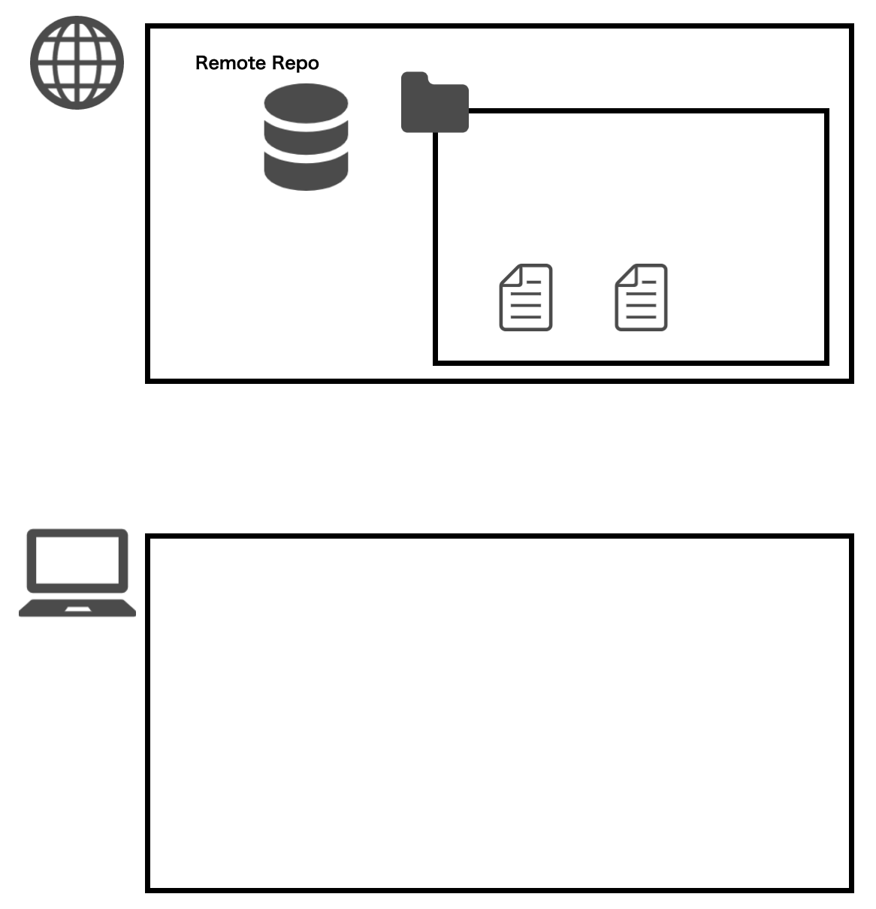


----

### この例では

リモートリポジトリから `main` ブランチだけを
持ってきた状態ですが、これから開発を行う上で
**ブランチ**という言葉や考え方がたくさん出てくるので
しっかり頭に入れておきましょう！

----

それでは、さっそく Git のいくつかのコマンドを学んで行きたいと思いますが

その前にまずは事前準備を全員一緒に済ませてしまいます。

やることは 2 つです。

1. :black_square_button: 今回のワークショップで扱う GitHub のページに皆さんの GitHub アカウントを招待します
2. :black_square_button: 今回のワークショップで扱うリポジトリを新たに `clone` します

----

#### 1. 今回のワークショップで扱う GitHub のページに皆さんの GitHub アカウントを招待します

https://github.com/titech-2023-day5/workshop/issues/1

こちらのページにアクセスし、適当なコメントを書いてください！
書けた方から順番に招待メールをお送りしますので、そちらをご確認ください。


:sunglasses: 講師は[ココ](https://github.com/orgs/titech-2023-day5/teams/titech-2023/members)から招待していく！

----

招待が成功するとこんなメールが届くはずです。

無事に届いたらメール本文にある `Join @titech-2023-day5` のリンクを押下。


----

すると GitHub のページに遷移しこんな画面が表示されるはずです。

正しく画面が表示されたら `Join titech-2023-day5` のボタンを押下。

これで無事に招待が完了します。

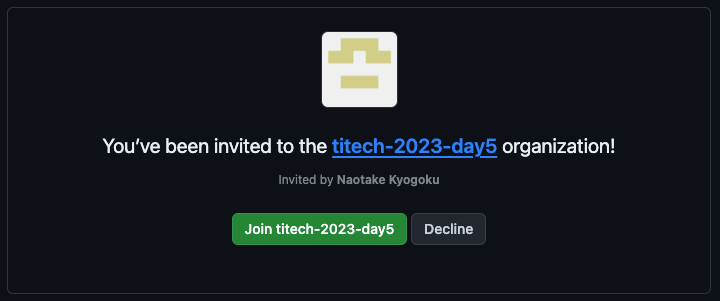

ここまでで上手くいっていない人ー :raising_hand: ？

----

#### 2. 今回のワークショップで扱うリポジトリを新たに `clone` します

:warning: 前回の講義で触っていた `learning-phase-4` のディレクトリの中では実行しないでください！

```bash
# ワークショップ用のリポジトリを clone
git clone https://github.com/titech-2023-day5/workshop.git titech-2023-day5

# clone したディレクトリへ移動
cd titech-2023-day5
```

----

実行できましたかね？

1. :white_check_mark: 今回のワークショップで扱う GitHub のページに皆さんの GitHub アカウントを招待します
2. :white_check_mark: 今回のワークショップで扱うリポジトリを新たに `clone` します

これで準備は整いました！

----

早速、今 `clone` したリポジトリのブランチが本当に `main` ブランチなのか確かめてみましょう👀

先程 clone してきた `titech-2023-day5` のディレクトリ直下で `git branch` コマンドを実行してみましょう

----

すると、今のブランチ名の横に `*` が付いていると思います。
GitBash や Terminal を使っていれば、文字色も変わっているはず :smile:

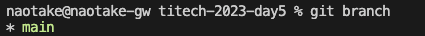


このコマンドは、現在「ローカルリポジトリ」にどういったブランチが存在し、現在はどのブランチを向いているのかを確認するコマンドになります。

----

<!-- _class: lead -->

# <!-- fit --> ほんの少しは **ブランチ** というものが身近になりましたかね :heart:

----

では、今度は新しいブランチを作成してみましょう。
新しいブランチを作成するイメージは、文字通り枝分かれするイメージとなります。

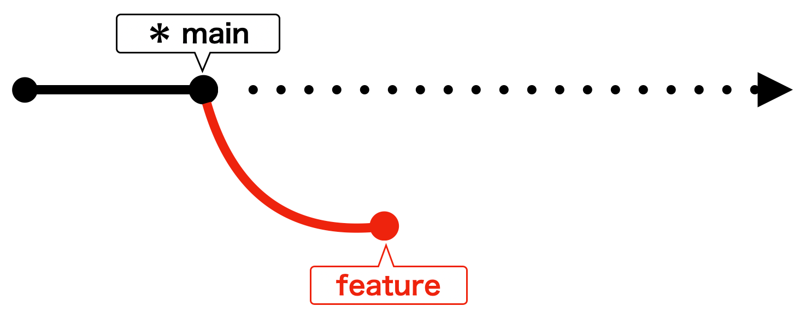

これは `main` ブランチから `feature` ブランチが枝分かれするイメージです。

----

では早速ブランチを作成してみましょう。
コマンドはこちら。

```bash
git branch feature/{your-name}
```

`{your-name}` の部分はご自身の氏名を当てはめてください。
例えば私なら `feature/kyogoku` となるので、実行するコマンドはこんな感じですね。

```bash
git branch feature/kyogoku
```

----

特に何も起こらなかったと思います。
本当にブランチが作成されたか見てみましょう。

...何のコマンドを使えば良いかわかりますよね :smile:？

そうです！
先ほども叩いた `git branch` コマンドになります。

----

```bash
git branch
```

すると、最初に `git branch` を叩いた時にあった `main` ブランチの他に、先ほど作成した `feature/{your-name}` ブランチが存在しているはずです！

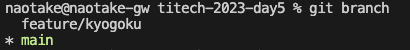

----

これで新しいブランチが「ローカルリポジトリ」に作成されたことになります。
ただ `*` のマークは相変わらず `main` ブランチに付いていますよね？
なので、このまま何かファイルを編集すると `main` ブランチに対して作業することになってしまいます。

----

そこで、作成したブランチに移動してみましょう。
実行するのは `git checkout` コマンドになります。

```bash
git checkout feature/{your-name}
```

このように `checkout` の後に移動したいブランチ名を指定します。

私の場合はこんな感じですね。

```bash
git checkout feature/kyogoku
```

----

このコマンドを叩くと
```git
Switched to branch 'feature/{your-name}'
```

というメッセージが表示されたはずです！

----

では本当にブランチを移動したのか確認してみましょう。

...何のコマンドを使えば良いかわかりますよね :smile::smile:？

そうです！
三度登場！ `git branch` コマンドになります。

----

```bash
git branch
```

実行すると `*` の位置が変わっていますよね？
先ほどまでは `main` ブランチに `*` が付いていたはずですが
今叩いてみると `feature/{your-name}` ブランチに `*` がついているはずです。

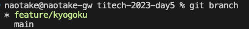

これで無事に作業ブランチが `feature/{your-name}` ブランチに移動しました。

----

ここまで学んだコマンドを軽くおさらいしてみましょう。

コマンド|用途|
:-|:-|
`clone`|リモートリポジトリからローカルリポジトリを作成|
`branch`|ブランチを作成|
`checkout`|ブランチを移動|

----

では、次はファイルを編集して、その内容を「リモートリポジトリ」へ追加していきましょう！

流れとしてはこんな感じになります。

1. :black_square_button: 先程 `clone` したディレクトリを VS Code に追加
2. :black_square_button: 作業ディレクトリでファイルの追加を行う
3. :black_square_button: 変更内容を「ローカルリポジトリ」へ反映
4. :black_square_button: 「ローカルリポジトリ」の内容を「リモートリポジトリ」へ反映

----

#### 1. 先程 `clone` したディレクトリを VS Code に追加

まず事前準備として、先程 `clone` してきたディレクトリを VS Code に追加し、VS Code 上で編集できるようにします。

----

手順は前回講義と同じです。

`File > Open Folder...` をクリックし、先ほど clone してきた `titech-2023-day5` フォルダを選択。

`Yes, I trust the authors` をクリック。

前回資料: [このブロックの少し下](https://github.com/naotakke/learning-phase-4/blob/main/docs/1-how-to-setup.md#github)

VS Code に追加できたら、実際にファイルを追加していきます！

----

1. :white_check_mark: 先程 `clone` したディレクトリを VS Code に追加
2. :black_square_button: 作業ディレクトリでファイルの追加を行う
3. :black_square_button: 変更内容を「ローカルリポジトリ」へ反映
4. :black_square_button: 「ローカルリポジトリ」の内容を「リモートリポジトリ」へ反映

----

#### 2. 作業ディレクトリでファイルの追加を行う

VS Code で下記のディレクトリを選択してください。

```bash
titech-2023-day5/greeting
```

そして、右クリックのメニューから `New File` を選択して新規ファイルを作成します。

----

ファイルの名前は同じ並びにあるファイルに倣って `{your-name}.txt` にしましょう。
ファイルが作成できたら中身にご自身の自己紹介文を追記していってみましょう。

* ニックネーム (Nicknames)：
* 誕生日 (Birthday)：
* 出身地 (Birthplace)：
* 学部 (Faculty)：
* 趣味 (Hobbies)：

:notebook: 同じ並びにある `template.txt` の中身をコピーしても OK :information_desk_person:

----

自己紹介文の追記は終わりましたか？

1. :white_check_mark: 先程 `clone` したディレクトリを VS Code に追加
2. :white_check_mark: 作業ディレクトリでファイルの追加を行う
3. :black_square_button: 変更内容を「ローカルリポジトリ」へ反映
4. :black_square_button: 「ローカルリポジトリ」の内容を「リモートリポジトリ」へ反映

----

#### 3. 変更内容を「ローカルリポジトリ」へ反映

まず変更されたファイルを Git が認識しているかを確認しましょう。

そこで登場するのが `git status` コマンドです。

このコマンドは現在のブランチ上で、変更されたファイルを確認するコマンドになります。

----

```bash
git status
```


実行すると先ほど追記したファイルのパスが表示されているはずです。
この時、そのファイルパスの文字色が赤字であることを覚えておいてください!

----

では、変更されたファイルを Git が認識していることを確認できましたので、その内容を「ローカルリポジトリ」へ反映していきましょう。

...と、言ってもローカルリポジトリへの反映は 2 段階になります。

1. ステージングエリアに変更内容を反映
2. ステージングエリアの内容をローカルリポジトリへ反映

順番にみていきましょう:eyes:

----

##### 1. ステージングエリアに変更内容を反映

**ステージングエリア**

聞き慣れない言葉が出てきましたね 💧

安心してください。順に説明していきますね！

----

実はローカルリポジトリの中には

* 「作業エリア」
* 「ステージングエリア」

の 2 つ領域が存在しています。

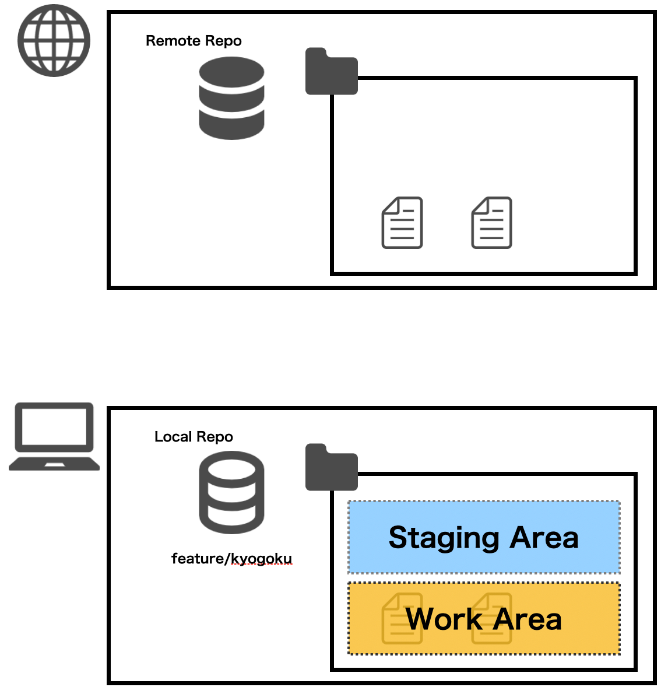

----

この 2 つのエリアはそれぞれ下記の役割を持っています。

* 作業エリア
  * 実際にみなさんが作業を行っている部分
  * ファイルの追加やディレクトリの追加、など
* ステージングエリア
  * ローカルリポジトリへ反映する変更内容を覚えておくための部分

----

いま皆さんが変更を加えた内容は「作業エリア」にしか反映されていない状態です。

なので、「ステージングエリア」へ反映していきます。


----

そこで登場するのが `git add` コマンドになります。

これは「作業エリア」で作業した内容を「ステージングエリア」へ反映するためのコマンドになります。


----

その際、`git add` に続けて「ステージングエリア」に反映したいファイルのパスを指定することで、そのファイルだけを「ステージングエリア」へ反映することができます。

... でも、そのファイルをイチイチ手打ちするのは手間ですよね？

そこで便利なのが先ほどの `git status` コマンドになります。

----

`git status` コマンドを実行して表示されるファイルが、現在変更されているファイルのパスになるので、それをそのままコピーしておきます。


そして、そのパスを `git add` の後ろに貼り付けます。
（実行しても何も表示されないはず）

```bash
git add greeting/{your-name}.txt
```

----

実行できましたか？
では、本当に「ステージングエリア」に反映できたかどうかを確認してみましょう。

変更されたファイルの状態を確認するコマンドは...

----

`git status` コマンドですね。

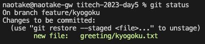

実行すると `git add` する前と表示されるファイルのパスは同じだと思いますが、変わった部分がありますよね？

...そうです！文字の色です！

----

`git add` する前はファイルパスの色が赤 :heart: だったはずです。
しかし `git add` した後だとファイルパスの色が緑 :green_heart: になっていますよね。

これはそのファイルが正しくステージングエリアに反映されたことを表しています。

では、ステージングエリアに正しく反映されたことを確認できたので、いよいよローカルリポジトリへ反映していきましょう。

----

##### 2. ステージングエリアの内容をローカルリポジトリへ反映

無事にステージングエリアへ変更内容を反映できましたので、いよいよローカルリポジトリへ変更内容を反映していきましょう。

ローカルリポジトリへ反映するのは `git commit` コマンドになります。

----

`git commit` はステージングエリアに反映されている内容（ステージされている内容）を、ローカルリポジトリへ反映するコマンドになります。
そのため `git commit` では特にファイルを個別に指定することは不要です。

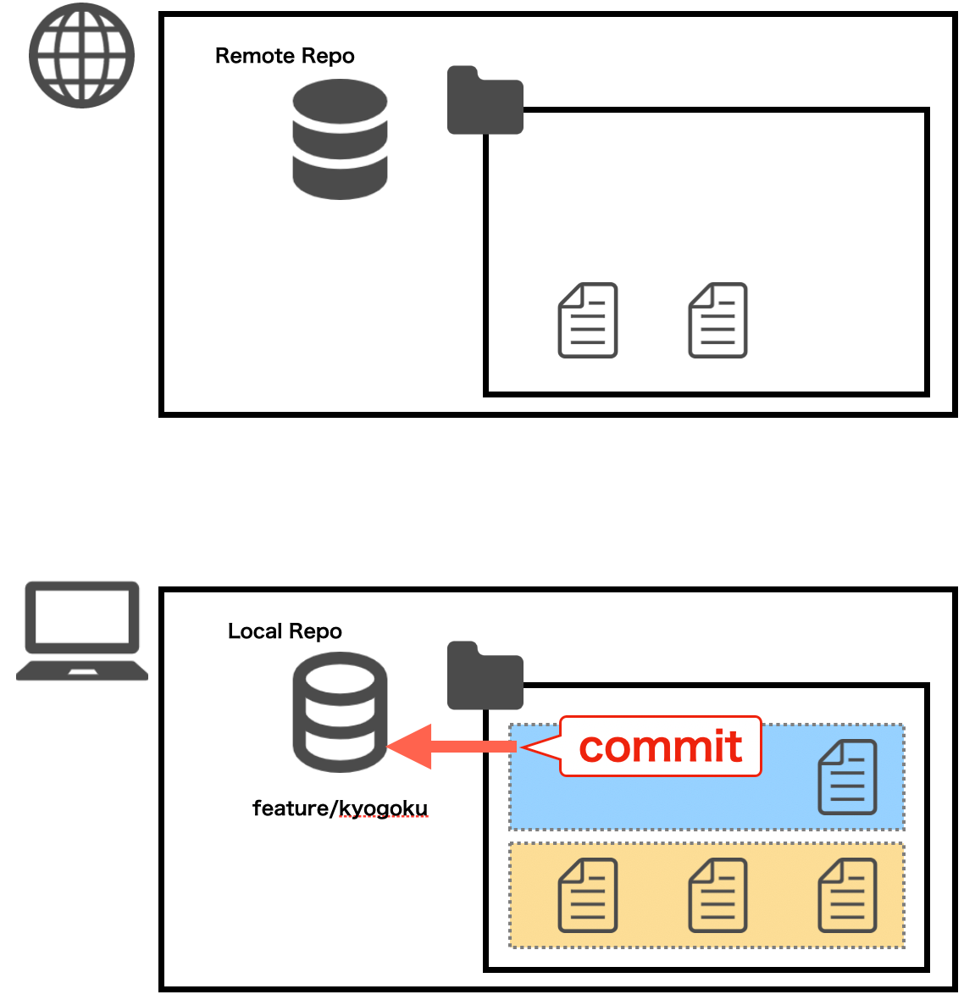

----

ただし `git commit` を実行する際には「ローカルリポジトリへ反映する内容（What）」や、「反映理由（Why）」を**コミットメッセージ**として登録する必要があります。

ℹ️ 一般的に、what はコミット内容を見れば把握できるため、コミットメッセージには why を記入する場合が多いです
ℹ️ 今はそこまで意識しなくても大丈夫です :ok_hand:

----

これらを踏まえて実行するコマンドとしてはこんな形になります。

```bash
git commit --message "{your-name}の自己紹介文を追加"

# -m でも OK
git commit -m "{your-name}の自己紹介文を追加"
```

`--message` はコミットメッセージを指定する `git commit` コマンドの **オプション** となります。

----

ちょっと脱線... :railway_car:

`--message` のように、Git のコマンド群には様々なオプションが用意されているので、細かい説明はここでは割愛します。
詳しくは各コマンドの最後に `--help` or `-h` と入力すると、そのコマンドのオプションを一覧で見ることができますので、興味のある人は見てみてください。

```bash
git branch --help
git checkout --help
```

----

元に戻って `git commit` を叩いてみましょう。

```bash
git commit --message "{your-name}の自己紹介文を追加"
```

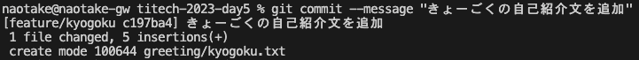

----

では `git commit` が成功したかどうかを確認していきます。
確認するのに使用するのは `git status` コマンドです。

`git status` コマンドを叩くと...

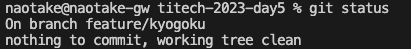

あれあれ。
編集していたはずのファイルが表示されなくなりましたね😱

安心してください。正しい挙動です。
（逆に表示されている方はいますか🙋‍♀️？）

----

では、編集したファイルはどこに行ったのでしょうか？

答えは、ローカルリポジトリへ反映されたのです。

では、ローカルリポジトリへ反映されたかどうかを確認してみましょう。

そこで登場するのが `git log` コマンドです。

----

このコマンドは現在のブランチのコミットの履歴（ログ）を見ることができるものになります。

```bash
git log
```
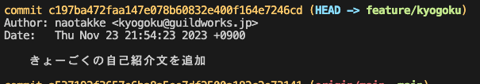

----

実際に叩いてみると、コミットの履歴が新しいもの順に上から下に表示されているはずです。

その一番上のコミットメッセージにはおそらく皆さんが先ほど叩いた `git commit` 時のメッセージが表示されているはずです。

----

さぁ、もうすぐゴールです。

ここまででローカルリポジトリへの反映まで完了しました。
最後はリモートリポジトリへの反映を行っていきましょう。

1. :white_check_mark: 先程 `clone` したディレクトリを VS Code に追加
2. :white_check_mark: 作業ディレクトリでファイルの追加を行う
3. :white_check_mark: 変更内容を「ローカルリポジトリ」へ反映
4. :black_square_button: 「ローカルリポジトリ」の内容を「リモートリポジトリ」へ反映

----

#### 4. 「ローカルリポジトリ」の内容を「リモートリポジトリ」へ反映

ローカルリポジトリの内容をリモートリポジトリへ反映するのは `git push` コマンドとなります。

このコマンドを実行することで、ローカルリポジトリへ反映されているけど、リモートリポジトリへまだ反映されていない内容をすべて反映してくれます。

----

実行するコマンドはこんな感じ。

```bash
git push origin feature/{your-name}
```

この `origin` というのは、リモートリポジトリのことを指しています。
そして、その後ろに続くのが `push` したいブランチの名前です。

なので、このコマンドは

「リモートリポジトリに対してまだ反映されていない `feature/{your-name}` ブランチの内容を push する」

という命令になります。

----

```bash
git push origin feature/{your-name}
```
「リモートリポジトリに対してまだ反映されていない `feature/{your-name}` ブランチの内容を反映する」


----

... どうですか？

無事に `push` できましたか？
エラーが出たぞーという方 🙋‍♀️ ？

----

おつかれさまでした。

これで、皆さんのパソコン上で編集を行った内容が、リモートリポジトリへ反映されました 🎉

1. :white_check_mark: 先程 `clone` したディレクトリを VS Code に追加
2. :white_check_mark: 作業ディレクトリでファイルの追加を行う
3. :white_check_mark: 変更内容を「ローカルリポジトリ」へ反映
4. :white_check_mark: 「ローカルリポジトリ」の内容を「リモートリポジトリ」へ反映

では、その内容を GitHub から見てみましょう。

----

ワークショップ用リポジトリの GitHub ページへアクセス。
https://github.com/titech-2023-day5/workshop

この画面の右上あたりに当たる「main」と書いてある部分をクリック。


----

すると `Switch branches/tags` というプルダウンが表示されるはずです。
そこに `Find or create a branch...` というテキストボックスがあると思いますので、そこに皆さんが先ほど `push` したブランチの名前を入力してみましょう。


きっとみなさんの `{your-name}` を入力すると出てくるはず！

自分のブランチが見つからない、という方はいますか😭？

----

<!-- _class: lead -->

### これで無事にリモートブランチへ
### 反映されていることが確認できました！！

----

先程叩いたコマンドをおさらいしましょう。

コマンド|用途|
:-|:-|
`branch`|ローカルリポジトリにブランチを作成|
`checkout`|ブランチの切り替え|
`add`|作業エリアで追加・編集したファイルをステージングエリアに反映|
`commit`|ステージングエリアの内容をローカルリポジトリに反映|
`log`|現在のブランチのコミット履歴を確認|
`push`|ローカルリポジトリの内容をリモートリポジトリに反映|

----

こんな感じで、複数人が同時に開発をする場合には
これまでの流れを辿るようにブランチを作成して
ブランチ上で作業をすることで、他の人の作業に影響を
与えることなく、もくもくと作業を進められる訳ですね😎

----

### ちょっと待てよ... :neutral_face:

でも、他の人の作業を自分の作業エリアにも取り込みたい、そんなケースありますよね？
みんながバラバラで作業することはできても、バラバラのままでは 1 つのアプリケーションを作り上げることはできません。

----

### そこで登場 GitHub !!

皆さんが変更を行った内容を 1 箇所（1 つのブランチ）に集約していきます。

ここでは GitHub の **Pull request** という機能を使って、皆さんがそれぞれ作成した自己紹介のファイルを 1 つのブランチにマージしていきます。


----

まずは先程開いたワークショップ用リポジトリ の GitHub ページを開きます。
次に、画面上段にある `Pull requests` を選択。

そして、右の方にある `New pull request` というボタンをクリックして、皆さんの Pull request を作成していきます。


----

すると Comparing changes というページが表示されたと思いますので、まずは **base** と **compare** を入力していきます。

これは、皆さんが `push` した `feature/{your-name}` ブランチの内容を `main` ブランチにマージしていく時に指定するものです。
これにより、枝と枝がくっついて皆さんの変更内容が一つになるイメージです。


----

下記の通り設定できたら **Create pull request** ボタンを押してください。

1. base (マージ先)
  `main`
2. compare (マージ元)
  `feature/{your-name}`


----

すると **Open a pull request** というページが表示されたと思いますので、残りの Pull & Request に必要な内容を設定していきましょう。

3. タイトル
  先程 `push` した内容がセットされているはずなのでこのまま
4. 説明
  今回の Pull & Request の概要を記入
  何を対応したかか？なぜ対応したか？
  懸念事項、申し送り事項など
5. Review
  **naotakke**
6. Assignee
  **assign yourself** をクリック

----


----

設定が完了したら **Create pull request** ボタンを PUSH!!

無事に Pull request の画面が表示されれば完了です！
うまくいっていない人ー 🙋‍♀️ ？

----

私の方で Pull request の内容を確認して問題なければ承認します！！
承認された方はご自身で Pull request をマージしてみてください。

画面下にある **Merge pull request** ボタン、 **Confirm merge** ボタンを順に押して、Pull request をマージします！


----

マージが済んだら皆さんが作成したブランチは不要になりますので、先ほどの merge ボタンの下にある `Delete branch` ボタンを教えて、不要になったブランチを削除しておきましょう！


----

最後にマージした全員分の自己紹介文を、みなさんのローカルリポジトリへ取り込んでみましょう。

手順としてはこんな感じです。

1. 現在のブランチ状態を確認
2. 現在のブランチを `main` に移動
3. 最新の `main` ブランチの内容を取り込みます

----

それぞれの手順はもうバッチリですよね😎？

1. 現在のブランチ状態を確認
  `git status` で、意図しない差分ファイルが存在しないことを確認
  `git branch` で、現在のブランチが `feature/{your-name}` であることを確認
2. 現在のブランチを `main` に移動
  `git checkout main` で、現在のブランチを `main` に移動
  `git branch` で、現在のブランチが `main` に変わったことを確認
3. 最新の `main` ブランチの内容を取り込みます
  `git pull` で、最新の状態を取り込む

----

上記が終わったら `titech-2023-day5/greeting` ディレクトリの中を VS Code で見てみましょう！
きっと皆さん以外にも、今日参加している全員の自己紹介文のファイルがあるはずです :raised_hands:

----

<!-- _class: lead -->

## お疲れ様でした！

Next... コンフリクトの解消 :scream:

----

### コンフリクト解消の前に...

ここで、先ほど最後に実行した `git pull` コマンドについてちょっと補足。

`git pull` コマンドが内部的にどういう動作をしているかというと...

----

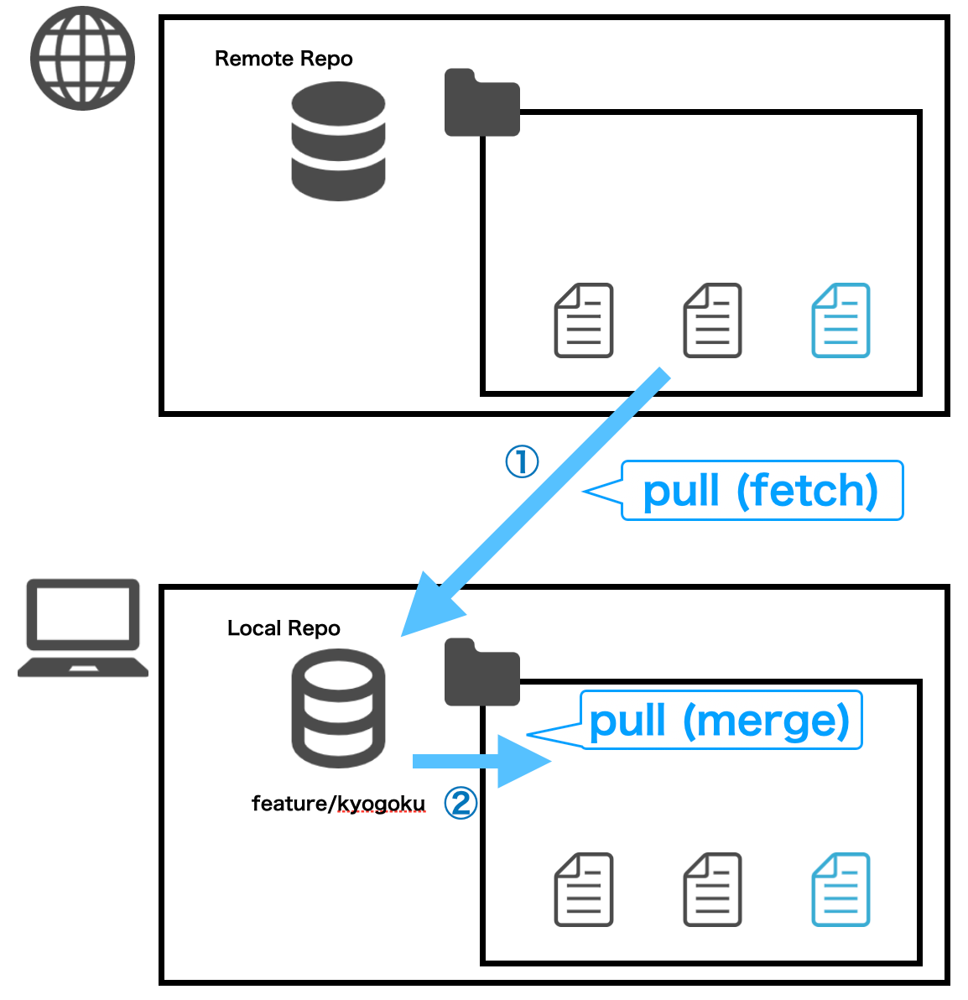

----

こんな感じで、一度のコマンドで「リモートリポジトリ」の内容を「作業エリア」に持ってきています。

で、実はこのコマンドは下記 2 つのコマンドを 1 回で行っているのと同じことになります。

`git fetch`
`git merge`

----

ここを深く話すとさらに混乱するかもしれませんので、省略して説明すると... :sweat_smile:

`git fetch` で、**リモートリポジトリ**の最新内容を、ローカルリポジトリに取り込む
`git merge` で、**ローカルリポジトリ**の最新内容を、作業エリアに取り込む

ということを行っています。
便利ですね〜🤤

----

でも、なんで 1 回のコマンドで済むのに、わざわざ `fetch` や `merge` コマンドがあるのでしょうか？
それは、これから説明する編集したファイルの内容が、他の人とバッティングした時に役に立ってくるからです。
この「編集したファイルの内容が他の人とバッティングした」というのを、我々の業界では「**コンフリクトした**」と言います。

なので、次ページ以降は「コンフリクト」という言葉で表現させていただきますね :wink:

----

それでは、ここからは実際にファイルをコンフリクトさせ、それを解消していく流れを追っていきましょう。
これが最後の Git の章になりますので、もう一踏ん張りファイト :muscle:

----

ここからは 2 人 1 組で行っていただきますので、前後左右の方とペアを決めてください。
（座席はそのままで構いません）
（もしどうしても 1 人になりそう、という方がいらっしゃったら、GW のメンバ or 私がペアになるのでお声がけください）

----

ペアでやることはこんな感じです（全部で 9 つのステップです）。
（仮にペアを A さん / B さんとします）

1. A さんが新しいブランチを作成し、ペアのそれぞれの作業エリアに持ってくる
2. A さんが自分の自己紹介文の末尾に「好きな映画や本」を追記
3. 追記した内容をリモートリポジトリに反映
4. B さんが A さんの自己紹介文の末尾に「ステキな内容ですね！」と追記
5. B さんが #4 の内容をリモートリポジトリに反映
6. **すると、無事にコンフリクトが発生します** :fire::fire::fire:

----

7. B さんはコンフリクトを解消し、再度追記した内容をリモートリポジトリに反映
8. A さんは最新の内容をリモートリポジトリから取得
9. A さんは自分の自己紹介文の末尾を確認し、「好きな映画や本」と B さんが書いた感想文が両方含まれていることを確認

ここまでできたら、A さん / B さんを交代して、#2 から再度実施します
時間の都合で割愛するかもしれません🙇‍♀️

----

では、早速順番にやっていきましょう！！

A さん：💚
B さん：💛

----

#### 1. A さんが新しいブランチを作成し、ペアのそれぞれの作業エリアに持ってくる

💚 ： `main` ブランチから新たなブランチを作成します
`feature/{A-name}-step2` という名前のブランチ（A-name は A さんの名前）
💚 ： ブランチを作成したら `git checkout` でブランチを切り替えます
💚 ：そして、まだ何も内容を変えずに `git push` コマンドを実行
💚💛 ：GitHub から先ほど追加したブランチが存在していることを確認

----

💛 ：下記手順で新しく作成したブランチに切り替えます
（この間に A さんは次シートの内容を実施しておきましょう）
1. `git pull`
2. `git branch feature/{A-name}-step2 origin/feature/{A-name}-step2`
3. `git checkout feature/{A-name}-step2`

💚💛 ：最後に `git branch` で現在のブランチが `feature/{A-name}-step2` であることを確認

----

#### 2. A さんが自分の自己紹介文の末尾に「好きな映画や本」を追記

💚 ：最初のワークで作成したご自身の自己紹介文ファイルの末尾に、「好きな映画や本」を追記

#### 3. 追記した内容をリモートリポジトリに反映

💚 ：では追記した内容をリモートリポジトリに反映していきましょう
`git add`
`git commit`

----

:rotating_light: ここでいったん STOP :rotating_light:
💛 B さんが下記コマンドまでをすべて実施し終えていることを確認。

```bash
# 💛 B さんが実施
git branch feature/{A-name}-step2 origin/feature/{A-name}-step2
git checkout feature/{A-name}-step2
```

問題なければ 💚 A さんは `git push` で追記した自己紹介文をリモートリポジトリへ反映します。

```bash
# 💚 A さんが実施
git push origin feature/{A-name}-step2
```

----

4. B さんが A さんの自己紹介文の末尾に「ステキな内容ですね！」と追記

💛 ：A さんの自己紹介文を確認し、末尾に「好きな映画や本」が **追記されていないこと** を確認
💛 ：A さんの自己紹介文を確認し、末尾に「ステキな内容ですね！」と追記

----

5. 追記した内容をリモートリポジトリに反映

💛 ：では追記した内容をリモートリポジトリに反映していきましょう

* `git add`
* `git commit`
* `git push`

きっとここで何かしらのエラーメッセージが表示されているはずです...

----

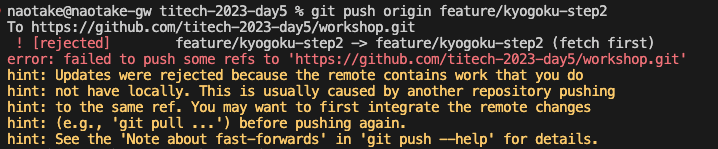

このようなエラーメッセージが表示されていれば正しい状態です。

これは、リモートリポジトリ側の `feature/{A-name}-step2` ブランチの状態が変更されたので、最新内容を `git pull` で取得してね。

というメッセージとなります。

----

ではそれにしたがって `git pull` を叩いてみましょう。
すると...

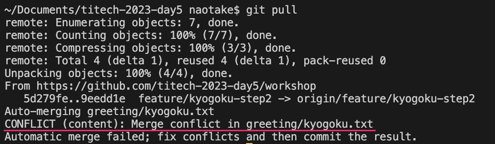

----

### 6. すると、無事にコンフリクトが発生します:fire::fire::fire:

では、このコンフリクトを解消していきましょう。

現在の状態としては A さんと B さんとで同じファイルを編集したことで、編集内容の競合が起きたのです。

Git は編集された 2 つの内容に対して、どちらが正しい修正内容なのかはわからないため、B さんの変更内容を修正するよう促しています。

----

7. B さんはコンフリクトを解消し、再度追記した内容をリモートリポジトリに反映

💛 ：では、さっそくコンフリクトを解消していきましょう。
（このあと A さん / B さんの役割を交代するので、A さんは前の画面を見ておいてください）

----

💛 ：`git status` を実行してみてください。

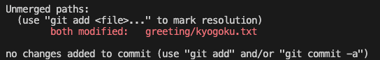

すると A さんの自己紹介文ファイルに対して `both modified` と記載があるはずです。
これは文字通り、リモートリポジトリと作業エリアの両方で編集があったことを表しています。

----

💛 ：実際のそのファイルを開いてみてください。

`<<<<<<<` や `>>>>>>>` といった記号が含まれていると思います。
これは、それぞれが「作業エリア側」「リモートリポジトリ側」の修正内容を `=======` を区切りとして表現しています。


----

この内容を見ながらコンフリクトを解消していきます。
解消の方法としてはざっくり 3 パターンあります。

1. 作業エリア側の内容を **正** として、リモートリポジトリ側の修正内容を削除する
2. その逆
3. リモートリポジトリ側、作業エリア側、両方の修正内容を**残す**

今回は #3 のパターンを使って、コンフリクトを解消していきます。

----

💛 ：コンフリクトしたファイルの `<<<<<<<` や `>>>>>>>` の文字があると思いますが、その上に
`Accept Current Change | Accept Incoming Change | Accept Both Changes | Compare Changes`
の表記があるはずです。


※キャプチャは日本語になっています。すいません :bow:

----

これはそれぞれ先ほどの #1 ~ 3 を表しています。

1. 作業エリア側の内容を **正** として、リモートリポジトリ側の修正内容を削除する
  → `Accept Current Change`
2. その逆
  → `Accept Incoming Change`
3. リモートリポジトリ側、作業エリア側、両方の修正内容を**残す**
  → `Accept Both Changes`

💛 ：なので、今回は #3 の `Accept Both Changes` を選択してください。

----

すると、先ほどあった `<<<<<<<` や `>>>>>>>` といった文字は消えているはずです。
これでコンフリクトを解消した、という状態になります。

💛 ：では、リモートリポジトリへ反映していきましょう。

* `git add`
* `git commit`
* `git push`

----

8. A さんは最新の内容をリモートリポジトリから取得

💚 ：リモートリポジトリから最新の内容を取得しましょう

* `git pull`

もし `Please specify which branch you want to merge with.` のようなメッセージが表示されたら下記のコマンドを実行した後、再度 `git pull` を叩いてください。

```bash
git branch --set-upstream-to=origin/feature/{A-name}-step2 feature/{A-name}-step2
```

----

9. A さんは自分の自己紹介文の末尾を確認し、「好きな映画や本」と B さんが書いた感想文が両方含まれていることを確認

💚 ：自分の自己紹介文のファイルを開き、末尾に自分が記入した「好きな映画や本」、それと B さんが書いた感想文が両方含まれていることを確認

これで無事にお互いのファイルを編集した内容を取り込むことができました。

----

では、A さん / B さんを交代して再度コンフリクト発生から解消までをやってみましょう。
#1 はすでに対応済みのため、#2 の手順からおこないます。

1. ~~A さんが新しいブランチを作成し、ペアのそれぞれの作業エリアに持ってくる~~
2. A さんが自分の自己紹介文の末尾に「好きな映画や本」を追記
3. 追記した内容をリモートリポジトリに反映
4. B さんが A さんの自己紹介文の末尾に「ステキな内容ですね！」と追記
5. 追記した内容をリモートリポジトリに反映
6. **すると、無事にコンフリクトが発生します** :fire::fire::fire: 

----

7. B さんはコンフリクトを解消し、再度追記した内容をリモートリポジトリに反映
8. A さんは最新の内容をリモートリポジトリから取得
9. A さんは自分の自己紹介文の末尾を確認し、「好きな映画や本」と B さんが書いた感想文が両方含まれていることを確認

----

<!-- _class: lead -->

### おつかれさまでした！！
### これで Git / GitHub の章は終わりです！！

----

今回学んだことをおさらいしますね。

* Git の一通りのコマンドを学ぶ
* GitHub の Pull & Request を使い、コードレビューを学ぶ
* コードのコンフリクトが発生した時の対処法を学ぶ

----

##### :beginner: 最後の最後に Tips

気づいてらっしゃった方がいるかもしれませんが
実は「現在のブランチ」は VS Code の左下に表示されていました。
基本はここをみて OK です 😅


