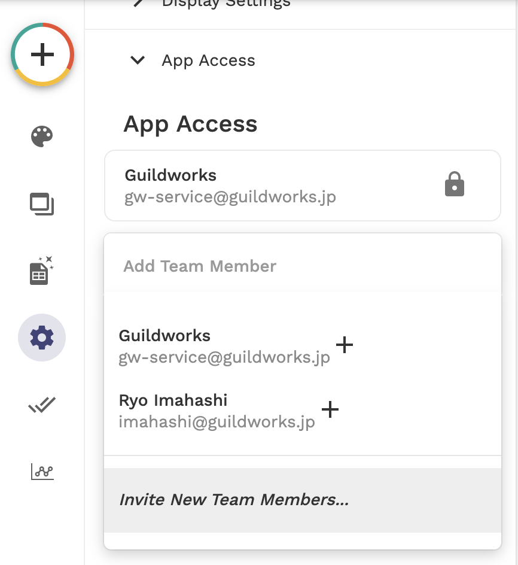

**Programming Boot Camp**

# 応用編

**東京工業大学 2021/11/27**
　
　
　
　
　
　　　　　　　　　　　　　　　　**Ryo Imahashi, Naotake Kyogoku**


---
## 目次
  - ふりかえりと今回やることの確認
  - 外部連携
  - ノーコードツールでの共同作業のTips
  - チーム開発演習
  - まとめ

---
## ふりかえりと今回やることの確認
- これまでの4回のレクチャーでは、AdaloとBubbleという2つのノーコードツールを使ったアプリの開発方法を学んできました。
- 今回はまず、AdaloとBubbleのそれぞれを外部のサービスと連携させる方法を学びます。
- 次に、共同作業に関するコツや注意点をご紹介します。
- 最後に、Development Phaseのチームでアプリ開発の演習と発表を行います。

---
## 外部連携
AdaloやBubbleだけで実現できないことがある場合、外部サービスと連携することでそれを実現できるかもしれません。

そのための方法をご紹介します。

<!-- ---
### 外部連携の方法
Adalo
- Zapier
- API
- データソース？
Bubble
- Zapier
- API

---
- Zapierというサービスを使えば、案内に従って操作することで、簡単に外部サービスを連携させられます。試してみましょう。
  https://zapier.com/apps/adalo/integrations

---
ZapierでAdaloと連携させることが可能な外部サービスの例
- Google Spreadsheet
- Google Calender
- Slack
- Zoom
- Twitter
- Instagram
- Spotify
- Bubble
- Google Meet
- Strava


---
外部連携で作るものの
- Instagramの投稿(Adalo)
- Twitterの投稿(Bubble)
- +α ベストエフォートで、複数サービスとの連携?

その他の候補
- Youtube連携
- Spotifyのプレイリストなど、自分の考えや好きなものを集約したページを作る(ユーザーごとに連携先サービスへの認証をさせる必要がある)
- 超調整さん(Adaloで作ったフォームで入力したイベントの出欠情報をGoogle Spreadsheetで一覧表示させる。Calendlyに負けそうではある。)
<!-- - 会議室予約管理システム(インターフェースはAdalo,データはGoogleCalender)
 -->
<!-- - Zoom or meetの会議参加者管理システム
- facebook-groupsからポストを抽出して山田道場ホームページ？
- stravaで運動ログを ? -->
<!-- 
---
bubbleとのzapier連携
- notion
 -->

---
#### Adaloでの外部連携
以下3種類の外部連携の方法を紹介します。
- Marketplaceの外部連携コンポーネント
- Custom Action
- External Collection
<!-- TODO: - 連携サービス -->

---
##### Marketplaceの外部連携コンポーネント
Marketplaceから外部連携を可能にするコンポーネントを追加できます。


---
まずはアプリを新規作成しましょう。
- Adaloにログイン
https://app.adalo.com/login
- CREATE NEW APPをクリック

---
- PlatformはNative Mobile Appを選択


---
- TemplateはBlankを選択


---
- App NameにはMarketplaceComponentTrialを入力
- Colorは自由に設定してください


---
###### Twitter Timeline コンポーネント
- +ボタンを押してADD COMPONENTの中のExplore Marketplaceをクリック


---
- Twitter TimelineコンポーネントをINSTALL


---
Twitter Timelineコンポーネントを配置します。
- Home ScreenにTwitter用画面へのLinkボタンを追加


---
- ADD ACTIONからNew ScreenへのLinkを追加


---
- Templateで"App Bar"を選択し、"Twitter Timeline" 画面を作成


---
- Twitter Timelineコンポーネントを配置


---
- Twitter Handle Nameに "tokyotech_jp" と入力


---
- Preview機能でSignupして、Twitterボタンをクリック


---
- 東京工業大学公式Twitterアカウントの投稿が一覧表示されます


---
ログインしたユーザー自身のTwitterアカウントの投稿が一覧表示されるように修正しましょう。
- Users CollectionにTwitterHandleName Propertyを追加
  - TypeはTextを選択


---
- Signup画面のFormをクリック
- Fields > ADD VISIBLE FIEDLD > TwitterHandleName
- Not Requiredに変更


---
- "ALREADY HAVE AN ACCOUNT?"というリンクがフォームに重なってしまっていたので、下に移動


---
登録済のユーザーにTwitterHandleNameを設定しておきましょう
- Users Collectionの "1 Record" ボタンをクリック


---
- 登録済のユーザーのレコードをクリック
- TwitterHandleNameを入力(自分のアカウントでも、好きなアカウントでもOK)


---
- Twitter TimelineコンポーネントのTwitter Handle Nameを"Logged In User's TwitterHandleName"に変更


---
理論上はこれでログインユーザー自身が設定したTwitterアカウントの投稿一覧が表示されるはずです。

Preview機能で確認してみましょう。

---
エラーが起きると思います。


---
Twitter Timelineは有志の方が無償公開してくれているコンポーネントです。

誰かが作ってくれているものが、いつも自分の思い通りに動くとは限りません。


---
「できないなら紹介しないでよ」と思った方もいるかもしれませんね。ごめんなさいmm

試行錯誤をして「エラーを回避する方法を見つけた！」と思ったので資料に書いたのですが、後からそれが勘違いだったことに気づきました。。(ブラウザにはキャッシュという仕組みがあって、時々幻のようなものを見せてきます)

「そんなこともあるんだな」くらいは覚えておいてもらえると嬉しいです。

<!-- ---
試行錯誤の結果、エラーを回避する方法を見つけたので、紹介しますね。

---
- Text InputコンポーネントをTwitter Timeline画面に配置
- Nameに "Invisible Input for TwitterHandleName" と入力
- Default Valueに "Logged In User's TwitterHandleName" を設定


---
- Twitter TimelineコンポーネントのTwitter Handle Nameを "Invisible Input for TwitterHandleName"に変更


---
"Invisible Input for TwitterHandleName" は画面上に表示する必要はないので、非表示にします
- Canvas上で画面名"Twitter Timeline"をクリックして、"Invisible Input for TwitterHandleName"の右側の目のアイコンをクリック


---
もう一度Preview機能で確認してみましょう。

# エラー回避できたと思ったら、できてなかった！キャッシュのせいで幻を見ていただけだった！

--- -->

---
参考: Twitter Timelineコンポーネントのコードは公開されているので、修正して使うこともできそうです。(今回はやりません)
https://github.com/amezousan/adalo-twitter-timeline/


---
- Twitter TimelineコンポーネントのTwitter Handle Nameは直接値を入力した状態に戻しておきましょう


---
##### Video Calling
次に、ビデオ通話コンポーネントを紹介します。

---
- Marketplaceで "No-Code Video Calling"コンポーネントをINSTALL


---
ビデオ通話コンポーネントを配置するための新しい画面を作りましょう。
- Home画面にビデオ通話用画面へのLinkボタンを追加
- ADD ACTIONからNew ScreenへのLinkを追加


---
- Templateで"App Bar"を選択し、"Video Calling" 画面を作成


---
- Video Callingコンポーネントを画面上に配置
- Unique Conversation IDに "all-in-one" と入力
  - これは、全ユーザーを一つのビデオ通話に参加させる設定です
- Unique User id に "Logged In User's Email" を設定


---
補足

今回は全ユーザーを一つのビデオ通話に参加させる設定にしましたが、複数のユーザーが所属するグループを作ってグループメンバーだけで通話することも可能だと思います。

興味があれば、挑戦してみてください。

---
Preview画面で確認してみると、"register your Adalo App ID to your Garlick.io accout for free" というメッセージが表示されます。案内に従いましょう。

- "Click to Register Adalo App" をクリック


---
ログイン画面が表示されますが、まだアカウントを作成していません。
- "Or, Sign Up"をクリック


---
- Development Planを選択(無料です)


---
- Emailを入力して "Continue to checkout" をクリック
  - Googleアカウントを持っていれば、Sign in with GoogleをクリックしてもOKです。


---
- 3つのチェックボックスにチェックをつけて、"Complete sign up" をクリック


---
- 届いたメールを開いて、 "Confirm your account" をクリック


---
- Passwordを設定


---
アカウント登録が完了しました。
次は、Adalo App IDを登録します。


---
- Adaloの管理画面を開いて、URLに含まれるApp IDをコピー
  - 以下のURLの "xxx..." の部分です。
  https://app.adalo.com/apps/xxxxxxxx-xxxx-xxxx-xxxx-xxxxxxxxxxxx/screens/preview


---
- Garlick.ioの管理画面でAdalo App IDを入力して、 "Register App" をクリック


---
AdaloのPreview画面をリロードして再度ビデオ通話画面を表示すると、ビデオ通話の参加者待ちの状態になります。


---
他のユーザーがログインしてビデオ通話画面を表示すると、通話ができます。


---
~~# 質問: ビデオ通話を試してみますか？~~

~~試してみたいというリアクションがもらえたら、実験用のアプリのURLをシェアします。~~

スライドの枚数的に時間が足りなくなりそうなので、割愛します...
<!-- 
 -->

---
無料プランだと合計通話時間が1440分に到達したら通話ができなくなるようですが、開発時のテストには十分だと思います。
<!-- また、一度の通話の時間は5分までに制限されているようです。 -->
ビデオ通話機能が必要になったら、活用してください。


---
この他にも外部サービスと連携するためのコンポーネントがいくつか提供されています。興味があれば、試してみましょう。

例: 
- Youtube(無料)
- Google Map(フリートライアルが使える)
- Google Signin($25)

---
##### Custom Action
外部連携コンポーネントの次は、APIから取得したデータをAdaloの画面上で扱う方法を紹介します。

---
参考
>アプリケーションプログラミングインタフェース（API、英: Application Programming Interface）とは、広義ではソフトウェアコンポーネント同士が互いに情報をやりとりするのに使用するインタフェースの仕様である。

https://ja.wikipedia.org/wiki/%E3%82%A2%E3%83%97%E3%83%AA%E3%82%B1%E3%83%BC%E3%82%B7%E3%83%A7%E3%83%B3%E3%83%97%E3%83%AD%E3%82%B0%E3%83%A9%E3%83%9F%E3%83%B3%E3%82%B0%E3%82%A4%E3%83%B3%E3%82%BF%E3%83%95%E3%82%A7%E3%83%BC%E3%82%B9

---
まずは、API連携を試してみましょう。
無料で試せるThe Cat APIを使います。以下のURLにアクセスしてください。
https://thecatapi.com/


---
参考: 犬派の人のために、The Dog APIもあります。おそらくThe Cat APIと同様のことができると思います。(試せていないので、まずは一緒にThe Cat APIを使うことをおすすめします)
https://www.thedogapi.com/


---
APIを使用する際には、APIの提供者からAPIキーを発行してもらう必要がある場合が多いです。
The Cat APIでもAPIキーが必要になりますので、発行してもらいましょう。
- 下にスクロールしてPricingの欄の "SIGNUP FOR FREE" をクリック


---
- E-mail、App Description、type of projectを入力し、 "SIGNUP" をクリック


---
- メールで送られてきたAPIキーを確認(後で使います)


---
次に、APIドキュメントでAPIの使い方を確認しましょう。
- 以下のURLへアクセス(先程のメールにも"API Documentation"というリンクが記載されています)
https://docs.thecatapi.com/

---
トップページに記載されている、ランダムな子猫の画像を取得するAPIを使います。

Exampleと同じように、ボタンを押すと画像が切り替わるようにしましょう。


---
- Adaloの管理画面でCREATE NEW APP
- 設定は以下の通り
  - Platform: Native Mobile App
  - Template: Blank
  - App Name: ApiIntegrationTrial


---
- Home画面に子猫画像表示画面へのリンクボタンを追加
- ADD ACTIONからNew ScreenへのLinkを設定


---
- TemplateにApp Barを選択し、Kittens画面を作成


---
- Imageコンポーネントを画面上に配置
- コンポーネントの設定はそのままにしておく(後で設定します)


---
- Change Kitten Image Buttonを追加


---
- ADD ACTIONからNew Custom Actionを選択


---
14日間のIntegration Pack Trial(無料)の開始を促されます。
- "START INTEGRATION PACK TRIAL" をクリック


---
トライアルが開始しました。
- "CREATE NEW CUSTOM ACTION" をクリック


---
- 以下を入力してNEXTをクリック
  - Name: GetRandomKitten
  - Type: Create


---
次に、送信するAPI Requestを設定していきます。


<!-- そもそもなんでこのドキュメントが使用するAPIのものだと分かるのか は口頭で補足したい -->
---
以下のURLにアクセスして、使用するAPIのドキュメントから設定項目を確認します。
https://docs.thecatapi.com/api-reference/images/images-search
- API Base URLは https://api.thecatapi.com/v1/images/search
- MethodはGET
- Headerに x-api-keyというNameでAPI keyを設定


---
- 確認した結果を踏まえてAPI Requestを設定
  - API Base URLは https://api.thecatapi.com/v1/images/search
  - MethodはGET
  - Headerに x-api-keyというNameでAPI keyを設定
- "RUN TEST REQUEST" をクリック


---
Testが成功すると、APIから取得したデータ(Magic Text Output Properties)が表示されます。これらは、後続のアクションで使用できます。
- "SAVE CUSTOM ACTION" をクリック


---
次に、APIから取得した子猫の画像のURLをImageコンポーネントのImage Sourceに設定します。

そのままでは、選択肢の中にAPIから取得したデータは出てきません。


---
- Text Inputコンポーネントを画面上に追加
- Nameを "Invisible Kitten Image URL Input" に変更


---
- "Change Kitten Image Button" をクリック
- ADD ANOTHER ACTION から Change Input Value を選択


---
- Inputに "Invisible Kitten Image URL Input" を設定
- Valoueに "GetRandomKitten > url" を設定
- "DONE" をクリック


---
- Imageコンポーネントをクリック
- URLに "Invisible Kitten Image URL Input" を設定


---
- 画面名 "Kittens" をクリック
- "Invisible Kitten Image URL Input" の右側の目のアイコンをクリックして非表示にする


---
Preview機能で確認します。

CHANGEボタンをクリックすると、子猫の画像が表示されました。


---
補足

- Custom ActionでAPIから取得したデータは、後続のActionで使用できます。そのデータをコンポーネントで使いたい場合は、以下のいずれかの方法を使いましょう。
  - 今回のように、後続のActionのChange Input Valueで同一画面上のText InputのValueにデータを設定し、それを読み込みましょう。
  - あるいは、そのデータを後続のActionでデータベースに保存して、それを他のコンポーネントから読み込むことも可能です。この場合、画面遷移後にもアクセスできます。
    - 例: https://help.adalo.com/integrations/custom-actions

<!--  -->

---
注意事項

現状、Custom Actionにはいくつかの制限があります。
- Custom ActionはFormコンポーネントのSubmitボタンでは動作しません。
- Custom Actionが画面全体のActionとして使用されている場合、APIのレスポンスとして取得したデータは皇族のActionで使用できません。
- アプリをCloneしてもCustom Actionはコピーされません。Custom Actionを含むアプリをCloneしたら、手動で作成し直してください。
<!-- https://help.adalo.com/integrations/custom-actions -->

---
\>アプリをCloneしてもCustom Actionはコピーされません。Custom Actionを含むアプリをCloneしたら、手動で作成し直してください。

14日間のIntegration Pack Trialは、Development Phaseの真っ只中で終了すると思われます。

Custom Actionを多用する可能性がある場合、Development Phaseの作業開始前に新しくAdaloのアカウントを作成し、Integration Pack Trialを新たに開始することをおすすめします。

---

##### External Collection
APIから取得したデータをAdaloのCollectionとして扱う方法を紹介します。

複数のデータを一括取得してそれらを画面上に一覧表示するような場合はCustom Actionではなく、External Collectionを使います。

---
このAPIを使って、猫の品種の一覧を取得&表示しましょう。
https://docs.thecatapi.com/api-reference/breeds/breeds-list#send-a-test-request
<!--  -->


---
- DatabaseのExternal Collectionsで "ADD COLLECTION" をクリック


---

- Collection Name: Breeds
- Base URL: https://api.thecatapi.com/v1/breeds
- Method: GET
- Auth Setup
  - Header x-api-key: 発行したAPI Key


---
Adaloでは、APIでアクセスするリソース(この例ではbreeds)毎に5つのEndpoints(アクセス方法)が設定できます。

APIの仕様によってはそれに合わせるための修正が必要になりますが、今回はそのままNEXTをクリックしてOKです。
<!-- (使用するEndpointである Get All はデフォルトでAPIの仕様を満たす設定になっています) -->


---
- テストを実行して成功したら、"CREATE COLLECTION" をクリック


---
External Collectionが作成されました。

APIから取得するデータが全てプロパティとして設定されています。


---
取得したデータを一覧表示しましょう。
- Home画面に "Breeds Link" ボタンを追加
- ADD ACTIONからNEW SCREENヘのLINKを追加


--- 
- Nameに "Breeds"と入力
- TemplateでImage Listを選択
- CREATE SCREEN をクリック


---
- List TitleのTextを"Cat Breeds"に変更
- Image ListをBreeds Collectionのリストとして設定
- ImageのURLに "Breed Image > url" を設定
- "If there's no image..." に "Don't show anything" を設定
- 右下の+ボタンは不要なので削除


---
- Textを "Breed name" に変更


---
戻るアイコンが非表示になっているので、表示します。
- App Barをクリック
- Left IconのトグルをONに変更


---
Preview機能で確認すると、猫の品種の一覧が表示されました。


<!-- ---
###### 追加コンテンツ
TODO: 時間に余裕があれば資料化。難しければ、資料なしで時間が余った時に実演。

- 子猫画像表示画面で選択した品種だけを表示できるようにする
- 表示した子猫の画像をお気に入りに登録でき、お気に入り一覧画面に表示されるようにする
  - お気に入りからの削除もできるようにする -->


<!-- ---

SpreadSheet連携はAPI連携先のデータのCRUDを実演したかったから選んだテーマだけど、The Cat APIでCRDは教えられる(Uはないけど)し、SpreadSheetにデータを保持する意味もあまりないので、こちらは割愛。
###### APIから取得したGoogle SpreadSheetのデータをAdaloのCollectionとして扱う
API連携先のデータは取得するだけではなく、登録、更新、削除することもできます。
Google SpreadSheetを使ってそれを試してみましょう。

---
Googleアカウントを作成します。
既に持っていればそのアカウントを使えば良いので、作成は不要です。
持っていない人は、一緒に作成してください。
https://accounts.google.com/signup/v2/webcreateaccount?continue=https%3A%2F%2Faccounts.google.com%2FManageAccount%3Fnc%3D1&dsh=S50453738%3A1637917137418951&biz=false&flowName=GlifWebSignIn&flowEntry=SignUp

---
Google SpreadSheetのデータをAPIで操作できるようにするために、SheetDBというサービスを使います。
https://sheetdb.io/


---
補足
連携サービスで、Adaloとは直接連携させられなくても、Google SpreadSheetとであれば連携させられるという場合が多いかと思います。そのような場合は、今回ご紹介したようにGoogle SpreadSheetをデータのハブとして活用すると良いかもしれません。 -->

<!-- ---
##### 連携サービス
Custom ActionやExtenal Collectionでは、連携先のサービスのAPIの仕組みをドキュメントから理解するのが大変かもしれません。

次は、そんなことをしなくても簡単に連携の設定ができるサービスをご紹介します。

---
連携サービスにも色々なものがあります。


---
元々はZapierを紹介しようと思っていたのですが、数日前からAdaloとのアカウント連携ができないトラブルが起きてしまっています。(焦りました。。。)
参考: [Bad request error when connecting to Adalo](https://community.zapier.com/general-questions-3/bad-request-error-when-connecting-to-adalo-12739)


---
そのため、今回はIntegromatを紹介します。
https://www.integromat.com/en


---
TODO: Integromatでメール送信 -->

---
Adaloでの外部連携についての紹介は以上です。

---
#### Bubble での外部連携

つづいて Bubble での外部連携を試していきます。
今回作る画面はこんな感じです。


---

機能としては下記を盛り込んだ画面となります

- YouTube の動画一覧を表示
- Google アカウントを使ったソーシャルログイン
- YouTube の動画一覧を動的に検索

---

##### まずは土台となるアプリケーションを新たに用意

- Advanced-bubble-{ご自身の名前} というアプリを新たに作成


---

- 第 3 回の時と同様、ヘッダーを除いてすべての要素を削除してください
  - 一度すべて削除した後にヘッダーコンポーネントを再配置でも OK


---

##### 続いて Google アカウント側の事前準備

- YouTube の動画一覧を表示するために必要な下準備を行います
- Google アカウントにログインしていただき、下記 URL にアクセスします
  https://console.developers.google.com/

---

- はじめて Google Cloud Platform(GCP) の画面にアクセスするとこのようなダイアログが表示されますので、国を選択し、利用規約にチェックを入れて「同意して続行」


---

- 同意すると、API とサービスのダッシュボードが表示されると思いますので、プロジェクトを作成のリンクを押下して今回の講義用のプロジェクト（箱）を作成します


---

- 新しいプロジェクトの作成画面が表示されるのでプロジェクト名に適当な名前を指定して作成


---

- 作成が完了すると、作成したプロジェクトのダッシュボードが表示されます
  - 画面上部の Google Cloud Platform の左隣に作成したプロジェクト名が表示されていれば OK


---

- 続いて YouTube の動画一覧を表示するために必要な認証キーを発行します
- 左メニューから「認証情報」を選択
- 右パネルが認証情報に変わるので、画面上部の「＋ 認証情報を作成」をクリック
- ポップアップから「API キー」を選択


---

- すると API キー作成完了のポップアップが表示されるので、その値を控えておきます
- キーを制限しろと言われますが、講義の最後にこれらのキーを削除しますので一旦このまま行きます


---

- これで Bubble から YouTube の一覧を取得するためのキーが発行できたので Bubble 側の設定を行っていきます
- まずは Bubble から YouTube の一覧を API を介して取得するための準備を行います

---

##### Bubble の API 連携の準備

- 左メニューから Plugins を選択し、Add plugins ボタンをクリック
- `API` で検索し、 `API Connector` というプラグインをインストールします


---

- このプラグインは Bubble のアプリから、世の中で公開されている API を使って、API の向こう側の情報と Bubble を繋げるためのプラグインとなります
- いくつかの Bubble のプラグインの中には、特定の API に特化させたものもあり、それらのプラグインはこの API Connector よりも設定が単純なものもあります
- 今回は一番の基本形となる API Connector プラグインを介して YouTube API を使い、動画の一覧を表示してみましょう

---

- それでは YouTube API を使うための設定を行っていきます
- まず "Add another API" をクリックし、新しい API 連携の設定を開始します


---

- "Add another API" をクリックすると、このような API 設定部品が表示されると思います


---

- 各項目を簡単に説明します
- 1 と 2 については合わせて設定を行ってください

---

1. API Name: この API 連携のグループ名
  - 今回は YouTube


---

2. Authentication: このグループ配下の API で行う共通の認証方式
  - 今回は "None or self-handled"


---

3. Shared headers for all calls: このグループ配下の API すべてで指定する共通のヘッダー情報
  * 今回は特に指定しません


---

4. Shared parameters for all calls: このグループ配下の API すべてで指定する共通のパラメータ情報
  * 今回は特に指定しません


---

- 続いて、このグループに対して具体的な API の内容を設定していきます
- 先ほどの画面で "API Call" となっているブロックの右側に expand というリンクがあるのでそれをクリック
- すると、具体的な API の設定項目が表示されますので、簡単に説明します


---

1. Name: 具体的な API の名前
  * 今回は "search" と入力します


---

2. Path: 具体的な API の URL
  * 今回は `https://www.googleapis.com/youtube/v3/search` を入力します


---

3. Headers: この API 固有のヘッダー情報
  * 今回は特に指定しません


---

4. Parameters: この API 固有のパラメータ情報
  * 今回は下記 2 つのパラメータを指定します。Private / Allow blank / Optional は添付の通り
    1. Key: `key`、 Value: 先ほど Google アカウント側で発行した API キー
    2. Key: `q`、Value: YouTube で動作検索をする際のキーワード（ご自由に指定ください）

---

- すべて設定するとこんな感じです


---

- 設定が終わったら、設定内容が正しいかを確認します
- 下部にある "Initialize call" ボタンをクリック

---

- おそらく Status code 403 のエラーメッセージが返ってきたはずです
- 内容は書いてある通りですが、要約するとこんな感じです

```
YouTube Data API v3 はあなたのプロジェクトで無効になっています。
この URL にアクセスして有効にしてから再試行してください。
```


---

- どうやら今回利用した YouTube Data API が各人の Google アカウント上で有効になっていないようです
- これは Google さんが全員が使わないであろう機能は最初から OFF にしていて、必要ある人だけ自分で ON にしてね、という状態になっています
- なので今回は YouTube Data API を使いたいので、メッセージに記載されている URL にアクセスして有効化しましょう
  https://console.developers.google.com/apis/api/youtube.googleapis.com/overview?project={各人のプロジェクトID}

---

- すると親切に今回利用したい "YouTube Data API v3" の画面へ遷移したはずです
- 画面にあるとおり「有効にする」をクリックして有効にします


---

- しばらくするとこんな画面に遷移するはずです
- 画面上部の赤線部分が「API を無効にする」となっていれば有効化は成功です


---

- YouTube Data API が有効化できたので、再度 Bubble の画面に戻り "Initialize call" ボタンをクリック
- 成功すると "Returned values - search" というポップアップが表示されるはずです


---

- これは今回設定した `https://www.googleapis.com/youtube/v3/search` の API を実行した結果の情報を表しています

---

詳しくは割愛しますが、ポイントとしては

- `items(list)` となっている部分が検索結果の動画一覧が格納されている一覧になります
- その型となるのが `search item` という型となり、検索結果に含まれる複数系のデータであることを表しています
- そして、この後の設定で特に重要なのが `id videoId` となっている項目です

---

- YouTube を見たことがある人なら分かると思いますが、この VideoId というのが、それぞれの動画を一意に識別する動画となっており、画面表示するときにもこの Id が必要となります
- その他、特に参照しない項目については紛らわしいのでプルダウンの中から `Ignore field` を選択しておきます
- こうすることで、Dynamic data として扱う時に、選択肢の中に表示しないようになり、設定項目を選ぶ際に悩まずに済みます

---

- すべて設定するとこんな感じです
- 設定が完了したら "SAVE" をクリックして、設定内容を保存しておきます


---

##### 画面表示の準備

- Bubble の API 連携の準備が出来たので、いよいよ画面の設定をしていきます
- 画面の設定は第 3 回、4 回の講義でマスターしていると思いますので、概要だけお伝えして画面レイアウトを組み立ててみてください

---

- index ページで Repeating Group を使って一覧を組み立てます
- Repeating Group の各セルの中には Video を配置
- こんな感じですね


---

- レイアウトが出来たので実際に YouTube の一覧表示を設定していきます
- まず Repeating Group の Type of content は、先ほど API 実行時に確認した `search item` 型となります


---

- 次に Data source ですが、今回は API から取得した YouTube の動画一覧を対象とします
- Click から候補を見てみると `Get data from an external API` という項目があると思うのでそちらを選択


---

- 隣に Get data From an external API のポップアップが表示されるので、API provider のプルダウンを選んでください
- すると、プルダウンの中に先ほど設定した `YouTube - search` の候補があると思いますのでそれを選択してください
  - ハイフンの前が API のグループ名で、後ろが具体的な API の名前です


---

- 次に各セルの設定をしていきますが、まずは皆さん設定してみましょう

- Video source は YouTube
- すると Video ID という項目が表示されるので、先ほど API 設定をしたときにみた `Video Id` を参照すればよさそうですね


---

- こんな感じですね


---

- これで設定完了です！さっそくプレビューしてみましょう！
- 事前に API で指定したキーワードの動画一覧が表示されましたか？

---


---

##### Google ログインを試してみよう

- 続いて Bubble アプリへのログインを Google アカウントを使ってログインしてみましょう！
- まずは Google のプラグインをインストール


---

- インストールした Google プラグインを選択
- 右パネルに表示されている `Use a generic redirect URL` の欄にチェックを入れる
  - この URL もメモしておくのですが、画面上で選択ができないため、下記 URL のアプリ名部分だけご自身のアプリに読み替えてメモしておいてください
  - `https://advanced-bubble-{Your Name}.bubbleapps.io/api/1.1/oauth_redirect`

---


---

##### Google へのログイン後にアプリに戻ってくるための認証準備

- Google Cloud Platform 画面にアクセス

https://console.developers.google.com/

---

- プロジェクトを選択し、左メニューから OAuth 同意画面を選択


---

- User Type に "外部" を選択して「作成」
- 必要事項を入力したら、保存して次へ


---

- アプリ情報
  - アプリ名: bubble で作成したアプリ名
  - ユーザーサポートメール: ご自身の Google アカウントのメールアドレス


---

- 承認済みドメイン
  - bubbleapps.io
- デベロッパーの連絡先情報
  - ご自身の Google アカウントのメールアドレス


---

- スコープは特に設定変更せず、保存して次へ

---

- テストユーザにはご自身の Google メールアドレスを入力しておく
- 設定したら保存して次へ


---

- これで登録は完了したので続いて認証情報を発行します
- 左メニューから認証情報を選択して、「＋ 認証情報を作成」をクリック
- サブメニューから OAuth クライアント ID を選択


---

- OAuth クライアント ID の作成画面が表示されるので下記の通り入力し「保存」

- アプリケーションの種類: ウェブアプリケーション
- 名前: Bubble OAuth


---

- 承認済みのリダイレクト URI: Bubble 側で Google プラグインインストール時に控えた URL
  https://advanced-bubble-{Your Name}.bubbleapps.io/api/1.1/oauth_redirect


---

- すると「OAuth クライアントを作成しました」というポップアップが表示され、そこにクライアント ID とクライアントシークレットが表示されているので、それをメモしておく
  - メモだと忘れるかもしれない場合は JSON をダウンロードしても OK
- メモしたら OK でクローズ


---

##### 発行した認証情報を Bubble 側に設定

- Bubble の Google プラグイン画面に戻り、先ほど取得したキーをそれぞれの項目へ入力する
  - クライアントID → AppID/API Key
  - クライアントシークレット → App Secret


---

- これで事前設定は完了
- 続いてログイン機能を作り込んでいきます

---

##### ログイン機構を Google に置き換える

- ヘッダーコンポーネントを開き、SIGN UP OR LOGIN ボタンを選択してワークフロー画面へ遷移
  - ついでにボタンのラベルを "Google LOGIN" に変更


---

- ワークフロー画面へ遷移すると Button Google LOGIN に対して 2 つの When に対する振る舞いが設定されていると思います


---

- When: Button Google LOGIN is clicked and Current User is logged in
- これは文字通り、カレントユーザがログイン済み状態で「Google LOGIN」ボタンを押された場合、のワークフローとなります

---

- When: Button Google LOGIN is clicked and Current User is logged out
- これも文字取り、カレントユーザがログアウト済み状態で「Google LOGIN」ボタンを押された場合、のワークフローとなります

---

- まずはログイン時のワークフローを設定していきたいので、Current User is logged out のワークフローを設定していきます
- 既存ですでに「Show Sign up / Login Popup A」のステップが定義されているので、そちらを delete します


---

- 続いて Google ログインのワークフローを設定していきます
- Click here to add an action... を選択
- Account から Signup/login with a soccial network を選択


---

- Signup/login with Google のポップアップが表示されます
- OAuth provider に Google を選択
- 事前に Google と Bubble のプラグインに設定を行ったので、これだけで Google 認証が行えるようになりました 🙌


---

- 折角なのでログイン成功したらヘッダー上部にアカウント名と画像を表示してみましょう


---

- ヘッダーコンポーネントを開き、LOGIN ボタン左の要素を削除します
- Visual elements から Image を選択し、LOGIN ボタンの左側に配置します
  - 縦横 100 x 100 の正方形にしておきましょう


---

- そして、画像の参照元を設定します
- Bubbler の皆さんなら設定方法はイメージつきますよね
- 動的な表示設定は Dynamic image
- 表示したいのは現在ログインしているユーザの Google アカウントのプロフィール画像

---

- こんな感じですね


---

- ではプレビューしてみましょう！
  - 事前に Data の User にこれから動作確認する際に使用する Google メールアドレスと同じメールアドレスのデータがある場合は削除しておいてください
- ログインボタンを押すと Google のログイン画面に遷移し、そこでログインをすると Bubble 側に戻ってきましたよね？
- ちなみに、ログインすると Bubble 側の User data にログインした Google アカウントのメールアドレス情報が登録されます

---


---

##### 最後に YouTube API を使った検索機能を組み込んでみましょう


---

- 現状では YouTube API の認証キーや検索キーワードは固定になっています
- なので、これを下記のように変えてみましょう
  - 認証キーはログインしているユーザ情報から取得する（新たに field を追加する）
  - 検索キーワードは画面から入力・検索できるようにする

---

次のページにヒントを書いておきますのでまずはトライしてみましょう！

---

- まずは User に対して `key` という field を追加し、事前に設定しておく
  - 本来ここもユーザ自身に入力させるなどの導線が自然ですが今回は時間の都合上、API キーの設定画面は割愛します
- API のパラメータを処理の中で動的に設定する場合、まずは固定値を無くし `Private` のチェックを外すことで、DataSource などで API 呼び出しする際にパラメータを指定できます
- index ページに新たに検索用の要素（テキストボックスと検索ボタン）を配置し、検索ボタンがクリックされた時に、YouTube API 経由で検索を行い、結果を Repeating Group にセットしてあげます

---

# :hourglass_flowing_sand:
# :hourglass_flowing_sand:
# :hourglass_flowing_sand:
# :hourglass:
# :hourglass:

---

- まずは User の型に対して `key` という field を追加します


---

- そして、今回取得した認証キー（API キー）を登録済みの User に事前にセットしておきます


---

- 次に YouTube API 側の設定はこんな感じですね


---

- ポイントとしては、動的に指定したい項目については Value の値を削除し、Private のチェックを外しました
- これにより、API を使う場面でこれらのパラメータの値を指定することができるようになります


---

- 続いて Repeating Group の Data source を空にします
- これは、新たに設ける検索機能のワークフローの中で、ここで表示するデータを指定するためです


---

- 次にキーワード検索が行われた時のワークフローの設定です
- 今回は要素に対するアクションとなるため "Element Actions" の中にある "Display list" を選択します


---

- Data source には Get data from an external API を選択し、API 経由のデータ表示とします
- そして API provicer に `YouTube - search` を選択すると、先ほどはなかった 2 つの param が表示されるはずです
- これは先ほど YouTube API 側の設定で動的に指定したいパラメータについて Private のチェックを外したためとなります
- ここで指定する値はいつもの Dynamic data ですね

---

- 設定するとこんな感じです


---

- いかがでしたでしょうか？
- API 連携を行うことで、Bubble で出来る幅がさらに広がったと思います！
- 合宿でも外部の API を使うチームがあるかもしれませんが、そのときは今日学んだことを活かして、API 連携を実践してみましょう！


---
## ノーコードツールでの共同作業のTips
チームでノーコードツールを使って共同作業をする時に役立つ情報をお伝えします。

---
#### (再掲) Adaloでのチームメンバーの招待方法
- チームメンバーと一つのアプリを共同編集するには、Settings > AppAccess > Add Team Member > Invite New Team Memberを選択してチームメンバーのメールアドレスを入力しましょう。



---
#### Bubbleでのチームメンバーの招待方法
- チームメンバーと一つのアプリを共同編集するには...
<!-- アカウントのメールアドレスとパスワードを共有しましょう(PDFへの表示は避けよう) -->


---
#### Adaloでの同時編集の注意点
- 他の人が行った編集は自分の画面にリアルタイムで反映されません。反映させるためにはリロードが必要です。
- 同じ画面を同時編集すると、先に行われた編集が後から行われた編集に上書きされて、最後に編集した人の画面の状態になります。
  - 編集したコンポーネントは別でも、先に行われた編集は取り消されます。
- Actionも、同じ画面に同時に追加すると、後の方だけが保存されます。
- Databaseも、同時編集した場合は最後に編集した人の状態で上書きされます。

---
- 別画面の同時編集なら、どちらも保存されるので大丈夫です。編集する時は、どの画面かをチームメンバーに共有しましょう。画面ごとに担当者を決めるのもおすすめです。
- 編集する画面を切り替える前には、画面をリロードして最新の状態を反映しましょう(そうすることで、他の人が編集した画面を自分が古い状態に戻してしまうことを防げます)
- 他の人の担当画面をうっかり触ってしまわないように、Canvas上で画面同士の距離を離してから開発するのもおすすめです。
- Databaseは、誰か1人担当者を決めてその人が更新するようにしましょう。

---
#### Bubbleでの同時編集の注意点
- 同じエレメントに対する同時編集は避けましょう(後から行われた編集で上書きされます)
  - そのためには、画面ごとに担当者を決めて同じ画面の同時編集を避けるのがおすすめです。

それ以外の注意点は特にありません。
- 編集は他の人の画面にリアルタイムで反映されます。
  - 画面の編集だけでなく、データベースやWorkflowの編集もリアルタイムで反映されます。
- 画面ごとに作業分担すれば、<!-- うっかり他の画面を触ってしまうこともない(Canvasが分割されている)ので -->難なく開発できそうです。


<!-- ---
TODO: 共同編集について検証した内容を実演して見せられるようにする
Bubbleはほぼ問題ないので、実演はAdaloだけで良さそう -->

<!-- ---
モブプログラミングの紹介?
- ドライバーとナビゲーターみたいなお話を盛り込む？ -->
---
## チーム開発演習
- DevelopmentPhaseのチームで、新たに一つアプリを開発してみてください。
  - DevelopmentPhaseで開発予定のアプリとは異なるアプリにしましょう。
- AdaloかBubbleのどちらを使うかは自由です。
  - DevelopmentPhaseで使う予定の方を選んでも良いですし、両方を選んでも良いです。
- 全員が手を動かすようにしましょう。

---
#### 作業分担のやり方の例
- 画面や機能の洗い出しとデータベース設計は最初にみんなで一緒にやりましょう。
- 画面ごとに担当者を決めましょう(登録画面担当、一覧画面担当、詳細画面担当、更新画面担当 など)
- 複数人で一つのPCを使って作業をするというやり方もあります。その場合、PC操作をする人と指示をする人は定期的に交代しましょう。

---
# :hourglass_flowing_sand:
# :hourglass_flowing_sand:
# :hourglass_flowing_sand:
# :hourglass:
# :hourglass:

---
#### 演習結果の発表
チームごとに演習で作ったアプリについて発表してください。

---
## まとめ
- Learning Phaseのレクチャーは以上になります。
  - AdaloやBubbleをマスターできましたか？
  - チーム開発のやり方のイメージがつきましたか？
- 次回からはDevelopment Phaseとして、各チームがプレゼンをしたアイデアのブラッシュアップや開発をしていきます。
  - それに向けて、自分たちのアイデアの再確認や、開発に使用するツール(Adalo?Bubble?それ以外?)の選定をしておきましょう。

---
# 以上です！
# お疲れさまでした！
